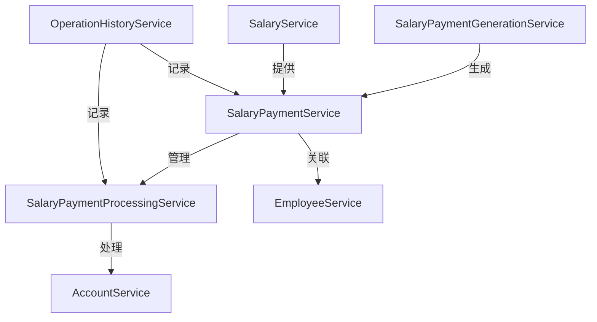
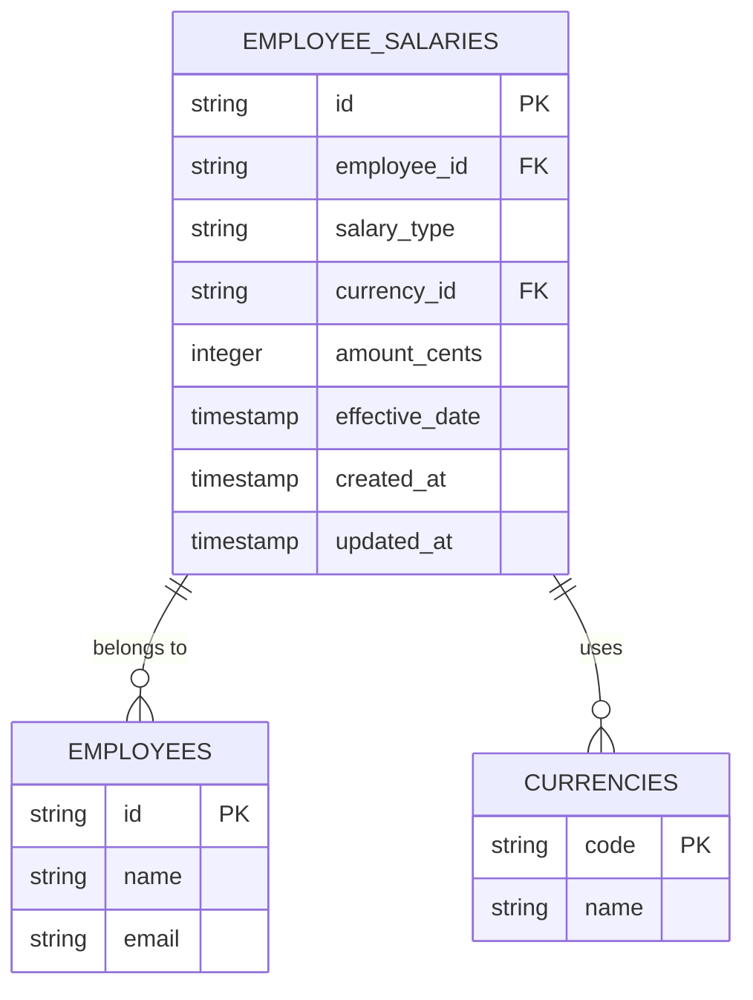
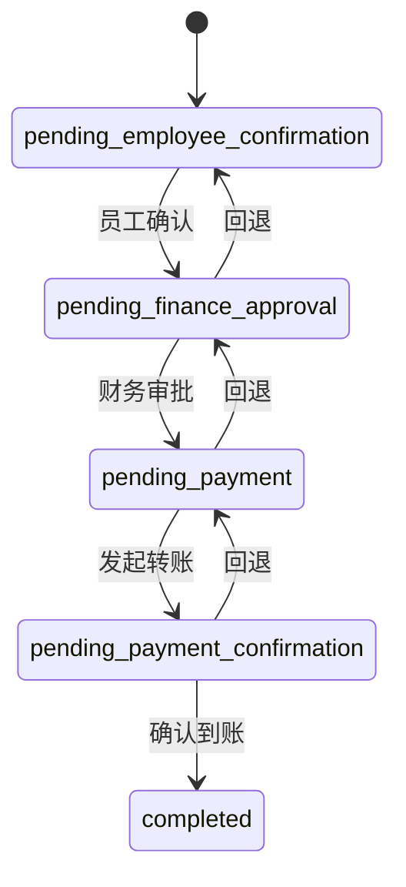
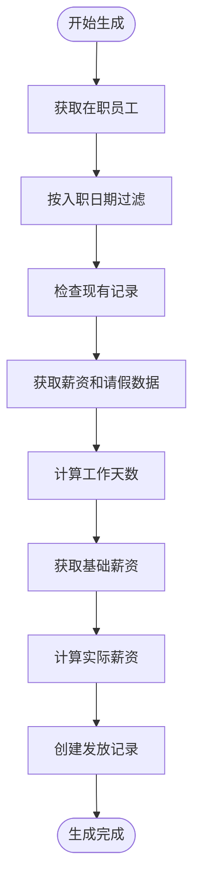
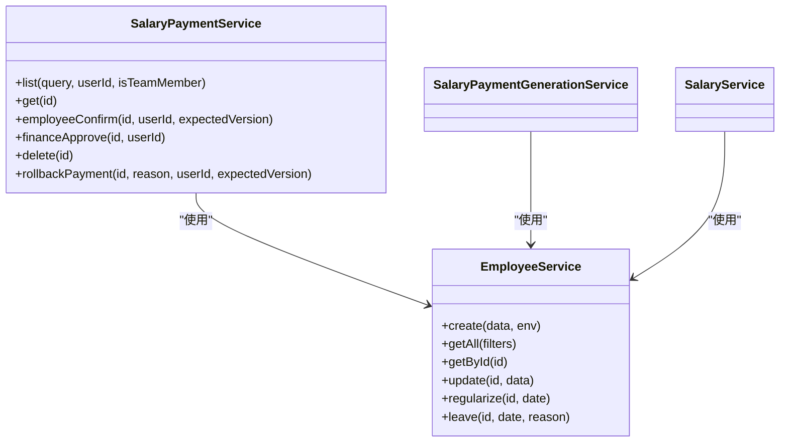
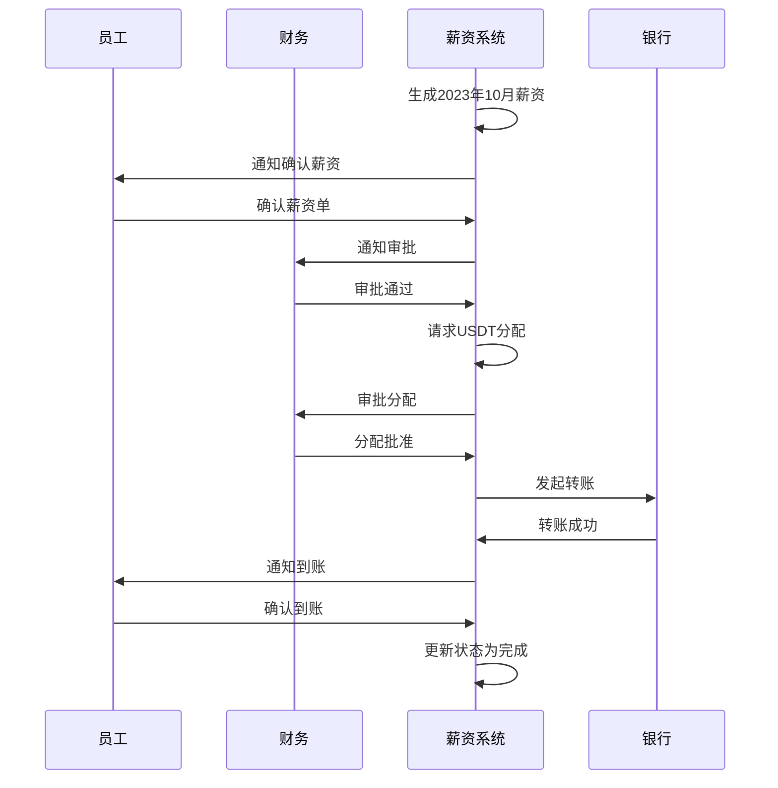

# 薪资管理服务

<cite>
**本文档引用文件**  
- [SalaryService.ts](file://backend/src/services/SalaryService.ts)
- [SalaryPaymentService.ts](file://backend/src/services/SalaryPaymentService.ts)
- [SalaryPaymentGenerationService.ts](file://backend/src/services/SalaryPaymentGenerationService.ts)
- [SalaryPaymentProcessingService.ts](file://backend/src/services/SalaryPaymentProcessingService.ts)
- [schema.ts](file://backend/src/db/schema.ts)
- [salary-payments.ts](file://backend/src/routes/v2/salary-payments.ts)
- [EmployeeService.ts](file://backend/src/services/EmployeeService.ts)
- [AccountService.ts](file://backend/src/services/AccountService.ts)
- [state-machine.ts](file://backend/src/utils/state-machine.ts)
</cite>

## 目录
1. [简介](#简介)
2. [核心服务架构](#核心服务架构)
3. [薪资结构管理](#薪资结构管理)
4. [薪资发放流程](#薪资发放流程)
5. [批量生成与处理服务](#批量生成与处理服务)
6. [服务集成与关联](#服务集成与关联)
7. [状态机与错误处理](#状态机与错误处理)
8. [实际流程示例](#实际流程示例)
9. [结论](#结论)

## 简介
薪资管理服务模块是财务系统的核心组件，负责管理员工薪资结构、计算规则、发放周期配置以及完整的薪资发放流程。该模块通过多个协同工作的服务类实现，包括`SalaryService`用于管理基础薪资结构，`SalaryPaymentService`处理发放单的创建与状态管理，`SalaryPaymentGenerationService`负责批量生成薪资数据，以及`SalaryPaymentProcessingService`处理发放执行和异常情况。这些服务与`EmployeeService`和`AccountService`紧密集成，确保薪资数据与员工信息及银行账户正确关联。

## 核心服务架构

薪资管理服务采用分层架构设计，由多个职责明确的服务类组成，每个服务负责特定的业务功能。这种设计遵循单一职责原则，提高了代码的可维护性和可测试性。

**Diagram sources**
- [SalaryPaymentGenerationService.ts](file://backend/src/services/SalaryPaymentGenerationService.ts)
- [SalaryPaymentService.ts](file://backend/src/services/SalaryPaymentService.ts)
- [SalaryPaymentProcessingService.ts](file://backend/src/services/SalaryPaymentProcessingService.ts)
- [AccountService.ts](file://backend/src/services/AccountService.ts)
- [EmployeeService.ts](file://backend/src/services/EmployeeService.ts)

**Section sources**
- [SalaryPaymentGenerationService.ts](file://backend/src/services/SalaryPaymentGenerationService.ts)
- [SalaryPaymentService.ts](file://backend/src/services/SalaryPaymentService.ts)
- [SalaryPaymentProcessingService.ts](file://backend/src/services/SalaryPaymentProcessingService.ts)

## 薪资结构管理

`SalaryService`是管理薪资结构的核心服务，负责处理员工薪资的增删改查操作。它通过`employee_salaries`表存储员工的薪资信息，支持多种薪资类型（如试用期、正式）和多币种薪资配置。

### 薪资结构数据模型

**Diagram sources**
- [schema.ts](file://backend/src/db/schema.ts#L220-L229)
- [migration_add_salary_tables.sql](file://backend/src/db/migration_add_salary_tables.sql#L1-L10)

### 核心功能实现

`SalaryService`提供了以下核心功能：
- **创建薪资**：为员工创建新的薪资记录，支持指定薪资类型和币种。
- **更新薪资**：修改现有薪资金额，支持乐观锁版本控制。
- **批量更新**：删除指定员工和薪资类型的现有记录，并批量插入新记录。
- **查询薪资**：根据员工ID和薪资类型查询薪资列表，包含员工和币种名称。

**Section sources**
- [SalaryService.ts](file://backend/src/services/SalaryService.ts)
- [schema.ts](file://backend/src/db/schema.ts#L220-L229)

## 薪资发放流程

`SalaryPaymentService`是薪资发放流程的核心，负责管理薪资发放单的整个生命周期，从创建、员工确认、财务审批到最终完成。它通过状态机严格控制状态转换，确保流程的合规性。

### 发放单状态机

**Diagram sources**
- [state-machine.ts](file://backend/src/utils/state-machine.ts#L48-L54)
- [SalaryPaymentService.ts](file://backend/src/services/SalaryPaymentService.ts)

### 核心状态转换

`SalaryPaymentService`实现了以下关键状态转换方法：
- **employeeConfirm**：员工确认薪资单，状态从`pending_employee_confirmation`变为`pending_finance_approval`。
- **financeApprove**：财务审批，状态从`pending_finance_approval`变为`pending_payment`。
- **rollbackPayment**：回退操作，允许在特定状态下回退到前一状态。

**Section sources**
- [SalaryPaymentService.ts](file://backend/src/services/SalaryPaymentService.ts)
- [state-machine.ts](file://backend/src/utils/state-machine.ts)

## 批量生成与处理服务

`SalaryPaymentGenerationService`和`SalaryPaymentProcessingService`共同处理薪资发放的执行阶段，前者负责批量生成，后者负责具体的支付处理。

### 批量生成服务

`SalaryPaymentGenerationService`的`generate`方法负责为符合条件的员工批量生成薪资发放记录。其逻辑包括：
1. 获取所有在职员工。
2. 根据入职日期过滤，确保新入职员工从入职当月开始计算。
3. 检查并跳过已存在的发放记录，防止重复生成。
4. 计算实际工作天数，扣除请假天数。
5. 根据员工状态（试用/正式）和优先币种（USDT）确定基础薪资。
6. 按比例计算当月实际应发薪资。

**Diagram sources**
- [SalaryPaymentGenerationService.ts](file://backend/src/services/SalaryPaymentGenerationService.ts)

### 支付处理服务

`SalaryPaymentProcessingService`负责处理支付相关的具体操作：
- **requestAllocation**：请求多币种分配，验证分配总额与薪资金额匹配（允许1%误差）。
- **approveAllocation**：批准分配，支持批准全部或指定分配项。
- **paymentTransfer**：发起转账，指定支付账户。
- **paymentConfirm**：确认支付完成，上传凭证。

**Section sources**
- [SalaryPaymentGenerationService.ts](file://backend/src/services/SalaryPaymentGenerationService.ts)
- [SalaryPaymentProcessingService.ts](file://backend/src/services/SalaryPaymentProcessingService.ts)

## 服务集成与关联

薪资管理服务与其他核心服务紧密集成，形成完整的业务闭环。

### 与EmployeeService集成

`SalaryService`和`SalaryPaymentGenerationService`都依赖`EmployeeService`来获取员工信息。在生成薪资时，会关联`employees`表，获取员工姓名、部门等信息。薪资发放单也直接关联员工ID，确保数据一致性。

**Diagram sources**
- [SalaryPaymentService.ts](file://backend/src/services/SalaryPaymentService.ts)
- [EmployeeService.ts](file://backend/src/services/EmployeeService.ts)

### 与AccountService集成

`SalaryPaymentProcessingService`在处理支付转账时，需要验证和使用`AccountService`管理的银行账户。`paymentTransfer`方法会检查指定账户是否存在且处于激活状态。

**Section sources**
- [SalaryPaymentProcessingService.ts](file://backend/src/services/SalaryPaymentProcessingService.ts)
- [AccountService.ts](file://backend/src/services/AccountService.ts)

## 状态机与错误处理

系统通过状态机和乐观锁机制确保数据一致性和流程正确性。

### 状态机验证

所有状态转换都通过`salaryPaymentStateMachine.validateTransition`进行验证，确保只有预定义的合法转换才能执行。例如，不能从`pending_employee_confirmation`直接跳转到`pending_payment`。

### 乐观锁控制

关键更新操作（如`employeeConfirm`、`paymentTransfer`）都支持乐观锁。通过`expectedVersion`参数和`version`字段，防止并发更新导致的数据覆盖。如果版本号不匹配，操作将失败并抛出业务异常。

### 错误处理机制

服务使用统一的`Errors`工具类抛出各种错误：
- `Errors.NOT_FOUND()`：资源未找到。
- `Errors.BUSINESS_ERROR()`：业务规则违反。
- `Errors.VALIDATION_ERROR()`：输入验证失败。

**Section sources**
- [SalaryPaymentService.ts](file://backend/src/services/SalaryPaymentService.ts)
- [SalaryPaymentProcessingService.ts](file://backend/src/services/SalaryPaymentProcessingService.ts)
- [state-machine.ts](file://backend/src/utils/state-machine.ts)

## 实际流程示例

以下是一个完整的薪资发放流程示例：

**Diagram sources**
- [salary-payments.ts](file://backend/src/routes/v2/salary-payments.ts)
- [SalaryPaymentService.ts](file://backend/src/services/SalaryPaymentService.ts)
- [SalaryPaymentProcessingService.ts](file://backend/src/services/SalaryPaymentProcessingService.ts)

## 结论
薪资管理服务模块通过清晰的分层架构和职责分离，实现了复杂薪资业务的高效管理。`SalaryService`专注于基础薪资结构，`SalaryPaymentService`管理发放流程，`SalaryPaymentGenerationService`和`SalaryPaymentProcessingService`分别处理批量生成和支付执行。通过与`EmployeeService`和`AccountService`的集成，以及状态机和乐观锁的保障，系统确保了数据的准确性和流程的合规性，为企业的薪资管理提供了可靠的技术支持。