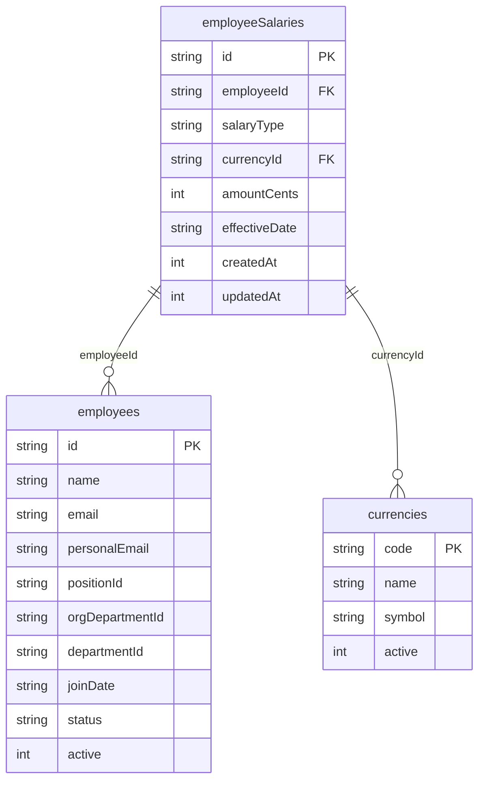
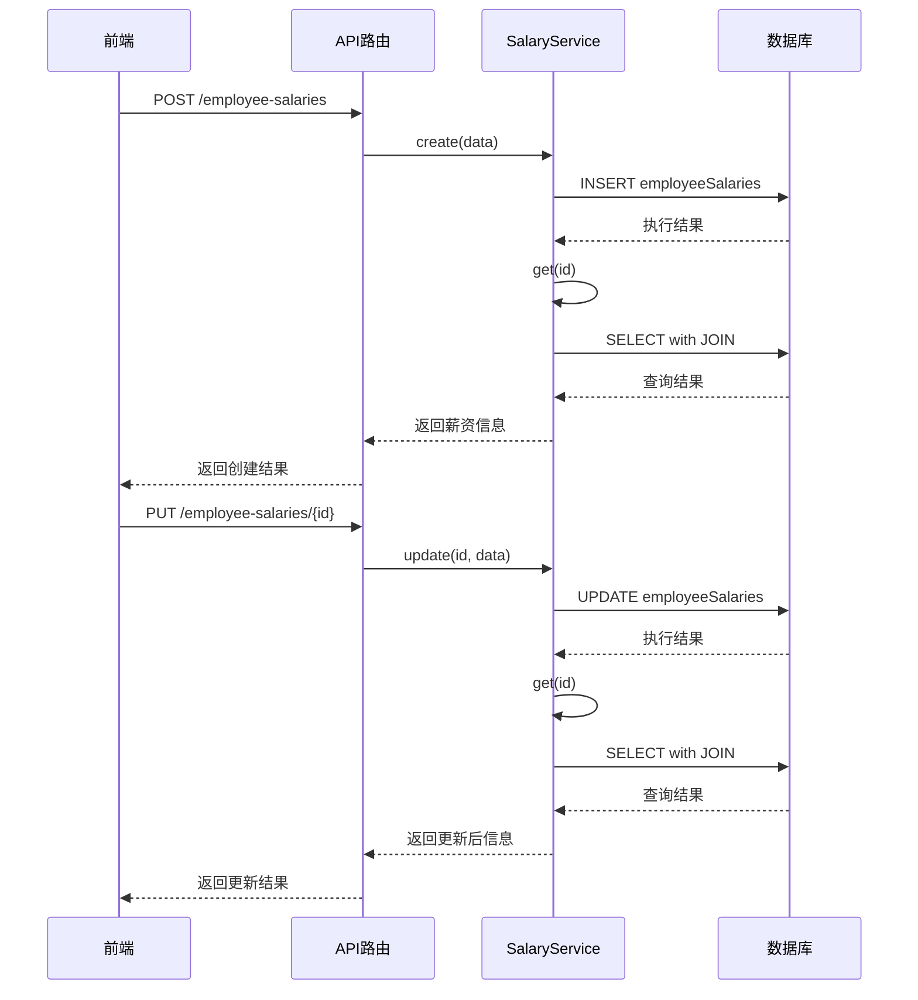
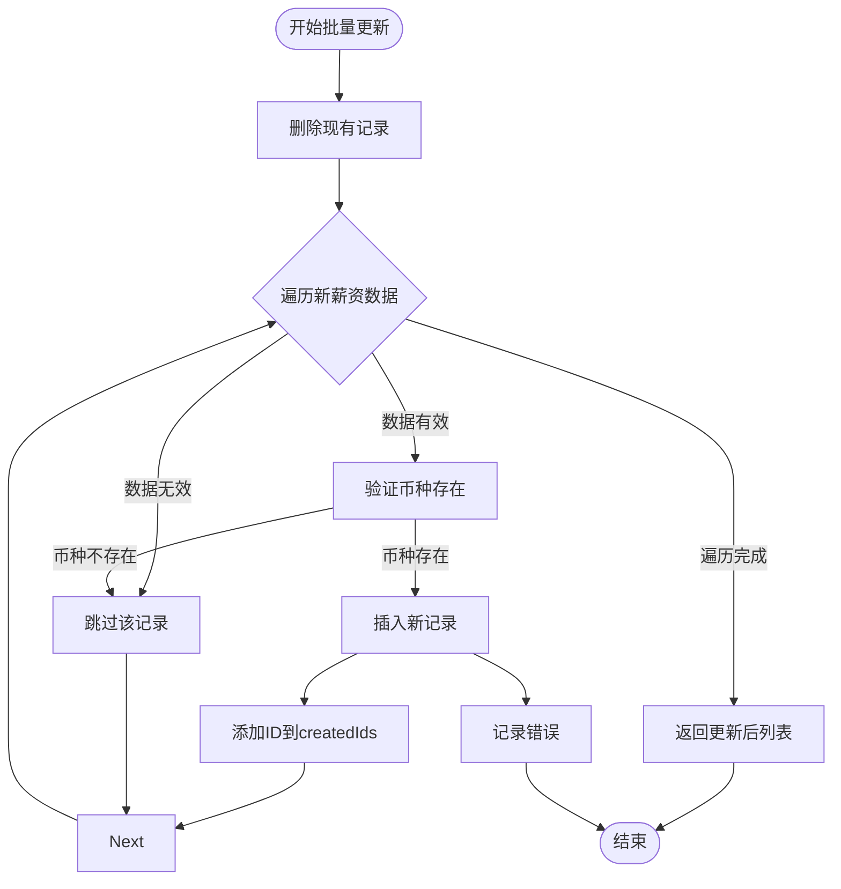
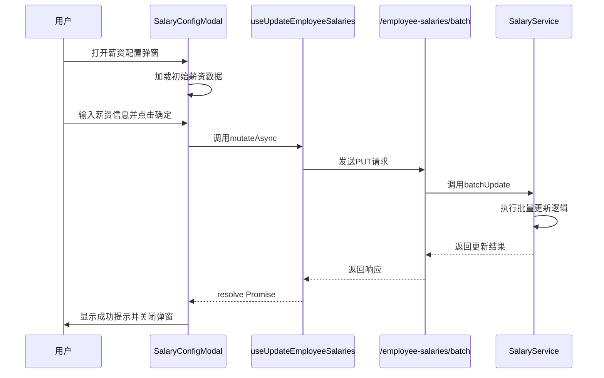

# 薪资配置服务

<cite>
**本文档引用的文件**  
- [SalaryService.ts](file://backend/src/services/SalaryService.ts)
- [employee-salaries.ts](file://backend/src/routes/v2/employee-salaries.ts)
- [schema.ts](file://backend/src/db/schema.ts)
- [SalaryService.test.ts](file://backend/test/services/SalaryService.test.ts)
- [SalaryConfigModal.tsx](file://frontend/src/features/employees/components/modals/SalaryConfigModal.tsx)
- [useEmployees.ts](file://frontend/src/hooks/business/useEmployees.ts)
- [errors.ts](file://backend/src/utils/errors.ts)
</cite>

## 目录
1. [简介](#简介)
2. [核心功能与方法](#核心功能与方法)
3. [数据库表结构](#数据库表结构)
4. [薪资类型管理](#薪资类型管理)
5. [CRUD操作实现](#crud操作实现)
6. [批量更新事务处理](#批量更新事务处理)
7. [员工总薪资计算](#员工总薪资计算)
8. [与EmployeeService的关联关系](#与employeeservice的关联关系)
9. [数据一致性与错误处理](#数据一致性与错误处理)
10. [前端使用示例](#前端使用示例)

## 简介
薪资配置服务（SalaryService）是财务管理系统中的核心模块之一，负责管理员工的薪资结构配置。该服务主要通过操作`employeeSalaries`表来实现对员工薪资的增删改查功能，支持正式工和试用期员工的不同薪资类型管理。服务提供了创建、更新、删除单个薪资记录以及批量更新薪资的接口，并能按币种汇总员工的总薪资。本服务与EmployeeService紧密关联，确保在员工信息变更时薪资配置的同步性。通过数据库事务机制和错误处理策略，保障了数据的一致性和系统的稳定性。

## 核心功能与方法
薪资配置服务提供了一系列核心方法来管理薪资数据，包括`create`、`update`、`delete`、`list`、`get`、`batchUpdate`和`getEmployeeTotalSalary`等。这些方法共同构成了薪资管理的基础功能体系，支持对员工薪资的精细化操作。服务通过Drizzle ORM与数据库交互，确保了查询的安全性和效率。所有方法都遵循统一的错误处理规范，使用自定义的AppError类来封装错误信息，便于前端进行友好的错误提示。

**Section sources**
- [SalaryService.ts](file://backend/src/services/SalaryService.ts#L8-L185)

## 数据库表结构
薪资配置服务主要操作`employeeSalaries`表，该表存储了员工的薪资信息。表结构包含以下字段：`id`（主键）、`employeeId`（员工ID）、`salaryType`（薪资类型）、`currencyId`（币种ID）、`amountCents`（金额，以分为单位）、`effectiveDate`（生效日期）、`createdAt`（创建时间）和`updatedAt`（更新时间）。其中`salaryType`字段用于区分正式工（regular）和试用期员工（probation）的薪资。该表通过外键与`employees`表和`currencies`表关联，确保数据的完整性和一致性。

**Diagram sources**
- [schema.ts](file://backend/src/db/schema.ts#L220-L229)

## 薪资类型管理
薪资配置服务通过`salaryType`字段来区分不同类型的员工薪资，主要支持"probation"（试用期）和"regular"（正式）两种类型。这一设计允许系统为同一员工配置不同的试用期和转正后薪资。在创建或更新薪资记录时，可以通过参数指定薪资类型，若未指定则默认为"regular"。服务在查询时也支持按薪资类型过滤，使得薪资管理更加灵活。这种类型化的设计为后续可能的扩展（如奖金、津贴等）奠定了基础。

**Section sources**
- [employee-salaries.ts](file://backend/src/routes/v2/employee-salaries.ts#L25-L26)
- [SalaryService.ts](file://backend/src/services/SalaryService.ts#L112-L116)

## CRUD操作实现
薪资配置服务实现了完整的CRUD（创建、读取、更新、删除）操作。`create`方法用于新增员工薪资记录，会自动生成唯一ID并设置创建和更新时间戳。`update`方法根据ID更新薪资金额，同时更新时间戳。`delete`方法先查询待删除的记录，若存在则执行删除操作并返回原记录。`list`方法支持按员工ID和薪资类型查询，返回包含币种名称和员工姓名的完整信息。`get`方法根据ID获取单条薪资记录的详细信息。这些操作都通过Drizzle ORM的安全查询方式实现，有效防止了SQL注入风险。

**Diagram sources**
- [SalaryService.ts](file://backend/src/services/SalaryService.ts#L31-L72)
- [employee-salaries.ts](file://backend/src/routes/v2/employee-salaries.ts#L91-L155)

## 批量更新事务处理
`batchUpdate`方法实现了批量薪资更新的原子性操作。该方法首先删除指定员工和薪资类型的所有现有记录，然后逐条插入新的薪资数据。虽然D1数据库不支持传统事务，但该方法通过顺序执行和错误捕获机制来保证操作的完整性。在循环插入过程中，会验证币种是否存在，若不存在则跳过该条记录。所有操作完成后，返回更新后的薪资列表。该方法使用try-catch块捕获异常，并在发生错误时记录日志，确保了操作的可追溯性。这种设计避免了部分更新导致的数据不一致问题。

**Diagram sources**
- [SalaryService.ts](file://backend/src/services/SalaryService.ts#L103-L171)

## 员工总薪资计算
`getEmployeeTotalSalary`方法用于计算员工在各币种下的总薪资。该方法使用SQL的`SUM`聚合函数，按`currencyId`分组统计`amountCents`字段的总和。查询结果返回一个包含`totalCents`和`currencyId`的对象数组，每个对象代表一种币种的总薪资。这种设计使得系统能够准确反映员工的多币种收入情况，为薪资发放和财务报表提供数据支持。该方法不区分薪资类型，计算的是员工所有薪资记录的总和。

**Section sources**
- [SalaryService.ts](file://backend/src/services/SalaryService.ts#L174-L183)

## 与EmployeeService的关联关系
薪资配置服务与EmployeeService存在紧密的业务关联。EmployeeService在创建员工时，虽然不直接创建薪资记录，但为后续的薪资配置提供了基础。两个服务共享`employees`表的数据，通过`employeeId`进行关联。当员工状态变更（如转正、离职）时，EmployeeService会更新员工状态，而薪资配置服务则负责相应调整薪资类型和金额。这种职责分离的设计使得员工管理和薪资管理既独立又协同，提高了系统的模块化程度和可维护性。

**Section sources**
- [EmployeeService.ts](file://backend/src/services/EmployeeService.ts#L11-L757)
- [SalaryService.ts](file://backend/src/services/SalaryService.ts#L8-L185)

## 数据一致性与错误处理
薪资配置服务通过多种机制保证数据一致性。首先，使用Drizzle ORM的类型安全查询，避免了SQL注入和类型错误。其次，在批量更新操作中，通过先删除后插入的策略，确保了数据的原子性。服务还实现了完善的错误处理机制，使用自定义的AppError类来封装错误信息，并通过Logger记录详细的错误日志。在API层面，使用errorHandlerV2中间件统一处理异常，返回结构化的错误响应，便于前端进行错误提示和用户引导。

**Section sources**
- [errors.ts](file://backend/src/utils/errors.ts#L1-L228)
- [SalaryService.ts](file://backend/src/services/SalaryService.ts#L168-L171)

## 前端使用示例
前端通过`SalaryConfigModal`组件与薪资配置服务交互。该组件使用Ant Design的Modal和Form组件构建用户界面，支持多币种薪资的配置。用户在表单中输入币种和金额后，点击确定按钮触发`useUpdateEmployeeSalaries`钩子。该钩子调用`/employee-salaries/batch` API端点，发送批量更新请求。请求数据包括`employeeId`、`salaryType`和`salaries`数组。前端还实现了金额的自动转换（从元到分），确保与后端的金额单位一致。这种设计提供了友好的用户体验，同时保证了数据的准确性。

**Diagram sources**
- [SalaryConfigModal.tsx](file://frontend/src/features/employees/components/modals/SalaryConfigModal.tsx#L1-L104)
- [useEmployees.ts](file://frontend/src/hooks/business/useEmployees.ts#L139-L149)