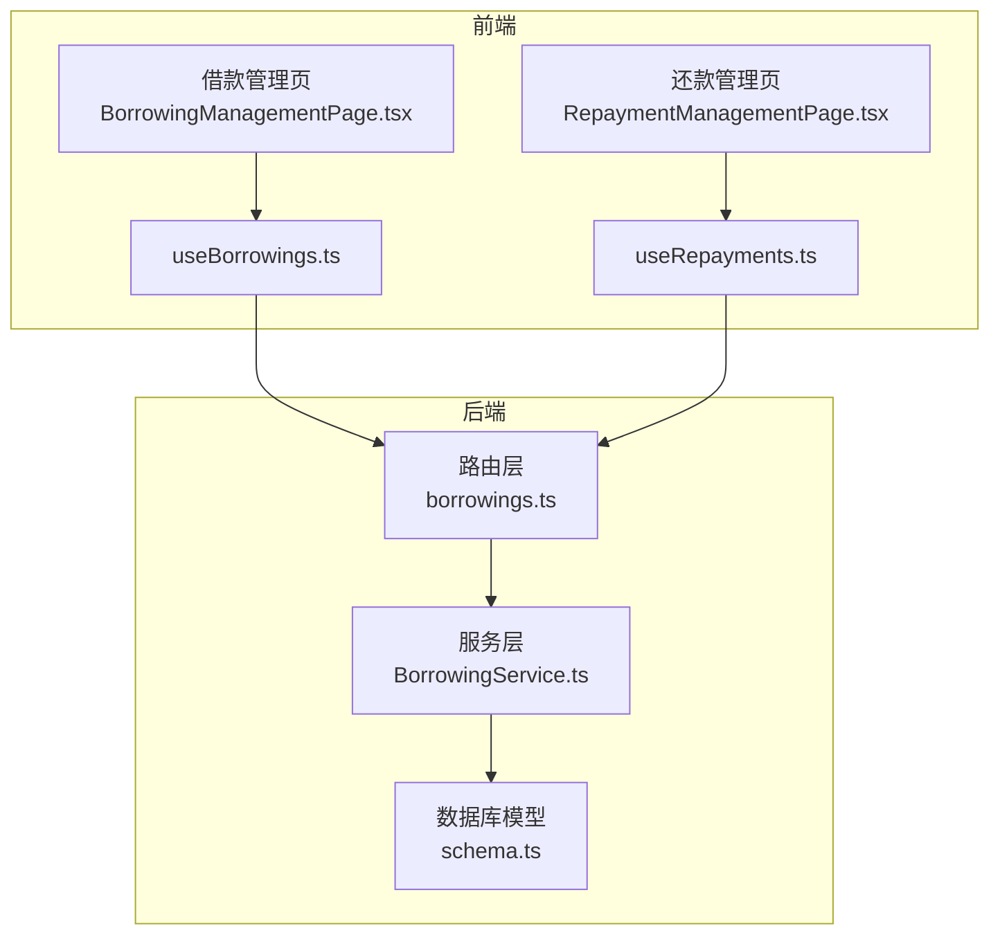
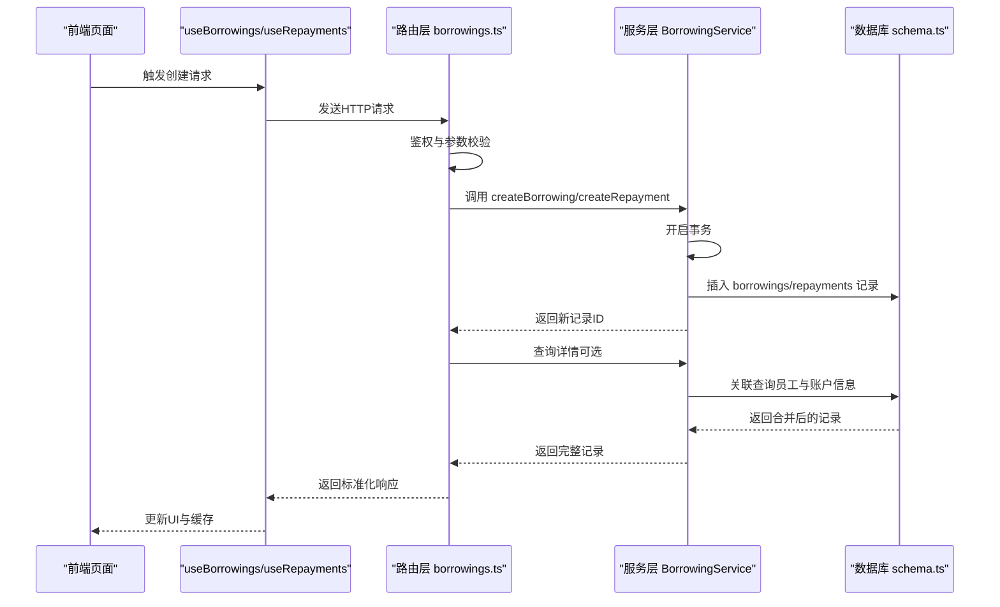
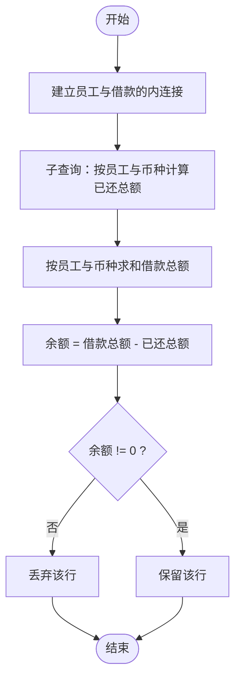
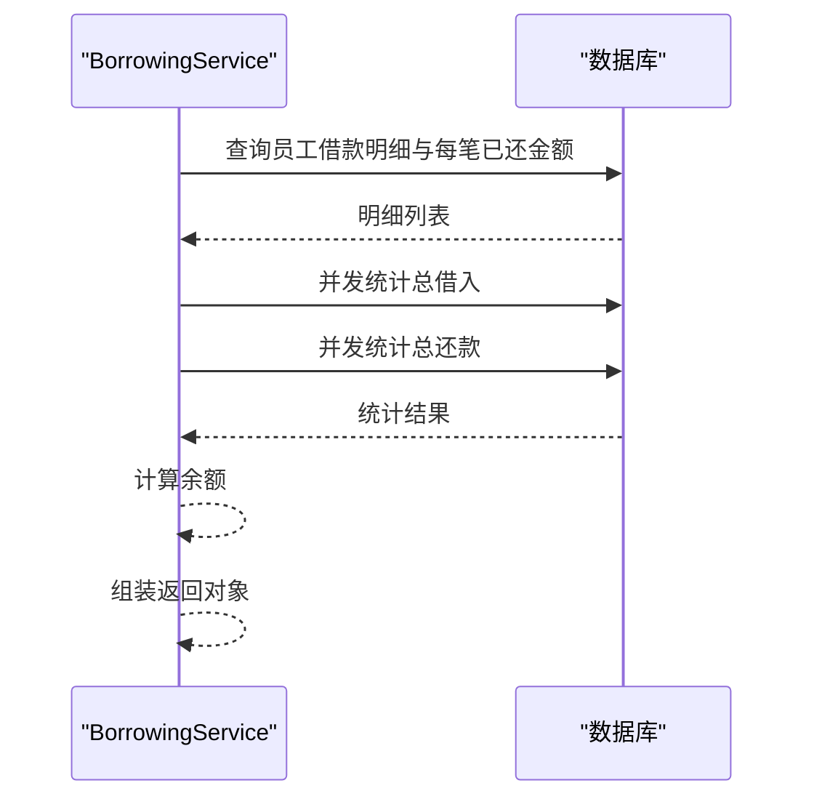
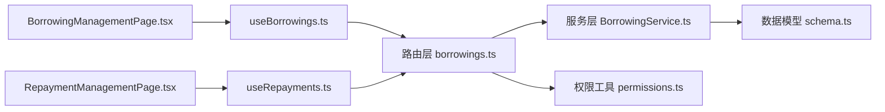
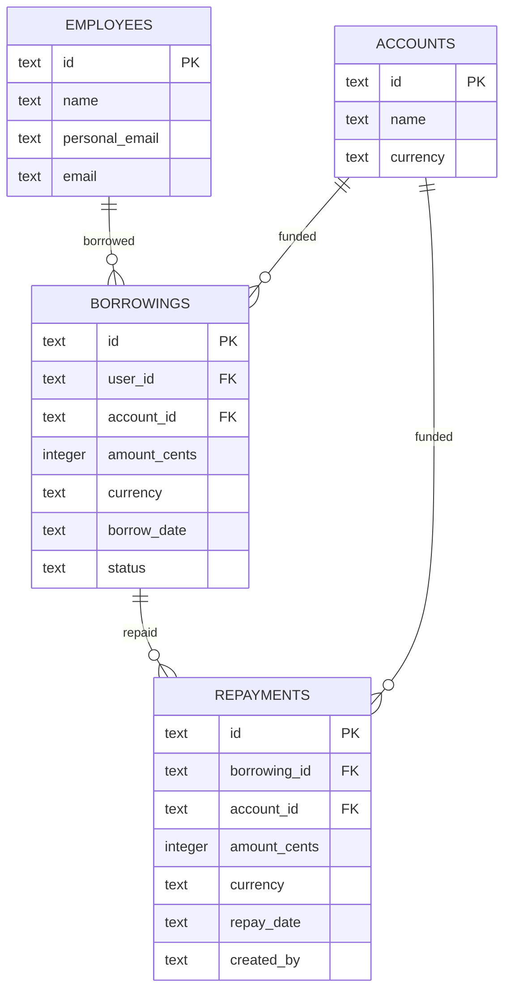

# 借款管理服务

<cite>
**本文引用的文件**
- [BorrowingService.ts](file://backend/src/services/BorrowingService.ts)
- [schema.ts](file://backend/src/db/schema.ts)
- [borrowings.ts](file://backend/src/routes/v2/borrowings.ts)
- [permissions.ts](file://backend/src/utils/permissions.ts)
- [db.ts](file://backend/src/utils/db.ts)
- [BorrowingService.test.ts](file://backend/test/services/BorrowingService.test.ts)
- [BorrowingManagementPage.tsx](file://frontend/src/features/finance/pages/BorrowingManagementPage.tsx)
- [RepaymentManagementPage.tsx](file://frontend/src/features/finance/pages/RepaymentManagementPage.tsx)
- [useBorrowings.ts](file://frontend/src/hooks/business/useBorrowings.ts)
- [useRepayments.ts](file://frontend/src/hooks/business/useRepayments.ts)
</cite>

## 目录
1. [简介](#简介)
2. [项目结构](#项目结构)
3. [核心组件](#核心组件)
4. [架构总览](#架构总览)
5. [详细组件分析](#详细组件分析)
6. [依赖关系分析](#依赖关系分析)
7. [性能考量](#性能考量)
8. [故障排查指南](#故障排查指南)
9. [结论](#结论)
10. [附录](#附录)

## 简介
本文件围绕后端服务层的 BorrowingService，系统性解析其“借款”与“还款”的管理能力，重点覆盖以下方面：
- createBorrowing 与 createRepayment 如何通过数据库事务保证数据一致性
- listBorrowings 与 listRepayments 的关联查询逻辑，如何将借款/还款记录与员工、账户信息进行关联以提供完整的业务视图
- getBorrowingBalances 中复杂的 SQL 子查询与 HAVING 子句，用于按员工与币种维度计算借款总额、已还总额与剩余余额，并筛选非零余额
- getEmployeeBorrowings 为单个员工提供借款明细与统计汇总

同时，结合前端页面与路由层，说明这些能力在实际业务中的使用路径与数据流转。

## 项目结构
后端采用分层架构：
- 路由层：负责请求解析、鉴权与参数校验，调用服务层并返回标准化响应
- 服务层：封装业务逻辑，执行数据库操作，处理复杂查询与事务
- 数据层：Drizzle ORM + D1，定义表结构与查询语句
- 前端页面：提供借款与还款的录入、查询与展示界面

图表来源
- [borrowings.ts](file://backend/src/routes/v2/borrowings.ts#L1-L379)
- [BorrowingService.ts](file://backend/src/services/BorrowingService.ts#L1-L349)
- [schema.ts](file://backend/src/db/schema.ts#L368-L437)

章节来源
- [borrowings.ts](file://backend/src/routes/v2/borrowings.ts#L1-L379)
- [BorrowingService.ts](file://backend/src/services/BorrowingService.ts#L1-L349)
- [schema.ts](file://backend/src/db/schema.ts#L368-L437)

## 核心组件
- BorrowingService：封装借款与还款的增删改查、统计与报表查询
- 路由层 borrowings.ts：暴露 HTTP 接口，负责鉴权、参数校验与分页
- 数据模型 schema.ts：定义 borrowings、repayments、employees、accounts 等表结构
- 权限工具 permissions.ts：提供数据访问范围过滤与角色权限判断
- 前端页面与 Hooks：提供用户交互与数据加载

章节来源
- [BorrowingService.ts](file://backend/src/services/BorrowingService.ts#L1-L349)
- [borrowings.ts](file://backend/src/routes/v2/borrowings.ts#L1-L379)
- [schema.ts](file://backend/src/db/schema.ts#L368-L437)
- [permissions.ts](file://backend/src/utils/permissions.ts#L100-L273)
- [BorrowingManagementPage.tsx](file://frontend/src/features/finance/pages/BorrowingManagementPage.tsx#L1-L167)
- [RepaymentManagementPage.tsx](file://frontend/src/features/finance/pages/RepaymentManagementPage.tsx#L1-L212)
- [useBorrowings.ts](file://frontend/src/hooks/business/useBorrowings.ts#L1-L35)
- [useRepayments.ts](file://frontend/src/hooks/business/useRepayments.ts#L1-L31)

## 架构总览
下面的序列图展示了“创建借款”与“创建还款”的端到端流程，包括鉴权、路由、服务层事务与审计日志。

图表来源
- [borrowings.ts](file://backend/src/routes/v2/borrowings.ts#L147-L209)
- [borrowings.ts](file://backend/src/routes/v2/borrowings.ts#L275-L337)
- [BorrowingService.ts](file://backend/src/services/BorrowingService.ts#L109-L136)
- [BorrowingService.ts](file://backend/src/services/BorrowingService.ts#L230-L257)
- [schema.ts](file://backend/src/db/schema.ts#L368-L437)

## 详细组件分析

### 事务与数据一致性：createBorrowing 与 createRepayment
- createBorrowing
  - 使用数据库事务包裹插入逻辑，确保插入成功或失败整体回滚，避免出现“半写”状态
  - 插入字段包含用户ID、账户ID、金额（分）、币种、借款日期、状态等
  - 返回新生成的记录ID
- createRepayment
  - 同样使用事务插入还款记录，包含还款金额、币种、还款日期、创建人等
  - 返回新生成的记录ID

事务保障的意义在于：当业务流程扩展（例如需要同时更新账户余额或状态字段）时，可以在同一事务内完成，保证原子性与一致性。

章节来源
- [BorrowingService.ts](file://backend/src/services/BorrowingService.ts#L109-L136)
- [BorrowingService.ts](file://backend/src/services/BorrowingService.ts#L230-L257)

### 关联查询：listBorrowings 与 listRepayments
- listBorrowings
  - 分两步：先统计总数，再按分页查询主表
  - 收集 userId 与 accountId，异步并发查询 employees 与 accounts，构建映射表
  - 将员工姓名、邮箱与账户名称、币种合并进结果，形成“带上下文”的完整记录
- listRepayments
  - 通过 LEFT JOIN 关联 borrowings、employees（借款人）、accounts、employees（创建人）
  - 使用别名解决自连接问题，确保“创建人”信息正确
  - 支持 where 条件过滤与排序

这些查询通过“二次查询+映射”的方式，避免了 N+1 查询问题，提升了性能与可读性。

章节来源
- [BorrowingService.ts](file://backend/src/services/BorrowingService.ts#L19-L81)
- [BorrowingService.ts](file://backend/src/services/BorrowingService.ts#L138-L195)
- [borrowings.ts](file://backend/src/routes/v2/borrowings.ts#L101-L145)
- [borrowings.ts](file://backend/src/routes/v2/borrowings.ts#L211-L273)

### 复杂统计：getBorrowingBalances（按员工与币种的余额）
该方法的核心目标是按“员工+币种”维度计算：
- 借款总额
- 已还总额
- 剩余余额（总额-已还）

实现要点：
- 使用别名 e（employees）与 b（borrowings），通过内连接建立员工与借款的关系
- 子查询计算“某员工在某币种下的已还总额”，子查询内部再次子查询限定借款ID集合
- 使用 COALESCE 保证空值安全
- GROUP BY e.id, e.name, e.personalEmail, b.currency
- HAVING 子句筛选“余额 != 0”的记录，避免返回零余额行

图表来源
- [BorrowingService.ts](file://backend/src/services/BorrowingService.ts#L259-L294)

章节来源
- [BorrowingService.ts](file://backend/src/services/BorrowingService.ts#L259-L294)

### 单员工明细与汇总：getEmployeeBorrowings
该方法提供单个员工的两类信息：
- 借款明细：每笔借款及其已还金额
- 统计汇总：总借入、总还款、余额

实现要点：
- 主查询：LEFT JOIN accounts 与 repayments，按借款分组，计算每笔借款的已还金额
- 并行统计：使用 Promise.all 并发计算总借入与总还款，避免多次扫描
- 结果组装：将明细与统计汇总合并返回

图表来源
- [BorrowingService.ts](file://backend/src/services/BorrowingService.ts#L296-L347)

章节来源
- [BorrowingService.ts](file://backend/src/services/BorrowingService.ts#L296-L347)

### 前端集成与使用
- 借款管理页
  - 提供新建借款表单，选择员工、币种、账户、金额与日期
  - 列表展示带员工与账户上下文的数据
- 还款管理页
  - 提供新建还款表单，选择借款记录、币种、账户、金额与日期
  - 列表支持按借款人与币种筛选
- Hooks
  - useBorrowings/useRepayments 负责数据加载与缓存失效策略
  - useCreateBorrowing/useCreateRepayment 负责提交与缓存更新

章节来源
- [BorrowingManagementPage.tsx](file://frontend/src/features/finance/pages/BorrowingManagementPage.tsx#L1-L167)
- [RepaymentManagementPage.tsx](file://frontend/src/features/finance/pages/RepaymentManagementPage.tsx#L1-L212)
- [useBorrowings.ts](file://frontend/src/hooks/business/useBorrowings.ts#L1-L35)
- [useRepayments.ts](file://frontend/src/hooks/business/useRepayments.ts#L1-L31)

## 依赖关系分析
- 服务层依赖 Drizzle ORM 与 schema 定义
- 路由层依赖权限工具与响应封装
- 前端依赖 Hooks 与页面组件

图表来源
- [borrowings.ts](file://backend/src/routes/v2/borrowings.ts#L1-L379)
- [BorrowingService.ts](file://backend/src/services/BorrowingService.ts#L1-L349)
- [schema.ts](file://backend/src/db/schema.ts#L368-L437)
- [permissions.ts](file://backend/src/utils/permissions.ts#L100-L273)
- [BorrowingManagementPage.tsx](file://frontend/src/features/finance/pages/BorrowingManagementPage.tsx#L1-L167)
- [RepaymentManagementPage.tsx](file://frontend/src/features/finance/pages/RepaymentManagementPage.tsx#L1-L212)
- [useBorrowings.ts](file://frontend/src/hooks/business/useBorrowings.ts#L1-L35)
- [useRepayments.ts](file://frontend/src/hooks/business/useRepayments.ts#L1-L31)

章节来源
- [borrowings.ts](file://backend/src/routes/v2/borrowings.ts#L1-L379)
- [BorrowingService.ts](file://backend/src/services/BorrowingService.ts#L1-L349)
- [schema.ts](file://backend/src/db/schema.ts#L368-L437)
- [permissions.ts](file://backend/src/utils/permissions.ts#L100-L273)
- [BorrowingManagementPage.tsx](file://frontend/src/features/finance/pages/BorrowingManagementPage.tsx#L1-L167)
- [RepaymentManagementPage.tsx](file://frontend/src/features/finance/pages/RepaymentManagementPage.tsx#L1-L212)
- [useBorrowings.ts](file://frontend/src/hooks/business/useBorrowings.ts#L1-L35)
- [useRepayments.ts](file://frontend/src/hooks/business/useRepayments.ts#L1-L31)

## 性能考量
- 关联查询优化
  - listBorrowings 与 listRepayments 通过收集 ID 后并发查询关联表，减少 N+1 查询
- 统计查询优化
  - getBorrowingBalances 使用子查询与聚合，避免在应用层做大量内存计算
  - HAVING 子句提前过滤零余额，减少返回数据量
- 并行统计
  - getEmployeeBorrowings 对总借入与总还款使用 Promise.all 并行计算，降低等待时间
- 分页与排序
  - 路由层统一处理分页与排序，避免一次性加载过多数据

[本节为通用性能建议，不直接分析具体代码文件]

## 故障排查指南
- 事务未生效
  - 确认 createBorrowing 与 createRepayment 是否在事务块内执行
  - 检查数据库驱动与 D1 的事务支持情况
- 关联查询结果为空
  - 检查 employees 与 accounts 表中是否存在对应 ID
  - 确认 listBorrowings/listRepayments 的 where 条件是否过于严格
- 余额统计异常
  - 检查 getBorrowingBalances 的子查询逻辑与币种匹配条件
  - 确认 HAVING 子句是否导致零余额被过滤
- 权限导致无数据
  - 检查 getDataAccessFilter 生成的 where 条件
  - 确认用户职位层级与组织/部门字段是否正确

章节来源
- [BorrowingService.ts](file://backend/src/services/BorrowingService.ts#L19-L81)
- [BorrowingService.ts](file://backend/src/services/BorrowingService.ts#L138-L195)
- [BorrowingService.ts](file://backend/src/services/BorrowingService.ts#L259-L294)
- [borrowings.ts](file://backend/src/routes/v2/borrowings.ts#L361-L378)
- [permissions.ts](file://backend/src/utils/permissions.ts#L196-L263)

## 结论
BorrowingService 在借款与还款管理方面提供了完善的事务保障、高效的关联查询与强大的统计能力。通过合理的子查询与 HAVING 过滤，实现了按员工与币种维度的余额统计；通过并发查询与并行统计，提升了整体性能。前端页面与 Hooks 的配合，使得业务操作直观高效。建议在后续迭代中持续关注权限过滤的边界与统计口径的一致性，确保数据准确性与用户体验。

[本节为总结性内容，不直接分析具体代码文件]

## 附录

### 数据模型概览（与借款/还款相关）

图表来源
- [schema.ts](file://backend/src/db/schema.ts#L14-L48)
- [schema.ts](file://backend/src/db/schema.ts#L139-L149)
- [schema.ts](file://backend/src/db/schema.ts#L368-L383)
- [schema.ts](file://backend/src/db/schema.ts#L426-L437)

### 测试用例参考
- createBorrowing 与 createRepayment 的基本流程验证
- getEmployeeBorrowings 的统计断言
- getBorrowingBalances 的余额断言

章节来源
- [BorrowingService.test.ts](file://backend/test/services/BorrowingService.test.ts#L1-L198)