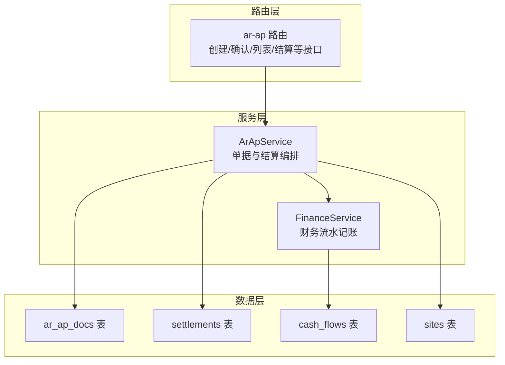
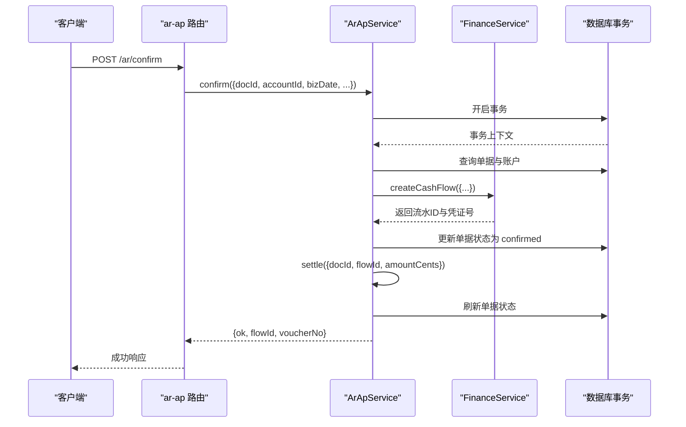
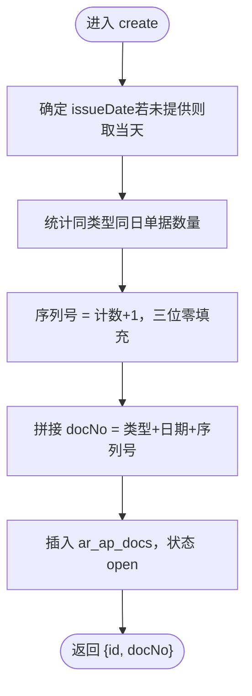
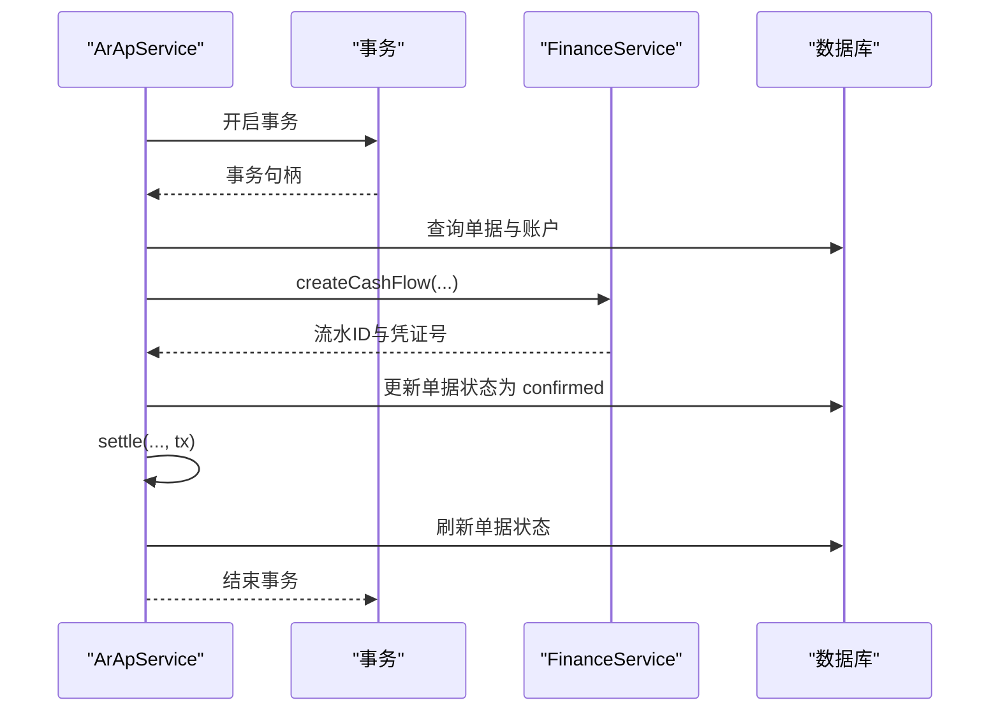
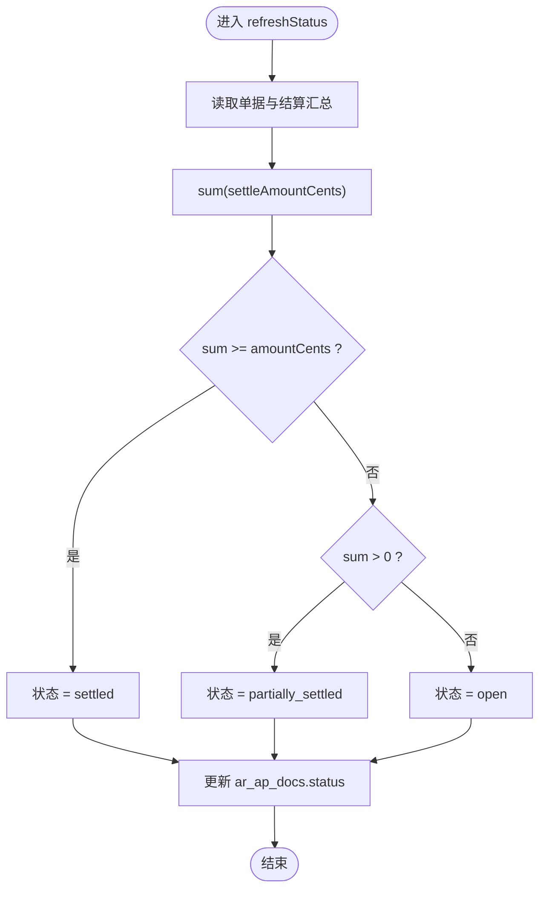
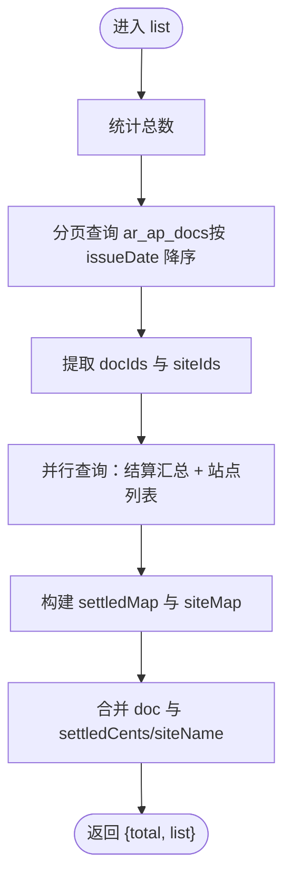
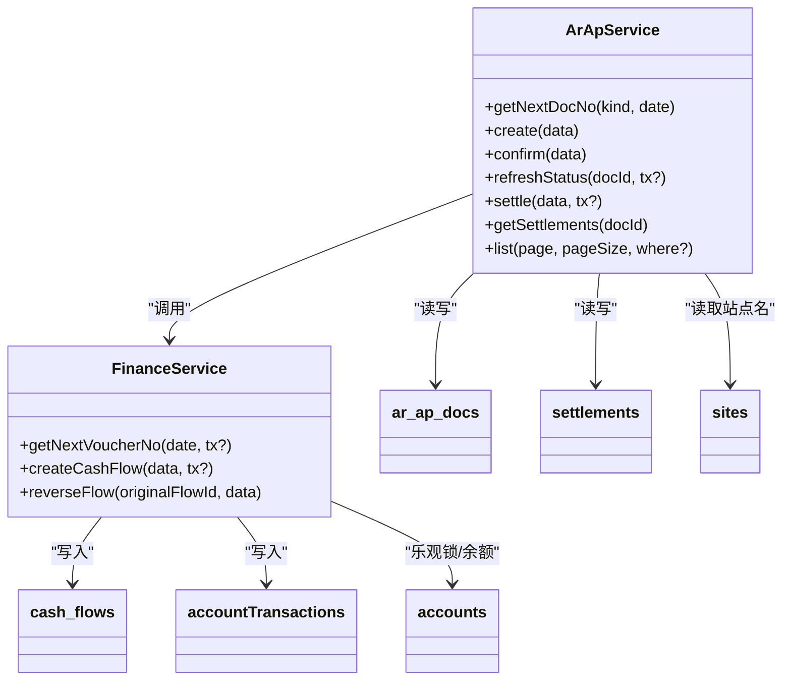

# 应收应付服务

<cite>
**本文引用的文件**
- [ArApService.ts](file://backend/src/services/ArApService.ts)
- [FinanceService.ts](file://backend/src/services/FinanceService.ts)
- [ar-ap.ts](file://backend/src/routes/v2/ar-ap.ts)
- [ArApService.test.ts](file://backend/test/services/ArApService.test.ts)
- [schema.ts](file://backend/src/db/schema.ts)
- [finance-core.test.ts](file://backend/test/routes/finance-core.test.ts)
</cite>

## 目录
1. [简介](#简介)
2. [项目结构](#项目结构)
3. [核心组件](#核心组件)
4. [架构总览](#架构总览)
5. [详细组件分析](#详细组件分析)
6. [依赖关系分析](#依赖关系分析)
7. [性能考量](#性能考量)
8. [故障排查指南](#故障排查指南)
9. [结论](#结论)
10. [附录](#附录)

## 简介
本文件深入解析 ArApService 的核心功能，覆盖应收（AR）与应付（AP）单据的全生命周期管理。重点内容包括：
- create 方法如何基于“单据类型+开票日期”生成唯一单据编号（docNo），并创建 AR/AP 记录；
- confirm 方法在单个数据库事务中完成三件事：调用 FinanceService.createCashFlow 创建实际财务流水；将单据状态更新为 confirmed；调用 settle 方法创建结算记录，从而实现业务状态与财务记账的最终一致；
- refreshStatus 方法根据结算总金额动态更新单据状态（open、partially_settled、settled）；
- list 方法如何聚合单据信息、已结算金额与关联站点名称，并返回分页结果。

## 项目结构
ArApService 位于后端服务层，负责 AR/AP 单据与结算的业务编排；FinanceService 负责财务流水与账户交易的记账逻辑；路由层提供对外接口，封装权限校验与审计日志。

图表来源
- [ArApService.ts](file://backend/src/services/ArApService.ts#L1-L264)
- [FinanceService.ts](file://backend/src/services/FinanceService.ts#L1-L443)
- [ar-ap.ts](file://backend/src/routes/v2/ar-ap.ts#L56-L159)
- [schema.ts](file://backend/src/db/schema.ts#L352-L447)

章节来源
- [ArApService.ts](file://backend/src/services/ArApService.ts#L1-L264)
- [FinanceService.ts](file://backend/src/services/FinanceService.ts#L1-L443)
- [ar-ap.ts](file://backend/src/routes/v2/ar-ap.ts#L56-L159)
- [schema.ts](file://backend/src/db/schema.ts#L352-L447)

## 核心组件
- ArApService：负责 AR/AP 单据的创建、确认、结算、状态刷新与列表聚合。
- FinanceService：负责生成凭证号、创建现金流水与账户交易流水，维护账户余额与并发控制。
- 路由层：提供对外 API，进行权限校验、参数校验与审计日志。

章节来源
- [ArApService.ts](file://backend/src/services/ArApService.ts#L1-L264)
- [FinanceService.ts](file://backend/src/services/FinanceService.ts#L1-L443)
- [ar-ap.ts](file://backend/src/routes/v2/ar-ap.ts#L56-L159)

## 架构总览
ArApService 在 confirm 中通过数据库事务串联三个关键步骤：
1) 校验单据与账户有效性；
2) 调用 FinanceService.createCashFlow 创建财务流水（含凭证号、账户余额校验与乐观锁）；
3) 更新单据状态为 confirmed；
4) 调用 settle 创建结算记录，并自动刷新单据状态。

图表来源
- [ArApService.ts](file://backend/src/services/ArApService.ts#L178-L243)
- [FinanceService.ts](file://backend/src/services/FinanceService.ts#L70-L229)
- [ar-ap.ts](file://backend/src/routes/v2/ar-ap.ts#L373-L437)

章节来源
- [ArApService.ts](file://backend/src/services/ArApService.ts#L178-L243)
- [FinanceService.ts](file://backend/src/services/FinanceService.ts#L70-L229)
- [ar-ap.ts](file://backend/src/routes/v2/ar-ap.ts#L373-L437)

## 详细组件分析

### create：生成唯一单据编号并创建 AR/AP 记录
- 编号规则：docNo = 类型前缀 + “去掉短横线的日期” + “当日该类型单据计数的三位零填充序列号”。例如 AR20230103-001。
- 生成逻辑：按“单据类型 + 开票日期”统计已有数量，序列号为计数+1，不足三位补零。
- 创建流程：插入 ar_ap_docs，初始状态 open，返回 id 与 docNo。

图表来源
- [ArApService.ts](file://backend/src/services/ArApService.ts#L14-L25)
- [ArApService.ts](file://backend/src/services/ArApService.ts#L84-L118)
- [finance-core.test.ts](file://backend/test/routes/finance-core.test.ts#L313-L345)

章节来源
- [ArApService.ts](file://backend/src/services/ArApService.ts#L14-L25)
- [ArApService.ts](file://backend/src/services/ArApService.ts#L84-L118)
- [finance-core.test.ts](file://backend/test/routes/finance-core.test.ts#L313-L345)

### confirm：复合业务逻辑与事务一致性
- 事务内执行：
  1) 校验单据存在且未确认；
  2) 校验账户有效；
  3) 调用 FinanceService.createCashFlow 创建现金流水（含凭证号生成、余额校验、乐观锁）；
  4) 更新单据状态为 confirmed；
  5) 调用 settle 创建结算记录，随后刷新单据状态。
- 返回值：包含 ok、flowId、voucherNo，确保业务状态与财务记账一致。

图表来源
- [ArApService.ts](file://backend/src/services/ArApService.ts#L178-L243)
- [FinanceService.ts](file://backend/src/services/FinanceService.ts#L70-L229)

章节来源
- [ArApService.ts](file://backend/src/services/ArApService.ts#L178-L243)
- [ArApService.test.ts](file://backend/test/services/ArApService.test.ts#L131-L166)
- [FinanceService.ts](file://backend/src/services/FinanceService.ts#L70-L229)

### refreshStatus：根据结算总额动态更新单据状态
- 逻辑：
  - 若结算总额 ≥ 单据总金额，则状态置为 settled；
  - 若结算总额 > 0 且小于总金额，则状态置为 partially_settled；
  - 否则为 open。
- 该方法在 settle 完成后被调用，保证状态与结算事实一致。

图表来源
- [ArApService.ts](file://backend/src/services/ArApService.ts#L120-L140)

章节来源
- [ArApService.ts](file://backend/src/services/ArApService.ts#L120-L140)

### list：聚合单据信息、已结算金额与站点名称
- 分页与总数：先统计总数，再按 issueDate 降序分页查询单据。
- 关联数据：
  - 并行查询结算汇总（按 docId 分组求和）；
  - 并行查询站点列表（按 siteId 去重）。
- 输出：每个条目包含 doc、settledCents、siteName（若存在 siteId）。

图表来源
- [ArApService.ts](file://backend/src/services/ArApService.ts#L27-L82)
- [ar-ap.ts](file://backend/src/routes/v2/ar-ap.ts#L136-L159)

章节来源
- [ArApService.ts](file://backend/src/services/ArApService.ts#L27-L82)
- [ar-ap.ts](file://backend/src/routes/v2/ar-ap.ts#L136-L159)

## 依赖关系分析
- ArApService 依赖：
  - 数据库表：ar_ap_docs、settlements、sites、accounts、cash_flows；
  - FinanceService：用于创建现金流水；
  - 错误工具：统一错误码与业务异常抛出。
- FinanceService 依赖：
  - 数据库表：cash_flows、accountTransactions、accounts、categories、sites、departments、employees、currencies；
  - 乐观锁：通过 accounts.version 实现账户级并发控制；
  - 凭证号生成：按业务日期生成 JZ 前缀流水号。

图表来源
- [ArApService.ts](file://backend/src/services/ArApService.ts#L1-L264)
- [FinanceService.ts](file://backend/src/services/FinanceService.ts#L1-L443)
- [schema.ts](file://backend/src/db/schema.ts#L159-L447)

章节来源
- [ArApService.ts](file://backend/src/services/ArApService.ts#L1-L264)
- [FinanceService.ts](file://backend/src/services/FinanceService.ts#L1-L443)
- [schema.ts](file://backend/src/db/schema.ts#L159-L447)

## 性能考量
- 并行查询：list 中对结算汇总与站点列表采用并行查询，减少往返等待。
- 分页与排序：按 issueDate 降序分页，避免全表扫描。
- 乐观锁：FinanceService 对账户版本号进行 CAS 更新，避免余额并发竞争。
- 复杂度评估：
  - list：O(n) 文档读取 + O(m) 结算汇总 + O(k) 站点映射，n 为分页大小，m/k 为 docIds 与 siteIds 数量。
  - confirm：一次事务内多次读写，受索引与约束影响，建议在 ar_ap_docs.kind、issueDate、dueDate、status 上建立合适索引以提升查询效率。

[本节为通用性能讨论，不直接分析具体文件]

## 故障排查指南
- 单据已确认：confirm 时若单据状态已是 confirmed，将抛出业务异常。请先检查单据状态或撤销后再确认。
- 账户无效或停用：confirm 时若账户不存在或未激活，将抛出业务异常。请核对 accountId 与账户状态。
- 余额不足：FinanceService.createCashFlow 在支出场景下会校验余额，不足时抛出业务异常。请检查账户余额与历史交易。
- 并发冲突：FinanceService.createCashFlow 使用账户版本号乐观锁，若并发过高可能触发冲突错误。建议重试或降低并发。
- 单据不存在：confirm 与 refreshStatus 均会在找不到单据时抛出错误，请确认 docId 正确。

章节来源
- [ArApService.ts](file://backend/src/services/ArApService.ts#L178-L243)
- [FinanceService.ts](file://backend/src/services/FinanceService.ts#L146-L189)

## 结论
ArApService 将 AR/AP 单据的业务状态与财务记账紧密耦合：通过 confirm 的事务性编排，确保单据状态与结算记录、财务流水保持最终一致；通过 refreshStatus 与 list 的聚合能力，实现对单据状态与报表展示的高效支撑。FinanceService 的凭证号生成与乐观锁机制进一步保障了记账的正确性与一致性。

[本节为总结性内容，不直接分析具体文件]

## 附录
- 接口与数据模型参考：
  - 路由层提供创建、确认、列表、结算等接口，返回结构包含 items、total、pagination 等。
  - 单据与结算的数据模型定义于 schema.ts，涵盖 ar_ap_docs、settlements、cash_flows、sites 等表。

章节来源
- [ar-ap.ts](file://backend/src/routes/v2/ar-ap.ts#L56-L159)
- [schema.ts](file://backend/src/db/schema.ts#L352-L447)