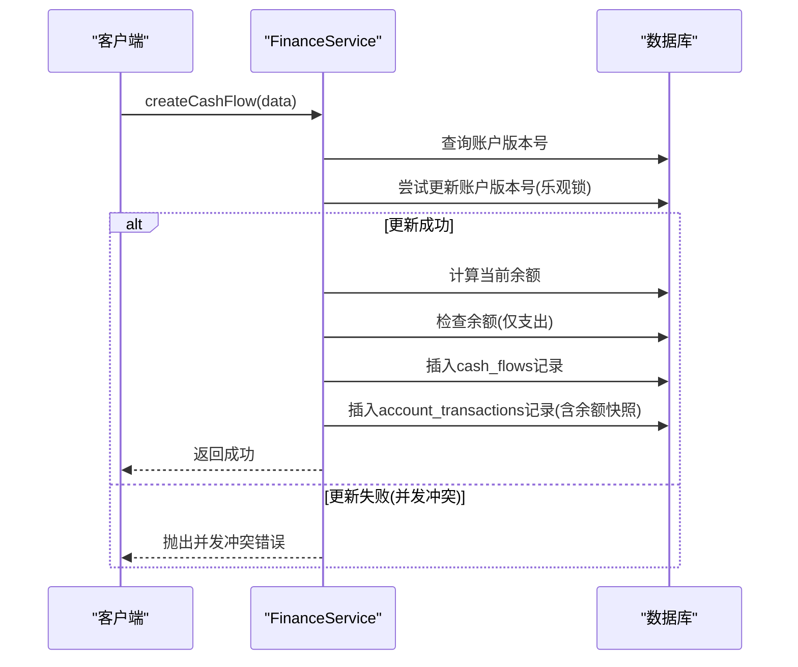
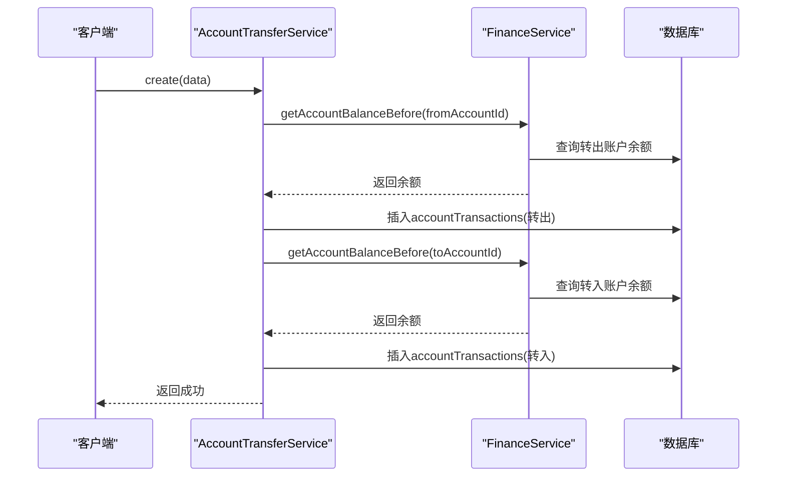
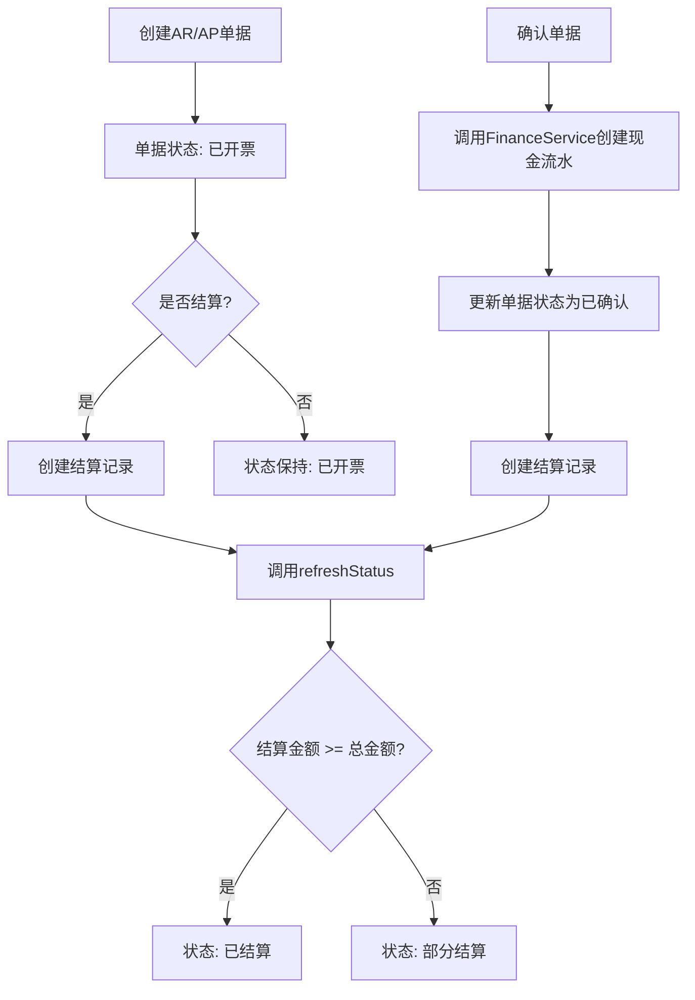
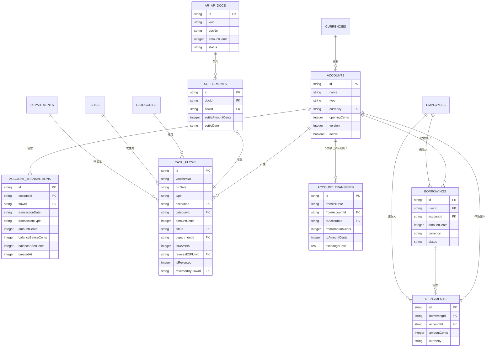

# 财务管理服务

<cite>
**本文档引用的文件**  
- [FinanceService.ts](file://backend/src/services/FinanceService.ts)
- [AccountService.ts](file://backend/src/services/AccountService.ts)
- [AccountTransferService.ts](file://backend/src/services/AccountTransferService.ts)
- [ArApService.ts](file://backend/src/services/ArApService.ts)
- [BorrowingService.ts](file://backend/src/services/BorrowingService.ts)
- [schema.ts](file://backend/src/db/schema.ts)
- [flows.ts](file://backend/src/routes/v2/flows.ts)
- [ar-ap.ts](file://backend/src/routes/v2/ar-ap.ts)
- [account-transfers.ts](file://backend/src/routes/v2/account-transfers.ts)
- [borrowings.ts](file://backend/src/routes/v2/borrowings.ts)
- [di.ts](file://backend/src/middleware/di.ts)
</cite>

## 目录
1. [财务管理服务概述](#财务管理服务概述)
2. [核心服务组件分析](#核心服务组件分析)
3. [财务核心服务（FinanceService）](#财务核心服务financeservice)
4. [账户管理服务（AccountService）](#账户管理服务accountservice)
5. [资金划转服务（AccountTransferService）](#资金划转服务accounttransferservice)
6. [应收应付管理服务（ArApService）](#应收应付管理服务arapservice)
7. [借款管理服务（BorrowingService）](#借款管理服务borrowingservice)
8. [服务协同与复杂业务流程](#服务协同与复杂业务流程)
9. [数据模型与架构](#数据模型与架构)
10. [结论](#结论)

## 财务管理服务概述

财务管理服务层是企业财务系统的核心，负责处理所有与资金流动、账户管理、应收应付、借款等相关的业务逻辑。该服务层由多个高度内聚的服务类组成，它们通过清晰的职责划分和紧密的协作，确保了财务操作的准确性、一致性和可追溯性。本服务层的设计遵循了领域驱动设计（DDD）原则，将复杂的财务业务逻辑封装在独立的服务中，通过依赖注入（DI）进行协调，从而实现了高内聚、低耦合的架构。

**Section sources**
- [FinanceService.ts](file://backend/src/services/FinanceService.ts)
- [di.ts](file://backend/src/middleware/di.ts)

## 核心服务组件分析

财务管理服务层由以下几个核心服务构成，它们共同构成了财务业务的基石：

- **`FinanceService`**: 财务核心服务，负责处理最基础的现金流水创建、余额计算和红冲（冲正）等操作，是所有资金变动的最终执行者。
- **`AccountService`**: 账户管理服务，负责账户的增删改查，是所有账户信息的唯一来源。
- **`AccountTransferService`**: 资金划转服务，专门处理账户间的资金转移，它依赖于`FinanceService`来记录交易。
- **`ArApService`**: 应收应付管理服务，负责管理应收账款（AR）和应付账款（AP）的生命周期，包括创建、结算和确认。
- **`BorrowingService`**: 借款管理服务，处理员工借款的申请、还款和余额统计。

这些服务通过`di.ts`中的依赖注入机制进行组装和协调，确保了服务间的松耦合。

**Section sources**
- [FinanceService.ts](file://backend/src/services/FinanceService.ts)
- [AccountService.ts](file://backend/src/services/AccountService.ts)
- [AccountTransferService.ts](file://backend/src/services/AccountTransferService.ts)
- [ArApService.ts](file://backend/src/services/ArApService.ts)
- [BorrowingService.ts](file://backend/src/services/BorrowingService.ts)
- [di.ts](file://backend/src/middleware/di.ts)

## 财务核心服务（FinanceService）

`FinanceService`是整个财务系统的引擎，它直接与数据库交互，执行所有与资金变动相关的原子操作。其核心功能包括：

### 现金流水管理
`FinanceService`提供了创建现金流水（`createCashFlow`）的核心方法。该方法不仅记录了一笔交易，还负责维护账户的余额一致性。其关键实现机制如下：

1.  **余额计算**：在创建流水前，通过`getAccountBalanceBefore`方法，根据交易日期和时间戳，查找该账户在此时间点之前的最后一笔交易，从而确定“期初余额”。如果不存在历史交易，则使用账户的“期初余额”（`openingCents`）。
2.  **乐观锁与并发控制**：为了防止因并发操作导致的余额计算错误，服务采用了乐观锁机制。它通过更新`accounts`表的`version`字段来充当一个“虚拟锁”。在计算余额前，先尝试更新账户版本号，如果更新失败（`changes === 0`），说明有其他并发操作正在修改该账户，此时会抛出冲突异常，要求客户端重试。
3.  **余额校验**：对于支出（`expense`）类型的流水，服务会检查计算出的“期初余额”是否足以覆盖本次支出金额，若不足则抛出“账户余额不足”错误。
4.  **事务性记录**：整个操作在一个数据库事务中完成。它会同时向`cash_flows`表插入流水记录，并向`account_transactions`表插入交易快照，该快照记录了交易前后的余额，确保了余额变化的可追溯性。

### 红冲（冲正）机制
`FinanceService`支持对已创建的流水进行“红冲”操作（`reverseFlow`）。这是一种重要的纠错机制，用于纠正错误的记账。其工作原理是：
1.  创建一条与原流水类型相反（收入变支出，支出变收入）、金额相同的“红冲记录”。
2.  在`cash_flows`表中，通过`isReversal`字段标记此记录为红冲记录，并通过`reversalOfFlowId`字段关联到原始流水。
3.  同时，将原始流水的`isReversed`字段标记为已冲正，并通过`reversedByFlowId`字段关联到红冲记录。
4.  在生成报表时，可以通过过滤`isReversal`或`isReversed`为1的记录来排除这些已冲正的无效数据。

**Diagram sources**
- [FinanceService.ts](file://backend/src/services/FinanceService.ts#L70-L229)
- [schema.ts](file://backend/src/db/schema.ts#L139-L207)

**Section sources**
- [FinanceService.ts](file://backend/src/services/FinanceService.ts#L20-L437)
- [flows.ts](file://backend/src/routes/v2/flows.ts#L327-L426)

## 账户管理服务（AccountService）

`AccountService`负责管理所有财务账户的生命周期，是账户信息的权威来源。

### 核心功能
- **账户查询**：提供`getAccounts`方法，支持通过名称、别名或账号进行模糊搜索，并返回账户及其关联的币种名称。
- **账户创建**：`createAccount`方法在创建新账户时，会验证指定的币种（`currency`）是否存在于`currencies`表中且处于激活状态，否则会抛出错误。
- **账户更新与删除**：`updateAccount`和`deleteAccount`方法提供了对账户信息的修改和删除功能。删除账户时，会先检查该账户是否有关联的流水记录（通过`cashFlows`表），如果有则禁止删除，以保证数据完整性。

该服务通过`accounts`和`currencies`表的关联查询，确保了账户信息的完整性和准确性。

**Section sources**
- [AccountService.ts](file://backend/src/services/AccountService.ts#L12-L165)
- [schema.ts](file://backend/src/db/schema.ts#L139-L213)

## 资金划转服务（AccountTransferService）

`AccountTransferService`专门处理账户间的资金划转，它协调了转出和转入两个账户的交易记录。

### 实现机制
- **依赖核心服务**：该服务依赖于`FinanceService`来获取账户的余额和执行交易记录的创建。
- **双账户交易**：当执行一笔划转时，服务会：
    1.  为转出账户创建一笔`transfer_out`类型的交易，金额为负。
    2.  为转入账户创建一笔`transfer_in`类型的交易，金额为正。
- **幂等性与一致性**：整个划转操作被包裹在一个数据库事务中，确保了转出和转入操作的原子性。如果任一操作失败，整个事务将回滚，避免了资金丢失或重复记账的风险。

**Diagram sources**
- [AccountTransferService.ts](file://backend/src/services/AccountTransferService.ts#L7-L124)
- [schema.ts](file://backend/src/db/schema.ts#L448-L476)

**Section sources**
- [AccountTransferService.ts](file://backend/src/services/AccountTransferService.ts#L7-L124)
- [account-transfers.ts](file://backend/src/routes/v2/account-transfers.ts#L119-L184)

## 应收应付管理服务（ArApService）

`ArApService`负责管理应收账款（AR）和应付账款（AP）的完整生命周期。

### 核心流程
1.  **单据创建**：`create`方法用于创建AR/AP单据，系统会根据单据类型（AR/AP）和日期自动生成唯一的单据编号（`docNo`）。
2.  **状态管理**：`refreshStatus`方法会根据已结算金额（`settleAmountCents`）与单据总金额的对比，自动更新单据状态为“已开票”（open）、“部分结算”（partially_settled）或“已结算”（settled）。
3.  **结算与确认**：`settle`方法用于记录一笔结算，而`confirm`方法则是核心的确认操作。它会：
    -   调用`FinanceService.createCashFlow`创建一笔实际的现金流水（收入或支出）。
    -   更新AR/AP单据的状态为“已确认”（confirmed）。
    -   创建一条结算记录（`settlements`），将AR/AP单据与现金流水关联起来。

这种设计将“业务单据”与“财务流水”分离，实现了业务逻辑与财务记账的解耦。

**Diagram sources**
- [ArApService.ts](file://backend/src/services/ArApService.ts#L8-L243)
- [schema.ts](file://backend/src/db/schema.ts#L352-L367)

**Section sources**
- [ArApService.ts](file://backend/src/services/ArApService.ts#L8-L263)
- [ar-ap.ts](file://backend/src/routes/v2/ar-ap.ts#L163-L437)

## 借款管理服务（BorrowingService）

`BorrowingService`专注于员工借款的全流程管理。

### 核心功能
- **借款与还款**：`createBorrowing`和`createRepayment`方法分别用于创建借款申请和还款记录。
- **余额统计**：服务提供了强大的统计功能：
    -   `getEmployeeBorrowings`：获取单个员工的所有借款记录及其已还金额和剩余余额。
    -   `getBorrowingBalances`：生成一个全局的借款余额报表，列出所有有未结清借款的员工及其按币种划分的借款、还款和余额情况。该方法使用了复杂的SQL子查询来计算每个员工的已还款总额。
- **数据关联**：通过`listRepaymentsV2`等方法，服务能够将还款记录与借款、员工、账户等信息进行关联查询，提供完整的视图。

**Section sources**
- [BorrowingService.ts](file://backend/src/services/BorrowingService.ts#L16-L348)
- [borrowings.ts](file://backend/src/routes/v2/borrowings.ts#L147-L337)

## 服务协同与复杂业务流程

多个财务服务通过协同工作，可以完成复杂的业务场景。

### 薪资发放流程
1.  **生成薪资单**：`SalaryPaymentService`生成待发放的薪资单。
2.  **资金划转**：财务人员在前端发起薪资发放操作。
3.  **执行划转**：系统调用`AccountTransferService.create`，从公司工资账户向员工个人账户进行批量资金划转。
4.  **记录流水**：`AccountTransferService`内部调用`FinanceService`，为每一笔划转创建`transfer_in`和`transfer_out`的交易记录。
5.  **更新状态**：`SalaryPaymentService`更新薪资单的发放状态。

### 报销入账流程
1.  **创建应付单**：为员工的报销申请创建一条AP（应付账款）单据。
2.  **确认单据**：财务审核通过后，调用`ArApService.confirm`。
3.  **触发记账**：`confirm`方法内部调用`FinanceService.createCashFlow`，创建一笔支出流水，资金从公司账户转出。
4.  **完成结算**：同时，`confirm`方法会创建结算记录，将AP单据标记为已结算。

这些流程展示了`FinanceService`作为核心，被`AccountTransferService`和`ArApService`等上层服务所依赖，共同构建了完整的财务业务闭环。

**Section sources**
- [FinanceService.ts](file://backend/src/services/FinanceService.ts)
- [AccountTransferService.ts](file://backend/src/services/AccountTransferService.ts)
- [ArApService.ts](file://backend/src/services/ArApService.ts)
- [SalaryPaymentService.ts](file://backend/src/services/SalaryPaymentService.ts)

## 数据模型与架构

财务服务层的数据模型设计清晰，关系明确。

**Diagram sources**
- [schema.ts](file://backend/src/db/schema.ts)

## 结论

财务管理服务层通过精心设计的`FinanceService`、`AccountService`、`AccountTransferService`、`ArApService`和`BorrowingService`等组件，构建了一个健壮、可靠且可扩展的财务处理引擎。其核心亮点在于：
1.  **强一致性保障**：通过乐观锁和数据库事务，确保了在高并发场景下账户余额的准确性。
2.  **清晰的职责分离**：每个服务专注于单一业务领域，降低了系统的复杂性。
3.  **灵活的业务扩展**：通过将业务单据（如AR/AP）与财务流水分离，使得业务逻辑可以独立演进。
4.  **完善的纠错机制**：红冲功能为财务记账提供了安全的纠错途径。

这些设计共同确保了财务数据的完整性、准确性和可审计性，为企业的财务健康运行提供了坚实的技术基础。