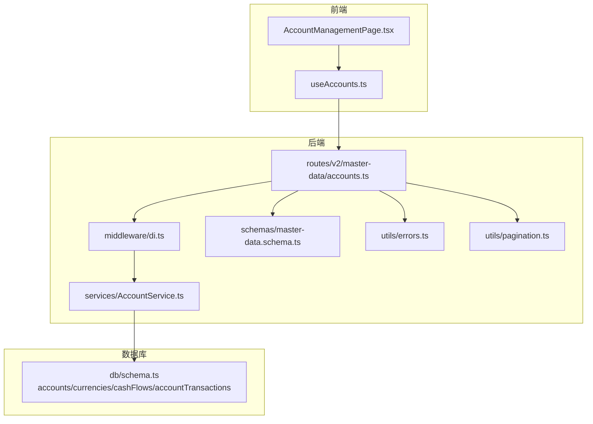
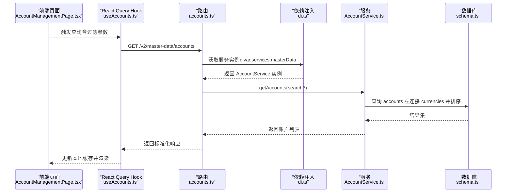
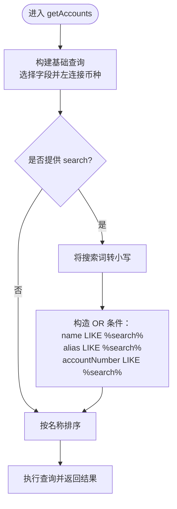
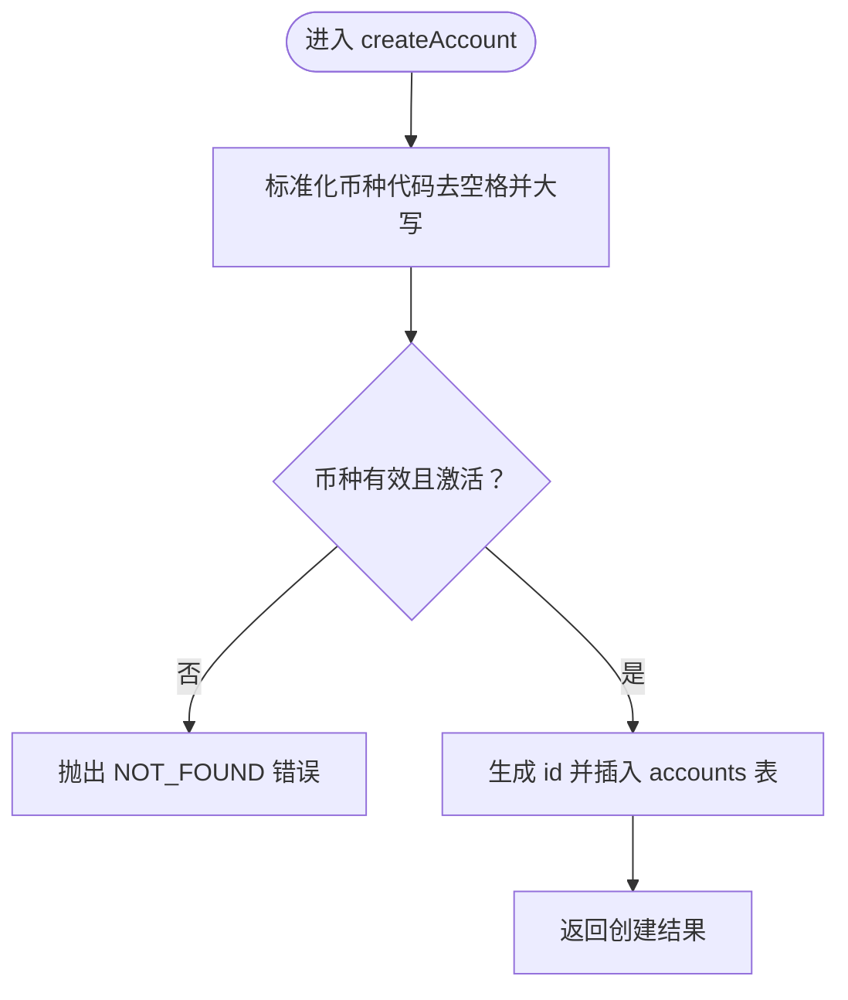
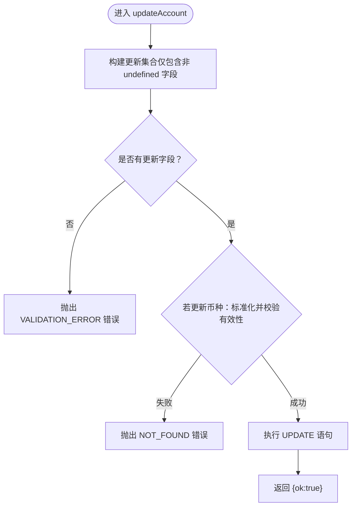
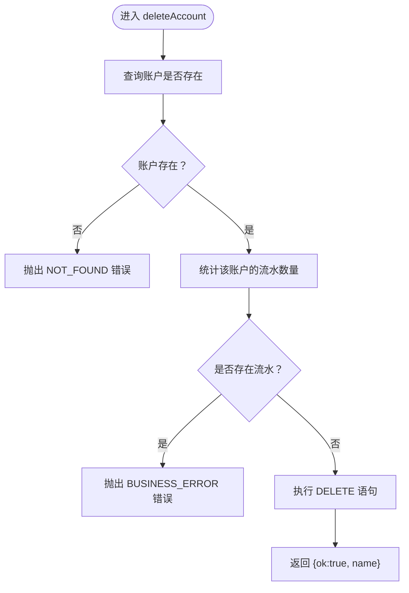
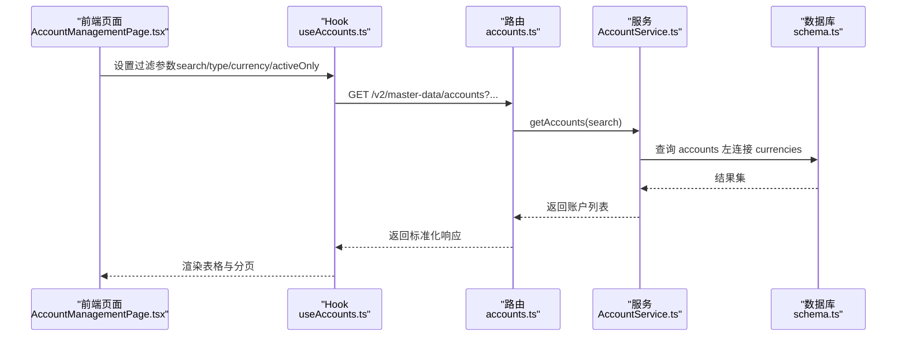
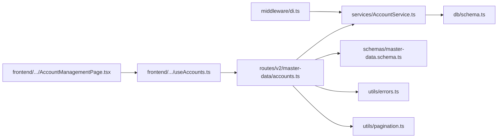

# 账户管理服务

<cite>
**本文引用的文件**
- [AccountService.ts](file://backend/src/services/AccountService.ts)
- [accounts.ts](file://backend/src/routes/v2/master-data/accounts.ts)
- [schema.ts](file://backend/src/db/schema.ts)
- [AccountManagementPage.tsx](file://frontend/src/features/system/pages/AccountManagementPage.tsx)
- [useAccounts.ts](file://frontend/src/hooks/business/useAccounts.ts)
- [master-data.schema.ts](file://backend/src/schemas/master-data.schema.ts)
- [errors.ts](file://backend/src/utils/errors.ts)
- [pagination.ts](file://backend/src/utils/pagination.ts)
- [di.ts](file://backend/src/middleware/di.ts)
- [AccountService.test.ts](file://backend/test/services/AccountService.test.ts)
</cite>

## 目录
1. [简介](#简介)
2. [项目结构](#项目结构)
3. [核心组件](#核心组件)
4. [架构总览](#架构总览)
5. [详细组件分析](#详细组件分析)
6. [依赖关系分析](#依赖关系分析)
7. [性能考量](#性能考量)
8. [故障排查指南](#故障排查指南)
9. [结论](#结论)
10. [附录](#附录)

## 简介
本文件围绕账户管理服务（AccountService）进行深入解析，覆盖其在账户全生命周期管理中的职责与实现细节，重点说明：
- 列表查询与搜索：getAccounts 如何实现多字段模糊匹配与排序
- 新增与更新：createAccount、updateAccount 如何保证币种有效性与数据完整性
- 删除规则：deleteAccount 在删除前对关联流水的业务约束
- 前后端协同：服务层与 API 路由、数据库访问的协作流程
- 并发与一致性：如何处理并发操作与数据一致性问题

## 项目结构
账户管理涉及的后端与前端关键文件如下：
- 后端服务层：AccountService
- 后端路由层：账户相关 API 路由
- 数据库模型：accounts、currencies、cashFlows、accountTransactions
- 前端页面与 Hook：账户管理页面与查询/增删改 Hook
- 校验与错误处理：主数据 Schema、统一错误处理工具
- 依赖注入：服务实例注入到请求上下文

图表来源
- [accounts.ts](file://backend/src/routes/v2/master-data/accounts.ts#L1-L310)
- [AccountService.ts](file://backend/src/services/AccountService.ts#L1-L168)
- [di.ts](file://backend/src/middleware/di.ts#L1-L156)
- [schema.ts](file://backend/src/db/schema.ts#L139-L206)
- [master-data.schema.ts](file://backend/src/schemas/master-data.schema.ts#L52-L70)
- [errors.ts](file://backend/src/utils/errors.ts#L1-L133)
- [pagination.ts](file://backend/src/utils/pagination.ts#L1-L35)

章节来源
- [accounts.ts](file://backend/src/routes/v2/master-data/accounts.ts#L1-L310)
- [AccountService.ts](file://backend/src/services/AccountService.ts#L1-L168)
- [schema.ts](file://backend/src/db/schema.ts#L139-L206)
- [di.ts](file://backend/src/middleware/di.ts#L1-L156)

## 核心组件
- 账户服务（AccountService）：封装账户的查询、新增、更新、删除与交易明细查询
- 账户路由（accounts.ts）：提供账户列表、交易明细、创建、更新、删除接口，包含权限校验与参数校验
- 数据模型（schema.ts）：定义 accounts、currencies、cashFlows、accountTransactions 表结构及索引
- 前端页面与 Hook（AccountManagementPage.tsx、useAccounts.ts）：负责用户交互、过滤与调用后端 API
- 校验与错误（master-data.schema.ts、errors.ts）：统一的输入校验与错误码体系
- 分页工具（pagination.ts）：通用分页计算
- 依赖注入（di.ts）：将 AccountService 注入到请求上下文

章节来源
- [AccountService.ts](file://backend/src/services/AccountService.ts#L1-L168)
- [accounts.ts](file://backend/src/routes/v2/master-data/accounts.ts#L1-L310)
- [schema.ts](file://backend/src/db/schema.ts#L139-L206)
- [AccountManagementPage.tsx](file://frontend/src/features/system/pages/AccountManagementPage.tsx#L1-L363)
- [useAccounts.ts](file://frontend/src/hooks/business/useAccounts.ts#L1-L129)
- [master-data.schema.ts](file://backend/src/schemas/master-data.schema.ts#L52-L70)
- [errors.ts](file://backend/src/utils/errors.ts#L1-L133)
- [pagination.ts](file://backend/src/utils/pagination.ts#L1-L35)
- [di.ts](file://backend/src/middleware/di.ts#L1-L156)

## 架构总览
后端采用“路由 -> 服务 -> 数据库”的分层设计；前端通过 React Query Hook 发起请求，页面负责展示与交互。AccountService 作为核心服务，直接操作 accounts/currencies/cashFlows/accountTransactions 表，确保业务规则在服务层落地。

图表来源
- [accounts.ts](file://backend/src/routes/v2/master-data/accounts.ts#L1-L310)
- [di.ts](file://backend/src/middleware/di.ts#L1-L156)
- [AccountService.ts](file://backend/src/services/AccountService.ts#L1-L168)
- [schema.ts](file://backend/src/db/schema.ts#L139-L206)

## 详细组件分析

### getAccounts：账户列表查询与搜索
- 多字段模糊匹配
  - 支持对账户名称、别名、账号三字段进行不区分大小写的模糊匹配
  - 使用 SQL 的 lower 函数与 coalesce 处理空值，确保别名与账号为空时也能参与匹配
- 排序与联表
  - 默认按账户名称升序排序
  - 左连接币种表，返回币种名称，便于前端展示
- 搜索参数
  - 路由层接收 search 参数，传入服务层执行过滤
  - 前端页面也实现了二次过滤（如类型、币种、启用状态），但服务层优先保证基础搜索逻辑

图表来源
- [AccountService.ts](file://backend/src/services/AccountService.ts#L15-L44)
- [accounts.ts](file://backend/src/routes/v2/master-data/accounts.ts#L19-L83)

章节来源
- [AccountService.ts](file://backend/src/services/AccountService.ts#L15-L44)
- [accounts.ts](file://backend/src/routes/v2/master-data/accounts.ts#L19-L83)
- [AccountService.test.ts](file://backend/test/services/AccountService.test.ts#L44-L112)

### createAccount：新增账户与币种有效性校验
- 币种校验
  - 若未提供币种，默认使用大写后的 CNY
  - 通过查询币种表，要求币种存在且处于激活状态，否则抛出“不存在”错误
- 字段处理
  - 期初金额默认 0
  - 生成唯一 id 并插入 accounts 表
- 错误处理
  - 使用统一错误工具返回业务错误或验证错误

图表来源
- [AccountService.ts](file://backend/src/services/AccountService.ts#L84-L116)
- [errors.ts](file://backend/src/utils/errors.ts#L35-L55)

章节来源
- [AccountService.ts](file://backend/src/services/AccountService.ts#L84-L116)
- [AccountService.test.ts](file://backend/test/services/AccountService.test.ts#L114-L179)
- [errors.ts](file://backend/src/utils/errors.ts#L35-L55)

### updateAccount：更新账户与币种有效性校验
- 字段选择性更新
  - 仅当对应字段存在时才纳入更新集合
  - 若无任何字段需要更新，抛出“没有需要更新的字段”错误
- 币种更新校验
  - 对 currency 字段同样执行标准化与有效性校验
- 数据一致性
  - 通过单条 UPDATE 语句一次性提交，避免部分更新导致的数据不一致

图表来源
- [AccountService.ts](file://backend/src/services/AccountService.ts#L118-L165)
- [errors.ts](file://backend/src/utils/errors.ts#L35-L55)

章节来源
- [AccountService.ts](file://backend/src/services/AccountService.ts#L118-L165)
- [AccountService.test.ts](file://backend/test/services/AccountService.test.ts#L181-L233)
- [errors.ts](file://backend/src/utils/errors.ts#L35-L55)

### deleteAccount：删除账户的业务规则
- 存在性检查
  - 先查询账户是否存在，不存在则抛出“不存在”错误
- 关联流水检查
  - 通过统计 cashFlows 中 accountId 的数量，若大于 0，则拒绝删除并提示“无法删除，该账户还有流水记录”
- 删除执行
  - 通过 DELETE 语句删除账户记录

图表来源
- [AccountService.ts](file://backend/src/services/AccountService.ts#L152-L165)
- [errors.ts](file://backend/src/utils/errors.ts#L35-L55)

章节来源
- [AccountService.ts](file://backend/src/services/AccountService.ts#L152-L165)
- [AccountService.test.ts](file://backend/test/services/AccountService.test.ts#L235-L281)
- [errors.ts](file://backend/src/utils/errors.ts#L35-L55)

### 前端协同：页面、Hook 与 API 路由
- 页面（AccountManagementPage.tsx）
  - 提供搜索框（名称/别名/账号号）、类型、币种、启用状态筛选
  - 自身实现二次过滤与排序，提升用户体验
- Hook（useAccounts.ts）
  - 将过滤参数拼接到 URL，调用后端接口
  - 使用 React Query 缓存与失效策略，保持前后端数据一致
- 路由（accounts.ts）
  - 定义 OpenAPI 路由，包含权限校验与参数校验
  - 列表接口支持 activeOnly、accountType、currency、search 等过滤
  - 交易明细接口支持分页

图表来源
- [AccountManagementPage.tsx](file://frontend/src/features/system/pages/AccountManagementPage.tsx#L1-L363)
- [useAccounts.ts](file://frontend/src/hooks/business/useAccounts.ts#L1-L129)
- [accounts.ts](file://backend/src/routes/v2/master-data/accounts.ts#L1-L310)
- [AccountService.ts](file://backend/src/services/AccountService.ts#L15-L44)
- [schema.ts](file://backend/src/db/schema.ts#L139-L206)

章节来源
- [AccountManagementPage.tsx](file://frontend/src/features/system/pages/AccountManagementPage.tsx#L1-L363)
- [useAccounts.ts](file://frontend/src/hooks/business/useAccounts.ts#L1-L129)
- [accounts.ts](file://backend/src/routes/v2/master-data/accounts.ts#L1-L310)

### 并发与数据一致性
- 乐观锁
  - accounts 表包含 version 字段，可用于后续引入乐观锁控制，避免并发更新冲突
- 事务与原子性
  - create/update/delete 在单条 SQL 中完成，保证原子性；删除前的流水计数与删除操作建议在事务中执行以增强一致性
- 并发读取
  - 前端使用 React Query 缓存，配合查询失效策略，减少重复请求与缓存不一致风险

章节来源
- [schema.ts](file://backend/src/db/schema.ts#L139-L150)
- [AccountService.ts](file://backend/src/services/AccountService.ts#L152-L165)

## 依赖关系分析
- 服务层依赖
  - AccountService 依赖 DrizzleD1Database 与 schema 定义的表结构
  - 依赖错误工具类进行统一错误处理
- 路由层依赖
  - 依赖权限校验、OpenAPI Schema、分页工具与响应包装
  - 通过 DI 中间件注入服务实例
- 前端依赖
  - 依赖 API 配置、React Query、Ant Design 组件与表单校验

图表来源
- [accounts.ts](file://backend/src/routes/v2/master-data/accounts.ts#L1-L310)
- [AccountService.ts](file://backend/src/services/AccountService.ts#L1-L168)
- [schema.ts](file://backend/src/db/schema.ts#L139-L206)
- [master-data.schema.ts](file://backend/src/schemas/master-data.schema.ts#L52-L70)
- [errors.ts](file://backend/src/utils/errors.ts#L1-L133)
- [pagination.ts](file://backend/src/utils/pagination.ts#L1-L35)
- [di.ts](file://backend/src/middleware/di.ts#L1-L156)
- [AccountManagementPage.tsx](file://frontend/src/features/system/pages/AccountManagementPage.tsx#L1-L363)
- [useAccounts.ts](file://frontend/src/hooks/business/useAccounts.ts#L1-L129)

章节来源
- [accounts.ts](file://backend/src/routes/v2/master-data/accounts.ts#L1-L310)
- [AccountService.ts](file://backend/src/services/AccountService.ts#L1-L168)
- [di.ts](file://backend/src/middleware/di.ts#L1-L156)

## 性能考量
- 查询性能
  - getAccounts 使用左连接币种表并按名称排序，建议在 name 与币种 code 上建立索引以优化排序与过滤
- 分页与大数据量
  - 列表接口支持分页参数，建议在 cashFlows 与 accountTransactions 上建立复合索引以加速统计与排序
- 前端缓存
  - 使用 React Query 缓存与失效策略，减少重复请求；合理设置 staleTime 与 cacheTime

[本节为通用指导，无需列出具体文件来源]

## 故障排查指南
- 常见错误与定位
  - “币种不存在”：检查币种表是否包含对应币种且处于激活状态
  - “没有需要更新的字段”：确认传入的更新字段是否非空
  - “无法删除，该账户还有流水记录”：先清理或迁移相关流水后再删除
- 日志与监控
  - 统一错误处理会记录业务错误与验证错误，便于定位问题
- 单元测试参考
  - 可参考测试用例验证各场景行为，包括搜索、币种校验、删除约束等

章节来源
- [errors.ts](file://backend/src/utils/errors.ts#L35-L133)
- [AccountService.test.ts](file://backend/test/services/AccountService.test.ts#L1-L282)

## 结论
AccountService 在账户全生命周期管理中承担了核心职责：提供高效、安全的查询与搜索能力，严格校验币种有效性，保障新增与更新的数据完整性，并在删除前强制执行业务规则以避免破坏性操作。前后端通过清晰的分层与契约协作，形成稳定可靠的账户管理体系。建议后续引入事务与乐观锁机制，进一步提升并发场景下的数据一致性与可靠性。

[本节为总结性内容，无需列出具体文件来源]

## 附录
- API 路由与参数
  - 列表接口：支持 activeOnly、accountType、currency、search 等过滤
  - 交易明细接口：支持分页参数
- 数据模型要点
  - accounts：账户基本信息与版本号
  - currencies：币种定义与激活状态
  - cashFlows：财务流水，与账户关联
  - accountTransactions：账户交易明细，用于分页展示

章节来源
- [accounts.ts](file://backend/src/routes/v2/master-data/accounts.ts#L1-L310)
- [schema.ts](file://backend/src/db/schema.ts#L139-L206)
- [pagination.ts](file://backend/src/utils/pagination.ts#L1-L35)