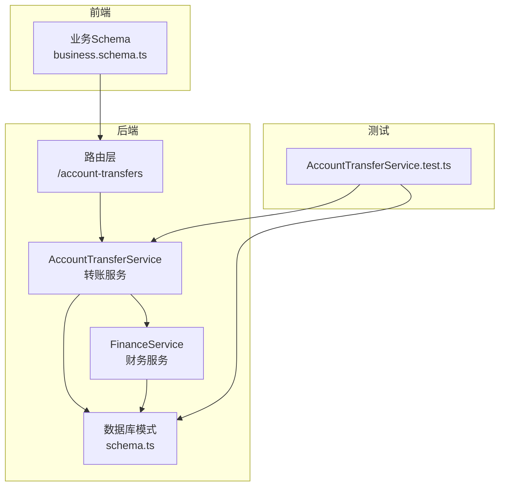
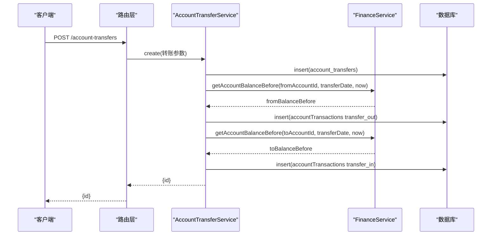
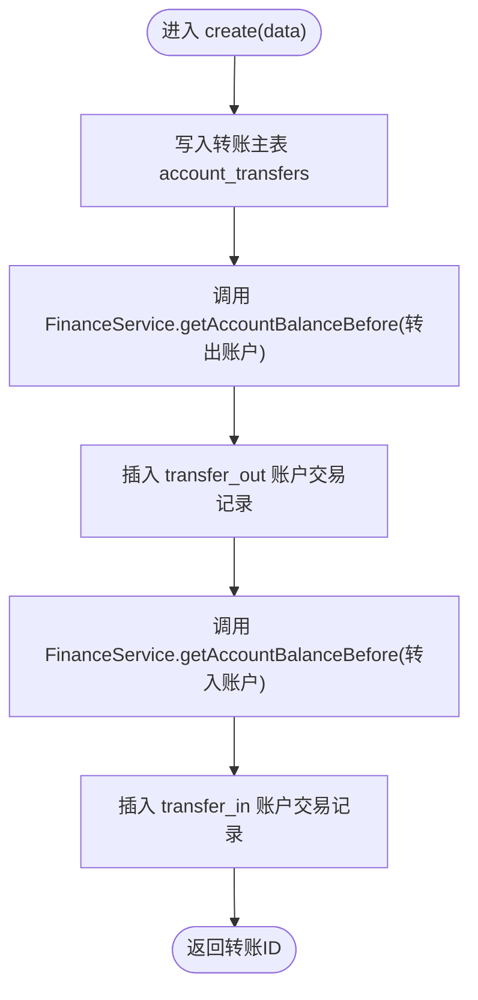
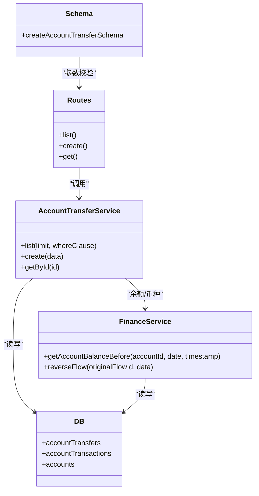

# 账户转账服务

<cite>
**本文引用的文件**
- [backend/src/services/AccountTransferService.ts](file://backend/src/services/AccountTransferService.ts)
- [backend/src/services/FinanceService.ts](file://backend/src/services/FinanceService.ts)
- [backend/src/routes/v2/account-transfers.ts](file://backend/src/routes/v2/account-transfers.ts)
- [backend/src/db/schema.ts](file://backend/src/db/schema.ts)
- [backend/src/schemas/business.schema.ts](file://backend/src/schemas/business.schema.ts)
- [backend/test/services/AccountTransferService.test.ts](file://backend/test/services/AccountTransferService.test.ts)
</cite>

## 目录
1. [简介](#简介)
2. [项目结构](#项目结构)
3. [核心组件](#核心组件)
4. [架构总览](#架构总览)
5. [详细组件分析](#详细组件分析)
6. [依赖关系分析](#依赖关系分析)
7. [性能考量](#性能考量)
8. [故障排查指南](#故障排查指南)
9. [结论](#结论)

## 简介
本文件围绕 AccountTransferService 的实现机制进行深入解析，重点说明其如何借助 FinanceService 协调跨账户资金划转。内容涵盖：
- create 方法的事务处理流程：先创建转账主记录，再通过 FinanceService 的 getAccountBalanceBefore 获取转出与转入账户在转账日期前的余额，随后分别创建“转出”和“转入”的两类账户交易记录，并正确计算余额变化。
- list 方法通过关联查询获取转账记录及其关联账户的名称与币种信息。
- 结合财务流水的红冲（reverse）机制，阐述转账记录的不可变性设计原则。

## 项目结构
AccountTransferService 属于后端服务层，位于 backend/src/services 目录；路由层位于 backend/src/routes/v2；数据库模式定义在 backend/src/db/schema.ts；前端校验 schema 在 backend/src/schemas/business.schema.ts；测试位于 backend/test/services。

图表来源
- [backend/src/services/AccountTransferService.ts](file://backend/src/services/AccountTransferService.ts#L1-L148)
- [backend/src/services/FinanceService.ts](file://backend/src/services/FinanceService.ts#L1-L443)
- [backend/src/routes/v2/account-transfers.ts](file://backend/src/routes/v2/account-transfers.ts#L1-L235)
- [backend/src/db/schema.ts](file://backend/src/db/schema.ts#L190-L476)
- [backend/src/schemas/business.schema.ts](file://backend/src/schemas/business.schema.ts#L255-L272)
- [backend/test/services/AccountTransferService.test.ts](file://backend/test/services/AccountTransferService.test.ts#L1-L162)

章节来源
- [backend/src/services/AccountTransferService.ts](file://backend/src/services/AccountTransferService.ts#L1-L148)
- [backend/src/services/FinanceService.ts](file://backend/src/services/FinanceService.ts#L1-L443)
- [backend/src/routes/v2/account-transfers.ts](file://backend/src/routes/v2/account-transfers.ts#L1-L235)
- [backend/src/db/schema.ts](file://backend/src/db/schema.ts#L190-L476)
- [backend/src/schemas/business.schema.ts](file://backend/src/schemas/business.schema.ts#L255-L272)
- [backend/test/services/AccountTransferService.test.ts](file://backend/test/services/AccountTransferService.test.ts#L1-L162)

## 核心组件
- AccountTransferService：负责转账主记录的创建、转账明细（转出/转入）交易记录的生成，以及转账详情的查询。
- FinanceService：提供账户币种查询、账户余额计算（基于历史交易）、以及红冲流水等财务能力。
- 路由层：暴露转账列表、创建、详情接口，负责权限校验与请求参数校验。
- 数据库模式：定义 account_transfers、account_transactions、accounts 等表结构及索引。

章节来源
- [backend/src/services/AccountTransferService.ts](file://backend/src/services/AccountTransferService.ts#L1-L148)
- [backend/src/services/FinanceService.ts](file://backend/src/services/FinanceService.ts#L1-L443)
- [backend/src/routes/v2/account-transfers.ts](file://backend/src/routes/v2/account-transfers.ts#L1-L235)
- [backend/src/db/schema.ts](file://backend/src/db/schema.ts#L190-L476)

## 架构总览
AccountTransferService 通过依赖注入持有 Drizzle 数据库实例与 FinanceService 实例。创建转账时，先写入转账主表，再调用 FinanceService 的余额计算方法获取转出/转入账户在转账日期前的余额，最后插入两条账户交易记录（transfer_out/transfer_in），形成完整的资金划转历史。

图表来源
- [backend/src/services/AccountTransferService.ts](file://backend/src/services/AccountTransferService.ts#L44-L124)
- [backend/src/services/FinanceService.ts](file://backend/src/services/FinanceService.ts#L41-L68)
- [backend/src/routes/v2/account-transfers.ts](file://backend/src/routes/v2/account-transfers.ts#L149-L184)
- [backend/src/db/schema.ts](file://backend/src/db/schema.ts#L190-L206)

## 详细组件分析

### AccountTransferService 组件分析
- 依赖关系
  - 使用 Drizzle ORM 对数据库进行读写。
  - 依赖 FinanceService 获取账户币种与余额。
- 主要方法
  - list(limit, whereClause)
    - 查询转账主表，提取所有涉及的账户 ID，批量查询账户表以获取账户名称与币种，组装返回结果。
  - create(data)
    - 步骤一：写入转账主表 account_transfers，填充币种、金额、汇率、凭证等字段。
    - 步骤二：调用 FinanceService.getAccountBalanceBefore 计算转出账户转账日期前余额，插入一条 transfer_out 类型的账户交易记录。
    - 步骤三：调用 FinanceService.getAccountBalanceBefore 计算转入账户转账日期前余额，插入一条 transfer_in 类型的账户交易记录。
  - getById(id)
    - 查询转账主表，并联查账户表获取账户名称与币种，返回带扩展信息的转账详情。

图表来源
- [backend/src/services/AccountTransferService.ts](file://backend/src/services/AccountTransferService.ts#L44-L124)
- [backend/src/services/FinanceService.ts](file://backend/src/services/FinanceService.ts#L41-L68)

章节来源
- [backend/src/services/AccountTransferService.ts](file://backend/src/services/AccountTransferService.ts#L13-L148)

### FinanceService 组件分析
- getAccountBalanceBefore(accountId, date, timestamp)
  - 逻辑：查找账户在“交易日期小于给定日期”或“交易日期等于给定日期且创建时间早于给定时间戳”的最近一笔交易，取其 balance_after_cents；若无历史，则回退到账户 openingCents。
- reverseFlow(originalFlowId, data)
  - 通过数据库事务执行红冲：校验原始流水是否存在、未被冲正、非红冲记录；生成反向流水（收支类型互换，金额不变）；插入红冲流水与账户交易记录；标记原始流水为已冲正。
- createCashFlow（用于对比）
  - 展示了乐观锁与余额计算的典型模式：先尝试更新账户版本号，再计算余额并插入流水与交易记录。

章节来源
- [backend/src/services/FinanceService.ts](file://backend/src/services/FinanceService.ts#L41-L68)
- [backend/src/services/FinanceService.ts](file://backend/src/services/FinanceService.ts#L285-L437)
- [backend/src/services/FinanceService.ts](file://backend/src/services/FinanceService.ts#L104-L189)

### 路由层与业务 Schema
- 路由层
  - list：支持按 fromAccountId、toAccountId、日期范围过滤，限制返回条数。
  - create：鉴权校验，接收转账参数，调用服务层 create 并记录审计日志。
  - get：鉴权校验，返回带账户名称与币种的转账详情。
- 业务 Schema
  - createAccountTransferSchema：对转账参数进行校验，包括金额、币种长度、账户不同等。

章节来源
- [backend/src/routes/v2/account-transfers.ts](file://backend/src/routes/v2/account-transfers.ts#L1-L235)
- [backend/src/schemas/business.schema.ts](file://backend/src/schemas/business.schema.ts#L255-L272)

### 数据模型与索引
- account_transfers：存储转账主记录，包含转账日期、转出/转入账户、币种、金额、汇率、凭证、创建人与时间等。
- account_transactions：存储账户交易明细，包含交易日期、交易类型（transfer_out/transfer_in）、金额、余额前后值、关联流水ID等。
- accounts：账户基础信息，包含币种、期初金额、版本号等。

章节来源
- [backend/src/db/schema.ts](file://backend/src/db/schema.ts#L190-L206)
- [backend/src/db/schema.ts](file://backend/src/db/schema.ts#L448-L476)

## 依赖关系分析
- AccountTransferService 依赖 FinanceService 完成余额计算与币种查询。
- 路由层依赖 AccountTransferService 提供业务能力。
- 测试用例通过 Vitest 与 Cloudflare D1 驱动，验证转账创建与查询行为。

图表来源
- [backend/src/services/AccountTransferService.ts](file://backend/src/services/AccountTransferService.ts#L1-L148)
- [backend/src/services/FinanceService.ts](file://backend/src/services/FinanceService.ts#L1-L443)
- [backend/src/routes/v2/account-transfers.ts](file://backend/src/routes/v2/account-transfers.ts#L1-L235)
- [backend/src/schemas/business.schema.ts](file://backend/src/schemas/business.schema.ts#L255-L272)
- [backend/src/db/schema.ts](file://backend/src/db/schema.ts#L190-L476)

章节来源
- [backend/src/services/AccountTransferService.ts](file://backend/src/services/AccountTransferService.ts#L1-L148)
- [backend/src/services/FinanceService.ts](file://backend/src/services/FinanceService.ts#L1-L443)
- [backend/src/routes/v2/account-transfers.ts](file://backend/src/routes/v2/account-transfers.ts#L1-L235)
- [backend/src/schemas/business.schema.ts](file://backend/src/schemas/business.schema.ts#L255-L272)
- [backend/src/db/schema.ts](file://backend/src/db/schema.ts#L190-L476)

## 性能考量
- 查询优化
  - list 方法先一次性查询转账主表，再批量查询账户表，减少多次往返。
  - account_transactions 表具备按账户+交易日期的索引，有利于余额计算与历史查询。
- 事务与并发
  - create 方法未使用显式事务包裹多步写入，但依赖 FinanceService 的余额计算与账户币种查询均为原子读取。若需强一致，可在服务层引入数据库事务封装。
- 红冲机制
  - reverseFlow 使用数据库事务保证原子性，避免并发下余额计算与状态更新的竞态。

章节来源
- [backend/src/services/AccountTransferService.ts](file://backend/src/services/AccountTransferService.ts#L13-L124)
- [backend/src/services/FinanceService.ts](file://backend/src/services/FinanceService.ts#L285-L437)
- [backend/src/db/schema.ts](file://backend/src/db/schema.ts#L190-L206)

## 故障排查指南
- 转账创建失败
  - 检查路由层权限校验与参数校验是否通过。
  - 确认 FinanceService.getAccountBalanceBefore 是否能正确返回余额。
  - 核对账户币种与金额字段是否正确写入。
- 余额异常
  - 确保转账日期与时间戳传入顺序正确，避免余额计算出现“同一天内不同时间点”的误判。
  - 若存在并发写入，考虑在服务层引入事务包裹以保证一致性。
- 红冲相关问题
  - 确认原始流水未被冲正，且不是红冲记录本身。
  - 核对 reverseFlow 的事务执行是否成功，以及账户版本号乐观锁是否触发。

章节来源
- [backend/src/routes/v2/account-transfers.ts](file://backend/src/routes/v2/account-transfers.ts#L149-L184)
- [backend/src/services/FinanceService.ts](file://backend/src/services/FinanceService.ts#L285-L437)
- [backend/test/services/AccountTransferService.test.ts](file://backend/test/services/AccountTransferService.test.ts#L127-L161)

## 结论
AccountTransferService 通过与 FinanceService 的协作，实现了跨账户资金划转的完整闭环：先写主记录，再计算余额并生成两条账户交易记录，确保每笔转账都有可追溯的历史。配合路由层的权限与参数校验、数据库层面的索引与模式设计，系统在可用性与一致性之间取得平衡。结合红冲机制，转账记录具备不可变性与可恢复能力，满足财务审计要求。