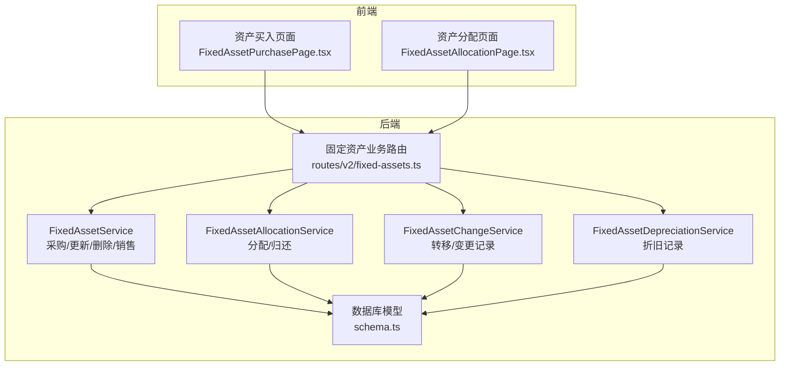
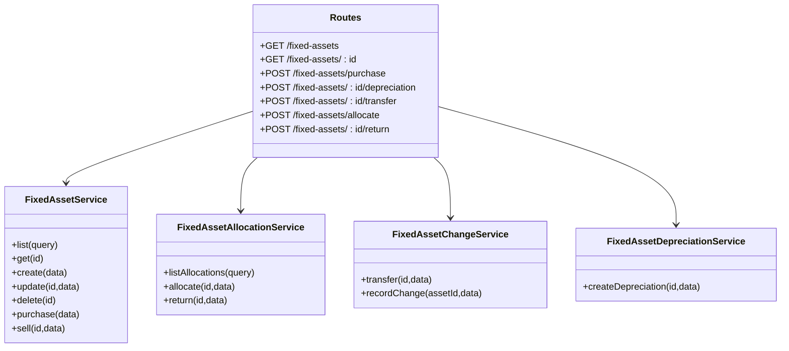
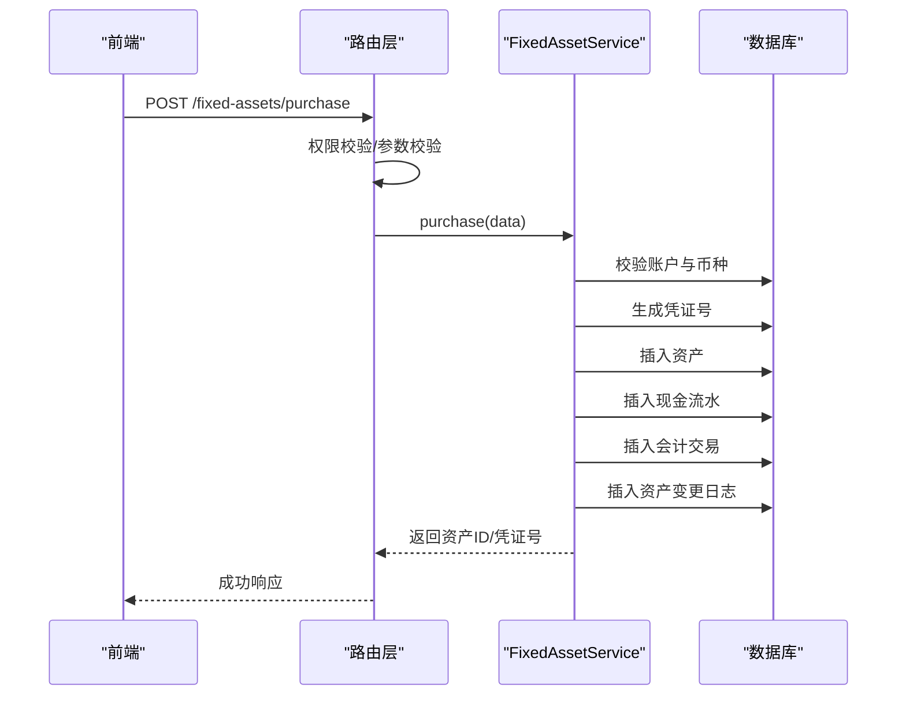
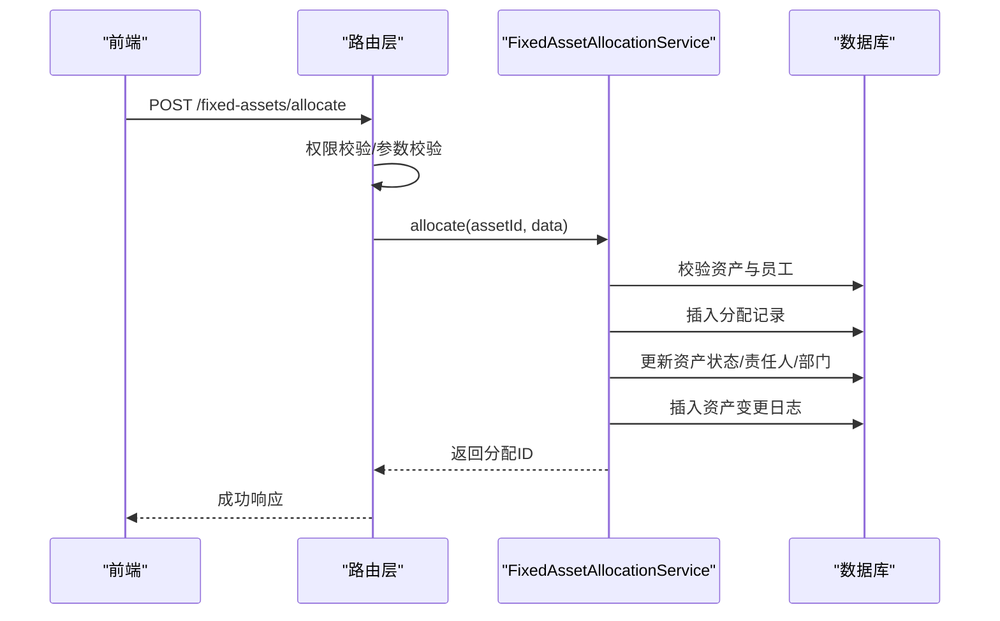
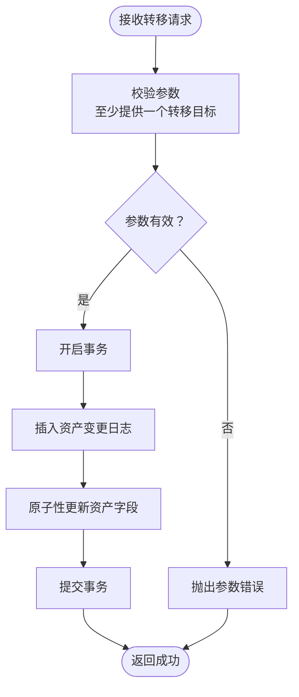
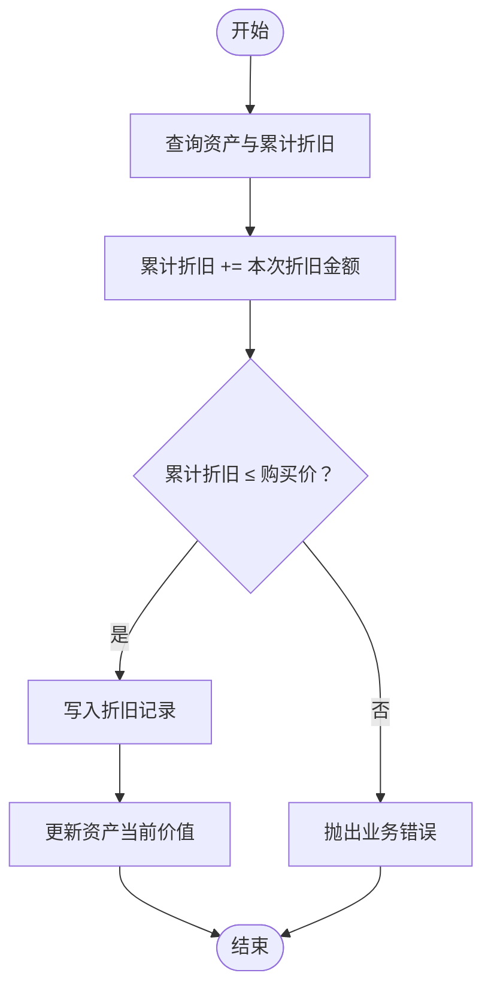
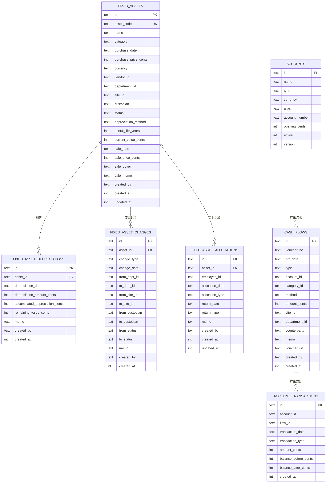
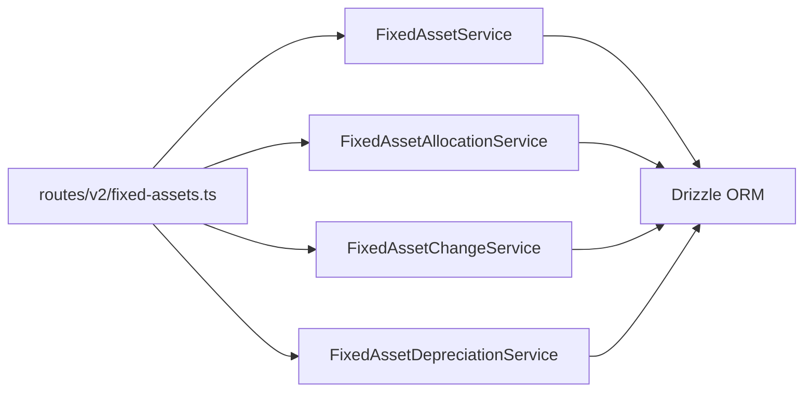
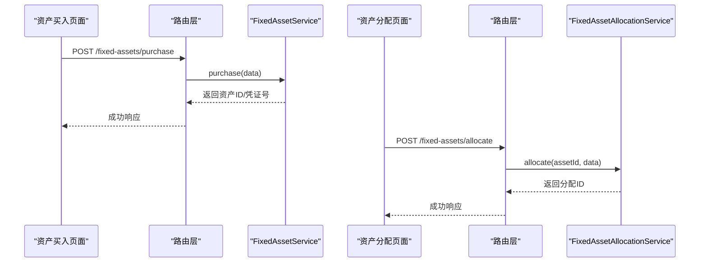

# 固定资产管理

<cite>
**本文引用的文件**
- [FixedAssetService.ts](file://backend/src/services/FixedAssetService.ts)
- [FixedAssetAllocationService.ts](file://backend/src/services/FixedAssetAllocationService.ts)
- [FixedAssetChangeService.ts](file://backend/src/services/FixedAssetChangeService.ts)
- [FixedAssetDepreciationService.ts](file://backend/src/services/FixedAssetDepreciationService.ts)
- [fixed-assets.ts](file://backend/src/routes/v2/fixed-assets.ts)
- [schema.ts](file://backend/src/db/schema.ts)
- [business.schema.ts](file://backend/src/schemas/business.schema.ts)
- [FixedAssetPurchasePage.tsx](file://frontend/src/features/assets/pages/FixedAssetPurchasePage.tsx)
- [FixedAssetAllocationPage.tsx](file://frontend/src/features/assets/pages/FixedAssetAllocationPage.tsx)
- [fixed-assets.test.ts](file://backend/test/routes/fixed-assets.test.ts)
</cite>

## 目录
1. [简介](#简介)
2. [项目结构](#项目结构)
3. [核心组件](#核心组件)
4. [架构总览](#架构总览)
5. [详细组件分析](#详细组件分析)
6. [依赖关系分析](#依赖关系分析)
7. [性能考量](#性能考量)
8. [故障排查指南](#故障排查指南)
9. [结论](#结论)
10. [附录](#附录)

## 简介
本文件系统性文档化固定资产管理模块的实现细节，围绕以下目标展开：
- 全生命周期管理：采购、调拨、变更、折旧、处置
- 服务协作：FixedAssetService、FixedAssetAllocationService、FixedAssetChangeService、FixedAssetDepreciationService 的职责边界与交互
- 折旧计算规则与执行策略
- 以“资产采购并分配给员工”的完整流程为例，展示多服务协同与数据流转

## 项目结构
固定资产管理位于后端服务层与前端页面层之间，采用“路由层 -> 服务层 -> 数据层（Drizzle ORM）”的分层设计。前端页面通过 API 触发后端服务，服务层完成业务校验、事务控制与数据持久化，并记录审计日志。

图表来源
- [fixed-assets.ts](file://backend/src/routes/v2/fixed-assets.ts#L1-L120)
- [FixedAssetService.ts](file://backend/src/services/FixedAssetService.ts#L1-L120)
- [FixedAssetAllocationService.ts](file://backend/src/services/FixedAssetAllocationService.ts#L1-L60)
- [FixedAssetChangeService.ts](file://backend/src/services/FixedAssetChangeService.ts#L1-L40)
- [FixedAssetDepreciationService.ts](file://backend/src/services/FixedAssetDepreciationService.ts#L1-L40)
- [schema.ts](file://backend/src/db/schema.ts#L506-L574)

章节来源
- [fixed-assets.ts](file://backend/src/routes/v2/fixed-assets.ts#L1-L120)
- [schema.ts](file://backend/src/db/schema.ts#L506-L574)

## 核心组件
- FixedAssetService：负责资产的创建、查询、更新、删除、采购（含财务流水）、销售（含财务流水）等核心业务
- FixedAssetAllocationService：负责资产分配与归还，维护分配记录并同步资产状态
- FixedAssetChangeService：负责资产转移（部门/站点/责任人）与通用变更记录
- FixedAssetDepreciationService：负责折旧记录的创建与累计折旧/残值校验
- 路由层：对权限、参数校验、审计日志进行统一处理，并调用相应服务
- 数据模型：固定资产、折旧、变更、分配、账户流水等表结构

章节来源
- [FixedAssetService.ts](file://backend/src/services/FixedAssetService.ts#L1-L120)
- [FixedAssetAllocationService.ts](file://backend/src/services/FixedAssetAllocationService.ts#L1-L60)
- [FixedAssetChangeService.ts](file://backend/src/services/FixedAssetChangeService.ts#L1-L40)
- [FixedAssetDepreciationService.ts](file://backend/src/services/FixedAssetDepreciationService.ts#L1-L40)
- [schema.ts](file://backend/src/db/schema.ts#L506-L574)

## 架构总览
固定资产管理采用“服务即领域模型”的设计，每个服务封装一个子域的业务逻辑，路由层仅承担鉴权、参数校验与审计日志职责。服务内部通过 Drizzle ORM 操作 SQLite 表，使用事务保证一致性。

图表来源
- [fixed-assets.ts](file://backend/src/routes/v2/fixed-assets.ts#L120-L260)
- [FixedAssetService.ts](file://backend/src/services/FixedAssetService.ts#L1-L120)
- [FixedAssetAllocationService.ts](file://backend/src/services/FixedAssetAllocationService.ts#L1-L60)
- [FixedAssetChangeService.ts](file://backend/src/services/FixedAssetChangeService.ts#L1-L40)
- [FixedAssetDepreciationService.ts](file://backend/src/services/FixedAssetDepreciationService.ts#L1-L40)

## 详细组件分析

### FixedAssetService：资产全生命周期核心
- 列表与详情：支持按关键字、状态、部门、类别、创建人等条件过滤；详情聚合部门/站点/供应商/币种/创建人信息，并加载折旧与变更历史
- 创建：校验资产编码唯一性，初始化状态为“使用中”，当前价值默认等于购买价
- 更新：支持状态、部门、站点、责任人等字段变更，自动记录状态变更日志
- 删除：若存在折旧记录则拒绝删除，事务内级联清理变更与资产
- 采购：校验账户有效性与币种匹配，生成凭证号，写入资产、现金流水、会计交易、资产变更日志
- 销售：校验资产状态，生成凭证号，写入资产、现金流水、会计交易、资产变更日志

图表来源
- [fixed-assets.ts](file://backend/src/routes/v2/fixed-assets.ts#L613-L725)
- [FixedAssetService.ts](file://backend/src/services/FixedAssetService.ts#L313-L468)

章节来源
- [FixedAssetService.ts](file://backend/src/services/FixedAssetService.ts#L1-L120)
- [FixedAssetService.ts](file://backend/src/services/FixedAssetService.ts#L183-L312)
- [FixedAssetService.ts](file://backend/src/services/FixedAssetService.ts#L313-L468)
- [FixedAssetService.ts](file://backend/src/services/FixedAssetService.ts#L470-L608)
- [fixed-assets.ts](file://backend/src/routes/v2/fixed-assets.ts#L613-L725)

### FixedAssetAllocationService：资产分配与归还
- 列表：支持按资产、员工、是否归还筛选，批量拉取关联资产、员工、部门信息
- 分配：校验资产状态（仅“使用中/闲置”可分配），校验员工有效，确保同一资产未有未归还分配；事务内写入分配记录、更新资产状态/责任人/部门，并记录分配变更
- 归还：校验存在未归还分配，事务内更新归还日期/类型/备注，更新资产状态为“闲置”，记录归还变更

图表来源
- [fixed-assets.ts](file://backend/src/routes/v2/fixed-assets.ts#L767-L826)
- [FixedAssetAllocationService.ts](file://backend/src/services/FixedAssetAllocationService.ts#L106-L208)

章节来源
- [FixedAssetAllocationService.ts](file://backend/src/services/FixedAssetAllocationService.ts#L1-L60)
- [FixedAssetAllocationService.ts](file://backend/src/services/FixedAssetAllocationService.ts#L106-L208)
- [FixedAssetAllocationService.ts](file://backend/src/services/FixedAssetAllocationService.ts#L210-L288)
- [fixed-assets.ts](file://backend/src/routes/v2/fixed-assets.ts#L767-L826)
- [fixed-assets.ts](file://backend/src/routes/v2/fixed-assets.ts#L828-L888)

### FixedAssetChangeService：资产转移与变更记录
- 转移：校验至少提供一个转移目标（部门/站点/责任人），写入变更日志并原子性更新资产的目标字段
- 变更记录：通用接口，便于外部服务或手动录入变更

图表来源
- [FixedAssetChangeService.ts](file://backend/src/services/FixedAssetChangeService.ts#L16-L79)

章节来源
- [FixedAssetChangeService.ts](file://backend/src/services/FixedAssetChangeService.ts#L1-L40)
- [FixedAssetChangeService.ts](file://backend/src/services/FixedAssetChangeService.ts#L16-L79)

### FixedAssetDepreciationService：折旧计算与校验
- 创建折旧：校验累计折旧不超过购买价，写入折旧记录并同步资产当前价值
- 核心规则：折旧金额累加，残值 = 购买价 - 累计折旧；超过购买价时报业务错误

图表来源
- [FixedAssetDepreciationService.ts](file://backend/src/services/FixedAssetDepreciationService.ts#L17-L76)

章节来源
- [FixedAssetDepreciationService.ts](file://backend/src/services/FixedAssetDepreciationService.ts#L1-L40)
- [FixedAssetDepreciationService.ts](file://backend/src/services/FixedAssetDepreciationService.ts#L17-L76)

### 数据模型与关系
固定资产管理涉及的核心表包括：fixed_assets、fixed_asset_depreciations、fixed_asset_changes、fixed_asset_allocations、accounts、cash_flows、account_transactions 等。

图表来源
- [schema.ts](file://backend/src/db/schema.ts#L506-L574)
- [schema.ts](file://backend/src/db/schema.ts#L139-L206)

章节来源
- [schema.ts](file://backend/src/db/schema.ts#L506-L574)
- [schema.ts](file://backend/src/db/schema.ts#L139-L206)

## 依赖关系分析
- 路由层依赖各服务：路由层负责权限与参数校验，调用对应服务执行业务
- 服务层依赖 Drizzle ORM：通过 schema.ts 中的表定义进行查询与写入
- 服务间耦合度低：分配/变更/折旧均独立成服务，通过资产ID与变更日志相互印证
- 前端页面与路由层对接：前端页面通过 API 触发后端服务，形成闭环

图表来源
- [fixed-assets.ts](file://backend/src/routes/v2/fixed-assets.ts#L120-L260)
- [FixedAssetService.ts](file://backend/src/services/FixedAssetService.ts#L1-L120)
- [FixedAssetAllocationService.ts](file://backend/src/services/FixedAssetAllocationService.ts#L1-L60)
- [FixedAssetChangeService.ts](file://backend/src/services/FixedAssetChangeService.ts#L1-L40)
- [FixedAssetDepreciationService.ts](file://backend/src/services/FixedAssetDepreciationService.ts#L1-L40)

章节来源
- [fixed-assets.ts](file://backend/src/routes/v2/fixed-assets.ts#L120-L260)

## 性能考量
- 查询优化：列表与详情通过 QueryBuilder 批量提取关联ID并一次性拉取，减少 N+1 查询
- 事务边界：采购/销售/分配/归还/折旧均在事务内执行，保证一致性但需注意长事务带来的锁竞争
- 索引与查询：cash_flows、account_transactions 等表具备关键索引，有助于流水与余额查询
- 建议：对高频查询字段建立合适索引；对大列表分页与限制条数；对变更日志定期归档

## 故障排查指南
- 参数校验错误：路由层使用 OpenAPI Schema 校验，前端传参不符合要求会触发错误
- 权限不足：路由层对每项操作进行权限校验，无权限将被拒绝
- 业务规则错误：
  - 资产删除前需确认无折旧记录
  - 分配前需确保资产处于“使用中/闲置”且无未归还分配
  - 折旧金额累计不可超过购买价
- 审计日志：路由层在每次关键操作后记录审计日志，便于追踪问题
- 单元测试覆盖：后端测试用例覆盖主要路由与服务调用路径，可参考其断言与期望行为

章节来源
- [fixed-assets.ts](file://backend/src/routes/v2/fixed-assets.ts#L120-L260)
- [FixedAssetService.ts](file://backend/src/services/FixedAssetService.ts#L288-L310)
- [FixedAssetAllocationService.ts](file://backend/src/services/FixedAssetAllocationService.ts#L120-L151)
- [FixedAssetDepreciationService.ts](file://backend/src/services/FixedAssetDepreciationService.ts#L42-L47)
- [fixed-assets.test.ts](file://backend/test/routes/fixed-assets.test.ts#L1-L120)

## 结论
固定资产管理模块通过清晰的服务边界与严格的事务控制，实现了从采购到分配、变更、折旧与处置的全生命周期管理。路由层统一处理权限与审计，服务层专注业务规则与数据一致性，前端页面通过标准化 API 与后端协作，形成高内聚、低耦合的架构体系。建议在生产环境中持续关注查询性能与索引策略，并完善异常监控与回滚机制。

## 附录

### 业务流程示例：资产采购并分配给员工
- 前端页面：资产买入页面收集资产信息与凭证，提交至后端
- 路由层：校验权限与参数，调用 FixedAssetService.purchase 完成资产与财务流水创建
- 服务层：生成凭证号、写入资产、现金流水、会计交易、资产变更日志
- 前端页面：资产分配页面选择资产与员工，提交分配请求
- 路由层：校验权限与参数，调用 FixedAssetAllocationService.allocate
- 服务层：校验状态与员工有效性，写入分配记录并更新资产状态/责任人/部门，记录分配变更
- 最终效果：资产状态从“闲置/使用中”变为“使用中”，责任人指向员工，分配记录与变更日志完整可追溯

图表来源
- [FixedAssetPurchasePage.tsx](file://frontend/src/features/assets/pages/FixedAssetPurchasePage.tsx#L1-L120)
- [FixedAssetAllocationPage.tsx](file://frontend/src/features/assets/pages/FixedAssetAllocationPage.tsx#L1-L120)
- [fixed-assets.ts](file://backend/src/routes/v2/fixed-assets.ts#L613-L725)
- [fixed-assets.ts](file://backend/src/routes/v2/fixed-assets.ts#L767-L826)
- [FixedAssetService.ts](file://backend/src/services/FixedAssetService.ts#L313-L468)
- [FixedAssetAllocationService.ts](file://backend/src/services/FixedAssetAllocationService.ts#L106-L208)

章节来源
- [FixedAssetPurchasePage.tsx](file://frontend/src/features/assets/pages/FixedAssetPurchasePage.tsx#L1-L120)
- [FixedAssetAllocationPage.tsx](file://frontend/src/features/assets/pages/FixedAssetAllocationPage.tsx#L1-L120)
- [fixed-assets.ts](file://backend/src/routes/v2/fixed-assets.ts#L613-L725)
- [fixed-assets.ts](file://backend/src/routes/v2/fixed-assets.ts#L767-L826)
- [FixedAssetService.ts](file://backend/src/services/FixedAssetService.ts#L313-L468)
- [FixedAssetAllocationService.ts](file://backend/src/services/FixedAssetAllocationService.ts#L106-L208)