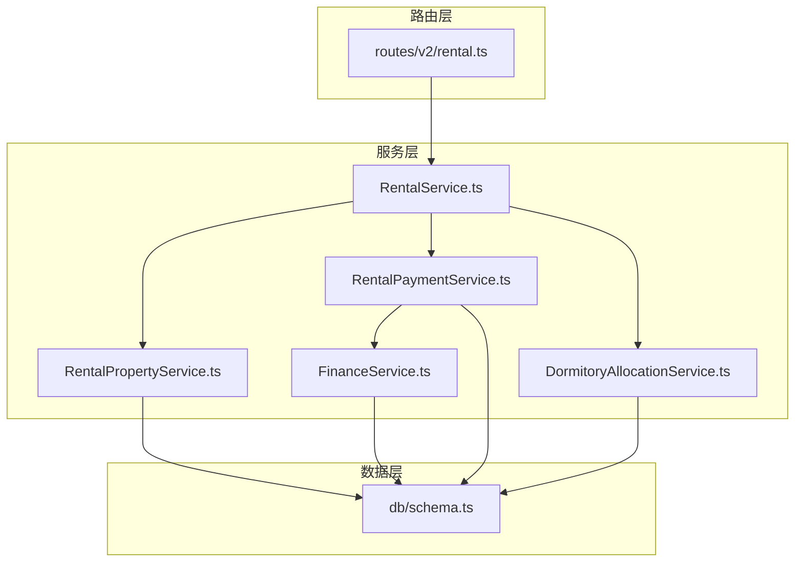
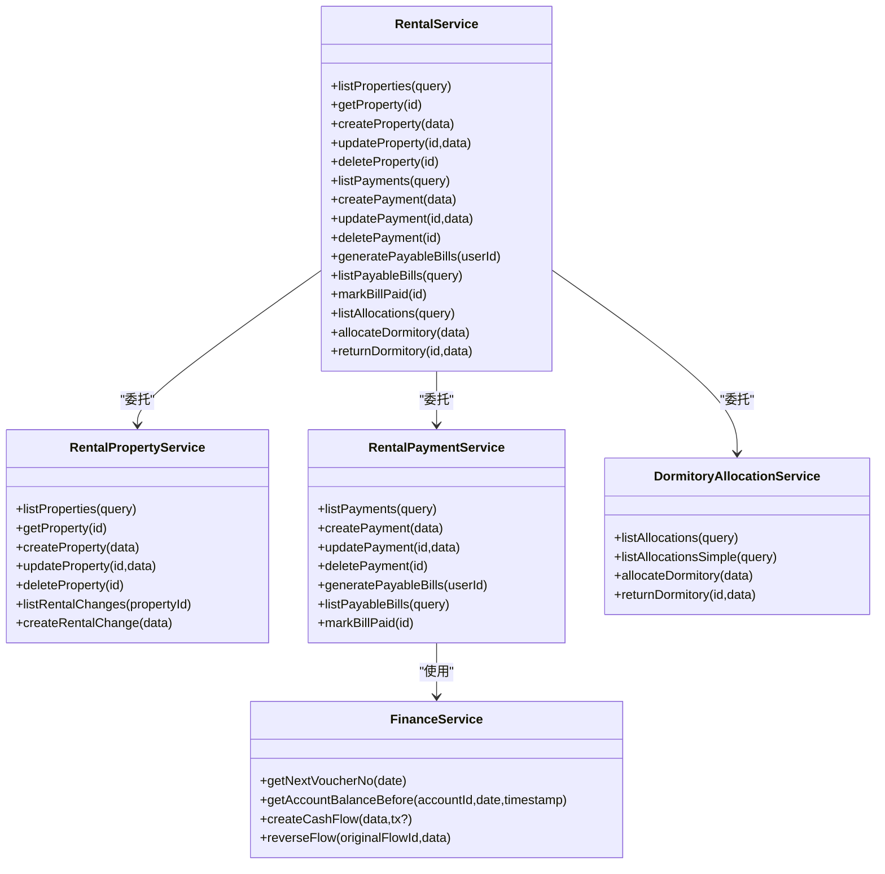
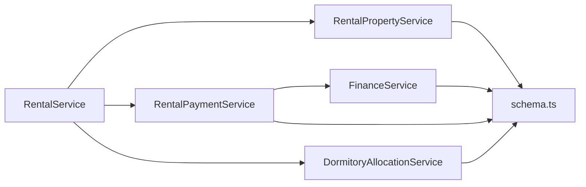
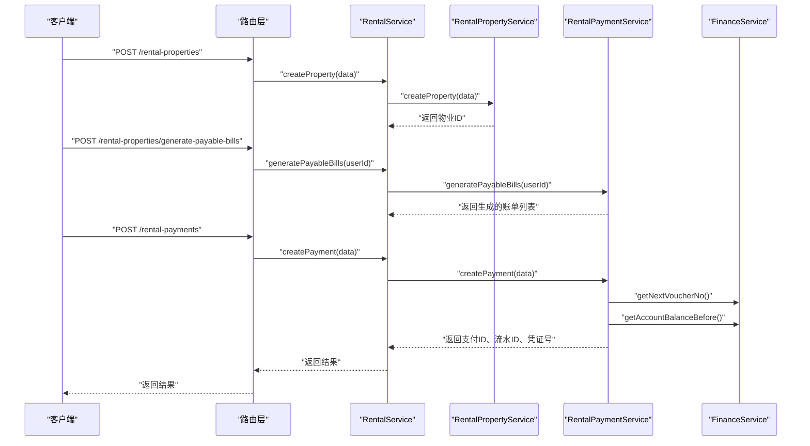
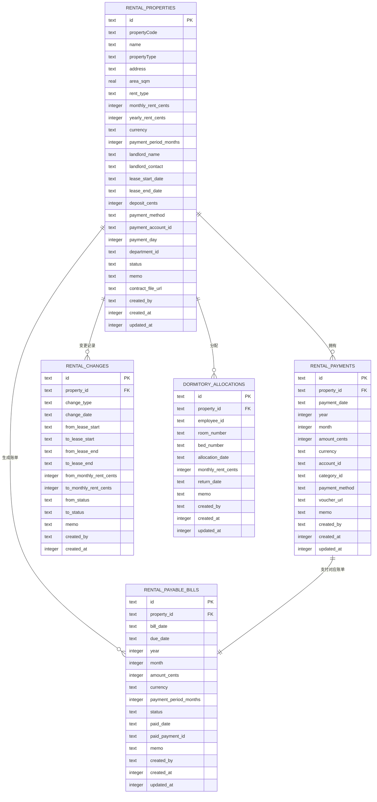

# 租赁管理

<cite>
**本文引用的文件**
- [RentalService.ts](file://backend/src/services/RentalService.ts)
- [RentalPropertyService.ts](file://backend/src/services/RentalPropertyService.ts)
- [RentalPaymentService.ts](file://backend/src/services/RentalPaymentService.ts)
- [DormitoryAllocationService.ts](file://backend/src/services/DormitoryAllocationService.ts)
- [FinanceService.ts](file://backend/src/services/FinanceService.ts)
- [rental.ts](file://backend/src/routes/v2/rental.ts)
- [schema.ts](file://backend/src/db/schema.ts)
- [business.schema.ts](file://backend/src/schemas/business.schema.ts)
- [rental.test.ts](file://backend/test/routes/rental.test.ts)
</cite>

## 目录
1. [简介](#简介)
2. [项目结构](#项目结构)
3. [核心组件](#核心组件)
4. [架构总览](#架构总览)
5. [详细组件分析](#详细组件分析)
6. [依赖分析](#依赖分析)
7. [性能考虑](#性能考虑)
8. [故障排查指南](#故障排查指南)
9. [结论](#结论)
10. [附录](#附录)

## 简介
本文件系统性文档化“租赁管理”模块的实现细节，重点阐述RentalService作为门面模式如何协调RentalPropertyService、RentalPaymentService与DormitoryAllocationService三大子服务，覆盖物业信息管理、租金支付计划生成、账单管理以及宿舍分配与退还的完整业务流程。文档同时通过“新租赁物业创建并生成首期付款账单”的示例，展示服务间调用关系与数据一致性保障机制。

## 项目结构
- 后端采用分层设计：
  - 路由层：定义REST接口与OpenAPI规范，负责请求解析、权限校验与审计日志。
  - 服务层：封装领域服务，提供业务能力（RentalService门面 + 三大子服务）。
  - 数据访问层：基于Drizzle ORM与SQLite schema，提供统一的数据模型与查询。
- 租赁模块涉及的核心文件：
  - 路由：backend/src/routes/v2/rental.ts
  - 服务：RentalService.ts、RentalPropertyService.ts、RentalPaymentService.ts、DormitoryAllocationService.ts、FinanceService.ts
  - 数据模型：backend/src/db/schema.ts
  - 请求/响应Schema：backend/src/schemas/business.schema.ts
  - 测试：backend/test/routes/rental.test.ts

图表来源
- [rental.ts](file://backend/src/routes/v2/rental.ts#L1-L852)
- [RentalService.ts](file://backend/src/services/RentalService.ts#L1-L162)
- [RentalPropertyService.ts](file://backend/src/services/RentalPropertyService.ts#L1-L291)
- [RentalPaymentService.ts](file://backend/src/services/RentalPaymentService.ts#L1-L400)
- [DormitoryAllocationService.ts](file://backend/src/services/DormitoryAllocationService.ts#L1-L177)
- [FinanceService.ts](file://backend/src/services/FinanceService.ts#L1-L443)
- [schema.ts](file://backend/src/db/schema.ts#L576-L673)

章节来源
- [rental.ts](file://backend/src/routes/v2/rental.ts#L1-L852)
- [RentalService.ts](file://backend/src/services/RentalService.ts#L1-L162)
- [schema.ts](file://backend/src/db/schema.ts#L576-L673)

## 核心组件
- RentalService（门面模式）：聚合三大子服务，对外暴露统一接口，负责编排与数据组装。
- RentalPropertyService：负责租赁物业的CRUD、变更记录与关联查询。
- RentalPaymentService：负责租金支付记录、应付账单生成与状态更新，并联动财务流水与账户交易。
- DormitoryAllocationService：负责宿舍分配与退还，支持按条件查询与简单查询。
- FinanceService：提供凭证号生成、账户余额计算、现金流与账户交易的创建等财务基础能力。
- 路由层：定义OpenAPI接口、参数校验、权限控制与审计日志。

章节来源
- [RentalService.ts](file://backend/src/services/RentalService.ts#L1-L162)
- [RentalPropertyService.ts](file://backend/src/services/RentalPropertyService.ts#L1-L291)
- [RentalPaymentService.ts](file://backend/src/services/RentalPaymentService.ts#L1-L400)
- [DormitoryAllocationService.ts](file://backend/src/services/DormitoryAllocationService.ts#L1-L177)
- [FinanceService.ts](file://backend/src/services/FinanceService.ts#L1-L443)
- [rental.ts](file://backend/src/routes/v2/rental.ts#L1-L852)

## 架构总览
RentalService作为门面，将业务请求委派给具体子服务，保证接口简洁与职责清晰。路由层负责参数校验与权限控制，服务层负责业务逻辑与数据一致性，财务服务提供跨表事务与余额校验。

图表来源
- [RentalService.ts](file://backend/src/services/RentalService.ts#L1-L162)
- [RentalPropertyService.ts](file://backend/src/services/RentalPropertyService.ts#L1-L291)
- [RentalPaymentService.ts](file://backend/src/services/RentalPaymentService.ts#L1-L400)
- [DormitoryAllocationService.ts](file://backend/src/services/DormitoryAllocationService.ts#L1-L177)
- [FinanceService.ts](file://backend/src/services/FinanceService.ts#L1-L443)

## 详细组件分析

### RentalService（门面模式）
- 组织关系：持有RentalPropertyService、RentalPaymentService、DormitoryAllocationService实例，统一对外提供方法。
- 关键职责：
  - 物业管理：列表、详情、创建、更新、删除。
  - 支付管理：列表、创建、更新、删除、生成应付账单、查询账单、标记账单已支付。
  - 宿舍分配：列表、分配、退还。
- 数据组装：在获取物业详情时，异步并行拉取支付记录与宿舍分配记录，并进行字段映射与合并。

章节来源
- [RentalService.ts](file://backend/src/services/RentalService.ts#L1-L162)

### RentalPropertyService（物业信息管理）
- 功能要点：
  - 列表查询：支持按类型、状态、部门过滤，联表返回部门、账户、币种、创建人等信息。
  - 详情查询：返回物业基础信息与变更历史，若不存在抛出“未找到”错误。
  - 创建：校验物业代码唯一性，写入基础字段与默认值，返回主键。
  - 更新：校验存在性，更新时间戳，关键字段变更时记录变更历史。
  - 删除：禁止删除仍有付款记录的物业；事务内级联删除变更记录与分配记录。
  - 变更记录：提供变更列表与新增变更记录的能力。

章节来源
- [RentalPropertyService.ts](file://backend/src/services/RentalPropertyService.ts#L1-L291)
- [schema.ts](file://backend/src/db/schema.ts#L576-L621)

### RentalPaymentService（租金支付与账单）
- 支付记录：
  - 列表：支持按物业、年、月过滤，联表返回属性、账户、分类、经办人等。
  - 创建：校验物业与账户存在性与有效性，防止同月重复；事务内插入支付记录、生成凭证号、写入现金流与账户交易，并将对应应付账单标记为已支付。
  - 更新/删除：提供更新与删除能力。
- 应付账单：
  - 生成：遍历有效且有起租日期的物业，根据周期与到期日推导下一次应付日期，结合计费周期与计费方式生成账单，避免重复生成。
  - 查询：支持按物业、状态、到期日范围过滤。
  - 标记已支付：校验账单存在与状态，更新状态与支付日期。

章节来源
- [RentalPaymentService.ts](file://backend/src/services/RentalPaymentService.ts#L1-L400)
- [FinanceService.ts](file://backend/src/services/FinanceService.ts#L1-L443)
- [schema.ts](file://backend/src/db/schema.ts#L605-L673)

### DormitoryAllocationService（宿舍分配与退还）
- 分配：
  - 校验物业类型为宿舍、员工存在且有效，禁止重复分配。
  - 写入分配记录，支持房间号、床号、月租等字段。
- 退还：
  - 校验分配记录存在且未归还，更新归还日期与备注。
- 查询：
  - 支持按物业、员工、是否已归还过滤，联表返回员工部门与创建人等信息；提供简化查询接口用于门面组装。

章节来源
- [DormitoryAllocationService.ts](file://backend/src/services/DormitoryAllocationService.ts#L1-L177)
- [schema.ts](file://backend/src/db/schema.ts#L641-L654)

### 财务集成（FinanceService）
- 凭证号生成：按业务日期统计当日流水数量，生成唯一凭证号。
- 余额计算：基于账户历史交易计算某时间点前的余额，用于支付入账。
- 现金流与账户交易：创建现金流与账户交易记录，保持借贷平衡。
- 并发控制：通过账户版本号乐观锁，避免并发写入导致的余额不一致。

章节来源
- [FinanceService.ts](file://backend/src/services/FinanceService.ts#L1-L443)

### 路由层（OpenAPI与权限）
- 接口覆盖：物业列表/详情/创建/更新/删除；支付列表/创建/更新/删除；账单生成/查询/标记已支付；宿舍分配/退还。
- 参数校验：使用zod schema对输入进行严格校验。
- 权限控制：部分操作要求特定权限位。
- 审计日志：记录关键操作的实体、行为与详情。

章节来源
- [rental.ts](file://backend/src/routes/v2/rental.ts#L1-L852)
- [business.schema.ts](file://backend/src/schemas/business.schema.ts#L90-L142)
- [business.schema.ts](file://backend/src/schemas/business.schema.ts#L626-L648)
- [business.schema.ts](file://backend/src/schemas/business.schema.ts#L651-L661)

## 依赖分析
- 组件耦合：
  - RentalService对三大子服务存在强依赖，但通过门面降低上层复杂度。
  - RentalPaymentService依赖FinanceService完成凭证号生成与余额校验。
  - 三大服务均依赖db/schema.ts中的表结构。
- 外部依赖：
  - Drizzle ORM驱动SQLite。
  - OpenAPI/Hono路由框架。
  - zod schema进行参数校验。
- 循环依赖：未发现循环依赖。

图表来源
- [RentalService.ts](file://backend/src/services/RentalService.ts#L1-L162)
- [RentalPropertyService.ts](file://backend/src/services/RentalPropertyService.ts#L1-L291)
- [RentalPaymentService.ts](file://backend/src/services/RentalPaymentService.ts#L1-L400)
- [DormitoryAllocationService.ts](file://backend/src/services/DormitoryAllocationService.ts#L1-L177)
- [FinanceService.ts](file://backend/src/services/FinanceService.ts#L1-L443)
- [schema.ts](file://backend/src/db/schema.ts#L576-L673)

## 性能考虑
- 查询优化：
  - 列表查询使用条件拼接与联表，建议在高频字段上建立索引（如业务日期、状态、部门ID等）。
- 并发与事务：
  - 支付创建使用数据库事务，确保支付记录、现金流与账户交易的一致性。
  - 财务创建采用账户版本号乐观锁，避免并发写入导致的余额不一致。
- 异步并行：
  - 门面在获取物业详情时并行拉取支付与分配数据，减少等待时间。

章节来源
- [RentalService.ts](file://backend/src/services/RentalService.ts#L23-L50)
- [RentalPaymentService.ts](file://backend/src/services/RentalPaymentService.ts#L113-L211)
- [FinanceService.ts](file://backend/src/services/FinanceService.ts#L146-L170)

## 故障排查指南
- 常见错误与定位：
  - “物业不存在”：检查物业ID是否正确，确认RentalPropertyService的查询条件。
  - “账户不存在或已停用”：检查账户ID与状态，确认FinanceService的余额计算前置校验。
  - “账单已支付”：检查RentalPaymentService的标记逻辑，避免重复操作。
  - “员工已停用/重复分配”：检查DormitoryAllocationService的校验逻辑。
  - “并发冲突（账户状态已变更）”：FinanceService使用乐观锁，需重试或检查业务流程。
- 审计与日志：
  - 路由层记录关键操作的审计日志，便于追踪问题。

章节来源
- [RentalPropertyService.ts](file://backend/src/services/RentalPropertyService.ts#L162-L176)
- [RentalPaymentService.ts](file://backend/src/services/RentalPaymentService.ts#L373-L397)
- [DormitoryAllocationService.ts](file://backend/src/services/DormitoryAllocationService.ts#L102-L127)
- [FinanceService.ts](file://backend/src/services/FinanceService.ts#L146-L170)
- [rental.ts](file://backend/src/routes/v2/rental.ts#L566-L614)

## 结论
租赁管理模块通过RentalService门面模式将物业、支付与宿舍分配三大领域能力整合，路由层提供严格的参数校验与权限控制，服务层在事务与乐观锁保障下实现数据一致性，财务服务提供凭证号与余额校验等基础能力。整体架构清晰、职责明确，适合扩展更多业务场景。

## 附录

### 新建租赁物业并生成首期付款账单的完整流程示例
- 步骤概览：
  1) 路由层接收创建物业请求，进行参数校验与权限检查。
  2) RentalService委托RentalPropertyService创建物业。
  3) 路由层触发生成应付账单接口，RentalService委托RentalPaymentService生成账单。
  4) 支付创建时，RentalPaymentService委托FinanceService生成凭证号并写入现金流与账户交易，同时更新对应账单状态。
- 数据一致性保障：
  - 支付创建使用数据库事务，确保支付记录、现金流与账户交易三者原子性。
  - 财务创建使用账户版本号乐观锁，避免并发写入导致的余额不一致。
  - 门面在获取物业详情时并行拉取支付与分配数据，提升用户体验。

图表来源
- [rental.ts](file://backend/src/routes/v2/rental.ts#L315-L614)
- [RentalService.ts](file://backend/src/services/RentalService.ts#L52-L76)
- [RentalPropertyService.ts](file://backend/src/services/RentalPropertyService.ts#L86-L156)
- [RentalPaymentService.ts](file://backend/src/services/RentalPaymentService.ts#L244-L344)
- [FinanceService.ts](file://backend/src/services/FinanceService.ts#L25-L39)

章节来源
- [rental.ts](file://backend/src/routes/v2/rental.ts#L315-L614)
- [RentalService.ts](file://backend/src/services/RentalService.ts#L52-L76)
- [RentalPropertyService.ts](file://backend/src/services/RentalPropertyService.ts#L86-L156)
- [RentalPaymentService.ts](file://backend/src/services/RentalPaymentService.ts#L244-L344)
- [FinanceService.ts](file://backend/src/services/FinanceService.ts#L25-L39)

### 数据模型概览（与租赁相关）

图表来源
- [schema.ts](file://backend/src/db/schema.ts#L576-L673)