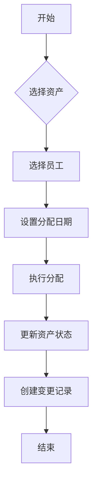
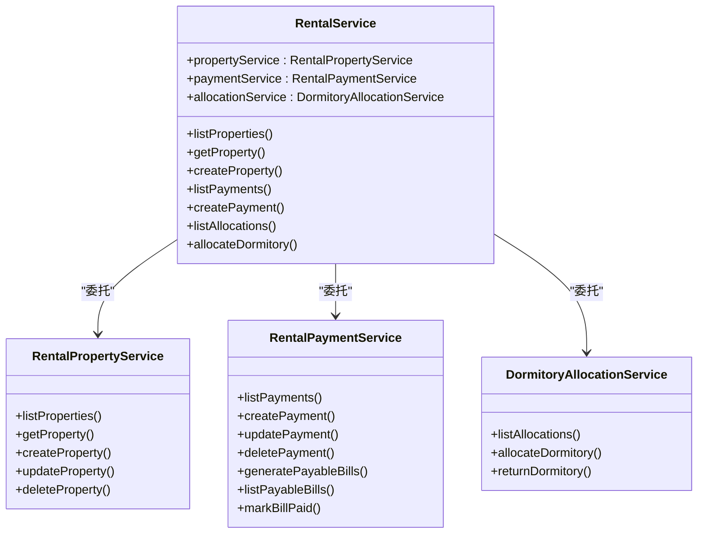

# 资产管理服务

<cite>
**本文档引用的文件**   
- [FixedAssetService.ts](file://backend/src/services/FixedAssetService.ts)
- [FixedAssetAllocationService.ts](file://backend/src/services/FixedAssetAllocationService.ts)
- [FixedAssetChangeService.ts](file://backend/src/services/FixedAssetChangeService.ts)
- [FixedAssetDepreciationService.ts](file://backend/src/services/FixedAssetDepreciationService.ts)
- [RentalPropertyService.ts](file://backend/src/services/RentalPropertyService.ts)
- [RentalService.ts](file://backend/src/services/RentalService.ts)
- [RentalPaymentService.ts](file://backend/src/services/RentalPaymentService.ts)
- [fixed-assets.ts](file://backend/src/routes/v2/fixed-assets.ts)
- [rental.ts](file://backend/src/routes/v2/rental.ts)
- [schema.ts](file://backend/src/db/schema.ts)
- [FixedAssetPurchasePage.tsx](file://frontend/src/features/assets/pages/FixedAssetPurchasePage.tsx)
- [FixedAssetAllocationPage.tsx](file://frontend/src/features/assets/pages/FixedAssetAllocationPage.tsx)
</cite>

## 目录
1. [固定资产全生命周期管理](#固定资产全生命周期管理)
2. [资产分配与变更流程](#资产分配与变更流程)
3. [折旧计算规则与执行策略](#折旧计算规则与执行策略)
4. [租赁管理服务协同机制](#租赁管理服务协同机制)
5. [资产采购分配集成流程示例](#资产采购分配集成流程示例)

## 固定资产全生命周期管理

固定资产服务（FixedAssetService）负责管理资产的完整生命周期，包括采购、使用、变更和处置。资产状态通过`status`字段进行管理，主要状态包括`in_use`（使用中）、`idle`（闲置）、`sold`（已出售）等。

资产采购通过`purchase`方法实现，该方法不仅创建资产记录，还同时生成财务流水（cash_flows）和交易记录（account_transactions），确保财务数据的一致性。采购流程会验证账户的有效性和币种匹配，并生成唯一的凭证号（voucherNo）。

资产处置通过`sell`方法实现，当资产被出售时，系统会更新资产状态为`sold`，并创建相应的收入流水。系统会阻止对已出售资产的重复处置操作。

资产的创建、更新和删除操作均通过事务保证数据一致性。删除资产时，系统会检查是否存在折旧记录，若存在则禁止删除，防止数据完整性被破坏。

**Section sources**
- [FixedAssetService.ts](file://backend/src/services/FixedAssetService.ts#L1-L608)
- [fixed-assets.ts](file://backend/src/routes/v2/fixed-assets.ts#L1-L888)

## 资产分配与变更流程

资产分配和变更由两个独立的服务协同管理：`FixedAssetAllocationService`负责资产与员工的分配和归还，`FixedAssetChangeService`负责资产的转移和状态变更。

### 资产分配服务

`FixedAssetAllocationService`通过`allocate`方法将资产分配给员工。分配前会检查资产状态是否为`in_use`或`idle`，并验证员工状态是否有效。系统会阻止对已分配且未归还资产的重复分配。

分配成功后，系统会更新资产的保管人（custodian）和状态为`in_use`，并创建变更记录。归还操作通过`return`方法实现，会将资产状态更新为`idle`，清除保管人信息。

### 资产变更服务

`FixedAssetChangeService`提供`transfer`方法用于资产转移，可以变更资产的部门、位置或保管人。该服务还提供`recordChange`通用方法，用于记录各种类型的资产变更。

两个服务通过变更记录表（fixed_asset_changes）共享数据，形成完整的资产变更历史。前端页面通过`FixedAssetAllocationPage`组件提供资产分配和归还的用户界面。

**Diagram sources**
- [FixedAssetAllocationService.ts](file://backend/src/services/FixedAssetAllocationService.ts#L1-L290)
- [FixedAssetChangeService.ts](file://backend/src/services/FixedAssetChangeService.ts#L1-L115)
- [FixedAssetAllocationPage.tsx](file://frontend/src/features/assets/pages/FixedAssetAllocationPage.tsx#L1-L326)

**Section sources**
- [FixedAssetAllocationService.ts](file://backend/src/services/FixedAssetAllocationService.ts#L1-L290)
- [FixedAssetChangeService.ts](file://backend/src/services/FixedAssetChangeService.ts#L1-L115)

## 折旧计算规则与执行策略

`FixedAssetDepreciationService`服务负责固定资产的折旧计算和记录。系统采用基于事务的执行策略，确保折旧金额、累计折旧和资产净值的同步更新。

折旧计算的核心规则包括：
1. 每次折旧前会查询该资产已有的累计折旧总额
2. 新的累计折旧 = 原累计折旧 + 本次折旧金额
3. 资产净值 = 购买价格 - 累计折旧
4. 系统会验证折旧后资产净值不能为负数

折旧记录包含折旧日期、金额、累计折旧和剩余价值等关键信息。每次成功折旧后，系统会更新资产的`currentValueCents`字段，反映资产的最新净值。

前端通过API路由调用该服务，权限控制确保只有具备`depreciate`权限的用户才能执行折旧操作。系统通过审计日志记录所有折旧操作，便于追踪和审查。

**Section sources**
- [FixedAssetDepreciationService.ts](file://backend/src/services/FixedAssetDepreciationService.ts#L1-L79)
- [fixed-assets.ts](file://backend/src/routes/v2/fixed-assets.ts#L487-L546)

## 租赁管理服务协同机制

租赁管理由三个核心服务协同工作：`RentalPropertyService`管理物业信息，`RentalPaymentService`处理租金支付，`RentalService`作为门面服务协调各组件。

### 服务协作架构

`RentalService`采用门面模式，封装了底层服务的复杂性，为前端提供统一的API接口。当获取物业详情时，`RentalService`会并行调用`RentalPropertyService`获取基本信息，同时调用`RentalPaymentService`和`DormitoryAllocationService`获取支付和分配记录。

### 物业管理

`RentalPropertyService`管理租赁物业的CRUD操作和变更历史。物业类型包括办公室、宿舍等，系统会根据物业类型应用不同的业务规则。删除物业时，系统会检查是否存在关联的付款记录，确保数据完整性。

### 租金支付

`RentalPaymentService`处理租金支付的全流程。支付时会生成财务流水和交易记录，同时更新应付账单状态。系统提供`generatePayableBills`方法，根据租赁合同自动生成应付账单，支持按月或按年生成。

**Diagram sources**
- [RentalService.ts](file://backend/src/services/RentalService.ts#L1-L162)
- [RentalPropertyService.ts](file://backend/src/services/RentalPropertyService.ts#L1-L291)
- [RentalPaymentService.ts](file://backend/src/services/RentalPaymentService.ts#L1-L400)

**Section sources**
- [RentalService.ts](file://backend/src/services/RentalService.ts#L1-L162)
- [RentalPropertyService.ts](file://backend/src/services/RentalPropertyService.ts#L1-L291)
- [RentalPaymentService.ts](file://backend/src/services/RentalPaymentService.ts#L1-L400)

## 资产采购分配集成流程示例

以下是一个完整的资产采购并分配给员工的业务流程示例，展示了多个服务的集成与数据流转：

1. **资产采购**：用户通过`FixedAssetPurchasePage`界面提交采购请求
2. **创建资产**：`FixedAssetService.purchase`方法创建资产记录
3. **生成财务流水**：同时创建现金流水和账户交易记录
4. **分配资产**：调用`FixedAssetAllocationService.allocate`方法
5. **更新资产状态**：资产状态变更为`in_use`，保管人更新为员工姓名
6. **创建变更记录**：在`fixed_asset_changes`表中记录分配事件

整个流程通过数据库事务保证原子性，任何步骤失败都会回滚所有操作。系统通过审计日志记录每个关键操作，包括采购、分配等，确保操作可追溯。

数据流转涉及多个实体表：`fixed_assets`（资产主表）、`cash_flows`（财务流水）、`account_transactions`（账户交易）、`fixed_asset_allocations`（资产分配）和`fixed_asset_changes`（变更记录），形成完整的业务闭环。

**Section sources**
- [FixedAssetService.ts](file://backend/src/services/FixedAssetService.ts#L313-L468)
- [FixedAssetAllocationService.ts](file://backend/src/services/FixedAssetAllocationService.ts#L109-L208)
- [FixedAssetPurchasePage.tsx](file://frontend/src/features/assets/pages/FixedAssetPurchasePage.tsx#L1-L255)