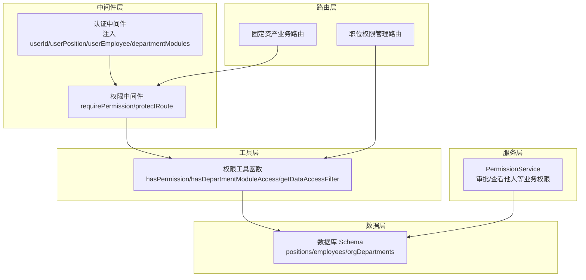
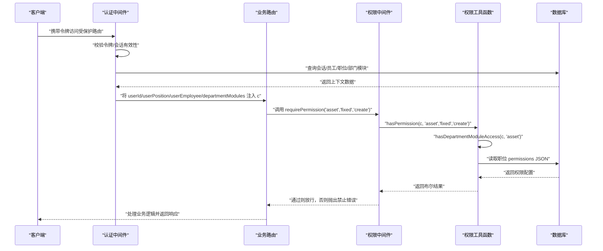
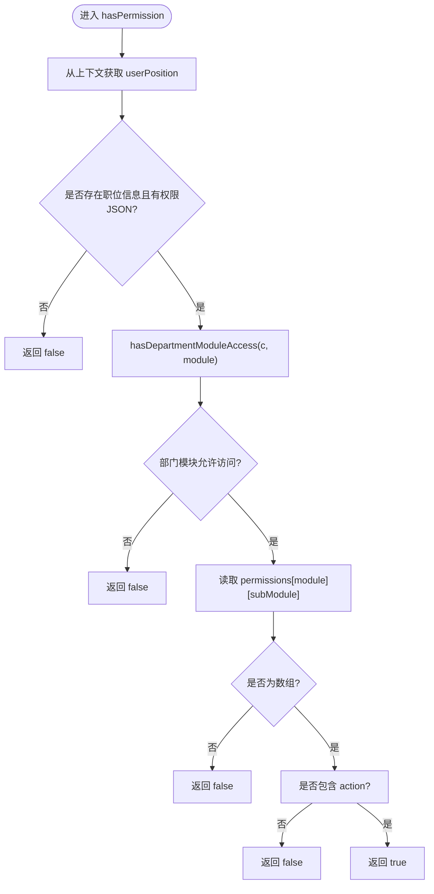
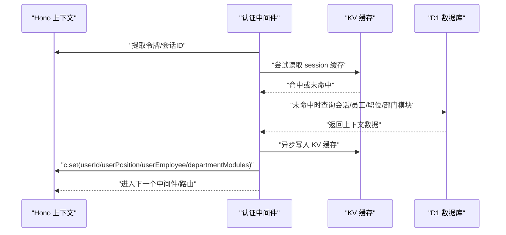
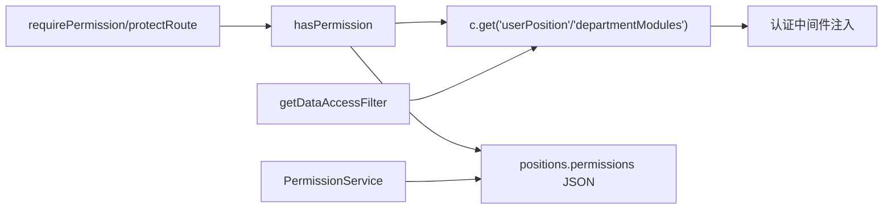

# 权限控制机制

<cite>
**本文引用的文件**
- [backend/src/middleware/permission.ts](file://backend/src/middleware/permission.ts)
- [backend/src/utils/permissions.ts](file://backend/src/utils/permissions.ts)
- [backend/src/middleware.ts](file://backend/src/middleware.ts)
- [backend/src/utils/db.ts](file://backend/src/utils/db.ts)
- [backend/src/db/schema.ts](file://backend/src/db/schema.ts)
- [backend/src/routes/v2/fixed-assets.ts](file://backend/src/routes/v2/fixed-assets.ts)
- [backend/src/routes/v2/position-permissions.ts](file://backend/src/routes/v2/position-permissions.ts)
- [backend/src/services/PermissionService.ts](file://backend/src/services/PermissionService.ts)
- [backend/src/services/EmployeeService.ts](file://backend/src/services/EmployeeService.ts)
- [frontend/src/features/system/pages/PositionPermissionsManagementPage.tsx](file://frontend/src/features/system/pages/PositionPermissionsManagementPage.tsx)
</cite>

## 目录
1. [引言](#引言)
2. [项目结构](#项目结构)
3. [核心组件](#核心组件)
4. [架构总览](#架构总览)
5. [详细组件分析](#详细组件分析)
6. [依赖关系分析](#依赖关系分析)
7. [性能考量](#性能考量)
8. [故障排查指南](#故障排查指南)
9. [结论](#结论)
10. [附录](#附录)

## 引言
本文件系统性梳理本项目的基于角色的访问控制（RBAC）机制，重点围绕以下目标展开：
- 深入解析 requirePermission 中间件与 protectRoute 保护函数的工作原理
- 讲解它们如何从请求上下文（c.var）获取用户职位（position）信息，并通过 hasPermission 函数检查用户对模块（module）、子模块（subModule）与操作（action）的权限
- 结合调用链：API 路由 -> permission 中间件 -> hasPermission 工具函数 -> 数据库查询，说明权限检查的完整流程
- 解释权限数据的存储结构（positions 与相关权限表）及查询逻辑
- 提供实际用例：创建固定资产的请求如何被 requirePermission('asset', 'fixed', 'create') 中间件拦截与验证
- 说明该机制与认证中间件如何协同，构成完整的安全防护层

## 项目结构
本项目的权限控制主要分布在以下层次：
- 中间件层：认证中间件负责将用户、职位、员工与部门模块信息注入到请求上下文中；权限中间件负责在路由层进行权限拦截
- 工具层：权限工具函数提供 hasPermission、hasDepartmentModuleAccess、getDataAccessFilter 等能力
- 服务层：PermissionService 提供更细粒度的业务权限判断（如审批、查看他人等）
- 路由层：各业务路由在关键操作上使用 requirePermission 或 hasPermission 进行权限校验
- 数据层：positions、employees、orgDepartments 等表承载权限与组织上下文

图表来源
- [backend/src/middleware.ts](file://backend/src/middleware.ts#L1-L120)
- [backend/src/middleware/permission.ts](file://backend/src/middleware/permission.ts#L1-L43)
- [backend/src/utils/permissions.ts](file://backend/src/utils/permissions.ts#L1-L273)
- [backend/src/routes/v2/fixed-assets.ts](file://backend/src/routes/v2/fixed-assets.ts#L1-L888)
- [backend/src/routes/v2/position-permissions.ts](file://backend/src/routes/v2/position-permissions.ts#L1-L252)
- [backend/src/db/schema.ts](file://backend/src/db/schema.ts#L1-L706)

章节来源
- [backend/src/middleware.ts](file://backend/src/middleware.ts#L1-L120)
- [backend/src/middleware/permission.ts](file://backend/src/middleware/permission.ts#L1-L43)
- [backend/src/utils/permissions.ts](file://backend/src/utils/permissions.ts#L1-L273)
- [backend/src/db/schema.ts](file://backend/src/db/schema.ts#L1-L706)

## 核心组件
- 认证中间件：从 JWT 与会话中验证身份，拉取用户、职位、员工与部门模块信息，写入 c.set 并在后续中间件与路由中复用
- 权限中间件：requirePermission 与 protectRoute 两个入口，均委托给 hasPermission 进行权限判定
- 权限工具函数：hasPermission 实现“部门模块白名单 × 职位权限”的双重校验；hasDepartmentModuleAccess 支持通配符匹配；getDataAccessFilter 提供数据级访问控制的 SQL 过滤条件
- 业务权限服务：PermissionService 提供审批、查看他人等更复杂的权限判断
- 路由层：固定资产业务路由在关键操作上直接调用 hasPermission 或使用 requirePermission 中间件
- 数据层：positions 存储职位编码、层级、可管理下属标志与权限 JSON；employees 关联职位与组织；orgDepartments 存储部门允许的模块白名单

章节来源
- [backend/src/middleware.ts](file://backend/src/middleware.ts#L1-L120)
- [backend/src/middleware/permission.ts](file://backend/src/middleware/permission.ts#L1-L43)
- [backend/src/utils/permissions.ts](file://backend/src/utils/permissions.ts#L1-L273)
- [backend/src/services/PermissionService.ts](file://backend/src/services/PermissionService.ts#L1-L147)
- [backend/src/routes/v2/fixed-assets.ts](file://backend/src/routes/v2/fixed-assets.ts#L1-L888)
- [backend/src/db/schema.ts](file://backend/src/db/schema.ts#L1-L706)

## 架构总览
下图展示了从请求进入系统到完成权限校验的关键路径，以及与认证中间件的协作关系。

图表来源
- [backend/src/middleware.ts](file://backend/src/middleware.ts#L1-L120)
- [backend/src/middleware/permission.ts](file://backend/src/middleware/permission.ts#L1-L43)
- [backend/src/utils/permissions.ts](file://backend/src/utils/permissions.ts#L1-L273)
- [backend/src/routes/v2/fixed-assets.ts](file://backend/src/routes/v2/fixed-assets.ts#L1-L888)

## 详细组件分析

### requirePermission 中间件与 protectRoute 保护函数
- requirePermission(module, subModule, action)：返回 Hono 中间件，前置校验用户是否具备指定模块、子模块与操作的权限；若无权限，抛出禁止错误；通过后才进入下一个中间件或路由处理器
- protectRoute(module, subModule, action, handler)：返回包装后的处理器，先校验权限再调用原 handler；适合 OpenAPI 路由场景

两者均委托给 hasPermission 进行判定，确保权限检查逻辑集中且一致。

章节来源
- [backend/src/middleware/permission.ts](file://backend/src/middleware/permission.ts#L1-L43)

### hasPermission 权限检查算法
hasPermission 的判定顺序如下：
1) 部门模块白名单检查：hasDepartmentModuleAccess
- 总部人员（level=1）不受部门模块限制，直接放行
- 若部门模块包含 '*'，表示允许所有模块
- 否则支持通配符匹配（如 hr.* 匹配 hr.employee、hr.leave 等）

2) 职位权限检查：从 c.get('userPosition') 获取职位对象，读取其 permissions JSON
- permissions[module] 存在且存在 [subModule]，且该值为数组时，检查 action 是否包含在数组中
- 任一环节缺失即判定为无权限

图表来源
- [backend/src/utils/permissions.ts](file://backend/src/utils/permissions.ts#L91-L186)

章节来源
- [backend/src/utils/permissions.ts](file://backend/src/utils/permissions.ts#L1-L273)

### 认证中间件与上下文注入
认证中间件负责：
- 校验令牌与会话有效性
- 从 KV 或数据库拉取会话数据，并异步写入 KV 缓存
- 将 userId、sessionId、userPosition、userEmployee、departmentModules 注入到 c.set
- 对于总部人员（level=1），部门模块白名单绕过限制

图表来源
- [backend/src/middleware.ts](file://backend/src/middleware.ts#L1-L120)
- [backend/src/utils/db.ts](file://backend/src/utils/db.ts#L45-L147)

章节来源
- [backend/src/middleware.ts](file://backend/src/middleware.ts#L1-L120)
- [backend/src/utils/db.ts](file://backend/src/utils/db.ts#L45-L147)

### 数据访问控制（数据级权限）
getDataAccessFilter 根据用户职位层级返回 SQL 过滤条件：
- 总部人员（level=1）：全局可见，返回 1=1
- 项目人员（level=2）：按部门过滤（departmentId）
- 组长（team_leader）：按组织/组过滤（orgDepartmentId），或在某些表无组字段时退化为 owner（id）
- 工程师（team_engineer）或其他：仅能查看自己的数据（owner=id）

该函数常用于路由层的列表查询，避免越权访问。

章节来源
- [backend/src/utils/permissions.ts](file://backend/src/utils/permissions.ts#L188-L273)
- [backend/src/routes/v2/employees.ts](file://backend/src/routes/v2/employees.ts#L46-L70)

### 职位权限数据结构与查询
- positions 表：存储职位编码、层级、可管理下属标志、权限 JSON（permissions）
- employees 表：关联 positionId，同时保存部门与组织/组信息
- orgDepartments 表：存储 allowedModules（字符串数组 JSON），用于部门级模块白名单

权限数据来源与解析：
- 认证中间件通过 getSessionWithUserAndPosition 一次性查询会话、员工、职位与部门模块，并将 permissions JSON 解析为对象
- 职位权限编辑界面以模块/子模块/动作的树形结构维护，最终以 JSON 形式存储在 positions.permissions 中

章节来源
- [backend/src/db/schema.ts](file://backend/src/db/schema.ts#L1-L706)
- [backend/src/utils/db.ts](file://backend/src/utils/db.ts#L45-L147)
- [frontend/src/features/system/pages/PositionPermissionsManagementPage.tsx](file://frontend/src/features/system/pages/PositionPermissionsManagementPage.tsx#L178-L218)

### 固定资产创建权限用例
- 路由层在创建固定资产时调用 hasPermission(c, 'asset', 'fixed', 'create')，或使用 requirePermission('asset', 'fixed', 'create') 中间件
- 中间件通过 hasPermission 检查：先部门模块白名单，再职位权限数组包含 'create'
- 若无权限，抛出禁止错误；通过后进入业务处理并记录审计日志

章节来源
- [backend/src/routes/v2/fixed-assets.ts](file://backend/src/routes/v2/fixed-assets.ts#L345-L385)

### 职位权限管理用例
- 系统管理路由对职位权限 CRUD 操作使用 hasPermission('system', 'position', 'create'|'update'|'delete'|'view') 进行保护
- 前端页面提供模块/子模块/动作勾选，生成 JSON 并提交到后端持久化

章节来源
- [backend/src/routes/v2/position-permissions.ts](file://backend/src/routes/v2/position-permissions.ts#L1-L252)
- [frontend/src/features/system/pages/PositionPermissionsManagementPage.tsx](file://frontend/src/features/system/pages/PositionPermissionsManagementPage.tsx#L178-L218)

### 业务权限服务（审批/查看他人）
- PermissionService 提供 canApproveApplication/canApprove 等方法，结合 actors 与 applicants 的层级、组别与职位 code，实现更细粒度的业务权限判断
- 该类权限通常需要查询 employees 与 positions 表，以确定审批范围与被审批人是否为工程师等

章节来源
- [backend/src/services/PermissionService.ts](file://backend/src/services/PermissionService.ts#L1-L147)
- [backend/src/services/EmployeeService.ts](file://backend/src/services/EmployeeService.ts#L656-L691)

## 依赖关系分析
- requirePermission/protectRoute 依赖 hasPermission
- hasPermission 依赖 getUserPosition/getDepartmentModules，这些数据来自认证中间件注入
- hasPermission 依赖 positions.permissions JSON，解析自数据库
- 数据访问控制依赖 employees 与 orgDepartments 的上下文字段
- 业务权限服务依赖 employees/positions 表进行跨实体判断

图表来源
- [backend/src/middleware/permission.ts](file://backend/src/middleware/permission.ts#L1-L43)
- [backend/src/utils/permissions.ts](file://backend/src/utils/permissions.ts#L1-L273)
- [backend/src/middleware.ts](file://backend/src/middleware.ts#L1-L120)
- [backend/src/services/PermissionService.ts](file://backend/src/services/PermissionService.ts#L1-L147)

章节来源
- [backend/src/middleware/permission.ts](file://backend/src/middleware/permission.ts#L1-L43)
- [backend/src/utils/permissions.ts](file://backend/src/utils/permissions.ts#L1-L273)
- [backend/src/middleware.ts](file://backend/src/middleware.ts#L1-L120)
- [backend/src/services/PermissionService.ts](file://backend/src/services/PermissionService.ts#L1-L147)

## 性能考量
- 认证中间件采用 KV 缓存 + 数据库回退策略，减少重复查询
- 会话滑动窗口续期异步更新，避免阻塞请求
- hasPermission 仅做内存中的 JSON 结构查找，复杂度低
- 数据访问控制通过单条 SQL 条件返回，避免额外查询
- 建议：权限 JSON 结构尽量扁平，避免深层嵌套；部门模块白名单使用通配符时注意匹配成本

[本节为通用建议，无需列出具体文件来源]

## 故障排查指南
- 403/401 错误
  - 检查认证中间件是否正确注入 userPosition 与 departmentModules
  - 确认 positions.permissions 是否存在且格式正确
- 无权限
  - 使用 hasDepartmentModuleAccess 检查部门模块白名单是否包含目标模块
  - 确认职位 permissions 中是否存在对应 module/subModule/action
- 数据越权
  - 检查 getDataAccessFilter 返回的 where 条件是否为 1=0
  - 确认员工上下文字段（departmentId/orgDepartmentId）是否为空
- 审批/查看他人失败
  - 使用 PermissionService 的 canApproveApplication/canViewEmployee 方法核对层级、组别与职位 code

章节来源
- [backend/src/middleware.ts](file://backend/src/middleware.ts#L1-L120)
- [backend/src/utils/permissions.ts](file://backend/src/utils/permissions.ts#L1-L273)
- [backend/src/services/PermissionService.ts](file://backend/src/services/PermissionService.ts#L1-L147)

## 结论
本项目的 RBAC 体系通过“认证中间件注入上下文 + 权限中间件/工具函数校验 + 数据库权限 JSON 存储”的组合，实现了模块级、子模块级与操作级的细粒度权限控制。配合部门模块白名单与数据级访问过滤，形成从路由到数据的完整安全边界。业务权限服务进一步扩展了审批、查看他人等复杂场景的权限判断能力。整体设计清晰、耦合度低、易于维护与扩展。

[本节为总结性内容，无需列出具体文件来源]

## 附录

### 权限数据存储与查询要点
- positions.permissions：JSON 结构，键为模块名，值为子模块映射，子模块值为动作数组
- orgDepartments.allowedModules：JSON 数组，支持通配符（如 hr.*）
- 认证中间件一次性拉取并解析上述数据，写入 c.set，后续中间件与路由直接读取

章节来源
- [backend/src/db/schema.ts](file://backend/src/db/schema.ts#L1-L706)
- [backend/src/utils/db.ts](file://backend/src/utils/db.ts#L45-L147)