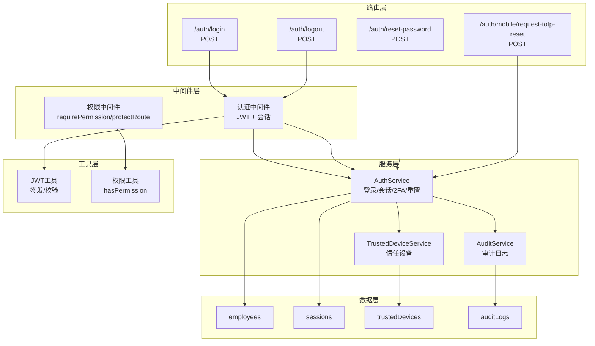
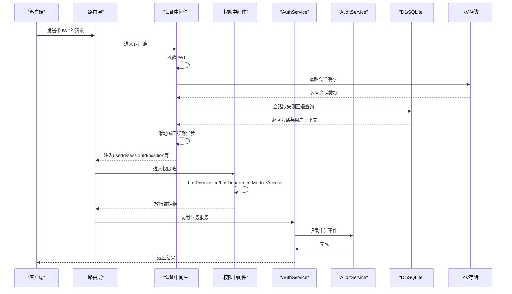
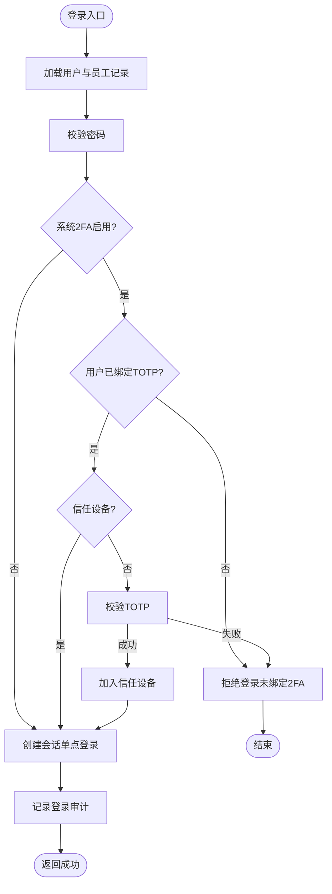
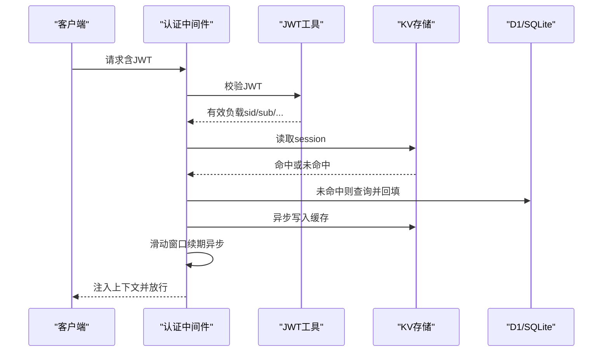
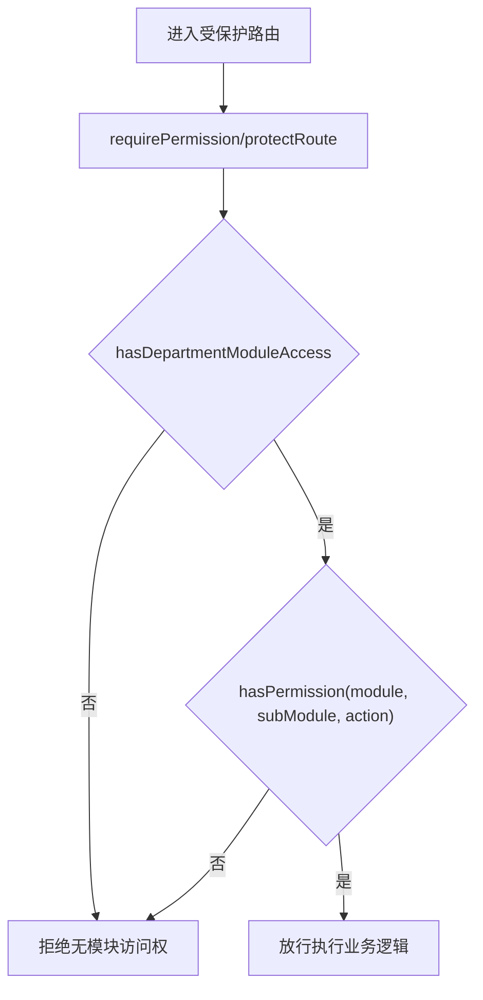
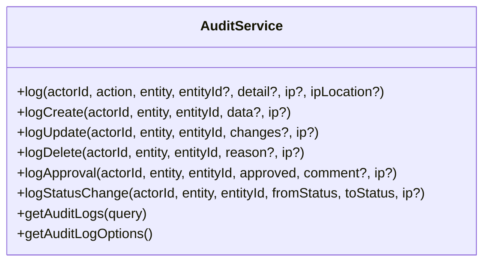
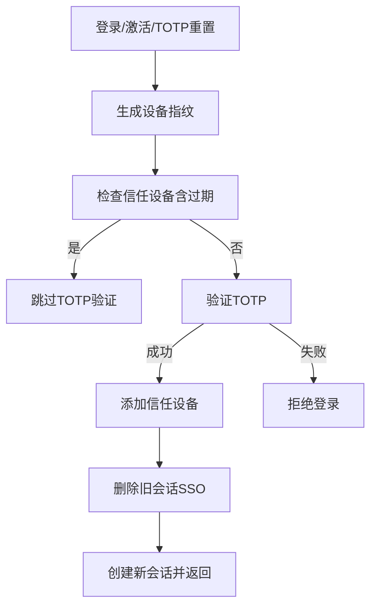
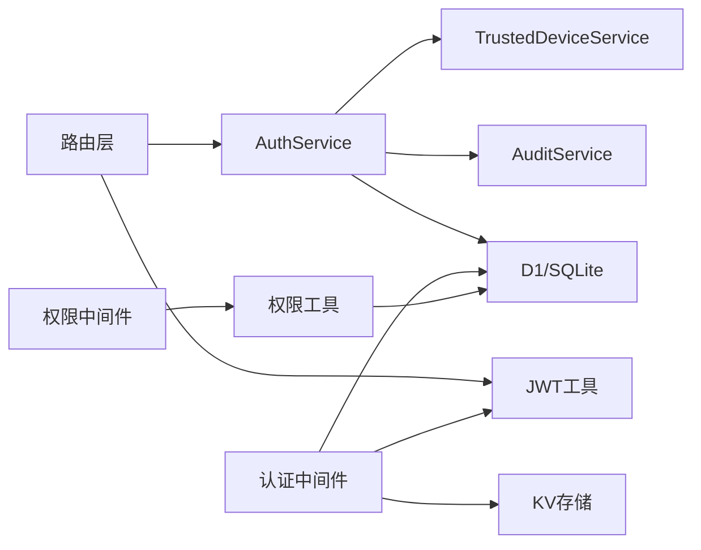

# 认证与权限

<cite>
**本文引用的文件**
- [AuthService.ts](file://backend/src/services/AuthService.ts)
- [auth.ts（路由）](file://backend/src/routes/v2/auth.ts)
- [jwt.ts（JWT工具）](file://backend/src/utils/jwt.ts)
- [middleware.ts（认证中间件）](file://backend/src/middleware.ts)
- [permission.ts（权限中间件）](file://backend/src/middleware/permission.ts)
- [permissions.ts（权限工具）](file://backend/src/utils/permissions.ts)
- [AuditService.ts（审计服务）](file://backend/src/services/AuditService.ts)
- [TrustedDeviceService.ts（信任设备服务）](file://backend/src/services/TrustedDeviceService.ts)
- [schema.ts（数据库模式）](file://backend/src/db/schema.ts)
- [security.ts（安全响应头中间件）](file://backend/src/middleware/security.ts)
</cite>

## 目录
1. [简介](#简介)
2. [项目结构](#项目结构)
3. [核心组件](#核心组件)
4. [架构总览](#架构总览)
5. [详细组件分析](#详细组件分析)
6. [依赖关系分析](#依赖关系分析)
7. [性能考量](#性能考量)
8. [故障排查指南](#故障排查指南)
9. [结论](#结论)

## 简介
本文件面向财务系统后端的认证与权限机制，重点覆盖：
- 双因素认证（2FA）与TOTP（Google验证码）集成
- 基于角色的访问控制（RBAC），包括模块级访问控制与操作权限
- 会话管理与单点登录（SSO）策略
- 审计日志（AuditService）记录安全相关事件，满足合规性要求
- 信任设备机制与设备指纹策略
- 前后端交互流程与中间件链路

## 项目结构
围绕认证与权限的关键目录与文件：
- 服务层：AuthService、AuditService、TrustedDeviceService、PositionService
- 路由层：/auth 相关路由（登录、登出、重置密码、TOTP重置等）
- 中间件层：认证中间件（JWT + 会话）、权限中间件（requirePermission/protectRoute）
- 工具层：JWT签名/校验、权限工具（hasPermission、hasDepartmentModuleAccess等）
- 数据层：数据库模式（employees、sessions、trustedDevices、auditLogs等）

图表来源
- [auth.ts（路由）](file://backend/src/routes/v2/auth.ts#L1-L120)
- [middleware.ts（认证中间件）](file://backend/src/middleware.ts#L1-L120)
- [permission.ts（权限中间件）](file://backend/src/middleware/permission.ts#L1-L43)
- [AuthService.ts](file://backend/src/services/AuthService.ts#L1-L148)
- [AuditService.ts](file://backend/src/services/AuditService.ts#L1-L120)
- [TrustedDeviceService.ts](file://backend/src/services/TrustedDeviceService.ts#L1-L100)
- [jwt.ts（JWT工具）](file://backend/src/utils/jwt.ts#L1-L132)
- [permissions.ts（权限工具）](file://backend/src/utils/permissions.ts#L1-L125)
- [schema.ts（数据库模式）](file://backend/src/db/schema.ts#L14-L138)

章节来源
- [auth.ts（路由）](file://backend/src/routes/v2/auth.ts#L1-L120)
- [middleware.ts（认证中间件）](file://backend/src/middleware.ts#L1-L120)
- [permission.ts（权限中间件）](file://backend/src/middleware/permission.ts#L1-L43)
- [AuthService.ts](file://backend/src/services/AuthService.ts#L1-L148)
- [AuditService.ts](file://backend/src/services/AuditService.ts#L1-L120)
- [TrustedDeviceService.ts](file://backend/src/services/TrustedDeviceService.ts#L1-L100)
- [jwt.ts（JWT工具）](file://backend/src/utils/jwt.ts#L1-L132)
- [permissions.ts（权限工具）](file://backend/src/utils/permissions.ts#L1-L125)
- [schema.ts（数据库模式）](file://backend/src/db/schema.ts#L14-L138)

## 核心组件
- AuthService：统一处理登录、会话创建与续期、登出、密码重置、TOTP重置、激活账户等；集成信任设备与审计日志。
- 认证中间件：从请求中提取JWT，校验并加载用户上下文（userId、sessionId、userPosition、userEmployee、departmentModules）。
- 权限中间件：基于职位权限配置进行模块与操作级别的访问控制。
- 权限工具：提供hasPermission、hasDepartmentModuleAccess、getDataAccessFilter等能力。
- AuditService：标准化审计动作与实体类型，记录登录、登出、密码重置、TOTP重置等事件。
- TrustedDeviceService：设备指纹生成、信任设备判定、添加信任设备、清理过期设备。
- JWT工具：HS256签名与校验，支持多渠道获取令牌（Header、Cookie、自定义Header）。
- 数据库模式：employees、sessions、trustedDevices、auditLogs等核心表。

章节来源
- [AuthService.ts](file://backend/src/services/AuthService.ts#L1-L148)
- [middleware.ts（认证中间件）](file://backend/src/middleware.ts#L1-L120)
- [permission.ts（权限中间件）](file://backend/src/middleware/permission.ts#L1-L43)
- [permissions.ts（权限工具）](file://backend/src/utils/permissions.ts#L1-L125)
- [AuditService.ts（审计服务）](file://backend/src/services/AuditService.ts#L1-L120)
- [TrustedDeviceService.ts（信任设备服务）](file://backend/src/services/TrustedDeviceService.ts#L1-L100)
- [jwt.ts（JWT工具）](file://backend/src/utils/jwt.ts#L1-L132)
- [schema.ts（数据库模式）](file://backend/src/db/schema.ts#L14-L138)

## 架构总览
认证与权限的整体流程：
- 客户端携带JWT访问受保护路由
- 认证中间件校验JWT并加载用户上下文
- 权限中间件根据职位权限与模块白名单进行二次校验
- 业务路由执行具体操作，并通过AuditService记录审计事件
- 会话采用滑动窗口续期策略，确保活跃用户长期有效

图表来源
- [middleware.ts（认证中间件）](file://backend/src/middleware.ts#L1-L120)
- [permission.ts（权限中间件）](file://backend/src/middleware/permission.ts#L1-L43)
- [AuthService.ts](file://backend/src/services/AuthService.ts#L1-L148)
- [AuditService.ts（审计服务）](file://backend/src/services/AuditService.ts#L1-L120)

## 详细组件分析

### 认证与会话管理（AuthService）
- 登录流程
  - 校验员工与用户状态
  - 密码比对
  - 2FA策略：系统配置开关、用户是否绑定TOTP、信任设备判定
  - 新设备登录需TOTP验证并通过后加入信任设备
  - 创建会话：单点登录（SSE）策略，删除旧会话（KV+DB），写入D1与KV
  - 审计日志：记录登录事件
- 会话管理
  - getSession：优先KV，降级D1
  - logout：删除KV与DB中的会话并记录审计
- 密码重置
  - requestPasswordReset：生成重置令牌，异步发送邮件，记录审计
  - verifyResetToken/resetPassword：校验令牌、过期时间，更新密码并自动登录
- TOTP重置
  - requestTotpReset：生成KV令牌（30分钟），异步发送邮件，记录审计
  - verifyTotpResetToken/resetTotpByToken：校验并重置TOTP
- 激活账户
  - generateTotpForActivation：生成TOTP密钥与二维码
  - activateAccount：校验TOTP，设置密码与激活状态，自动登录并记录审计

图表来源
- [AuthService.ts](file://backend/src/services/AuthService.ts#L34-L148)
- [TrustedDeviceService.ts（信任设备服务）](file://backend/src/services/TrustedDeviceService.ts#L1-L100)
- [AuditService.ts（审计服务）](file://backend/src/services/AuditService.ts#L1-L120)

章节来源
- [AuthService.ts](file://backend/src/services/AuthService.ts#L34-L148)
- [TrustedDeviceService.ts（信任设备服务）](file://backend/src/services/TrustedDeviceService.ts#L1-L100)
- [AuditService.ts（审计服务）](file://backend/src/services/AuditService.ts#L1-L120)

### JWT与认证中间件
- JWT工具
  - HS256签名与校验
  - 支持从Authorization Bearer、Cookie或自定义Header提取令牌
  - TTL与过期校验
- 认证中间件
  - 提取并校验JWT
  - 从KV读取会话缓存，缺失则回退D1并写入KV
  - 滑动窗口续期：活跃用户自动延长7天
  - 加载用户上下文：userId、sessionId、userPosition、userEmployee、departmentModules
  - 公共路径放行

图表来源
- [middleware.ts（认证中间件）](file://backend/src/middleware.ts#L1-L120)
- [jwt.ts（JWT工具）](file://backend/src/utils/jwt.ts#L1-L132)

章节来源
- [middleware.ts（认证中间件）](file://backend/src/middleware.ts#L1-L120)
- [jwt.ts（JWT工具）](file://backend/src/utils/jwt.ts#L1-L132)

### 权限控制（RBAC）
- 权限中间件
  - requirePermission(module, subModule, action)：基于职位权限进行校验
  - protectRoute：OpenAPI路由包装器，前置权限校验
- 权限工具
  - hasDepartmentModuleAccess：模块白名单与层级（总部/项目/组）控制
  - hasPermission：模块+子模块+操作三元匹配，支持通配符前缀
  - getDataAccessFilter：按职位层级生成数据访问过滤条件（总部/项目/组/个人）
  - 辅助函数：canManageSubordinates、isHeadquartersStaff、isProjectStaff、isTeamMember、hasPositionCode

图表来源
- [permission.ts（权限中间件）](file://backend/src/middleware/permission.ts#L1-L43)
- [permissions.ts（权限工具）](file://backend/src/utils/permissions.ts#L1-L125)

章节来源
- [permission.ts（权限中间件）](file://backend/src/middleware/permission.ts#L1-L43)
- [permissions.ts（权限工具）](file://backend/src/utils/permissions.ts#L1-L125)

### 审计日志（AuditService）
- 标准化动作与实体类型
- 日志记录：log、logCreate、logUpdate、logDelete、logApproval、logStatusChange
- 查询与选项：支持按动作、实体、时间、关键词等过滤，返回总数与分页结果
- 安全事件：登录、登出、密码重置、TOTP重置、激活账户等均记录审计

图表来源
- [AuditService.ts（审计服务）](file://backend/src/services/AuditService.ts#L1-L277)

章节来源
- [AuditService.ts（审计服务）](file://backend/src/services/AuditService.ts#L1-L277)

### 信任设备与单点登录（SSO）
- 信任设备
  - 设备指纹：基于userId、ip、userAgent生成SHA-256指纹
  - 判定：90天有效期，过期自动清理并返回false
  - 添加：首次验证通过后写入trustedDevices
  - 清理：定期清理过期设备
- 单点登录（SSO）
  - 登录时删除该用户所有旧会话（KV+DB），确保同一时刻仅有一个有效会话
  - 会话续期：滑动窗口续期，活跃用户自动延长7天

图表来源
- [TrustedDeviceService.ts（信任设备服务）](file://backend/src/services/TrustedDeviceService.ts#L1-L100)
- [AuthService.ts](file://backend/src/services/AuthService.ts#L150-L198)

章节来源
- [TrustedDeviceService.ts（信任设备服务）](file://backend/src/services/TrustedDeviceService.ts#L1-L100)
- [AuthService.ts](file://backend/src/services/AuthService.ts#L150-L198)

### 安全响应头中间件
- 设置安全响应头：X-Content-Type-Options、X-Frame-Options、X-XSS-Protection、Strict-Transport-Security、Content-Security-Policy、Referrer-Policy、Permissions-Policy、X-Permitted-Cross-Domain-Policies
- 在HTTPS环境下启用HSTS

章节来源
- [security.ts（安全响应头中间件）](file://backend/src/middleware/security.ts#L1-L81)

## 依赖关系分析
- 认证链路
  - 路由层依赖AuthService与JWT工具
  - 认证中间件依赖JWT工具与KV/D1
  - 权限中间件依赖权限工具
- 数据依赖
  - employees：用户与认证字段（密码哈希、TOTP、激活/重置令牌）
  - sessions：会话持久化与过期时间
  - trustedDevices：信任设备指纹与过期清理
  - auditLogs：审计事件记录

图表来源
- [auth.ts（路由）](file://backend/src/routes/v2/auth.ts#L1-L120)
- [middleware.ts（认证中间件）](file://backend/src/middleware.ts#L1-L120)
- [permission.ts（权限中间件）](file://backend/src/middleware/permission.ts#L1-L43)
- [AuthService.ts](file://backend/src/services/AuthService.ts#L1-L148)
- [TrustedDeviceService.ts（信任设备服务）](file://backend/src/services/TrustedDeviceService.ts#L1-L100)
- [AuditService.ts（审计服务）](file://backend/src/services/AuditService.ts#L1-L120)
- [jwt.ts（JWT工具）](file://backend/src/utils/jwt.ts#L1-L132)
- [permissions.ts（权限工具）](file://backend/src/utils/permissions.ts#L1-L125)
- [schema.ts（数据库模式）](file://backend/src/db/schema.ts#L14-L138)

章节来源
- [auth.ts（路由）](file://backend/src/routes/v2/auth.ts#L1-L120)
- [middleware.ts（认证中间件）](file://backend/src/middleware.ts#L1-L120)
- [permission.ts（权限中间件）](file://backend/src/middleware/permission.ts#L1-L43)
- [AuthService.ts](file://backend/src/services/AuthService.ts#L1-L148)
- [TrustedDeviceService.ts（信任设备服务）](file://backend/src/services/TrustedDeviceService.ts#L1-L100)
- [AuditService.ts（审计服务）](file://backend/src/services/AuditService.ts#L1-L120)
- [jwt.ts（JWT工具）](file://backend/src/utils/jwt.ts#L1-L132)
- [permissions.ts（权限工具）](file://backend/src/utils/permissions.ts#L1-L125)
- [schema.ts（数据库模式）](file://backend/src/db/schema.ts#L14-L138)

## 性能考量
- KV优先：认证中间件优先从KV读取会话，减少D1查询压力
- 异步续期：滑动窗口续期与KV写入均异步执行，避免阻塞主请求
- 单点登录：登录时批量清理旧会话，降低KV与DB冗余
- 信任设备：指纹生成与判定采用SHA-256与90天过期策略，兼顾安全与性能
- 速率限制：登录、密码重置、TOTP重置路由已应用限流中间件

[本节为通用指导，无需列出具体文件来源]

## 故障排查指南
- 401未授权
  - 检查请求是否携带有效的JWT（Authorization Bearer、Cookie或自定义Header）
  - 校验AUTH_JWT_SECRET配置是否正确
- 403禁止访问
  - 检查职位权限配置（positions.permissions）是否包含所需模块/操作
  - 确认部门模块白名单（departmentModules）是否允许访问
- 信任设备问题
  - 确认设备指纹生成逻辑（userId/ip/userAgent）是否一致
  - 检查90天过期清理任务是否正常运行
- 审计日志缺失
  - 确认AuditService.log调用是否在关键流程中触发
  - 检查auditLogs表索引与查询条件
- 会话异常
  - 检查KV与D1中sessions表一致性
  - 确认滑动窗口续期异步任务是否执行

章节来源
- [middleware.ts（认证中间件）](file://backend/src/middleware.ts#L1-L120)
- [permission.ts（权限中间件）](file://backend/src/middleware/permission.ts#L1-L43)
- [permissions.ts（权限工具）](file://backend/src/utils/permissions.ts#L1-L125)
- [TrustedDeviceService.ts（信任设备服务）](file://backend/src/services/TrustedDeviceService.ts#L1-L100)
- [AuditService.ts（审计服务）](file://backend/src/services/AuditService.ts#L1-L120)

## 结论
本系统通过JWT+会话的组合认证、严格的RBAC权限控制、信任设备与单点登录策略，以及完善的审计日志，构建了安全、合规且可扩展的认证与权限体系。认证中间件负责身份校验与上下文注入，权限中间件与工具函数共同实现模块与操作级的细粒度控制，配合审计服务满足监管要求。建议持续优化限流策略、监控KV/D1性能，并定期清理过期设备与会话，保障系统稳定与安全。