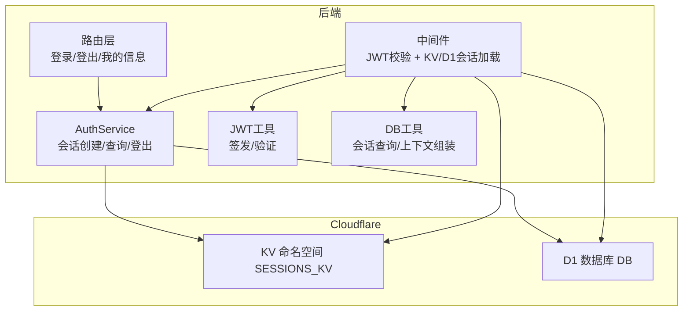
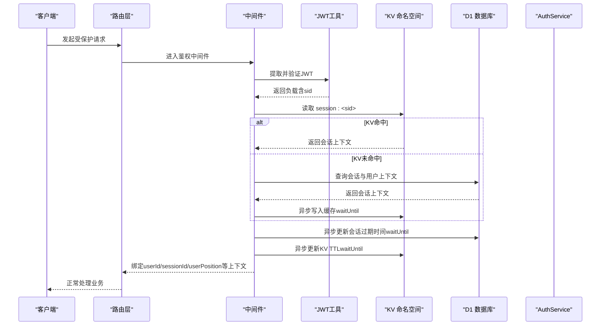
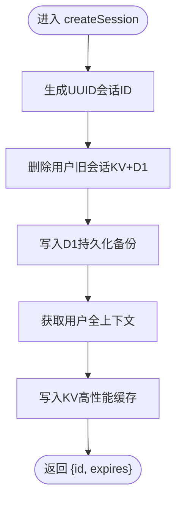
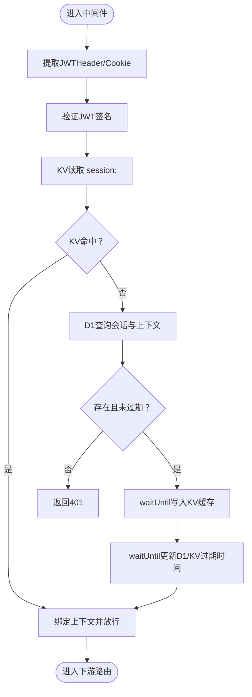
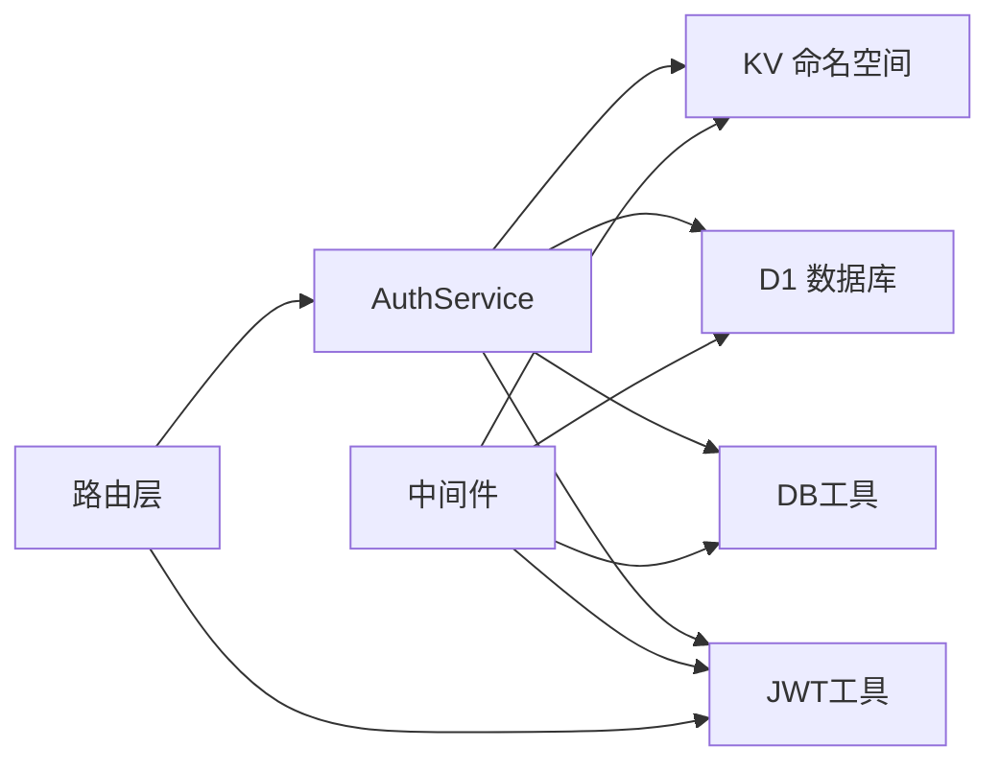

# 会话管理

<cite>
**本文引用的文件**
- [AuthService.ts](file://backend/src/services/AuthService.ts)
- [middleware.ts](file://backend/src/middleware.ts)
- [jwt.ts](file://backend/src/utils/jwt.ts)
- [db.ts](file://backend/src/utils/db.ts)
- [schema.ts](file://backend/src/db/schema.ts)
- [auth.ts](file://backend/src/routes/v2/auth.ts)
- [wrangler.toml](file://backend/wrangler.toml)
- [auth.test.ts](file://backend/test/routes/v2/auth.test.ts)
</cite>

## 目录
1. [简介](#简介)
2. [项目结构](#项目结构)
3. [核心组件](#核心组件)
4. [架构总览](#架构总览)
5. [详细组件分析](#详细组件分析)
6. [依赖关系分析](#依赖关系分析)
7. [性能考量](#性能考量)
8. [故障排查指南](#故障排查指南)
9. [结论](#结论)

## 简介
本文件面向“基于JWT与Cloudflare KV的分布式会话系统”，围绕AuthService中的createSession、getSession、logout三个方法，系统性阐述其与中间件协作的完整链路：包括会话ID生成、7天过期策略、单点登录（SSO）机制、D1持久化与KV缓存的双重存储策略、waitUntil异步更新缓存的优化、滑动窗口续期机制，以及从请求头或Cookie提取JWT、验证签名、提取会话ID、优先KV、降级D1、自动重建缓存的会话验证流程。同时说明会话与用户上下文（职位、部门权限）的绑定过程，帮助读者快速理解并正确使用该会话体系。

## 项目结构
- 会话与认证相关的核心代码集中在 backend/src/services、backend/src/utils、backend/src/routes/v2 与 backend/src/middleware.ts。
- Cloudflare 绑定在 wrangler.toml 中声明，KV命名空间为 SESSIONS_KV，D1数据库为 DB。
- 测试覆盖了登录、会话验证等关键路径，验证JWT签发、KV缓存与D1回退、waitUntil异步更新等行为。

图表来源
- [AuthService.ts](file://backend/src/services/AuthService.ts#L150-L227)
- [middleware.ts](file://backend/src/middleware.ts#L1-L120)
- [jwt.ts](file://backend/src/utils/jwt.ts#L56-L124)
- [db.ts](file://backend/src/utils/db.ts#L45-L147)
- [auth.ts](file://backend/src/routes/v2/auth.ts#L43-L128)
- [wrangler.toml](file://backend/wrangler.toml#L1-L20)

章节来源
- [wrangler.toml](file://backend/wrangler.toml#L1-L20)

## 核心组件
- AuthService：负责登录后的会话创建（SSO、KV/D1写入）、会话查询（KV优先、D1降级）、登出清理（KV/D1删除）。
- 中间件：统一鉴权入口，从请求头或Cookie提取JWT，验证签名，按sid加载会话上下文，KV命中则异步重建缓存，未命中则回退D1并写入KV。
- JWT工具：提供签发与验证，负载包含sid（会话ID）、sub（用户ID）、email、name、position等。
- DB工具：提供会话查询与用户全上下文组装，供KV缓存重建使用。
- 路由层：登录接口签发JWT并返回；登出接口根据JWT中的sid调用AuthService.logout；/me接口展示当前用户上下文。

章节来源
- [AuthService.ts](file://backend/src/services/AuthService.ts#L150-L227)
- [middleware.ts](file://backend/src/middleware.ts#L1-L120)
- [jwt.ts](file://backend/src/utils/jwt.ts#L56-L124)
- [db.ts](file://backend/src/utils/db.ts#L45-L147)
- [auth.ts](file://backend/src/routes/v2/auth.ts#L43-L128)

## 架构总览
下图展示了从客户端发起请求到中间件鉴权、KV/D1会话加载、滑动续期与上下文绑定的完整流程。

图表来源
- [middleware.ts](file://backend/src/middleware.ts#L1-L120)
- [jwt.ts](file://backend/src/utils/jwt.ts#L56-L124)
- [db.ts](file://backend/src/utils/db.ts#L45-L147)
- [AuthService.ts](file://backend/src/services/AuthService.ts#L150-L227)

## 详细组件分析

### AuthService：createSession、getSession、logout
- createSession
  - 生成UUID作为会话ID，设置7天过期时间。
  - 实现单点登录（SSO）：删除该用户所有旧会话（KV与D1），确保同一用户仅保留一个有效会话。
  - 写入D1作为持久化备份与审计来源。
  - 通过getUserFullContext获取用户全上下文，写入KV作为高性能缓存，KV TTL以会话剩余时间为准。
- getSession
  - 优先从KV读取，若命中返回会话元数据。
  - 若未命中，回退D1查询，校验过期时间后返回。
- logout
  - 依据会话ID查询并审计，随后删除KV与D1中的对应会话记录。

图表来源
- [AuthService.ts](file://backend/src/services/AuthService.ts#L150-L198)

章节来源
- [AuthService.ts](file://backend/src/services/AuthService.ts#L150-L227)

### 中间件：JWT提取、KV/D1会话加载、滑动续期
- JWT提取：支持请求头Authorization（Bearer）或Cookie（x-caiwu-token），兼容Alt Header。
- 会话加载：优先从KV读取session:<sid>；未命中则回退D1查询（getSessionWithUserAndPosition），并将结果异步写入KV。
- 滑动续期：对活跃会话异步更新D1与KV的expires_at与last_active_at，统一延长至7天后过期，避免频繁刷新导致的过期风险。
- 上下文绑定：将userId、sessionId、userPosition、userEmployee、departmentModules等注入到上下文中，供后续路由使用。

图表来源
- [middleware.ts](file://backend/src/middleware.ts#L1-L120)
- [db.ts](file://backend/src/utils/db.ts#L45-L147)

章节来源
- [middleware.ts](file://backend/src/middleware.ts#L1-L120)

### JWT工具：签发与验证
- 签发：构造负载（包含sid、sub、email、name、position等），设置iat/exp，使用HMAC-SHA256签名，返回JWT字符串。
- 验证：拆分JWT三段，验证签名有效性与exp未过期，解析负载返回。

章节来源
- [jwt.ts](file://backend/src/utils/jwt.ts#L56-L124)

### DB工具：会话查询与上下文组装
- getSessionWithUserAndPosition：一次性联表查询会话、员工、职位、组织部门及允许模块，过滤过期与停用状态，返回标准化上下文。
- getUserFullContext：仅返回用户全上下文（不含会话），用于KV缓存重建。

章节来源
- [db.ts](file://backend/src/utils/db.ts#L45-L147)

### 路由层：登录、登出、我的信息
- 登录：调用AuthService.login，成功后签发JWT（负载包含sid、user、position等），并通过waitUntil异步发送登录通知邮件。
- 登出：从请求中提取JWT，验证后调用AuthService.logout，清理KV/D1会话。
- /me：验证JWT，调用AuthService.getSession获取会话，再查询员工与职位信息，返回统一用户结构。

章节来源
- [auth.ts](file://backend/src/routes/v2/auth.ts#L43-L128)
- [auth.ts](file://backend/src/routes/v2/auth.ts#L179-L214)
- [auth.ts](file://backend/src/routes/v2/auth.ts#L238-L283)

### 会话与用户上下文绑定
- 中间件在KV命中后，将以下上下文注入到请求变量中：
  - userId、sessionId
  - userPosition（职位信息，含权限）
  - userEmployee（员工基本信息）
  - departmentModules（部门允许的功能模块）
- 路由层可直接使用这些上下文进行权限控制与业务处理。

章节来源
- [middleware.ts](file://backend/src/middleware.ts#L60-L110)
- [db.ts](file://backend/src/utils/db.ts#L45-L147)

## 依赖关系分析
- AuthService依赖：
  - KV命名空间（SESSIONS_KV）用于缓存会话上下文
  - D1数据库（DB）用于持久化会话与审计
  - DB工具（getUserFullContext、getSessionWithUserAndPosition）用于上下文组装与查询
  - JWT工具（signAuthToken、verifyAuthToken）用于签发与验证
- 中间件依赖：
  - JWT工具（verifyAuthToken）
  - DB工具（getSessionWithUserAndPosition）
  - KV与D1（读写会话）
- 路由层依赖：
  - AuthService（登录、登出、会话查询）
  - JWT工具（签发/验证）

图表来源
- [AuthService.ts](file://backend/src/services/AuthService.ts#L1-L40)
- [middleware.ts](file://backend/src/middleware.ts#L1-L20)
- [jwt.ts](file://backend/src/utils/jwt.ts#L56-L124)
- [db.ts](file://backend/src/utils/db.ts#L1-L20)
- [auth.ts](file://backend/src/routes/v2/auth.ts#L43-L128)

章节来源
- [AuthService.ts](file://backend/src/services/AuthService.ts#L1-L40)
- [middleware.ts](file://backend/src/middleware.ts#L1-L20)
- [jwt.ts](file://backend/src/utils/jwt.ts#L56-L124)
- [db.ts](file://backend/src/utils/db.ts#L1-L20)
- [auth.ts](file://backend/src/routes/v2/auth.ts#L43-L128)

## 性能考量
- KV优先策略：中间件优先从KV读取会话，命中率高、延迟低。
- 异步重建缓存：KV未命中时，回退D1查询后，通过executionCtx.waitUntil异步写入KV，避免阻塞主请求。
- 滑动续期：对活跃会话异步延长7天有效期，减少频繁刷新带来的压力，同时保证安全。
- D1只做持久化与审计：会话数据主要走KV，D1承担备份与审计职责，降低热点访问压力。
- TTL策略：KV写入时使用会话剩余秒数作为TTL，确保过期与D1保持一致。

[本节为通用指导，无需列出具体文件来源]

## 故障排查指南
- 401未授权
  - 检查请求头Authorization或Cookie是否携带JWT，确认JWT签名有效且未过期。
  - 中间件在JWT验证失败或KV/D1均未命中时返回401。
- 403禁止访问
  - 当会话上下文缺失position时，中间件返回403，需确认员工记录与职位关联正常。
- 登录后仍提示未登录
  - 确认AuthService.createSession是否成功写入KV/D1，以及KV键名格式为“session:<sid>”。
  - 检查wrangler.toml中KV命名空间SESSIONS_KV与D1绑定是否正确。
- 登出无效
  - 确认AuthService.logout是否删除了KV与D1中的会话记录。
  - 登出路由会根据JWT中的sid调用logout，需确保JWT有效。
- waitUntil未生效
  - 确认executionCtx存在且waitUntil可用，测试用例中通过mock executionCtx.waitUntil验证异步任务执行。

章节来源
- [middleware.ts](file://backend/src/middleware.ts#L1-L120)
- [AuthService.ts](file://backend/src/services/AuthService.ts#L220-L227)
- [auth.test.ts](file://backend/test/routes/v2/auth.test.ts#L1-L189)

## 结论
该会话系统通过JWT承载会话ID（sid），结合Cloudflare KV与D1实现了高性能与可靠性的平衡：KV提供毫秒级读取与滑动续期能力，D1提供持久化与审计保障；中间件统一鉴权、上下文绑定与异步缓存重建；AuthService负责SSO、会话生命周期管理与登出清理。整体设计兼顾安全性、可扩展性与开发体验，适合在边缘运行时场景中稳定运行。