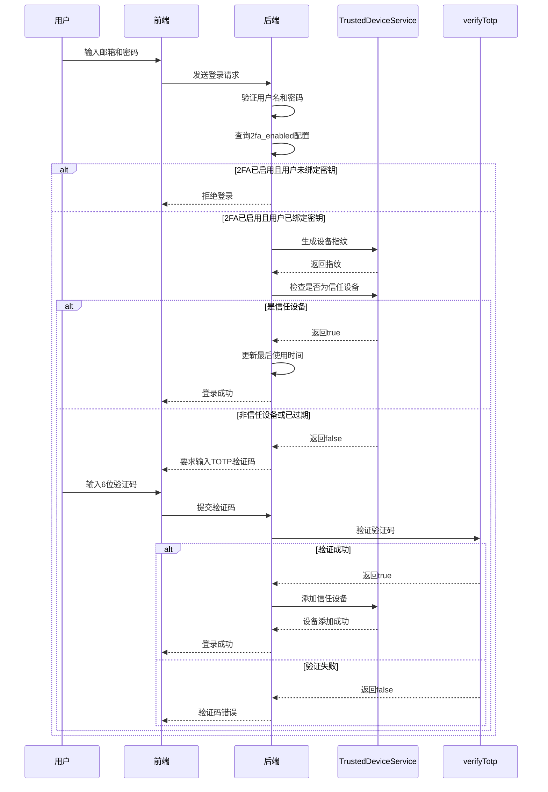
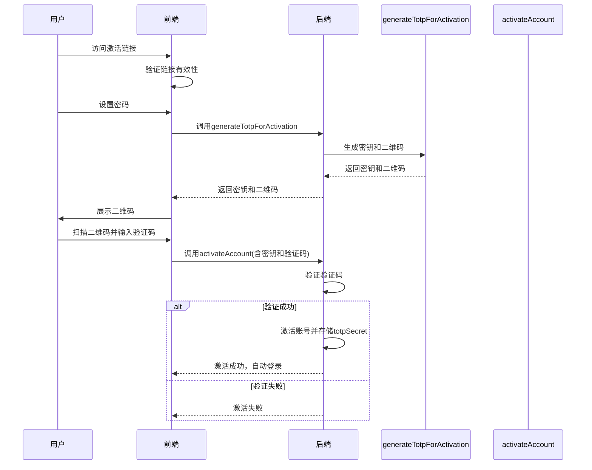
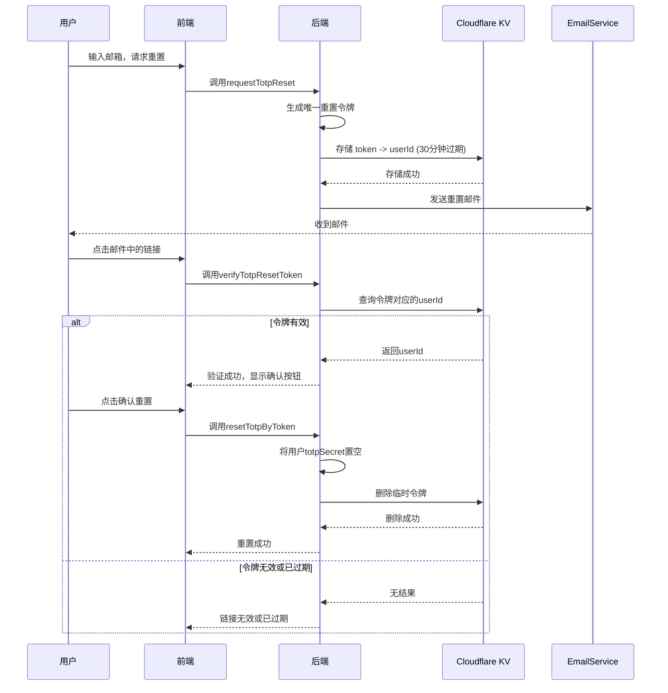
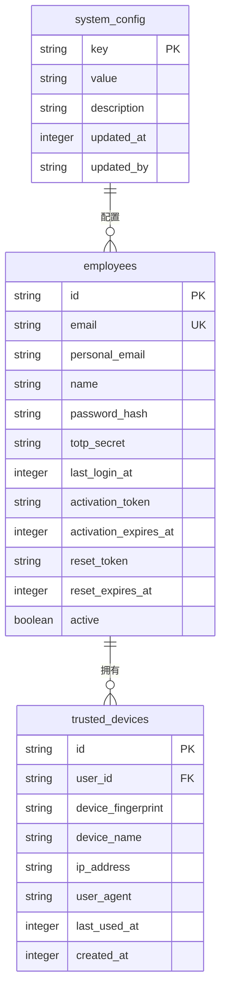

# 双因素认证

<cite>
**本文档引用文件**  
- [auth.ts](file://backend/src/routes/v2/auth.ts)
- [AuthService.ts](file://backend/src/services/AuthService.ts)
- [SystemConfigService.ts](file://backend/src/services/SystemConfigService.ts)
- [TrustedDeviceService.ts](file://backend/src/services/TrustedDeviceService.ts)
- [schema.ts](file://backend/src/db/schema.ts)
- [auth.ts](file://frontend/src/features/auth/pages/LoginPage.tsx)
- [ActivateAccountPage.tsx](file://frontend/src/features/auth/pages/ActivateAccountPage.tsx)
- [RequestTotpResetPage.tsx](file://frontend/src/features/auth/pages/RequestTotpResetPage.tsx)
- [ResetTotpConfirmPage.tsx](file://frontend/src/features/auth/pages/ResetTotpConfirmPage.tsx)
- [EmailService.ts](file://backend/src/services/EmailService.ts)
- [auth.ts](file://backend/src/utils/auth.ts)
</cite>

## 目录
1. [系统级2FA开关配置](#系统级2fa开关配置)
2. [登录流程中的2FA验证机制](#登录流程中的2fa验证机制)
3. [账号激活与TOTP绑定流程](#账号激活与totp绑定流程)
4. [TOTP重置安全机制](#totp重置安全机制)
5. [信任设备管理](#信任设备管理)
6. [数据模型与架构](#数据模型与架构)

## 系统级2FA开关配置

系统级双因素认证（2FA）的启用状态由 `systemConfigService.get('2fa_enabled')` 配置项控制。该配置项存储于 `system_config` 数据表中，其值为布尔类型或字符串形式的布尔值（`true`/`false`）。若该配置项未设置，则系统默认启用2FA功能，体现了系统对安全性的默认强制策略。

**Section sources**
- [SystemConfigService.ts](file://backend/src/services/SystemConfigService.ts#L9-L21)
- [AuthService.ts](file://backend/src/services/AuthService.ts#L79-L82)
- [schema.ts](file://backend/src/db/schema.ts#L3-L9)

## 登录流程中的2FA验证机制

在用户登录流程中，系统首先验证用户名和密码。随后，系统会查询 `2fa_enabled` 配置项以确定2FA策略。如果系统强制启用2FA，但用户账户已激活却未绑定TOTP密钥（`totpSecret`为空），则会拒绝登录请求。

对于已启用2FA的用户，系统会生成一个基于SHA-256哈希算法的设备指纹，该指纹由用户ID、IP地址和User-Agent字符串组合而成。系统通过 `TrustedDeviceService` 服务检查当前设备是否为信任设备。信任设备的有效期为90天，超过此期限的设备将被视为新设备。

若当前设备为新设备，系统将要求用户提供Google验证码（TOTP）。用户输入验证码后，系统调用 `verifyTotp` 函数进行验证。验证成功后，该设备将被添加至用户的信任设备列表中，以便后续登录时免于二次验证。

**Diagram sources**
- [AuthService.ts](file://backend/src/services/AuthService.ts#L73-L113)
- [TrustedDeviceService.ts](file://backend/src/services/TrustedDeviceService.ts#L17-L63)
- [auth.ts](file://backend/src/utils/auth.ts#L10-L15)

**Section sources**
- [AuthService.ts](file://backend/src/services/AuthService.ts#L73-L113)
- [TrustedDeviceService.ts](file://backend/src/services/TrustedDeviceService.ts#L17-L63)
- [auth.ts](file://backend/src/utils/auth.ts#L10-L15)
- [LoginPage.tsx](file://frontend/src/features/auth/pages/LoginPage.tsx#L165-L183)

## 账号激活与TOTP绑定流程

新用户通过激活链接激活账号时，系统会强制要求绑定TOTP。在用户设置初始密码后，前端会调用 `generateTotpForActivation` 接口。该接口由后端的 `AuthService` 提供，它会生成一个唯一的TOTP密钥（secret）和一个包含该密钥的SVG格式二维码（qrCode）。

前端获取到密钥和二维码后，会展示给用户，引导用户使用Google Authenticator等应用扫描二维码。用户扫描后，需要输入应用生成的6位验证码进行验证。当用户提交验证码时，前端将密钥和验证码一并发送至 `activateAccount` 接口。后端收到请求后，会验证验证码的有效性，并将密钥安全地存储在数据库的 `employees` 表的 `totpSecret` 字段中，从而完成账号激活和2FA绑定。

**Diagram sources**
- [AuthService.ts](file://backend/src/services/AuthService.ts#L330-L347)
- [AuthService.ts](file://backend/src/services/AuthService.ts#L375-L443)
- [ActivateAccountPage.tsx](file://frontend/src/features/auth/pages/ActivateAccountPage.tsx#L65-L120)

**Section sources**
- [AuthService.ts](file://backend/src/services/AuthService.ts#L330-L347)
- [AuthService.ts](file://backend/src/services/AuthService.ts#L375-L443)
- [ActivateAccountPage.tsx](file://frontend/src/features/auth/pages/ActivateAccountPage.tsx#L65-L120)

## TOTP重置安全机制

当用户丢失2FA设备时，可通过“请求重置”功能来移除当前绑定的TOTP。此流程设计有严格的安全措施以防止暴力破解。

用户在前端输入邮箱后，后端的 `requestTotpReset` 接口会被调用。系统会生成一个唯一的重置令牌（token），并将该令牌与用户ID的映射关系存储在Cloudflare KV中，设置30分钟的过期时间。随后，系统会向用户的邮箱发送一封包含重置链接的邮件。

用户点击邮件中的链接后，会跳转到确认页面。该页面会调用 `verifyTotpResetToken` 接口，验证链接中的令牌是否有效且未过期。如果验证通过，用户可以点击“确认重置”按钮。此时，`resetTotpByToken` 接口被调用，系统会从KV中获取用户ID，将数据库中该用户的 `totpSecret` 字段置空，并删除KV中的临时令牌，从而完成重置。整个流程中，即使输入了不存在的邮箱，系统也会返回成功，以防止邮箱枚举攻击。

**Diagram sources**
- [AuthService.ts](file://backend/src/services/AuthService.ts#L444-L494)
- [EmailService.ts](file://backend/src/services/EmailService.ts#L338-L345)
- [RequestTotpResetPage.tsx](file://frontend/src/features/auth/pages/RequestTotpResetPage.tsx)
- [ResetTotpConfirmPage.tsx](file://frontend/src/features/auth/pages/ResetTotpConfirmPage.tsx)

**Section sources**
- [AuthService.ts](file://backend/src/services/AuthService.ts#L444-L494)
- [EmailService.ts](file://backend/src/services/EmailService.ts#L338-L345)
- [RequestTotpResetPage.tsx](file://frontend/src/features/auth/pages/RequestTotpResetPage.tsx)
- [ResetTotpConfirmPage.tsx](file://frontend/src/features/auth/pages/ResetTotpConfirmPage.tsx)

## 信任设备管理

系统通过 `TrustedDeviceService` 类来管理用户的信任设备。该服务的核心是 `trusted_devices` 数据表，其中存储了用户的设备指纹（`deviceFingerprint`）、设备名称、IP地址、User-Agent以及创建和最后使用时间。

设备指纹通过SHA-256哈希算法生成，确保了设备的唯一性。服务提供了 `isTrustedDevice` 方法来检查设备是否在信任列表中且未过期（90天有效期）。如果设备是新的或已过期，`addTrustedDevice` 方法会将其添加到信任列表。此外，服务还提供了清理过期设备的功能，以维护数据表的整洁。

**Section sources**
- [TrustedDeviceService.ts](file://backend/src/services/TrustedDeviceService.ts)
- [schema.ts](file://backend/src/db/schema.ts#L128-L137)

## 数据模型与架构

系统的2FA功能依赖于多个核心数据表：
- `system_config`：存储全局配置，如 `2fa_enabled`。
- `employees`：存储用户信息，其中 `totpSecret` 字段用于保存TOTP密钥。
- `trusted_devices`：存储用户的信任设备记录。
- `system_config` 和 `trusted_devices` 表通过外键与 `employees` 表关联。

**Diagram sources**
- [schema.ts](file://backend/src/db/schema.ts#L3-L137)

**Section sources**
- [schema.ts](file://backend/src/db/schema.ts#L3-L137)