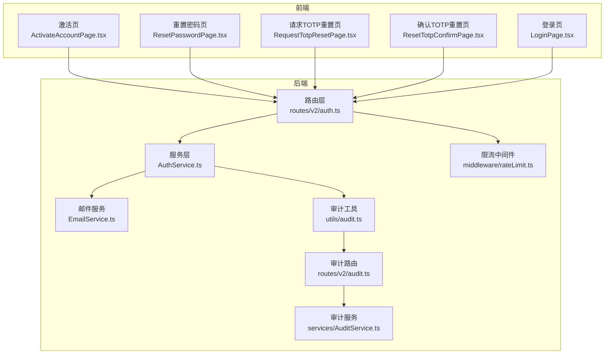
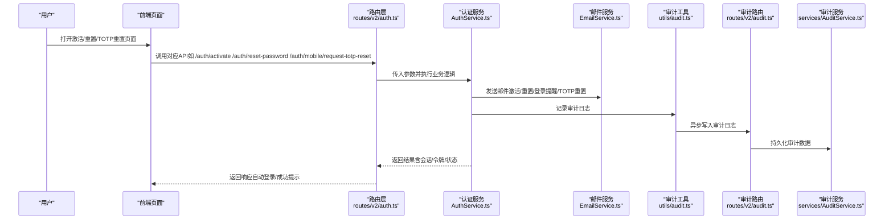
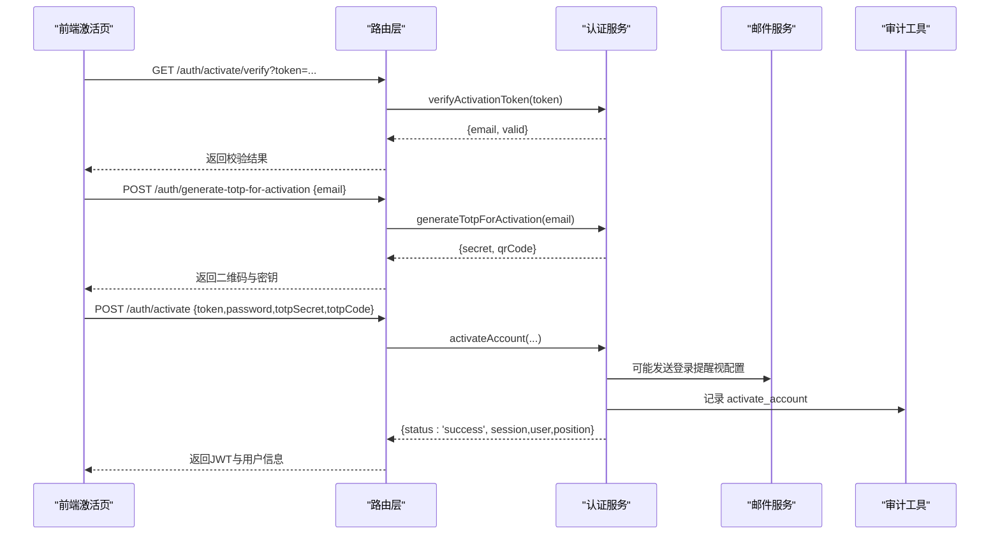
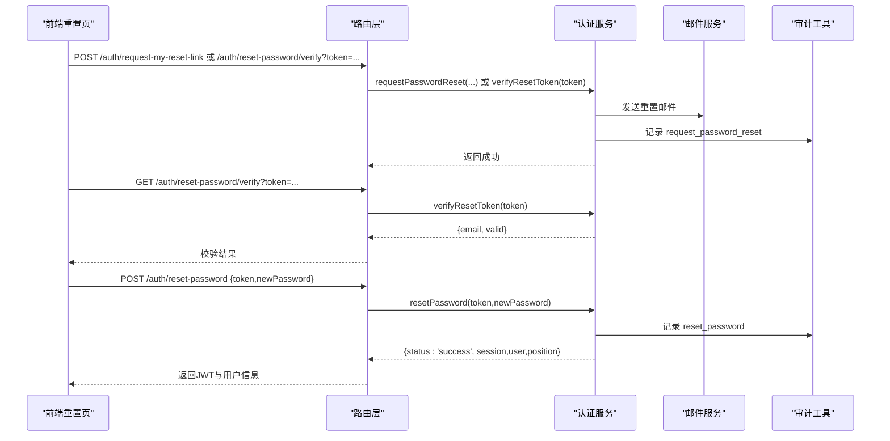
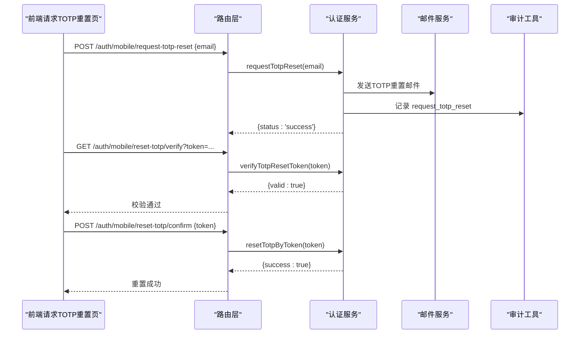
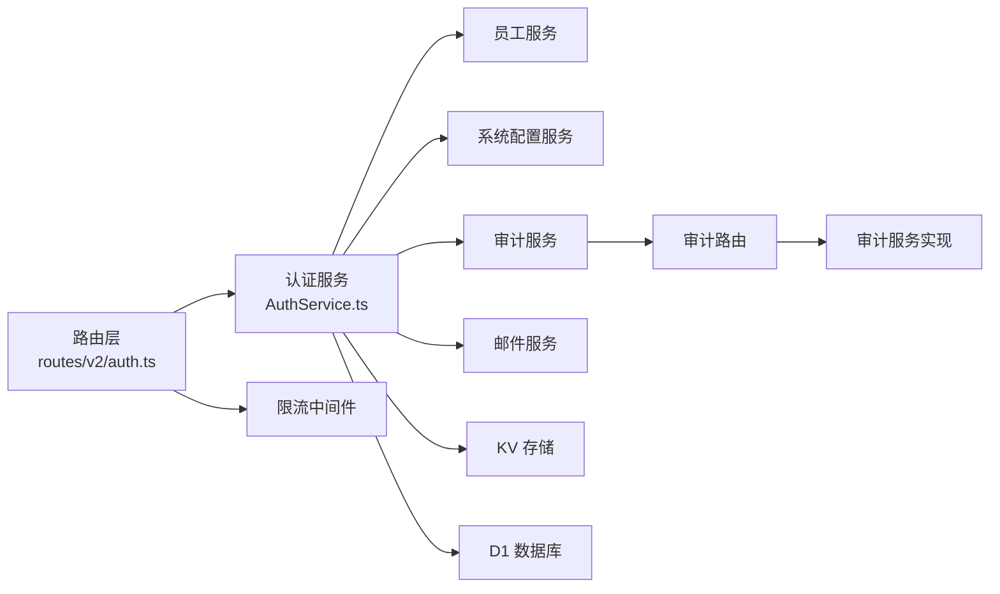

# 密码与账号管理

<cite>
**本文引用的文件**
- [AuthService.ts](file://backend/src/services/AuthService.ts)
- [auth.ts](file://backend/src/routes/v2/auth.ts)
- [EmailService.ts](file://backend/src/services/EmailService.ts)
- [auth.ts（前端）](file://frontend/src/features/auth/pages/ActivateAccountPage.tsx)
- [auth.ts（前端）](file://frontend/src/features/auth/pages/ResetPasswordPage.tsx)
- [auth.ts（前端）](file://frontend/src/features/auth/pages/RequestTotpResetPage.tsx)
- [auth.ts（前端）](file://frontend/src/features/auth/pages/ResetTotpConfirmPage.tsx)
- [auth.ts（前端）](file://frontend/src/features/auth/pages/LoginPage.tsx)
- [audit.ts](file://backend/src/utils/audit.ts)
- [audit.ts（后端）](file://backend/src/routes/v2/audit.ts)
- [AuditService.ts](file://backend/src/services/AuditService.ts)
- [rateLimit.ts](file://backend/src/middleware/rateLimit.ts)
- [password_reset.test.ts](file://backend/test/services/password_reset.test.ts)
- [activation.test.ts](file://backend/test/services/activation.test.ts)
</cite>

## 目录
1. [简介](#简介)
2. [项目结构](#项目结构)
3. [核心组件](#核心组件)
4. [架构总览](#架构总览)
5. [详细组件分析](#详细组件分析)
6. [依赖关系分析](#依赖关系分析)
7. [性能考量](#性能考量)
8. [故障排查指南](#故障排查指南)
9. [结论](#结论)
10. [附录](#附录)

## 简介
本文件面向安全与运维读者，系统性梳理本项目的密码与账号管理能力，覆盖以下关键流程：
- 账号激活（activateAccount）：通过 verifyActivationToken 校验激活链接，用户设置初始密码并可选择绑定 TOTP，激活成功后自动登录。
- 密码重置（resetPassword）：requestPasswordReset 生成唯一长时效重置令牌（1小时过期），通过邮件发送重置链接；verifyResetToken 校验令牌有效性；resetPassword 在成功更新密码后自动登录用户，消除重置后仍需手动登录的体验断层。
- 账号恢复设计（TOTP 重置）：requestTotpReset 通过邮箱发送包含临时令牌的链接，用户点击后可清除原有 TOTP 密钥，以便重新绑定。
- 安全与合规：所有流程均采用防枚举攻击设计（如 requestPasswordReset 无论用户是否存在均返回成功），并记录详细的审计日志（auditService）。

## 项目结构
后端采用分层架构：
- 路由层（routes/v2/auth.ts）：定义认证相关 API，应用限流中间件，并负责构建登录成功后的 JWT 载荷。
- 服务层（services/AuthService.ts）：实现登录、会话、激活、重置、TOTP 重置等核心业务逻辑，并调用审计与邮件服务。
- 工具与中间件（middleware/rateLimit.ts、utils/audit.ts）：提供限流与审计日志异步记录能力。
- 前端页面（frontend/src/features/auth/pages/*）：提供用户交互界面，调用后端 API 完成激活、重置、TOTP 重置等流程。

图表来源
- [auth.ts](file://backend/src/routes/v2/auth.ts#L1-L688)
- [AuthService.ts](file://backend/src/services/AuthService.ts#L1-L495)
- [EmailService.ts](file://backend/src/services/EmailService.ts#L1-L469)
- [audit.ts](file://backend/src/utils/audit.ts#L1-L90)
- [audit.ts（后端）](file://backend/src/routes/v2/audit.ts#L1-L223)
- [AuditService.ts](file://backend/src/services/AuditService.ts#L182-L228)
- [rateLimit.ts](file://backend/src/middleware/rateLimit.ts#L1-L134)

章节来源
- [auth.ts](file://backend/src/routes/v2/auth.ts#L1-L688)
- [AuthService.ts](file://backend/src/services/AuthService.ts#L1-L495)
- [EmailService.ts](file://backend/src/services/EmailService.ts#L1-L469)
- [audit.ts](file://backend/src/utils/audit.ts#L1-L90)
- [audit.ts（后端）](file://backend/src/routes/v2/audit.ts#L1-L223)
- [AuditService.ts](file://backend/src/services/AuditService.ts#L182-L228)
- [rateLimit.ts](file://backend/src/middleware/rateLimit.ts#L1-L134)

## 核心组件
- 认证服务（AuthService）：封装登录、会话、激活、密码重置、TOTP 重置、TOTP 生成与校验等核心逻辑，并统一记录审计日志。
- 路由层（auth.ts）：暴露认证相关 API，应用限流策略，处理登录成功后的 JWT 构建与下发。
- 邮件服务（EmailService）：负责发送激活、重置、登录提醒、TOTP 重置等邮件。
- 审计工具与服务：异步记录审计日志，支持按动作、实体、用户维度检索。
- 限流中间件：对登录、密码重置、TOTP 重置等敏感接口进行限流，降低暴力破解与滥用风险。

章节来源
- [AuthService.ts](file://backend/src/services/AuthService.ts#L1-L495)
- [auth.ts](file://backend/src/routes/v2/auth.ts#L1-L688)
- [EmailService.ts](file://backend/src/services/EmailService.ts#L1-L469)
- [audit.ts](file://backend/src/utils/audit.ts#L1-L90)
- [audit.ts（后端）](file://backend/src/routes/v2/audit.ts#L1-L223)
- [AuditService.ts](file://backend/src/services/AuditService.ts#L182-L228)
- [rateLimit.ts](file://backend/src/middleware/rateLimit.ts#L1-L134)

## 架构总览
下图展示认证与安全流程的整体交互，包括令牌生成、验证、会话建立与审计记录。

图表来源
- [auth.ts](file://backend/src/routes/v2/auth.ts#L1-L688)
- [AuthService.ts](file://backend/src/services/AuthService.ts#L1-L495)
- [EmailService.ts](file://backend/src/services/EmailService.ts#L1-L469)
- [audit.ts](file://backend/src/utils/audit.ts#L1-L90)
- [audit.ts（后端）](file://backend/src/routes/v2/audit.ts#L1-L223)
- [AuditService.ts](file://backend/src/services/AuditService.ts#L182-L228)

## 详细组件分析

### 账号激活（activateAccount）
- 流程要点
  - verifyActivationToken：校验激活令牌有效性与过期时间，返回邮箱与有效性。
  - generateTotpForActivation：在激活前为系统强制 TOTP 的场景生成 TOTP 密钥与二维码。
  - activateAccount：设置初始密码，可选绑定 TOTP；成功后自动登录。
- 安全与体验
  - 防枚举：verifyActivationToken 对无效令牌抛出异常，避免泄露用户存在性。
  - 自动登录：激活成功后直接返回会话与用户信息，前端可无缝跳转。
- 审计与日志
  - 激活完成后记录“activate_account”审计事件，包含用户标识与来源 IP。

图表来源
- [auth.ts](file://backend/src/routes/v2/auth.ts#L315-L443)
- [AuthService.ts](file://backend/src/services/AuthService.ts#L349-L443)
- [EmailService.ts](file://backend/src/services/EmailService.ts#L194-L247)
- [audit.ts](file://backend/src/utils/audit.ts#L33-L90)

章节来源
- [auth.ts](file://backend/src/routes/v2/auth.ts#L315-L443)
- [AuthService.ts](file://backend/src/services/AuthService.ts#L349-L443)
- [EmailService.ts](file://backend/src/services/EmailService.ts#L194-L247)
- [audit.ts](file://backend/src/utils/audit.ts#L33-L90)
- [activation.test.ts](file://backend/test/services/activation.test.ts#L1-L173)

### 密码重置（resetPassword）
- 流程要点
  - requestPasswordReset：生成唯一重置令牌（长度为64字符，由两个UUID拼接并去连字符组成），设置1小时过期；无论用户是否存在均返回成功，防止枚举攻击；发送重置邮件。
  - verifyResetToken：校验令牌是否存在与未过期，返回邮箱与有效性。
  - resetPassword：校验令牌与过期时间，更新密码哈希、激活状态、清空重置令牌；随后自动登录用户。
- 安全与体验
  - 防枚举：requestPasswordReset 对不存在用户也返回成功，避免泄露邮箱存在性。
  - 自动登录：resetPassword 成功后直接返回会话与用户信息，消除重置后手动登录的体验断层。
- 审计与日志
  - 记录“request_password_reset”与“reset_password”审计事件，包含用户标识与来源 IP。

图表来源
- [auth.ts](file://backend/src/routes/v2/auth.ts#L530-L571)
- [auth.ts](file://backend/src/routes/v2/auth.ts#L446-L528)
- [AuthService.ts](file://backend/src/services/AuthService.ts#L229-L327)
- [EmailService.ts](file://backend/src/services/EmailService.ts#L249-L293)
- [audit.ts](file://backend/src/utils/audit.ts#L33-L90)

章节来源
- [auth.ts](file://backend/src/routes/v2/auth.ts#L446-L571)
- [AuthService.ts](file://backend/src/services/AuthService.ts#L229-L327)
- [EmailService.ts](file://backend/src/services/EmailService.ts#L249-L293)
- [audit.ts](file://backend/src/utils/audit.ts#L33-L90)
- [password_reset.test.ts](file://backend/test/services/password_reset.test.ts#L1-L183)

### TOTP 重置（requestTotpReset 与 confirm）
- 流程要点
  - requestTotpReset：根据邮箱查找员工记录（支持公司邮箱与个人邮箱），生成临时令牌（KV存储，30分钟过期），发送包含临时令牌的重置链接邮件；无论用户是否存在均返回成功，防止枚举攻击。
  - verifyTotpResetToken：校验临时令牌是否有效。
  - resetTotpByToken：确认后清除用户 TOTP 密钥，删除临时令牌，允许重新绑定。
- 安全与体验
  - 防枚举：requestTotpReset 对不存在用户也返回成功。
  - 明确提示：邮件强调该操作非常敏感，将停用 2FA 并只能使用密码登录，直至重新绑定。
- 审计与日志
  - 记录“request_totp_reset”与“reset_totp_by_token”审计事件，包含用户标识与来源 IP。

图表来源
- [auth.ts](file://backend/src/routes/v2/auth.ts#L573-L687)
- [AuthService.ts](file://backend/src/services/AuthService.ts#L444-L493)
- [EmailService.ts](file://backend/src/services/EmailService.ts#L335-L382)
- [audit.ts](file://backend/src/utils/audit.ts#L33-L90)

章节来源
- [auth.ts](file://backend/src/routes/v2/auth.ts#L573-L687)
- [AuthService.ts](file://backend/src/services/AuthService.ts#L444-L493)
- [EmailService.ts](file://backend/src/services/EmailService.ts#L335-L382)
- [audit.ts](file://backend/src/utils/audit.ts#L33-L90)

### 前端页面与交互
- 激活页（ActivateAccountPage.tsx）
  - 通过 verifyActivationToken 校验链接有效性；若有效则进入设置密码与绑定 TOTP 的步骤；成功后自动登录并跳转。
- 重置密码页（ResetPasswordPage.tsx）
  - 通过 verifyResetToken 校验链接有效性；若有效则允许设置新密码；成功后自动登录并跳转。
- 请求 TOTP 重置页（RequestTotpResetPage.tsx）
  - 提交邮箱后静默返回成功，防止枚举攻击；前端根据返回状态显示友好提示。
- 确认 TOTP 重置页（ResetTotpConfirmPage.tsx）
  - 通过 verifyTotpResetToken 校验链接有效性；若有效则允许确认重置，清除 TOTP 密钥。

章节来源
- [auth.ts（前端）](file://frontend/src/features/auth/pages/ActivateAccountPage.tsx#L1-L130)
- [auth.ts（前端）](file://frontend/src/features/auth/pages/ResetPasswordPage.tsx#L65-L105)
- [auth.ts（前端）](file://frontend/src/features/auth/pages/RequestTotpResetPage.tsx#L1-L34)
- [auth.ts（前端）](file://frontend/src/features/auth/pages/ResetTotpConfirmPage.tsx#L1-L89)
- [auth.ts（前端）](file://frontend/src/features/auth/pages/LoginPage.tsx#L183-L193)

## 依赖关系分析
- 组件耦合
  - 路由层依赖认证服务；认证服务依赖员工服务、系统配置、审计服务、邮件服务与 KV 存储。
  - 审计工具通过异步方式写入审计路由，再由审计服务持久化。
- 外部依赖
  - Cloudflare Workers：KV 用于会话与临时令牌存储；邮件通过 email-worker 发送。
  - 第三方库：TOTP 生成与校验、bcrypt 密码哈希、限流服务。

图表来源
- [auth.ts](file://backend/src/routes/v2/auth.ts#L1-L688)
- [AuthService.ts](file://backend/src/services/AuthService.ts#L1-L495)
- [audit.ts（后端）](file://backend/src/routes/v2/audit.ts#L1-L223)
- [AuditService.ts](file://backend/src/services/AuditService.ts#L182-L228)
- [rateLimit.ts](file://backend/src/middleware/rateLimit.ts#L1-L134)

章节来源
- [auth.ts](file://backend/src/routes/v2/auth.ts#L1-L688)
- [AuthService.ts](file://backend/src/services/AuthService.ts#L1-L495)
- [audit.ts（后端）](file://backend/src/routes/v2/audit.ts#L1-L223)
- [AuditService.ts](file://backend/src/services/AuditService.ts#L182-L228)
- [rateLimit.ts](file://backend/src/middleware/rateLimit.ts#L1-L134)

## 性能考量
- 会话与缓存
  - 会话优先从 KV 读取，降级到 D1；KV TTL 以秒为单位，D1 作为持久化备份，兼顾高并发与可靠性。
- 限流策略
  - 登录、密码重置、TOTP 重置分别应用不同限流规则，降低暴力破解与滥用风险。
- 异步审计
  - 审计日志通过 waitUntil 异步写入，避免阻塞主流程。

章节来源
- [AuthService.ts](file://backend/src/services/AuthService.ts#L150-L218)
- [rateLimit.ts](file://backend/src/middleware/rateLimit.ts#L1-L134)
- [audit.ts](file://backend/src/utils/audit.ts#L33-L90)

## 故障排查指南
- 激活链接无效或过期
  - 检查 verifyActivationToken 返回值与过期时间；确认 KV 中是否存在对应激活令牌。
- 重置链接无效或过期
  - 检查 verifyResetToken 与 resetPassword 的过期判断；确认数据库中 resetToken 与 resetExpiresAt 字段。
- TOTP 重置链接无效或过期
  - 检查 KV 中 totp_reset:* 键是否存在与 TTL；确认 verifyTotpResetToken 与 resetTotpByToken 的调用链。
- 邮件未送达
  - 检查 EMAIL_SERVICE 是否配置；查看 EmailService 的返回值与日志；确认前端页面的邮箱输入正确。
- 审计日志缺失
  - 确认审计工具已通过 waitUntil 异步提交；检查审计路由与审计服务实现；核对权限与过滤条件。

章节来源
- [AuthService.ts](file://backend/src/services/AuthService.ts#L229-L493)
- [EmailService.ts](file://backend/src/services/EmailService.ts#L101-L145)
- [audit.ts](file://backend/src/utils/audit.ts#L33-L90)
- [audit.ts（后端）](file://backend/src/routes/v2/audit.ts#L1-L223)
- [AuditService.ts](file://backend/src/services/AuditService.ts#L182-L228)

## 结论
本项目在密码与账号管理方面实现了完善的闭环：从激活、重置到 TOTP 重置，均采用防枚举攻击设计与严格的令牌校验，并在关键节点记录审计日志。前端页面与后端 API 协作良好，用户体验顺畅，同时具备良好的安全性与可维护性。

## 附录
- 令牌与过期时间
  - 激活令牌：24小时有效（verifyActivationToken 校验）。
  - 密码重置令牌：1小时有效（verifyResetToken 校验）。
  - TOTP 重置临时令牌：30分钟有效（verifyTotpResetToken 校验）。
- 限流策略（示例）
  - 登录：每 IP 每分钟最多5次。
  - 密码重置：每 IP 每小时最多3次。
  - TOTP 重置：每邮箱每小时最多3次。

章节来源
- [AuthService.ts](file://backend/src/services/AuthService.ts#L229-L493)
- [rateLimit.ts](file://backend/src/middleware/rateLimit.ts#L62-L97)