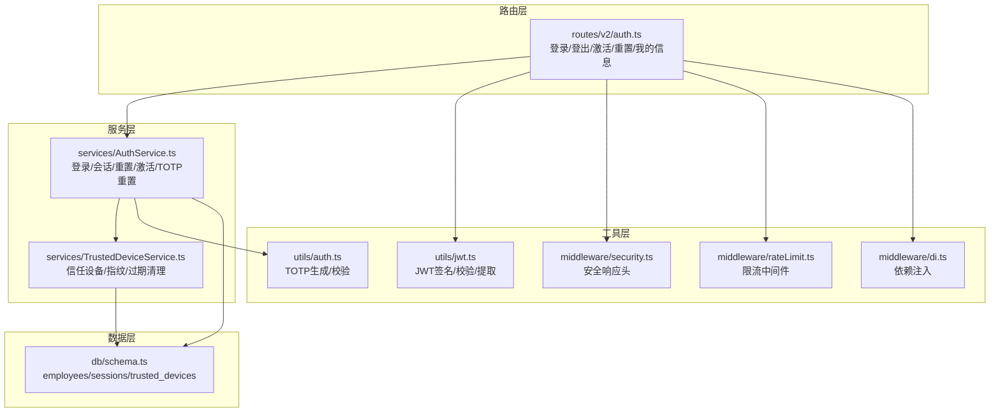
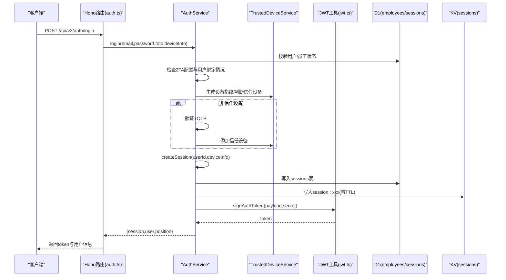
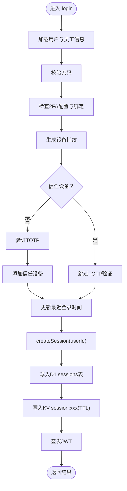
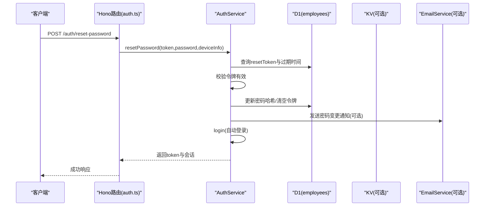
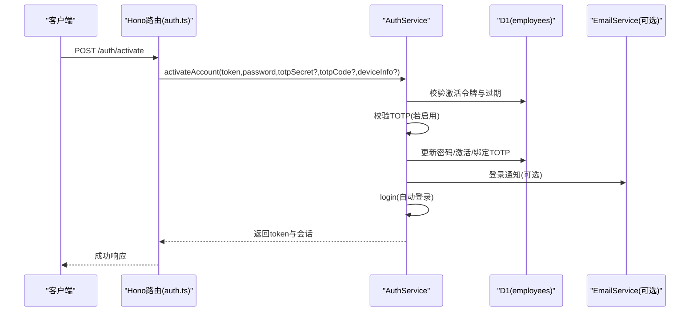
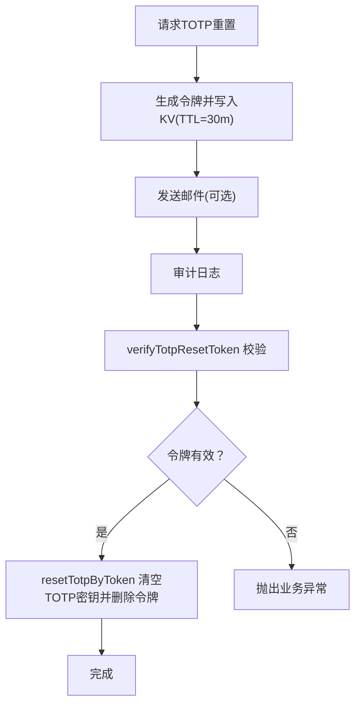
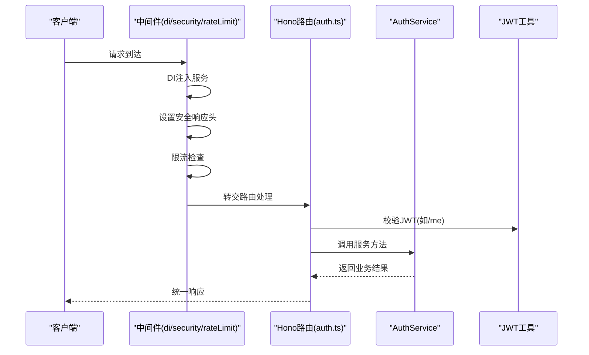
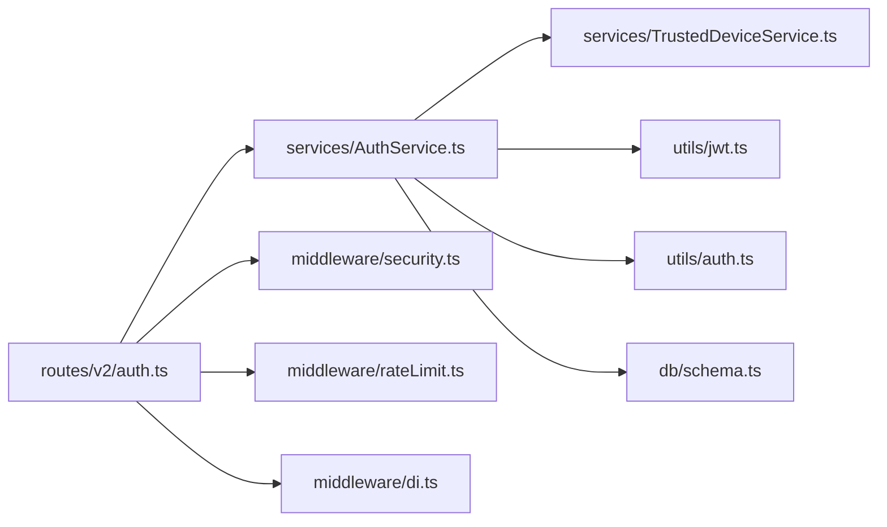

# 认证机制

<cite>
**本文引用的文件列表**
- [AuthService.ts](file://backend/src/services/AuthService.ts)
- [TrustedDeviceService.ts](file://backend/src/services/TrustedDeviceService.ts)
- [jwt.ts](file://backend/src/utils/jwt.ts)
- [auth.ts](file://backend/src/utils/auth.ts)
- [auth.ts（路由）](file://backend/src/routes/v2/auth.ts)
- [security.ts](file://backend/src/middleware/security.ts)
- [di.ts](file://backend/src/middleware/di.ts)
- [schema.ts](file://backend/src/db/schema.ts)
- [rateLimit.ts](file://backend/src/middleware/rateLimit.ts)
- [AuthService.test.ts](file://backend/test/services/AuthService.test.ts)
- [auth.test.ts](file://backend/test/routes/v2/auth.test.ts)
</cite>

## 目录
1. [简介](#简介)
2. [项目结构](#项目结构)
3. [核心组件](#核心组件)
4. [架构总览](#架构总览)
5. [详细组件分析](#详细组件分析)
6. [依赖关系分析](#依赖关系分析)
7. [性能考量](#性能考量)
8. [故障排查指南](#故障排查指南)
9. [结论](#结论)
10. [附录](#附录)

## 简介
本文件面向后端开发者与运维人员，系统性梳理本项目的认证与会话管理机制，重点覆盖：
- 基于 JWT 的会话与访问令牌签发与校验
- 双因素认证（TOTP，Google验证码）的完整流程：从激活绑定到登录验证
- 信任设备机制（TrustedDeviceService）：设备指纹识别与90天过期策略
- 密码重置（一次性令牌生成、KV存储与验证）、账号激活（一次性令牌验证与绑定）
- 单点登录（SSO）：登录时删除用户旧会话
- Hono 中间件集成：安全响应头、限流、依赖注入与鉴权

## 项目结构
认证相关代码主要分布在以下模块：
- 路由层：Hono 路由定义与鉴权中间件
- 服务层：AuthService（登录、会话、密码重置、激活、TOTP重置）、TrustedDeviceService（信任设备）
- 工具层：JWT 工具、TOTP 工具、安全响应头中间件、限流中间件、依赖注入中间件
- 数据层：Drizzle ORM Schema（employees、sessions、trusted_devices）



图表来源
- [auth.ts（路由）](file://backend/src/routes/v2/auth.ts#L1-L688)
- [AuthService.ts](file://backend/src/services/AuthService.ts#L1-L495)
- [TrustedDeviceService.ts](file://backend/src/services/TrustedDeviceService.ts#L1-L167)
- [jwt.ts](file://backend/src/utils/jwt.ts#L1-L132)
- [auth.ts](file://backend/src/utils/auth.ts#L1-L17)
- [security.ts](file://backend/src/middleware/security.ts#L1-L81)
- [rateLimit.ts](file://backend/src/middleware/rateLimit.ts#L1-L134)
- [di.ts](file://backend/src/middleware/di.ts#L1-L156)
- [schema.ts](file://backend/src/db/schema.ts#L1-L706)

章节来源
- [auth.ts（路由）](file://backend/src/routes/v2/auth.ts#L1-L688)
- [AuthService.ts](file://backend/src/services/AuthService.ts#L1-L495)
- [TrustedDeviceService.ts](file://backend/src/services/TrustedDeviceService.ts#L1-L167)
- [jwt.ts](file://backend/src/utils/jwt.ts#L1-L132)
- [auth.ts](file://backend/src/utils/auth.ts#L1-L17)
- [security.ts](file://backend/src/middleware/security.ts#L1-L81)
- [rateLimit.ts](file://backend/src/middleware/rateLimit.ts#L1-L134)
- [di.ts](file://backend/src/middleware/di.ts#L1-L156)
- [schema.ts](file://backend/src/db/schema.ts#L1-L706)

## 核心组件
- AuthService：统一的认证入口，负责登录、会话创建与销毁、密码重置、账号激活、TOTP重置、TOTP生成与验证。
- TrustedDeviceService：设备指纹生成、信任设备判定、添加信任设备、移除与清理过期设备。
- JWT 工具：JWT 签发与校验、令牌提取、令牌常量。
- TOTP 工具：TOTP 密钥生成与校验。
- Hono 路由与中间件：登录/登出/激活/重置/我的信息接口；安全响应头；限流；依赖注入。

章节来源
- [AuthService.ts](file://backend/src/services/AuthService.ts#L1-L495)
- [TrustedDeviceService.ts](file://backend/src/services/TrustedDeviceService.ts#L1-L167)
- [jwt.ts](file://backend/src/utils/jwt.ts#L1-L132)
- [auth.ts](file://backend/src/utils/auth.ts#L1-L17)
- [auth.ts（路由）](file://backend/src/routes/v2/auth.ts#L1-L688)

## 架构总览
下图展示登录与会话管理的关键交互流程，包括 JWT 令牌签发、会话持久化与缓存、信任设备与 TOTP 验证。



图表来源
- [auth.ts（路由）](file://backend/src/routes/v2/auth.ts#L80-L144)
- [AuthService.ts](file://backend/src/services/AuthService.ts#L34-L148)
- [TrustedDeviceService.ts](file://backend/src/services/TrustedDeviceService.ts#L14-L63)
- [jwt.ts](file://backend/src/utils/jwt.ts#L72-L94)
- [schema.ts](file://backend/src/db/schema.ts#L118-L137)

## 详细组件分析

### 1) 登录与会话管理（AuthService.login/createSession/logout）
- login 流程要点
  - 用户名/密码校验（bcrypt 对比）
  - 员工状态与激活状态检查
  - 2FA 配置与用户绑定检查
  - 设备指纹生成与信任设备判定
  - 新设备需 TOTP 验证并通过后加入信任设备
  - 登录成功后更新最近登录时间并创建会话
  - 审计日志记录
- createSession 流程要点
  - 生成会话ID与过期时间（7天）
  - 单点登录：删除用户旧会话（KV与DB）
  - 先写入 D1（持久化备份与审计），再写入 KV（高性能缓存，TTL=过期秒数）
- logout 流程要点
  - 读取会话并审计
  - 删除 KV 与 D1 中的会话记录



图表来源
- [AuthService.ts](file://backend/src/services/AuthService.ts#L34-L148)
- [AuthService.ts](file://backend/src/services/AuthService.ts#L150-L198)
- [schema.ts](file://backend/src/db/schema.ts#L118-L137)
- [jwt.ts](file://backend/src/utils/jwt.ts#L72-L94)

章节来源
- [AuthService.ts](file://backend/src/services/AuthService.ts#L34-L198)
- [auth.ts（路由）](file://backend/src/routes/v2/auth.ts#L80-L144)

### 2) 双因素认证（TOTP）与信任设备
- TOTP 集成
  - 生成激活二维码：AuthService.generateTotpForActivation
  - 登录时验证：AuthService.login 中 verifyTotp
  - 激活时验证：AuthService.activateAccount 中 verifyTotp
- 信任设备机制
  - 设备指纹：TrustedDeviceService.generateDeviceFingerprint（SHA-256）
  - 判定信任：isTrustedDevice（含90天过期检查）
  - 添加信任：addTrustedDevice（解析UA生成设备名）
  - 清理过期：cleanupExpiredDevices（定期任务）

```mermaid
classDiagram
class TrustedDeviceService {
+generateDeviceFingerprint(userId, ip, userAgent) string
+isTrustedDevice(userId, fingerprint) Promise<bool>
+addTrustedDevice(userId, fingerprint, deviceInfo) Promise<void>
+getUserDevices(userId) Promise<devices[]>
+removeTrustedDevice(id, userId) Promise<bool>
+removeAllDevices(userId) Promise<void>
+cleanupExpiredDevices() Promise<int>
}
class AuthService {
+login(email, password, totp?, context?, deviceInfo?) Promise<result>
+generateTotpForActivation(email) {secret, qrCode}
+activateAccount(token, password, totpSecret?, totpCode?, deviceInfo?) Promise<result>
}
AuthService --> TrustedDeviceService : "生成指纹/信任判定/添加信任"
```

图表来源
- [TrustedDeviceService.ts](file://backend/src/services/TrustedDeviceService.ts#L14-L166)
- [AuthService.ts](file://backend/src/services/AuthService.ts#L34-L148)
- [AuthService.ts](file://backend/src/services/AuthService.ts#L329-L374)

章节来源
- [auth.ts](file://backend/src/utils/auth.ts#L1-L17)
- [AuthService.ts](file://backend/src/services/AuthService.ts#L329-L374)
- [TrustedDeviceService.ts](file://backend/src/services/TrustedDeviceService.ts#L14-L166)

### 3) 密码重置（一次性令牌）
- requestPasswordReset
  - 生成UUID拼接的一次性令牌与过期时间（1小时）
  - 写入员工表 resetToken/resetExpiresAt
  - 可选发送邮件通知
  - 审计日志
- verifyResetToken
  - 校验令牌是否存在与未过期
- resetPassword
  - 校验令牌有效性
  - 哈希新密码并更新用户状态
  - 清空令牌与过期时间
  - 审计日志
  - 自动登录（返回JWT与会话）



图表来源
- [auth.ts（路由）](file://backend/src/routes/v2/auth.ts#L509-L528)
- [AuthService.ts](file://backend/src/services/AuthService.ts#L229-L327)
- [schema.ts](file://backend/src/db/schema.ts#L14-L48)

章节来源
- [AuthService.ts](file://backend/src/services/AuthService.ts#L229-L327)
- [auth.ts（路由）](file://backend/src/routes/v2/auth.ts#L509-L528)

### 4) 账号激活（一次性令牌）
- generateTotpForActivation（激活绑定TOTP）
- verifyActivationToken（校验激活令牌）
- activateAccount（设置密码、激活用户、绑定TOTP并自动登录）



图表来源
- [auth.ts（路由）](file://backend/src/routes/v2/auth.ts#L387-L443)
- [AuthService.ts](file://backend/src/services/AuthService.ts#L349-L443)
- [schema.ts](file://backend/src/db/schema.ts#L14-L48)

章节来源
- [AuthService.ts](file://backend/src/services/AuthService.ts#L349-L443)
- [auth.ts（路由）](file://backend/src/routes/v2/auth.ts#L387-L443)

### 5) TOTP 重置（移动端）
- requestTotpReset
  - 生成一次性令牌并存入 KV（TTL=30分钟）
  - 发送邮件（优先个人邮箱）
  - 审计日志
- verifyTotpResetToken
  - 校验令牌有效性
- resetTotpByToken
  - 清空用户TOTP密钥
  - 删除令牌
  - 审计日志



图表来源
- [AuthService.ts](file://backend/src/services/AuthService.ts#L444-L493)
- [auth.ts（路由）](file://backend/src/routes/v2/auth.ts#L607-L686)

章节来源
- [AuthService.ts](file://backend/src/services/AuthService.ts#L444-L493)
- [auth.ts（路由）](file://backend/src/routes/v2/auth.ts#L607-L686)

### 6) Hono 中间件集成与保护
- 依赖注入（DI）：在中间件中初始化 AuthService、EmailService、AuditService 等，并注入到上下文变量
- 安全响应头：统一设置安全头，提升传输与内容安全
- 限流中间件：对登录、密码重置、TOTP重置等敏感接口进行限流
- 鉴权流程：/auth/me 接口通过 JWT 校验获取用户信息；/auth/logout 通过 JWT 提取会话ID并注销



图表来源
- [di.ts](file://backend/src/middleware/di.ts#L41-L155)
- [security.ts](file://backend/src/middleware/security.ts#L1-L81)
- [rateLimit.ts](file://backend/src/middleware/rateLimit.ts#L1-L134)
- [auth.ts（路由）](file://backend/src/routes/v2/auth.ts#L198-L213)
- [auth.ts（路由）](file://backend/src/routes/v2/auth.ts#L238-L286)

章节来源
- [di.ts](file://backend/src/middleware/di.ts#L41-L155)
- [security.ts](file://backend/src/middleware/security.ts#L1-L81)
- [rateLimit.ts](file://backend/src/middleware/rateLimit.ts#L1-L134)
- [auth.ts（路由）](file://backend/src/routes/v2/auth.ts#L198-L286)

## 依赖关系分析
- 组件耦合
  - AuthService 依赖 EmployeeService、TrustedDeviceService、SystemConfigService、AuditService、EmailService、Drizzle D1、KV
  - TrustedDeviceService 仅依赖 Drizzle D1
  - 路由层依赖 AuthService 与 JWT 工具
- 外部依赖
  - otplib（TOTP）
  - bcryptjs（密码哈希）
  - Hono（Web框架）
  - Drizzle ORM（SQLite/Cloudflare D1）



图表来源
- [auth.ts（路由）](file://backend/src/routes/v2/auth.ts#L1-L688)
- [AuthService.ts](file://backend/src/services/AuthService.ts#L1-L495)
- [TrustedDeviceService.ts](file://backend/src/services/TrustedDeviceService.ts#L1-L167)
- [jwt.ts](file://backend/src/utils/jwt.ts#L1-L132)
- [auth.ts](file://backend/src/utils/auth.ts#L1-L17)
- [schema.ts](file://backend/src/db/schema.ts#L1-L706)
- [security.ts](file://backend/src/middleware/security.ts#L1-L81)
- [rateLimit.ts](file://backend/src/middleware/rateLimit.ts#L1-L134)
- [di.ts](file://backend/src/middleware/di.ts#L1-L156)

章节来源
- [auth.ts（路由）](file://backend/src/routes/v2/auth.ts#L1-L688)
- [AuthService.ts](file://backend/src/services/AuthService.ts#L1-L495)
- [TrustedDeviceService.ts](file://backend/src/services/TrustedDeviceService.ts#L1-L167)
- [jwt.ts](file://backend/src/utils/jwt.ts#L1-L132)
- [auth.ts](file://backend/src/utils/auth.ts#L1-L17)
- [schema.ts](file://backend/src/db/schema.ts#L1-L706)
- [security.ts](file://backend/src/middleware/security.ts#L1-L81)
- [rateLimit.ts](file://backend/src/middleware/rateLimit.ts#L1-L134)
- [di.ts](file://backend/src/middleware/di.ts#L1-L156)

## 性能考量
- 会话读取路径优化
  - 优先从 KV 读取，失败再回退 D1，减少数据库压力
  - 会话写入采用两阶段：D1（持久化）+ KV（缓存），确保一致性与性能
- TOTP 与密码哈希
  - TOTP 校验与密码哈希均在内存中完成，避免额外IO
- 限流策略
  - 登录、密码重置、TOTP重置分别按IP或邮箱维度限流，降低暴力破解风险
- 安全响应头
  - 统一设置安全头，减少浏览器与网络层面的攻击面

[本节为通用性能建议，无需具体文件分析]

## 故障排查指南
- 登录失败
  - 用户名/密码错误：检查密码哈希与用户状态
  - 2FA 未绑定：根据系统配置与用户绑定情况调整
  - 新设备未验证：确保提供有效的TOTP码并正确绑定信任设备
- 会话异常
  - KV 与 D1 不一致：检查 createSession 写入顺序与 TTL 设置
  - 会话过期：确认 AUTH_TOKEN_TTL 与会话过期时间一致
- 密码重置/激活
  - 令牌无效或过期：核对 resetToken/activationToken 与过期时间
  - 邮件未送达：检查环境变量与邮件服务配置
- TOTP 重置
  - 令牌过期：确认 KV TTL（30分钟）
  - UA 解析：设备名解析依赖 UA 字符串，确保客户端上报完整

章节来源
- [AuthService.ts](file://backend/src/services/AuthService.ts#L229-L327)
- [AuthService.ts](file://backend/src/services/AuthService.ts#L349-L443)
- [AuthService.ts](file://backend/src/services/AuthService.ts#L444-L493)
- [TrustedDeviceService.ts](file://backend/src/services/TrustedDeviceService.ts#L32-L63)
- [rateLimit.ts](file://backend/src/middleware/rateLimit.ts#L1-L134)

## 结论
本认证体系以 AuthService 为核心，结合 TrustedDeviceService 实现“信任设备+TOTP”的双因子策略，在保证安全的同时兼顾用户体验。通过 JWT 令牌与 KV/D1 双写会话、单点登录策略、限流与安全响应头等手段，形成一套可扩展、可观测、易维护的认证方案。建议在生产环境中：
- 定期清理过期信任设备
- 监控登录与重置接口的限流触发情况
- 加强审计日志与告警联动
- 对 KV 与 D1 的一致性进行周期性校验

[本节为总结性内容，无需具体文件分析]

## 附录
- 关键接口与行为（来自测试用例）
  - 登录成功（无2FA）：[AuthService.test.ts](file://backend/test/services/AuthService.test.ts#L58-L84)
  - 登录成功（含TOTP）：[AuthService.test.ts](file://backend/test/services/AuthService.test.ts#L86-L119)
  - 登出成功：[AuthService.test.ts](file://backend/test/services/AuthService.test.ts#L177-L208)
  - 密码重置流程：[AuthService.test.ts](file://backend/test/services/AuthService.test.ts#L210-L232)
  - 账号激活流程：[AuthService.test.ts](file://backend/test/services/AuthService.test.ts#L234-L281)
  - 路由层登录/我的信息端到端：[auth.test.ts](file://backend/test/routes/v2/auth.test.ts#L29-L98), [auth.test.ts](file://backend/test/routes/v2/auth.test.ts#L100-L188)

章节来源
- [AuthService.test.ts](file://backend/test/services/AuthService.test.ts#L58-L281)
- [auth.test.ts](file://backend/test/routes/v2/auth.test.ts#L29-L188)