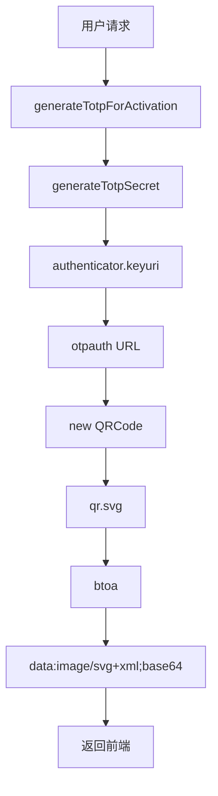
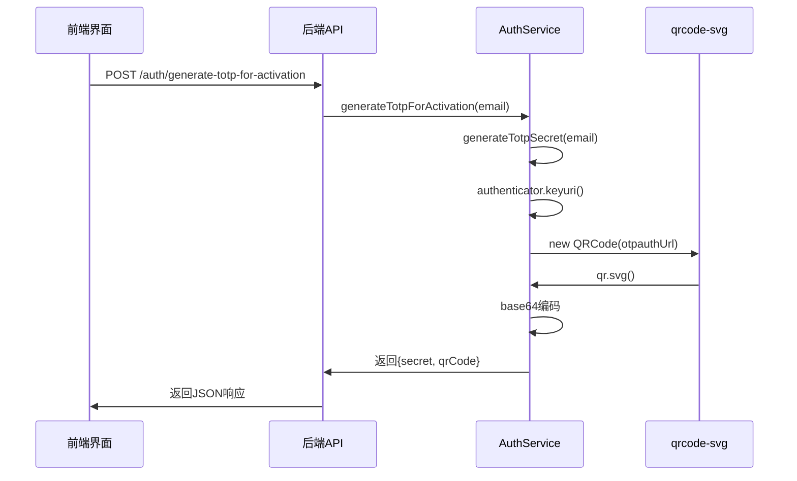
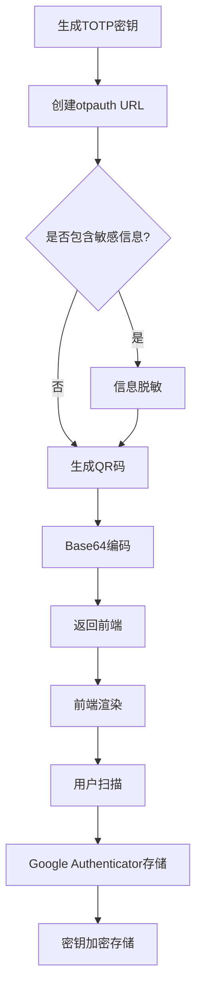
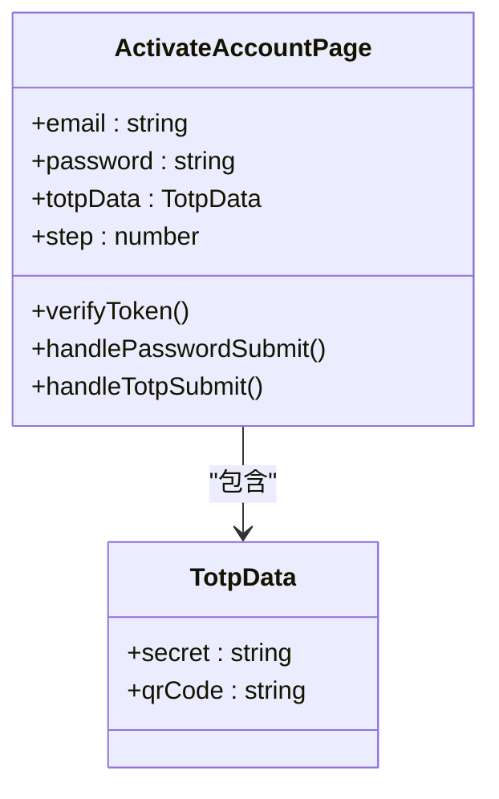
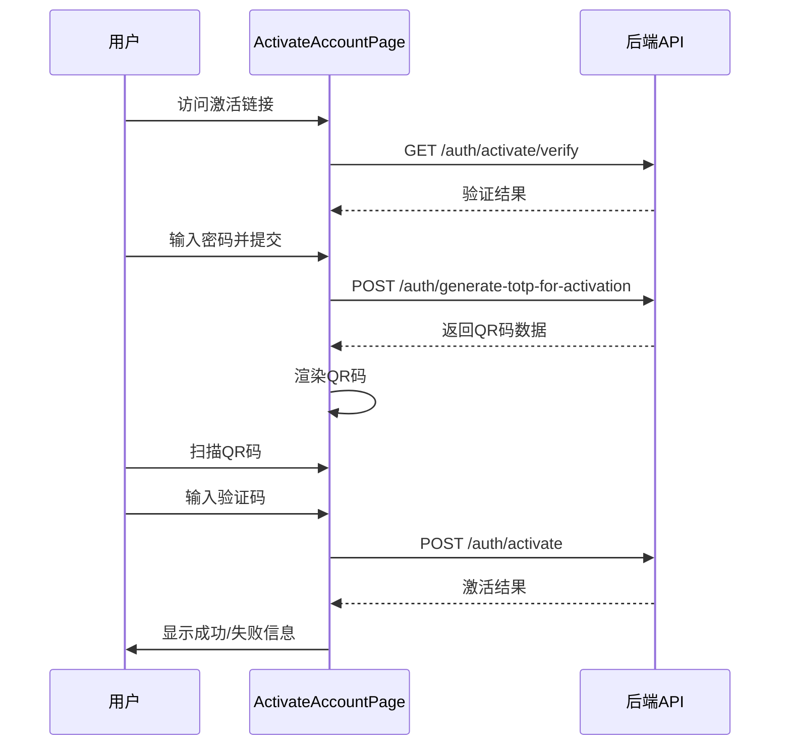

# QR码生成与安全

<cite>
**本文档引用的文件**   
- [auth.ts](file://backend/src/routes/v2/auth.ts)
- [AuthService.ts](file://backend/src/services/AuthService.ts)
- [auth.ts](file://backend/src/utils/auth.ts)
- [qrcode-svg.d.ts](file://backend/src/types/qrcode-svg.d.ts)
- [ActivateAccountPage.tsx](file://frontend/src/features/auth/pages/ActivateAccountPage.tsx)
- [api.ts](file://frontend/src/config/api.ts)
- [package.json](file://backend/package.json)
</cite>

## 目录
1. [引言](#引言)
2. [QR码生成技术解析](#qrcode生成技术解析)
3. [generateTotpForActivation方法详解](#generatetotpforactivation方法详解)
4. [QR码内容安全性分析](#qrcode内容安全性分析)
5. [前端集成示例](#前端集成示例)
6. [结论](#结论)

## 引言
本文档深入解析基于qrcode-svg库的SVG格式二维码生成机制，重点阐述`generateTotpForActivation`方法如何将otpauth URL转换为base64编码的SVG数据URL，以适应Cloudflare Edge Runtime环境。文档详细说明QR码内容的安全性考量，包括OTP认证URL的组成结构和敏感信息保护，并提供前端集成示例，展示如何在账户激活界面安全地渲染和使用QR码完成Google Authenticator绑定。

## QR码生成技术解析

### 技术栈与依赖
系统采用`qrcode-svg`库生成SVG格式的二维码，该库特别适用于不支持Canvas的Cloudflare Edge Runtime环境。后端服务通过`otplib`库生成TOTP（基于时间的一次性密码）认证所需的otpauth URL。



**Diagram sources**
- [AuthService.ts](file://backend/src/services/AuthService.ts#L330-L347)
- [auth.ts](file://backend/src/utils/auth.ts#L4-L7)

### SVG格式优势
SVG格式具有以下优势：
- **矢量图形**：可无限缩放而不失真
- **文件体积小**：相比PNG等位图格式更节省带宽
- **Edge Runtime兼容**：在Cloudflare Workers等无头环境中稳定运行
- **Base64编码**：可直接嵌入HTML，无需额外HTTP请求

## generateTotpForActivation方法详解

### 方法调用流程
`generateTotpForActivation`方法的调用流程如下：



**Diagram sources**
- [auth.ts](file://backend/src/routes/v2/auth.ts#L349-L385)
- [AuthService.ts](file://backend/src/services/AuthService.ts#L330-L347)

### 代码实现细节
该方法的核心实现包含以下步骤：
1. 调用`generateTotpSecret`生成TOTP密钥和otpauth URL
2. 使用`qrcode-svg`库将otpauth URL转换为SVG字符串
3. 将SVG字符串进行Base64编码
4. 构造data URL格式的二维码数据

**Section sources**
- [AuthService.ts](file://backend/src/services/AuthService.ts#L330-L347)

## QR码内容安全性分析

### OTP认证URL结构
OTP认证URL遵循标准的otpauth协议格式，其结构如下：

```
otpauth://totp/{issuer}:{email}?secret={secret}&issuer={issuer}
```

其中关键参数包括：
- **secret**：TOTP密钥，用于生成一次性密码
- **issuer**：发行者名称，标识服务来源
- **email**：用户标识，用于区分不同用户

### 敏感信息保护
系统采取了多项措施保护敏感信息：



**Diagram sources**
- [auth.ts](file://backend/src/utils/auth.ts#L4-L7)
- [AuthService.ts](file://backend/src/services/AuthService.ts#L330-L347)

#### 安全措施
- **密钥隔离**：TOTP密钥仅在后端生成和验证，前端仅获取二维码
- **一次性使用**：激活链接和TOTP密钥在使用后立即失效
- **HTTPS传输**：所有通信通过加密通道进行
- **速率限制**：防止暴力破解和滥用

**Section sources**
- [AuthService.ts](file://backend/src/services/AuthService.ts#L330-L347)
- [auth.ts](file://backend/src/utils/auth.ts#L4-L7)

## 前端集成示例

### 组件结构
账户激活界面的主要组件结构如下：



**Diagram sources**
- [ActivateAccountPage.tsx](file://frontend/src/features/auth/pages/ActivateAccountPage.tsx#L10-L13)

### 集成代码示例
前端通过以下步骤集成QR码功能：



**Diagram sources**
- [ActivateAccountPage.tsx](file://frontend/src/features/auth/pages/ActivateAccountPage.tsx#L65-L93)
- [api.ts](file://frontend/src/config/api.ts#L21)

### 关键代码路径
- **API配置**：`frontend/src/config/api.ts`中的`generateTotpForActivation`端点
- **组件实现**：`frontend/src/features/auth/pages/ActivateAccountPage.tsx`中的`handlePasswordSubmit`方法
- **UI渲染**：使用``直接渲染Base64编码的SVG图像

**Section sources**
- [ActivateAccountPage.tsx](file://frontend/src/features/auth/pages/ActivateAccountPage.tsx#L65-L93)
- [api.ts](file://frontend/src/config/api.ts#L21)

## 结论
本文档详细解析了基于qrcode-svg库的SVG格式二维码生成机制，阐述了`generateTotpForActivation`方法如何将otpauth URL转换为base64编码的SVG数据URL，以适应Cloudflare Edge Runtime环境。通过分析QR码内容的安全性考量和前端集成示例，展示了系统在账户激活过程中如何安全地实现Google Authenticator绑定。该实现方案兼顾了安全性、兼容性和用户体验，为类似场景提供了有价值的参考。