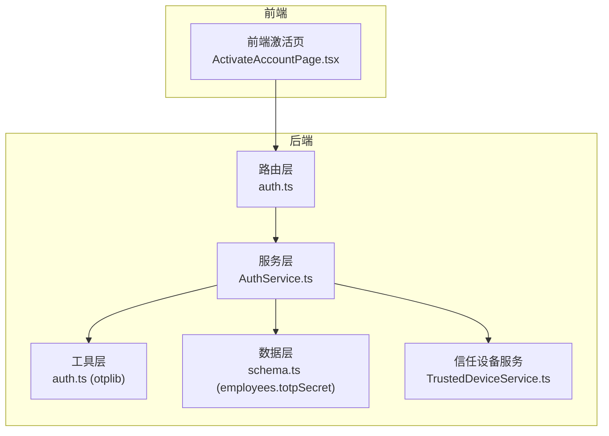
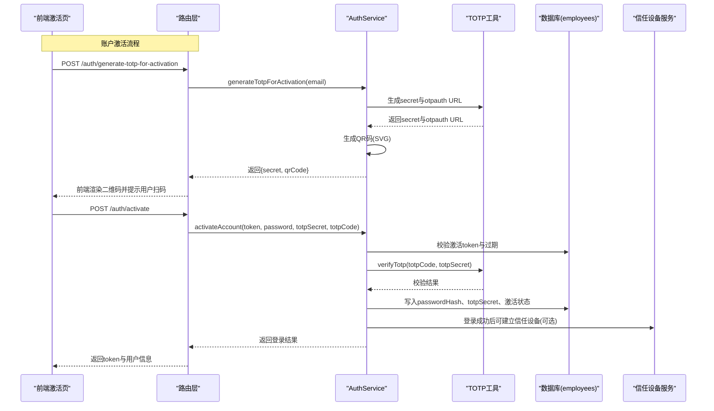
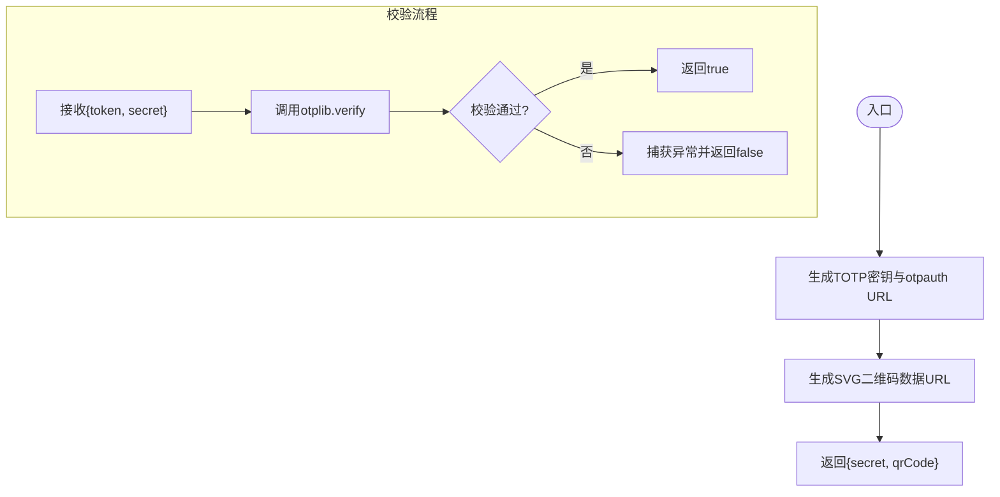
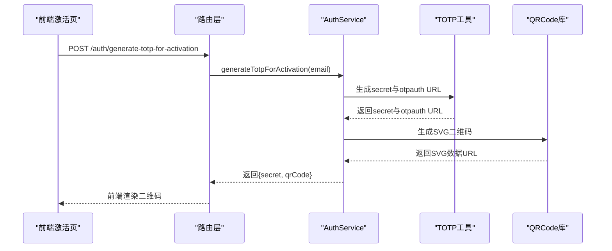
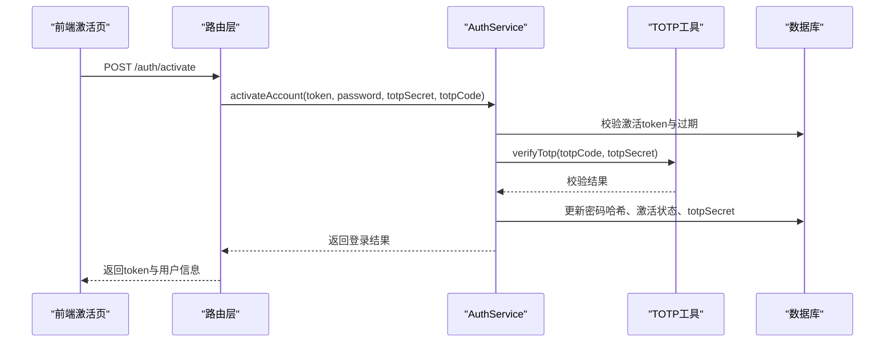
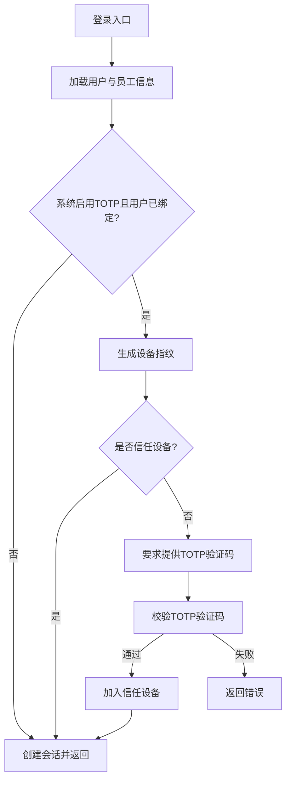
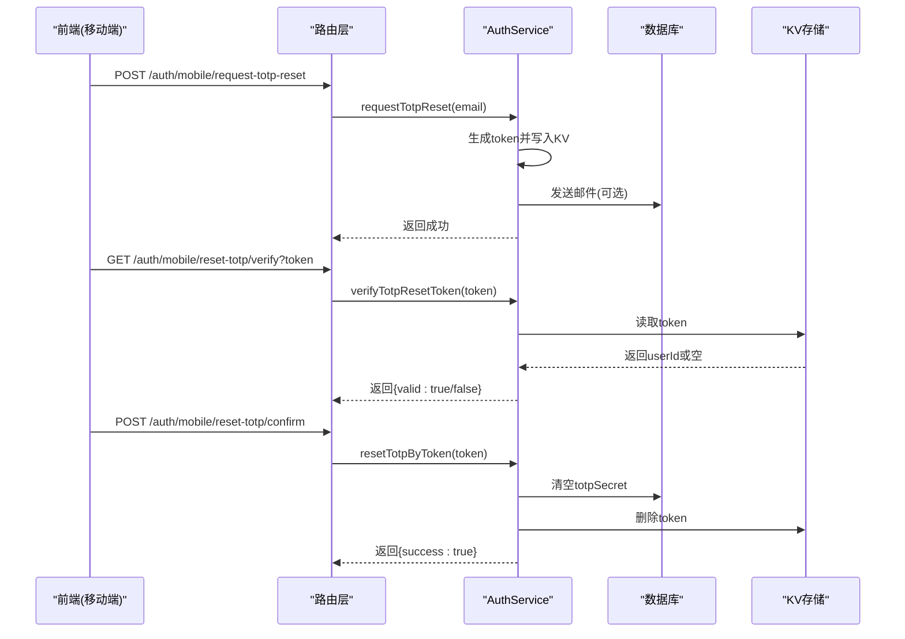
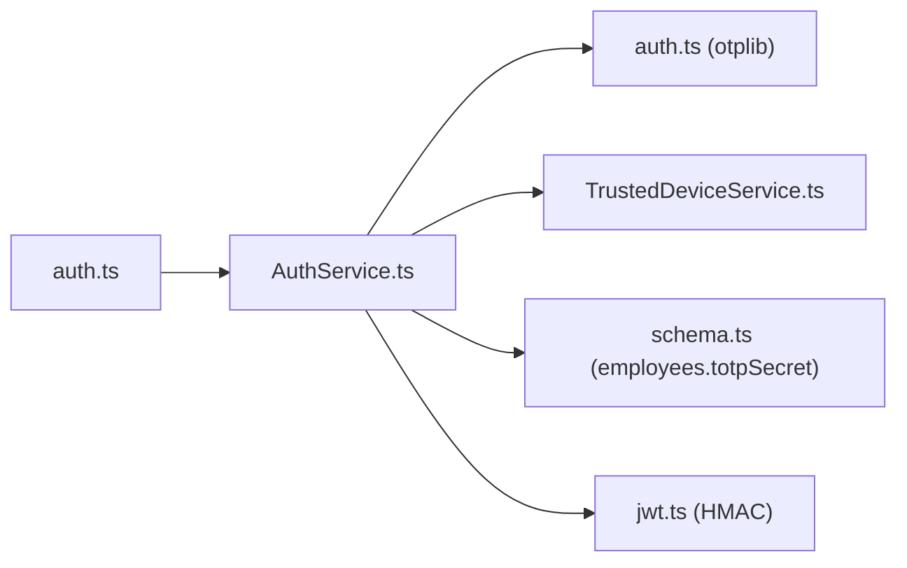

# TOTP身份验证流程

<cite>
**本文引用的文件**
- [backend/src/utils/auth.ts](file://backend/src/utils/auth.ts)
- [backend/src/services/AuthService.ts](file://backend/src/services/AuthService.ts)
- [backend/src/services/TrustedDeviceService.ts](file://backend/src/services/TrustedDeviceService.ts)
- [backend/src/routes/v2/auth.ts](file://backend/src/routes/v2/auth.ts)
- [backend/src/db/schema.ts](file://backend/src/db/schema.ts)
- [frontend/src/features/auth/pages/ActivateAccountPage.tsx](file://frontend/src/features/auth/pages/ActivateAccountPage.tsx)
- [backend/src/utils/jwt.ts](file://backend/src/utils/jwt.ts)
- [backend/gen_totp.ts](file://backend/gen_totp.ts)
</cite>

## 目录
1. [简介](#简介)
2. [项目结构](#项目结构)
3. [核心组件](#核心组件)
4. [架构总览](#架构总览)
5. [详细组件分析](#详细组件分析)
6. [依赖关系分析](#依赖关系分析)
7. [性能考量](#性能考量)
8. [故障排查指南](#故障排查指南)
9. [结论](#结论)
10. [附录](#附录)

## 简介
本文件系统性梳理系统的TOTP（基于HMAC的动态验证码）身份验证流程，重点解析以下两个关键接口：
- generateTotpForActivation：用于账户激活前生成TOTP密钥与otpauth URL，便于用户将账户绑定到Google Authenticator等二次验证器。
- verifyTotp：用于登录与激活流程中的TOTP校验，确保一次性验证码的有效性。

同时，文档覆盖TOTP在账户激活与登录过程中的验证逻辑、错误处理与安全策略，并提供前端与后端的集成示例路径，帮助开发者快速理解与扩展。

## 项目结构
围绕TOTP的关键代码分布在后端服务层与前端页面层：
- 后端
  - 路由层：定义generateTotpForActivation与activateAccount等接口
  - 服务层：实现TOTP生成、验证、激活、登录等核心逻辑
  - 工具层：封装otplib的TOTP生成与校验
  - 数据层：员工表包含totpSecret等认证字段
- 前端
  - 激活页：引导用户设置密码后生成TOTP密钥与二维码，完成绑定

图表来源
- [backend/src/routes/v2/auth.ts](file://backend/src/routes/v2/auth.ts#L348-L443)
- [backend/src/services/AuthService.ts](file://backend/src/services/AuthService.ts#L329-L443)
- [backend/src/utils/auth.ts](file://backend/src/utils/auth.ts#L1-L16)
- [backend/src/db/schema.ts](file://backend/src/db/schema.ts#L14-L48)
- [backend/src/services/TrustedDeviceService.ts](file://backend/src/services/TrustedDeviceService.ts#L1-L167)

章节来源
- [backend/src/routes/v2/auth.ts](file://backend/src/routes/v2/auth.ts#L348-L443)
- [backend/src/services/AuthService.ts](file://backend/src/services/AuthService.ts#L329-L443)
- [backend/src/utils/auth.ts](file://backend/src/utils/auth.ts#L1-L16)
- [backend/src/db/schema.ts](file://backend/src/db/schema.ts#L14-L48)
- [frontend/src/features/auth/pages/ActivateAccountPage.tsx](file://frontend/src/features/auth/pages/ActivateAccountPage.tsx#L1-L130)

## 核心组件
- otplib封装的TOTP生成与校验
  - 生成TOTP密钥与otpauth URL
  - 验证一次性验证码
- AuthService：实现TOTP在登录与激活中的具体逻辑
- TrustedDeviceService：基于设备指纹的“信任设备”机制，降低后续登录时的TOTP要求
- 员工表字段：存储totpSecret等认证信息

章节来源
- [backend/src/utils/auth.ts](file://backend/src/utils/auth.ts#L1-L16)
- [backend/src/services/AuthService.ts](file://backend/src/services/AuthService.ts#L34-L148)
- [backend/src/services/TrustedDeviceService.ts](file://backend/src/services/TrustedDeviceService.ts#L1-L167)
- [backend/src/db/schema.ts](file://backend/src/db/schema.ts#L14-L48)

## 架构总览
下图展示了TOTP在激活与登录两条主路径中的交互关系与数据流向。

图表来源
- [backend/src/routes/v2/auth.ts](file://backend/src/routes/v2/auth.ts#L348-L443)
- [backend/src/services/AuthService.ts](file://backend/src/services/AuthService.ts#L329-L443)
- [backend/src/utils/auth.ts](file://backend/src/utils/auth.ts#L1-L16)
- [backend/src/db/schema.ts](file://backend/src/db/schema.ts#L14-L48)
- [backend/src/services/TrustedDeviceService.ts](file://backend/src/services/TrustedDeviceService.ts#L1-L167)

## 详细组件分析

### 组件A：TOTP生成与校验工具
- 生成TOTP密钥与otpauth URL
  - 使用otplib生成随机密钥
  - 使用otplib.keyuri生成符合Google Authenticator标准的otpauth URL
- 验证TOTP验证码
  - 使用otplib.verify进行校验，异常时返回false，避免抛错影响流程

图表来源
- [backend/src/utils/auth.ts](file://backend/src/utils/auth.ts#L1-L16)

章节来源
- [backend/src/utils/auth.ts](file://backend/src/utils/auth.ts#L1-L16)

### 组件B：激活流程（generateTotpForActivation）
- 接口职责
  - 为即将激活的账户生成TOTP密钥与二维码，供用户绑定到验证器
- 关键步骤
  - 调用TOTP工具生成secret与otpauth URL
  - 使用qrcode-svg生成SVG二维码（兼容Edge Runtime）
  - 返回给前端用于展示与绑定

图表来源
- [backend/src/routes/v2/auth.ts](file://backend/src/routes/v2/auth.ts#L348-L418)
- [backend/src/services/AuthService.ts](file://backend/src/services/AuthService.ts#L329-L347)
- [backend/src/utils/auth.ts](file://backend/src/utils/auth.ts#L1-L16)

章节来源
- [backend/src/routes/v2/auth.ts](file://backend/src/routes/v2/auth.ts#L348-L418)
- [backend/src/services/AuthService.ts](file://backend/src/services/AuthService.ts#L329-L347)

### 组件C：激活流程（verifyTotp与activateAccount）
- 接口职责
  - 在用户设置密码后，使用TOTP验证码完成账户激活，并绑定TOTP密钥
- 关键步骤
  - 校验激活token与过期时间
  - 若系统启用TOTP，校验传入的totpCode与totpSecret
  - 写入密码哈希、激活状态与totpSecret
  - 自动登录并返回JWT与用户信息

图表来源
- [backend/src/routes/v2/auth.ts](file://backend/src/routes/v2/auth.ts#L387-L443)
- [backend/src/services/AuthService.ts](file://backend/src/services/AuthService.ts#L375-L443)
- [backend/src/utils/auth.ts](file://backend/src/utils/auth.ts#L10-L16)
- [backend/src/db/schema.ts](file://backend/src/db/schema.ts#L14-L48)

章节来源
- [backend/src/routes/v2/auth.ts](file://backend/src/routes/v2/auth.ts#L387-L443)
- [backend/src/services/AuthService.ts](file://backend/src/services/AuthService.ts#L375-L443)

### 组件D：登录流程中的TOTP校验
- 接口职责
  - 登录时根据系统策略与设备信任状态决定是否需要TOTP验证码
- 关键步骤
  - 校验密码与员工状态
  - 若系统启用TOTP且用户已绑定TOTP：
    - 生成设备指纹
    - 若非信任设备，要求用户提供TOTP验证码并校验
    - 校验通过后将设备加入信任列表
  - 登录成功后写入会话并返回JWT

图表来源
- [backend/src/services/AuthService.ts](file://backend/src/services/AuthService.ts#L34-L148)
- [backend/src/services/TrustedDeviceService.ts](file://backend/src/services/TrustedDeviceService.ts#L1-L167)
- [backend/src/utils/auth.ts](file://backend/src/utils/auth.ts#L10-L16)

章节来源
- [backend/src/services/AuthService.ts](file://backend/src/services/AuthService.ts#L34-L148)
- [backend/src/services/TrustedDeviceService.ts](file://backend/src/services/TrustedDeviceService.ts#L1-L167)

### 组件E：TOTP重置流程
- 接口职责
  - 提供TOTP重置链接的申请、验证与执行
- 关键步骤
  - 申请：生成短时效token并写入KV，发送邮件
  - 验证：校验token有效性与过期
  - 执行：清空用户totpSecret并记录审计

图表来源
- [backend/src/routes/v2/auth.ts](file://backend/src/routes/v2/auth.ts#L573-L686)
- [backend/src/services/AuthService.ts](file://backend/src/services/AuthService.ts#L444-L493)

章节来源
- [backend/src/routes/v2/auth.ts](file://backend/src/routes/v2/auth.ts#L573-L686)
- [backend/src/services/AuthService.ts](file://backend/src/services/AuthService.ts#L444-L493)

## 依赖关系分析
- 组件耦合
  - 路由层仅负责参数解析与响应包装，核心逻辑集中在服务层
  - 服务层依赖TOTP工具与信任设备服务，数据访问通过Drizzle ORM
- 外部依赖
  - otplib：生成与校验TOTP
  - qrcode-svg：生成SVG二维码
  - Web Crypto API：设备指纹与JWT签名/校验
- 数据模型
  - employees表包含totpSecret字段，用于存储用户绑定的TOTP密钥

图表来源
- [backend/src/routes/v2/auth.ts](file://backend/src/routes/v2/auth.ts#L1-L178)
- [backend/src/services/AuthService.ts](file://backend/src/services/AuthService.ts#L1-L148)
- [backend/src/utils/auth.ts](file://backend/src/utils/auth.ts#L1-L16)
- [backend/src/services/TrustedDeviceService.ts](file://backend/src/services/TrustedDeviceService.ts#L1-L167)
- [backend/src/db/schema.ts](file://backend/src/db/schema.ts#L14-L48)
- [backend/src/utils/jwt.ts](file://backend/src/utils/jwt.ts#L46-L124)

章节来源
- [backend/src/routes/v2/auth.ts](file://backend/src/routes/v2/auth.ts#L1-L178)
- [backend/src/services/AuthService.ts](file://backend/src/services/AuthService.ts#L1-L148)
- [backend/src/utils/auth.ts](file://backend/src/utils/auth.ts#L1-L16)
- [backend/src/services/TrustedDeviceService.ts](file://backend/src/services/TrustedDeviceService.ts#L1-L167)
- [backend/src/db/schema.ts](file://backend/src/db/schema.ts#L14-L48)
- [backend/src/utils/jwt.ts](file://backend/src/utils/jwt.ts#L46-L124)

## 性能考量
- 二维码生成
  - 使用qrcode-svg生成SVG数据URL，避免Canvas依赖，适合Edge Runtime环境
- 设备信任
  - 通过设备指纹与信任设备表减少后续登录的TOTP校验次数，提升用户体验
- 会话与KV
  - 会话优先从KV读取，降级到D1，兼顾性能与一致性

[本节为通用建议，无需特定文件引用]

## 故障排查指南
- 生成TOTP失败
  - 检查路由层与服务层的参数解析与返回结构
  - 确认otplib可用且未被环境限制
- 激活失败
  - 校验激活token是否有效与未过期
  - 确认TOTP验证码与密钥匹配
  - 检查系统是否启用TOTP且用户未绑定
- 登录失败
  - 非信任设备需提供正确TOTP验证码
  - 检查设备指纹生成与信任设备表写入
- 重置TOTP失败
  - 校验token是否有效与未过期
  - 确认KV中token已清理

章节来源
- [backend/src/routes/v2/auth.ts](file://backend/src/routes/v2/auth.ts#L348-L443)
- [backend/src/services/AuthService.ts](file://backend/src/services/AuthService.ts#L375-L493)
- [backend/src/services/TrustedDeviceService.ts](file://backend/src/services/TrustedDeviceService.ts#L1-L167)

## 结论
本系统采用otplib实现基于HMAC的TOTP动态验证码，并通过otpauth URL与Google Authenticator等验证器标准兼容。服务层在激活与登录流程中分别承担密钥生成、验证码校验与信任设备管理，结合数据库的totpSecret字段与JWT会话体系，形成完整的二次验证闭环。前端激活页通过二维码引导用户完成绑定，整体流程清晰、安全可控。

[本节为总结，无需特定文件引用]

## 附录

### A. 代码示例路径（不展示具体代码内容）
- 生成TOTP密钥与otpauth URL
  - 路径参考：[backend/src/utils/auth.ts](file://backend/src/utils/auth.ts#L1-L16)
- 生成激活用TOTP与二维码
  - 路径参考：[backend/src/services/AuthService.ts](file://backend/src/services/AuthService.ts#L329-L347)
- 激活账户并绑定TOTP
  - 路径参考：[backend/src/services/AuthService.ts](file://backend/src/services/AuthService.ts#L375-L443)
  - 路由参考：[backend/src/routes/v2/auth.ts](file://backend/src/routes/v2/auth.ts#L387-L443)
- 登录时的TOTP校验与信任设备
  - 路径参考：[backend/src/services/AuthService.ts](file://backend/src/services/AuthService.ts#L34-L148)
  - 信任设备服务：[backend/src/services/TrustedDeviceService.ts](file://backend/src/services/TrustedDeviceService.ts#L1-L167)
- TOTP重置流程
  - 路径参考：[backend/src/services/AuthService.ts](file://backend/src/services/AuthService.ts#L444-L493)
  - 路由参考：[backend/src/routes/v2/auth.ts](file://backend/src/routes/v2/auth.ts#L573-L686)
- 员工表TOTP字段
  - 路径参考：[backend/src/db/schema.ts](file://backend/src/db/schema.ts#L14-L48)
- 前端激活页绑定TOTP
  - 路径参考：[frontend/src/features/auth/pages/ActivateAccountPage.tsx](file://frontend/src/features/auth/pages/ActivateAccountPage.tsx#L1-L130)
- 示例脚本（本地验证）
  - 路径参考：[backend/gen_totp.ts](file://backend/gen_totp.ts#L1-L4)

### B. 安全策略摘要
- 严格校验激活与重置token的有效性与过期时间
- 登录时对非信任设备强制TOTP校验
- 信任设备有效期与自动清理机制
- 静默返回与防枚举策略（如密码重置与TOTP重置）

[本节为通用总结，无需特定文件引用]