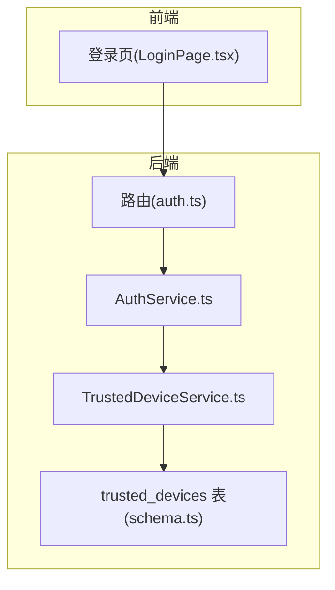
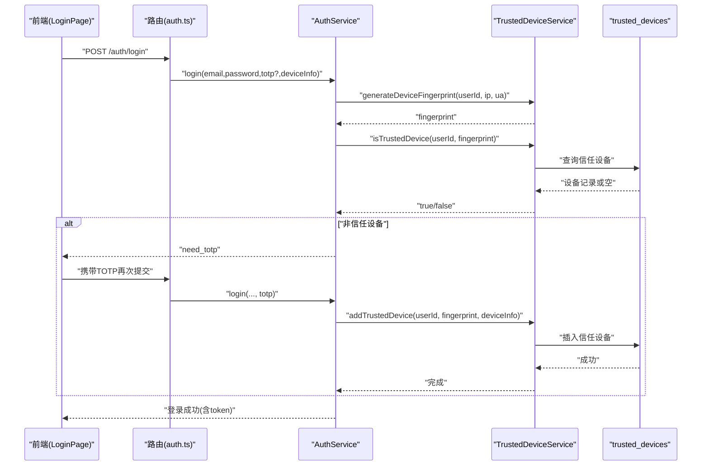
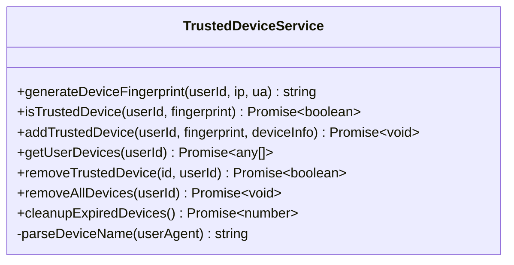
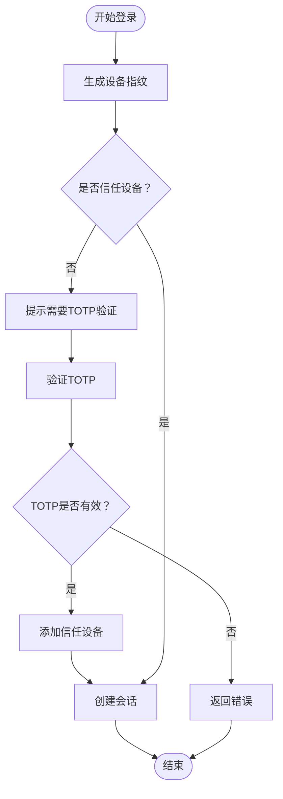
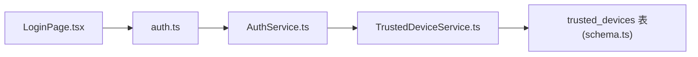

# 信任设备管理

<cite>
**本文引用的文件**
- [TrustedDeviceService.ts](file://backend/src/services/TrustedDeviceService.ts)
- [AuthService.ts](file://backend/src/services/AuthService.ts)
- [auth.ts](file://backend/src/routes/v2/auth.ts)
- [schema.ts](file://backend/src/db/schema.ts)
- [LoginPage.tsx](file://frontend/src/features/auth/pages/LoginPage.tsx)
- [SystemConfigService.ts](file://backend/src/services/SystemConfigService.ts)
</cite>

## 目录
1. [简介](#简介)
2. [项目结构](#项目结构)
3. [核心组件](#核心组件)
4. [架构总览](#架构总览)
5. [详细组件分析](#详细组件分析)
6. [依赖关系分析](#依赖关系分析)
7. [性能与安全考量](#性能与安全考量)
8. [故障排查指南](#故障排查指南)
9. [结论](#结论)
10. [附录](#附录)

## 简介
本专项文档聚焦于“信任设备管理”能力，围绕基于设备指纹的90天免验证机制进行深入解析。文档涵盖以下关键点：
- generateDeviceFingerprint 如何结合用户ID、IP地址与UserAgent生成SHA-256设备指纹
- TrustedDeviceService 对设备信任状态的持久化存储与生命周期管理
- isTrustedDevice 与 addTrustedDevice 的实现逻辑及过期时间管理
- 安全考量与异常处理策略
- 实际应用场景：新设备登录时的TOTP验证流程与信任设备的自动识别过程

## 项目结构
信任设备管理涉及后端服务层、数据库模式、路由层以及前端登录流程的协同：
- 后端服务层：AuthService 调用 TrustedDeviceService 进行设备指纹生成与信任校验；TrustedDeviceService 负责设备指纹计算、信任设备的增删查与过期清理
- 数据库模式：trusted_devices 表存储信任设备信息，含用户ID、指纹、设备名、IP、UA、创建与最后使用时间等
- 路由层：auth 路由在登录时收集设备信息并传递给 AuthService
- 前端：登录页根据 AuthService 返回的状态决定是否进入TOTP验证步骤

图表来源
- [auth.ts](file://backend/src/routes/v2/auth.ts#L81-L144)
- [AuthService.ts](file://backend/src/services/AuthService.ts#L34-L148)
- [TrustedDeviceService.ts](file://backend/src/services/TrustedDeviceService.ts#L14-L101)
- [schema.ts](file://backend/src/db/schema.ts#L128-L137)

章节来源
- [auth.ts](file://backend/src/routes/v2/auth.ts#L81-L144)
- [AuthService.ts](file://backend/src/services/AuthService.ts#L34-L148)
- [TrustedDeviceService.ts](file://backend/src/services/TrustedDeviceService.ts#L14-L101)
- [schema.ts](file://backend/src/db/schema.ts#L128-L137)

## 核心组件
- TrustedDeviceService
  - generateDeviceFingerprint：对“用户ID:IP:UserAgent”拼接字符串进行SHA-256哈希，输出固定长度前缀的设备指纹
  - isTrustedDevice：查询指定用户的信任设备，若不存在或已过期（90天）则删除并返回false；否则更新最后使用时间并返回true
  - addTrustedDevice：新增信任设备记录，解析UA生成设备名，忽略唯一约束冲突（设备已存在）
  - 其他：getUserDevices、removeTrustedDevice、removeAllDevices、cleanupExpiredDevices
- AuthService
  - login：在启用2FA场景下，生成设备指纹并校验是否信任；非信任设备则要求TOTP验证并通过后加入信任设备
  - createSession：单点登录、会话持久化与KV缓存写入
- 路由层
  - 提取设备信息（IP、UA），调用 AuthService.login 并返回结果
- 前端
  - 登录页根据 AuthService 返回的 needTotp 决定是否展示TOTP输入

章节来源
- [TrustedDeviceService.ts](file://backend/src/services/TrustedDeviceService.ts#L14-L166)
- [AuthService.ts](file://backend/src/services/AuthService.ts#L34-L148)
- [auth.ts](file://backend/src/routes/v2/auth.ts#L81-L144)
- [LoginPage.tsx](file://frontend/src/features/auth/pages/LoginPage.tsx#L1-L194)

## 架构总览
信任设备管理的端到端流程如下：
- 用户发起登录请求，路由层收集IP与UA
- AuthService 生成设备指纹并检查是否信任
- 若非信任设备，要求用户提供TOTP验证码
- TOTP验证通过后，将设备加入信任列表，后续90天内无需再次验证
- 信任设备的过期检查与自动清理保证安全性

图表来源
- [auth.ts](file://backend/src/routes/v2/auth.ts#L81-L144)
- [AuthService.ts](file://backend/src/services/AuthService.ts#L34-L148)
- [TrustedDeviceService.ts](file://backend/src/services/TrustedDeviceService.ts#L14-L101)

## 详细组件分析

### TrustedDeviceService 组件分析
- 设备指纹生成
  - 输入：用户ID、IP、UserAgent
  - 处理：拼接字符串后使用Web Crypto API计算SHA-256，再转为十六进制字符串，截取前32位并加前缀
  - 输出：形如“device_<32位十六进制字符串”的设备指纹
- 信任设备校验
  - 查询条件：用户ID与设备指纹精确匹配
  - 过期检查：若createdAt距当前超过90天，删除记录并返回false
  - 成功命中：更新lastUsedAt为当前时间
- 添加信任设备
  - 解析UA生成设备名（如iPhone、iPad、Android、Mac、Windows、Linux、Chrome、Firefox、Safari等）
  - 插入记录，包含createdAt与lastUsedAt
  - 唯一约束冲突（设备已存在）被忽略，避免重复报错
- 其他能力
  - 获取用户全部信任设备
  - 删除单个信任设备
  - 删除用户全部信任设备
  - 清理过期设备（按createdAt）

图表来源
- [TrustedDeviceService.ts](file://backend/src/services/TrustedDeviceService.ts#L14-L166)

章节来源
- [TrustedDeviceService.ts](file://backend/src/services/TrustedDeviceService.ts#L14-L166)

### AuthService 中的信任设备集成
- 登录流程中的信任设备判定
  - 在启用2FA场景下，生成设备指纹并调用isTrustedDevice
  - 若返回false，要求用户提供TOTP；TOTP验证通过后调用addTrustedDevice
  - 若返回true，直接进入会话创建阶段
- 会话创建
  - 单点登录：删除该用户旧会话（KV与DB）
  - D1持久化与KV缓存写入，设置过期时间

图表来源
- [AuthService.ts](file://backend/src/services/AuthService.ts#L34-L148)
- [TrustedDeviceService.ts](file://backend/src/services/TrustedDeviceService.ts#L32-L101)

章节来源
- [AuthService.ts](file://backend/src/services/AuthService.ts#L34-L148)

### 数据模型与持久化
trusted_devices 表的关键字段：
- id：主键
- user_id：外键关联用户
- device_fingerprint：设备指纹（唯一）
- device_name：设备名（解析UA生成）
- ip_address：IP地址
- user_agent：User-Agent
- last_used_at：最后使用时间
- created_at：创建时间

章节来源
- [schema.ts](file://backend/src/db/schema.ts#L128-L137)

### 前端交互与TOTP流程
- 登录页在收到 needTotp 时切换到TOTP输入界面
- 提交TOTP后，前端再次调用登录接口，携带TOTP参数
- 登录成功后，前端保存token与用户信息并跳转首页

章节来源
- [LoginPage.tsx](file://frontend/src/features/auth/pages/LoginPage.tsx#L1-L194)

## 依赖关系分析
- AuthService 依赖 TrustedDeviceService 进行设备指纹生成与信任校验
- TrustedDeviceService 依赖 Drizzle ORM 访问 trusted_devices 表
- 路由层 auth.ts 依赖 AuthService 执行登录逻辑
- 前端 LoginPage.tsx 依赖后端登录接口返回的状态字段控制UI流程

图表来源
- [auth.ts](file://backend/src/routes/v2/auth.ts#L81-L144)
- [AuthService.ts](file://backend/src/services/AuthService.ts#L34-L148)
- [TrustedDeviceService.ts](file://backend/src/services/TrustedDeviceService.ts#L14-L166)
- [schema.ts](file://backend/src/db/schema.ts#L128-L137)

章节来源
- [auth.ts](file://backend/src/routes/v2/auth.ts#L81-L144)
- [AuthService.ts](file://backend/src/services/AuthService.ts#L34-L148)
- [TrustedDeviceService.ts](file://backend/src/services/TrustedDeviceService.ts#L14-L166)
- [schema.ts](file://backend/src/db/schema.ts#L128-L137)

## 性能与安全考量
- 性能
  - 设备指纹生成采用SHA-256，计算开销极低，适合高频调用
  - isTrustedDevice 仅做一次查询并按用户ID+指纹建立索引（Drizzle schema中未显式声明索引，建议在数据库层为user_id与device_fingerprint建立联合索引以优化查询）
  - addTrustedDevice 通过唯一约束避免重复插入，忽略冲突错误，减少异常分支
- 安全
  - 90天信任有效期：降低长期信任设备带来的风险；过期自动清理
  - UA解析仅用于显示友好名，不参与安全判定
  - 登录流程中，非信任设备必须通过TOTP验证，确保二次验证强度
  - 单点登录策略：同一用户仅保留一个有效会话，提升会话安全性
- 可维护性
  - TrustedDeviceService 提供清理过期设备的能力，便于定期维护
  - addTrustedDevice 忽略唯一约束冲突，避免重复注册导致的异常传播

[本节为通用指导，不直接分析具体文件]

## 故障排查指南
- 设备指纹不一致
  - 检查IP与UA是否正确传入；UA可能为空或变化导致指纹不同
  - 确认 generateDeviceFingerprint 的输入顺序与格式
- 非信任设备仍提示需要TOTP
  - 确认 isTrustedDevice 查询是否命中；检查createdAt是否超过90天
  - 确认 addTrustedDevice 是否成功插入
- TOTP验证失败
  - 检查前端是否正确提交6位数字验证码
  - 确认AuthService中TOTP校验逻辑是否执行
- 会话问题
  - 检查单点登录是否正确清理旧会话（KV与DB）
  - 确认会话过期时间设置与KV TTL一致

章节来源
- [AuthService.ts](file://backend/src/services/AuthService.ts#L34-L148)
- [TrustedDeviceService.ts](file://backend/src/services/TrustedDeviceService.ts#L32-L101)

## 结论
信任设备管理通过“设备指纹+90天有效期”的组合，在保障安全的前提下显著提升了用户体验。后端AuthService与TrustedDeviceService协作完成设备指纹生成、信任校验与持久化，前端登录页根据返回状态智能引导TOTP流程。建议在数据库层面为信任设备表增加必要的索引以优化查询性能，并定期运行清理任务以维持数据健康。

[本节为总结性内容，不直接分析具体文件]

## 附录

### 关键流程路径参考
- 设备指纹生成：[generateDeviceFingerprint](file://backend/src/services/TrustedDeviceService.ts#L17-L30)
- 信任设备校验：[isTrustedDevice](file://backend/src/services/TrustedDeviceService.ts#L35-L63)
- 添加信任设备：[addTrustedDevice](file://backend/src/services/TrustedDeviceService.ts#L68-L101)
- 登录流程与TOTP集成：[AuthService.login](file://backend/src/services/AuthService.ts#L34-L148)
- 路由层设备信息采集：[auth.ts 登录处理器](file://backend/src/routes/v2/auth.ts#L81-L144)
- 前端TOTP流程：[LoginPage.tsx](file://frontend/src/features/auth/pages/LoginPage.tsx#L1-L194)
- 数据模型定义：[trusted_devices 表](file://backend/src/db/schema.ts#L128-L137)