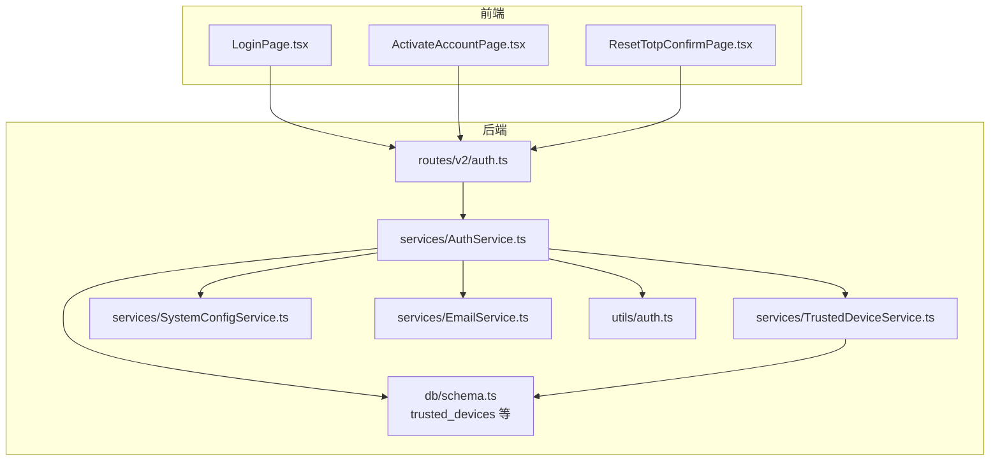
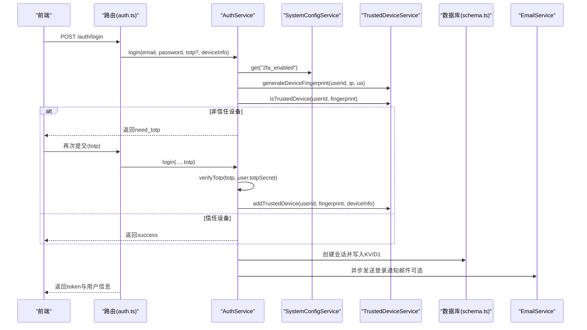
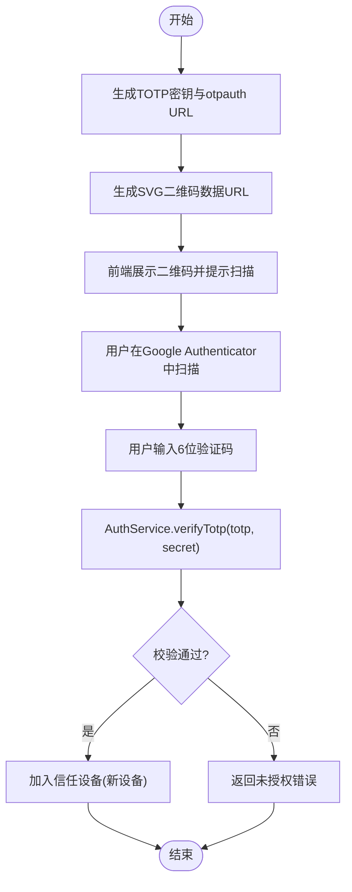
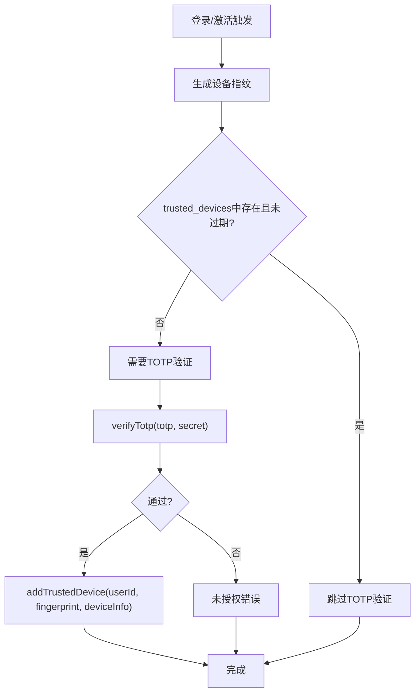
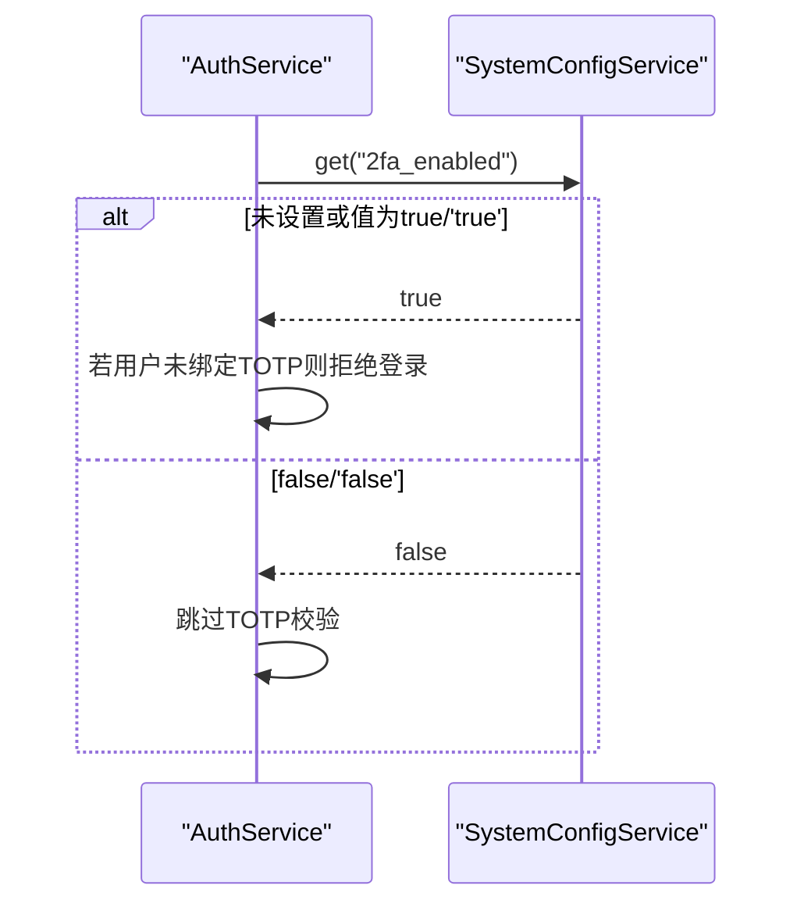
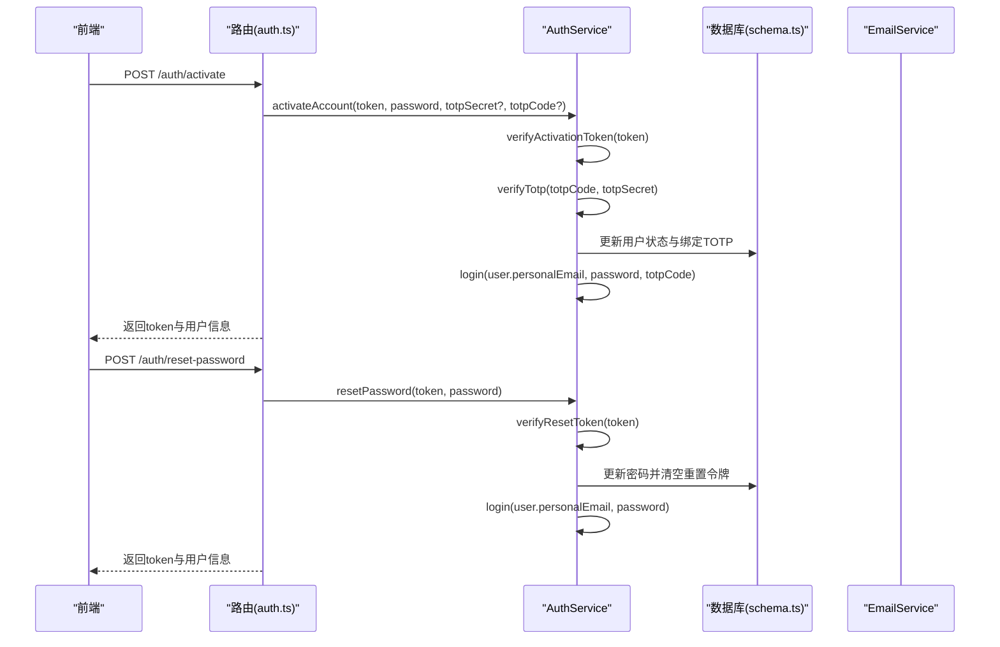
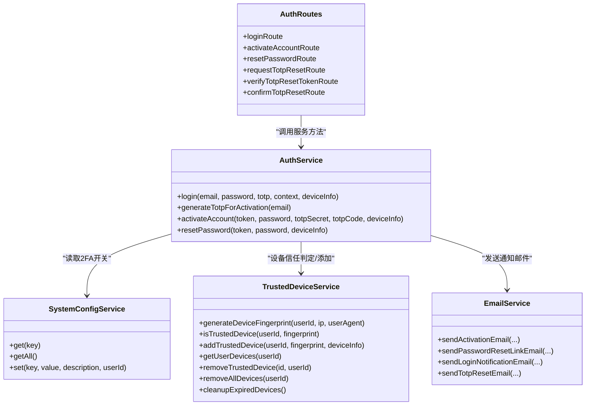
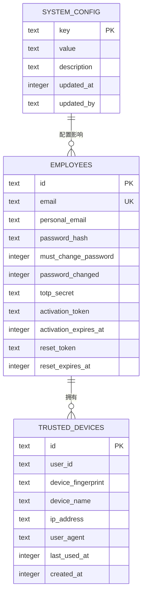

# 双因素认证(2FA)

<cite>
**本文引用的文件**
- [AuthService.ts](file://backend/src/services/AuthService.ts)
- [auth.ts](file://backend/src/utils/auth.ts)
- [TrustedDeviceService.ts](file://backend/src/services/TrustedDeviceService.ts)
- [SystemConfigService.ts](file://backend/src/services/SystemConfigService.ts)
- [auth.ts](file://backend/src/routes/v2/auth.ts)
- [schema.ts](file://backend/src/db/schema.ts)
- [0000_snapshot.json](file://backend/drizzle/meta/0000_snapshot.json)
- [ActivateAccountPage.tsx](file://frontend/src/features/auth/pages/ActivateAccountPage.tsx)
- [LoginPage.tsx](file://frontend/src/features/auth/pages/LoginPage.tsx)
- [ResetTotpConfirmPage.tsx](file://frontend/src/features/auth/pages/ResetTotpConfirmPage.tsx)
- [Login.css](file://frontend/src/features/auth/pages/Login.css)
- [EmailService.ts](file://backend/src/services/EmailService.ts)
- [activation.test.ts](file://backend/test/services/activation.test.ts)
- [password_reset.test.ts](file://backend/test/services/password_reset.test.ts)
</cite>

## 目录
1. [简介](#简介)
2. [项目结构与角色定位](#项目结构与角色定位)
3. [核心组件](#核心组件)
4. [架构总览](#架构总览)
5. [关键流程详解](#关键流程详解)
6. [依赖关系分析](#依赖关系分析)
7. [性能与安全考量](#性能与安全考量)
8. [故障排查指南](#故障排查指南)
9. [结论](#结论)
10. [附录](#附录)

## 简介
本专项文档聚焦于基于TOTP（基于时间的一次性密码）的双因素认证（2FA）体系，覆盖以下要点：
- TOTP生成与验证机制：generateTotpForActivation与verifyTotp
- Google Authenticator集成：通过SVG二维码绑定TOTP密钥
- “信任设备”机制：generateDeviceFingerprint与TrustedDeviceService在90天内免除新设备的TOTP验证
- 全局开关：systemConfigService对2fa_enabled的控制
- 账户激活与密码重置流程中的TOTP集成
- QR码生成（SVG）技术细节与安全最佳实践

## 项目结构与角色定位
- 后端服务层
  - AuthService：统一处理登录、激活、TOTP校验、会话管理、审计日志等
  - TrustedDeviceService：设备指纹生成、信任设备判定与持久化
  - SystemConfigService：系统配置读取与写入（含2fa_enabled）
  - EmailService：发送各类通知邮件（激活、登录、TOTP重置等）
- 前端页面
  - ActivateAccountPage：激活流程中生成TOTP密钥与二维码、绑定TOTP
  - LoginPage：登录页展示TOTP输入框与“设备丢失”入口
  - ResetTotpConfirmPage：确认重置TOTP（移除绑定）
- 路由层
  - auth.ts：定义登录、激活、TOTP重置等API端点与OpenAPI规范
- 数据模型
  - schema.ts与数据库快照：系统配置、员工表（含TOTP字段）、信任设备表等

图表来源
- [auth.ts](file://backend/src/routes/v2/auth.ts#L1-L120)
- [AuthService.ts](file://backend/src/services/AuthService.ts#L1-L120)
- [TrustedDeviceService.ts](file://backend/src/services/TrustedDeviceService.ts#L1-L60)
- [SystemConfigService.ts](file://backend/src/services/SystemConfigService.ts#L1-L60)
- [schema.ts](file://backend/src/db/schema.ts#L1-L140)

章节来源
- [auth.ts](file://backend/src/routes/v2/auth.ts#L1-L120)
- [AuthService.ts](file://backend/src/services/AuthService.ts#L1-L120)
- [schema.ts](file://backend/src/db/schema.ts#L1-L140)

## 核心组件
- TOTP工具
  - generateTotpSecret(email)：生成TOTP密钥与otpauth URL
  - verifyTotp(token, secret)：校验6位验证码
- 登录与2FA
  - AuthService.login：密码校验后根据系统配置与设备信任状态决定是否需要TOTP；若新设备则要求TOTP并成功后加入信任设备
- 信任设备
  - generateDeviceFingerprint(userId, ip, userAgent)：SHA-256生成设备指纹
  - isTrustedDevice(userId, fingerprint)：判断设备是否可信（含90天过期清理）
  - addTrustedDevice(userId, fingerprint, deviceInfo)：新增信任设备记录
- 系统配置
  - SystemConfigService.get('2fa_enabled')：读取2FA全局开关
- QR码生成
  - generateTotpForActivation(email)：生成SVG二维码数据URL（不依赖Canvas）

章节来源
- [auth.ts](file://backend/src/utils/auth.ts#L1-L17)
- [AuthService.ts](file://backend/src/services/AuthService.ts#L73-L114)
- [TrustedDeviceService.ts](file://backend/src/services/TrustedDeviceService.ts#L14-L63)
- [SystemConfigService.ts](file://backend/src/services/SystemConfigService.ts#L9-L21)
- [AuthService.ts](file://backend/src/services/AuthService.ts#L329-L347)

## 架构总览
下图展示了登录与激活流程中各组件的交互关系与数据流向。

图表来源
- [auth.ts](file://backend/src/routes/v2/auth.ts#L80-L144)
- [AuthService.ts](file://backend/src/services/AuthService.ts#L34-L114)
- [TrustedDeviceService.ts](file://backend/src/services/TrustedDeviceService.ts#L14-L100)
- [schema.ts](file://backend/src/db/schema.ts#L118-L137)

章节来源
- [auth.ts](file://backend/src/routes/v2/auth.ts#L80-L144)
- [AuthService.ts](file://backend/src/services/AuthService.ts#L34-L114)

## 关键流程详解

### 1) TOTP生成与验证（基于Google Authenticator）
- 生成TOTP密钥与二维码
  - 调用generateTotpForActivation(email)，内部生成TOTP密钥与otpauth URL，再以qrcode-svg生成SVG并封装为data URI返回给前端
  - 前端接收secret与qrCode后，引导用户在Google Authenticator中扫描绑定
- 验证TOTP
  - 登录时，AuthService.login在满足系统2FA开启且用户已绑定TOTP的前提下，对新设备要求输入6位验证码
  - verifyTotp(token, secret)使用otplib进行校验，校验失败抛出未授权错误

图表来源
- [AuthService.ts](file://backend/src/services/AuthService.ts#L329-L347)
- [auth.ts](file://backend/src/utils/auth.ts#L1-L17)
- [ActivateAccountPage.tsx](file://frontend/src/features/auth/pages/ActivateAccountPage.tsx#L238-L282)

章节来源
- [AuthService.ts](file://backend/src/services/AuthService.ts#L329-L347)
- [auth.ts](file://backend/src/utils/auth.ts#L1-L17)
- [ActivateAccountPage.tsx](file://frontend/src/features/auth/pages/ActivateAccountPage.tsx#L238-L282)

### 2) “信任设备”机制（90天免TOTP）
- 设备指纹生成
  - 使用Web Crypto API对“用户ID+IP+User-Agent”进行SHA-256哈希，截取前32位作为设备指纹标识
- 设备信任判定
  - 查询trusted_devices表，若不存在或createdAt超过90天则视为不可信
  - 若可信，更新lastUsedAt并返回true
- 加入信任设备
  - 首次通过TOTP验证的新设备，将设备指纹、设备名（解析UA）、IP、UA、创建与最近使用时间写入数据库
- 过期清理
  - 提供cleanupExpiredDevices按createdAt清理过期记录

图表来源
- [AuthService.ts](file://backend/src/services/AuthService.ts#L90-L114)
- [TrustedDeviceService.ts](file://backend/src/services/TrustedDeviceService.ts#L14-L100)
- [schema.ts](file://backend/src/db/schema.ts#L128-L137)

章节来源
- [AuthService.ts](file://backend/src/services/AuthService.ts#L90-L114)
- [TrustedDeviceService.ts](file://backend/src/services/TrustedDeviceService.ts#L14-L100)

### 3) 全局开关：2fa_enabled
- SystemConfigService.get('2fa_enabled')读取系统配置
  - 若未设置，默认视为开启（true）
  - 若开启且用户已激活但未绑定TOTP，登录阶段直接拒绝
  - 在激活流程中，若开启则要求提供totpSecret与totpCode并通过verifyTotp校验

图表来源
- [AuthService.ts](file://backend/src/services/AuthService.ts#L73-L87)
- [SystemConfigService.ts](file://backend/src/services/SystemConfigService.ts#L9-L21)

章节来源
- [AuthService.ts](file://backend/src/services/AuthService.ts#L73-L87)
- [SystemConfigService.ts](file://backend/src/services/SystemConfigService.ts#L9-L21)

### 4) 账户激活（activateAccount）与密码重置（resetPassword）中的TOTP集成
- 账户激活
  - verifyActivationToken校验激活令牌有效性
  - activateAccount在2FA开启时要求totpSecret与totpCode，通过verifyTotp校验后绑定TOTP并激活用户
  - 成功后自动登录并记录审计日志
- 密码重置
  - requestPasswordReset生成重置令牌并发送邮件
  - resetPassword校验令牌有效性后重置密码并自动登录
  - 重置TOTP
    - requestTotpReset向用户邮箱发送TOTP重置链接（KV存储，30分钟过期）
    - verifyTotpResetToken校验令牌
    - resetTotpByToken将用户TOTP解除绑定

图表来源
- [auth.ts](file://backend/src/routes/v2/auth.ts#L348-L443)
- [AuthService.ts](file://backend/src/services/AuthService.ts#L349-L443)
- [EmailService.ts](file://backend/src/services/EmailService.ts#L250-L259)

章节来源
- [auth.ts](file://backend/src/routes/v2/auth.ts#L348-L443)
- [AuthService.ts](file://backend/src/services/AuthService.ts#L349-L443)
- [EmailService.ts](file://backend/src/services/EmailService.ts#L250-L259)

### 5) QR码生成（SVG）技术细节与安全最佳实践
- 技术细节
  - 使用qrcode-svg生成SVG字符串，再以base64编码为data:image/svg+xml;base64,...形式返回
  - 前端直接渲染该data URL，无需Canvas环境
- 安全最佳实践
  - 仅在受信任的激活/绑定流程中生成与传输QR码（令牌有效期短、一次性使用）
  - 前端渲染SVG时避免注入XSS（当前实现为静态data URL）
  - 严格限制QR码生命周期与使用范围（仅用于绑定TOTP，不参与常规登录）

章节来源
- [AuthService.ts](file://backend/src/services/AuthService.ts#L329-L347)
- [ActivateAccountPage.tsx](file://frontend/src/features/auth/pages/ActivateAccountPage.tsx#L238-L282)
- [Login.css](file://frontend/src/features/auth/pages/Login.css#L320-L339)

## 依赖关系分析
- 组件耦合
  - AuthService依赖SystemConfigService、TrustedDeviceService、EmailService与数据库schema
  - TrustedDeviceService依赖数据库schema与Web Crypto API
  - 路由层auth.ts依赖AuthService并暴露OpenAPI接口
- 外部依赖
  - otplib：TOTP生成与校验
  - qrcode-svg：SVG二维码生成
  - Drizzle ORM：SQLite schema与查询
- 潜在循环依赖
  - 当前模块间无循环导入迹象

图表来源
- [AuthService.ts](file://backend/src/services/AuthService.ts#L1-L120)
- [SystemConfigService.ts](file://backend/src/services/SystemConfigService.ts#L1-L60)
- [TrustedDeviceService.ts](file://backend/src/services/TrustedDeviceService.ts#L1-L166)
- [auth.ts](file://backend/src/routes/v2/auth.ts#L1-L120)

章节来源
- [AuthService.ts](file://backend/src/services/AuthService.ts#L1-L120)
- [auth.ts](file://backend/src/routes/v2/auth.ts#L1-L120)

## 性能与安全考量
- 性能
  - 设备信任判定为单条数据库查询，成本低
  - 会话存储采用KV（高并发）+ D1（持久化），登录成功后异步写入KV提升读取性能
- 安全
  - 2FA默认开启策略：若未显式关闭，系统默认强制2FA
  - TOTP校验失败直接拒绝，避免暴力破解
  - 信任设备90天过期清理，降低长期信任风险
  - 重置令牌使用KV存储并设置TTL，防止泄露扩大
- 可靠性
  - 登录流程中对用户状态与激活令牌进行严格校验
  - 审计日志记录关键事件（登录、激活、重置等）

[本节为通用指导，不直接分析具体文件]

## 故障排查指南
- 登录时报“新设备首次登录，请输入Google验证码”
  - 原因：当前设备不在信任设备列表中
  - 处理：输入Google Authenticator中的6位验证码；若正确将自动加入信任设备
- “账号未绑定2FA，请联系管理员重置后重新绑定”
  - 原因：系统2FA开启且用户未绑定TOTP
  - 处理：联系管理员重置或在激活流程中绑定
- “验证码错误”
  - 原因：TOTP校验失败
  - 处理：检查时间同步、重新生成TOTP或重置TOTP
- “激活链接无效或已过期”
  - 原因：激活令牌不存在或超时
  - 处理：重新申请激活邮件
- “重置链接无效或已过期”
  - 原因：TOTP重置令牌不存在或超时（30分钟）
  - 处理：重新发起TOTP重置请求

章节来源
- [AuthService.ts](file://backend/src/services/AuthService.ts#L73-L114)
- [AuthService.ts](file://backend/src/services/AuthService.ts#L349-L443)
- [auth.ts](file://backend/src/routes/v2/auth.ts#L315-L443)

## 结论
本系统通过TOTP与“信任设备”机制实现了多层安全验证：系统级2FA开关确保默认强保护，设备指纹与90天信任窗口在用户体验与安全之间取得平衡。QR码绑定流程与路由层API设计清晰，配合审计与邮件通知，形成闭环的安全体系。

[本节为总结性内容，不直接分析具体文件]

## 附录

### A. 数据模型概览（与2FA相关）
- system_config：存储系统配置键值对（含2fa_enabled）
- employees：员工表，包含密码哈希、TOTP密钥、激活令牌与重置令牌等字段
- trusted_devices：信任设备表，记录设备指纹、设备名、IP、UA与时间戳

图表来源
- [schema.ts](file://backend/src/db/schema.ts#L1-L140)
- [0000_snapshot.json](file://backend/drizzle/meta/0000_snapshot.json#L3924-L3965)

章节来源
- [schema.ts](file://backend/src/db/schema.ts#L1-L140)
- [0000_snapshot.json](file://backend/drizzle/meta/0000_snapshot.json#L3924-L3965)

### B. 前端交互要点
- 登录页：展示TOTP输入框与“设备丢失”入口
- 激活页：生成TOTP密钥与二维码，引导扫描绑定
- 重置TOTP页：确认移除TOTP绑定

章节来源
- [LoginPage.tsx](file://frontend/src/features/auth/pages/LoginPage.tsx#L165-L183)
- [ActivateAccountPage.tsx](file://frontend/src/features/auth/pages/ActivateAccountPage.tsx#L238-L282)
- [ResetTotpConfirmPage.tsx](file://frontend/src/features/auth/pages/ResetTotpConfirmPage.tsx#L87-L120)
- [Login.css](file://frontend/src/features/auth/pages/Login.css#L320-L339)

### C. 测试参考
- 激活流程测试：验证激活令牌、激活后状态与登录行为
- 密码重置流程测试：重置令牌生成、校验与重置后的登录

章节来源
- [activation.test.ts](file://backend/test/services/activation.test.ts#L1-L173)
- [password_reset.test.ts](file://backend/test/services/password_reset.test.ts#L1-L183)