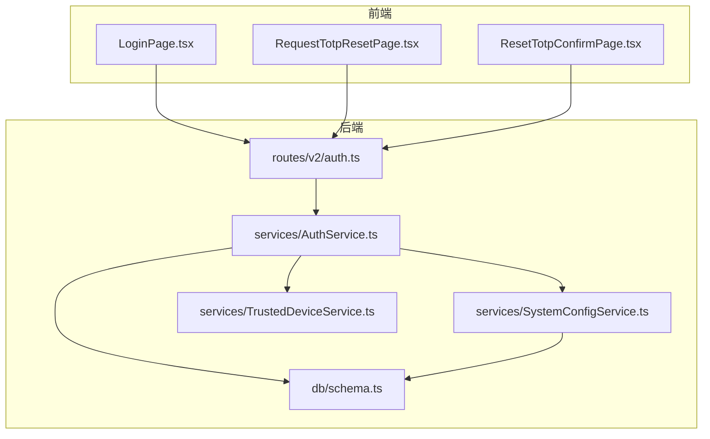
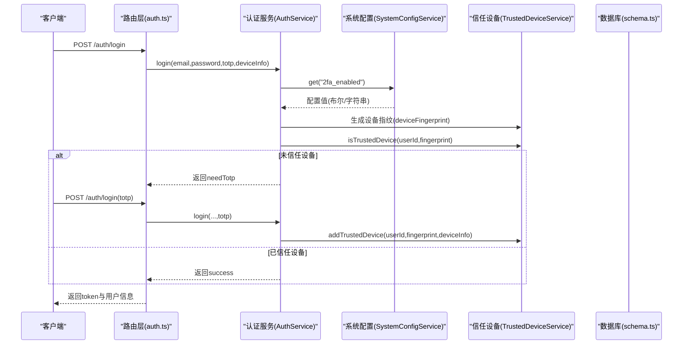
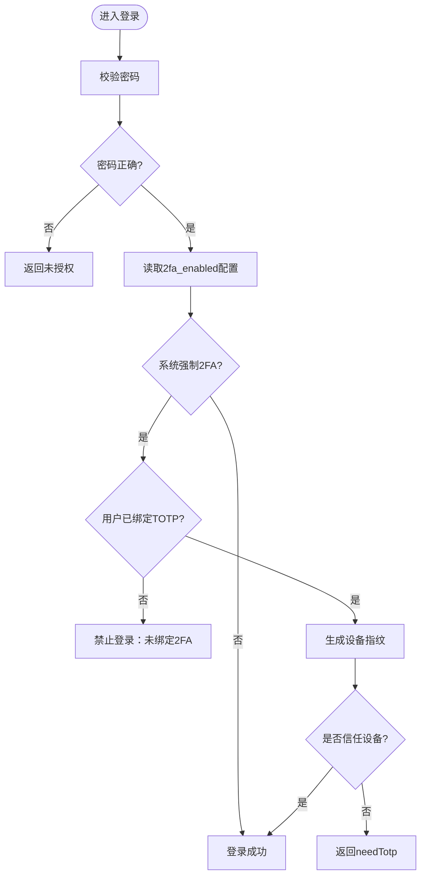
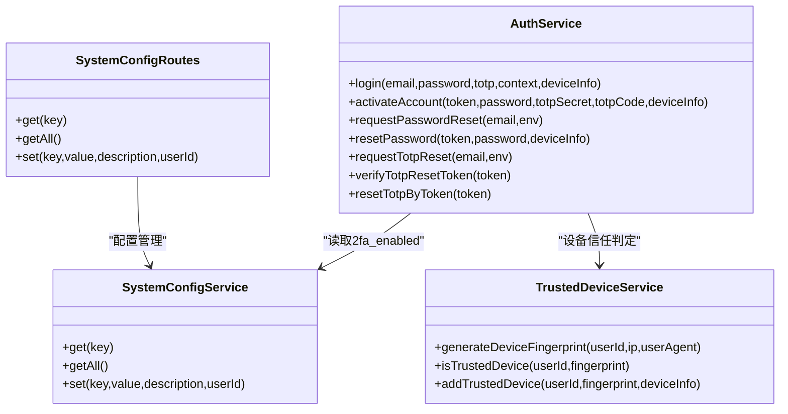

# 双因素认证配置

<cite>
**本文引用的文件**
- [AuthService.ts](file://backend/src/services/AuthService.ts)
- [SystemConfigService.ts](file://backend/src/services/SystemConfigService.ts)
- [auth.ts](file://backend/src/routes/v2/auth.ts)
- [system-config.ts](file://backend/src/routes/v2/system-config.ts)
- [schema.ts](file://backend/src/db/schema.ts)
- [TrustedDeviceService.ts](file://backend/src/services/TrustedDeviceService.ts)
- [LoginPage.tsx](file://frontend/src/features/auth/pages/LoginPage.tsx)
- [RequestTotpResetPage.tsx](file://frontend/src/features/auth/pages/RequestTotpResetPage.tsx)
- [ResetTotpConfirmPage.tsx](file://frontend/src/features/auth/pages/ResetTotpConfirmPage.tsx)
- [auth.test.ts](file://backend/test/services/AuthService.test.ts)
- [password_reset.test.ts](file://backend/test/services/password_reset.test.ts)
</cite>

## 目录
1. [简介](#简介)
2. [项目结构](#项目结构)
3. [核心组件](#核心组件)
4. [架构总览](#架构总览)
5. [详细组件分析](#详细组件分析)
6. [依赖关系分析](#依赖关系分析)
7. [性能与安全考量](#性能与安全考量)
8. [故障排查指南](#故障排查指南)
9. [结论](#结论)
10. [附录](#附录)

## 简介
本文件围绕系统级双因素认证（2FA）配置进行深入解析，重点阐述“2fa_enabled”系统配置项的控制机制与影响范围。内容涵盖：
- 系统级2FA开关的读取与默认策略
- AuthService如何通过SystemConfigService.get读取配置并应用到登录、激活、密码重置等流程
- 配置变更对账户激活、登录、密码重置等关键流程的影响
- 前端登录页面与TOTP重置流程的交互
- 配置管理的最佳实践与变更后的系统行为变化

## 项目结构
后端采用分层设计：路由层负责HTTP接口与限流，服务层封装业务逻辑（认证、系统配置、信任设备等），数据层通过Drizzle ORM访问SQLite（D1）。前端提供登录、TOTP重置等页面。

图表来源
- [auth.ts](file://backend/src/routes/v2/auth.ts#L81-L177)
- [AuthService.ts](file://backend/src/services/AuthService.ts#L34-L148)
- [SystemConfigService.ts](file://backend/src/services/SystemConfigService.ts#L9-L60)
- [TrustedDeviceService.ts](file://backend/src/services/TrustedDeviceService.ts#L14-L100)
- [schema.ts](file://backend/src/db/schema.ts#L3-L9)

章节来源
- [auth.ts](file://backend/src/routes/v2/auth.ts#L81-L177)
- [AuthService.ts](file://backend/src/services/AuthService.ts#L1-L148)
- [SystemConfigService.ts](file://backend/src/services/SystemConfigService.ts#L1-L60)
- [schema.ts](file://backend/src/db/schema.ts#L3-L9)

## 核心组件
- 系统配置服务（SystemConfigService）：提供键值配置的读取与更新能力，支持JSON反序列化以兼容布尔/字符串等多类型值。
- 认证服务（AuthService）：负责登录、激活、密码重置、TOTP重置等流程；在登录与激活阶段读取“2fa_enabled”配置并据此执行安全策略。
- 信任设备服务（TrustedDeviceService）：基于设备指纹（SHA-256）判断是否信任设备，支持90天有效期与自动续期。
- 路由层（auth.ts、system-config.ts）：暴露登录、激活、重置、系统配置等接口，包含鉴权与限流。
- 数据模型（schema.ts）：定义system_config、employees、trusted_devices等表结构。

章节来源
- [SystemConfigService.ts](file://backend/src/services/SystemConfigService.ts#L9-L60)
- [AuthService.ts](file://backend/src/services/AuthService.ts#L34-L148)
- [TrustedDeviceService.ts](file://backend/src/services/TrustedDeviceService.ts#L14-L100)
- [auth.ts](file://backend/src/routes/v2/auth.ts#L81-L177)
- [system-config.ts](file://backend/src/routes/v2/system-config.ts#L60-L110)
- [schema.ts](file://backend/src/db/schema.ts#L3-L9)

## 架构总览
系统级2FA开关通过SystemConfigService.get('2fa_enabled')读取，AuthService在登录与激活阶段根据该配置决定是否强制绑定TOTP、是否要求新设备验证TOTP等。信任设备机制降低后续登录的TOTP验证频率。

图表来源
- [auth.ts](file://backend/src/routes/v2/auth.ts#L81-L177)
- [AuthService.ts](file://backend/src/services/AuthService.ts#L34-L148)
- [SystemConfigService.ts](file://backend/src/services/SystemConfigService.ts#L9-L21)
- [TrustedDeviceService.ts](file://backend/src/services/TrustedDeviceService.ts#L14-L100)
- [schema.ts](file://backend/src/db/schema.ts#L118-L137)

## 详细组件分析

### 系统级2FA开关控制机制
- 读取与解析：SystemConfigService.get('2fa_enabled')返回配置对象，若value为字符串则尝试JSON.parse，兼容布尔与字符串两种写法。
- 默认策略：当配置不存在或为空时，AuthService将其视为“启用”。该策略确保在未明确配置时默认更强的安全性。
- 影响范围：登录与激活流程均会读取该配置，决定是否强制绑定TOTP以及是否要求新设备验证TOTP。

章节来源
- [AuthService.ts](file://backend/src/services/AuthService.ts#L78-L87)
- [SystemConfigService.ts](file://backend/src/services/SystemConfigService.ts#L9-L21)

### 登录流程中的2FA策略
- 密码校验通过后，AuthService读取2fa_enabled配置。
- 若系统强制2FA且用户未绑定TOTP，则拒绝登录并提示联系管理员重置后重新绑定。
- 若系统强制2FA且用户已绑定TOTP：
  - 生成设备指纹并检查是否信任设备；
  - 非信任设备需提供TOTP，TOTP错误则拒绝；
  - 验证通过后将设备加入信任列表（90天有效期）。

图表来源
- [AuthService.ts](file://backend/src/services/AuthService.ts#L73-L114)

章节来源
- [AuthService.ts](file://backend/src/services/AuthService.ts#L73-L114)

### 激活流程中的2FA策略
- 在激活账号时，AuthService同样读取2fa_enabled配置。
- 若系统强制2FA，必须提供TOTP密钥与一次性验证码，验证码错误则拒绝激活。
- 激活成功后，若启用2FA则绑定TOTP并自动登录。

章节来源
- [AuthService.ts](file://backend/src/services/AuthService.ts#L396-L410)
- [AuthService.ts](file://backend/src/services/AuthService.ts#L411-L443)

### 密码重置流程中的2FA策略
- 密码重置流程本身不直接依赖2fa_enabled，但登录后的行为受2FA影响。
- 后端登录处理器在登录成功后异步检查“email_notification_enabled”配置并发送登录通知邮件（与2FA无直接关联）。

章节来源
- [auth.ts](file://backend/src/routes/v2/auth.ts#L81-L177)
- [password_reset.test.ts](file://backend/test/services/password_reset.test.ts#L37-L63)

### 信任设备机制
- 设备指纹：基于用户ID、IP、User-Agent计算SHA-256，前缀标识+截断长度形成稳定指纹。
- 有效期：90天；过期自动清理并视为未信任。
- 新设备验证：非信任设备首次登录需提供TOTP；验证通过后加入信任列表并更新最后使用时间。

章节来源
- [TrustedDeviceService.ts](file://backend/src/services/TrustedDeviceService.ts#L14-L100)

### 前端交互
- 登录页：初次登录若返回needTotp，切换到TOTP验证步骤；TOTP错误时提示验证码错误或已失效。
- TOTP重置：提供“设备丢失？”入口，引导用户请求重置链接；确认页面验证链接有效性并允许用户确认重置。

章节来源
- [LoginPage.tsx](file://frontend/src/features/auth/pages/LoginPage.tsx#L1-L194)
- [RequestTotpResetPage.tsx](file://frontend/src/features/auth/pages/RequestTotpResetPage.tsx#L1-L91)
- [ResetTotpConfirmPage.tsx](file://frontend/src/features/auth/pages/ResetTotpConfirmPage.tsx#L1-L121)

## 依赖关系分析
- AuthService依赖SystemConfigService读取2fa_enabled，依赖TrustedDeviceService进行设备信任判定，依赖数据库schema.ts中的employees与trusted_devices表。
- 路由层auth.ts依赖AuthService完成登录、激活、重置等业务处理。
- system-config.ts提供系统配置的增删改查接口，供管理员在具备权限的情况下更新2fa_enabled。

图表来源
- [AuthService.ts](file://backend/src/services/AuthService.ts#L34-L148)
- [SystemConfigService.ts](file://backend/src/services/SystemConfigService.ts#L9-L60)
- [TrustedDeviceService.ts](file://backend/src/services/TrustedDeviceService.ts#L14-L100)
- [system-config.ts](file://backend/src/routes/v2/system-config.ts#L60-L110)

章节来源
- [AuthService.ts](file://backend/src/services/AuthService.ts#L34-L148)
- [SystemConfigService.ts](file://backend/src/services/SystemConfigService.ts#L9-L60)
- [system-config.ts](file://backend/src/routes/v2/system-config.ts#L60-L110)

## 性能与安全考量
- 性能
  - SystemConfigService.get使用单行查询，JSON.parse仅在value为字符串时触发，避免不必要的解析开销。
  - TrustedDeviceService的设备指纹计算使用Web Crypto API，适合Edge Runtime环境。
- 安全
  - 默认启用策略：当2fa_enabled缺失时按启用处理，提升整体安全性。
  - 信任设备有效期90天，过期自动失效，减少长期信任风险。
  - 登录失败与TOTP错误均返回统一错误码，避免信息泄露。
  - 密码重置与TOTP重置流程均采用一次性令牌与短时效（如30分钟），并记录审计日志。

章节来源
- [AuthService.ts](file://backend/src/services/AuthService.ts#L78-L114)
- [TrustedDeviceService.ts](file://backend/src/services/TrustedDeviceService.ts#L14-L100)
- [auth.ts](file://backend/src/routes/v2/auth.ts#L81-L177)

## 故障排查指南
- 登录时报错“账号未绑定2FA，请联系管理员重置后重新绑定”
  - 排查：确认2fa_enabled是否为true；确认用户是否已绑定TOTP（employees.totp_secret非空）。
  - 处理：引导用户完成TOTP绑定或联系管理员重置。
- 新设备登录提示需要TOTP
  - 排查：确认设备指纹是否在trusted_devices中；检查90天有效期是否过期。
  - 处理：提供TOTP验证；验证通过后自动加入信任设备。
- TOTP重置链接无效或已过期
  - 排查：确认KV中是否存在对应token；检查30分钟有效期。
  - 处理：重新发起请求重置链接；确认页面显示“无效链接”或“已过期”。

章节来源
- [AuthService.ts](file://backend/src/services/AuthService.ts#L78-L114)
- [TrustedDeviceService.ts](file://backend/src/services/TrustedDeviceService.ts#L32-L63)
- [auth.ts](file://backend/src/routes/v2/auth.ts#L573-L687)

## 结论
系统级2FA开关通过“2fa_enabled”配置实现集中控制，AuthService在登录与激活流程中严格遵循该策略，结合信任设备机制在保证安全的同时优化用户体验。默认启用策略确保系统在未显式配置时仍保持较高安全级别。管理员可通过系统配置接口灵活调整策略，前端提供完善的登录与TOTP重置交互流程。

## 附录

### 配置管理最佳实践
- 默认策略
  - 在未设置2fa_enabled时，默认启用2FA，确保最小权限下的安全基线。
- 权限与审计
  - 仅具备“system:config:update”权限的用户可修改2fa_enabled；所有变更均记录审计日志。
- 变更传播
  - 修改2fa_enabled后，立即影响后续登录与激活流程；历史会话不受影响，新设备仍需按策略验证。
- 前端提示
  - 登录页对needTotp与TOTP错误进行明确提示；TOTP重置流程提供清晰的引导与结果反馈。

章节来源
- [system-config.ts](file://backend/src/routes/v2/system-config.ts#L113-L181)
- [AuthService.ts](file://backend/src/services/AuthService.ts#L78-L114)
- [LoginPage.tsx](file://frontend/src/features/auth/pages/LoginPage.tsx#L1-L194)
- [RequestTotpResetPage.tsx](file://frontend/src/features/auth/pages/RequestTotpResetPage.tsx#L1-L91)
- [ResetTotpConfirmPage.tsx](file://frontend/src/features/auth/pages/ResetTotpConfirmPage.tsx#L1-L121)