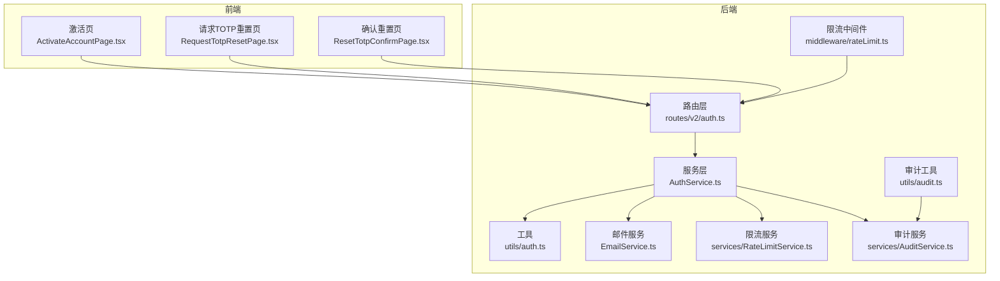
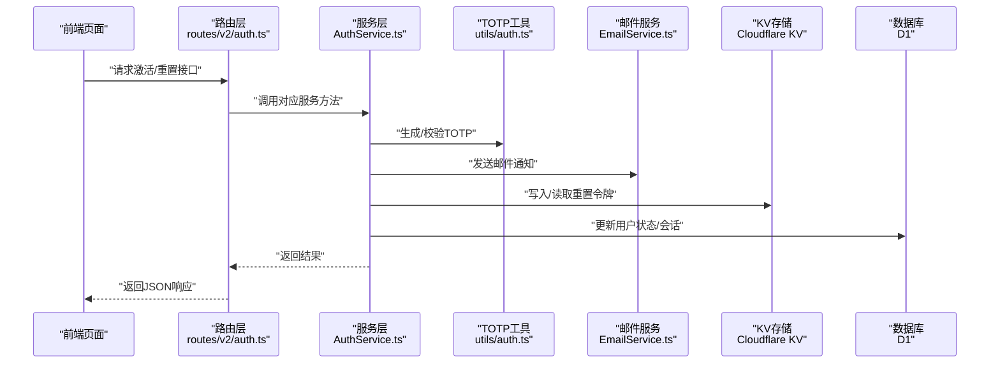
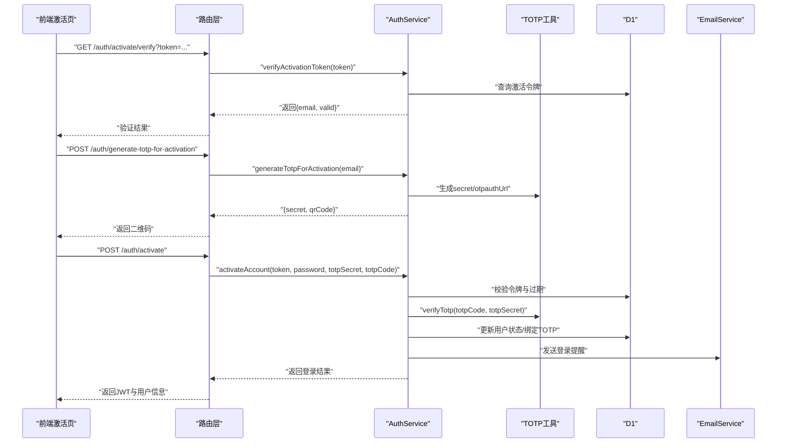
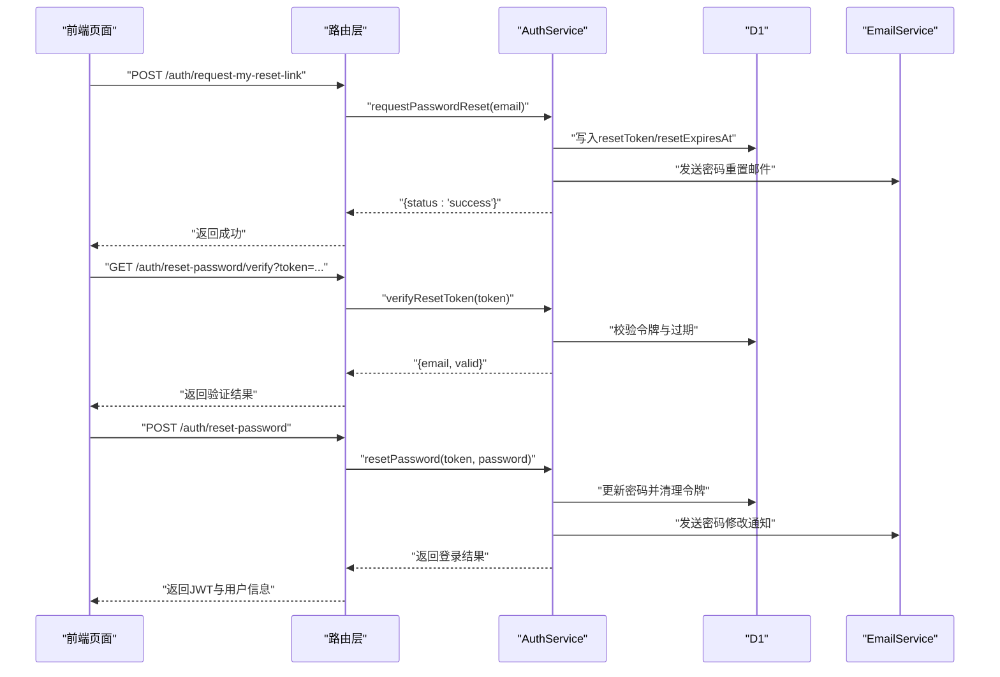
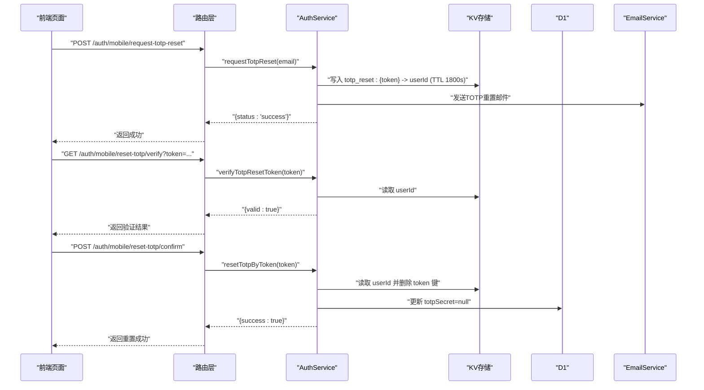
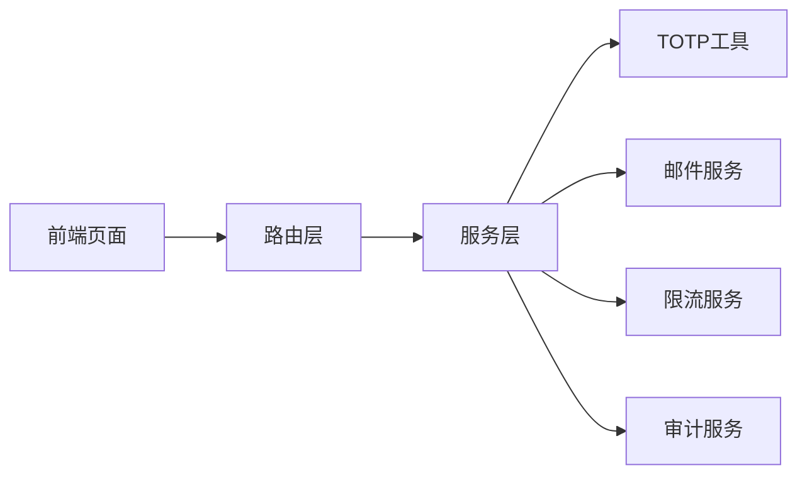

# 双因素认证集成流程

<cite>
**本文引用的文件**
- [AuthService.ts](file://backend/src/services/AuthService.ts)
- [auth.ts](file://backend/src/routes/v2/auth.ts)
- [auth.ts（前端）](file://frontend/src/features/auth/pages/ActivateAccountPage.tsx)
- [RequestTotpResetPage.tsx](file://frontend/src/features/auth/pages/RequestTotpResetPage.tsx)
- [ResetTotpConfirmPage.tsx](file://frontend/src/features/auth/pages/ResetTotpConfirmPage.tsx)
- [auth.ts（前端钩子）](file://frontend/src/hooks/index.ts)
- [EmailService.ts](file://backend/src/services/EmailService.ts)
- [auth.ts（TOTP工具）](file://backend/src/utils/auth.ts)
- [rateLimit.ts](file://backend/src/middleware/rateLimit.ts)
- [RateLimitService.ts](file://backend/src/services/RateLimitService.ts)
- [audit.ts](file://backend/src/utils/audit.ts)
- [AuditService.ts](file://backend/src/services/AuditService.ts)
</cite>

## 目录
1. [引言](#引言)
2. [项目结构与角色定位](#项目结构与角色定位)
3. [核心组件](#核心组件)
4. [架构总览](#架构总览)
5. [关键流程详解](#关键流程详解)
6. [依赖关系分析](#依赖关系分析)
7. [性能与安全特性](#性能与安全特性)
8. [故障排查指南](#故障排查指南)
9. [结论](#结论)

## 引言
本文件面向后端与前端工程师，系统性阐述双因素认证（2FA）在关键用户生命周期中的集成方案，覆盖以下场景：
- 账户激活：强制绑定TOTP并完成验证
- 密码重置：独立于2FA的密码变更流程
- TOTP重置：安全的离线设备丢失恢复流程

重点解析：
- activateAccount 方法中TOTP绑定的强制验证流程
- requestTotpReset 与 resetTotpByToken 的安全重置机制
- 安全控制：防止枚举攻击的静默处理、30分钟有效期的KV存储设计
- 前后端协同：OpenAPI路由、前端页面与服务层的配合

## 项目结构与角色定位
- 后端服务层：AuthService 提供登录、激活、密码重置、TOTP重置等核心能力；EmailService 负责发送各类通知邮件；RateLimitService 与限流中间件共同保障安全。
- 前端页面：激活页、请求TOTP重置页、确认重置页，负责引导用户完成TOTP绑定与重置。
- 中间件与工具：TOTP生成与校验工具、审计日志工具、限流中间件与服务。

图表来源
- [auth.ts](file://backend/src/routes/v2/auth.ts#L315-L687)
- [AuthService.ts](file://backend/src/services/AuthService.ts#L329-L494)
- [auth.ts（TOTP工具）](file://backend/src/utils/auth.ts#L1-L17)
- [EmailService.ts](file://backend/src/services/EmailService.ts#L335-L382)
- [rateLimit.ts](file://backend/src/middleware/rateLimit.ts#L1-L133)
- [RateLimitService.ts](file://backend/src/services/RateLimitService.ts#L1-L144)
- [audit.ts](file://backend/src/utils/audit.ts#L43-L89)
- [AuditService.ts](file://backend/src/services/AuditService.ts#L182-L228)

章节来源
- [auth.ts](file://backend/src/routes/v2/auth.ts#L315-L687)
- [AuthService.ts](file://backend/src/services/AuthService.ts#L329-L494)

## 核心组件
- AuthService：统一的认证与授权服务，包含登录、激活、密码重置、TOTP重置、会话管理、审计日志等。
- EmailService：封装邮件发送，支持激活、密码重置、TOTP重置、登录提醒等通知。
- RateLimitService 与限流中间件：对登录、密码重置、TOTP重置等敏感接口进行限流，降低暴力破解风险。
- utils/auth：TOTP密钥生成与校验工具。
- 前端页面：激活、请求TOTP重置、确认重置三类页面，串联用户操作链路。

章节来源
- [AuthService.ts](file://backend/src/services/AuthService.ts#L329-L494)
- [EmailService.ts](file://backend/src/services/EmailService.ts#L335-L382)
- [rateLimit.ts](file://backend/src/middleware/rateLimit.ts#L1-L133)
- [RateLimitService.ts](file://backend/src/services/RateLimitService.ts#L1-L144)
- [auth.ts（TOTP工具）](file://backend/src/utils/auth.ts#L1-L17)

## 架构总览
下图展示2FA在关键流程中的交互路径，从前端页面到后端路由、服务层、工具与外部存储。

图表来源
- [auth.ts](file://backend/src/routes/v2/auth.ts#L315-L687)
- [AuthService.ts](file://backend/src/services/AuthService.ts#L329-L494)
- [auth.ts（TOTP工具）](file://backend/src/utils/auth.ts#L1-L17)
- [EmailService.ts](file://backend/src/services/EmailService.ts#L335-L382)

## 关键流程详解

### 1. 账户激活：强制绑定TOTP并完成验证
- 前端流程
  - 用户访问激活链接，前端先调用验证激活令牌接口，确认令牌有效。
  - 选择设置密码后，前端请求生成激活专用TOTP接口，获得密钥与二维码。
  - 用户在TOTP应用扫码后，输入6位验证码，提交激活请求。
- 后端流程
  - verifyActivationToken：校验激活令牌有效性与过期时间。
  - generateTotpForActivation：生成TOTP密钥与二维码数据URL。
  - activateAccount：
    - 校验激活令牌与过期时间
    - 若系统启用2FA，则要求提供TOTP密钥与验证码
    - 校验TOTP验证码正确性
    - 激活用户、绑定TOTP、记录审计日志，并自动登录（携带刚验证的TOTP）

图表来源
- [auth.ts](file://backend/src/routes/v2/auth.ts#L315-L443)
- [AuthService.ts](file://backend/src/services/AuthService.ts#L349-L443)
- [auth.ts（TOTP工具）](file://backend/src/utils/auth.ts#L1-L17)
- [EmailService.ts](file://backend/src/services/EmailService.ts#L148-L192)

章节来源
- [auth.ts（前端）](file://frontend/src/features/auth/pages/ActivateAccountPage.tsx#L1-L308)
- [auth.ts](file://backend/src/routes/v2/auth.ts#L315-L443)
- [AuthService.ts](file://backend/src/services/AuthService.ts#L349-L443)

### 2. 密码重置：独立于2FA的密码变更流程
- 前端流程
  - 用户在登录页点击“2FA设备丢失？”跳转至请求TOTP重置页，输入邮箱并提交。
  - 后端发送重置邮件（含链接），用户收到邮件后点击链接进入确认页。
- 后端流程
  - requestPasswordReset：
    - 查找用户并生成重置令牌，设置1小时有效期
    - 发送密码重置邮件
    - 记录审计日志
  - verifyResetToken/resetPassword：
    - 校验令牌有效性与过期时间
    - 更新密码、清理重置令牌并自动登录

图表来源
- [auth.ts](file://backend/src/routes/v2/auth.ts#L445-L571)
- [AuthService.ts](file://backend/src/services/AuthService.ts#L229-L327)
- [EmailService.ts](file://backend/src/services/EmailService.ts#L249-L333)

章节来源
- [auth.ts](file://backend/src/routes/v2/auth.ts#L445-L571)
- [AuthService.ts](file://backend/src/services/AuthService.ts#L229-L327)

### 3. TOTP重置：安全的离线设备丢失恢复
- 前端流程
  - 用户在登录页点击“2FA设备丢失？”跳转至请求TOTP重置页，输入邮箱并提交。
  - 后端发送重置邮件（含链接），用户收到邮件后点击链接进入确认页。
  - 在确认页，用户点击“确认重置”，后端移除TOTP绑定并记录审计日志。
- 后端流程
  - requestTotpReset：
    - 静默返回成功（即使邮箱不存在），防止枚举攻击
    - 生成32位随机令牌，写入KV，键名格式为 totp_reset:{token}，TTL 1800秒（30分钟）
    - 发送TOTP重置邮件
    - 记录审计日志
  - verifyTotpResetToken：
    - 从KV读取用户ID，若不存在则抛出业务异常（无效或过期）
  - resetTotpByToken：
    - 从KV读取用户ID，若不存在则抛出业务异常（无效或过期）
    - 清理用户表中的totpSecret字段
    - 删除KV中的令牌键
    - 记录审计日志

图表来源
- [auth.ts](file://backend/src/routes/v2/auth.ts#L573-L687)
- [AuthService.ts](file://backend/src/services/AuthService.ts#L444-L494)
- [EmailService.ts](file://backend/src/services/EmailService.ts#L335-L382)

章节来源
- [auth.ts（前端）](file://frontend/src/features/auth/pages/RequestTotpResetPage.tsx#L1-L91)
- [auth.ts（前端）](file://frontend/src/features/auth/pages/ResetTotpConfirmPage.tsx#L1-L121)
- [auth.ts（前端钩子）](file://frontend/src/hooks/index.ts#L34-L34)
- [auth.ts](file://backend/src/routes/v2/auth.ts#L573-L687)
- [AuthService.ts](file://backend/src/services/AuthService.ts#L444-L494)
- [EmailService.ts](file://backend/src/services/EmailService.ts#L335-L382)

## 依赖关系分析
- 路由层依赖服务层：所有认证相关接口均委托给AuthService处理。
- 服务层依赖工具与外部组件：
  - utils/auth：TOTP生成与校验
  - EmailService：发送各类通知邮件
  - RateLimitService 与限流中间件：对敏感接口进行限流
  - AuditService 与审计工具：记录登录、激活、重置、TOTP重置等事件
- 前端页面通过OpenAPI路由与服务层交互，页面逻辑负责用户体验与错误提示。

图表来源
- [auth.ts](file://backend/src/routes/v2/auth.ts#L315-L687)
- [AuthService.ts](file://backend/src/services/AuthService.ts#L329-L494)
- [auth.ts（TOTP工具）](file://backend/src/utils/auth.ts#L1-L17)
- [EmailService.ts](file://backend/src/services/EmailService.ts#L335-L382)
- [RateLimitService.ts](file://backend/src/services/RateLimitService.ts#L1-L144)
- [audit.ts](file://backend/src/utils/audit.ts#L43-L89)
- [AuditService.ts](file://backend/src/services/AuditService.ts#L182-L228)

章节来源
- [auth.ts](file://backend/src/routes/v2/auth.ts#L315-L687)
- [AuthService.ts](file://backend/src/services/AuthService.ts#L329-L494)

## 性能与安全特性
- 静默处理与防枚举
  - requestPasswordReset 与 requestTotpReset 对不存在的邮箱均返回成功，避免泄露用户存在性。
  - 前端在请求TOTP重置页时，即使后端返回“not_found”也会提示“成功”，进一步降低枚举风险。
- 令牌有效期与KV存储
  - TOTP重置令牌写入KV，键名 totp_reset:{token}，TTL 1800秒（30分钟）。
  - verifyTotpResetToken 与 resetTotpByToken 从KV读取用户ID，若为空则视为无效或过期。
- 限流策略
  - 登录：每IP每分钟最多5次
  - 密码重置：每IP每小时最多3次
  - TOTP重置请求：每邮箱每小时最多3次
  - 限流中间件在请求头中返回X-RateLimit-*与Retry-After，便于前端友好提示。
- 审计日志
  - 涉及登录、激活、密码重置、TOTP重置等关键动作均记录审计日志，包含IP、时间戳等信息，便于追踪与合规。

章节来源
- [AuthService.ts](file://backend/src/services/AuthService.ts#L229-L327)
- [AuthService.ts](file://backend/src/services/AuthService.ts#L444-L494)
- [rateLimit.ts](file://backend/src/middleware/rateLimit.ts#L1-L133)
- [RateLimitService.ts](file://backend/src/services/RateLimitService.ts#L1-L144)
- [audit.ts](file://backend/src/utils/audit.ts#L43-L89)
- [AuditService.ts](file://backend/src/services/AuditService.ts#L182-L228)

## 故障排查指南
- 激活失败
  - 检查激活令牌是否有效且未过期
  - 确认TOTP验证码是否正确
  - 确认系统是否启用2FA且前端已正确生成TOTP密钥与二维码
- TOTP重置无效或过期
  - 检查邮件中的链接是否在30分钟内打开
  - 确认KV中是否存在 totp_reset:{token} 键
  - 查看审计日志确认是否已执行重置
- 登录失败
  - 检查是否为新设备且需要TOTP验证
  - 确认限流是否触发（查看响应头X-RateLimit-*与Retry-After）
- 邮件未送达
  - 检查邮件服务配置与TOKEN
  - 确认收件箱与垃圾箱

章节来源
- [AuthService.ts](file://backend/src/services/AuthService.ts#L349-L443)
- [AuthService.ts](file://backend/src/services/AuthService.ts#L444-L494)
- [rateLimit.ts](file://backend/src/middleware/rateLimit.ts#L1-L133)
- [EmailService.ts](file://backend/src/services/EmailService.ts#L148-L192)

## 结论
本方案通过严格的前后端协作与多重安全控制，实现了2FA在关键用户生命周期中的无缝集成：
- 激活阶段强制绑定TOTP，确保新用户具备强身份凭证
- 密码重置流程与2FA解耦，保障用户可独立变更密码
- TOTP重置流程采用静默处理与30分钟有效期的KV令牌，兼顾安全性与可用性
- 限流与审计贯穿全流程，有效抵御暴力破解与滥用风险