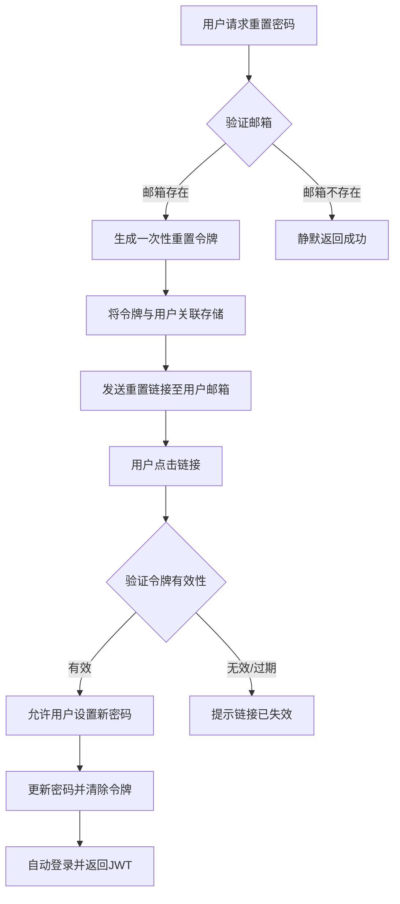
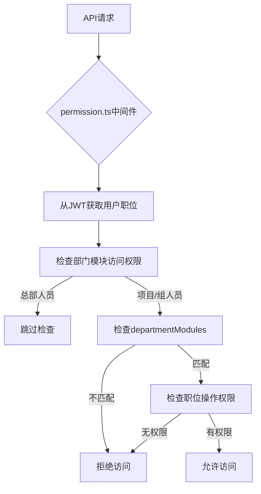

# 安全与认证

<cite>
**本文档引用的文件**   
- [gen_totp.ts](file://backend/gen_totp.ts)
- [ipWhitelist.ts](file://backend/src/middleware/ipWhitelist.ts)
- [rateLimit.ts](file://backend/src/middleware/rateLimit.ts)
- [security.ts](file://backend/src/middleware/security.ts)
- [auth.ts](file://backend/src/routes/v2/auth.ts)
- [jwt.ts](file://backend/src/utils/jwt.ts)
- [AuthService.ts](file://backend/src/services/AuthService.ts)
- [permission.ts](file://backend/src/middleware/permission.ts)
- [position-permissions.ts](file://backend/src/routes/v2/position-permissions.ts)
- [permissions.ts](file://backend/src/utils/permissions.ts)
- [IPWhitelistService.ts](file://backend/src/services/IPWhitelistService.ts)
- [RateLimitService.ts](file://backend/src/services/RateLimitService.ts)
- [auth.test.ts](file://backend/test/routes/v2/auth.test.ts)
</cite>

## 目录
1. [简介](#简介)
2. [会话管理与JWT认证](#会话管理与jwt认证)
3. [双因素认证（TOTP）](#双因素认证totp)
4. [密码重置与账户激活](#密码重置与账户激活)
5. [基于角色的访问控制（RBAC）](#基于角色的访问控制rbac)
6. [IP白名单机制](#ip白名单机制)
7. [请求频率限制](#请求频率限制)
8. [安全响应头](#安全响应头)
9. [安全审计与日志追踪](#安全审计与日志追踪)
10. [潜在漏洞与防范建议](#潜在漏洞与防范建议)

## 简介
本专项文档深入解析财务系统的多层次安全与认证机制。系统采用基于JWT的会话管理，结合TOTP双因素认证、IP白名单、请求频率限制等多重防护措施，构建了全面的安全防护体系。核心安全功能由`auth.ts`、`ipWhitelist.ts`、`rateLimit.ts`等中间件和`AuthService`、`IPWhitelistService`等服务类实现，通过Hono框架的中间件链进行统一处理。系统还实现了基于职位的RBAC权限模型，精确控制API访问权限，并通过安全头设置和敏感数据加密保障通信安全。

## 会话管理与JWT认证
系统采用基于JWT（JSON Web Token）的无状态会话管理机制，替代传统的服务器端会话存储。用户登录成功后，服务端生成一个包含用户信息的JWT令牌，该令牌作为后续请求的身份凭证。

会话管理的核心流程如下：
1.  **登录与令牌生成**：用户通过`/auth/login`接口提交凭据。认证服务`AuthService`验证用户名和密码后，调用`signAuthToken`函数生成JWT。令牌的有效期为7天，与数据库中的会话记录过期时间一致。
2.  **令牌存储与传输**：生成的JWT通过`caiwu_auth` Cookie或`Authorization` Bearer头返回给客户端。客户端在后续请求中携带此令牌。
3.  **令牌验证**：每次请求到达时，`jwt.ts`中的`verifyAuthToken`函数负责解析和验证JWT的签名、有效期等。验证通过后，用户信息被注入到请求上下文中，供后续业务逻辑使用。
4.  **单点登录（SSO）**：系统实现了单点登录。当用户创建新会话时，`AuthService`会删除该用户在数据库和KV存储中的所有旧会话，确保同一时间只有一个活跃会话。
5.  **登出**：用户登出时，`/auth/logout`接口会同时从KV存储和数据库中删除对应的会话记录，使令牌立即失效。

该机制结合了D1数据库的持久化备份和KV存储的高性能缓存，既保证了数据的可靠性，又提升了会话验证的效率。

**Section sources**
- [auth.ts](file://backend/src/routes/v2/auth.ts#L82-L143)
- [jwt.ts](file://backend/src/utils/jwt.ts#L72-L124)
- [AuthService.ts](file://backend/src/services/AuthService.ts#L149-L198)

## 双因素认证（TOTP）
系统实现了基于TOTP（基于时间的一次性密码）的双因素认证（2FA），显著提升了账户安全性。TOTP的实现流程主要在`gen_totp.ts`、`auth.ts`和`AuthService.ts`中完成。

### TOTP实现流程
```mermaid
sequenceDiagram
participant 前端 as 前端 (React)
participant 后端 as 后端 (Hono)
participant KV as KV存储
participant 数据库 as D1数据库
前端->>后端 : POST /auth/generate-totp-for-activation
后端->>AuthService : generateTotpForActivation(email)
AuthService->>auth.ts : generateTotpSecret(email)
auth.ts-->>AuthService : 返回 secret 和 otpauthUrl
AuthService->>QRCode : 生成SVG格式的QR码
QRCode-->>AuthService : 返回 data : image/svg+xml;base64,...
AuthService-->>后端 : {secret, qrCode}
后端-->>前端 : 返回密钥和二维码
前端->>后端 : POST /auth/activate
后端->>AuthService : activateAccount(token, password, totpSecret, totpCode)
AuthService->>auth.ts : verifyTotp(totpCode, totpSecret)
auth.ts-->>AuthService : 验证结果
alt 验证成功
AuthService->>数据库 : 更新用户记录，存储totpSecret
数据库-->>AuthService : 更新成功
AuthService->>AuthService : 调用login()自动登录
AuthService-->>后端 : 登录成功响应
后端-->>前端 : JWT令牌
else 验证失败
AuthService-->>后端 : 抛出"验证码错误"异常
后端-->>前端 : 401错误
end
```

**Diagram sources**
- [gen_totp.ts](file://backend/gen_totp.ts#L1-L5)
- [auth.ts](file://backend/src/routes/v2/auth.ts#L348-L443)
- [AuthService.ts](file://backend/src/services/AuthService.ts#L329-L443)
- [auth.ts](file://backend/src/utils/auth.ts#L4-L17)

### TOTP重置流程
当用户丢失2FA设备时，可通过邮箱重置。流程如下：
1.  用户在前端请求重置，输入邮箱。
2.  后端调用`requestTotpReset`，生成一个一次性令牌（Token），并将其与用户ID关联存储在KV中，有效期30分钟。
3.  系统向用户邮箱发送包含重置链接的邮件。
4.  用户点击链接后，前端调用`verifyTotpResetToken`验证链接有效性。
5.  验证通过后，用户可进入重置流程，`resetTotpByToken`会清除数据库中该用户的`totpSecret`，使其下次登录时无需2FA，从而可以重新绑定。

**Section sources**
- [AuthService.ts](file://backend/src/services/AuthService.ts#L444-L493)
- [auth.ts](file://backend/src/routes/v2/auth.ts#L573-L685)

## 密码重置与账户激活
系统提供了安全的密码重置和新用户账户激活流程，均通过邮箱验证来确保操作者的身份。

### 密码重置流程


**Diagram sources**
- [AuthService.ts](file://backend/src/services/AuthService.ts#L229-L327)
- [auth.ts](file://backend/src/routes/v2/auth.ts#L478-L528)

### 账户激活流程
新员工入职时，管理员会创建账户并生成激活链接。
1.  系统生成一个唯一的激活令牌（`activationToken`），并与用户记录关联，设置1小时过期时间。
2.  激活链接通过邮件发送给新员工。
3.  新员工访问链接，前端调用`verifyActivationToken`验证链接。
4.  验证通过后，用户进入激活页面，需设置初始密码并绑定TOTP（如果2FA已启用）。
5.  提交后，`activateAccount`服务会激活账户，存储密码哈希和TOTP密钥，并自动登录用户。

**Section sources**
- [AuthService.ts](file://backend/src/services/AuthService.ts#L349-L443)
- [auth.ts](file://backend/src/routes/v2/auth.ts#L315-L443)

## 基于角色的访问控制（RBAC）
系统采用基于职位的RBAC（Role-Based Access Control）模型，通过`position-permissions.ts`和`permission.ts`中间件精确控制API访问权限。

### RBAC权限模型
权限控制的核心是`Position`（职位）实体，其包含一个`permissions` JSON字段，定义了该职位在各个模块和子模块上的操作权限。例如：
```json
{
  "hr": {
    "employee": ["view", "create", "update"],
    "leave": ["view", "approve"]
  },
  "finance": {
    "flow": ["view", "create"]
  }
}
```

### 权限验证流程


1.  **中间件拦截**：每个受保护的API路由都应用了`requirePermission`中间件，指定了所需的模块、子模块和操作（如`finance`, `flow`, `create`）。
2.  **权限检查**：`hasPermission`函数首先检查用户职位所属的部门是否允许访问该模块（通过`departmentModules`字段），然后检查职位的`permissions`配置中是否包含指定的操作。
3.  **数据访问控制**：除了API级别的权限，`permissions.ts`还提供了`getDataAccessFilter`函数，根据用户职位层级（总部、项目、组）动态生成SQL查询的WHERE条件，实现数据层面的隔离。例如，项目专员只能查看本项目的数据。

**Section sources**
- [permission.ts](file://backend/src/middleware/permission.ts#L12-L43)
- [position-permissions.ts](file://backend/src/routes/v2/position-permissions.ts#L53-L252)
- [permissions.ts](file://backend/src/utils/permissions.ts#L99-L273)

## IP白名单机制
系统集成了Cloudflare的IP白名单功能，通过`ipWhitelist.ts`中间件和`IPWhitelistService.ts`服务实现，用于限制对敏感接口的访问。

### 工作原理
1.  **配置与状态**：IP列表和规则的启用状态存储在Cloudflare的Lists和Rulesets中。`IPWhitelistService`提供增删改查的API。
2.  **中间件逻辑**：`createIPWhitelistMiddleware`是核心中间件。
    *   **健康检查放行**：`/api/health`和`/api/version`等健康检查接口始终放行。
    *   **获取客户端IP**：从`CF-Connecting-IP`头获取真实IP。
    *   **缓存策略**：为了性能，中间件使用内存缓存（`cachedIPs`）存储IP列表和规则状态，有效期1分钟，避免每次请求都调用Cloudflare API。
    *   **访问控制**：如果规则启用，中间件检查客户端IP是否在白名单中。若不在，则返回403 Forbidden。

该机制利用Cloudflare的边缘网络能力，将访问控制提前到网络边缘，有效抵御来自非授权IP的攻击。

**Section sources**
- [ipWhitelist.ts](file://backend/src/middleware/ipWhitelist.ts#L12-L76)
- [IPWhitelistService.ts](file://backend/src/services/IPWhitelistService.ts#L1-L141)

## 请求频率限制
为防止暴力破解和DDoS攻击，系统实现了基于KV存储的请求频率限制，主要通过`rateLimit.ts`中间件和`RateLimitService.ts`服务实现。

### 限流策略
系统定义了多种限流规则，常量定义在`RATE_LIMITS`中：
*   **登录限流**：每IP每分钟最多5次登录尝试。
*   **密码重置**：每IP每小时最多3次重置请求。
*   **TOTP重置**：每邮箱每小时最多3次重置请求。
*   **通用API**：每用户每分钟100次，每IP每分钟200次。

### 实现机制
`RateLimitService`采用滑动窗口算法：
1.  **检查**：`checkLimit`方法从KV中获取指定键（如`login:ip:1.2.3.4`）的请求时间戳列表，过滤掉窗口外的旧请求，计算剩余次数。
2.  **记录**：`recordRequest`方法将当前时间戳添加到列表中，并更新KV，设置TTL为窗口时间的两倍。
3.  **合并操作**：`checkAndRecord`方法将检查和记录合并，确保原子性。
4.  **中间件应用**：`createRateLimitMiddleware`工厂函数创建具体的限流中间件，并应用到相应的路由上，如`authRoutes.use('/auth/login', loginRateLimit)`。

**Section sources**
- [rateLimit.ts](file://backend/src/middleware/rateLimit.ts#L21-L134)
- [RateLimitService.ts](file://backend/src/services/RateLimitService.ts#L15-L104)
- [auth.ts](file://backend/src/routes/v2/auth.ts#L176-L177)

## 安全响应头
系统通过`security.ts`中间件设置了一系列安全相关的HTTP响应头，以防范常见的Web攻击。

### 关键安全头
*   **X-Content-Type-Options: nosniff**：防止浏览器进行MIME类型嗅探，避免执行被伪装成图片的恶意脚本。
*   **X-Frame-Options: DENY**：防止页面被嵌入到`<iframe>`中，抵御点击劫持（Clickjacking）攻击。
*   **X-XSS-Protection: 1; mode=block**：启用浏览器内置的XSS过滤器。
*   **Strict-Transport-Security (HSTS)**：强制浏览器使用HTTPS连接，防止SSL剥离攻击。
*   **Content-Security-Policy (CSP)**：定义了严格的资源加载策略，只允许加载同源、Cloudflare CDN等可信来源的脚本、样式和图片，有效防止XSS攻击。
*   **Permissions-Policy**：禁用不必要且可能被滥用的浏览器功能，如地理位置、麦克风、摄像头等。

这些安全头在`securityHeaders`中间件中设置，为应用提供了基础的纵深防御。

**Section sources**
- [security.ts](file://backend/src/middleware/security.ts#L19-L81)

## 安全审计与日志追踪
系统具备完善的安全审计功能，所有关键操作都会被记录，便于追踪和调查。

### 审计日志
*   **记录点**：`AuditService`会在用户登录、登出、密码重置、账户激活、权限变更等关键操作后记录日志。
*   **日志内容**：日志包含操作者ID、操作类型、目标资源、操作详情（JSON格式）、IP地址等信息，存储在D1数据库的`audit_logs`表中。
*   **追踪方法**：管理员可通过`/audit`相关API或前端的审计日志页面，根据时间、用户、操作类型等条件查询日志。

### 信任设备
系统还实现了信任设备功能。当用户在新设备上首次登录并成功验证TOTP后，该设备的指纹（基于IP和User-Agent生成）会被记录。下次登录时，如果是信任设备，则无需再次验证TOTP，提升了用户体验。

**Section sources**
- [AuthService.ts](file://backend/src/services/AuthService.ts#L130-L140)
- [AuthService.ts](file://backend/src/services/AuthService.ts#L313-L320)
- [AuthService.ts](file://backend/src/services/AuthService.ts#L429-L436)

## 潜在漏洞与防范建议
尽管系统已具备多层防护，但仍需警惕潜在风险：

1.  **JWT密钥安全**：`AUTH_JWT_SECRET`是系统安全的核心，必须严格保密。建议使用Cloudflare的Secrets功能存储，并定期轮换。
2.  **TOTP密钥泄露**：TOTP密钥在绑定过程中会以明文形式在前端短暂存在。应确保传输过程使用HTTPS，并在绑定成功后立即清除前端的密钥显示。
3.  **缓存失效风险**：IP白名单中间件使用内存缓存，若缓存刷新失败，可能导致安全策略失效。应加强错误日志监控，并考虑在缓存失效时采取更严格的“拒绝”策略。
4.  **权限配置错误**：RBAC的权限是通过JSON配置的，手动配置容易出错。建议开发一个可视化的权限管理界面，并增加配置的校验和测试。
5.  **依赖库漏洞**：定期更新`otplib`、`bcryptjs`等第三方库，关注其安全公告。

通过持续监控、定期安全审计和及时更新，可以最大限度地保障系统的安全稳定运行。