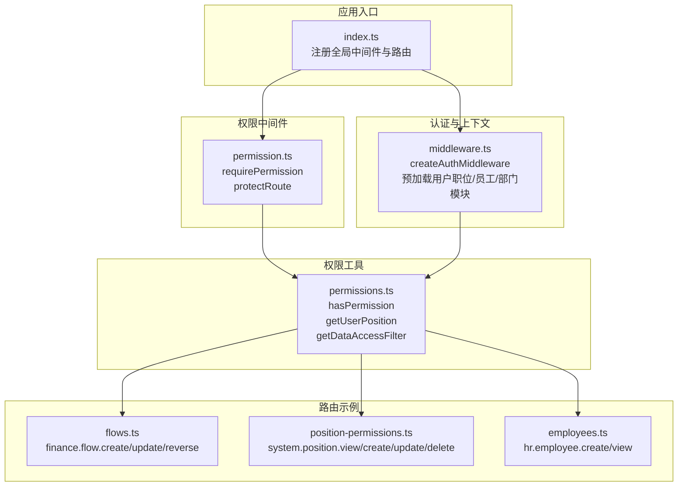
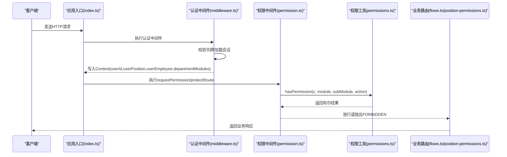
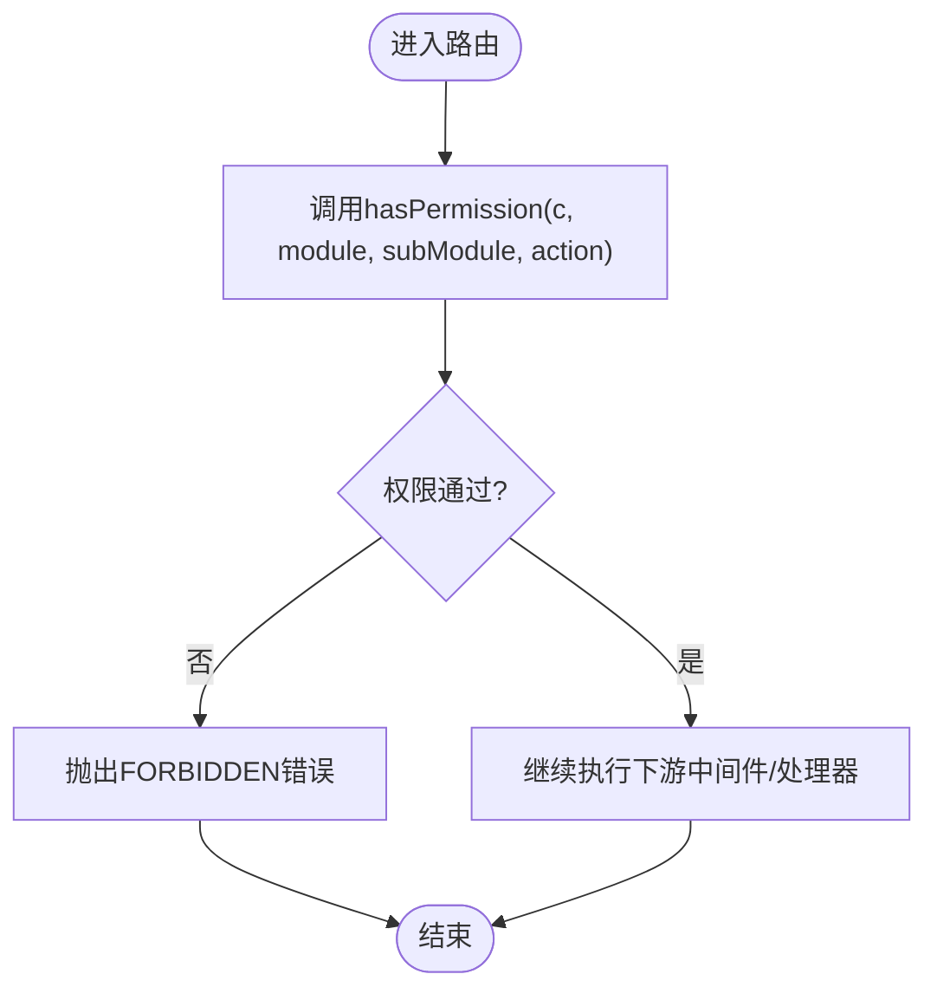
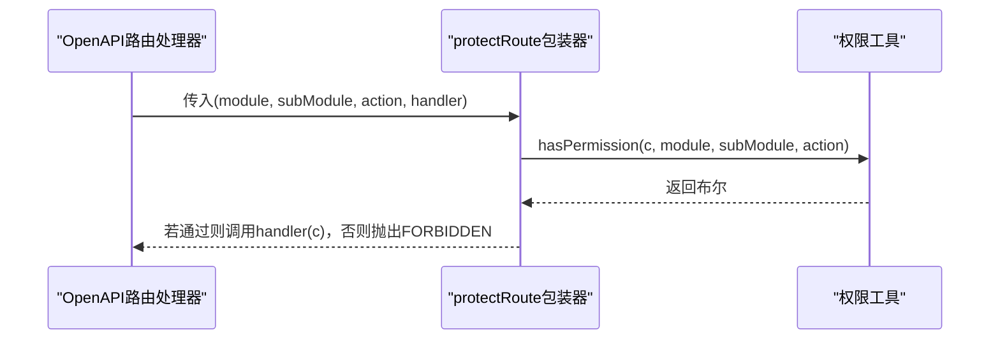
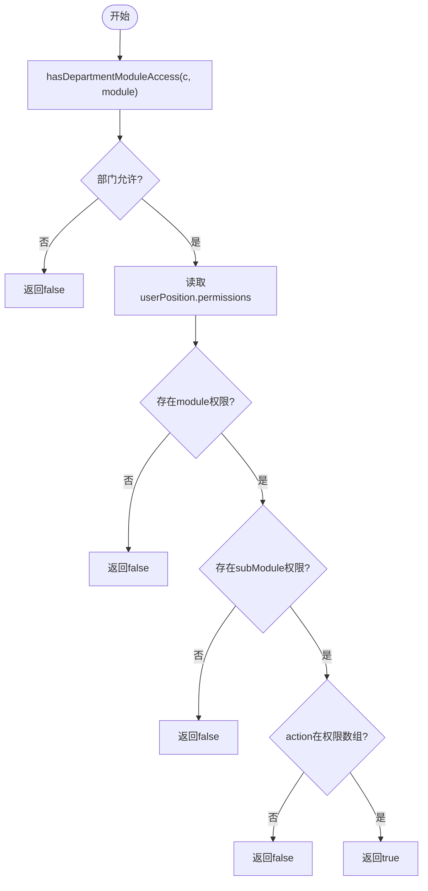
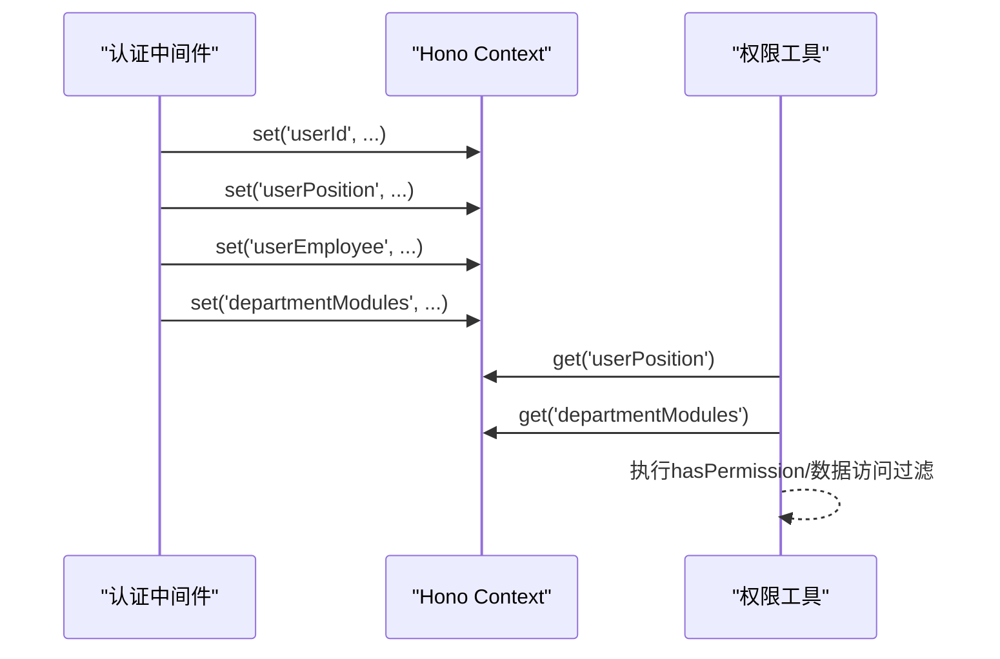
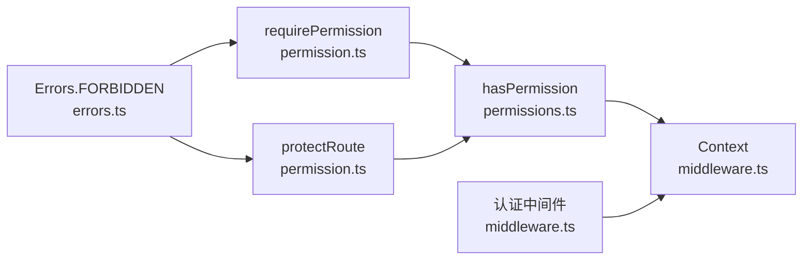

# RBAC中间件实现

<cite>
**本文引用的文件**
- [permission.ts](file://backend/src/middleware/permission.ts)
- [permissions.ts](file://backend/src/utils/permissions.ts)
- [errors.ts](file://backend/src/utils/errors.ts)
- [index.ts](file://backend/src/index.ts)
- [middleware.ts](file://backend/src/middleware.ts)
- [flows.ts](file://backend/src/routes/v2/flows.ts)
- [position-permissions.ts](file://backend/src/routes/v2/position-permissions.ts)
- [employees.ts](file://backend/src/routes/v2/employees.ts)
- [route-helpers.ts](file://backend/src/utils/route-helpers.ts)
- [RBAC.test.ts](file://backend/test/services/RBAC.test.ts)
</cite>

## 目录
1. [引言](#引言)
2. [项目结构](#项目结构)
3. [核心组件](#核心组件)
4. [架构总览](#架构总览)
5. [详细组件分析](#详细组件分析)
6. [依赖关系分析](#依赖关系分析)
7. [性能考量](#性能考量)
8. [故障排查指南](#故障排查指南)
9. [结论](#结论)
10. [附录](#附录)

## 引言
本文件深入解析RBAC（基于角色的访问控制）中间件的实现机制，重点围绕两个核心函数：
- requirePermission：作为Hono中间件拦截请求并调用hasPermission进行权限验证，权限不足时抛出FORBIDDEN异常。
- protectRoute：为OpenAPI路由提供权限保护包装，其与requirePermission在职责和使用场景上存在异同。

文档将结合代码示例，说明如何在API路由中使用这两个函数进行模块（如'finance'）、子模块（如'flow'）和操作（如'create'）三级权限控制；同时阐述中间件如何从Context中获取用户职位信息并传递给权限检查函数，并给出实际路由配置示例。

## 项目结构
RBAC相关代码主要分布在以下位置：
- 中间件层：permission.ts 提供requirePermission和protectRoute
- 权限工具层：permissions.ts 提供hasPermission、getUserPosition、getUserEmployee、getDataAccessFilter等
- 错误处理：errors.ts 提供统一错误类型（包括FORBIDDEN）
- 应用入口：index.ts 注册中间件链，挂载各路由
- 认证中间件：middleware.ts 在进入业务路由前预加载用户职位、员工、部门模块等上下文信息
- 路由示例：flows.ts、position-permissions.ts、employees.ts 展示了hasPermission与requirePermission的典型用法

图表来源
- [index.ts](file://backend/src/index.ts#L305-L348)
- [middleware.ts](file://backend/src/middleware.ts#L15-L111)
- [permission.ts](file://backend/src/middleware/permission.ts#L1-L43)
- [permissions.ts](file://backend/src/utils/permissions.ts#L99-L125)
- [flows.ts](file://backend/src/routes/v2/flows.ts#L358-L426)
- [position-permissions.ts](file://backend/src/routes/v2/position-permissions.ts#L131-L150)
- [employees.ts](file://backend/src/routes/v2/employees.ts#L184-L200)

章节来源
- [index.ts](file://backend/src/index.ts#L305-L348)
- [middleware.ts](file://backend/src/middleware.ts#L15-L111)
- [permission.ts](file://backend/src/middleware/permission.ts#L1-L43)
- [permissions.ts](file://backend/src/utils/permissions.ts#L99-L125)

## 核心组件
- requirePermission：Hono中间件工厂函数，接收模块、子模块、操作三元组，对每个进入的请求调用hasPermission进行验证，失败则抛出FORBIDDEN错误。
- protectRoute：OpenAPI路由包装器，接收模块、子模块、操作与原始处理器，先做权限检查再调用处理器。
- hasPermission：权限判定核心，按“部门模块白名单”与“职位权限JSON”的交集进行判断，支持通配符匹配与总部豁免。
- 上下文预加载：认证中间件在进入业务路由前，将userId、userPosition、userEmployee、departmentModules写入Context，供权限工具读取。

章节来源
- [permission.ts](file://backend/src/middleware/permission.ts#L12-L42)
- [permissions.ts](file://backend/src/utils/permissions.ts#L63-L89)
- [permissions.ts](file://backend/src/utils/permissions.ts#L99-L125)
- [middleware.ts](file://backend/src/middleware.ts#L64-L108)

## 架构总览
RBAC在请求生命周期中的关键流程如下：
- 请求进入：全局中间件链（请求ID、安全头、性能监控、CORS、速率限制、认证、DI）按顺序执行。
- 认证中间件：从Authorization/Cookie提取令牌，验证后从KV/D1加载会话，写入userId、userPosition、userEmployee、departmentModules。
- 权限中间件：requirePermission或protectRoute读取Context中的用户职位与部门模块，调用hasPermission进行判定。
- 业务路由：根据权限结果决定放行或抛出错误；错误由全局错误处理器统一返回。

图表来源
- [index.ts](file://backend/src/index.ts#L312-L316)
- [middleware.ts](file://backend/src/middleware.ts#L15-L111)
- [permission.ts](file://backend/src/middleware/permission.ts#L12-L42)
- [permissions.ts](file://backend/src/utils/permissions.ts#L99-L125)
- [flows.ts](file://backend/src/routes/v2/flows.ts#L358-L426)
- [position-permissions.ts](file://backend/src/routes/v2/position-permissions.ts#L131-L150)

## 详细组件分析

### requirePermission中间件
- 设计要点
  - 作为Hono中间件，拦截请求并在next之前执行权限检查。
  - 调用hasPermission进行三元组校验，失败即抛出FORBIDDEN错误。
  - 适合对整条路由链路进行统一保护。
- 典型用法
  - 在路由注册处将requirePermission作为中间件加入，例如在flows路由中对特定端点使用。
- 与protectRoute的异同
  - 相同：都基于hasPermission进行权限判定。
  - 不同：requirePermission是中间件，作用于整个路由链；protectRoute是处理器包装器，作用于单个OpenAPI路由处理器。

图表来源
- [permission.ts](file://backend/src/middleware/permission.ts#L12-L19)
- [permissions.ts](file://backend/src/utils/permissions.ts#L99-L125)

章节来源
- [permission.ts](file://backend/src/middleware/permission.ts#L12-L19)

### protectRoute包装器
- 设计要点
  - 接收模块、子模块、操作与原始处理器，返回一个新的异步处理器。
  - 在调用原始处理器前先做权限检查，失败同样抛出FORBIDDEN。
- 典型用法
  - 在OpenAPI路由中通过protectRoute包装处理器，适用于需要细粒度控制的端点。
- 与requirePermission的异同
  - 相同：均基于hasPermission进行判定。
  - 不同：protectRoute更轻量，适合单个处理器的保护；requirePermission适合整条路由链。

图表来源
- [permission.ts](file://backend/src/middleware/permission.ts#L29-L42)
- [permissions.ts](file://backend/src/utils/permissions.ts#L99-L125)

章节来源
- [permission.ts](file://backend/src/middleware/permission.ts#L29-L42)

### hasPermission权限判定逻辑
- 判定步骤
  1) 部门模块白名单检查：总部人员(level=1)跳过；否则检查departmentModules是否允许该模块（支持通配符）。
  2) 职位权限检查：从userPosition.permissions读取对应模块与子模块的权限数组，判断是否包含目标操作。
- 关键特性
  - 支持模块通配符匹配（如'finance.*'）。
  - 总部人员不受部门模块限制。
  - 返回false的情况包括：缺少上下文、部门不允许、模块/子模块缺失、操作不在权限数组。

图表来源
- [permissions.ts](file://backend/src/utils/permissions.ts#L63-L89)
- [permissions.ts](file://backend/src/utils/permissions.ts#L99-L125)

章节来源
- [permissions.ts](file://backend/src/utils/permissions.ts#L63-L89)
- [permissions.ts](file://backend/src/utils/permissions.ts#L99-L125)

### 上下文预加载与用户信息获取
- 认证中间件在进入业务路由前，从会话中读取用户信息并写入Context：
  - userId、sessionId
  - userPosition（含permissions、level、canManageSubordinates等）
  - userEmployee（含departmentId、orgDepartmentId等）
  - departmentModules（部门允许访问的模块白名单）
- 权限工具通过Context读取上述信息，完成权限判定与数据访问范围控制。

图表来源
- [middleware.ts](file://backend/src/middleware.ts#L64-L108)
- [permissions.ts](file://backend/src/utils/permissions.ts#L29-L55)

章节来源
- [middleware.ts](file://backend/src/middleware.ts#L64-L108)
- [permissions.ts](file://backend/src/utils/permissions.ts#L29-L55)

### 在API路由中的使用示例

#### 使用hasPermission进行模块/子模块/操作三级权限控制
- finance模块
  - flows路由中对创建、更新、冲正等操作分别进行权限检查：
    - 创建：finance.flow.create
    - 更新凭证：finance.flow.update
    - 冲正：finance.flow.reverse
- system模块
  - position-permissions路由对职位管理的增删改查进行权限检查：
    - 查看：system.position.view
    - 创建：system.position.create
    - 更新：system.position.update
    - 删除：system.position.delete
- hr模块
  - employees路由对员工创建等操作进行权限检查：
    - 创建：hr.employee.create

章节来源
- [flows.ts](file://backend/src/routes/v2/flows.ts#L358-L426)
- [flows.ts](file://backend/src/routes/v2/flows.ts#L462-L492)
- [flows.ts](file://backend/src/routes/v2/flows.ts#L533-L565)
- [position-permissions.ts](file://backend/src/routes/v2/position-permissions.ts#L53-L59)
- [position-permissions.ts](file://backend/src/routes/v2/position-permissions.ts#L131-L150)
- [position-permissions.ts](file://backend/src/routes/v2/position-permissions.ts#L186-L211)
- [position-permissions.ts](file://backend/src/routes/v2/position-permissions.ts#L239-L251)
- [employees.ts](file://backend/src/routes/v2/employees.ts#L184-L200)

#### requirePermission与protectRoute的集成方式
- requirePermission（中间件）
  - 在应用入口中将认证与DI中间件组合后，对所有/api/*路径生效：
    - createIPWhitelistMiddleware()、createAuthMiddleware()、di
  - 该中间件链在进入具体业务路由前，确保Context中已注入用户信息。
- protectRoute（处理器包装器）
  - 在OpenAPI路由中，将处理器用protectRoute包装，传入模块、子模块、操作三元组，即可在进入处理器前进行权限检查。

章节来源
- [index.ts](file://backend/src/index.ts#L312-L316)
- [permission.ts](file://backend/src/middleware/permission.ts#L29-L42)

## 依赖关系分析
- requirePermission依赖hasPermission与Errors.FORBIDDEN
- protectRoute依赖hasPermission与Errors.FORBIDDEN
- hasPermission依赖Context中的userPosition、departmentModules
- 认证中间件负责向Context写入userPosition、userEmployee、departmentModules
- 应用入口将认证中间件与权限中间件串联，形成完整的权限保护链

图表来源
- [permission.ts](file://backend/src/middleware/permission.ts#L12-L42)
- [permissions.ts](file://backend/src/utils/permissions.ts#L99-L125)
- [errors.ts](file://backend/src/utils/errors.ts#L35-L55)
- [middleware.ts](file://backend/src/middleware.ts#L64-L108)

章节来源
- [permission.ts](file://backend/src/middleware/permission.ts#L12-L42)
- [permissions.ts](file://backend/src/utils/permissions.ts#L99-L125)
- [errors.ts](file://backend/src/utils/errors.ts#L35-L55)
- [middleware.ts](file://backend/src/middleware.ts#L64-L108)

## 性能考量
- 认证中间件采用KV缓存+数据库回退策略，并对会话进行滑动续期，减少重复鉴权成本。
- 权限判定hasPermission为纯内存判断，复杂度低，且支持通配符匹配，便于维护。
- protectRoute与requirePermission均为轻量包装/中间件，不会引入额外IO开销。
- 建议：
  - 合理设置部门模块白名单，避免过度宽泛导致权限判定分支过多。
  - 对高频端点优先使用protectRoute，减少中间件链长度。

## 故障排查指南
- 403 Forbidden
  - 可能原因：hasPermission返回false（部门不允许模块、职位权限缺失、操作不在权限数组）。
  - 排查步骤：确认Context中userPosition.permissions是否正确；确认departmentModules是否包含目标模块；确认模块/子模块/操作三元组拼写。
- 401 Unauthorized
  - 可能原因：认证中间件未获取到有效令牌或会话失效。
  - 排查步骤：检查Authorization/Cookie头、令牌签名与过期时间、会话KV/D1状态。
- 404 vs 403
  - 404通常由路由不存在触发；403来自权限不足。若出现混淆，可在路由层显式区分。

章节来源
- [errors.ts](file://backend/src/utils/errors.ts#L35-L55)
- [middleware.ts](file://backend/src/middleware.ts#L15-L111)
- [permissions.ts](file://backend/src/utils/permissions.ts#L99-L125)

## 结论
本项目通过requirePermission与protectRoute实现了灵活的RBAC权限控制：
- requirePermission适合对整条路由链进行统一保护；
- protectRoute适合对单个OpenAPI处理器进行细粒度保护；
- hasPermission基于“部门模块白名单”与“职位权限JSON”的交集进行判定，支持通配符与总部豁免；
- 认证中间件在进入业务路由前预加载用户上下文，保证权限工具能够准确判断。

## 附录

### 三元组权限设计与最佳实践
- 模块（module）：如'finance'、'hr'、'system'、'report'等。
- 子模块（subModule）：如'flow'、'employee'、'position'等。
- 操作（action）：如'view'、'create'、'update'、'delete'、'approve'、'reverse'、'export'等。
- 最佳实践：
  - 明确模块边界，避免跨模块越权。
  - 子模块尽量细化，减少权限数组冗余。
  - 操作命名保持一致性，便于审计与测试。

章节来源
- [flows.ts](file://backend/src/routes/v2/flows.ts#L358-L426)
- [position-permissions.ts](file://backend/src/routes/v2/position-permissions.ts#L131-L150)
- [employees.ts](file://backend/src/routes/v2/employees.ts#L184-L200)

### 测试参考
- RBAC测试覆盖hasPermission在不同部门模块白名单与职位权限下的行为，可作为编写新权限规则时的参考。

章节来源
- [RBAC.test.ts](file://backend/test/services/RBAC.test.ts#L190-L240)