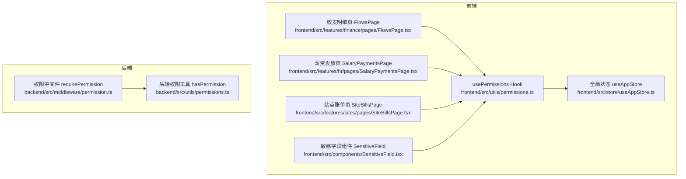
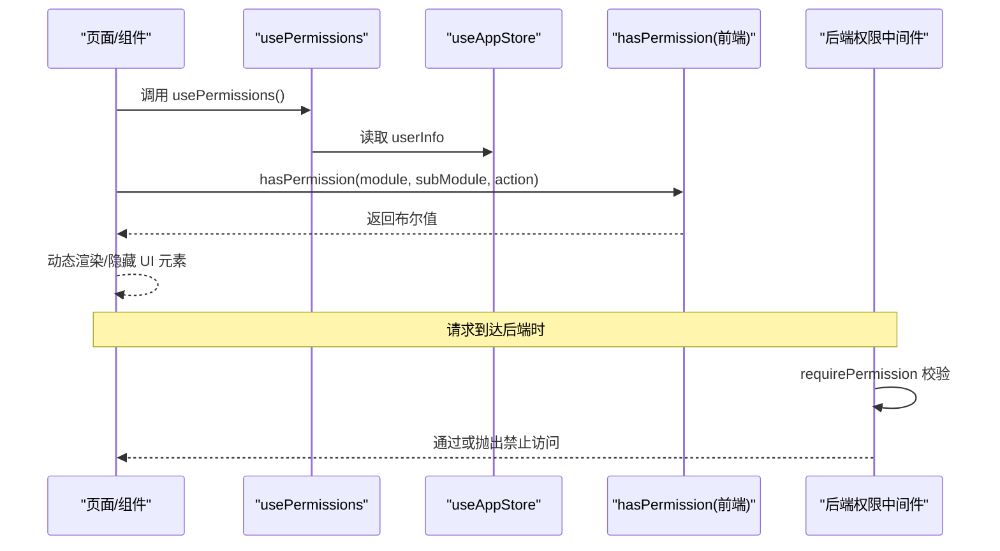
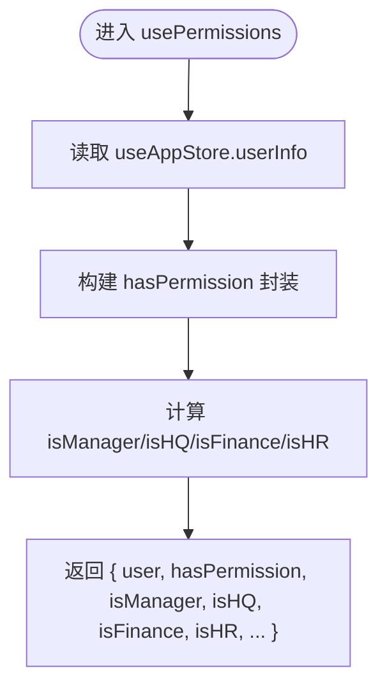
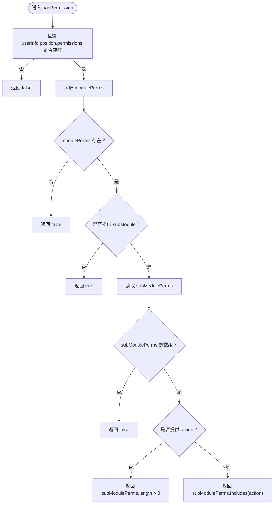
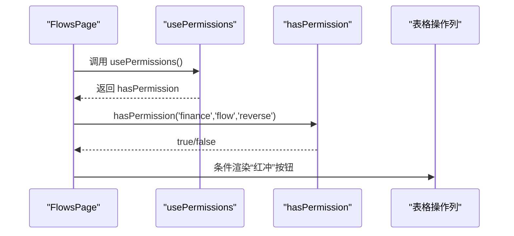
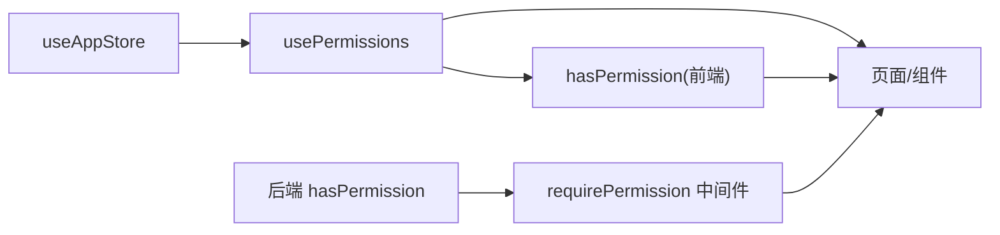

# 前端权限集成与控制

<cite>
**本文引用的文件**
- [frontend/src/utils/permissions.ts](file://frontend/src/utils/permissions.ts)
- [frontend/src/store/useAppStore.ts](file://frontend/src/store/useAppStore.ts)
- [frontend/src/features/finance/pages/FlowsPage.tsx](file://frontend/src/features/finance/pages/FlowsPage.tsx)
- [frontend/src/features/hr/pages/SalaryPaymentsPage.tsx](file://frontend/src/features/hr/pages/SalaryPaymentsPage.tsx)
- [frontend/src/features/sites/pages/SiteBillsPage.tsx](file://frontend/src/features/sites/pages/SiteBillsPage.tsx)
- [frontend/src/components/SensitiveField.tsx](file://frontend/src/components/SensitiveField.tsx)
- [backend/src/utils/permissions.ts](file://backend/src/utils/permissions.ts)
- [backend/src/middleware/permission.ts](file://backend/src/middleware/permission.ts)
</cite>

## 目录
1. [引言](#引言)
2. [项目结构](#项目结构)
3. [核心组件](#核心组件)
4. [架构总览](#架构总览)
5. [详细组件分析](#详细组件分析)
6. [依赖关系分析](#依赖关系分析)
7. [性能考虑](#性能考虑)
8. [故障排查指南](#故障排查指南)
9. [结论](#结论)

## 引言
本文件系统性阐述前端权限系统的集成方案，重点围绕自定义 Hook usePermissions 的设计与使用展开。文档将解释 hasPermission 函数如何在前端复现后端权限检查逻辑，接收 userInfo、module、subModule 和 action 参数并返回布尔值；同时说明 usePermissions Hook 如何从全局状态 useAppStore 获取用户信息，并提供 hasPermission、isManager、isHQ、isFinance 等便捷方法。通过 FlowsPage、SalaryPaymentsPage、SiteBillsPage 等页面的实际用法，展示如何基于权限动态控制 UI 元素的显示与隐藏，从而实现前后端权限策略的一致性，防止用户通过界面进行越权操作。

## 项目结构
前端权限体系主要由以下部分组成：
- 权限工具与 Hook：位于 utils/permissions.ts，提供 hasPermission 与 usePermissions
- 全局状态：位于 store/useAppStore.ts，存储用户信息（含职位与权限）
- 页面与组件：各页面通过 usePermissions 控制 UI 行为；敏感字段组件通过权限控制可见性
- 后端权限：位于 backend/src/utils/permissions.ts 与 middleware/permission.ts，提供与前端一致的权限判定与中间件保护

图表来源
- [frontend/src/utils/permissions.ts](file://frontend/src/utils/permissions.ts#L1-L100)
- [frontend/src/store/useAppStore.ts](file://frontend/src/store/useAppStore.ts#L1-L90)
- [frontend/src/features/finance/pages/FlowsPage.tsx](file://frontend/src/features/finance/pages/FlowsPage.tsx#L1-L120)
- [frontend/src/features/hr/pages/SalaryPaymentsPage.tsx](file://frontend/src/features/hr/pages/SalaryPaymentsPage.tsx#L1-L120)
- [frontend/src/features/sites/pages/SiteBillsPage.tsx](file://frontend/src/features/sites/pages/SiteBillsPage.tsx#L1-L120)
- [frontend/src/components/SensitiveField.tsx](file://frontend/src/components/SensitiveField.tsx#L1-L83)
- [backend/src/utils/permissions.ts](file://backend/src/utils/permissions.ts#L91-L125)
- [backend/src/middleware/permission.ts](file://backend/src/middleware/permission.ts#L1-L42)

章节来源
- [frontend/src/utils/permissions.ts](file://frontend/src/utils/permissions.ts#L1-L100)
- [frontend/src/store/useAppStore.ts](file://frontend/src/store/useAppStore.ts#L1-L90)
- [backend/src/utils/permissions.ts](file://backend/src/utils/permissions.ts#L91-L125)
- [backend/src/middleware/permission.ts](file://backend/src/middleware/permission.ts#L1-L42)

## 核心组件
- hasPermission(userInfo, module, subModule?, action?): 前端权限检查函数，依据用户职位权限结构判断是否具备某模块/子模块/操作的权限。当 userInfo.position.permissions 缺失时直接返回 false；若仅传入 module 则返回 true；若仅传入 subModule 则要求该子模块存在且为数组；若传入 action 则要求数组包含该动作。
- usePermissions(): 自定义 Hook，从 useAppStore 获取 userInfo，并导出 hasPermission、isManager、isHQ、isFinance、isHR、functionRole、positionCode、positionLevel 等便捷方法，便于在页面中直接使用。

章节来源
- [frontend/src/utils/permissions.ts](file://frontend/src/utils/permissions.ts#L1-L100)

## 架构总览
前端权限检查流程：
- 页面调用 usePermissions 获取 hasPermission 与角色/职能信息
- hasPermission 读取 userInfo.position.permissions，按 module → subModule → action 逐级校验
- 页面根据返回结果决定渲染“创建”、“审批”等按钮或列
- 敏感字段组件 SensitiveField 也通过 hasPermission 控制显示/遮罩

后端权限检查流程：
- 中间件 requirePermission 在路由层对请求进行权限校验
- hasPermission 计算规则：部门允许模块（总部 level=1 跳过）∩ 职位定义的操作权限
- 若不满足则抛出禁止访问错误

图表来源
- [frontend/src/utils/permissions.ts](file://frontend/src/utils/permissions.ts#L1-L100)
- [frontend/src/store/useAppStore.ts](file://frontend/src/store/useAppStore.ts#L1-L90)
- [backend/src/middleware/permission.ts](file://backend/src/middleware/permission.ts#L1-L42)
- [backend/src/utils/permissions.ts](file://backend/src/utils/permissions.ts#L91-L125)

## 详细组件分析

### usePermissions Hook 设计与使用
- 作用：封装权限检查与角色判断，统一对外暴露 hasPermission 与 isManager/isHQ/isFinance/isHR 等便捷方法
- 数据来源：从 useAppStore 读取 userInfo，其中包含 position 与 functionRole 等关键字段
- 输出：返回 user、hasPermission、canManageSubordinates、positionCode、positionLevel、functionRole、isManager、isHQ、isFinance、isHR

图表来源
- [frontend/src/utils/permissions.ts](file://frontend/src/utils/permissions.ts#L51-L99)
- [frontend/src/store/useAppStore.ts](file://frontend/src/store/useAppStore.ts#L1-L90)

章节来源
- [frontend/src/utils/permissions.ts](file://frontend/src/utils/permissions.ts#L51-L99)
- [frontend/src/store/useAppStore.ts](file://frontend/src/store/useAppStore.ts#L1-L90)

### hasPermission 函数：前端复现后端逻辑
- 输入：userInfo（来自 useAppStore）、module、subModule（可选）、action（可选）
- 逻辑：
  - 若 userInfo.position.permissions 不存在，直接返回 false
  - 取 modulePerms = userInfo.position.permissions[module]，不存在则返回 false
  - 若未提供 subModule，返回 true（仅校验模块）
  - 取 subModulePerms = modulePerms[subModule]，非数组则返回 false
  - 若未提供 action，返回 subModulePerms.length > 0（仅校验子模块）
  - 最终返回 subModulePerms.includes(action)
- 与后端对比：后端 hasPermission 先做“部门模块允许性”检查（总部 level=1 跳过），再校验职位权限；前端 hasPermission 仅基于职位权限结构进行判断。两者在模块/子模块/动作层面保持一致语义，确保前后端 UI 与行为一致。

图表来源
- [frontend/src/utils/permissions.ts](file://frontend/src/utils/permissions.ts#L21-L43)

章节来源
- [frontend/src/utils/permissions.ts](file://frontend/src/utils/permissions.ts#L21-L43)

### 页面级权限控制实践

#### 收支明细页 FlowsPage
- 使用场景：根据 hasPermission('finance', 'flow', 'reverse') 决定是否渲染“红冲”按钮
- 关键点：仅当用户具备 reverse 权限时才显示该操作列，避免越权操作

图表来源
- [frontend/src/features/finance/pages/FlowsPage.tsx](file://frontend/src/features/finance/pages/FlowsPage.tsx#L24-L32)
- [frontend/src/utils/permissions.ts](file://frontend/src/utils/permissions.ts#L51-L99)

章节来源
- [frontend/src/features/finance/pages/FlowsPage.tsx](file://frontend/src/features/finance/pages/FlowsPage.tsx#L24-L32)

#### 薪资发放页 SalaryPaymentsPage
- 使用场景：isFinance() 与状态机联动，控制“财务确认”“标记转账”“确认转账”等按钮的显示
- 关键点：通过 isFinance() 与 record.status 组合判断，确保只有财务角色且处于正确流程阶段才能看到对应操作

章节来源
- [frontend/src/features/hr/pages/SalaryPaymentsPage.tsx](file://frontend/src/features/hr/pages/SalaryPaymentsPage.tsx#L24-L44)

#### 站点账单页 SiteBillsPage
- 使用场景：hasPermission('site','bill','create') 控制“新建账单”按钮的显示
- 关键点：仅具备创建权限的用户可见并可点击新建弹窗

章节来源
- [frontend/src/features/sites/pages/SiteBillsPage.tsx](file://frontend/src/features/sites/pages/SiteBillsPage.tsx#L46-L56)

#### 敏感字段组件 SensitiveField
- 使用场景：通过 permission='模块.子模块.动作' 的形式，调用 hasPermission 进行细粒度权限控制
- 关键点：未提供 permission 时默认允许；提供后按三段式校验；首次显隐时可记录审计日志

章节来源
- [frontend/src/components/SensitiveField.tsx](file://frontend/src/components/SensitiveField.tsx#L1-L83)

### 角色与职能辅助方法
- isManager()/isHQ()/isFinance()/isHR()：基于 userInfo.position.level 与 functionRole 快速判断角色
- functionRole/positionCode/positionLevel：提供额外上下文信息，便于更精细的 UI 控制

章节来源
- [frontend/src/utils/permissions.ts](file://frontend/src/utils/permissions.ts#L60-L99)
- [frontend/src/store/useAppStore.ts](file://frontend/src/store/useAppStore.ts#L1-L90)

## 依赖关系分析
- usePermissions 依赖 useAppStore 提供的 userInfo
- hasPermission 依赖 userInfo.position.permissions 结构
- 页面与组件通过 usePermissions 间接依赖后端权限策略（语义一致）

图表来源
- [frontend/src/store/useAppStore.ts](file://frontend/src/store/useAppStore.ts#L1-L90)
- [frontend/src/utils/permissions.ts](file://frontend/src/utils/permissions.ts#L1-L100)
- [backend/src/utils/permissions.ts](file://backend/src/utils/permissions.ts#L91-L125)
- [backend/src/middleware/permission.ts](file://backend/src/middleware/permission.ts#L1-L42)

章节来源
- [frontend/src/store/useAppStore.ts](file://frontend/src/store/useAppStore.ts#L1-L90)
- [frontend/src/utils/permissions.ts](file://frontend/src/utils/permissions.ts#L1-L100)
- [backend/src/utils/permissions.ts](file://backend/src/utils/permissions.ts#L91-L125)
- [backend/src/middleware/permission.ts](file://backend/src/middleware/permission.ts#L1-L42)

## 性能考虑
- 权限检查为纯函数，开销极低，适合在渲染路径频繁调用
- 建议在页面级缓存 hasPermission 的结果，避免重复计算
- 对于高频渲染的表格列，优先使用 useMemo/useCallback 包裹权限判断逻辑
- 敏感字段组件建议延迟加载权限判断，减少不必要的渲染

## 故障排查指南
- 问题：hasPermission 总是返回 false
  - 排查：确认 useAppStore 中 userInfo.position.permissions 是否存在；确认模块/子模块/动作拼写是否与后端一致
- 问题：isFinance()/isHQ() 判断异常
  - 排查：确认 userInfo.position.functionRole 与 level 字段是否正确；确认登录后是否已拉取最新权限
- 问题：页面按钮不显示但预期应显示
  - 排查：核对 hasPermission('模块','子模块','动作') 与后端策略是否一致；确认后端 requirePermission 是否拦截了该请求
- 问题：敏感字段始终不可见
  - 排查：确认 permission 属性格式是否为“模块.子模块.动作”，且 hasPermission 返回 true

章节来源
- [frontend/src/utils/permissions.ts](file://frontend/src/utils/permissions.ts#L21-L43)
- [frontend/src/store/useAppStore.ts](file://frontend/src/store/useAppStore.ts#L1-L90)
- [backend/src/middleware/permission.ts](file://backend/src/middleware/permission.ts#L1-L42)

## 结论
通过 usePermissions Hook 与 hasPermission 函数，前端实现了与后端一致的权限语义，能够在页面渲染阶段精准控制 UI 元素的显示与隐藏，有效避免越权操作。配合 isManager/isHQ/isFinance/isHR 等便捷方法，开发者可以快速实现角色驱动的界面控制。建议在复杂页面中对权限判断进行缓存与复用，并在后端通过 requirePermission 中间件确保最终安全边界。