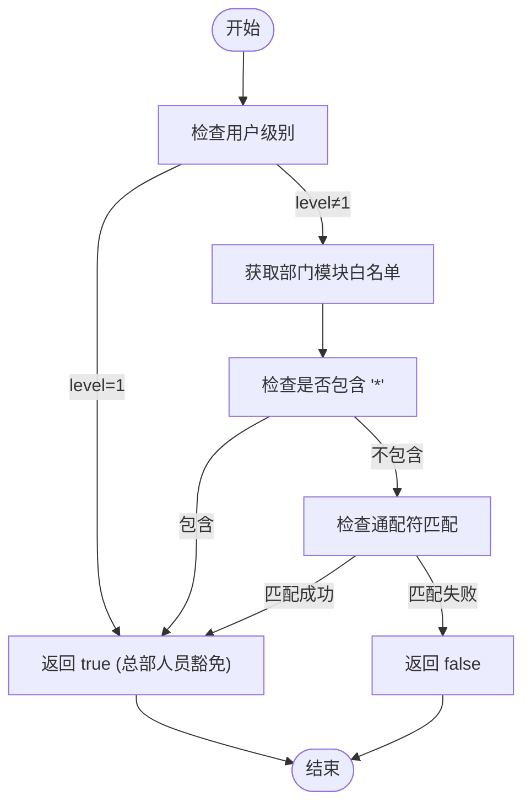
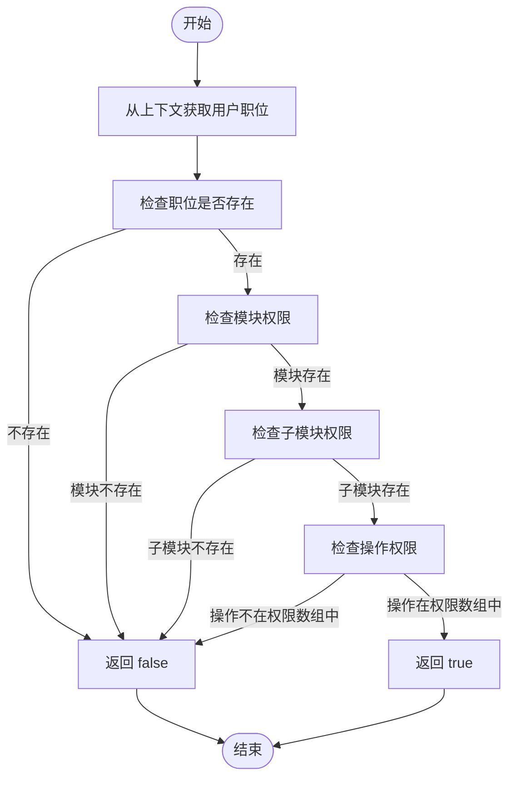
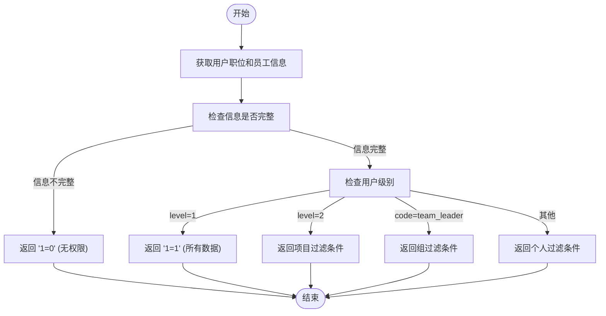

# 后端权限检查逻辑

<cite>
**本文档引用的文件**   
- [permission.ts](file://backend/src/middleware/permission.ts)
- [permissions.ts](file://backend/src/utils/permissions.ts)
- [PermissionService.ts](file://backend/src/services/PermissionService.ts)
- [employees.ts](file://backend/src/routes/v2/employees.ts)
- [expense-reimbursements.ts](file://backend/src/routes/v2/expense-reimbursements.ts)
- [my.ts](file://backend/src/routes/v2/my.ts)
- [position-permissions.ts](file://backend/src/routes/v2/position-permissions.ts)
- [types.ts](file://backend/src/types.ts)
- [middleware.ts](file://backend/src/middleware.ts)
</cite>

## 目录
1. [权限检查核心逻辑](#权限检查核心逻辑)
2. [部门模块访问权限检查](#部门模块访问权限检查)
3. [职位权限验证流程](#职位权限验证流程)
4. [辅助函数解析](#辅助函数解析)
5. [数据行级权限控制](#数据行级权限控制)
6. [权限系统实际应用](#权限系统实际应用)

## 权限检查核心逻辑

后端权限检查系统采用双重验证机制，通过 `hasPermission` 函数实现。该函数首先检查用户所在部门是否允许访问指定模块，然后验证用户职位是否具备执行特定操作的权限。这种双重验证确保了权限控制的严谨性，既考虑了组织架构的限制，又兼顾了职位角色的权限分配。

**Section sources**
- [permissions.ts](file://backend/src/utils/permissions.ts#L99-L125)
- [permission.ts](file://backend/src/middleware/permission.ts#L12-L19)

## 部门模块访问权限检查

系统通过 `hasDepartmentModuleAccess` 函数检查部门级别的模块访问权限。该函数首先判断用户是否为总部人员（level=1），如果是，则豁免部门模块限制，允许访问所有模块。对于非总部人员，系统会检查部门允许的模块白名单，支持通配符匹配逻辑，如 'hr.*' 可以匹配 'hr.employee' 和 'hr.leave' 等子模块。

**Diagram sources**
- [permissions.ts](file://backend/src/utils/permissions.ts#L63-L88)

**Section sources**
- [permissions.ts](file://backend/src/utils/permissions.ts#L63-L88)

## 职位权限验证流程

职位权限验证流程从用户上下文获取 `position.permissions` 配置，逐级检查模块、子模块是否存在，并最终验证操作是否包含在权限数组中。权限配置采用 JSON 结构，如 `{ 'finance': { 'flow': ['view', 'create'] } }`，系统会解析该结构并进行权限验证。

**Diagram sources**
- [permissions.ts](file://backend/src/utils/permissions.ts#L99-L125)

**Section sources**
- [permissions.ts](file://backend/src/utils/permissions.ts#L99-L125)

## 辅助函数解析

系统提供了多个辅助函数来支持权限检查，包括 `canManageSubordinates` 用于检查是否可以管理下属（审批权限），`isHeadquartersStaff` 用于检查是否是总部人员（level=1）。这些辅助函数简化了权限检查逻辑，提高了代码的可读性和可维护性。

**Section sources**
- [permissions.ts](file://backend/src/utils/permissions.ts#L130-L145)

## 数据行级权限控制

`getDataAccessFilter` 函数实现数据行级权限控制，根据用户层级生成不同的 SQL 查询条件。总部人员（level=1）可以访问所有数据，项目人员（level=2）只能访问本项目数据，组长（team_leader）只能访问本组数据，工程师（team_engineer）只能访问自己的数据。该函数返回 SQL 过滤条件和绑定参数，用于在数据库查询中应用权限过滤。

**Diagram sources**
- [permissions.ts](file://backend/src/utils/permissions.ts#L196-L263)

**Section sources**
- [permissions.ts](file://backend/src/utils/permissions.ts#L196-L263)

## 权限系统实际应用

权限系统在多个路由和服务中得到实际应用。例如，在员工管理路由中，`listEmployeesRoute` 使用 `getDataAccessFilter` 函数生成权限过滤条件，确保用户只能查看有权限的员工数据。在报销管理路由中，`createExpenseReimbursementRoute` 使用 `hasPermission` 函数检查用户是否有创建报销的权限。这些应用展示了权限系统在实际业务场景中的灵活性和有效性。

**Section sources**
- [employees.ts](file://backend/src/routes/v2/employees.ts#L46-L103)
- [expense-reimbursements.ts](file://backend/src/routes/v2/expense-reimbursements.ts#L122-L138)
- [my.ts](file://backend/src/routes/v2/my.ts#L426-L435)
- [position-permissions.ts](file://backend/src/routes/v2/position-permissions.ts#L53-L59)