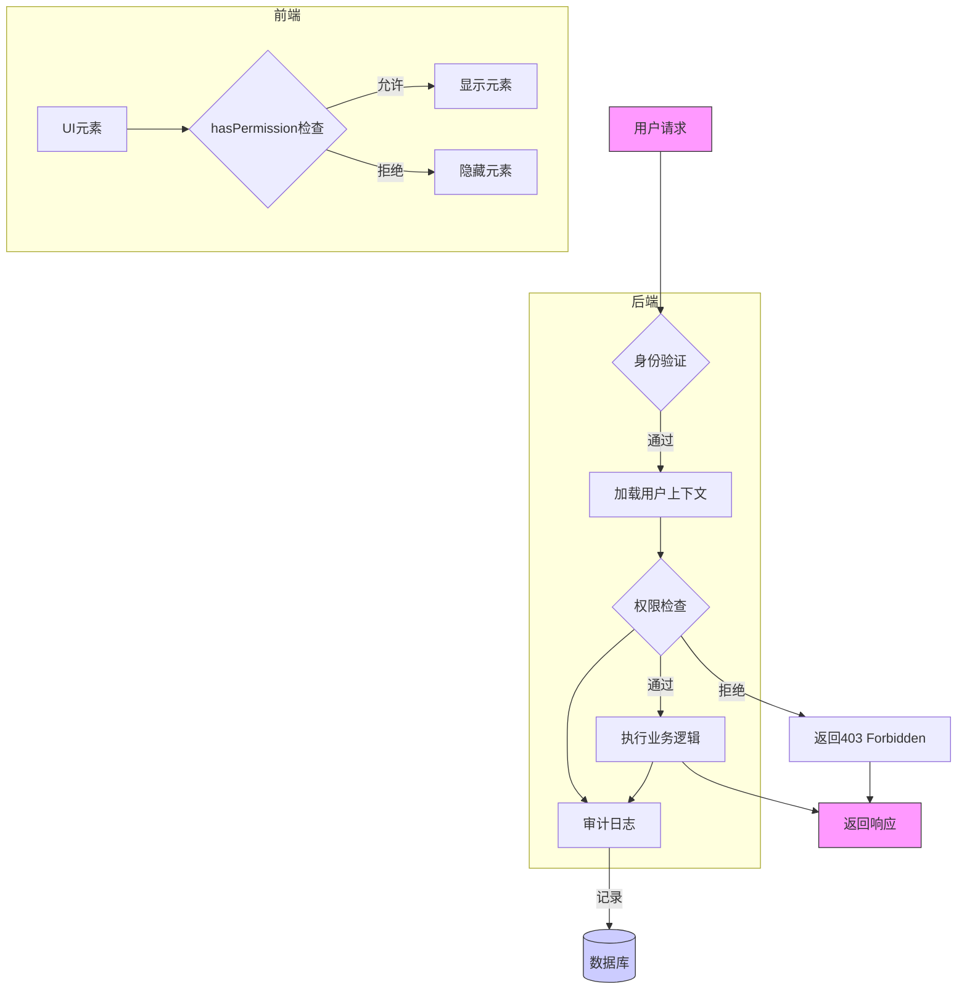
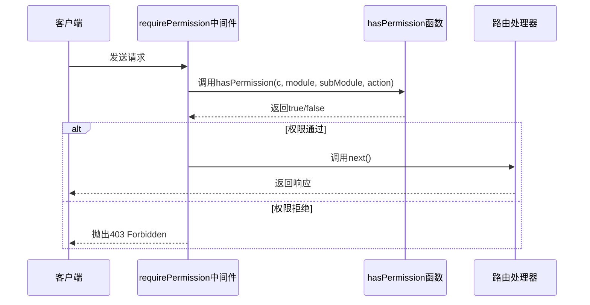
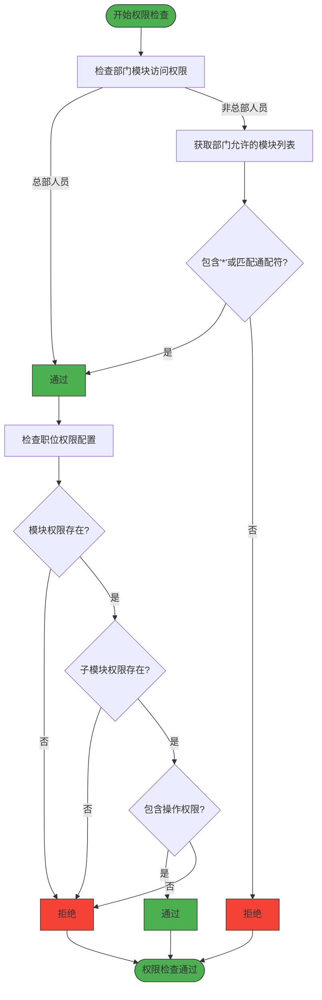
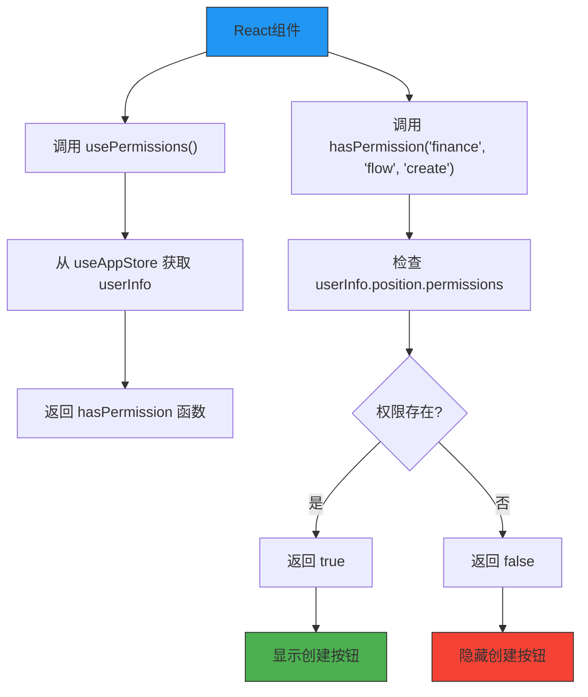
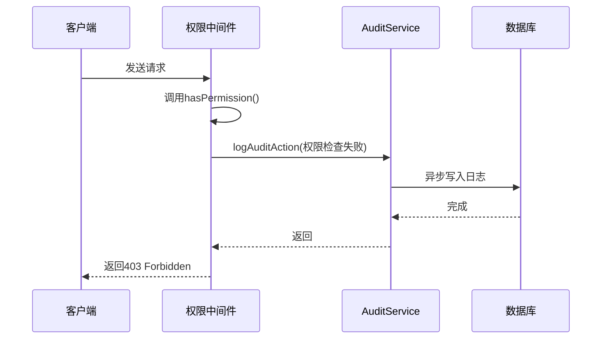

# 授权与RBAC

<cite>
**本文档引用文件**  
- [permission.ts](file://backend/src/middleware/permission.ts)
- [permissions.ts](file://backend/src/utils/permissions.ts)
- [permissions.ts](file://frontend/src/utils/permissions.ts)
- [position-permissions.ts](file://backend/src/routes/v2/position-permissions.ts)
- [PositionPermissionsManagementPage.tsx](file://frontend/src/features/system/pages/PositionPermissionsManagementPage.tsx)
- [audit.ts](file://backend/src/routes/v2/audit.ts)
- [audit.ts](file://backend/src/utils/audit.ts)
- [middleware.ts](file://backend/src/middleware.ts)
- [RBAC.test.ts](file://backend/test/services/RBAC.test.ts)
- [position-permissions.test.ts](file://backend/test/routes/position-permissions.test.ts)
</cite>

## 目录
1. [引言](#引言)
2. [权限控制架构](#权限控制架构)
3. [后端权限中间件](#后端权限中间件)
4. [权限验证逻辑实现](#权限验证逻辑实现)
5. [前端权限管理](#前端权限管理)
6. [权限配置与管理](#权限配置与管理)
7. [审计日志记录](#审计日志记录)
8. [完整权限流程](#完整权限流程)

## 引言
本文档详细阐述财务系统的授权与基于角色的访问控制（RBAC）机制。系统采用细粒度的权限管理体系，通过模块化、子模块化和操作级别的权限控制，确保不同职位的用户只能访问其职责范围内的功能和数据。文档将深入解析权限控制的实现细节，包括后端中间件、权限验证逻辑、前端权限钩子以及审计日志记录。

## 权限控制架构



**图表来源**  
- [middleware.ts](file://backend/src/middleware.ts#L17-L110)
- [permission.ts](file://backend/src/middleware/permission.ts#L12-L42)
- [audit.ts](file://backend/src/utils/audit.ts#L43-L89)

## 后端权限中间件

系统通过 `permission.ts` 中间件实现API级别的权限控制。该中间件提供了两种方式来保护路由：`requirePermission` 和 `protectRoute`。

`requirePermission` 是一个标准的Hono中间件，用于在请求处理链中检查权限。它接收三个参数：`module`（模块名）、`subModule`（子模块名）和 `action`（操作名），通过调用 `hasPermission` 函数进行验证，如果权限不足则抛出403错误。

`protectRoute` 是一个路由包装器，用于OpenAPI路由，功能与 `requirePermission` 类似，但直接包装路由处理器。



**图表来源**  
- [permission.ts](file://backend/src/middleware/permission.ts#L12-L42)
- [position-permissions.ts](file://backend/src/routes/v2/position-permissions.ts#L53-L59)

**本节来源**  
- [permission.ts](file://backend/src/middleware/permission.ts#L1-L42)

## 权限验证逻辑实现

权限验证的核心逻辑在 `backend/src/utils/permissions.ts` 文件中实现。`hasPermission` 函数是权限检查的入口点，其验证过程分为两个关键步骤：

1. **部门模块访问检查**：首先检查用户所属部门是否允许访问指定模块。系统通过 `hasDepartmentModuleAccess` 函数实现此检查。总部人员（level=1）不受此限制，可以访问所有模块。其他层级的用户需要根据 `departmentModules` 配置进行匹配，支持通配符（如 `hr.*`）。

2. **职位权限检查**：在通过部门模块检查后，再检查用户职位的权限配置中是否包含所需的操作权限。权限配置存储在职位（Position）的 `permissions` 字段中，采用JSON格式。



**图表来源**  
- [permissions.ts](file://backend/src/utils/permissions.ts#L63-L89)
- [permissions.ts](file://backend/src/utils/permissions.ts#L99-L125)

**本节来源**  
- [permissions.ts](file://backend/src/utils/permissions.ts#L1-L273)

## 前端权限管理

前端通过 `usePermissions` React Hook 与后端权限系统协同工作，实现UI元素的动态显示/隐藏。该Hook封装了权限检查逻辑，使组件可以轻松地根据用户权限控制界面元素。

`usePermissions` Hook 从全局状态 `useAppStore` 中获取用户信息，并提供 `hasPermission` 函数供组件调用。此外，它还提供了 `isManager`、`isHQ` 等便捷函数来检查用户角色。



**图表来源**  
- [permissions.ts](file://frontend/src/utils/permissions.ts#L51-L99)
- [PositionPermissionsManagementPage.tsx](file://frontend/src/features/system/pages/PositionPermissionsManagementPage.tsx#L296-L297)

**本节来源**  
- [permissions.ts](file://frontend/src/utils/permissions.ts#L1-L100)

## 权限配置与管理

系统的权限配置采用JSON结构，存储在职位（Position）实体的 `permissions` 字段中。典型的权限配置结构如下：

```json
{
  "finance": {
    "flow": ["view", "create", "update", "delete"],
    "transfer": ["view", "create"]
  },
  "hr": {
    "employee": ["view", "create"],
    "leave": ["view", "create", "approve"]
  },
  "asset": {
    "fixed": ["view", "create"]
  }
}
```

权限管理通过专门的管理界面 `PositionPermissionsManagementPage.tsx` 实现。该界面允许管理员为不同职位配置权限。当管理员修改权限时，系统会调用 `updatePosition` API，将新的权限配置保存到数据库。

```mermaid
classDiagram
class Position {
+id : string
+code : string
+name : string
+level : number
+canManageSubordinates : number
+permissions : JSON
+sortOrder : number
}
class PositionService {
+getPositions() : Promise~Position[]~
+getPosition(id : string) : Promise~Position~
+createPosition(data : PositionData) : Promise~Position~
+updatePosition(id : string, data : Partial~Position~) : Promise~Position~
+deletePosition(id : string) : Promise~{ok : boolean, name : string}~
}
class PositionPermissionsManagementPage {
+usePositions() : QueryResult~Position[]~
+useUpdatePosition() : MutationResult
+hasPermission(module, subModule, action) : boolean
}
PositionPermissionsManagementPage --> PositionService : "调用"
PositionService --> Position : "操作"
```

**图表来源**  
- [PositionPermissionsManagementPage.tsx](file://frontend/src/features/system/pages/PositionPermissionsManagementPage.tsx#L291-L338)
- [position-permissions.ts](file://backend/src/routes/v2/position-permissions.ts#L131-L146)

**本节来源**  
- [PositionPermissionsManagementPage.tsx](file://frontend/src/features/system/pages/PositionPermissionsManagementPage.tsx#L291-L338)
- [position-permissions.ts](file://backend/src/routes/v2/position-permissions.ts#L102-L146)

## 审计日志记录

系统通过审计日志记录所有权限检查失败事件以及其他关键操作。当权限检查失败时，系统会抛出403错误，同时 `AuditService` 会记录相关事件。

审计日志记录在 `audit.ts` 工具函数中实现。`logAuditAction` 函数负责记录日志，它从请求上下文中获取用户ID、IP地址等信息，并将其写入数据库。对于权限检查失败的事件，系统会在抛出错误前调用此函数。



**图表来源**  
- [audit.ts](file://backend/src/utils/audit.ts#L43-L89)
- [audit.ts](file://backend/src/routes/v2/audit.ts#L53-L56)
- [audit.ts](file://backend/src/services/AuditService.ts#L127-L180)

**本节来源**  
- [audit.ts](file://backend/src/utils/audit.ts#L43-L89)
- [audit.ts](file://backend/src/routes/v2/audit.ts#L53-L56)

## 完整权限流程

系统的权限管理遵循一个完整的定义、分配和验证流程：

1. **权限定义**：系统预定义了多个模块（如 finance、hr、asset）和操作（如 view、create、update、delete）。
2. **权限分配**：管理员通过管理界面为不同职位分配权限，权限配置以JSON格式存储在数据库中。
3. **用户登录**：用户登录时，认证中间件加载用户信息、职位信息和部门模块权限，并存入请求上下文。
4. **权限验证**：当用户访问受保护的API时，权限中间件调用 `hasPermission` 函数进行双重检查（部门模块访问 + 职位权限）。
5. **审计记录**：无论权限检查成功或失败，关键操作都会被记录到审计日志中。
6. **前端控制**：前端组件使用 `usePermissions` Hook 动态控制UI元素的可见性，提供一致的用户体验。

此流程确保了系统的安全性、可审计性和用户体验的一致性。

**本节来源**  
- [middleware.ts](file://backend/src/middleware.ts#L17-L110)
- [permissions.ts](file://backend/src/utils/permissions.ts#L99-L125)
- [permissions.ts](file://frontend/src/utils/permissions.ts#L51-L99)