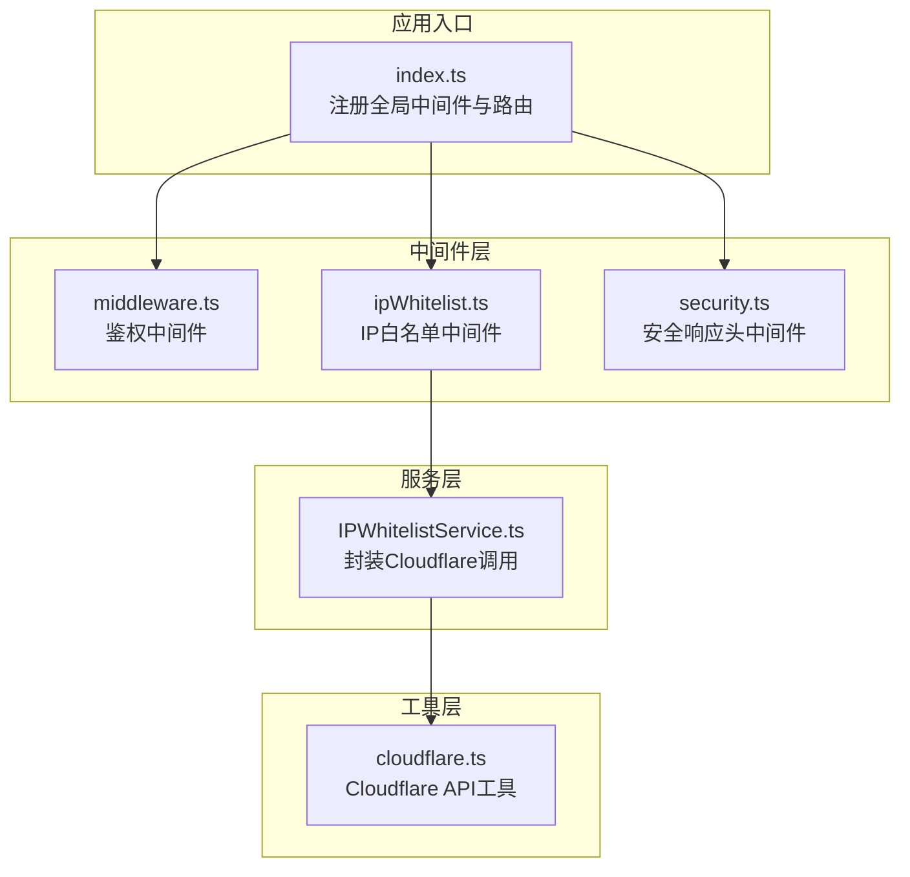
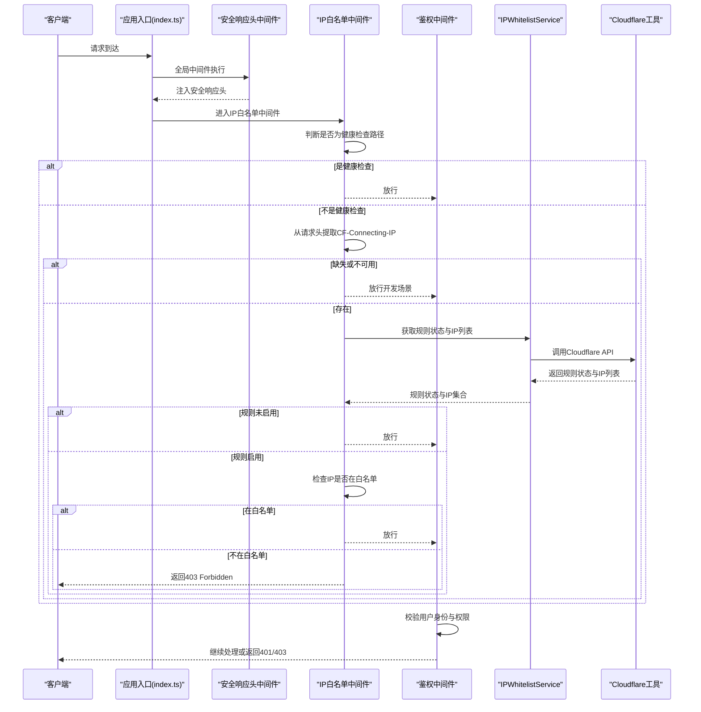
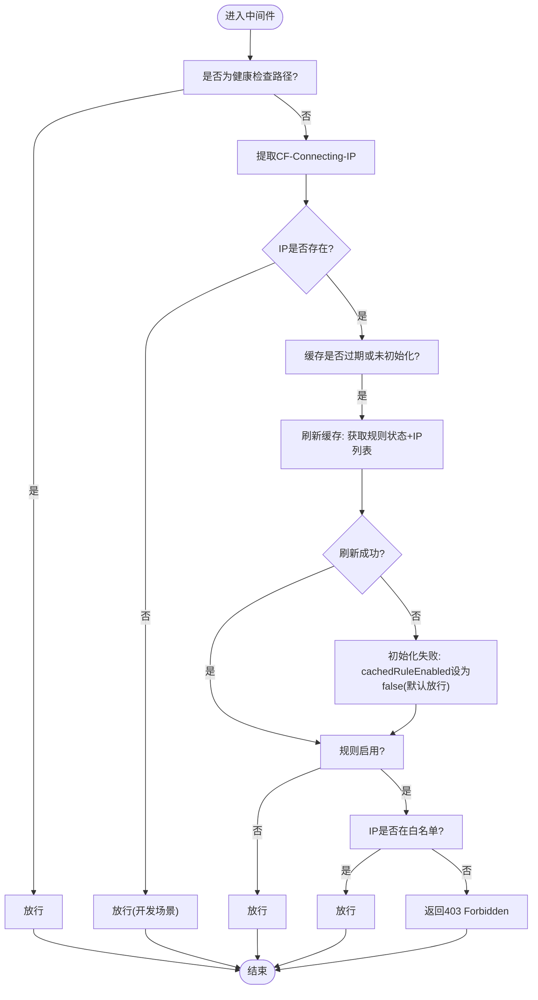
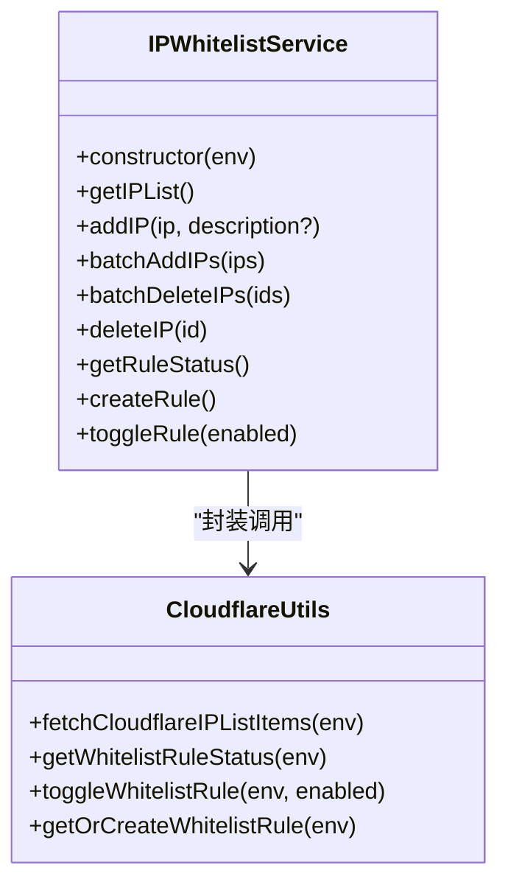
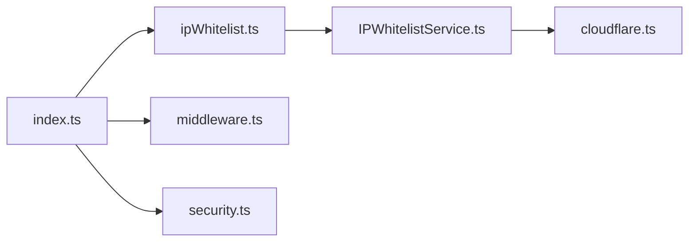

# IP白名单中间件

<cite>
**本文引用的文件**
- [ipWhitelist.ts](file://backend/src/middleware/ipWhitelist.ts)
- [IPWhitelistService.ts](file://backend/src/services/IPWhitelistService.ts)
- [cloudflare.ts](file://backend/src/utils/cloudflare.ts)
- [index.ts](file://backend/src/index.ts)
- [middleware.ts](file://backend/src/middleware.ts)
- [security.ts](file://backend/src/middleware/security.ts)
- [permission.ts](file://backend/src/middleware/permission.ts)
- [ip-whitelist.ts](file://backend/src/routes/v2/ip-whitelist.ts)
</cite>

## 目录
1. [引言](#引言)
2. [项目结构](#项目结构)
3. [核心组件](#核心组件)
4. [架构总览](#架构总览)
5. [详细组件分析](#详细组件分析)
6. [依赖关系分析](#依赖关系分析)
7. [性能考量](#性能考量)
8. [故障排查指南](#故障排查指南)
9. [结论](#结论)

## 引言
本文件深入解析IP白名单中间件的实现机制，重点说明其如何通过Cloudflare提供的CF-Connecting-IP头获取真实客户端IP，并结合内存缓存与TTL优化性能；阐述中间件在Hono请求处理链中的执行顺序及与Hono框架的集成方式；解释缓存刷新失败时的降级策略（依据cachedRuleEnabled初始值决定默认放行或拒绝）；详述白名单规则启用时对非白名单IP返回403 Forbidden的具体逻辑；说明健康检查接口(/api/health)被设计为始终放行的例外处理；并给出与其他安全组件（如permission.ts、security.ts）的协作关系与潜在冲突规避策略。

## 项目结构
- 中间件层位于backend/src/middleware，其中ipWhitelist.ts为核心入口。
- 业务服务位于backend/src/services，IPWhitelistService封装对Cloudflare的调用。
- 工具层位于backend/src/utils，cloudflare.ts提供Cloudflare API交互能力。
- 应用入口位于backend/src/index.ts，负责全局中间件注册与路由挂载。
- 安全中间件security.ts与权限中间件permission.ts分别提供响应头与权限控制。

图表来源
- [index.ts](file://backend/src/index.ts#L313-L315)
- [ipWhitelist.ts](file://backend/src/middleware/ipWhitelist.ts#L1-L76)
- [IPWhitelistService.ts](file://backend/src/services/IPWhitelistService.ts#L1-L141)
- [cloudflare.ts](file://backend/src/utils/cloudflare.ts#L576-L616)

章节来源
- [index.ts](file://backend/src/index.ts#L313-L315)

## 核心组件
- IP白名单中间件：负责在请求进入时提取真实客户端IP、加载白名单规则与IP列表、进行放行/拦截判定，并对健康检查接口做例外放行。
- IPWhitelistService：封装对Cloudflare IP列表与规则的增删改查、开关等操作。
- Cloudflare工具：提供获取/创建IP列表、规则、切换规则状态等底层API调用。
- 鉴权中间件：在IP白名单之后执行，确保访问受控接口的用户具备有效会话。
- 安全响应头中间件：在所有请求完成后统一注入安全响应头。

章节来源
- [ipWhitelist.ts](file://backend/src/middleware/ipWhitelist.ts#L1-L76)
- [IPWhitelistService.ts](file://backend/src/services/IPWhitelistService.ts#L1-L141)
- [cloudflare.ts](file://backend/src/utils/cloudflare.ts#L576-L616)
- [middleware.ts](file://backend/src/middleware.ts#L1-L120)
- [security.ts](file://backend/src/middleware/security.ts#L1-L81)

## 架构总览
IP白名单中间件在Hono全局中间件中按如下顺序执行：
- 安全响应头中间件（先注入响应头，再执行后续中间件）
- IP白名单中间件（优先进行IP判定与例外放行）
- 鉴权中间件（在IP白名单之后，确保用户身份有效）

图表来源
- [index.ts](file://backend/src/index.ts#L313-L315)
- [ipWhitelist.ts](file://backend/src/middleware/ipWhitelist.ts#L18-L74)
- [IPWhitelistService.ts](file://backend/src/services/IPWhitelistService.ts#L120-L141)
- [cloudflare.ts](file://backend/src/utils/cloudflare.ts#L923-L1067)
- [middleware.ts](file://backend/src/middleware.ts#L1-L120)

## 详细组件分析

### IP白名单中间件实现机制
- 真实客户端IP获取：通过请求头CF-Connecting-IP提取真实客户端IP；若缺失（例如本地开发），中间件选择放行并记录警告，确保生产环境（Cloudflare代理）下该头必存在。
- 缓存与TTL：使用内存缓存cachedIPs（Set）与cachedRuleEnabled（布尔）以及lastCacheTime（毫秒）实现1分钟TTL的缓存刷新策略。首次运行或缓存过期时才触发Cloudflare API调用，否则复用旧缓存。
- 例外放行：对健康检查路径（/api/health与/api/version）直接放行，避免影响监控与运维。
- 规则启用判定：若规则未启用，则直接放行；若启用且IP不在白名单，则返回403 Forbidden。
- 错误处理与降级：当缓存刷新失败时，若初始cachedRuleEnabled为null（未初始化），则默认视为禁用（放行）；同时记录错误日志。若已有旧缓存，优先使用旧缓存以保证服务连续性。
- 与Hono集成：在index.ts中通过全局中间件数组顺序注册，确保安全响应头先注入，然后执行IP白名单，最后进行鉴权。

图表来源
- [ipWhitelist.ts](file://backend/src/middleware/ipWhitelist.ts#L18-L74)

章节来源
- [ipWhitelist.ts](file://backend/src/middleware/ipWhitelist.ts#L1-L76)

### IPWhitelistService与Cloudflare工具
- IPWhitelistService提供以下关键能力：
  - 获取IP列表：调用fetchCloudflareIPListItems，返回标准化的IP条目集合。
  - 获取规则状态：调用getWhitelistRuleStatus，返回enabled、ruleId、rulesetId。
  - 切换规则：调用toggleWhitelistRule，更新Cloudflare规则状态。
  - 创建规则：调用getOrCreateWhitelistRule，确保规则存在并返回ID。
- Cloudflare工具：
  - fetchCloudflareIPListItems：从Cloudflare IP列表中拉取所有IP条目。
  - getWhitelistRuleStatus：从Cloudflare拉取规则状态，若不存在则自动创建。
  - toggleWhitelistRule：更新Cloudflare规则的enabled状态，采用“整规则集更新”策略，避免误改其他规则。
  - getOrCreateWhitelistRule：创建或获取规则集与规则ID。

图表来源
- [IPWhitelistService.ts](file://backend/src/services/IPWhitelistService.ts#L1-L141)
- [cloudflare.ts](file://backend/src/utils/cloudflare.ts#L576-L616)
- [cloudflare.ts](file://backend/src/utils/cloudflare.ts#L923-L1067)

章节来源
- [IPWhitelistService.ts](file://backend/src/services/IPWhitelistService.ts#L1-L141)
- [cloudflare.ts](file://backend/src/utils/cloudflare.ts#L576-L616)
- [cloudflare.ts](file://backend/src/utils/cloudflare.ts#L923-L1067)

### Hono中间件执行顺序与集成
- 在index.ts中，全局中间件数组为：[createIPWhitelistMiddleware(), createAuthMiddleware(), di]。
- 安全响应头中间件在所有路径上注册，先于IP白名单中间件执行，确保响应头在请求完成时注入。
- IP白名单中间件在鉴权中间件之前执行，从而在鉴权前完成IP层面的访问控制。

章节来源
- [index.ts](file://backend/src/index.ts#L313-L315)
- [security.ts](file://backend/src/middleware/security.ts#L1-L81)
- [middleware.ts](file://backend/src/middleware.ts#L1-L120)

### 与其他安全组件的协作与冲突规避
- 与权限中间件（permission.ts）的关系：
  - 权限中间件针对“已认证用户”的权限进行校验，而IP白名单中间件针对“来源IP”进行校验。两者在同一请求链中先后执行，互不冲突。
  - 若IP不在白名单，将在鉴权前被拒绝，避免无意义的鉴权请求。
- 与安全响应头中间件（security.ts）的关系：
  - 安全响应头中间件在next()之后注入，不影响IP白名单中间件的前置判定逻辑。
- 与健康检查的例外：
  - 健康检查路径（/api/health、/api/version）在IP白名单中间件阶段即被放行，避免影响监控与运维。

章节来源
- [permission.ts](file://backend/src/middleware/permission.ts#L1-L43)
- [security.ts](file://backend/src/middleware/security.ts#L1-L81)
- [ipWhitelist.ts](file://backend/src/middleware/ipWhitelist.ts#L18-L20)

## 依赖关系分析
- IP白名单中间件依赖IPWhitelistService，后者封装Cloudflare API调用。
- IPWhitelistService依赖cloudflare.ts中的工具函数，包括获取IP列表、规则状态、切换规则等。
- 应用入口index.ts负责注册全局中间件顺序，确保IP白名单中间件在鉴权中间件之前执行。

图表来源
- [index.ts](file://backend/src/index.ts#L313-L315)
- [ipWhitelist.ts](file://backend/src/middleware/ipWhitelist.ts#L1-L76)
- [IPWhitelistService.ts](file://backend/src/services/IPWhitelistService.ts#L1-L141)
- [cloudflare.ts](file://backend/src/utils/cloudflare.ts#L576-L616)

章节来源
- [index.ts](file://backend/src/index.ts#L313-L315)

## 性能考量
- 内存缓存与TTL：通过cachedIPs与lastCacheTime实现1分钟TTL，减少频繁调用Cloudflare API带来的延迟与成本。
- 仅在必要时刷新：当cachedRuleEnabled为null或缓存过期时才刷新，避免不必要的网络请求。
- 例外放行：健康检查路径直接放行，减少额外判断开销。
- 降级策略：缓存刷新失败时，默认放行（cachedRuleEnabled=false），保障服务连续性，同时记录错误日志便于追踪。

章节来源
- [ipWhitelist.ts](file://backend/src/middleware/ipWhitelist.ts#L36-L58)

## 故障排查指南
- 健康检查无法访问：
  - 确认请求路径是否为/api/health或/api/version，中间件会直接放行。
- 本地开发IP被拒绝：
  - 本地缺少CF-Connecting-IP头时，中间件会放行并记录警告；生产环境需确保通过Cloudflare代理。
- 缓存刷新失败：
  - 中间件会记录错误日志；若初始cachedRuleEnabled为null，将默认放行；建议检查Cloudflare凭据与Zone配置。
- 规则状态异常：
  - getWhitelistRuleStatus会尝试自动创建规则并返回Cloudflare实时状态；若凭据未配置或认证失败，可能返回null或默认禁用。
- 与其他中间件冲突：
  - 若出现鉴权前被拒绝的情况，优先检查IP白名单中间件是否因规则启用且IP不在白名单导致；若IP在白名单但仍被拒绝，检查鉴权中间件与权限中间件的配置。

章节来源
- [ipWhitelist.ts](file://backend/src/middleware/ipWhitelist.ts#L49-L58)
- [cloudflare.ts](file://backend/src/utils/cloudflare.ts#L923-L1067)

## 结论
IP白名单中间件通过CF-Connecting-IP头精准识别真实客户端IP，结合内存缓存与1分钟TTL显著降低Cloudflare API调用频率；在规则未启用时默认放行，在启用且IP不在白名单时返回403；对健康检查路径的例外放行确保监控与运维不受影响。中间件在Hono全局中间件中先于鉴权执行，与权限中间件、安全响应头中间件协同工作，形成多层防护。当缓存刷新失败时，采用默认放行的降级策略，保障服务连续性。