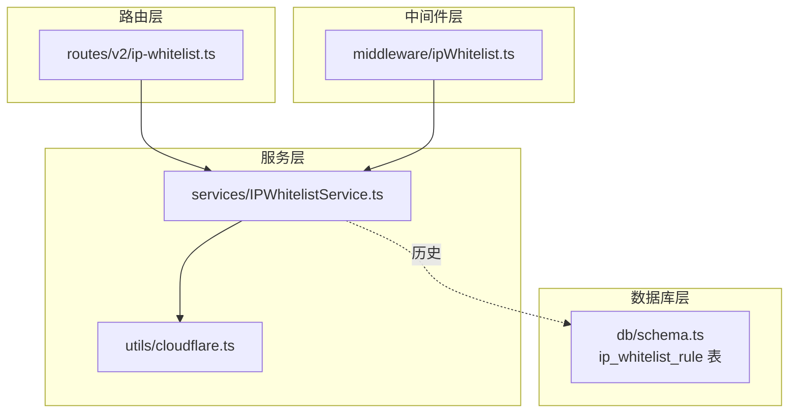
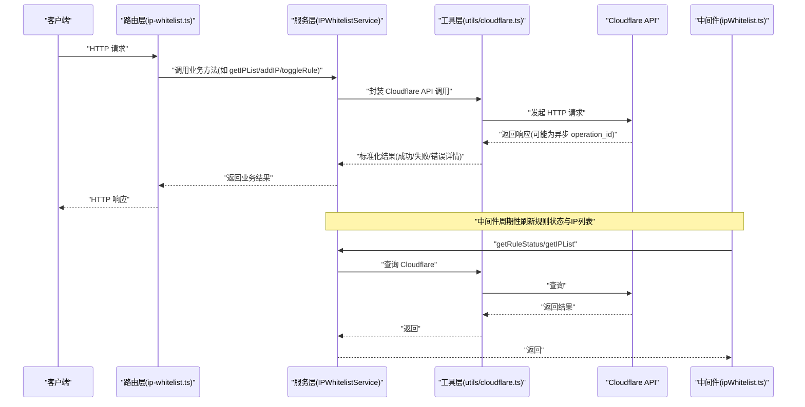
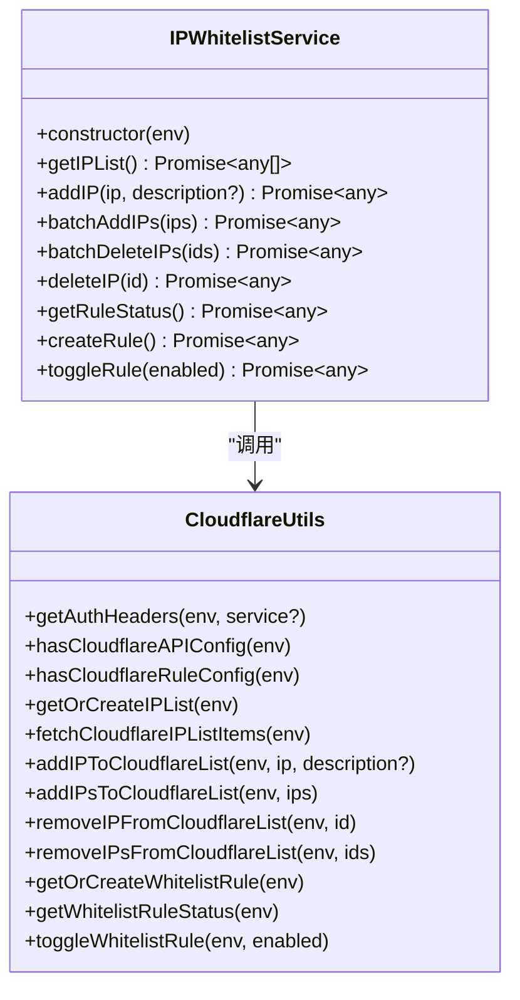
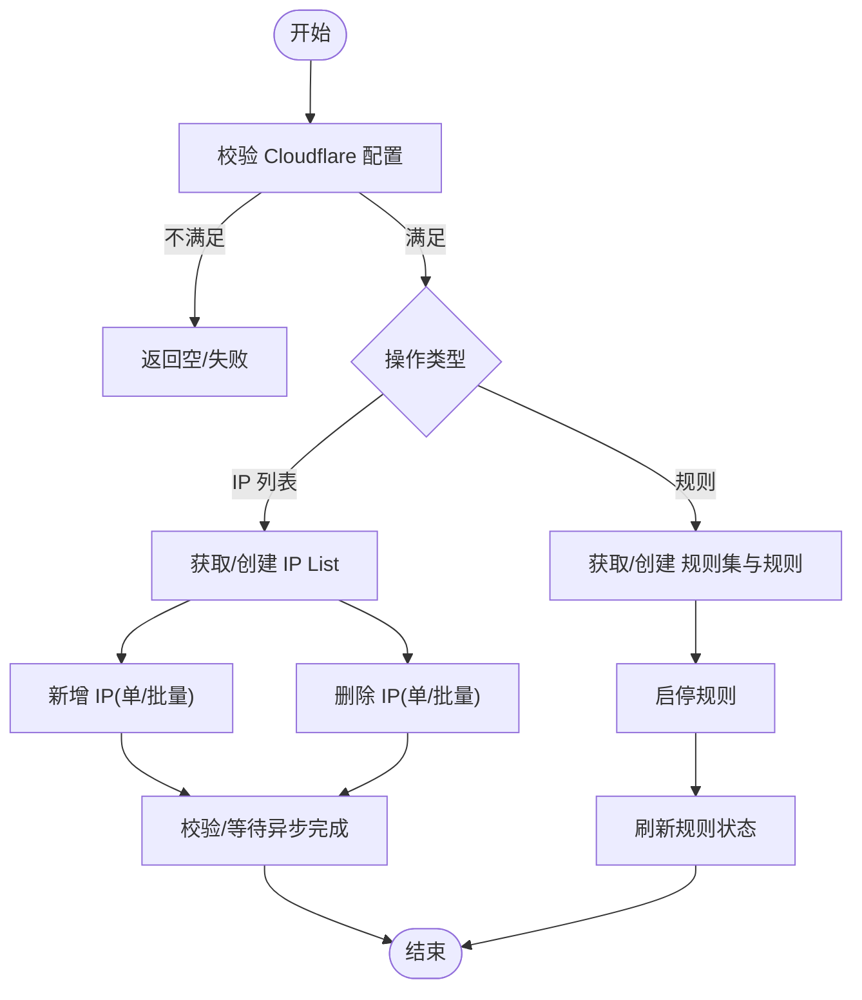
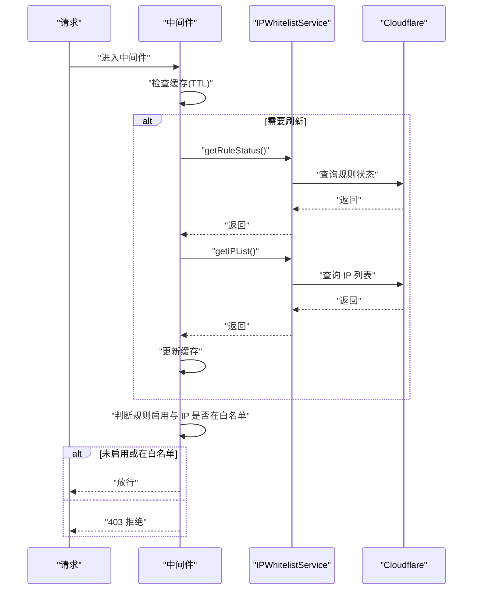
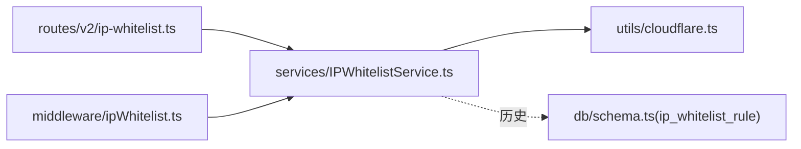

# IP白名单服务层

<cite>
**本文引用的文件**
- [IPWhitelistService.ts](file://backend/src/services/IPWhitelistService.ts)
- [cloudflare.ts](file://backend/src/utils/cloudflare.ts)
- [ipWhitelist.ts](file://backend/src/middleware/ipWhitelist.ts)
- [ip-whitelist.ts](file://backend/src/routes/v2/ip-whitelist.ts)
- [schema.ts](file://backend/src/db/schema.ts)
- [types.ts](file://backend/src/types.ts)
- [ip-whitelist.test.ts](file://backend/test/routes/ip-whitelist.test.ts)
</cite>

## 目录
1. [简介](#简介)
2. [项目结构](#项目结构)
3. [核心组件](#核心组件)
4. [架构总览](#架构总览)
5. [详细组件分析](#详细组件分析)
6. [依赖关系分析](#依赖关系分析)
7. [性能考量](#性能考量)
8. [故障排查指南](#故障排查指南)
9. [结论](#结论)

## 简介
本文件系统性阐述 IPWhitelistService 的服务层实现，重点覆盖以下方面：
- 与 Cloudflare 规则引擎的集成方式、认证机制与同步策略
- 服务对 IP 列表的增删改查与规则启停管理
- 服务与数据库的交互逻辑（历史与现状）
- 服务向 ipWhitelist 中间件提供规则状态与 IP 列表的能力
- 高并发场景下的性能考量与错误处理策略

## 项目结构
IP 白名单能力由三层协作构成：
- 路由层：提供 REST API，封装业务语义与鉴权
- 服务层：IPWhitelistService 封装业务流程与 Cloudflare 集成
- 中间件层：ipWhitelist 中间件消费服务提供的规则状态与 IP 列表，执行实时访问控制

图表来源
- [ip-whitelist.ts](file://backend/src/routes/v2/ip-whitelist.ts#L1-L415)
- [IPWhitelistService.ts](file://backend/src/services/IPWhitelistService.ts#L1-L141)
- [cloudflare.ts](file://backend/src/utils/cloudflare.ts#L1-L1067)
- [ipWhitelist.ts](file://backend/src/middleware/ipWhitelist.ts#L1-L76)
- [schema.ts](file://backend/src/db/schema.ts#L496-L504)

章节来源
- [ip-whitelist.ts](file://backend/src/routes/v2/ip-whitelist.ts#L1-L415)
- [IPWhitelistService.ts](file://backend/src/services/IPWhitelistService.ts#L1-L141)
- [cloudflare.ts](file://backend/src/utils/cloudflare.ts#L1-L1067)
- [ipWhitelist.ts](file://backend/src/middleware/ipWhitelist.ts#L1-L76)
- [schema.ts](file://backend/src/db/schema.ts#L496-L504)

## 核心组件
- IPWhitelistService：提供 IP 列表 CRUD、规则状态查询与启停、规则创建等能力；所有操作均委托至 Cloudflare 工具函数。
- Cloudflare 工具集：负责 Cloudflare API 的认证、IP 列表与规则的创建、查询、更新与删除；支持异步操作的轮询与校验。
- ipWhitelist 中间件：在请求链路中缓存规则状态与 IP 列表，按 TTL 刷新；当规则启用且命中白名单时放行，否则拒绝。
- 路由层：暴露统一的 REST 接口，负责鉴权与审计日志记录。

章节来源
- [IPWhitelistService.ts](file://backend/src/services/IPWhitelistService.ts#L1-L141)
- [cloudflare.ts](file://backend/src/utils/cloudflare.ts#L1-L1067)
- [ipWhitelist.ts](file://backend/src/middleware/ipWhitelist.ts#L1-L76)
- [ip-whitelist.ts](file://backend/src/routes/v2/ip-whitelist.ts#L1-L415)

## 架构总览
下图展示请求从路由到服务再到 Cloudflare 的端到端调用链，以及中间件如何消费服务状态进行访问控制。

图表来源
- [ip-whitelist.ts](file://backend/src/routes/v2/ip-whitelist.ts#L1-L415)
- [IPWhitelistService.ts](file://backend/src/services/IPWhitelistService.ts#L1-L141)
- [cloudflare.ts](file://backend/src/utils/cloudflare.ts#L1-L1067)
- [ipWhitelist.ts](file://backend/src/middleware/ipWhitelist.ts#L1-L76)

## 详细组件分析

### 服务层：IPWhitelistService
- 职责边界
  - 统一对外暴露业务方法，屏蔽 Cloudflare API 细节
  - 提供 IP 列表查询、新增、批量新增、批量删除、单条删除
  - 提供规则状态查询、规则创建、规则启停
- 关键方法
  - getIPList：从 Cloudflare IP List 拉取条目，转换为服务内部结构
  - addIP/batchAddIPs：新增单个或批量 IP，包含重复校验与错误处理
  - batchDeleteIPs/deleteIP：删除单个或批量 IP，返回统计结果
  - getRuleStatus/createRule/toggleRule：规则状态查询、创建、启停
- 错误处理
  - 对 Cloudflare 返回的错误进行日志记录与业务错误抛出
  - 对缺失 Token 或 Account/Zone 配置进行显式校验与降级处理
- 数据库交互
  - 历史存在 ip_whitelist_rule 表，但当前实现不再写入数据库；规则状态以 Cloudflare 实时为准

图表来源
- [IPWhitelistService.ts](file://backend/src/services/IPWhitelistService.ts#L1-L141)
- [cloudflare.ts](file://backend/src/utils/cloudflare.ts#L1-L1067)

章节来源
- [IPWhitelistService.ts](file://backend/src/services/IPWhitelistService.ts#L1-L141)
- [schema.ts](file://backend/src/db/schema.ts#L496-L504)

### Cloudflare 集成与认证机制
- 认证头生成
  - 依据服务类型选择对应的 Token 并拼装 Authorization 头
  - 支持 ip_lists、email、firewall 三类服务专用 Token
- API 配置校验
  - IP List 操作需 Account ID 与对应 Token
  - 自定义规则操作需 Zone ID 与对应 Token
- IP List 生命周期
  - 自动发现或创建名为特定名称的 IP List
  - 新增 IP 支持单条与批量，返回标准化结果（成功/失败计数与错误明细）
  - 删除 IP 支持单条与批量，返回统计结果
- 自定义规则生命周期
  - 自动定位/创建规则集与规则
  - 启停规则时仅更新规则的 enabled 字段，保持其他字段不变
  - 规则状态查询优先从 Cloudflare 拉取，异常时返回默认值

图表来源
- [cloudflare.ts](file://backend/src/utils/cloudflare.ts#L1-L1067)

章节来源
- [cloudflare.ts](file://backend/src/utils/cloudflare.ts#L1-L1067)
- [types.ts](file://backend/src/types.ts#L1-L20)

### 中间件：ipWhitelist 中间件
- 缓存策略
  - 内存缓存规则启用状态与 IP 列表，TTL 为 1 分钟
  - 首次或过期时刷新缓存；刷新失败时采用“失败开”策略（默认放行），并记录日志
- 访问控制
  - 忽略健康检查路径
  - 从请求头提取客户端 IP，若缺失则放行（开发环境提示）
  - 当规则未启用或 IP 在白名单集合中时放行，否则返回 403
- 与服务层协作
  - 通过服务层方法获取规则状态与 IP 列表
  - 服务层负责与 Cloudflare 交互，中间件仅做缓存与快速决策

图表来源
- [ipWhitelist.ts](file://backend/src/middleware/ipWhitelist.ts#L1-L76)
- [IPWhitelistService.ts](file://backend/src/services/IPWhitelistService.ts#L1-L141)
- [cloudflare.ts](file://backend/src/utils/cloudflare.ts#L1-L1067)

章节来源
- [ipWhitelist.ts](file://backend/src/middleware/ipWhitelist.ts#L1-L76)

### 路由层：REST API
- 主要接口
  - GET /ip-whitelist：获取 IP 白名单列表
  - POST /ip-whitelist：新增单个 IP
  - POST /ip-whitelist/batch：批量新增 IP
  - DELETE /ip-whitelist/batch：批量删除 IP
  - DELETE /ip-whitelist/{id}：删除单个 IP
  - GET /ip-whitelist/rule：获取规则状态
  - POST /ip-whitelist/rule/toggle：切换规则启停
  - POST /ip-whitelist/rule/create：创建规则
  - POST /ip-whitelist/sync：同步 IP 列表
- 权限与审计
  - 所有接口均要求具备相应系统配置权限
  - 成功操作记录审计日志

章节来源
- [ip-whitelist.ts](file://backend/src/routes/v2/ip-whitelist.ts#L1-L415)

### 数据库交互逻辑
- 历史设计
  - 存在 ip_whitelist_rule 表，用于持久化规则状态与 Cloudflare 对应 ID
- 现状演进
  - 当前实现不再写入数据库；规则状态以 Cloudflare 实时为准
  - 服务层方法返回值不再包含数据库字段，中间件也不再依赖数据库
- 影响
  - 规则启停与状态查询完全依赖 Cloudflare API
  - 若需审计或回溯，建议通过 Cloudflare 日志或应用侧审计日志实现

章节来源
- [schema.ts](file://backend/src/db/schema.ts#L496-L504)
- [IPWhitelistService.ts](file://backend/src/services/IPWhitelistService.ts#L1-L141)
- [cloudflare.ts](file://backend/src/utils/cloudflare.ts#L923-L1067)

## 依赖关系分析
- 服务层依赖工具层的 Cloudflare API 封装
- 中间件依赖服务层提供的规则状态与 IP 列表
- 路由层依赖服务层并承担鉴权与审计职责
- 数据库层仅作为历史存储，当前实现不再使用

图表来源
- [ip-whitelist.ts](file://backend/src/routes/v2/ip-whitelist.ts#L1-L415)
- [IPWhitelistService.ts](file://backend/src/services/IPWhitelistService.ts#L1-L141)
- [cloudflare.ts](file://backend/src/utils/cloudflare.ts#L1-L1067)
- [ipWhitelist.ts](file://backend/src/middleware/ipWhitelist.ts#L1-L76)
- [schema.ts](file://backend/src/db/schema.ts#L496-L504)

章节来源
- [ip-whitelist.ts](file://backend/src/routes/v2/ip-whitelist.ts#L1-L415)
- [IPWhitelistService.ts](file://backend/src/services/IPWhitelistService.ts#L1-L141)
- [cloudflare.ts](file://backend/src/utils/cloudflare.ts#L1-L1067)
- [ipWhitelist.ts](file://backend/src/middleware/ipWhitelist.ts#L1-L76)
- [schema.ts](file://backend/src/db/schema.ts#L496-L504)

## 性能考量
- 中间件缓存
  - TTL 1 分钟，减少频繁调用 Cloudflare API 的开销
  - 刷新失败时采用“失败开”策略，保证可用性；可通过外部可观测性监控缓存命中率与刷新失败率
- 批量操作
  - 批量新增/删除通过一次请求提交多个条目，降低网络往返次数
  - 对于异步操作，工具层内置短暂等待与二次拉取校验，确保最终一致性
- 并发与重试
  - 服务层未实现显式的重试机制；建议在上游网关或边缘层引入指数退避重试
  - 对于高频变更场景，可在业务侧增加幂等性保障与去重策略
- 资源隔离
  - Cloudflare API 令牌按服务分离，避免权限过大导致的单点风险
  - 建议为不同租户或环境配置独立的 Zone/Account，降低耦合度

[本节为通用性能建议，无需具体文件引用]

## 故障排查指南
- 常见错误与定位
  - 认证失败：检查 CF_* 系列环境变量是否正确配置
  - API 返回 401/403：核对 Token 权限范围与 Zone/Account ID
  - 异步操作未即时生效：工具层已内置等待与二次拉取校验，若仍异常，检查网络连通性与 Cloudflare 状态
- 日志与审计
  - 服务层与中间件均记录关键错误与警告
  - 路由层对关键操作记录审计日志，便于回溯
- 测试参考
  - 单元测试覆盖了路由层对服务层方法的调用与响应格式，可作为行为验证的参考

章节来源
- [cloudflare.ts](file://backend/src/utils/cloudflare.ts#L1-L1067)
- [ipWhitelist.ts](file://backend/src/middleware/ipWhitelist.ts#L1-L76)
- [ip-whitelist.test.ts](file://backend/test/routes/ip-whitelist.test.ts#L1-L168)

## 结论
- IPWhitelistService 将业务语义与 Cloudflare API 解耦，提供稳定一致的增删改查与规则启停能力
- 中间件通过缓存显著降低对 Cloudflare 的调用压力，并在刷新失败时采取安全的降级策略
- 数据库层的历史表已不再使用，规则状态以 Cloudflare 实时为准，简化了状态一致性问题
- 建议在生产环境中结合网关重试、可观测性与严格的权限治理，持续优化性能与可靠性