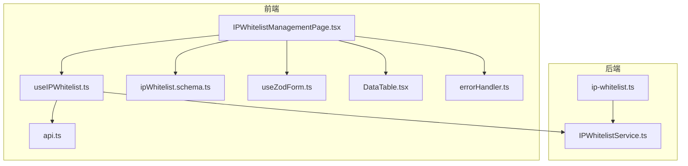
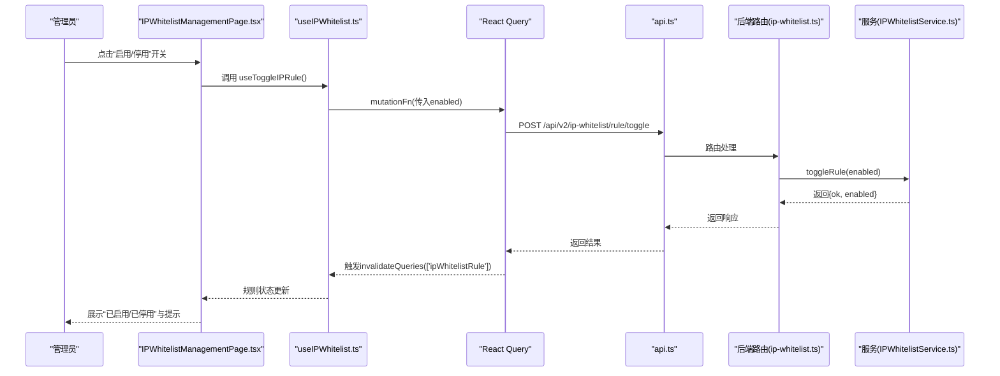
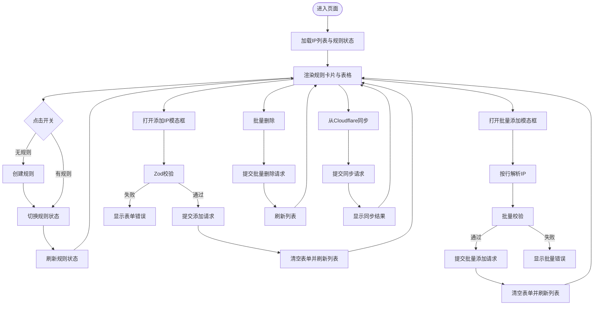
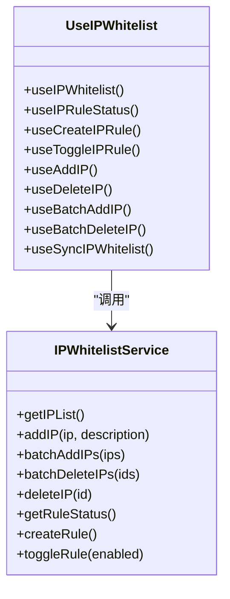
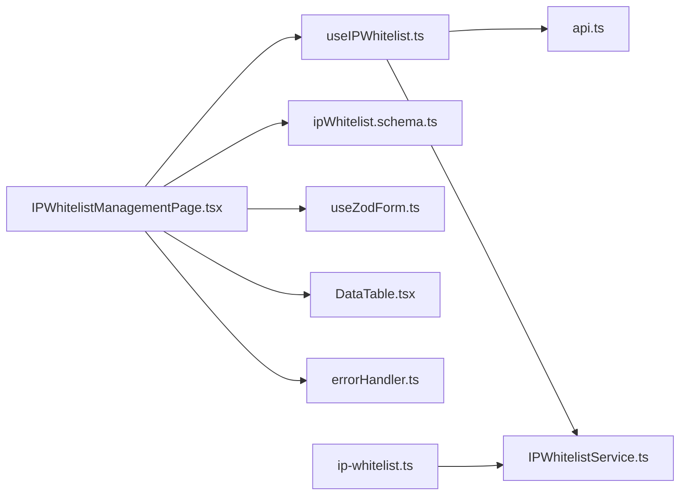

# 前端管理界面

<cite>
**本文引用的文件**
- [IPWhitelistManagementPage.tsx](file://frontend/src/features/system/pages/IPWhitelistManagementPage.tsx)
- [useIPWhitelist.ts](file://frontend/src/hooks/business/useIPWhitelist.ts)
- [ipWhitelist.schema.ts](file://frontend/src/validations/ipWhitelist.schema.ts)
- [api.ts](file://frontend/src/config/api.ts)
- [DataTable.tsx](file://frontend/src/components/common/DataTable.tsx)
- [useZodForm.ts](file://frontend/src/hooks/forms/useZodForm.ts)
- [errorHandler.ts](file://frontend/src/utils/errorHandler.ts)
- [ip-whitelist.ts](file://backend/src/routes/v2/ip-whitelist.ts)
- [IPWhitelistService.ts](file://backend/src/services/IPWhitelistService.ts)
- [ip-whitelist.test.ts](file://backend/test/routes/ip-whitelist.test.ts)
</cite>

## 目录
1. [简介](#简介)
2. [项目结构](#项目结构)
3. [核心组件](#核心组件)
4. [架构总览](#架构总览)
5. [详细组件分析](#详细组件分析)
6. [依赖关系分析](#依赖关系分析)
7. [性能考量](#性能考量)
8. [故障排查指南](#故障排查指南)
9. [结论](#结论)
10. [附录](#附录)

## 简介
本文件面向系统管理员与前端开发人员，全面介绍IP白名单前端管理界面的功能与实现。重点覆盖：
- IPWhitelistManagementPage.tsx 的UI布局、用户交互流程与状态管理机制
- 用户如何查看当前IP白名单规则、启用/禁用规则、添加或删除IP地址
- 前端通过API与后端IPWhitelistService交互，实现规则的同步与更新
- 表单验证、错误提示与操作反馈的最佳实践
- 界面如何展示规则状态与同步结果，帮助管理员清晰掌握安全策略执行情况

## 项目结构
该功能位于前端系统页面层与业务Hook层之间，采用“页面组件 + 业务Hook + 验证 + 工具函数”的分层组织方式；后端通过OpenAPI路由暴露REST接口，并由服务层对接Cloudflare IP列表。

图表来源
- [IPWhitelistManagementPage.tsx](file://frontend/src/features/system/pages/IPWhitelistManagementPage.tsx#L1-L343)
- [useIPWhitelist.ts](file://frontend/src/hooks/business/useIPWhitelist.ts#L1-L152)
- [ipWhitelist.schema.ts](file://frontend/src/validations/ipWhitelist.schema.ts#L1-L33)
- [useZodForm.ts](file://frontend/src/hooks/forms/useZodForm.ts#L1-L61)
- [DataTable.tsx](file://frontend/src/components/common/DataTable.tsx#L1-L189)
- [errorHandler.ts](file://frontend/src/utils/errorHandler.ts#L1-L178)
- [api.ts](file://frontend/src/config/api.ts#L120-L134)
- [ip-whitelist.ts](file://backend/src/routes/v2/ip-whitelist.ts#L1-L415)
- [IPWhitelistService.ts](file://backend/src/services/IPWhitelistService.ts#L1-L141)

章节来源
- [IPWhitelistManagementPage.tsx](file://frontend/src/features/system/pages/IPWhitelistManagementPage.tsx#L1-L343)
- [useIPWhitelist.ts](file://frontend/src/hooks/business/useIPWhitelist.ts#L1-L152)
- [ip-whitelist.ts](file://backend/src/routes/v2/ip-whitelist.ts#L1-L415)

## 核心组件
- 页面组件：负责UI布局、交互事件绑定、状态展示与操作反馈
- 业务Hook：封装查询与变更IP白名单、规则状态、批量操作与同步的请求
- 验证模块：基于Zod对单IP与批量IP进行格式校验
- 工具函数：统一错误处理与消息提示
- 数据表格：通用表格组件，支持分页、选择与操作列
- API配置：集中管理后端接口路径

章节来源
- [IPWhitelistManagementPage.tsx](file://frontend/src/features/system/pages/IPWhitelistManagementPage.tsx#L1-L343)
- [useIPWhitelist.ts](file://frontend/src/hooks/business/useIPWhitelist.ts#L1-L152)
- [ipWhitelist.schema.ts](file://frontend/src/validations/ipWhitelist.schema.ts#L1-L33)
- [DataTable.tsx](file://frontend/src/components/common/DataTable.tsx#L1-L189)
- [errorHandler.ts](file://frontend/src/utils/errorHandler.ts#L1-L178)
- [api.ts](file://frontend/src/config/api.ts#L120-L134)

## 架构总览
前端通过React Query的useQuery/useMutation管理状态与缓存；页面组件组合Ant Design UI控件与自定义组件，形成完整的管理界面。后端路由通过OpenAPI生成器定义接口契约，服务层对接Cloudflare IP列表，实现白名单的增删改查与规则启停。

图表来源
- [IPWhitelistManagementPage.tsx](file://frontend/src/features/system/pages/IPWhitelistManagementPage.tsx#L1-L343)
- [useIPWhitelist.ts](file://frontend/src/hooks/business/useIPWhitelist.ts#L56-L91)
- [api.ts](file://frontend/src/config/api.ts#L127-L133)
- [ip-whitelist.ts](file://backend/src/routes/v2/ip-whitelist.ts#L340-L381)
- [IPWhitelistService.ts](file://backend/src/services/IPWhitelistService.ts#L120-L139)

## 详细组件分析

### 页面组件：IPWhitelistManagementPage.tsx
- 功能职责
  - 展示规则状态卡片与规则表达式说明
  - 提供“启用/停用”开关，自动创建规则
  - 列表展示IP白名单，支持刷新、从Cloudflare同步、批量删除、批量添加、单条删除
  - 表单模态框支持单IP与批量IP添加
- 状态管理
  - 使用React Query查询IP列表与规则状态
  - 使用React Hook Form + Zod进行表单校验
  - 使用withErrorHandler统一处理成功/失败提示与回滚
- 交互流程
  - 切换开关：若规则不存在则先创建，再切换状态
  - 添加IP：表单校验通过后提交，清空表单并刷新列表
  - 批量添加：按行解析IP，逐条校验，返回成功/失败计数
  - 批量删除：基于表格选择项，调用批量删除接口
  - 同步：触发从Cloudflare同步，返回新增记录数量

图表来源
- [IPWhitelistManagementPage.tsx](file://frontend/src/features/system/pages/IPWhitelistManagementPage.tsx#L1-L343)
- [useIPWhitelist.ts](file://frontend/src/hooks/business/useIPWhitelist.ts#L1-L152)
- [ipWhitelist.schema.ts](file://frontend/src/validations/ipWhitelist.schema.ts#L1-L33)
- [useZodForm.ts](file://frontend/src/hooks/forms/useZodForm.ts#L1-L61)
- [errorHandler.ts](file://frontend/src/utils/errorHandler.ts#L1-L178)

章节来源
- [IPWhitelistManagementPage.tsx](file://frontend/src/features/system/pages/IPWhitelistManagementPage.tsx#L1-L343)

### 业务Hook：useIPWhitelist.ts
- 查询类Hook
  - useIPWhitelist：获取IP白名单列表，兼容不同后端响应结构
  - useIPRuleStatus：获取规则状态，实时性要求高，不缓存
- 变更类Hook（Mutation）
  - useCreateIPRule：创建规则
  - useToggleIPRule：切换规则启用/停用
  - useAddIP：添加单个IP
  - useDeleteIP：删除单个IP
  - useBatchAddIP：批量添加IP，返回成功/失败计数与错误明细
  - useBatchDeleteIP：批量删除IP，返回成功/失败计数
  - useSyncIPWhitelist：从Cloudflare同步IP列表

图表来源
- [useIPWhitelist.ts](file://frontend/src/hooks/business/useIPWhitelist.ts#L1-L152)
- [IPWhitelistService.ts](file://backend/src/services/IPWhitelistService.ts#L1-L141)

章节来源
- [useIPWhitelist.ts](file://frontend/src/hooks/business/useIPWhitelist.ts#L1-L152)

### 表单验证：ipWhitelist.schema.ts
- 单IP添加
  - 必填字段：ip_address
  - 校验规则：支持IPv4与IPv6（含CIDR），使用正则表达式
- 批量添加
  - 必填字段：ips_text（多行文本）
  - 校验规则：逐行校验，至少一行有效IP，支持IPv4/IPv6/CIDR

章节来源
- [ipWhitelist.schema.ts](file://frontend/src/validations/ipWhitelist.schema.ts#L1-L33)

### 数据表格：DataTable.tsx
- 支持列定义、分页、加载状态、行选择、操作列
- 在IP白名单页面中作为列表容器，右侧固定操作列包含“删除”确认弹窗
- 提供虚拟滚动优化大数据量场景

章节来源
- [DataTable.tsx](file://frontend/src/components/common/DataTable.tsx#L1-L189)

### 错误处理与消息提示：errorHandler.ts
- 统一封装API错误提取与提示
- withErrorHandler包装器：自动处理成功/失败消息、错误回调与finally回调
- useErrorHandler：Hook形式的错误处理与包装

章节来源
- [errorHandler.ts](file://frontend/src/utils/errorHandler.ts#L1-L178)

### API配置：api.ts
- 定义IP白名单相关接口路径
  - GET/POST/DELETE /api/v2/ip-whitelist
  - POST /api/v2/ip-whitelist/batch
  - POST /api/v2/ip-whitelist/sync
  - GET/POST /api/v2/ip-whitelist/rule
  - POST /api/v2/ip-whitelist/rule/create
  - POST /api/v2/ip-whitelist/rule/toggle

章节来源
- [api.ts](file://frontend/src/config/api.ts#L120-L134)

### 后端路由与服务：ip-whitelist.ts 与 IPWhitelistService.ts
- 路由层
  - 提供IP白名单列表、单条增删、批量增删、同步、规则状态查询与切换、规则创建
  - 使用OpenAPI生成器定义请求体与响应体Schema
- 服务层
  - 对接Cloudflare IP列表，实现增删改查与规则启停
  - 返回统一的数据结构，便于前端消费

章节来源
- [ip-whitelist.ts](file://backend/src/routes/v2/ip-whitelist.ts#L1-L415)
- [IPWhitelistService.ts](file://backend/src/services/IPWhitelistService.ts#L1-L141)

## 依赖关系分析
- 页面组件依赖业务Hook与UI组件
- 业务Hook依赖API配置与React Query
- 验证模块独立于UI，仅依赖Zod
- 错误处理模块为全局工具
- 后端路由与服务解耦，通过接口契约通信

图表来源
- [IPWhitelistManagementPage.tsx](file://frontend/src/features/system/pages/IPWhitelistManagementPage.tsx#L1-L343)
- [useIPWhitelist.ts](file://frontend/src/hooks/business/useIPWhitelist.ts#L1-L152)
- [ip-whitelist.ts](file://backend/src/routes/v2/ip-whitelist.ts#L1-L415)
- [IPWhitelistService.ts](file://backend/src/services/IPWhitelistService.ts#L1-L141)
- [api.ts](file://frontend/src/config/api.ts#L120-L134)

章节来源
- [IPWhitelistManagementPage.tsx](file://frontend/src/features/system/pages/IPWhitelistManagementPage.tsx#L1-L343)
- [useIPWhitelist.ts](file://frontend/src/hooks/business/useIPWhitelist.ts#L1-L152)
- [ip-whitelist.ts](file://backend/src/routes/v2/ip-whitelist.ts#L1-L415)

## 性能考量
- 列表查询缓存策略
  - IP白名单列表使用较短staleTime，避免过期数据导致频繁请求
  - 规则状态不缓存，保证实时性
- 表格优化
  - 大数据量场景启用虚拟滚动
  - 分页默认pageSize为20，减少一次性渲染压力
- 请求合并与去抖
  - 刷新按钮提供loading状态，避免重复请求
  - 批量操作返回成功/失败计数，减少多次轮询

[本节为通用建议，无需列出具体文件来源]

## 故障排查指南
- 常见问题与定位
  - 规则状态无法切换：检查权限与网络请求；确认后端路由是否返回正确响应
  - 添加IP失败：检查表单验证是否通过；查看批量添加返回的错误明细
  - 同步失败：确认Cloudflare凭据与网络连通性；查看后端日志
- 错误处理最佳实践
  - 使用withErrorHandler包装关键操作，统一提示与回滚
  - 对批量操作，结合message.warning与message.success分别提示成功与部分失败
  - 对规则启停，失败时回滚UI状态并提示重试

章节来源
- [errorHandler.ts](file://frontend/src/utils/errorHandler.ts#L1-L178)
- [ip-whitelist.test.ts](file://backend/test/routes/ip-whitelist.test.ts#L1-L168)

## 结论
该IP白名单前端管理界面通过清晰的分层设计与完善的错误处理机制，实现了规则状态可视化、IP列表管理与批量操作的高效体验。前后端通过OpenAPI契约协作，确保数据一致性与可维护性。建议在生产环境中持续关注权限控制、网络稳定性与审计日志，以保障安全策略的可靠执行。

[本节为总结性内容，无需列出具体文件来源]

## 附录

### API定义概览（与页面交互）
- 获取IP白名单列表：GET /api/v2/ip-whitelist
- 新增单个IP：POST /api/v2/ip-whitelist
- 批量新增IP：POST /api/v2/ip-whitelist/batch
- 批量删除IP：DELETE /api/v2/ip-whitelist/batch
- 删除单个IP：DELETE /api/v2/ip-whitelist/{id}
- 获取规则状态：GET /api/v2/ip-whitelist/rule
- 创建规则：POST /api/v2/ip-whitelist/rule/create
- 切换规则：POST /api/v2/ip-whitelist/rule/toggle
- 从Cloudflare同步：POST /api/v2/ip-whitelist/sync

章节来源
- [api.ts](file://frontend/src/config/api.ts#L120-L134)
- [ip-whitelist.ts](file://backend/src/routes/v2/ip-whitelist.ts#L52-L415)