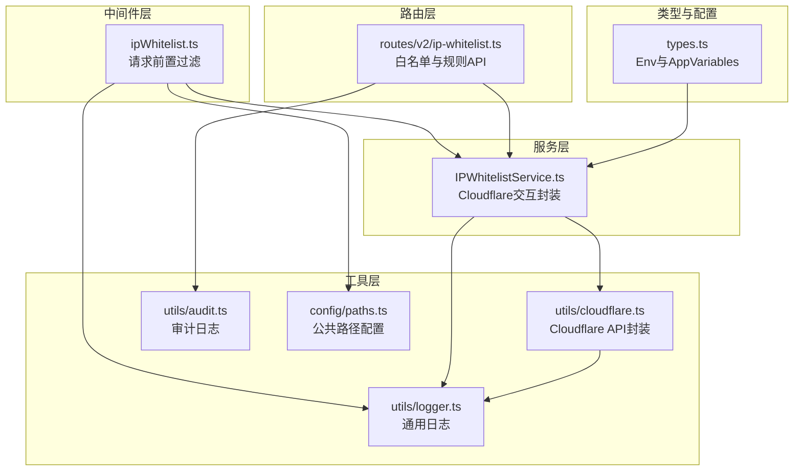
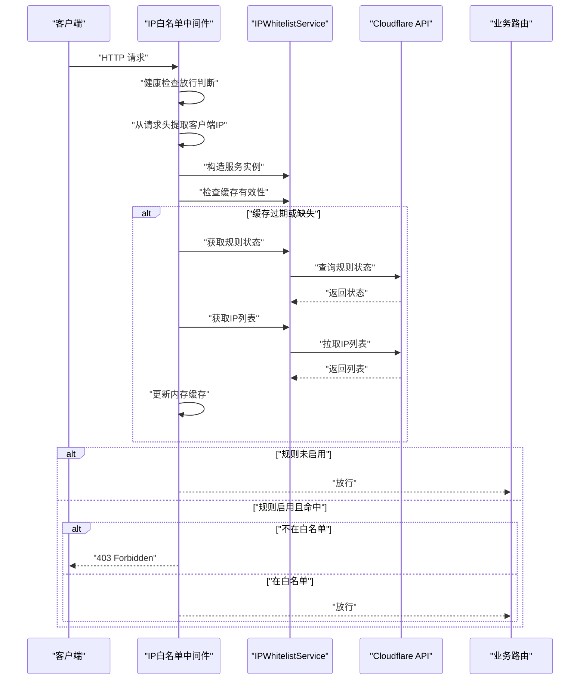
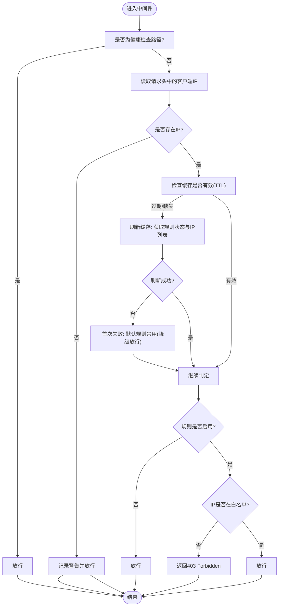
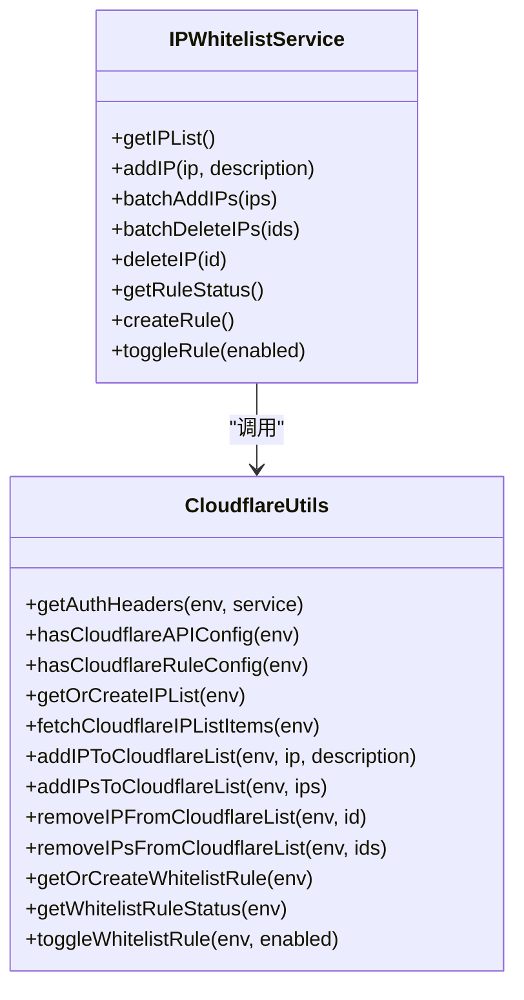
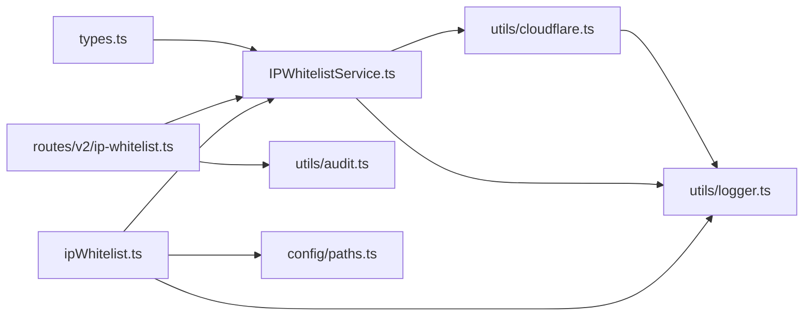

# 网络与IP安全

<cite>
**本文引用的文件**
- [backend/src/middleware/ipWhitelist.ts](file://backend/src/middleware/ipWhitelist.ts)
- [backend/src/services/IPWhitelistService.ts](file://backend/src/services/IPWhitelistService.ts)
- [backend/src/routes/v2/ip-whitelist.ts](file://backend/src/routes/v2/ip-whitelist.ts)
- [backend/src/utils/cloudflare.ts](file://backend/src/utils/cloudflare.ts)
- [backend/src/utils/audit.ts](file://backend/src/utils/audit.ts)
- [backend/src/utils/logger.ts](file://backend/src/utils/logger.ts)
- [backend/src/config/paths.ts](file://backend/src/config/paths.ts)
- [backend/src/types.ts](file://backend/src/types.ts)
</cite>

## 目录
1. [引言](#引言)
2. [项目结构](#项目结构)
3. [核心组件](#核心组件)
4. [架构总览](#架构总览)
5. [详细组件分析](#详细组件分析)
6. [依赖关系分析](#依赖关系分析)
7. [性能考量](#性能考量)
8. [故障排查指南](#故障排查指南)
9. [结论](#结论)
10. [附录](#附录)

## 引言
本专项文档聚焦于系统的IP白名单防护机制，围绕以下目标展开：
- 解析中间件如何通过请求头获取客户端IP，并结合内存缓存与TTL实现高性能访问控制。
- 说明系统与Cloudflare规则引擎的集成方式，包括IP列表与规则状态的同步与管理。
- 描述中间件的降级策略：当缓存刷新失败时，如何依据规则状态默认值决定“放行”或“拒绝”。
- 阐述白名单规则启用时，对非白名单IP返回403 Forbidden的处理逻辑。
- 解释健康检查接口被设计为始终放行的例外情况。
- 提供安全审计日志的记录方式与最佳实践。

## 项目结构
与IP白名单安全相关的关键文件分布如下：
- 中间件层：负责在请求进入应用前进行IP过滤与降级策略处理。
- 服务层：封装与Cloudflare的交互，提供IP列表、规则状态、开关等能力。
- 路由层：提供白名单管理与规则状态的API端点。
- 工具层：提供Cloudflare集成、审计日志、通用日志等能力。
- 配置与类型：定义公共路径（如健康检查）、运行时环境变量（Cloudflare凭据）等。

图表来源
- [backend/src/middleware/ipWhitelist.ts](file://backend/src/middleware/ipWhitelist.ts#L1-L76)
- [backend/src/services/IPWhitelistService.ts](file://backend/src/services/IPWhitelistService.ts#L1-L141)
- [backend/src/routes/v2/ip-whitelist.ts](file://backend/src/routes/v2/ip-whitelist.ts#L1-L415)
- [backend/src/utils/cloudflare.ts](file://backend/src/utils/cloudflare.ts#L1-L1067)
- [backend/src/utils/audit.ts](file://backend/src/utils/audit.ts#L1-L90)
- [backend/src/utils/logger.ts](file://backend/src/utils/logger.ts#L1-L111)
- [backend/src/config/paths.ts](file://backend/src/config/paths.ts#L1-L27)
- [backend/src/types.ts](file://backend/src/types.ts#L1-L109)

章节来源
- [backend/src/middleware/ipWhitelist.ts](file://backend/src/middleware/ipWhitelist.ts#L1-L76)
- [backend/src/services/IPWhitelistService.ts](file://backend/src/services/IPWhitelistService.ts#L1-L141)
- [backend/src/routes/v2/ip-whitelist.ts](file://backend/src/routes/v2/ip-whitelist.ts#L1-L415)
- [backend/src/utils/cloudflare.ts](file://backend/src/utils/cloudflare.ts#L1-L1067)
- [backend/src/utils/audit.ts](file://backend/src/utils/audit.ts#L1-L90)
- [backend/src/utils/logger.ts](file://backend/src/utils/logger.ts#L1-L111)
- [backend/src/config/paths.ts](file://backend/src/config/paths.ts#L1-L27)
- [backend/src/types.ts](file://backend/src/types.ts#L1-L109)

## 核心组件
- IP白名单中间件：在请求进入应用前，基于Cloudflare规则状态与内存缓存的IP集合进行快速判定；对健康检查路径放行；对缺失请求头或异常情况采用降级策略。
- IP白名单服务：封装Cloudflare API，提供IP列表获取、批量增删、规则状态查询与切换、规则创建等能力。
- 路由层API：提供白名单增删改查、批量操作、规则状态查询与切换、规则创建、同步等接口，并在关键操作上记录审计日志。
- Cloudflare工具：统一处理认证头、IP列表与规则的创建/查询/更新，屏蔽差异。
- 审计与日志：提供审计日志记录与通用日志输出，支持敏感信息脱敏与上下文注入。

章节来源
- [backend/src/middleware/ipWhitelist.ts](file://backend/src/middleware/ipWhitelist.ts#L1-L76)
- [backend/src/services/IPWhitelistService.ts](file://backend/src/services/IPWhitelistService.ts#L1-L141)
- [backend/src/routes/v2/ip-whitelist.ts](file://backend/src/routes/v2/ip-whitelist.ts#L1-L415)
- [backend/src/utils/cloudflare.ts](file://backend/src/utils/cloudflare.ts#L1-L1067)
- [backend/src/utils/audit.ts](file://backend/src/utils/audit.ts#L1-L90)
- [backend/src/utils/logger.ts](file://backend/src/utils/logger.ts#L1-L111)

## 架构总览
系统通过中间件在入口处进行IP白名单过滤，同时通过服务层与Cloudflare规则引擎联动，实现“云端规则+本地缓存”的双重保障。路由层提供管理接口，审计日志贯穿关键操作，日志工具提供统一的上下文与脱敏能力。

图表来源
- [backend/src/middleware/ipWhitelist.ts](file://backend/src/middleware/ipWhitelist.ts#L1-L76)
- [backend/src/services/IPWhitelistService.ts](file://backend/src/services/IPWhitelistService.ts#L1-L141)
- [backend/src/utils/cloudflare.ts](file://backend/src/utils/cloudflare.ts#L1-L1067)

## 详细组件分析

### 中间件工作流程与降级策略
- 健康检查放行：中间件在请求路径为健康检查接口时直接放行，避免误拦截。
- 客户端IP获取：优先从请求头中读取客户端IP；若缺失（如本地开发），中间件选择放行并记录警告，确保生产环境在Cloudflare代理下该头必达。
- 内存缓存与TTL：维护内存缓存与最后刷新时间，超过TTL后触发缓存刷新；刷新失败时保留旧缓存，若首次刷新失败则默认规则状态为“禁用”，从而采用“放行”的降级策略，保证可用性。
- 规则状态与白名单判定：当规则启用时，若客户端IP不在缓存集合内，则返回403 Forbidden；否则放行。
- 错误处理：捕获异常并返回500，同时记录错误日志。

图表来源
- [backend/src/middleware/ipWhitelist.ts](file://backend/src/middleware/ipWhitelist.ts#L1-L76)

章节来源
- [backend/src/middleware/ipWhitelist.ts](file://backend/src/middleware/ipWhitelist.ts#L1-L76)

### 与Cloudflare规则引擎的集成
- IP列表与规则状态：服务层通过Cloudflare API获取IP列表与规则状态，支持创建/切换规则、批量增删IP等。
- 规则表达式：规则表达式基于Cloudflare的列表引用，实现“不在白名单即阻断”的效果。
- 凭据与鉴权：通过环境变量提供Cloudflare专用Token与账户/Zone信息，工具层按服务类型组装认证头。
- 状态同步：中间件与管理API均以Cloudflare实时状态为准，避免本地状态与云端状态不一致。

图表来源
- [backend/src/services/IPWhitelistService.ts](file://backend/src/services/IPWhitelistService.ts#L1-L141)
- [backend/src/utils/cloudflare.ts](file://backend/src/utils/cloudflare.ts#L1-L1067)

章节来源
- [backend/src/services/IPWhitelistService.ts](file://backend/src/services/IPWhitelistService.ts#L1-L141)
- [backend/src/utils/cloudflare.ts](file://backend/src/utils/cloudflare.ts#L1-L1067)

### 白名单规则启用时的拒绝逻辑
- 当规则启用且客户端IP不在白名单集合时，中间件返回403 Forbidden，并记录警告日志，便于审计追踪。
- 该行为由中间件在判定阶段直接触发，无需进一步路由处理。

章节来源
- [backend/src/middleware/ipWhitelist.ts](file://backend/src/middleware/ipWhitelist.ts#L1-L76)
- [backend/src/utils/logger.ts](file://backend/src/utils/logger.ts#L1-L111)

### 健康检查接口的例外放行
- 健康检查路径在中间件中被明确放行，避免因规则开启导致监控探针被阻断。
- 公共路径配置集中维护，便于扩展更多公开路径。

章节来源
- [backend/src/middleware/ipWhitelist.ts](file://backend/src/middleware/ipWhitelist.ts#L1-L76)
- [backend/src/config/paths.ts](file://backend/src/config/paths.ts#L1-L27)

### 审计日志记录与最佳实践
- 审计日志：在关键管理操作（新增、批量新增、批量删除、删除、同步、更新规则状态、创建规则）完成后记录审计事件，包含操作类型、实体、实体ID、详情与客户端IP/归属地信息。
- 日志上下文：日志工具自动注入请求ID、用户ID与客户端IP，支持敏感信息脱敏，避免泄露。
- 最佳实践：
  - 在高并发场景下，审计日志采用异步提交，避免阻塞主请求链路。
  - 对于缺少用户上下文的请求，尽量通过会话或Cookie获取用户标识，确保审计完整性。
  - 对于Cloudflare代理场景，优先使用标准请求头获取真实客户端IP与归属地信息。

章节来源
- [backend/src/routes/v2/ip-whitelist.ts](file://backend/src/routes/v2/ip-whitelist.ts#L1-L415)
- [backend/src/utils/audit.ts](file://backend/src/utils/audit.ts#L1-L90)
- [backend/src/utils/logger.ts](file://backend/src/utils/logger.ts#L1-L111)

## 依赖关系分析
- 中间件依赖服务层提供的规则状态与IP列表能力，并通过内存缓存减少Cloudflare API调用频率。
- 服务层依赖Cloudflare工具进行统一的API调用与认证处理。
- 路由层依赖服务层与审计工具，实现白名单与规则的管理与审计。
- 类型与配置为各层提供运行时环境与公共路径定义。

图表来源
- [backend/src/middleware/ipWhitelist.ts](file://backend/src/middleware/ipWhitelist.ts#L1-L76)
- [backend/src/services/IPWhitelistService.ts](file://backend/src/services/IPWhitelistService.ts#L1-L141)
- [backend/src/routes/v2/ip-whitelist.ts](file://backend/src/routes/v2/ip-whitelist.ts#L1-L415)
- [backend/src/utils/cloudflare.ts](file://backend/src/utils/cloudflare.ts#L1-L1067)
- [backend/src/utils/audit.ts](file://backend/src/utils/audit.ts#L1-L90)
- [backend/src/utils/logger.ts](file://backend/src/utils/logger.ts#L1-L111)
- [backend/src/config/paths.ts](file://backend/src/config/paths.ts#L1-L27)
- [backend/src/types.ts](file://backend/src/types.ts#L1-L109)

章节来源
- [backend/src/middleware/ipWhitelist.ts](file://backend/src/middleware/ipWhitelist.ts#L1-L76)
- [backend/src/services/IPWhitelistService.ts](file://backend/src/services/IPWhitelistService.ts#L1-L141)
- [backend/src/routes/v2/ip-whitelist.ts](file://backend/src/routes/v2/ip-whitelist.ts#L1-L415)
- [backend/src/utils/cloudflare.ts](file://backend/src/utils/cloudflare.ts#L1-L1067)
- [backend/src/utils/audit.ts](file://backend/src/utils/audit.ts#L1-L90)
- [backend/src/utils/logger.ts](file://backend/src/utils/logger.ts#L1-L111)
- [backend/src/config/paths.ts](file://backend/src/config/paths.ts#L1-L27)
- [backend/src/types.ts](file://backend/src/types.ts#L1-L109)

## 性能考量
- 内存缓存与TTL：中间件使用内存缓存与60秒TTL，显著降低Cloudflare API调用频次，提高响应速度。
- 降级策略：缓存刷新失败时采用“放行”降级，避免因外部依赖异常导致服务不可用。
- 异步审计：审计日志采用异步提交，避免阻塞主请求链路。
- 云原生优化：通过Cloudflare代理与规则引擎实现网络层防护，减少应用层负担。

章节来源
- [backend/src/middleware/ipWhitelist.ts](file://backend/src/middleware/ipWhitelist.ts#L1-L76)
- [backend/src/utils/audit.ts](file://backend/src/utils/audit.ts#L1-L90)

## 故障排查指南
- 健康检查被拒绝：确认中间件对健康检查路径的放行逻辑是否生效，检查公共路径配置。
- 本地开发被放行：中间件在缺失客户端IP头时会放行并记录警告，属于预期行为。
- 缓存刷新失败：查看日志中关于缓存刷新失败的错误记录，确认Cloudflare凭据与网络连通性。
- 规则状态不一致：确认Cloudflare规则状态与中间件缓存是否一致，必要时手动触发同步或调整TTL。
- 审计日志缺失：检查审计服务是否注入到上下文，以及异步提交是否正常执行。

章节来源
- [backend/src/middleware/ipWhitelist.ts](file://backend/src/middleware/ipWhitelist.ts#L1-L76)
- [backend/src/utils/logger.ts](file://backend/src/utils/logger.ts#L1-L111)
- [backend/src/utils/audit.ts](file://backend/src/utils/audit.ts#L1-L90)

## 结论
该系统通过中间件+服务层+Cloudflare规则引擎的组合，实现了高效、可靠的IP白名单防护。中间件以内存缓存与TTL提升性能，并在缓存刷新失败时采用“放行”降级策略，确保可用性；路由层提供完善的白名单与规则管理API，并在关键操作上记录审计日志；日志工具提供统一上下文与脱敏能力，满足安全审计需求。整体方案兼顾安全性、性能与可运维性。

## 附录
- 关键环境变量（Cloudflare相关）：用于配置Cloudflare专用Token与账户/Zone信息，确保服务层能够正确调用API。
- 公共路径：集中维护健康检查与公开接口，避免被白名单规则误拦截。

章节来源
- [backend/src/types.ts](file://backend/src/types.ts#L1-L109)
- [backend/src/config/paths.ts](file://backend/src/config/paths.ts#L1-L27)