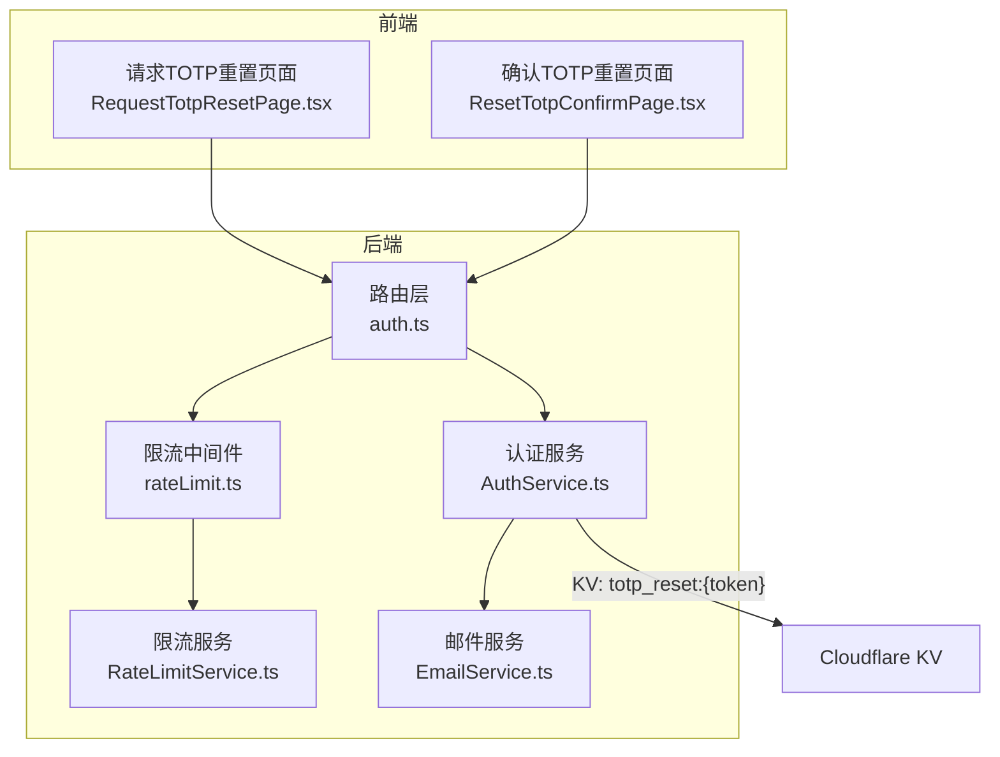
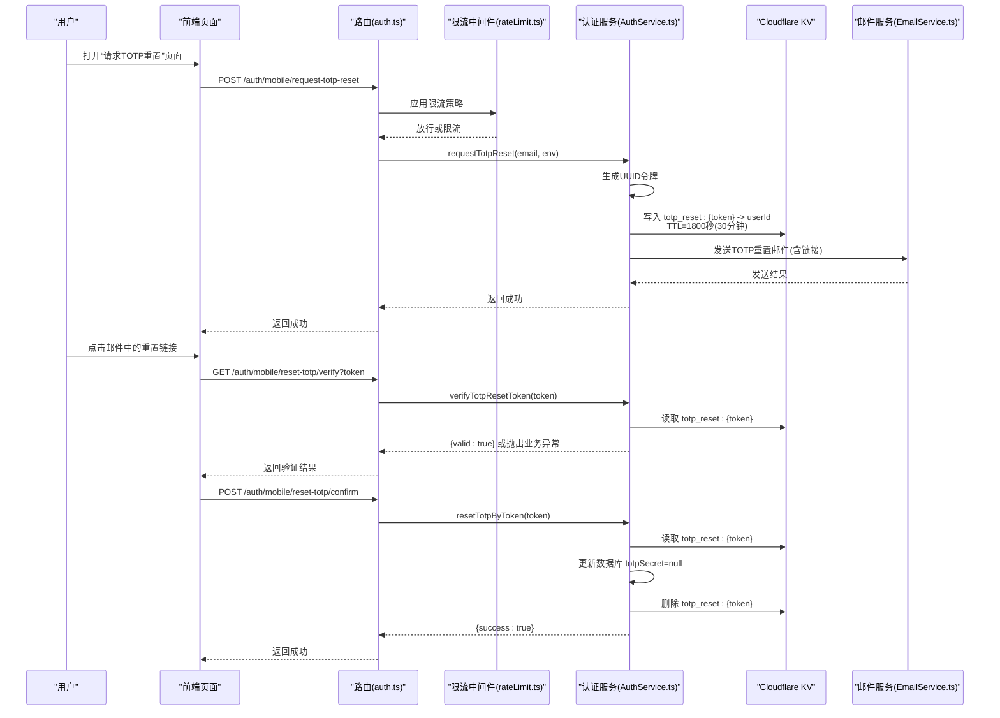
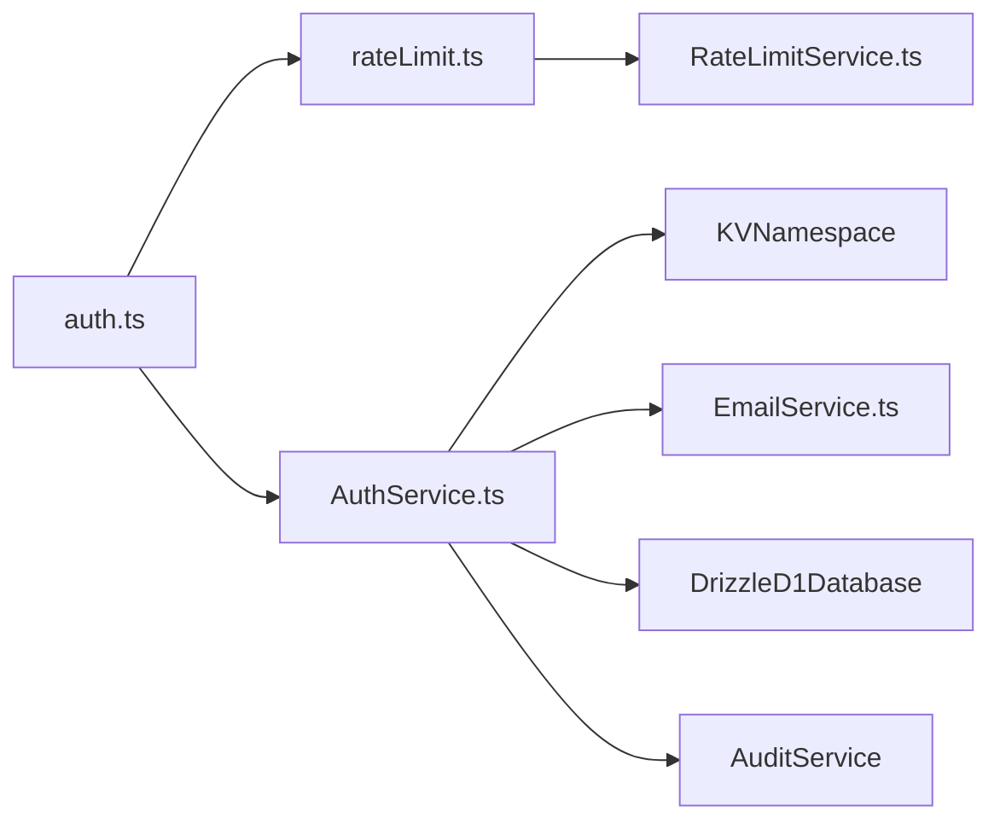

# TOTP重置

<cite>
**本文引用的文件**
- [backend/src/routes/v2/auth.ts](file://backend/src/routes/v2/auth.ts)
- [backend/src/services/AuthService.ts](file://backend/src/services/AuthService.ts)
- [backend/src/services/EmailService.ts](file://backend/src/services/EmailService.ts)
- [backend/src/middleware/rateLimit.ts](file://backend/src/middleware/rateLimit.ts)
- [backend/src/services/RateLimitService.ts](file://backend/src/services/RateLimitService.ts)
- [frontend/src/features/auth/pages/RequestTotpResetPage.tsx](file://frontend/src/features/auth/pages/RequestTotpResetPage.tsx)
- [frontend/src/features/auth/pages/ResetTotpConfirmPage.tsx](file://frontend/src/features/auth/pages/ResetTotpConfirmPage.tsx)
</cite>

## 目录
1. [简介](#简介)
2. [项目结构](#项目结构)
3. [核心组件](#核心组件)
4. [架构总览](#架构总览)
5. [详细组件分析](#详细组件分析)
6. [依赖分析](#依赖分析)
7. [性能考虑](#性能考虑)
8. [故障排查指南](#故障排查指南)
9. [结论](#结论)

## 简介
本文件面向“当用户丢失2FA设备时的TOTP重置流程”。目标是帮助读者理解从请求重置、验证链接有效性、到最终解除绑定并清理令牌的完整过程，以及该流程如何通过短期有效令牌与一次性使用特性保障安全。

## 项目结构
TOTP重置相关功能分布在后端路由、服务层、限流中间件与前端页面之间，形成前后端协作闭环：
- 路由层提供三个REST端点：请求重置、验证重置令牌、确认重置。
- 服务层负责生成短期令牌、写入KV、发送邮件、校验与重置。
- 限流中间件对请求进行速率控制，降低滥用风险。
- 前端页面负责引导用户输入邮箱、展示验证与确认结果。

图表来源
- [backend/src/routes/v2/auth.ts](file://backend/src/routes/v2/auth.ts#L573-L687)
- [backend/src/services/AuthService.ts](file://backend/src/services/AuthService.ts#L444-L494)
- [backend/src/services/EmailService.ts](file://backend/src/services/EmailService.ts#L338-L382)
- [backend/src/middleware/rateLimit.ts](file://backend/src/middleware/rateLimit.ts#L84-L97)
- [backend/src/services/RateLimitService.ts](file://backend/src/services/RateLimitService.ts#L106-L145)

章节来源
- [backend/src/routes/v2/auth.ts](file://backend/src/routes/v2/auth.ts#L573-L687)
- [frontend/src/features/auth/pages/RequestTotpResetPage.tsx](file://frontend/src/features/auth/pages/RequestTotpResetPage.tsx#L1-L91)
- [frontend/src/features/auth/pages/ResetTotpConfirmPage.tsx](file://frontend/src/features/auth/pages/ResetTotpConfirmPage.tsx#L1-L121)

## 核心组件
- 请求TOTP重置端点：接收用户邮箱，生成短期令牌并写入KV，同时发送带重置链接的邮件。
- 验证TOTP重置令牌端点：检查KV中是否存在该令牌，确保其短期有效。
- 确认TOTP重置端点：使用令牌定位用户，清空数据库中的totpSecret字段，同时删除KV中的令牌，完成一次性使用。

章节来源
- [backend/src/routes/v2/auth.ts](file://backend/src/routes/v2/auth.ts#L573-L687)
- [backend/src/services/AuthService.ts](file://backend/src/services/AuthService.ts#L444-L494)

## 架构总览
下图展示了从用户发起请求到完成重置的关键交互序列。

图表来源
- [backend/src/routes/v2/auth.ts](file://backend/src/routes/v2/auth.ts#L573-L687)
- [backend/src/services/AuthService.ts](file://backend/src/services/AuthService.ts#L444-L494)
- [backend/src/services/EmailService.ts](file://backend/src/services/EmailService.ts#L338-L382)
- [backend/src/middleware/rateLimit.ts](file://backend/src/middleware/rateLimit.ts#L84-L97)

## 详细组件分析

### 请求TOTP重置：requestTotpReset
- 输入：用户邮箱（支持公司邮箱或个人邮箱）
- 处理：
  - 查询员工记录，若不存在则静默返回成功（避免邮箱枚举）
  - 生成短令牌（UUID去横线），写入KV，键名格式为“totp_reset:{token}”，TTL=1800秒（30分钟）
  - 选择个人邮箱优先，否则回退到公司邮箱，发送包含重置链接的邮件
  - 记录审计日志
- 输出：统一返回“成功”，即使用户不存在

章节来源
- [backend/src/services/AuthService.ts](file://backend/src/services/AuthService.ts#L444-L469)
- [backend/src/services/EmailService.ts](file://backend/src/services/EmailService.ts#L338-L382)

### 验证TOTP重置令牌：verifyTotpResetToken
- 输入：查询参数token
- 处理：从KV读取“totp_reset:{token}”
- 结果：
  - 若存在：返回{valid:true}
  - 若不存在：抛出业务异常（无效或已过期）

章节来源
- [backend/src/services/AuthService.ts](file://backend/src/services/AuthService.ts#L471-L478)

### 确认TOTP重置：resetTotpByToken
- 输入：请求体token
- 处理：
  - 从KV读取“totp_reset:{token}”，若不存在则抛出业务异常
  - 将数据库中该用户的totpSecret字段置空，解除2FA绑定
  - 删除KV中的“totp_reset:{token}”条目，确保令牌一次性使用
  - 记录审计日志
- 输出：{success:true}

章节来源
- [backend/src/services/AuthService.ts](file://backend/src/services/AuthService.ts#L480-L494)

### 限流策略与安全
- 对“请求TOTP重置”接口应用按邮箱的限流（每邮箱每小时最多3次），降低暴力请求风险
- 限流实现基于Cloudflare KV的滑动窗口算法，记录每个键的请求时间戳并设置TTL

章节来源
- [backend/src/middleware/rateLimit.ts](file://backend/src/middleware/rateLimit.ts#L84-L97)
- [backend/src/services/RateLimitService.ts](file://backend/src/services/RateLimitService.ts#L106-L145)

### 前端交互
- 请求TOTP重置页面：用户输入邮箱并提交，无论邮箱是否存在均提示“邮件已发送”，防止枚举
- 确认TOTP重置页面：自动验证链接有效性；验证失败提示重新发送；验证通过后弹出确认框，确认后执行重置

章节来源
- [frontend/src/features/auth/pages/RequestTotpResetPage.tsx](file://frontend/src/features/auth/pages/RequestTotpResetPage.tsx#L1-L91)
- [frontend/src/features/auth/pages/ResetTotpConfirmPage.tsx](file://frontend/src/features/auth/pages/ResetTotpConfirmPage.tsx#L1-L121)

## 依赖分析
- 路由依赖限流中间件，确保敏感接口受控
- 认证服务依赖KV命名空间、数据库、邮件服务与审计服务
- 限流服务依赖KV命名空间，实现滑动窗口计数与TTL管理

图表来源
- [backend/src/routes/v2/auth.ts](file://backend/src/routes/v2/auth.ts#L573-L687)
- [backend/src/middleware/rateLimit.ts](file://backend/src/middleware/rateLimit.ts#L84-L97)
- [backend/src/services/RateLimitService.ts](file://backend/src/services/RateLimitService.ts#L1-L105)
- [backend/src/services/AuthService.ts](file://backend/src/services/AuthService.ts#L1-L33)

章节来源
- [backend/src/services/AuthService.ts](file://backend/src/services/AuthService.ts#L1-L33)
- [backend/src/services/RateLimitService.ts](file://backend/src/services/RateLimitService.ts#L1-L105)

## 性能考虑
- KV写入与读取均为O(1)，验证与重置均为单键操作，延迟低
- 限流服务采用滑动窗口，内存占用与写入开销可控
- 邮件发送为异步I/O，不影响主流程响应

## 故障排查指南
- 邮件未收到
  - 检查邮箱是否为个人邮箱或公司邮箱之一
  - 确认邮件模板中的链接有效期为30分钟
  - 前端页面提示“邮件已发送”，即使邮箱不存在也会如此提示
- 链接无效或已过期
  - 验证端点返回无效或抛出业务异常
  - 重新在前端发起“请求TOTP重置”
- 重置失败
  - 确认令牌仍处于KV中（一次性使用后会被删除）
  - 检查数据库更新是否成功（totpSecret应为空）
- 频繁请求被限流
  - 每邮箱每小时最多3次请求
  - 等待窗口到期或减少请求频率

章节来源
- [backend/src/services/AuthService.ts](file://backend/src/services/AuthService.ts#L471-L494)
- [backend/src/services/EmailService.ts](file://backend/src/services/EmailService.ts#L338-L382)
- [backend/src/middleware/rateLimit.ts](file://backend/src/middleware/rateLimit.ts#L84-L97)
- [backend/src/services/RateLimitService.ts](file://backend/src/services/RateLimitService.ts#L106-L145)

## 结论
TOTP重置流程通过短期有效令牌（30分钟）、一次性使用（重置后删除KV键）与严格的限流策略，有效平衡了可用性与安全性。前端页面清晰引导用户完成验证与确认，后端服务在KV与数据库间保持一致状态，确保用户在丢失2FA设备后能够安全地解除绑定并恢复登录。