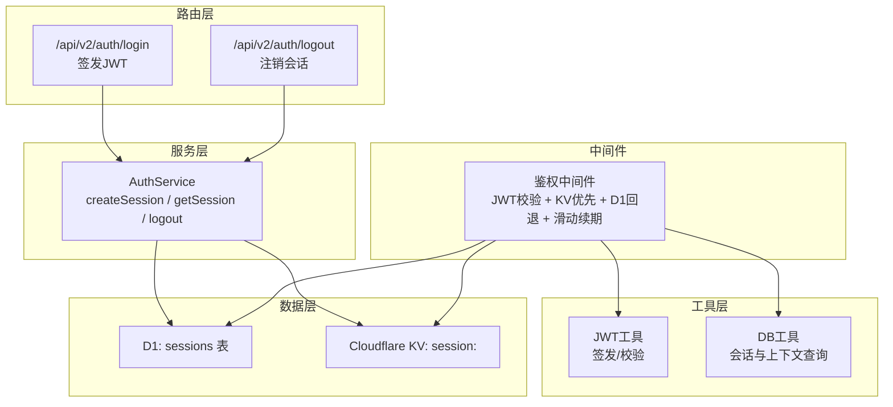
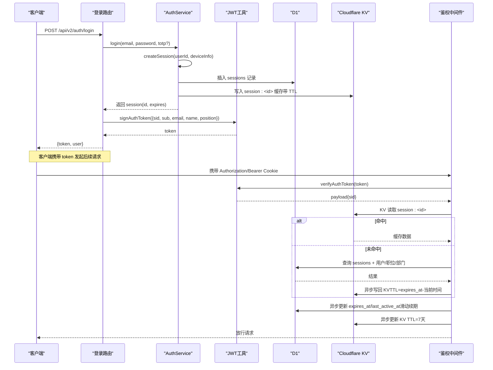
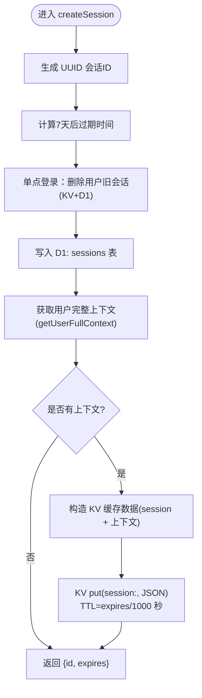
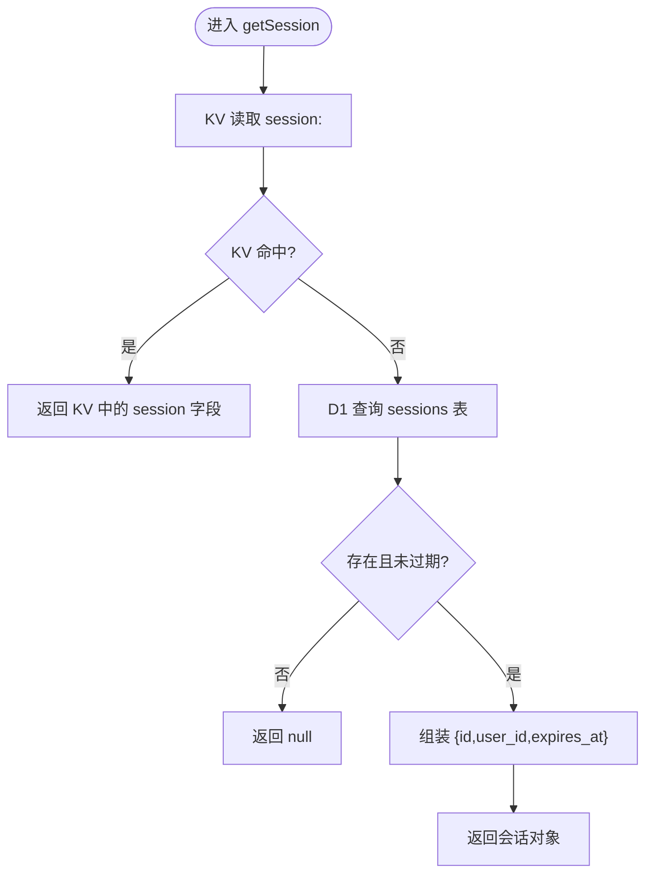
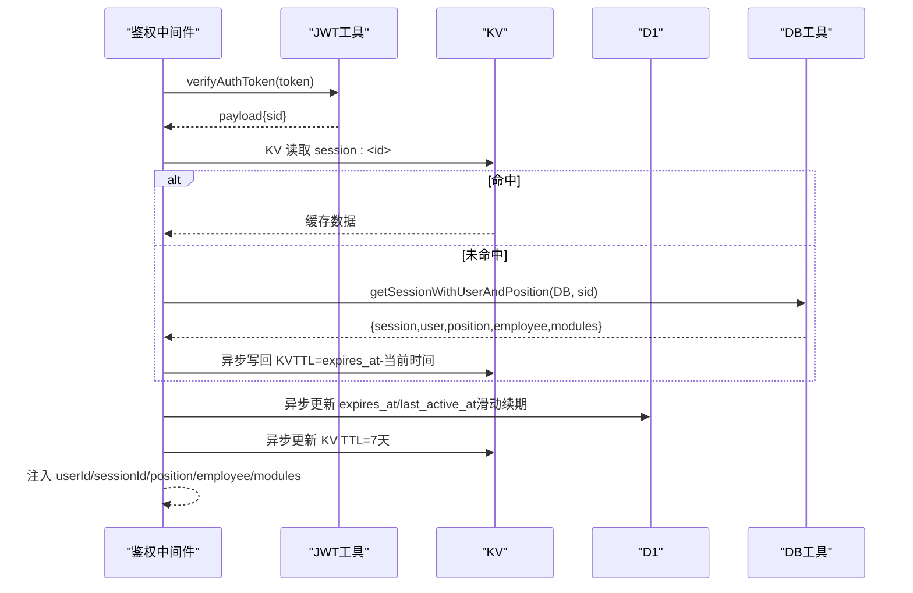
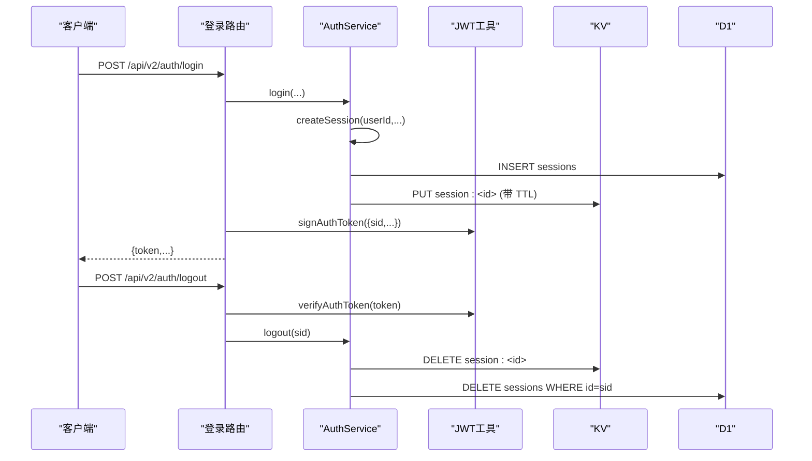
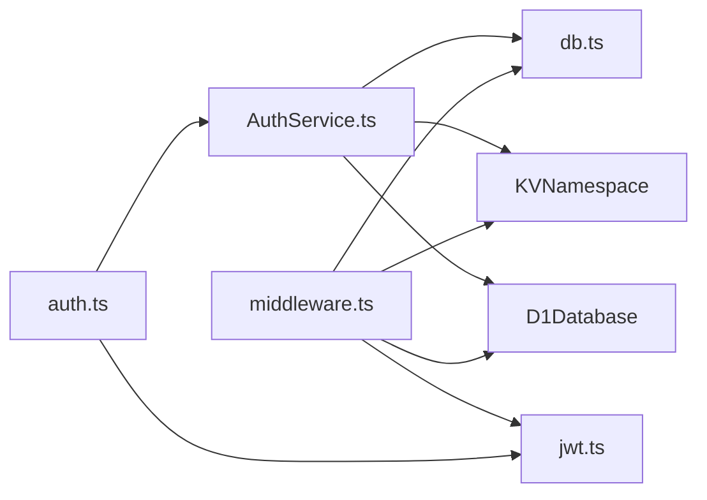
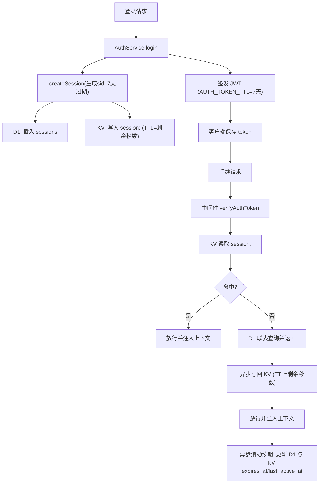

# 会话管理

<cite>
**本文引用的文件**
- [AuthService.ts](file://backend/src/services/AuthService.ts)
- [middleware.ts](file://backend/src/middleware.ts)
- [jwt.ts](file://backend/src/utils/jwt.ts)
- [db.ts](file://backend/src/utils/db.ts)
- [schema.ts](file://backend/src/db/schema.ts)
- [auth.ts](file://backend/src/routes/v2/auth.ts)
- [types.ts](file://backend/src/types.ts)
- [paths.ts](file://backend/src/config/paths.ts)
- [auth.test.ts](file://backend/test/routes/v2/auth.test.ts)
</cite>

## 目录
1. [简介](#简介)
2. [项目结构](#项目结构)
3. [核心组件](#核心组件)
4. [架构总览](#架构总览)
5. [详细组件分析](#详细组件分析)
6. [依赖关系分析](#依赖关系分析)
7. [性能考量](#性能考量)
8. [故障排查指南](#故障排查指南)
9. [结论](#结论)
10. [附录](#附录)

## 简介
本专项文档聚焦于基于 JWT 与 Cloudflare KV/D1 的会话管理实现，围绕以下目标展开：
- 深入解析 createSession 与 getSession 的协作机制：createSession 生成 UUID 会话 ID，设置 7 天过期策略，并通过单点登录机制删除用户所有旧会话（同时清理 KV 与 D1 记录）；getSession 在 KV 命中时直接返回，未命中则回退到 D1 查询并验证过期。
- 描述会话数据在 D1 的持久化存储（用于审计）与在 KV 的高性能缓存（用于快速验证）的双重写入策略。
- 解释中间件层的滑动窗口续期与 KV 回写逻辑，确保活跃用户会话持续有效。
- 总结会话数据结构（id、user_id、expires_at），并给出安全最佳实践（会话 ID 生成、TTL 设置、清理机制）。

## 项目结构
会话管理涉及的关键模块与文件如下：
- 服务层：AuthService 提供登录、创建会话、获取会话、登出等能力
- 中间件：鉴权中间件负责从 JWT 提取会话标识，优先从 KV 读取会话，未命中回退 D1，并进行滑动窗口续期
- 工具层：JWT 工具负责签发与校验；DB 工具提供会话与用户上下文查询
- 数据模型：D1 sessions 表定义会话字段
- 路由层：登录与登出接口，登录成功后签发 JWT
- 类型与配置：环境变量声明 KV 与 D1、公共路径配置

图表来源
- [AuthService.ts](file://backend/src/services/AuthService.ts#L150-L218)
- [middleware.ts](file://backend/src/middleware.ts#L1-L120)
- [jwt.ts](file://backend/src/utils/jwt.ts#L56-L132)
- [db.ts](file://backend/src/utils/db.ts#L45-L147)
- [schema.ts](file://backend/src/db/schema.ts#L118-L126)

章节来源
- [AuthService.ts](file://backend/src/services/AuthService.ts#L150-L218)
- [middleware.ts](file://backend/src/middleware.ts#L1-L120)
- [jwt.ts](file://backend/src/utils/jwt.ts#L56-L132)
- [db.ts](file://backend/src/utils/db.ts#L45-L147)
- [schema.ts](file://backend/src/db/schema.ts#L118-L126)
- [auth.ts](file://backend/src/routes/v2/auth.ts#L43-L128)
- [types.ts](file://backend/src/types.ts#L1-L20)
- [paths.ts](file://backend/src/config/paths.ts#L1-L27)

## 核心组件
- 会话服务（AuthService）
  - createSession：生成 UUID 会话 ID，设置 7 天过期；单点登录删除旧会话（KV 与 D1）；双写 D1 与 KV
  - getSession：优先 KV，未命中回退 D1，并验证过期
  - logout：审计后删除 KV 与 D1 中的会话
- 鉴权中间件（middleware）
  - 从 JWT 提取 sid，KV 优先读取，未命中回退 D1 并异步写回 KV
  - 活跃用户滑动窗口续期：更新 D1 与 KV 的 expires_at 与 last_active_at
- JWT 工具（jwt）
  - AUTH_TOKEN_TTL 与 AUTH_COOKIE_NAME 常量
  - 签发与校验 JWT，payload 包含 sid、sub、email、name、position 等
- DB 工具（db）
  - getSessionWithUserAndPosition：一次性联表查询会话与用户、职位、部门模块信息
  - getUserFullContext：获取用户完整上下文（用于 KV 缓存）
- 数据模型（schema）
  - sessions 表：id、user_id、expires_at、ip_address、user_agent、created_at、last_active_at

章节来源
- [AuthService.ts](file://backend/src/services/AuthService.ts#L150-L227)
- [middleware.ts](file://backend/src/middleware.ts#L1-L120)
- [jwt.ts](file://backend/src/utils/jwt.ts#L56-L132)
- [db.ts](file://backend/src/utils/db.ts#L45-L147)
- [schema.ts](file://backend/src/db/schema.ts#L118-L126)

## 架构总览
下图展示登录、会话创建与中间件鉴权的整体流程，以及 KV 与 D1 的交互关系。

图表来源
- [auth.ts](file://backend/src/routes/v2/auth.ts#L43-L128)
- [AuthService.ts](file://backend/src/services/AuthService.ts#L150-L198)
- [jwt.ts](file://backend/src/utils/jwt.ts#L72-L124)
- [middleware.ts](file://backend/src/middleware.ts#L1-L120)
- [db.ts](file://backend/src/utils/db.ts#L45-L147)

## 详细组件分析

### 会话创建：createSession
- 生成 UUID 会话 ID
- 设置 7 天过期时间（与 JWT TTL 保持一致）
- 单点登录策略：删除该用户所有旧会话（KV 与 D1）
- 双写策略：
  - D1：插入 sessions 记录（持久化与审计）
  - KV：写入完整上下文（包含 session 与用户/职位/部门信息），TTL 为会话剩余秒数

图表来源
- [AuthService.ts](file://backend/src/services/AuthService.ts#L150-L198)
- [db.ts](file://backend/src/utils/db.ts#L149-L239)

章节来源
- [AuthService.ts](file://backend/src/services/AuthService.ts#L150-L198)
- [db.ts](file://backend/src/utils/db.ts#L149-L239)

### 会话读取：getSession
- 优先从 KV 获取会话缓存
- 若未命中，回退到 D1 查询并验证是否过期
- 返回标准化会话对象（id、user_id、expires_at）

图表来源
- [AuthService.ts](file://backend/src/services/AuthService.ts#L200-L218)
- [db.ts](file://backend/src/utils/db.ts#L32-L38)

章节来源
- [AuthService.ts](file://backend/src/services/AuthService.ts#L200-L218)
- [db.ts](file://backend/src/utils/db.ts#L32-L38)

### 中间件鉴权与滑动续期
- 从 JWT 提取 sid，优先从 KV 读取会话缓存
- 未命中则调用 getSessionWithUserAndPosition 一次性联表查询并异步写回 KV
- 对活跃用户进行滑动窗口续期：更新 D1 与 KV 的 expires_at 与 last_active_at
- 将用户与会话信息注入上下文，供后续路由使用

图表来源
- [middleware.ts](file://backend/src/middleware.ts#L1-L120)
- [jwt.ts](file://backend/src/utils/jwt.ts#L96-L132)
- [db.ts](file://backend/src/utils/db.ts#L45-L147)

章节来源
- [middleware.ts](file://backend/src/middleware.ts#L1-L120)
- [jwt.ts](file://backend/src/utils/jwt.ts#L96-L132)
- [db.ts](file://backend/src/utils/db.ts#L45-L147)

### 登录与登出流程
- 登录：AuthService.login 完成认证与 2FA 校验后调用 createSession，随后路由层签发 JWT
- 登出：路由层提取 JWT，AuthService.logout 审计后删除 KV 与 D1 中的会话

图表来源
- [auth.ts](file://backend/src/routes/v2/auth.ts#L43-L128)
- [AuthService.ts](file://backend/src/services/AuthService.ts#L150-L227)
- [jwt.ts](file://backend/src/utils/jwt.ts#L72-L124)

章节来源
- [auth.ts](file://backend/src/routes/v2/auth.ts#L43-L128)
- [AuthService.ts](file://backend/src/services/AuthService.ts#L150-L227)
- [jwt.ts](file://backend/src/utils/jwt.ts#L72-L124)

## 依赖关系分析
- 会话服务依赖：
  - D1：持久化存储 sessions
  - KV：高性能缓存 session:<id>
  - DB 工具：获取用户上下文与联表查询
  - JWT 工具：签发与校验令牌
- 中间件依赖：
  - JWT 工具：校验令牌
  - DB 工具：回退查询
  - KV 与 D1：读写会话缓存与持久化
- 路由层依赖：
  - AuthService：登录与登出
  - JWT 工具：签发令牌

图表来源
- [auth.ts](file://backend/src/routes/v2/auth.ts#L43-L128)
- [AuthService.ts](file://backend/src/services/AuthService.ts#L150-L227)
- [middleware.ts](file://backend/src/middleware.ts#L1-L120)
- [jwt.ts](file://backend/src/utils/jwt.ts#L56-L132)
- [db.ts](file://backend/src/utils/db.ts#L45-L147)
- [types.ts](file://backend/src/types.ts#L1-L20)

章节来源
- [auth.ts](file://backend/src/routes/v2/auth.ts#L43-L128)
- [AuthService.ts](file://backend/src/services/AuthService.ts#L150-L227)
- [middleware.ts](file://backend/src/middleware.ts#L1-L120)
- [jwt.ts](file://backend/src/utils/jwt.ts#L56-L132)
- [db.ts](file://backend/src/utils/db.ts#L45-L147)
- [types.ts](file://backend/src/types.ts#L1-L20)

## 性能考量
- KV 优先读取：中间件在鉴权阶段优先从 KV 获取会话，显著降低 D1 查询压力
- 异步回写：KV 未命中时，中间件异步将完整上下文写回 KV，避免阻塞主请求
- 滑动窗口续期：活跃用户自动延长 7 天有效期，减少频繁登录带来的用户体验问题
- TTL 设计：KV TTL 采用会话剩余秒数，确保过期后 KV 自动失效，避免陈旧数据
- D1 写入：每次登录与滑动续期均写入 D1，保证审计与回溯能力

[本节为通用性能讨论，无需列出具体文件来源]

## 故障排查指南
- 401 未授权
  - 可能原因：缺少 Authorization/Bearer/Cookie、JWT 校验失败、KV/D1 未找到会话
  - 排查步骤：确认 JWT 是否过期、确认 sid 是否正确、检查 KV 与 D1 中是否存在对应记录
- 会话未命中
  - 可能原因：KV 过期或被清理、D1 中会话已过期
  - 排查步骤：检查 KV TTL 与 D1 expires_at，确认滑动续期是否正常触发
- 单点登录未生效
  - 可能原因：旧会话未清理（KV 或 D1）
  - 排查步骤：确认 createSession 是否删除旧会话，检查 KV 与 D1 中旧记录是否清理
- 登出后仍可访问
  - 可能原因：KV 未及时删除或 D1 未清理
  - 排查步骤：确认 logout 是否删除 KV 与 D1 中的会话

章节来源
- [AuthService.ts](file://backend/src/services/AuthService.ts#L150-L227)
- [middleware.ts](file://backend/src/middleware.ts#L1-L120)
- [jwt.ts](file://backend/src/utils/jwt.ts#L96-L132)

## 结论
本实现通过 JWT 与 Cloudflare KV/D1 的组合，实现了高可用、可审计的会话管理：
- 会话创建采用单点登录与双写策略，兼顾安全与性能
- 中间件采用 KV 优先与 D1 回退，并通过滑动窗口续期提升用户体验
- D1 持久化与 KV 缓存分别承担审计与高频读取职责，形成互补
- 建议在生产环境中持续监控 KV 命中率与 D1 查询延迟，结合业务场景调整 TTL 与回写策略

[本节为总结性内容，无需列出具体文件来源]

## 附录

### 会话数据结构
- D1 sessions 表字段
  - id：会话唯一标识
  - user_id：用户标识
  - expires_at：过期时间戳
  - ip_address：登录 IP（可空）
  - user_agent：浏览器 UA（可空）
  - created_at：创建时间戳
  - last_active_at：最后活跃时间戳
- KV 缓存键值
  - 键：session:<id>
  - 值：包含 session 与用户/职位/部门上下文的对象
  - TTL：会话剩余秒数（或 7 天）

章节来源
- [schema.ts](file://backend/src/db/schema.ts#L118-L126)
- [AuthService.ts](file://backend/src/services/AuthService.ts#L183-L198)
- [db.ts](file://backend/src/utils/db.ts#L149-L239)

### 安全最佳实践
- 会话 ID 生成：使用 UUID，确保全局唯一性
- TTL 设置：JWT 与会话 TTL 保持一致（7 天），KV TTL 采用剩余秒数
- 清理机制：单点登录删除旧会话（KV 与 D1），登出同步清理
- 审计与回溯：D1 持久化会话记录，便于审计与异常排查
- 中间件健壮性：KV 未命中时回退 D1，并异步写回 KV，避免阻塞

章节来源
- [AuthService.ts](file://backend/src/services/AuthService.ts#L150-L227)
- [middleware.ts](file://backend/src/middleware.ts#L1-L120)
- [jwt.ts](file://backend/src/utils/jwt.ts#L56-L132)

### 关键流程图：登录与鉴权

图表来源
- [auth.ts](file://backend/src/routes/v2/auth.ts#L43-L128)
- [AuthService.ts](file://backend/src/services/AuthService.ts#L150-L198)
- [middleware.ts](file://backend/src/middleware.ts#L1-L120)
- [db.ts](file://backend/src/utils/db.ts#L45-L147)