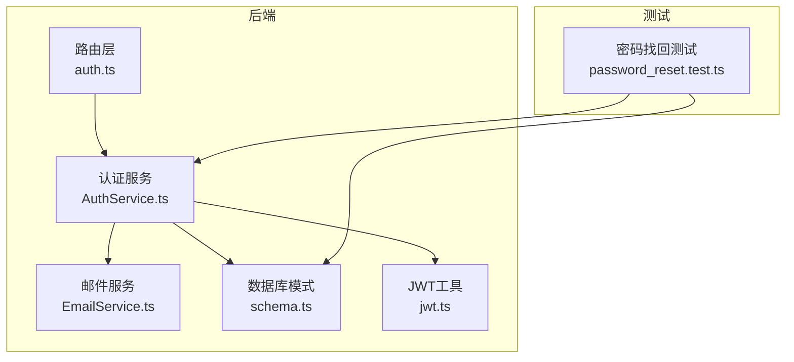
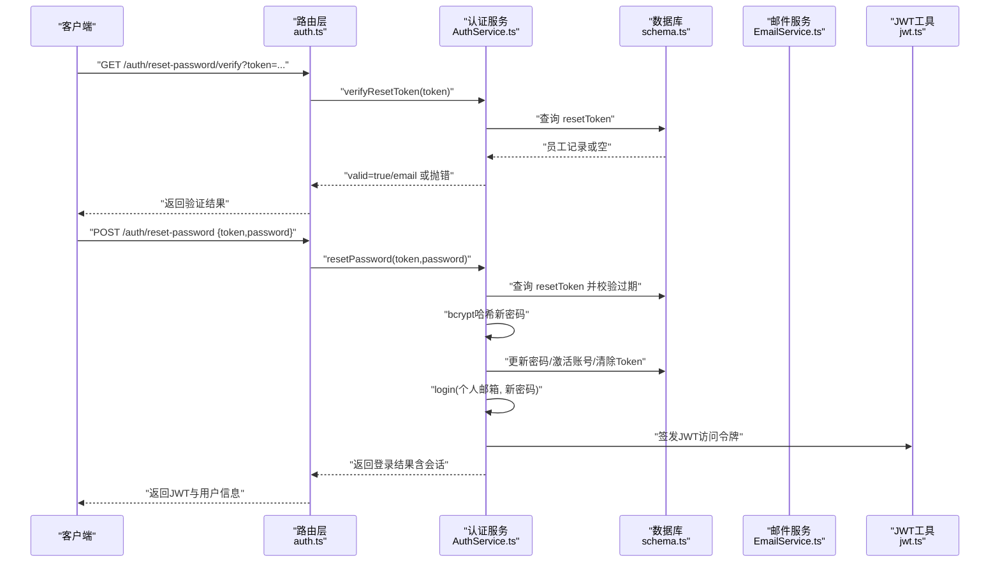
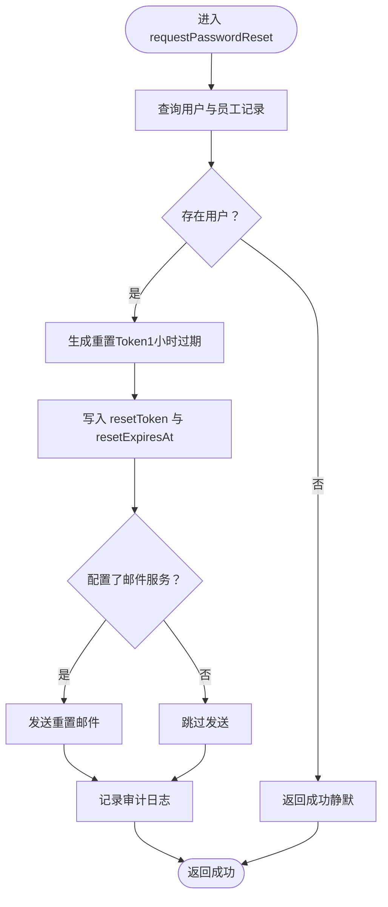
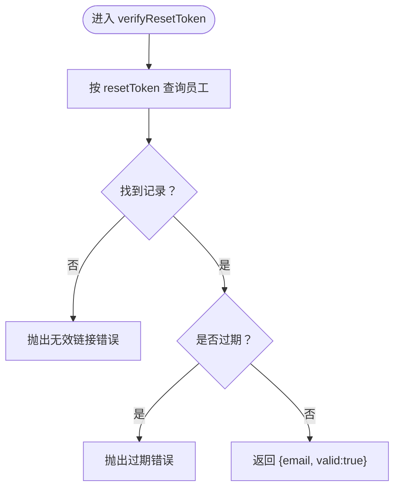
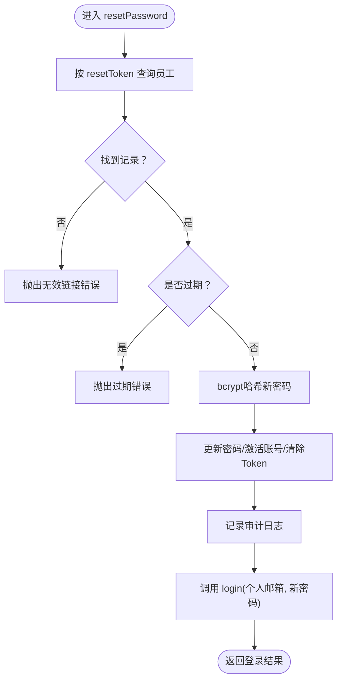
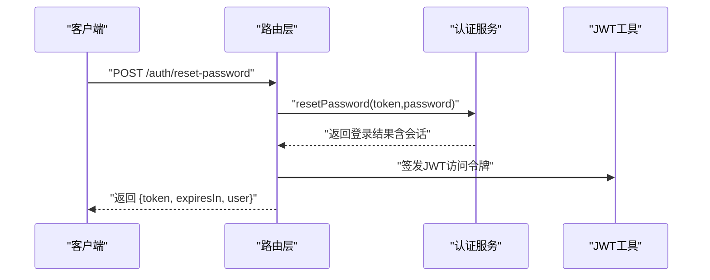
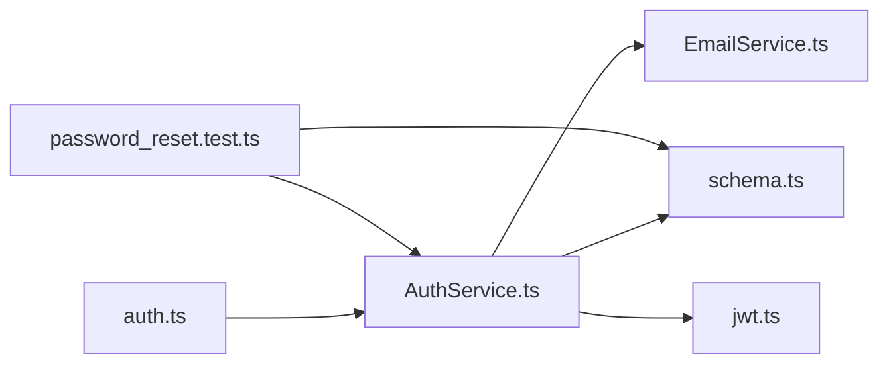

# 密码找回

<cite>
**本文引用的文件**
- [backend/src/routes/v2/auth.ts](file://backend/src/routes/v2/auth.ts)
- [backend/src/services/AuthService.ts](file://backend/src/services/AuthService.ts)
- [backend/src/services/EmailService.ts](file://backend/src/services/EmailService.ts)
- [backend/src/db/schema.ts](file://backend/src/db/schema.ts)
- [backend/src/utils/jwt.ts](file://backend/src/utils/jwt.ts)
- [backend/test/services/password_reset.test.ts](file://backend/test/services/password_reset.test.ts)
</cite>

## 目录
1. [简介](#简介)
2. [项目结构](#项目结构)
3. [核心组件](#核心组件)
4. [架构总览](#架构总览)
5. [详细组件分析](#详细组件分析)
6. [依赖关系分析](#依赖关系分析)
7. [性能考量](#性能考量)
8. [故障排查指南](#故障排查指南)
9. [结论](#结论)

## 简介
本文件系统性阐述密码找回机制的三步流程：requestPasswordReset（请求重置）、verifyResetToken（校验令牌）、resetPassword（重置密码）。重点说明以下要点：
- requestPasswordReset 接收邮箱，生成唯一长时效重置Token（有效期1小时），写入员工记录，并通过邮件服务发送包含Token的重置链接。
- verifyResetToken 校验Token是否存在且未过期，返回邮箱与有效性标记。
- resetPassword 使用有效Token查找用户，用bcrypt重新哈希新密码，更新用户记录（激活账号、清除Token），并自动调用login实现登录后的无缝体验。
- 安全实践包括：即使用户不存在也返回成功响应以防止邮箱枚举攻击；Token时效性严格管理；密码变更审计日志记录；前端路由层对重置接口进行速率限制。

## 项目结构
密码找回功能涉及后端路由、认证服务、邮件服务与数据库模式。下图展示关键文件之间的交互关系：

图表来源
- [backend/src/routes/v2/auth.ts](file://backend/src/routes/v2/auth.ts#L445-L528)
- [backend/src/services/AuthService.ts](file://backend/src/services/AuthService.ts#L229-L327)
- [backend/src/services/EmailService.ts](file://backend/src/services/EmailService.ts#L250-L293)
- [backend/src/db/schema.ts](file://backend/src/db/schema.ts#L14-L48)
- [backend/src/utils/jwt.ts](file://backend/src/utils/jwt.ts#L56-L132)
- [backend/test/services/password_reset.test.ts](file://backend/test/services/password_reset.test.ts#L113-L159)

章节来源
- [backend/src/routes/v2/auth.ts](file://backend/src/routes/v2/auth.ts#L445-L528)
- [backend/src/services/AuthService.ts](file://backend/src/services/AuthService.ts#L229-L327)
- [backend/src/services/EmailService.ts](file://backend/src/services/EmailService.ts#L250-L293)
- [backend/src/db/schema.ts](file://backend/src/db/schema.ts#L14-L48)
- [backend/src/utils/jwt.ts](file://backend/src/utils/jwt.ts#L56-L132)
- [backend/test/services/password_reset.test.ts](file://backend/test/services/password_reset.test.ts#L113-L159)

## 核心组件
- 路由层（auth.ts）
  - 提供“验证重置令牌”和“重置密码”两个公开接口，分别对应 verifyResetTokenRoute 与 resetPasswordRoute。
  - 对重置密码接口应用速率限制中间件，降低暴力尝试风险。
  - 在成功路径中，若登录成功会生成并返回JWT访问令牌与用户信息。
- 认证服务（AuthService.ts）
  - requestPasswordReset：生成UUID拼接的重置Token（长度约64字符），设置1小时过期时间，写入员工记录；若配置了邮件服务则发送重置邮件；记录审计日志。
  - verifyResetToken：根据Token查询员工记录，校验存在性与过期时间，返回邮箱与有效性标记。
  - resetPassword：根据Token查询员工记录，校验存在性与过期时间，bcrypt哈希新密码，更新用户记录（激活账号、清除Token等），并调用login完成自动登录。
- 邮件服务（EmailService.ts）
  - 提供发送密码重置链接邮件的方法，构造包含重置链接的HTML内容与文本内容。
- 数据库模式（schema.ts）
  - 员工表包含重置相关字段：resetToken、resetExpiresAt，用于存储重置令牌及其过期时间。
- JWT工具（jwt.ts）
  - 提供签发与校验JWT的能力，用于登录成功后生成访问令牌。

章节来源
- [backend/src/routes/v2/auth.ts](file://backend/src/routes/v2/auth.ts#L445-L528)
- [backend/src/services/AuthService.ts](file://backend/src/services/AuthService.ts#L229-L327)
- [backend/src/services/EmailService.ts](file://backend/src/services/EmailService.ts#L250-L293)
- [backend/src/db/schema.ts](file://backend/src/db/schema.ts#L14-L48)
- [backend/src/utils/jwt.ts](file://backend/src/utils/jwt.ts#L56-L132)

## 架构总览
下图展示密码找回三步流程的端到端调用序列，从路由到服务再到数据库与邮件服务：

图表来源
- [backend/src/routes/v2/auth.ts](file://backend/src/routes/v2/auth.ts#L445-L528)
- [backend/src/services/AuthService.ts](file://backend/src/services/AuthService.ts#L265-L327)
- [backend/src/db/schema.ts](file://backend/src/db/schema.ts#L14-L48)
- [backend/src/services/EmailService.ts](file://backend/src/services/EmailService.ts#L250-L293)
- [backend/src/utils/jwt.ts](file://backend/src/utils/jwt.ts#L72-L124)

## 详细组件分析

### requestPasswordReset 流程
- 输入：邮箱
- 处理：
  - 查询用户与员工记录，若不存在则仍返回成功响应（防止邮箱枚举）。
  - 生成重置Token（长度约64字符），设置resetExpiresAt为当前时间+1小时。
  - 更新员工记录的resetToken与resetExpiresAt。
  - 若配置了邮件服务，则发送包含重置链接（带token）的邮件。
  - 记录审计日志。
- 输出：统一返回成功状态。

图表来源
- [backend/src/services/AuthService.ts](file://backend/src/services/AuthService.ts#L229-L263)
- [backend/src/services/EmailService.ts](file://backend/src/services/EmailService.ts#L250-L293)
- [backend/src/db/schema.ts](file://backend/src/db/schema.ts#L14-L48)

章节来源
- [backend/src/services/AuthService.ts](file://backend/src/services/AuthService.ts#L229-L263)
- [backend/src/services/EmailService.ts](file://backend/src/services/EmailService.ts#L250-L293)
- [backend/src/db/schema.ts](file://backend/src/db/schema.ts#L14-L48)

### verifyResetToken 流程
- 输入：token
- 处理：
  - 根据token查询员工记录。
  - 若记录不存在，抛出“无效的重置链接”错误。
  - 校验resetExpiresAt是否过期，过期则抛出“重置链接已过期”错误。
  - 返回valid=true与邮箱。
- 输出：邮箱与有效性标记。

图表来源
- [backend/src/services/AuthService.ts](file://backend/src/services/AuthService.ts#L265-L280)

章节来源
- [backend/src/services/AuthService.ts](file://backend/src/services/AuthService.ts#L265-L280)

### resetPassword 流程
- 输入：token、password
- 处理：
  - 根据token查询员工记录并校验过期。
  - bcrypt哈希新密码。
  - 更新员工记录：设置passwordHash、激活账号、清除resetToken与resetExpiresAt、标记密码已更改。
  - 记录审计日志。
  - 自动调用login（使用个人邮箱与新密码），返回登录结果（包含会话）。
- 输出：登录成功后的会话信息（路由层再包装为JWT与用户信息）。

图表来源
- [backend/src/services/AuthService.ts](file://backend/src/services/AuthService.ts#L282-L327)

章节来源
- [backend/src/services/AuthService.ts](file://backend/src/services/AuthService.ts#L282-L327)

### 路由层对接与安全实践
- 路由层提供“验证重置令牌”与“重置密码”接口，并对重置密码接口应用速率限制中间件。
- 登录成功后，路由层会签发JWT访问令牌并返回给客户端，实现无缝登录体验。
- 安全实践：
  - requestPasswordReset即使用户不存在也返回成功，避免邮箱枚举。
  - verifyResetToken与resetPassword均严格校验Token存在性与过期时间。
  - resetPassword成功后记录审计日志，便于追踪。

图表来源
- [backend/src/routes/v2/auth.ts](file://backend/src/routes/v2/auth.ts#L509-L528)
- [backend/src/utils/jwt.ts](file://backend/src/utils/jwt.ts#L72-L124)

章节来源
- [backend/src/routes/v2/auth.ts](file://backend/src/routes/v2/auth.ts#L445-L528)
- [backend/src/utils/jwt.ts](file://backend/src/utils/jwt.ts#L56-L132)

## 依赖关系分析
- 组件耦合
  - 路由层依赖认证服务；认证服务依赖数据库模式、邮件服务与JWT工具。
  - 邮件服务依赖环境变量中的邮件服务Fetcher与令牌。
  - 测试用例覆盖了请求重置、验证令牌、重置密码与过期场景。
- 外部依赖
  - bcryptjs用于密码哈希。
  - Cloudflare Workers环境下的KV命名空间用于会话与临时令牌存储（本文件聚焦密码找回流程，KV在会话管理中使用）。

图表来源
- [backend/src/routes/v2/auth.ts](file://backend/src/routes/v2/auth.ts#L445-L528)
- [backend/src/services/AuthService.ts](file://backend/src/services/AuthService.ts#L1-L40)
- [backend/src/services/EmailService.ts](file://backend/src/services/EmailService.ts#L1-L40)
- [backend/src/db/schema.ts](file://backend/src/db/schema.ts#L14-L48)
- [backend/test/services/password_reset.test.ts](file://backend/test/services/password_reset.test.ts#L113-L159)

章节来源
- [backend/src/services/AuthService.ts](file://backend/src/services/AuthService.ts#L1-L40)
- [backend/src/services/EmailService.ts](file://backend/src/services/EmailService.ts#L1-L40)
- [backend/test/services/password_reset.test.ts](file://backend/test/services/password_reset.test.ts#L113-L159)

## 性能考量
- Token生成采用UUID拼接，长度约64字符，满足安全性与传输效率平衡。
- 重置Token仅在员工表中存储，查询与更新均为单行写入，开销极低。
- 邮件发送为异步调用，不影响主流程响应时间。
- 重置密码后自动登录，减少二次请求，提升用户体验。

## 故障排查指南
- “无效的重置链接”
  - 可能原因：token不存在或已被清除。
  - 排查步骤：确认邮件中的链接未被篡改；检查数据库中resetToken字段是否仍存在。
  - 参考位置：[backend/src/services/AuthService.ts](file://backend/src/services/AuthService.ts#L265-L280)
- “重置链接已过期”
  - 可能原因：超过1小时有效期。
  - 排查步骤：引导用户重新发起请求重置；检查resetExpiresAt是否早于当前时间。
  - 参考位置：[backend/src/services/AuthService.ts](file://backend/src/services/AuthService.ts#L265-L280)
- “用户未绑定个人邮箱”
  - 可能原因：重置密码时需要使用个人邮箱进行登录。
  - 排查步骤：确保员工记录中存在personalEmail；若缺失，需先完善个人信息。
  - 参考位置：[backend/src/services/AuthService.ts](file://backend/src/services/AuthService.ts#L322-L327)
- “邮件未送达”
  - 可能原因：未配置EMAIL_SERVICE或令牌错误。
  - 排查步骤：检查环境变量；确认邮件服务可用；查看邮件服务返回的错误信息。
  - 参考位置：[backend/src/services/EmailService.ts](file://backend/src/services/EmailService.ts#L104-L145)

章节来源
- [backend/src/services/AuthService.ts](file://backend/src/services/AuthService.ts#L265-L327)
- [backend/src/services/EmailService.ts](file://backend/src/services/EmailService.ts#L104-L145)

## 结论
密码找回机制通过“请求重置—验证令牌—重置密码—自动登录”的闭环设计，既保障了用户体验，又强化了安全防护。其关键优势包括：
- 防枚举：请求重置时即使用户不存在也返回成功。
- 时效控制：重置Token仅1小时有效，过期即失效。
- 无缝体验：重置成功后自动登录，路由层签发JWT访问令牌。
- 可观测性：审计日志记录关键操作，便于追踪与复盘。
- 可靠性：测试用例覆盖正常流程与过期场景，保证行为一致性。