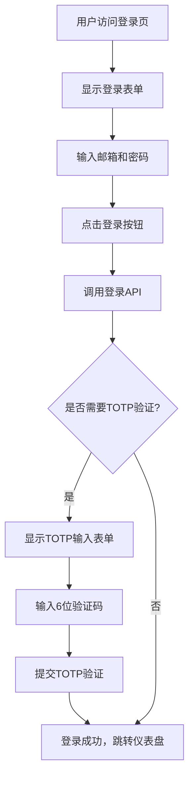
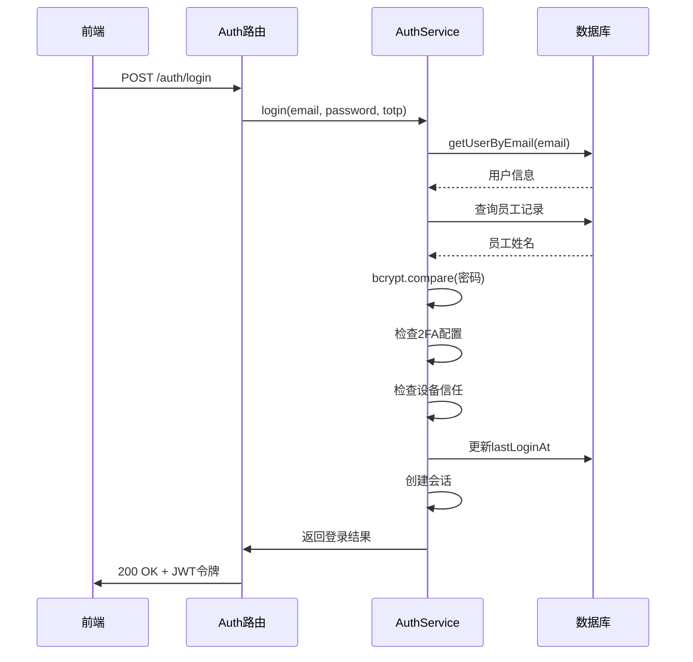
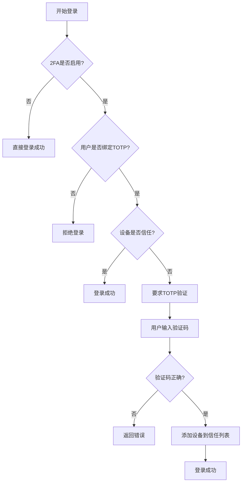
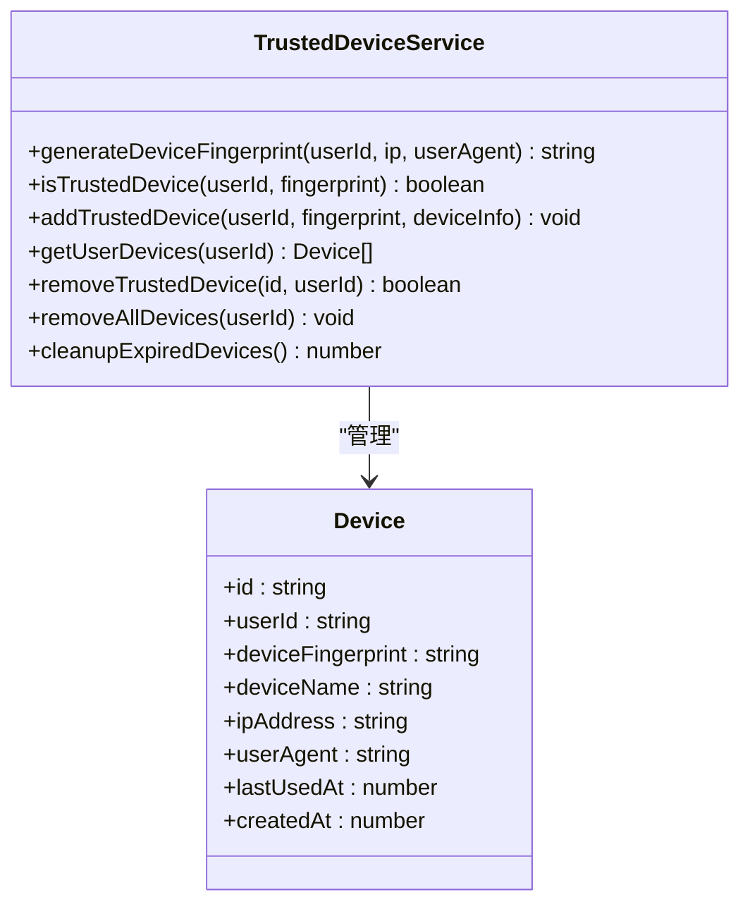
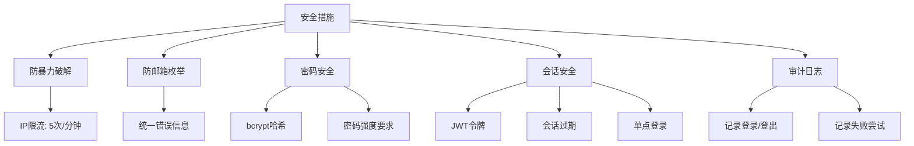
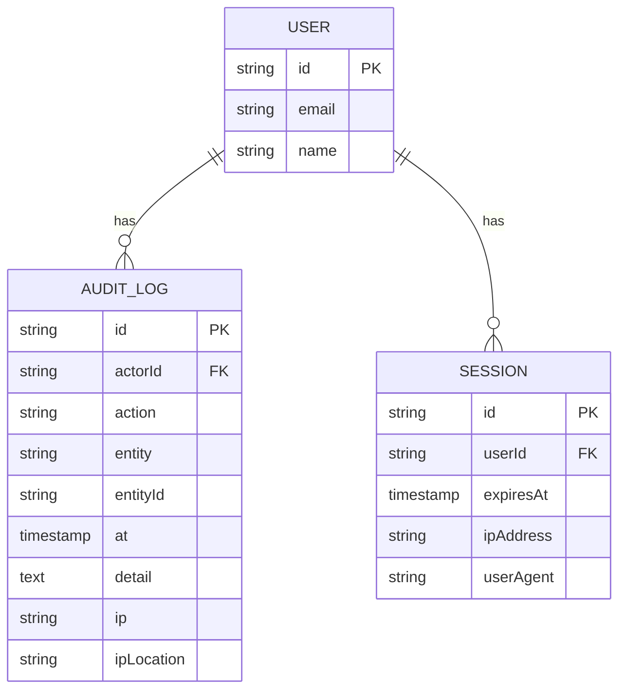

# 登录流程

<cite>
**本文档引用文件**   
- [LoginPage.tsx](file://frontend/src/features/auth/pages/LoginPage.tsx)
- [auth.ts](file://backend/src/routes/v2/auth.ts)
- [AuthService.ts](file://backend/src/services/AuthService.ts)
- [auth.ts](file://backend/src/utils/auth.ts)
- [schema.ts](file://backend/src/db/schema.ts)
- [business.schema.ts](file://backend/src/schemas/business.schema.ts)
- [useAuth.ts](file://frontend/src/hooks/business/useAuth.ts)
- [SystemConfigService.ts](file://backend/src/services/SystemConfigService.ts)
- [TrustedDeviceService.ts](file://backend/src/services/TrustedDeviceService.ts)
</cite>

## 目录
1. [简介](#简介)
2. [前端登录流程](#前端登录流程)
3. [后端登录处理](#后端登录处理)
4. [双因素认证（2FA）流程](#双因素认证2fa流程)
5. [设备信任机制](#设备信任机制)
6. [错误处理流程](#错误处理流程)
7. [安全考虑](#安全考虑)
8. [审计与日志](#审计与日志)

## 简介
本文档详细解析了财务系统的完整登录流程，从用户在前端输入凭证到后端创建会话的全过程。系统采用多层安全机制，包括密码验证、双因素认证（2FA）、设备信任管理和防暴力破解措施。登录流程涉及前端Ant Design表单、后端Hono路由、AuthService服务以及数据库交互，确保了系统的安全性与用户体验。

## 前端登录流程

前端登录流程由`LoginPage.tsx`组件实现，使用Ant Design的Form组件收集用户输入。用户首先在登录表单中输入邮箱和密码。系统会自动缓存邮箱地址，方便下次登录。当后端返回需要TOTP验证时，页面会切换到验证码输入界面。



**Diagram sources**
- [LoginPage.tsx](file://frontend/src/features/auth/pages/LoginPage.tsx#L1-L194)
- [useAuth.ts](file://frontend/src/hooks/business/useAuth.ts#L27-L33)

**Section sources**
- [LoginPage.tsx](file://frontend/src/features/auth/pages/LoginPage.tsx#L1-L194)
- [useAuth.ts](file://frontend/src/hooks/business/useAuth.ts#L27-L33)

## 后端登录处理

后端登录处理由`auth.ts`路由和`AuthService.ts`服务协同完成。当收到登录请求时，系统首先通过`getUserByEmail`验证用户存在性，然后通过`personalEmail`字段关联员工记录获取姓名。密码使用bcrypt进行安全比对。



**Diagram sources**
- [auth.ts](file://backend/src/routes/v2/auth.ts#L82-L144)
- [AuthService.ts](file://backend/src/services/AuthService.ts#L34-L148)

**Section sources**
- [auth.ts](file://backend/src/routes/v2/auth.ts#L82-L144)
- [AuthService.ts](file://backend/src/services/AuthService.ts#L34-L148)

## 双因素认证（2FA）流程

系统通过`2fa_enabled`配置项决定是否强制执行双因素认证。当系统启用2FA且用户已绑定TOTP但当前设备不信任时，需要进行TOTP验证。验证成功后，该设备将被添加至信任列表。



**Diagram sources**
- [AuthService.ts](file://backend/src/services/AuthService.ts#L78-L113)
- [SystemConfigService.ts](file://backend/src/services/SystemConfigService.ts#L9-L21)

**Section sources**
- [AuthService.ts](file://backend/src/services/AuthService.ts#L78-L113)
- [SystemConfigService.ts](file://backend/src/services/SystemConfigService.ts#L9-L21)

## 设备信任机制

系统通过`TrustedDeviceService`实现设备信任机制。当用户在新设备上成功通过TOTP验证后，系统会生成设备指纹并将其添加到信任列表。设备指纹基于用户ID、IP地址和User-Agent生成SHA-256哈希，确保唯一性。信任设备的有效期为90天，过期后需要重新验证。



**Diagram sources**
- [TrustedDeviceService.ts](file://backend/src/services/TrustedDeviceService.ts#L1-L167)
- [schema.ts](file://backend/src/db/schema.ts#L128-L137)

**Section sources**
- [TrustedDeviceService.ts](file://backend/src/services/TrustedDeviceService.ts#L1-L167)

## 错误处理流程

系统实现了全面的错误处理机制，针对不同场景返回相应的错误信息。为防止邮箱枚举攻击，系统对不存在的用户和密码错误返回相同的错误信息。同时，系统对账号停用、密码未设置、2FA未绑定等状态进行明确的错误提示。

```mermaid
flowchart TD
A[登录请求] --> B{用户是否存在?}
B --> |否| C[返回"用户名或密码错误"]
B --> |是| D{员工记录是否有效?}
D --> |否| E[返回"员工记录已停用"]
D --> |是| F{账号是否启用?}
F --> |否| G[返回"账号已停用"]
F --> |是| H{密码是否已设置?}
H --> |否| I[返回"密码未设置"]
H --> |是| J{密码是否正确?}
J --> |否| K[返回"用户名或密码错误"]
J --> |是| L[继续2FA检查]
```

**Diagram sources**
- [AuthService.ts](file://backend/src/services/AuthService.ts#L42-L76)
- [errors.ts](file://backend/src/utils/errors.ts#L35-L55)

**Section sources**
- [AuthService.ts](file://backend/src/services/AuthService.ts#L42-L76)
- [errors.ts](file://backend/src/utils/errors.ts#L35-L55)

## 安全考虑

系统在设计上充分考虑了安全性，采取了多项措施防止常见攻击。为防止暴力破解，系统对登录接口实施了IP限流策略，每IP每分钟最多5次尝试。为防止邮箱枚举攻击，系统对不存在的用户和密码错误返回相同的错误信息。密码使用bcrypt进行哈希存储，确保即使数据库泄露也无法轻易还原密码。



**Diagram sources**
- [rateLimit.ts](file://backend/src/middleware/rateLimit.ts#L66-L71)
- [auth.ts](file://backend/src/routes/v2/auth.ts#L176-L177)
- [AuthService.ts](file://backend/src/services/AuthService.ts#L150-L198)

**Section sources**
- [rateLimit.ts](file://backend/src/middleware/rateLimit.ts#L66-L71)
- [auth.ts](file://backend/src/routes/v2/auth.ts#L176-L177)
- [AuthService.ts](file://backend/src/services/AuthService.ts#L150-L198)

## 审计与日志

系统通过`AuditService`记录所有登录相关的审计日志。每次成功登录、登出以及失败的登录尝试都会被记录，包括用户ID、操作类型、IP地址等信息。这些日志可用于安全审计和异常行为检测。



**Diagram sources**
- [AuthService.ts](file://backend/src/services/AuthService.ts#L129-L140)
- [schema.ts](file://backend/src/db/schema.ts#L118-L127)
- [schema.ts](file://backend/src/db/schema.ts#L675-L692)

**Section sources**
- [AuthService.ts](file://backend/src/services/AuthService.ts#L129-L140)
- [schema.ts](file://backend/src/db/schema.ts#L118-L127)
- [schema.ts](file://backend/src/db/schema.ts#L675-L692)