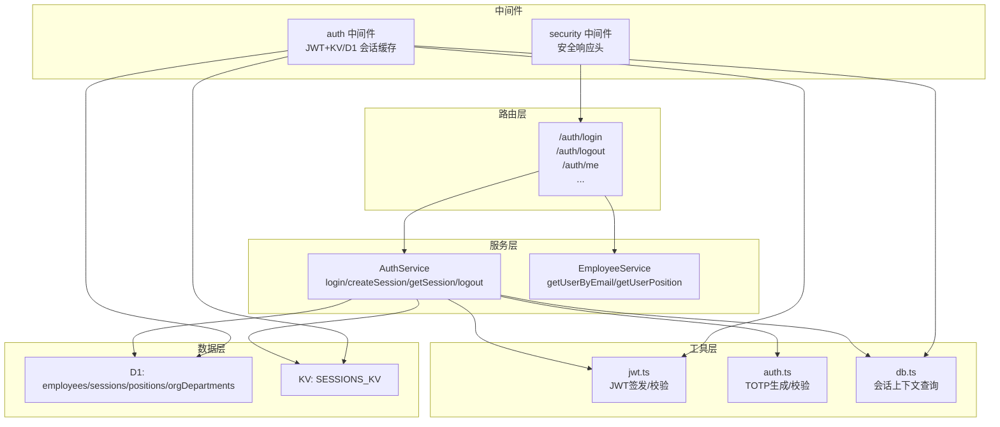
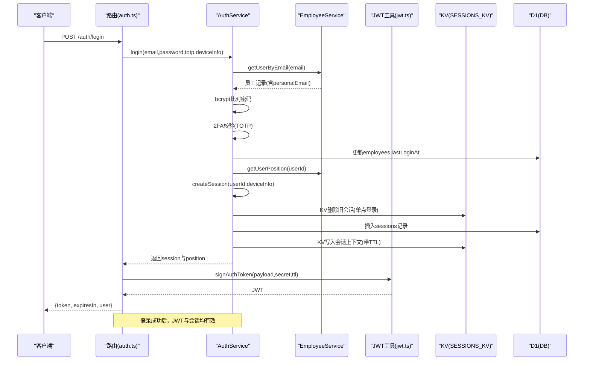
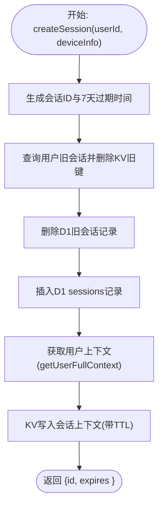
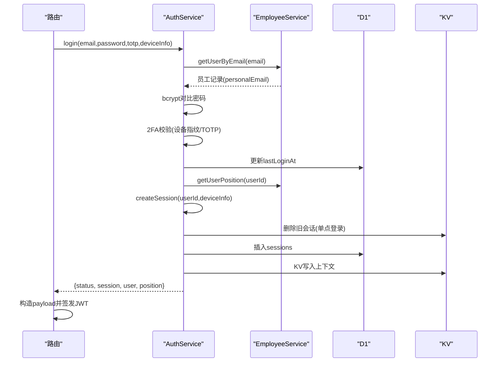
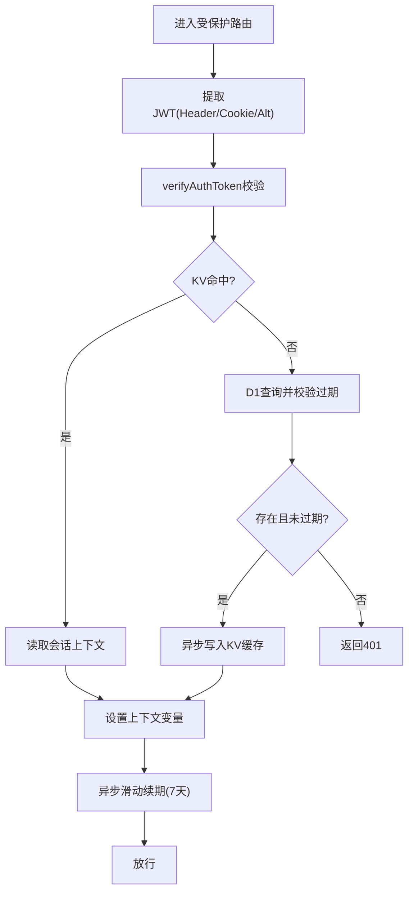
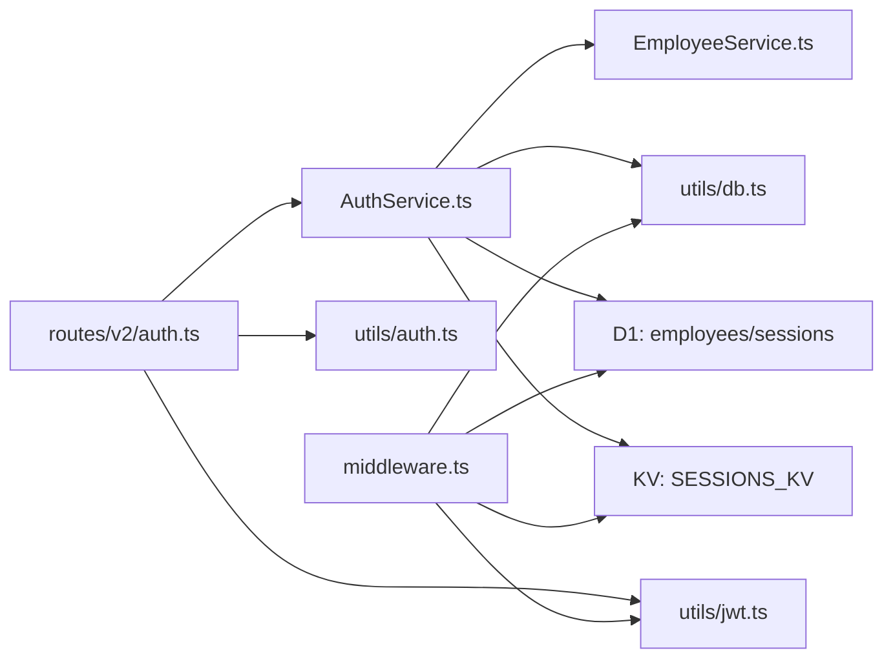

# 认证机制

<cite>
**本文引用的文件**
- [backend/src/routes/v2/auth.ts](file://backend/src/routes/v2/auth.ts)
- [backend/src/services/AuthService.ts](file://backend/src/services/AuthService.ts)
- [backend/src/utils/jwt.ts](file://backend/src/utils/jwt.ts)
- [backend/src/utils/auth.ts](file://backend/src/utils/auth.ts)
- [backend/src/middleware.ts](file://backend/src/middleware.ts)
- [backend/src/utils/db.ts](file://backend/src/utils/db.ts)
- [backend/src/db/schema.ts](file://backend/src/db/schema.ts)
- [backend/src/services/EmployeeService.ts](file://backend/src/services/EmployeeService.ts)
- [backend/src/middleware/security.ts](file://backend/src/middleware/security.ts)
- [backend/wrangler.toml](file://backend/wrangler.toml)
- [backend/src/types.ts](file://backend/src/types.ts)
</cite>

## 目录
1. [简介](#简介)
2. [项目结构](#项目结构)
3. [核心组件](#核心组件)
4. [架构总览](#架构总览)
5. [详细组件分析](#详细组件分析)
6. [依赖关系分析](#依赖关系分析)
7. [性能考量](#性能考量)
8. [故障排查指南](#故障排查指南)
9. [结论](#结论)

## 简介
本专项文档聚焦系统的认证机制，围绕基于 JWT 的会话管理展开，详细说明：
- createSession 与 getSession 如何结合 Cloudflare KV 与 D1 实现高性能会话存储与单点登录控制
- 用户登录(login)的完整流程：密码验证(bcrypt)、会话创建、最后登录时间更新、审计日志记录
- 通过 personalEmail 字段关联员工记录与用户账户
- 会话的7天过期策略与单点登录实现（新登录自动使旧会话失效）
- 会话数据结构与安全最佳实践

## 项目结构
认证相关代码主要分布在以下模块：
- 路由层：登录、登出、获取用户信息等接口
- 服务层：认证核心逻辑（登录、会话创建、会话获取、登出、密码重置等）
- 工具层：JWT 签发与校验、TOTP 辅助、数据库工具
- 中间件：鉴权中间件（JWT + KV/D1 会话缓存）、安全响应头
- 数据模型：D1 表结构（employees、sessions、positions、orgDepartments 等）

图表来源
- [backend/src/routes/v2/auth.ts](file://backend/src/routes/v2/auth.ts#L1-L200)
- [backend/src/services/AuthService.ts](file://backend/src/services/AuthService.ts#L1-L200)
- [backend/src/utils/jwt.ts](file://backend/src/utils/jwt.ts#L1-L132)
- [backend/src/utils/auth.ts](file://backend/src/utils/auth.ts#L1-L17)
- [backend/src/middleware.ts](file://backend/src/middleware.ts#L1-L120)
- [backend/src/utils/db.ts](file://backend/src/utils/db.ts#L1-L147)
- [backend/src/db/schema.ts](file://backend/src/db/schema.ts#L1-L140)

章节来源
- [backend/src/routes/v2/auth.ts](file://backend/src/routes/v2/auth.ts#L1-L200)
- [backend/src/services/AuthService.ts](file://backend/src/services/AuthService.ts#L1-L200)
- [backend/src/middleware.ts](file://backend/src/middleware.ts#L1-L120)

## 核心组件
- 路由层：提供登录、登出、获取用户信息、权限查询等接口，并负责提取与注入认证令牌
- 服务层：实现登录、会话创建与获取、登出、密码重置、TOTP 重置等核心逻辑
- 工具层：JWT 签发/校验、TOTP 生成/校验、会话上下文查询
- 中间件：鉴权中间件（JWT + KV/D1 会话缓存），安全响应头中间件
- 数据层：D1 表结构与 KV 命名空间绑定

章节来源
- [backend/src/routes/v2/auth.ts](file://backend/src/routes/v2/auth.ts#L1-L200)
- [backend/src/services/AuthService.ts](file://backend/src/services/AuthService.ts#L1-L200)
- [backend/src/utils/jwt.ts](file://backend/src/utils/jwt.ts#L1-L132)
- [backend/src/utils/auth.ts](file://backend/src/utils/auth.ts#L1-L17)
- [backend/src/middleware.ts](file://backend/src/middleware.ts#L1-L120)
- [backend/src/utils/db.ts](file://backend/src/utils/db.ts#L1-L147)
- [backend/src/db/schema.ts](file://backend/src/db/schema.ts#L1-L140)

## 架构总览
认证采用“JWT + KV/D1 会话缓存”的混合架构：
- JWT 用于无状态的身份标识，payload 中包含 sid（会话ID）、sub（用户ID）、email、name、position 等
- 会话数据同时持久化到 D1（审计与备份）与 KV（高性能缓存）
- 登录时执行单点登录策略：新会话创建前删除该用户所有旧会话（KV + DB）
- 中间件负责从 JWT 提取 sid，优先从 KV 读取会话上下文，未命中则回退到 D1 并写入 KV 缓存
- 活跃用户访问时进行滑动窗口续期（7天）

图表来源
- [backend/src/routes/v2/auth.ts](file://backend/src/routes/v2/auth.ts#L80-L140)
- [backend/src/services/AuthService.ts](file://backend/src/services/AuthService.ts#L34-L148)
- [backend/src/utils/jwt.ts](file://backend/src/utils/jwt.ts#L72-L124)
- [backend/src/services/EmployeeService.ts](file://backend/src/services/EmployeeService.ts#L628-L691)

章节来源
- [backend/src/routes/v2/auth.ts](file://backend/src/routes/v2/auth.ts#L80-L140)
- [backend/src/services/AuthService.ts](file://backend/src/services/AuthService.ts#L34-L148)
- [backend/src/utils/jwt.ts](file://backend/src/utils/jwt.ts#L72-L124)
- [backend/src/services/EmployeeService.ts](file://backend/src/services/EmployeeService.ts#L628-L691)

## 详细组件分析

### JWT 会话管理与单点登录
- createSession
  - 生成 UUID 作为会话ID，设置过期时间为7天
  - 单点登录：先查询该用户所有旧会话，删除 KV 中的旧会话键，再删除 D1 中的旧会话记录
  - 写入 D1 sessions 表（持久化备份与审计）
  - 通过 getUserFullContext 获取用户、职位、部门模块等上下文，写入 KV（带 TTL 秒数）
- getSession
  - 优先从 KV 读取；若未命中，回退到 D1 查询并校验过期
  - 返回 session 结构（id、user_id、expires_at）
- 登录流程中的单点登录
  - login 成功后立即调用 createSession，从而实现“新登录自动失效旧会话”

图表来源
- [backend/src/services/AuthService.ts](file://backend/src/services/AuthService.ts#L150-L198)
- [backend/src/utils/db.ts](file://backend/src/utils/db.ts#L149-L239)

章节来源
- [backend/src/services/AuthService.ts](file://backend/src/services/AuthService.ts#L150-L198)
- [backend/src/utils/db.ts](file://backend/src/utils/db.ts#L149-L239)

### 登录(login)流程详解
- 输入：email、password、可选 totp
- 步骤：
  1) 通过 EmployeeService.getUserByEmail(email) 获取员工记录（使用 personalEmail 字段）
  2) 校验员工状态与账号状态
  3) 使用 bcrypt.compare 验证密码
  4) 若启用2FA且用户已绑定，则生成设备指纹并校验 TOTP；新设备首次登录需要 TOTP
  5) 更新 employees.lastLoginAt
  6) 获取用户职位信息（position）
  7) 调用 createSession 创建会话（单点登录）
  8) 记录审计日志
  9) 返回 {status, session, user, position}
- 令牌签发：路由层根据返回的 session.id 构造 payload 并调用 signAuthToken 生成 JWT

图表来源
- [backend/src/services/AuthService.ts](file://backend/src/services/AuthService.ts#L34-L148)
- [backend/src/services/EmployeeService.ts](file://backend/src/services/EmployeeService.ts#L628-L691)
- [backend/src/routes/v2/auth.ts](file://backend/src/routes/v2/auth.ts#L80-L140)

章节来源
- [backend/src/services/AuthService.ts](file://backend/src/services/AuthService.ts#L34-L148)
- [backend/src/services/EmployeeService.ts](file://backend/src/services/EmployeeService.ts#L628-L691)
- [backend/src/routes/v2/auth.ts](file://backend/src/routes/v2/auth.ts#L80-L140)

### 会话数据结构
- JWT payload 字段
  - sid：会话ID
  - sub：用户ID
  - email、name：用户标识
  - position：职位信息（包含权限）
- KV 中的会话上下文
  - session：{ id, user_id, expires_at }
  - user：{ id, email, name }
  - position：{ id, code, name, level, functionRole, canManageSubordinates, permissions }
  - employee：{ id, orgDepartmentId, departmentId }
  - departmentModules：部门允许的功能模块列表
- D1 中的 sessions 表
  - id、userId、expiresAt、ipAddress、userAgent、createdAt、lastActiveAt

章节来源
- [backend/src/utils/jwt.ts](file://backend/src/utils/jwt.ts#L61-L124)
- [backend/src/utils/db.ts](file://backend/src/utils/db.ts#L45-L147)
- [backend/src/db/schema.ts](file://backend/src/db/schema.ts#L118-L138)

### 会话中间件与滑动续期
- 鉴权中间件
  - 从 Cookie 或 Authorization Header 或自定义 x-caiwu-token 提取 JWT
  - verifyAuthToken 校验签名与过期
  - 优先从 KV 读取会话上下文；未命中则回退 D1 并异步写入 KV
  - 设置 userId、sessionId、userPosition、userEmployee、departmentModules
- 滑动窗口续期
  - 活跃用户访问时，异步更新 D1 与 KV 的 expires_at 为7天后，并刷新 KV TTL

图表来源
- [backend/src/middleware.ts](file://backend/src/middleware.ts#L1-L120)
- [backend/src/utils/jwt.ts](file://backend/src/utils/jwt.ts#L96-L132)
- [backend/src/utils/db.ts](file://backend/src/utils/db.ts#L45-L147)

章节来源
- [backend/src/middleware.ts](file://backend/src/middleware.ts#L1-L120)
- [backend/src/utils/jwt.ts](file://backend/src/utils/jwt.ts#L96-L132)
- [backend/src/utils/db.ts](file://backend/src/utils/db.ts#L45-L147)

### 会话过期与单点登录
- 会话过期策略
  - JWT 与会话数据均设置为7天过期
  - 中间件在每次活跃访问时进行滑动续期（7天）
- 单点登录
  - login 成功后立即删除该用户所有旧会话（KV 键与 D1 记录）
  - 保证同一用户同时只有一个有效会话

章节来源
- [backend/src/utils/jwt.ts](file://backend/src/utils/jwt.ts#L56-L70)
- [backend/src/services/AuthService.ts](file://backend/src/services/AuthService.ts#L150-L198)
- [backend/src/middleware.ts](file://backend/src/middleware.ts#L67-L96)

### 通过 personalEmail 关联员工与用户
- 登录时使用 personalEmail 作为用户邮箱查询员工记录
- 员工表 employees 中包含 personalEmail 字段，用于与用户账户关联
- 用户信息返回时优先使用 personalEmail，否则回退到 email

章节来源
- [backend/src/services/AuthService.ts](file://backend/src/services/AuthService.ts#L41-L64)
- [backend/src/services/EmployeeService.ts](file://backend/src/services/EmployeeService.ts#L635-L642)
- [backend/src/routes/v2/auth.ts](file://backend/src/routes/v2/auth.ts#L238-L283)
- [backend/src/db/schema.ts](file://backend/src/db/schema.ts#L14-L48)

### 安全最佳实践
- 响应头安全
  - 设置 X-Content-Type-Options、X-Frame-Options、X-XSS-Protection、Strict-Transport-Security、Content-Security-Policy、Referrer-Policy、Permissions-Policy、X-Permitted-Cross-Domain-Policies
- 限流
  - 登录、密码重置、TOTP 重置等接口应用限流中间件
- 令牌与密钥
  - JWT 密钥通过 Cloudflare Secret 管理，生产环境不应硬编码
- 设备可信与2FA
  - 新设备首次登录需要 TOTP 验证，并将设备指纹加入可信设备列表
- 审计日志
  - 登录、登出、重置密码、激活账户、TOTP 重置等关键动作均记录审计日志

章节来源
- [backend/src/middleware/security.ts](file://backend/src/middleware/security.ts#L1-L81)
- [backend/src/routes/v2/auth.ts](file://backend/src/routes/v2/auth.ts#L175-L214)
- [backend/wrangler.toml](file://backend/wrangler.toml#L39-L48)
- [backend/src/services/AuthService.ts](file://backend/src/services/AuthService.ts#L127-L141)

## 依赖关系分析
- 路由层依赖服务层与工具层，负责参数解析、限流与响应封装
- 服务层依赖数据库与 KV、员工服务、审计服务、邮件服务、TOTP 工具
- 中间件依赖 JWT 工具与数据库工具，负责鉴权与会话缓存
- 数据层通过 D1 与 KV 提供持久化与缓存能力

图表来源
- [backend/src/routes/v2/auth.ts](file://backend/src/routes/v2/auth.ts#L1-L200)
- [backend/src/services/AuthService.ts](file://backend/src/services/AuthService.ts#L1-L200)
- [backend/src/middleware.ts](file://backend/src/middleware.ts#L1-L120)
- [backend/src/utils/jwt.ts](file://backend/src/utils/jwt.ts#L1-L132)
- [backend/src/utils/auth.ts](file://backend/src/utils/auth.ts#L1-L17)
- [backend/src/utils/db.ts](file://backend/src/utils/db.ts#L1-L147)
- [backend/src/db/schema.ts](file://backend/src/db/schema.ts#L1-L140)

章节来源
- [backend/src/routes/v2/auth.ts](file://backend/src/routes/v2/auth.ts#L1-L200)
- [backend/src/services/AuthService.ts](file://backend/src/services/AuthService.ts#L1-L200)
- [backend/src/middleware.ts](file://backend/src/middleware.ts#L1-L120)

## 性能考量
- KV 作为会话缓存，显著降低 D1 查询压力；未命中时回退 D1 并异步写入 KV
- 滑动续期避免频繁写入，同时保持会话长期有效
- 单点登录在登录时批量清理旧会话，减少 KV 与 D1 的冗余数据
- 会话上下文一次性查询并缓存，减少后续查询成本

[本节为通用性能讨论，不直接分析具体文件]

## 故障排查指南
- “未授权”错误
  - 检查 JWT 是否存在、格式是否正确、是否过期
  - 检查 KV 中是否存在对应会话键，以及 D1 中会话是否过期
- “用户不存在或未激活”
  - 确认 employees 表中 personalEmail 是否正确，员工状态是否为 active
- “2FA 验证失败”
  - 确认 TOTP 是否正确，设备指纹是否可信
- “会话未生效或立即过期”
  - 检查 KV TTL 设置与中间件滑动续期逻辑
- “审计日志缺失”
  - 确认审计服务是否正确调用，以及日志输出配置

章节来源
- [backend/src/middleware.ts](file://backend/src/middleware.ts#L1-L120)
- [backend/src/services/AuthService.ts](file://backend/src/services/AuthService.ts#L127-L141)
- [backend/src/utils/jwt.ts](file://backend/src/utils/jwt.ts#L96-L132)

## 结论
本系统通过“JWT + KV/D1 会话缓存”的组合实现了高性能、可扩展的认证体系：
- 会话创建与获取兼顾持久化与缓存，确保高可用与低延迟
- 单点登录策略保障了账户安全，新登录自动失效旧会话
- 7天过期策略与滑动续期平衡了用户体验与安全
- 通过 personalEmail 将员工记录与用户账户关联，满足企业场景需求
- 安全响应头、限流、2FA、审计日志等措施共同构成完整的安全基线