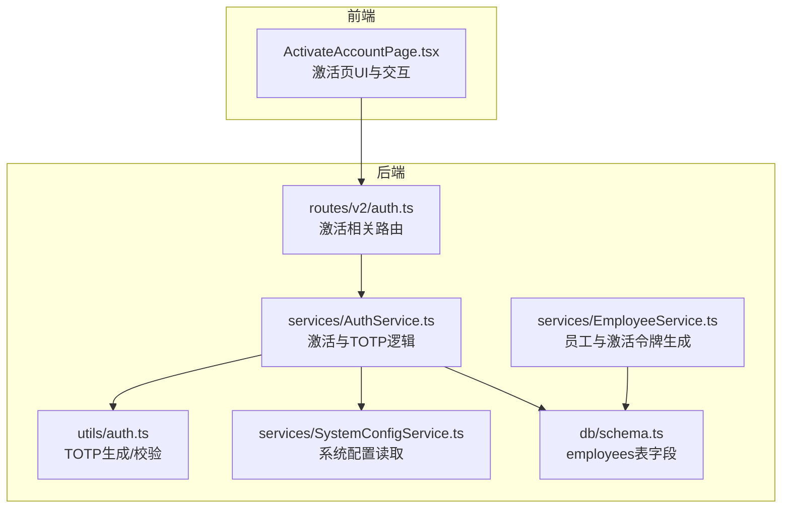
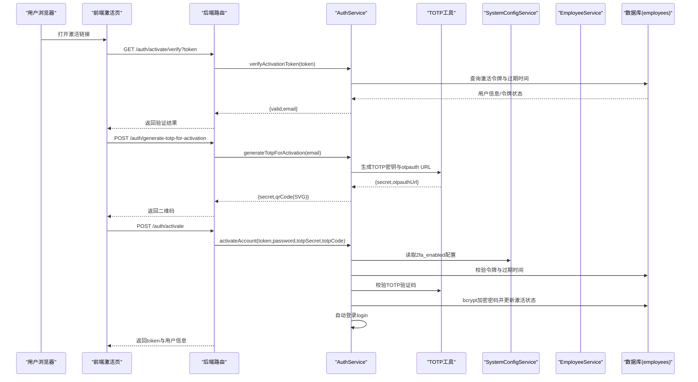
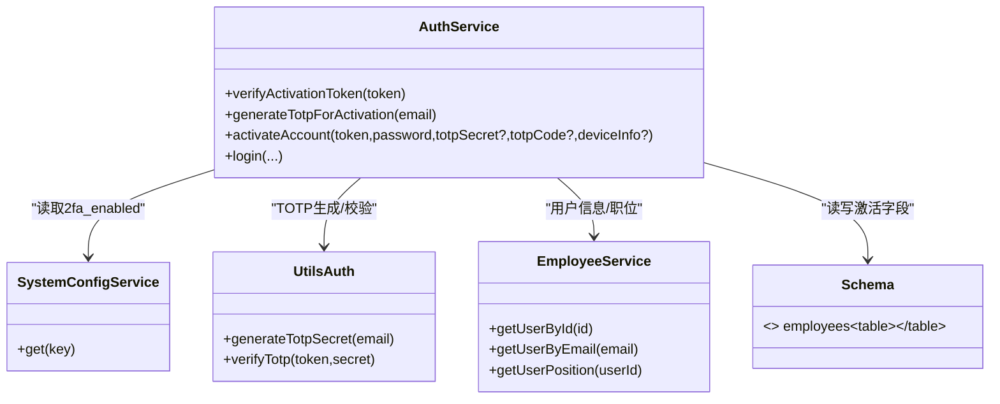

# 账号激活

<cite>
**本文引用的文件**
- [AuthService.ts](file://backend/src/services/AuthService.ts)
- [auth.ts（路由）](file://backend/src/routes/v2/auth.ts)
- [auth.ts（工具）](file://backend/src/utils/auth.ts)
- [SystemConfigService.ts](file://backend/src/services/SystemConfigService.ts)
- [EmployeeService.ts](file://backend/src/services/EmployeeService.ts)
- [schema.ts](file://backend/src/db/schema.ts)
- [activation.test.ts](file://backend/test/services/activation.test.ts)
- [ActivateAccountPage.tsx（前端）](file://frontend/src/features/auth/pages/ActivateAccountPage.tsx)
</cite>

## 目录
1. [简介](#简介)
2. [项目结构](#项目结构)
3. [核心组件](#核心组件)
4. [架构总览](#架构总览)
5. [详细组件分析](#详细组件分析)
6. [依赖关系分析](#依赖关系分析)
7. [性能考量](#性能考量)
8. [故障排查指南](#故障排查指南)
9. [结论](#结论)

## 简介
本文件面向新用户与运维人员，系统性说明“账号激活流程”。流程目标：
- 通过激活链接验证唯一令牌（activationToken），确保链接未过期；
- 根据系统配置决定是否强制绑定TOTP；
- 用户设置初始密码（使用bcrypt哈希）；
- 可选绑定TOTP密钥；
- 激活成功后，账号状态变为激活（active=1），清除激活令牌，并自动登录。

同时，文档说明激活链接的过期策略与安全要点，以及前端激活页的交互流程。

## 项目结构
激活流程涉及后端服务、路由、数据库模式与前端页面组件。下图展示关键模块与职责划分。

图表来源
- [auth.ts（路由）](file://backend/src/routes/v2/auth.ts#L315-L443)
- [AuthService.ts](file://backend/src/services/AuthService.ts#L329-L443)
- [auth.ts（工具）](file://backend/src/utils/auth.ts#L1-L17)
- [SystemConfigService.ts](file://backend/src/services/SystemConfigService.ts#L1-L61)
- [EmployeeService.ts](file://backend/src/services/EmployeeService.ts#L186-L200)
- [schema.ts](file://backend/src/db/schema.ts#L14-L48)

章节来源
- [auth.ts（路由）](file://backend/src/routes/v2/auth.ts#L315-L443)
- [AuthService.ts](file://backend/src/services/AuthService.ts#L329-L443)
- [auth.ts（工具）](file://backend/src/utils/auth.ts#L1-L17)
- [SystemConfigService.ts](file://backend/src/services/SystemConfigService.ts#L1-L61)
- [EmployeeService.ts](file://backend/src/services/EmployeeService.ts#L186-L200)
- [schema.ts](file://backend/src/db/schema.ts#L14-L48)

## 核心组件
- 路由层（后端）：提供“验证激活令牌”“生成激活TOTP”“激活账号”三个接口，负责参数校验、限流与响应封装。
- 服务层（后端）：实现激活逻辑、TOTP校验、会话创建与自动登录；读取系统配置决定是否强制TOTP。
- 工具层（后端）：TOTP密钥生成与验证码校验。
- 员工服务（后端）：在员工创建时生成激活令牌与过期时间。
- 数据层（后端）：employees表包含激活令牌、过期时间、密码哈希、TOTP密钥等字段。
- 前端页面：激活页负责令牌验证、生成TOTP二维码、提交密码与TOTP验证码，并在成功后自动登录。

章节来源
- [auth.ts（路由）](file://backend/src/routes/v2/auth.ts#L315-L443)
- [AuthService.ts](file://backend/src/services/AuthService.ts#L329-L443)
- [auth.ts（工具）](file://backend/src/utils/auth.ts#L1-L17)
- [EmployeeService.ts](file://backend/src/services/EmployeeService.ts#L186-L200)
- [schema.ts](file://backend/src/db/schema.ts#L14-L48)

## 架构总览
下图展示从用户点击激活链接到完成激活与自动登录的关键调用链。

图表来源
- [auth.ts（路由）](file://backend/src/routes/v2/auth.ts#L315-L443)
- [AuthService.ts](file://backend/src/services/AuthService.ts#L329-L443)
- [auth.ts（工具）](file://backend/src/utils/auth.ts#L1-L17)
- [SystemConfigService.ts](file://backend/src/services/SystemConfigService.ts#L1-L61)
- [EmployeeService.ts](file://backend/src/services/EmployeeService.ts#L186-L200)

## 详细组件分析

### 1. 激活令牌验证与过期策略
- 令牌来源：员工创建时生成激活令牌与过期时间，保存于employees表。
- 过期策略：创建时设置24小时后过期。
- 验证流程：
  - 路由层接收token参数；
  - 服务层查询令牌是否存在、是否过期；
  - 若有效，返回email与valid标志；
  - 若无效或过期，抛出业务异常。

章节来源
- [EmployeeService.ts](file://backend/src/services/EmployeeService.ts#L186-L200)
- [auth.ts（路由）](file://backend/src/routes/v2/auth.ts#L315-L347)
- [AuthService.ts](file://backend/src/services/AuthService.ts#L349-L373)
- [schema.ts](file://backend/src/db/schema.ts#L14-L48)

### 2. 生成激活TOTP（用于绑定）
- 当系统强制2FA或前端需要绑定时，调用生成接口；
- 服务层生成TOTP密钥与otpauth URL；
- 使用qrcode-svg生成SVG格式二维码数据URL；
- 返回给前端用于扫码绑定。

章节来源
- [auth.ts（路由）](file://backend/src/routes/v2/auth.ts#L348-L386)
- [AuthService.ts](file://backend/src/services/AuthService.ts#L329-L347)
- [auth.ts（工具）](file://backend/src/utils/auth.ts#L1-L17)

### 3. 激活账号与自动登录
- 接口接收token、password、可选totpSecret与totpCode；
- 服务层：
  - 校验令牌与过期时间；
  - 读取系统配置2fa_enabled，若启用则要求TOTP校验；
  - 使用bcrypt对密码进行哈希存储；
  - 将账号状态置为激活，清除激活令牌；
  - 可选绑定TOTP密钥；
  - 完成后自动登录，返回token与用户信息。

章节来源
- [auth.ts（路由）](file://backend/src/routes/v2/auth.ts#L387-L443)
- [AuthService.ts](file://backend/src/services/AuthService.ts#L375-L443)
- [SystemConfigService.ts](file://backend/src/services/SystemConfigService.ts#L1-L61)

### 4. 前端激活页交互
- 读取URL中的token；
- 先调用验证接口确认令牌有效；
- 生成TOTP二维码（若系统强制2FA）；
- 输入密码后进入绑定步骤，扫码后输入6位验证码；
- 提交后完成激活并自动登录。

章节来源
- [ActivateAccountPage.tsx（前端）](file://frontend/src/features/auth/pages/ActivateAccountPage.tsx#L1-L308)

## 依赖关系分析
- AuthService依赖：
  - SystemConfigService：读取2fa_enabled配置；
  - EmployeeService：用于登录成功后的用户信息与职位查询；
  - TOTP工具：生成与校验TOTP；
  - 数据库：employees表字段（激活令牌、过期时间、密码哈希、TOTP密钥等）。
- 路由层依赖AuthService，负责参数校验、限流与响应包装。
- 前端依赖后端提供的验证、生成TOTP、激活接口。

图表来源
- [AuthService.ts](file://backend/src/services/AuthService.ts#L329-L443)
- [SystemConfigService.ts](file://backend/src/services/SystemConfigService.ts#L1-L61)
- [EmployeeService.ts](file://backend/src/services/EmployeeService.ts#L625-L757)
- [auth.ts（工具）](file://backend/src/utils/auth.ts#L1-L17)
- [schema.ts](file://backend/src/db/schema.ts#L14-L48)

## 性能考量
- 令牌校验与密码哈希均为单次数据库查询与哈希计算，开销极低。
- TOTP生成与校验基于内存计算，无额外网络请求。
- 自动登录会创建会话并写入KV与D1，建议关注KV写入延迟与D1写入性能。
- 前端在生成TOTP二维码时使用qrcode-svg，避免Canvas依赖，兼容Edge Runtime。

[本节为通用性能讨论，不直接分析具体文件]

## 故障排查指南
- 激活链接无效或已过期
  - 现象：验证接口返回错误或业务异常。
  - 排查：确认token是否正确、是否超过24小时、是否已被使用。
  - 参考
    - [auth.ts（路由）](file://backend/src/routes/v2/auth.ts#L315-L347)
    - [AuthService.ts](file://backend/src/services/AuthService.ts#L349-L373)
    - [EmployeeService.ts](file://backend/src/services/EmployeeService.ts#L186-L200)

- 强制绑定TOTP失败
  - 现象：激活时报“请绑定Google验证码”或“验证码错误”。
  - 排查：确认前端已生成TOTP密钥与二维码；核对用户输入的6位验证码；检查系统2fa_enabled配置。
  - 参考
    - [auth.ts（路由）](file://backend/src/routes/v2/auth.ts#L387-L443)
    - [AuthService.ts](file://backend/src/services/AuthService.ts#L375-L443)
    - [auth.ts（工具）](file://backend/src/utils/auth.ts#L1-L17)
    - [SystemConfigService.ts](file://backend/src/services/SystemConfigService.ts#L1-L61)

- 密码设置失败或未生效
  - 现象：激活后无法登录或提示密码未设置。
  - 排查：确认bcrypt哈希是否写入、激活状态是否更新、激活令牌是否清空。
  - 参考
    - [AuthService.ts](file://backend/src/services/AuthService.ts#L375-L443)
    - [schema.ts](file://backend/src/db/schema.ts#L14-L48)

- 自动登录未返回token
  - 现象：激活成功但未返回token与用户信息。
  - 排查：确认login流程被调用、会话创建成功、路由层构建响应载荷。
  - 参考
    - [AuthService.ts](file://backend/src/services/AuthService.ts#L375-L443)
    - [auth.ts（路由）](file://backend/src/routes/v2/auth.ts#L420-L443)

- 测试用例参考
  - 可通过单元测试验证令牌生成、验证、激活与登录流程。
  - 参考
    - [activation.test.ts](file://backend/test/services/activation.test.ts#L1-L173)

## 结论
账号激活流程以“令牌验证—密码设置—TOTP绑定—自动登录”为主线，结合系统配置与数据库字段，实现了安全、可控的新用户初始化体验。前端激活页与后端服务紧密协作，确保用户体验顺畅且安全。建议在生产环境中：
- 明确2fa_enabled配置，避免误判；
- 对激活链接进行严格的过期控制与重发机制；
- 在前端做好错误提示与引导，提升用户成功率。