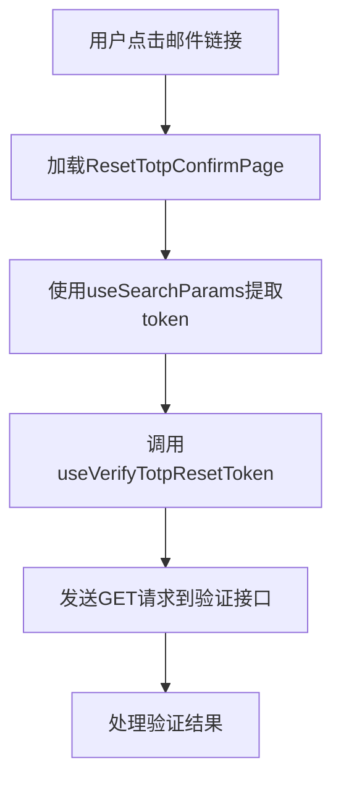
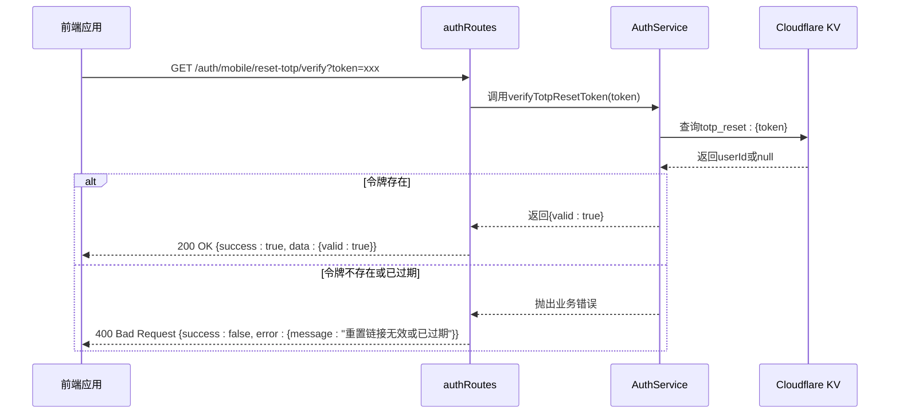
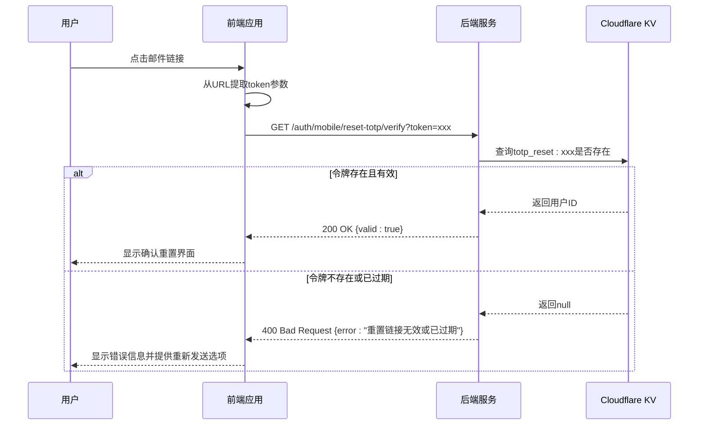

# TOTP重置令牌验证

<cite>
**本文档引用的文件**
- [auth.ts](file://backend/src/routes/v2/auth.ts)
- [AuthService.ts](file://backend/src/services/AuthService.ts)
- [useAuth.ts](file://frontend/src/hooks/business/useAuth.ts)
- [api.ts](file://frontend/src/config/api.ts)
- [ResetTotpConfirmPage.tsx](file://frontend/src/features/auth/pages/ResetTotpConfirmPage.tsx)
- [errorCodes.ts](file://backend/src/constants/errorCodes.ts)
- [errors.ts](file://backend/src/utils/errors.ts)
</cite>

## 目录
1. [TOTP重置流程概述](#totp重置流程概述)
2. [前端验证流程](#前端验证流程)
3. [后端验证机制](#后端验证机制)
4. [安全与错误处理](#安全与错误处理)
5. [流程时序图](#流程时序图)

## TOTP重置流程概述

TOTP（基于时间的一次性密码）重置流程是系统安全架构的重要组成部分，旨在为用户提供在丢失2FA设备时的安全恢复机制。该流程通过多步骤验证确保只有合法用户能够重置其2FA设置。

整个流程分为三个主要阶段：
1. **请求阶段**：用户提交邮箱地址，系统生成重置令牌并发送包含验证链接的邮件
2. **验证阶段**：用户点击邮件链接后，前端提取令牌并调用验证接口，确认令牌的有效性
3. **确认阶段**：在令牌验证通过后，用户确认重置操作，系统清除原有的TOTP密钥

此文档重点阐述第二阶段的验证机制，即`verifyTotpResetToken`的实现细节。

## 前端验证流程

前端在TOTP重置验证环节扮演着关键角色，负责从用户交互中提取令牌并调用相应的API接口进行验证。

当用户点击邮件中的重置链接时，前端应用会加载`ResetTotpConfirmPage`页面，该页面通过React的`useSearchParams`钩子从URL查询参数中提取`token`值。这一过程在页面加载时自动触发，无需用户额外操作。



**流程细节：**
- 邮件链接格式为`https://cloudflarets.com/auth/reset-totp?token={token}`
- 前端组件`ResetTotpConfirmPage.tsx`负责处理整个验证流程
- 使用`useVerifyTotpResetToken`自定义钩子封装API调用逻辑
- 验证过程中显示加载状态，提升用户体验

**Section sources**
- [ResetTotpConfirmPage.tsx](file://frontend/src/features/auth/pages/ResetTotpConfirmPage.tsx#L13-L14)
- [useAuth.ts](file://frontend/src/hooks/business/useAuth.ts#L50-L56)

## 后端验证机制

后端验证机制是TOTP重置流程的核心安全闸门，通过`AuthService`的`verifyTotpResetToken`方法实现严格的令牌验证。



**验证流程详解：**

1. **路由定义**：后端通过`createRoute`定义了`/auth/mobile/reset-totp/verify`的GET接口，该接口接受一个必需的`token`查询参数。

2. **令牌查询**：`verifyTotpResetToken`方法接收前端传递的令牌，并使用Cloudflare KV的`get`方法查询`totp_reset:{token}`键的存在性。

3. **有效性检查**：系统检查KV中是否存在对应的键值对。如果不存在，说明令牌已被使用、已过期或从未生成。

4. **响应生成**：验证通过时返回`{valid: true}`，验证失败时抛出明确的业务错误。

**关键代码路径：**
- 路由定义：`backend/src/routes/v2/auth.ts`
- 服务实现：`backend/src/services/AuthService.ts`
- KV查询：`this.kv.get(totp_reset:${token})`

**Diagram sources**
- [auth.ts](file://backend/src/routes/v2/auth.ts#L616-L646)
- [AuthService.ts](file://backend/src/services/AuthService.ts#L472-L478)

**Section sources**
- [auth.ts](file://backend/src/routes/v2/auth.ts#L616-L646)
- [AuthService.ts](file://backend/src/services/AuthService.ts#L472-L478)

## 安全与错误处理

安全性和错误处理是TOTP重置验证环节的关键要素，系统通过多层次的机制确保流程的安全可靠。

### 错误处理策略

系统采用统一的错误处理框架，确保所有错误都能被正确记录和响应。当令牌验证失败时，系统返回明确的业务错误信息：

```json
{
  "success": false,
  "error": {
    "code": "BUSINESS_GENERAL",
    "message": "重置链接无效或已过期"
  }
}
```

这种设计避免了暴露系统内部细节，同时为用户提供清晰的操作指引。

### 安全特性

1. **令牌时效性**：所有重置令牌在Cloudflare KV中设置30分钟的过期时间（`expirationTtl: 1800`），确保令牌不会永久有效。

2. **一次性使用**：虽然验证接口本身不消耗令牌，但后续的确认操作会立即删除令牌，防止重复使用。

3. **防枚举攻击**：系统在处理无效令牌时返回一致的错误信息，防止攻击者通过错误信息差异判断邮箱是否存在。

4. **审计日志**：每次重置请求和验证操作都会记录到审计日志中，便于安全审查和问题追踪。

### 错误代码体系

系统使用标准化的错误代码体系，便于前端根据错误类型进行差异化处理：

| 错误代码 | 含义 | HTTP状态码 |
|---------|------|-----------|
| BUSINESS_GENERAL | 通用业务错误 | 400 |
| AUTH_UNAUTHORIZED | 未授权访问 | 401 |
| VALIDATION_BAD_REQUEST | 请求验证失败 | 400 |

**Section sources**
- [errors.ts](file://backend/src/utils/errors.ts#L49-L50)
- [errorCodes.ts](file://backend/src/constants/errorCodes.ts#L19-L26)
- [AuthService.ts](file://backend/src/services/AuthService.ts#L475)

## 流程时序图

以下时序图完整展示了从用户点击邮件链接到完成验证的整个流程：



**Diagram sources**
- [ResetTotpConfirmPage.tsx](file://frontend/src/features/auth/pages/ResetTotpConfirmPage.tsx)
- [auth.ts](file://backend/src/routes/v2/auth.ts)
- [AuthService.ts](file://backend/src/services/AuthService.ts)