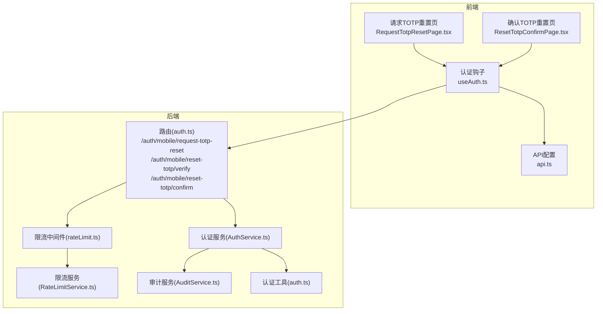
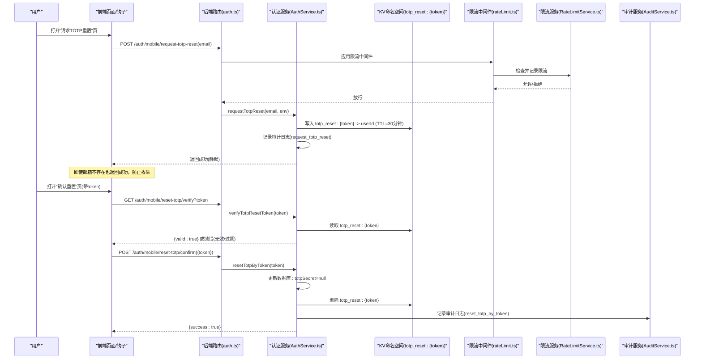
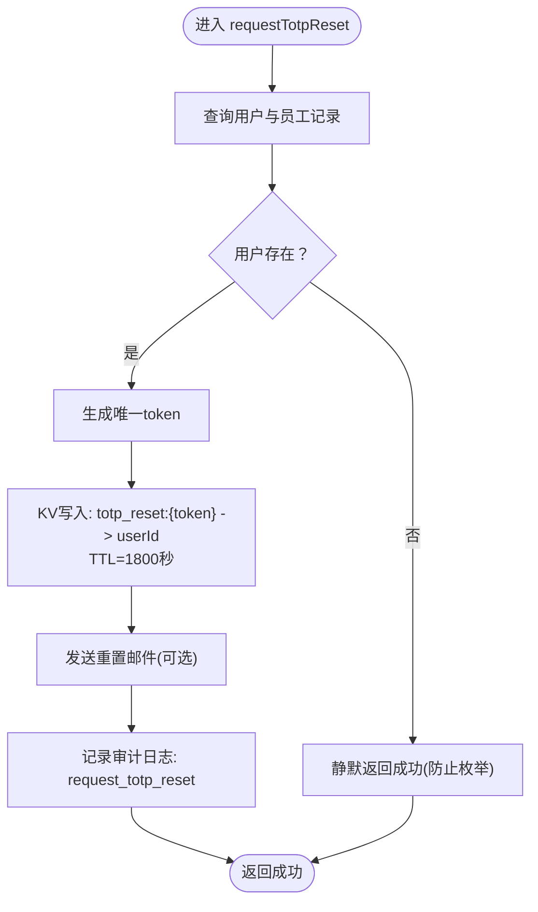
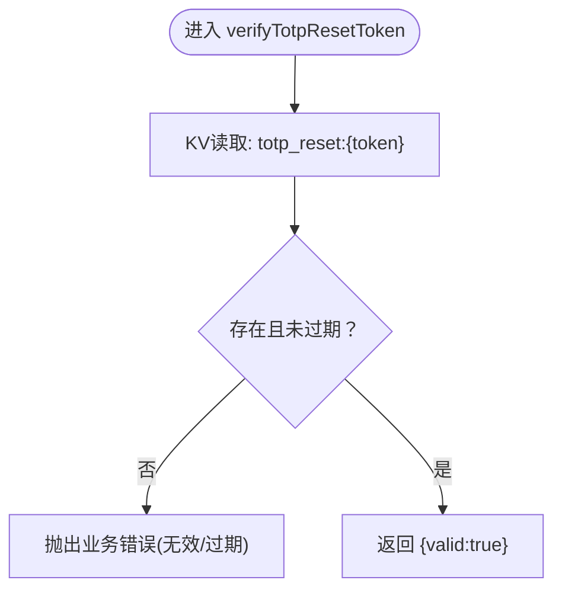
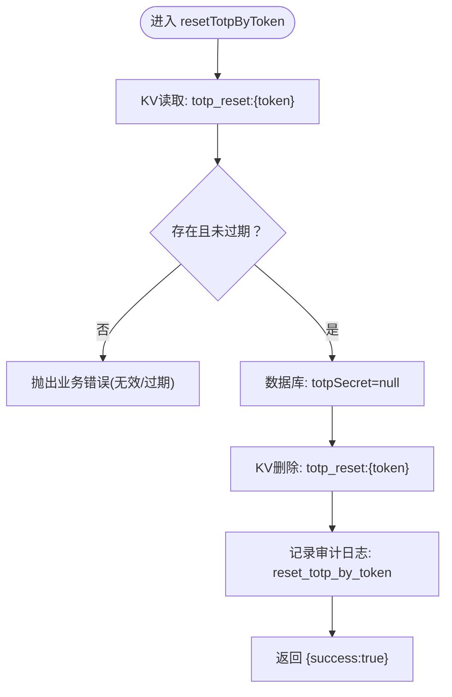
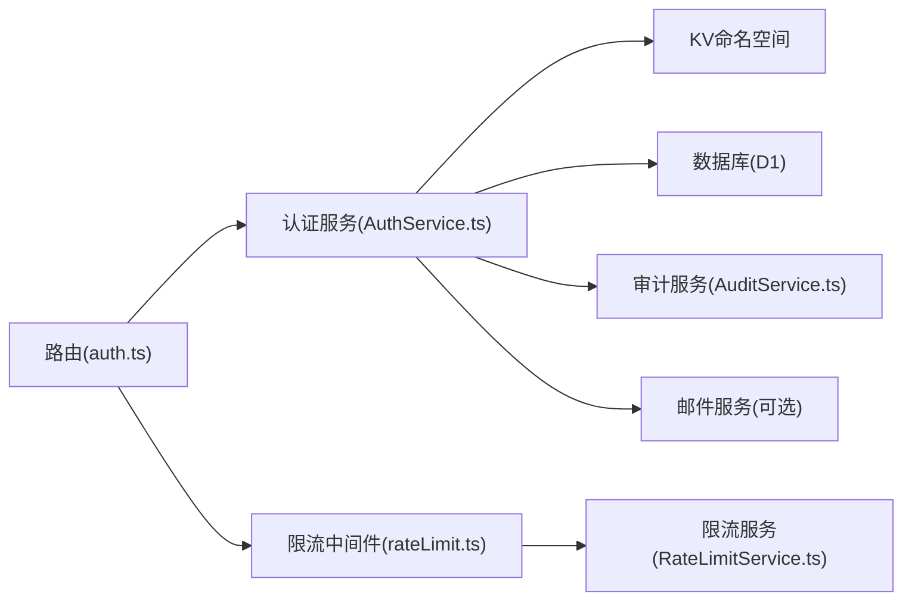

# TOTP重置流程

<cite>
**本文引用的文件列表**
- [后端路由(auth.ts)](file://backend/src/routes/v2/auth.ts)
- [认证服务(AuthService.ts)](file://backend/src/services/AuthService.ts)
- [认证工具(auth.ts)](file://backend/src/utils/auth.ts)
- [限流中间件(rateLimit.ts)](file://backend/src/middleware/rateLimit.ts)
- [限流服务(RateLimitService.ts)](file://backend/src/services/RateLimitService.ts)
- [审计服务(AuditService.ts)](file://backend/src/services/AuditService.ts)
- [前端请求TOTP重置页(RequestTotpResetPage.tsx)](file://frontend/src/features/auth/pages/RequestTotpResetPage.tsx)
- [前端确认TOTP重置页(ResetTotpConfirmPage.tsx)](file://frontend/src/features/auth/pages/ResetTotpConfirmPage.tsx)
- [前端认证钩子(useAuth.ts)](file://frontend/src/hooks/business/useAuth.ts)
- [前端API配置(api.ts)](file://frontend/src/config/api.ts)
</cite>

## 目录
1. [简介](#简介)
2. [项目结构与入口](#项目结构与入口)
3. [核心组件](#核心组件)
4. [架构总览](#架构总览)
5. [详细组件分析](#详细组件分析)
6. [依赖关系分析](#依赖关系分析)
7. [性能与安全特性](#性能与安全特性)
8. [故障排查指南](#故障排查指南)
9. [结论](#结论)

## 简介
本技术文档聚焦TOTP重置流程的安全设计与实现细节，围绕以下目标展开：
- 通过KV命名空间(totp_reset:{token})存储临时重置请求，设置30分钟有效期，有效防止暴力破解与重放攻击。
- verifyTotpResetToken的验证机制：仅校验token是否存在且未过期，不暴露账户有效性，采用静默返回策略。
- resetTotpByToken执行时的原子性：先清除用户TOTP密钥，再删除重置token，确保在任一时刻不会出现“半完成”状态。
- 全流程记录完整的审计日志，便于追踪与合规审计。
- 结合前端页面与钩子，展示用户交互与静默防护策略。

## 项目结构与入口
- 后端路由定义了三个关键端点：请求TOTP重置、验证重置令牌、确认重置。
- 认证服务实现具体业务逻辑：生成token、写入KV、验证token、重置TOTP并删除token。
- 限流中间件与服务保障接口抗压能力，避免暴力破解。
- 审计服务统一记录操作，覆盖请求与确认两个关键节点。
- 前端页面与钩子负责用户交互、静默返回与错误处理。

图表来源
- [后端路由(auth.ts)](file://backend/src/routes/v2/auth.ts#L573-L687)
- [认证服务(AuthService.ts)](file://backend/src/services/AuthService.ts#L444-L493)
- [限流中间件(rateLimit.ts)](file://backend/src/middleware/rateLimit.ts#L84-L97)
- [限流服务(RateLimitService.ts)](file://backend/src/services/RateLimitService.ts#L107-L145)
- [审计服务(AuditService.ts)](file://backend/src/services/AuditService.ts#L65-L90)
- [认证工具(auth.ts)](file://backend/src/utils/auth.ts#L1-L17)
- [前端请求TOTP重置页(RequestTotpResetPage.tsx)](file://frontend/src/features/auth/pages/RequestTotpResetPage.tsx#L1-L91)
- [前端确认TOTP重置页(ResetTotpConfirmPage.tsx)](file://frontend/src/features/auth/pages/ResetTotpConfirmPage.tsx#L1-L121)
- [前端认证钩子(useAuth.ts)](file://frontend/src/hooks/business/useAuth.ts#L36-L69)
- [前端API配置(api.ts)](file://frontend/src/config/api.ts#L12-L28)

章节来源
- [后端路由(auth.ts)](file://backend/src/routes/v2/auth.ts#L573-L687)
- [认证服务(AuthService.ts)](file://backend/src/services/AuthService.ts#L444-L493)
- [限流中间件(rateLimit.ts)](file://backend/src/middleware/rateLimit.ts#L84-L97)
- [限流服务(RateLimitService.ts)](file://backend/src/services/RateLimitService.ts#L107-L145)
- [审计服务(AuditService.ts)](file://backend/src/services/AuditService.ts#L65-L90)
- [认证工具(auth.ts)](file://backend/src/utils/auth.ts#L1-L17)
- [前端请求TOTP重置页(RequestTotpResetPage.tsx)](file://frontend/src/features/auth/pages/RequestTotpResetPage.tsx#L1-L91)
- [前端确认TOTP重置页(ResetTotpConfirmPage.tsx)](file://frontend/src/features/auth/pages/ResetTotpConfirmPage.tsx#L1-L121)
- [前端认证钩子(useAuth.ts)](file://frontend/src/hooks/business/useAuth.ts#L36-L69)
- [前端API配置(api.ts)](file://frontend/src/config/api.ts#L12-L28)

## 核心组件
- 请求TOTP重置端点：接收邮箱，静默返回成功，向用户邮箱发送重置邮件，并在KV中以“totp_reset:{token}”形式写入userId，有效期30分钟。
- 验证TOTP重置令牌端点：仅判断token是否存在且未过期，返回布尔值；不暴露账户有效性，防止枚举攻击。
- 确认TOTP重置端点：校验token后，原子性地清除用户TOTP密钥并删除KV中的token，同时记录审计日志。

章节来源
- [后端路由(auth.ts)](file://backend/src/routes/v2/auth.ts#L573-L687)
- [认证服务(AuthService.ts)](file://backend/src/services/AuthService.ts#L444-L493)

## 架构总览
下图展示了从用户发起请求到完成重置的端到端流程，包括KV存储、限流控制、验证与原子性操作、审计日志。

图表来源
- [后端路由(auth.ts)](file://backend/src/routes/v2/auth.ts#L573-L687)
- [认证服务(AuthService.ts)](file://backend/src/services/AuthService.ts#L444-L493)
- [限流中间件(rateLimit.ts)](file://backend/src/middleware/rateLimit.ts#L84-L97)
- [限流服务(RateLimitService.ts)](file://backend/src/services/RateLimitService.ts#L107-L145)
- [审计服务(AuditService.ts)](file://backend/src/services/AuditService.ts#L65-L90)

## 详细组件分析

### 请求TOTP重置(requestTotpReset)
- 输入：邮箱(email)
- 处理：
  - 查询用户与员工记录，若不存在则静默返回成功，防止邮箱枚举。
  - 生成唯一token，写入KV命名空间“totp_reset:{token}”，值为userId，TTL=1800秒(30分钟)。
  - 若存在邮件服务，向个人邮箱(或公司邮箱)发送重置邮件。
  - 记录审计日志“request_totp_reset”。
- 输出：始终返回成功，不暴露账户存在性。

图表来源
- [认证服务(AuthService.ts)](file://backend/src/services/AuthService.ts#L444-L469)

章节来源
- [认证服务(AuthService.ts)](file://backend/src/services/AuthService.ts#L444-L469)

### 验证TOTP重置令牌(verifyTotpResetToken)
- 输入：token
- 处理：
  - 从KV读取“totp_reset:{token}”，若不存在或已过期则抛出业务错误。
  - 成功时仅返回{valid:true}，不返回账户信息。
- 输出：布尔有效性，静默策略避免泄露账户存在性。

图表来源
- [认证服务(AuthService.ts)](file://backend/src/services/AuthService.ts#L472-L478)

章节来源
- [认证服务(AuthService.ts)](file://backend/src/services/AuthService.ts#L472-L478)

### 确认TOTP重置(resetTotpByToken)
- 输入：token
- 处理：
  - 从KV读取userId，若不存在则抛出业务错误。
  - 原子性操作：
    - 数据库：将用户的totpSecret置空。
    - KV：删除“totp_reset:{token}”。
  - 记录审计日志“reset_totp_by_token”。
- 输出：{success:true}

图表来源
- [认证服务(AuthService.ts)](file://backend/src/services/AuthService.ts#L480-L493)

章节来源
- [认证服务(AuthService.ts)](file://backend/src/services/AuthService.ts#L480-L493)

### 前端交互与静默策略
- 请求TOTP重置页：
  - 用户提交邮箱后，静默返回成功，即使邮箱不存在也提示成功，防止枚举。
- 确认TOTP重置页：
  - 打开页面时自动验证token，静默处理错误并显示结果。
  - 点击“确认重置”后，静默返回成功并提示用户已重置。

章节来源
- [前端请求TOTP重置页(RequestTotpResetPage.tsx)](file://frontend/src/features/auth/pages/RequestTotpResetPage.tsx#L1-L91)
- [前端确认TOTP重置页(ResetTotpConfirmPage.tsx)](file://frontend/src/features/auth/pages/ResetTotpConfirmPage.tsx#L1-L121)
- [前端认证钩子(useAuth.ts)](file://frontend/src/hooks/business/useAuth.ts#L36-L69)
- [前端API配置(api.ts)](file://frontend/src/config/api.ts#L12-L28)

## 依赖关系分析
- 路由层依赖认证服务，认证服务依赖KV、数据库、审计服务与邮件服务。
- 限流中间件通过限流服务实现滑动窗口计数，按“邮箱”维度对TOTP重置请求进行限流。
- 审计服务提供统一的日志记录接口，覆盖请求与确认两个关键动作。

图表来源
- [后端路由(auth.ts)](file://backend/src/routes/v2/auth.ts#L573-L687)
- [认证服务(AuthService.ts)](file://backend/src/services/AuthService.ts#L1-L40)
- [限流中间件(rateLimit.ts)](file://backend/src/middleware/rateLimit.ts#L84-L97)
- [限流服务(RateLimitService.ts)](file://backend/src/services/RateLimitService.ts#L107-L145)
- [审计服务(AuditService.ts)](file://backend/src/services/AuditService.ts#L65-L90)

章节来源
- [后端路由(auth.ts)](file://backend/src/routes/v2/auth.ts#L573-L687)
- [认证服务(AuthService.ts)](file://backend/src/services/AuthService.ts#L1-L40)
- [限流中间件(rateLimit.ts)](file://backend/src/middleware/rateLimit.ts#L84-L97)
- [限流服务(RateLimitService.ts)](file://backend/src/services/RateLimitService.ts#L107-L145)
- [审计服务(AuditService.ts)](file://backend/src/services/AuditService.ts#L65-L90)

## 性能与安全特性
- KV存储与TTL：
  - 使用KV命名空间“totp_reset:{token}”存放userId，TTL=1800秒，天然防重放与过期清理。
- 静默返回策略：
  - 请求TOTP重置与验证阶段均不暴露账户存在性，有效降低枚举风险。
- 原子性操作：
  - 在数据库更新与KV删除之间无其他副作用，确保一致性。
- 限流控制：
  - 对“TOTP重置请求”按邮箱维度进行限流，窗口为1小时，限制为3次，显著降低暴力破解成功率。
- 审计日志：
  - 记录“request_totp_reset”与“reset_totp_by_token”，便于审计与追溯。

章节来源
- [认证服务(AuthService.ts)](file://backend/src/services/AuthService.ts#L444-L493)
- [限流中间件(rateLimit.ts)](file://backend/src/middleware/rateLimit.ts#L84-L97)
- [限流服务(RateLimitService.ts)](file://backend/src/services/RateLimitService.ts#L107-L145)
- [审计服务(AuditService.ts)](file://backend/src/services/AuditService.ts#L65-L90)

## 故障排查指南
- 验证失败或链接无效：
  - 检查token是否存在于KV且未过期；若不存在或已过期，前端应提示重新请求。
- 重置失败：
  - 确认数据库更新与KV删除是否都成功；若部分失败，需人工核对KV与数据库状态。
- 限流触发：
  - 查看限流中间件返回的头部与错误码，确认是否达到每小时3次的上限。
- 审计日志缺失：
  - 确认审计服务是否可用，检查日志表结构与字段映射。

章节来源
- [认证服务(AuthService.ts)](file://backend/src/services/AuthService.ts#L472-L493)
- [限流中间件(rateLimit.ts)](file://backend/src/middleware/rateLimit.ts#L1-L60)
- [审计服务(AuditService.ts)](file://backend/src/services/AuditService.ts#L65-L90)

## 结论
TOTP重置流程通过KV命名空间与TTL实现临时令牌管理，结合静默返回与原子性操作，有效抵御暴力破解与枚举攻击；配合限流与审计，形成完整的安全闭环。前端页面与钩子进一步强化用户体验与安全性，确保用户在无泄露信息的前提下完成重置。