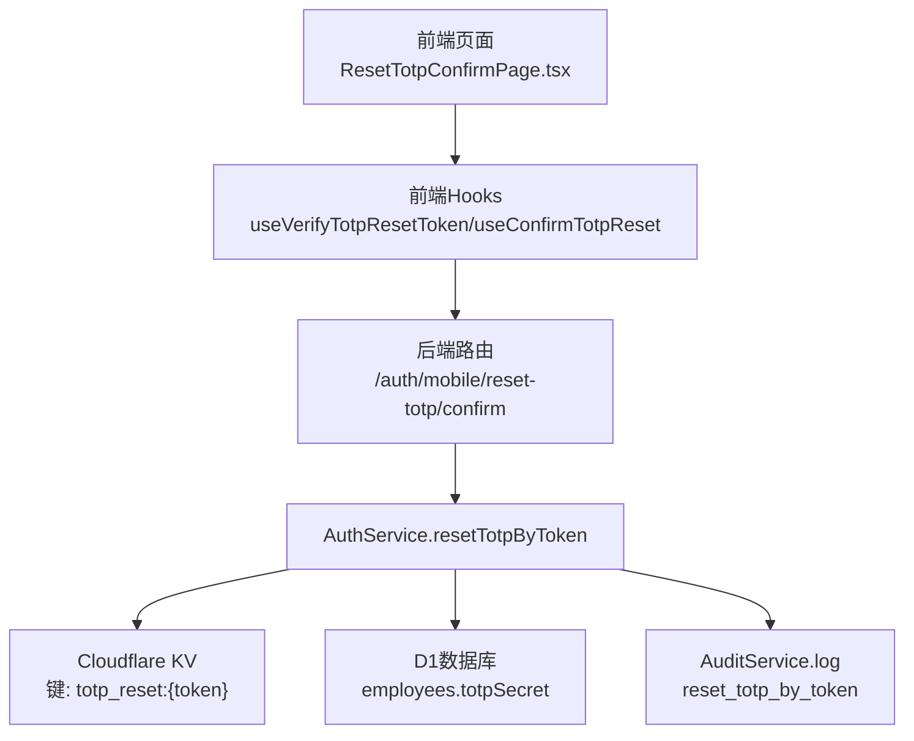
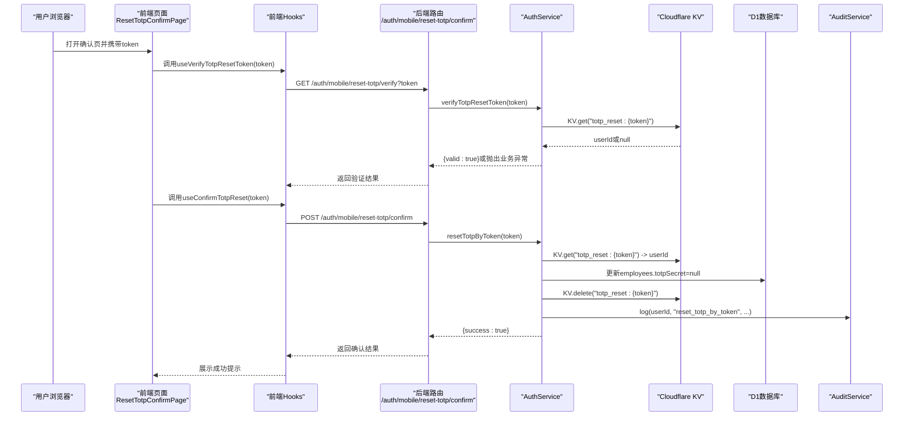
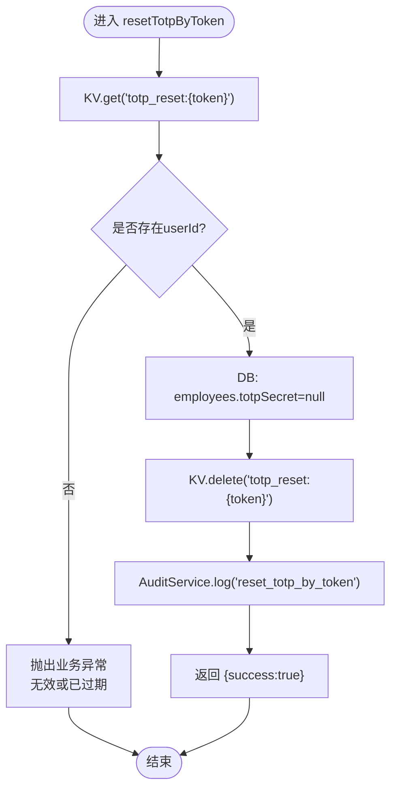
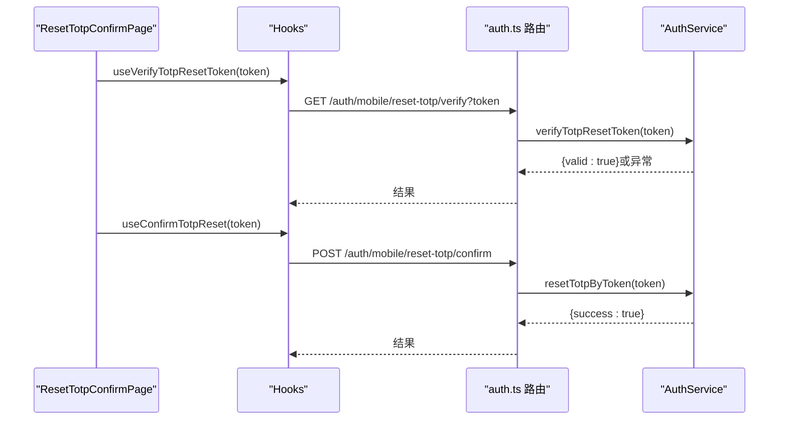
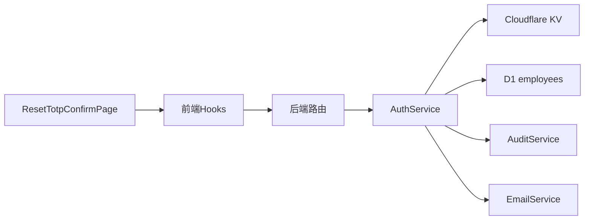

# TOTP重置确认

<cite>
**本文引用的文件**
- [backend/src/services/AuthService.ts](file://backend/src/services/AuthService.ts)
- [backend/src/routes/v2/auth.ts](file://backend/src/routes/v2/auth.ts)
- [frontend/src/features/auth/pages/ResetTotpConfirmPage.tsx](file://frontend/src/features/auth/pages/ResetTotpConfirmPage.tsx)
- [frontend/src/hooks/business/useAuth.ts](file://frontend/src/hooks/business/useAuth.ts)
- [backend/src/services/AuditService.ts](file://backend/src/services/AuditService.ts)
- [backend/src/db/schema.ts](file://backend/src/db/schema.ts)
- [backend/src/services/EmailService.ts](file://backend/src/services/EmailService.ts)
</cite>

## 目录
1. [简介](#简介)
2. [项目结构](#项目结构)
3. [核心组件](#核心组件)
4. [架构总览](#架构总览)
5. [详细组件分析](#详细组件分析)
6. [依赖关系分析](#依赖关系分析)
7. [性能与安全考量](#性能与安全考量)
8. [故障排查指南](#故障排查指南)
9. [结论](#结论)

## 简介
本技术文档聚焦TOTP重置确认流程中的原子性操作，围绕后端AuthService的resetTotpByToken方法展开，说明用户在确认页面提交token后，系统如何按序执行以下步骤：
- 验证token有效性
- 在数据库中将对应用户的totpSecret字段置为null以解除2FA绑定
- 立即从Cloudflare KV中删除totp_reset:{token}键，确保token一次性使用
- 记录reset_totp_by_token审计日志
同时强调该流程的原子性与安全性，防止重放攻击；并解释为什么成功后不返回用户敏感信息，仅提供成功标志。

## 项目结构
- 前端：ResetTotpConfirmPage负责展示“确认重置2FA”界面，触发验证与确认两个步骤。
- 后端：auth路由暴露/mobile/reset-totp/confirm接口，调用AuthService.resetTotpByToken执行核心逻辑。
- 服务层：AuthService封装认证、会话、审计、邮件等能力，resetTotpByToken使用KV与DB、AuditService协作。
- 数据模型：employees表包含totpSecret字段，用于存储2FA密钥。
- 审计：AuditService统一记录审计日志，reset_totp_by_token为标准动作类型之一。

图表来源
- [backend/src/routes/v2/auth.ts](file://backend/src/routes/v2/auth.ts#L648-L687)
- [backend/src/services/AuthService.ts](file://backend/src/services/AuthService.ts#L479-L493)
- [backend/src/services/AuditService.ts](file://backend/src/services/AuditService.ts#L65-L90)
- [backend/src/db/schema.ts](file://backend/src/db/schema.ts#L14-L48)

章节来源
- [backend/src/routes/v2/auth.ts](file://backend/src/routes/v2/auth.ts#L648-L687)
- [frontend/src/features/auth/pages/ResetTotpConfirmPage.tsx](file://frontend/src/features/auth/pages/ResetTotpConfirmPage.tsx#L1-L121)
- [frontend/src/hooks/business/useAuth.ts](file://frontend/src/hooks/business/useAuth.ts#L47-L67)

## 核心组件
- AuthService.resetTotpByToken：核心原子操作执行者，负责token校验、数据库更新、KV清理、审计记录。
- 前端ResetTotpConfirmPage：用户交互入口，先验证token有效性，再提交确认。
- AuditService：统一审计日志写入，保证合规与可追溯。
- D1 Schema：employees表的totpSecret字段承载2FA绑定状态。
- Cloudflare KV：以键值形式存储TOTP重置token映射，配合TTL实现一次性使用。

章节来源
- [backend/src/services/AuthService.ts](file://backend/src/services/AuthService.ts#L479-L493)
- [backend/src/services/AuditService.ts](file://backend/src/services/AuditService.ts#L65-L90)
- [backend/src/db/schema.ts](file://backend/src/db/schema.ts#L14-L48)

## 架构总览
下图展示了从用户点击确认到系统完成原子重置的端到端流程。

图表来源
- [backend/src/routes/v2/auth.ts](file://backend/src/routes/v2/auth.ts#L616-L687)
- [backend/src/services/AuthService.ts](file://backend/src/services/AuthService.ts#L472-L493)
- [backend/src/services/AuditService.ts](file://backend/src/services/AuditService.ts#L65-L90)

## 详细组件分析

### resetTotpByToken原子操作详解
- 输入：token字符串
- 步骤：
  1) KV读取：KV.get("totp_reset:{token}")，若无userId则抛出业务异常（无效或过期），阻止后续操作。
  2) DB更新：employees表将totpSecret置为null，解除2FA绑定。
  3) KV清理：KV.delete("totp_reset:{token}")，确保token一次性使用。
  4) 审计：AuditService.log(userId, "reset_totp_by_token", ...)，记录操作主体、实体、时间等。
  5) 输出：返回{success:true}，不包含任何敏感信息。
- 原子性保障：上述步骤在单次调用中顺序执行，一旦任一步失败（如KV中无token），将抛出异常，不会产生部分状态；KV删除发生在DB更新之后，确保token不可重用。
- 安全性要点：
  - token仅在有效期内存在，且KV带有TTL（由请求阶段写入时设定）。
  - KV删除确保token只能使用一次，防止重放。
  - 成功响应不返回敏感数据，避免泄露用户信息。

图表来源
- [backend/src/services/AuthService.ts](file://backend/src/services/AuthService.ts#L479-L493)
- [backend/src/services/AuditService.ts](file://backend/src/services/AuditService.ts#L65-L90)

章节来源
- [backend/src/services/AuthService.ts](file://backend/src/services/AuthService.ts#L479-L493)

### 前端交互与路由调用
- 前端页面ResetTotpConfirmPage.tsx：
  - 从URL参数读取token，先调用useVerifyTotpResetToken进行预检，再在用户确认时调用useConfirmTotpReset执行重置。
  - 若验证失败，展示错误结果并引导用户重新发送链接；成功后提示用户可使用密码登录。
- 前端Hooks：
  - useVerifyTotpResetToken：GET /auth/mobile/reset-totp/verify?token
  - useConfirmTotpReset：POST /auth/mobile/reset-totp/confirm
- 后端路由：
  - /auth/mobile/reset-totp/verify：调用AuthService.verifyTotpResetToken
  - /auth/mobile/reset-totp/confirm：调用AuthService.resetTotpByToken

图表来源
- [frontend/src/features/auth/pages/ResetTotpConfirmPage.tsx](file://frontend/src/features/auth/pages/ResetTotpConfirmPage.tsx#L1-L121)
- [frontend/src/hooks/business/useAuth.ts](file://frontend/src/hooks/business/useAuth.ts#L47-L67)
- [backend/src/routes/v2/auth.ts](file://backend/src/routes/v2/auth.ts#L616-L687)

章节来源
- [frontend/src/features/auth/pages/ResetTotpConfirmPage.tsx](file://frontend/src/features/auth/pages/ResetTotpConfirmPage.tsx#L1-L121)
- [frontend/src/hooks/business/useAuth.ts](file://frontend/src/hooks/business/useAuth.ts#L47-L67)
- [backend/src/routes/v2/auth.ts](file://backend/src/routes/v2/auth.ts#L616-L687)

### 数据模型与审计
- employees表的totpSecret字段用于存储2FA密钥；重置时将其置为null，表示解除绑定。
- AuditService提供统一的日志记录接口，reset_totp_by_token为标准动作类型之一，便于审计追踪。

章节来源
- [backend/src/db/schema.ts](file://backend/src/db/schema.ts#L14-L48)
- [backend/src/services/AuditService.ts](file://backend/src/services/AuditService.ts#L65-L90)

## 依赖关系分析
- AuthService依赖：
  - KV命名空间：用于存储totp_reset:{token}映射
  - D1数据库：employees表的读写
  - AuditService：审计日志
  - EmailService：TOTP重置邮件发送（请求阶段）
- 前端依赖：
  - React Query Hooks：useVerifyTotpResetToken、useConfirmTotpReset
  - 页面组件：ResetTotpConfirmPage

图表来源
- [backend/src/services/AuthService.ts](file://backend/src/services/AuthService.ts#L17-L493)
- [backend/src/routes/v2/auth.ts](file://backend/src/routes/v2/auth.ts#L616-L687)
- [frontend/src/features/auth/pages/ResetTotpConfirmPage.tsx](file://frontend/src/features/auth/pages/ResetTotpConfirmPage.tsx#L1-L121)
- [frontend/src/hooks/business/useAuth.ts](file://frontend/src/hooks/business/useAuth.ts#L47-L67)

章节来源
- [backend/src/services/AuthService.ts](file://backend/src/services/AuthService.ts#L17-L493)
- [backend/src/routes/v2/auth.ts](file://backend/src/routes/v2/auth.ts#L616-L687)

## 性能与安全考量
- 性能
  - KV访问为O(1)，读取与删除均快速完成。
  - DB更新为单行写入，开销极小。
- 安全
  - 原子性：resetTotpByToken在单次调用中顺序执行，任一步失败即终止，避免部分状态。
  - 一次性使用：KV删除确保token不可重用，防止重放。
  - 敏感信息最小化：成功响应仅返回success标志，不包含任何用户敏感信息。
  - 时效性：请求阶段写入KV时设置TTL，超时后KV中不再存在，进一步降低风险。
  - 审计可追溯：统一记录reset_totp_by_token，便于事后审计。

章节来源
- [backend/src/services/AuthService.ts](file://backend/src/services/AuthService.ts#L479-L493)
- [backend/src/services/EmailService.ts](file://backend/src/services/EmailService.ts#L335-L345)
- [backend/src/services/AuditService.ts](file://backend/src/services/AuditService.ts#L65-L90)

## 故障排查指南
- 常见错误与定位
  - token无效或已过期：AuthService.verifyTotpResetToken或resetTotpByToken在KV中找不到userId时抛出业务异常。检查请求阶段是否正确写入KV、TTL是否生效、前端传参是否正确。
  - DB更新失败：检查employees表结构与字段权限，确认事务一致性。
  - KV删除失败：检查KV命名空间可用性与权限。
  - 审计未记录：检查AuditService日志写入是否成功。
- 建议排查步骤
  - 前端：确认URL参数token存在且未被篡改。
  - 后端：在resetTotpByToken前后打印关键变量（userId、token），核对KV读写与DB更新。
  - 审计：查询审计日志，确认reset_totp_by_token记录是否出现。

章节来源
- [backend/src/services/AuthService.ts](file://backend/src/services/AuthService.ts#L472-L493)
- [backend/src/services/AuditService.ts](file://backend/src/services/AuditService.ts#L65-L90)

## 结论
TOTP重置确认流程通过AuthService.resetTotpByToken实现了严格的原子性与安全性：
- 以KV为入口校验token有效性
- 以DB更新解除2FA绑定
- 以KV删除确保token一次性使用
- 以审计日志实现可追溯
- 成功响应最小化敏感信息，符合安全最佳实践
该设计有效防止重放攻击，保障用户账户安全与合规审计需求。