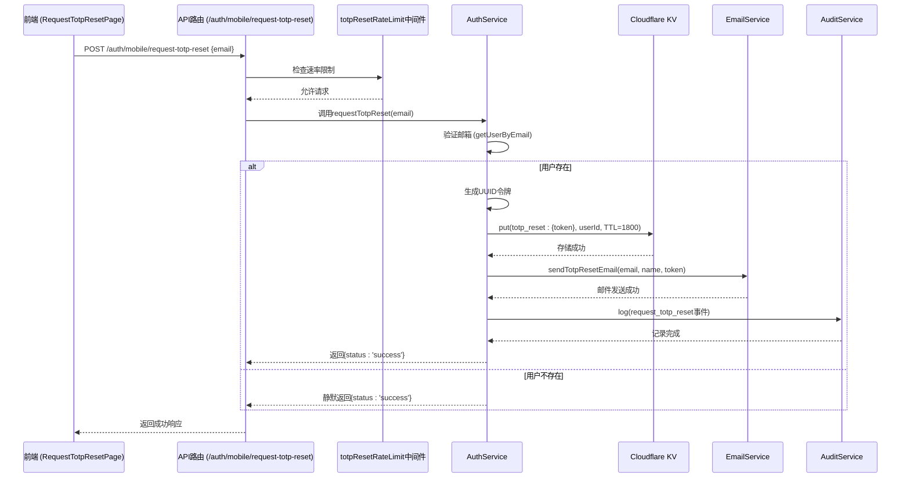
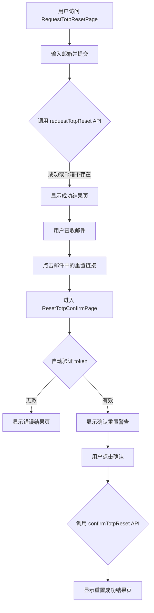

# TOTP重置请求

<cite>
**本文档引用的文件**   
- [AuthService.ts](file://backend/src/services/AuthService.ts)
- [auth.ts](file://backend/src/routes/v2/auth.ts)
- [rateLimit.ts](file://backend/src/middleware/rateLimit.ts)
- [EmailService.ts](file://backend/src/services/EmailService.ts)
- [audit.ts](file://backend/src/utils/audit.ts)
- [RequestTotpResetPage.tsx](file://frontend/src/features/auth/pages/RequestTotpResetPage.tsx)
- [ResetTotpConfirmPage.tsx](file://frontend/src/features/auth/pages/ResetTotpConfirmPage.tsx)
</cite>

## 目录
1. [简介](#简介)
2. [核心流程分析](#核心流程分析)
3. [安全设计详解](#安全设计详解)
4. [组件交互流程图](#组件交互流程图)
5. [审计日志与监控](#审计日志与监控)
6. [前端交互流程](#前端交互流程)

## 简介
本文档详细说明了系统中TOTP（基于时间的一次性密码）重置请求环节的技术实现与安全设计。该功能允许用户在丢失2FA（双因素认证）设备时，通过邮箱验证的方式安全地重置其TOTP绑定。文档重点阐述了`AuthService`服务中的`requestTotpReset`方法的完整处理流程，包括用户验证、令牌生成、Cloudflare KV存储、静默返回策略、邮件通知机制、审计日志记录以及与速率限制中间件的集成，旨在提供一个全面、安全且防滥用的账户恢复方案。

## 核心流程分析
TOTP重置请求的核心流程始于用户在前端页面提交其登录邮箱。后端通过`/auth/mobile/request-totp-reset` API路由接收请求，并调用`AuthService`的`requestTotpReset`方法进行处理。该方法首先通过`EmployeeService`和数据库查询验证邮箱的有效性，此验证同时检查用户的公司邮箱和个人邮箱。为防止账户枚举攻击，无论用户是否存在，系统都采用静默返回策略，统一返回成功响应。

验证通过后，系统生成一个唯一的UUID令牌，并将该令牌与对应的用户ID存入Cloudflare KV（键值存储）中，键名为`totp_reset:{token}`。此KV条目设置了1800秒（30分钟）的过期时间，确保重置链接的时效性。随后，系统通过`EmailService`向用户邮箱发送包含专属重置链接的邮件。最后，整个操作被记录为`request_totp_reset`事件的审计日志，以供后续安全审查。

**本节来源**
- [AuthService.ts](file://backend/src/services/AuthService.ts#L444-L470)
- [auth.ts](file://backend/src/routes/v2/auth.ts#L574-L614)

## 安全设计详解
TOTP重置环节的设计充分考虑了安全性，采用了多层次的防护措施。

**静默返回策略**：这是防止账户枚举攻击的关键。在`requestTotpReset`方法中，当通过`getUserByEmail`和数据库查询未能找到匹配的用户时，代码并未抛出用户不存在的错误，而是直接执行`return { status: 'success' }`。这种设计使得攻击者无法通过观察不同的响应来判断某个邮箱是否在系统中注册，从而有效保护了用户隐私和账户安全。

**令牌存储与过期**：生成的重置令牌不存储在持久化数据库中，而是利用Cloudflare KV的高性能和TTL（Time-To-Live）特性进行管理。通过`await this.kv.put(\`totp_reset:\${token}\`, employee.id, { expirationTtl: 1800 })`，系统将用户ID与令牌关联，并自动在30分钟后清除。这不仅减轻了数据库的负担，也确保了令牌的短暂性，降低了令牌被滥用的风险。

**速率限制**：为防止恶意用户对特定邮箱进行暴力请求，系统集成了`totpResetRateLimit`中间件。该中间件基于`RATE_LIMITS.TOTP_RESET_BY_EMAIL`配置，限制每小时每个邮箱最多只能发起3次重置请求。此机制有效阻止了邮件轰炸和资源滥用。

**审计日志**：每一次重置请求都会被记录到审计日志中。通过调用`this.auditService.log(employee.id, 'request_totp_reset', 'user', employee.id)`，系统记录了操作的发起者（用户ID）、操作类型（request_totp_reset）、实体类型（user）和目标ID。这些日志对于追踪安全事件、进行合规性审查和分析异常行为至关重要。

**本节来源**
- [AuthService.ts](file://backend/src/services/AuthService.ts#L453-L456)
- [AuthService.ts](file://backend/src/services/AuthService.ts#L460)
- [rateLimit.ts](file://backend/src/middleware/rateLimit.ts#L88-L97)
- [audit.ts](file://backend/src/utils/audit.ts)
- [EmailService.ts](file://backend/src/services/EmailService.ts#L338-L382)

## 组件交互流程图
以下序列图展示了从用户发起TOTP重置请求到收到邮件的完整后端处理流程。

**图表来源**
- [AuthService.ts](file://backend/src/services/AuthService.ts#L444-L470)
- [auth.ts](file://backend/src/routes/v2/auth.ts#L607-L614)
- [rateLimit.ts](file://backend/src/middleware/rateLimit.ts#L88-L97)
- [EmailService.ts](file://backend/src/services/EmailService.ts#L338-L382)

## 审计日志与监控
审计日志是TOTP重置流程中不可或缺的安全组件。`logAuditAction`工具函数负责将操作记录到审计系统。它会捕获操作的详细信息，包括操作类型（action）、实体类型（entity）、实体ID、操作详情（detail）、操作者的IP地址和IP归属地。

在`requestTotpReset`流程中，`AuditService`被直接调用，记录`request_totp_reset`事件。这些日志不仅用于事后追溯，还可以与监控系统集成，实现对异常模式的实时告警，例如短时间内同一IP对多个不同邮箱发起重置请求，这可能预示着正在进行的攻击。通过`waitUntil`机制，日志记录作为异步任务执行，确保不会阻塞主请求流程，保证了系统的响应性能。

**本节来源**
- [AuthService.ts](file://backend/src/services/AuthService.ts#L468)
- [audit.ts](file://backend/src/utils/audit.ts)

## 前端交互流程
前端通过两个主要页面实现TOTP重置功能：`RequestTotpResetPage`和`ResetTotpConfirmPage`。

`RequestTotpResetPage`提供一个表单，用户输入其邮箱地址。提交后，前端调用`useRequestTotpReset` Hook发起API请求。为了与后端的静默返回策略保持一致，前端的错误处理逻辑特别设计：当捕获到`not_found`错误时，同样会将用户引导至成功页面，从而在用户界面层面也实现了枚举攻击防护。

用户点击邮件中的链接后，会被重定向到`ResetTotpConfirmPage`。该页面首先解析URL中的`token`参数，并立即调用`useVerifyTotpResetToken`来验证令牌的有效性。如果令牌无效或已过期，页面会显示错误信息。如果验证通过，用户将看到一个确认重置的警告提示，强调此操作的敏感性。用户确认后，`useConfirmTotpReset`被调用，最终完成TOTP的重置。

**本节来源**
- [RequestTotpResetPage.tsx](file://frontend/src/features/auth/pages/RequestTotpResetPage.tsx)
- [ResetTotpConfirmPage.tsx](file://frontend/src/features/auth/pages/ResetTotpConfirmPage.tsx)