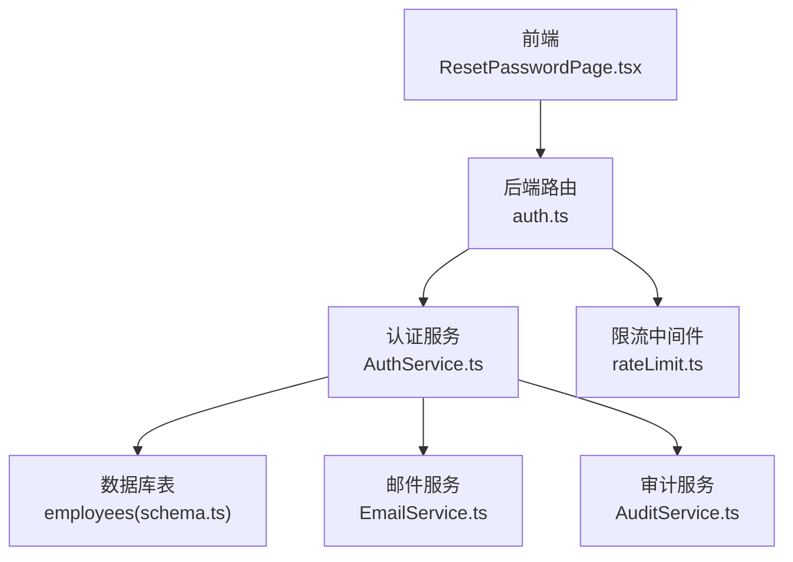
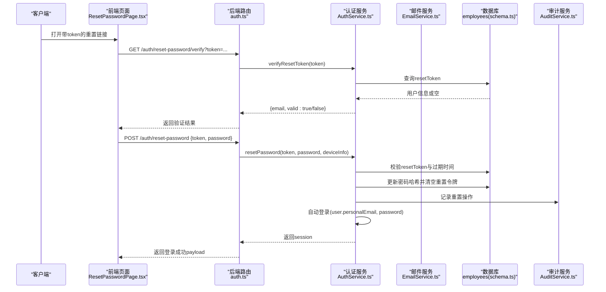
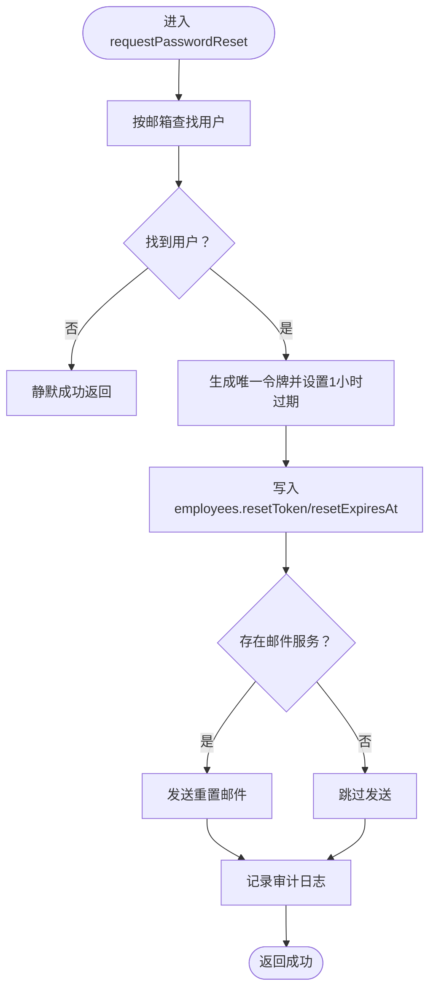
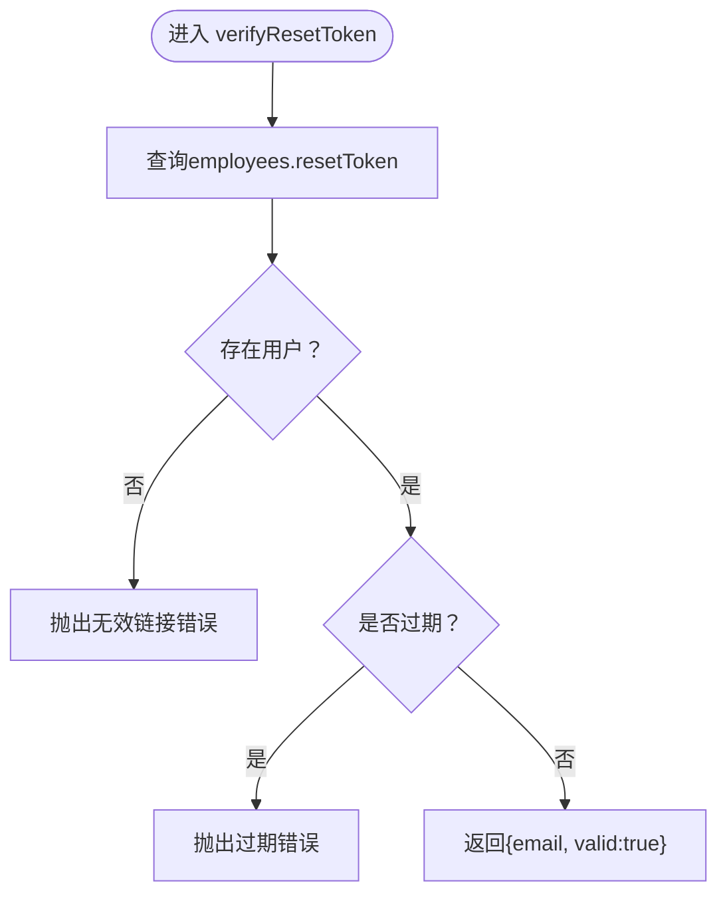
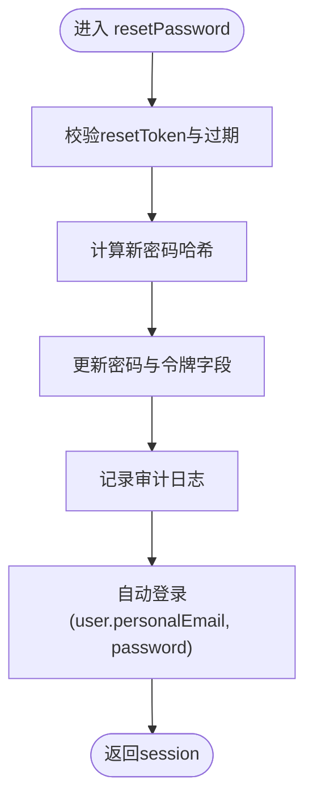
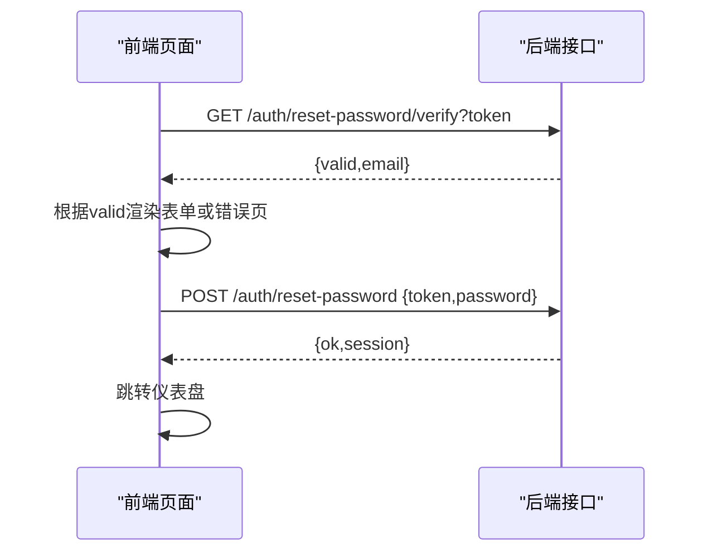
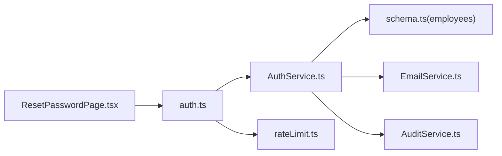

# 密码重置流程

<cite>
**本文引用的文件**
- [AuthService.ts](file://backend/src/services/AuthService.ts)
- [auth.ts](file://backend/src/routes/v2/auth.ts)
- [EmailService.ts](file://backend/src/services/EmailService.ts)
- [AuditService.ts](file://backend/src/services/AuditService.ts)
- [schema.ts](file://backend/src/db/schema.ts)
- [rateLimit.ts](file://backend/src/middleware/rateLimit.ts)
- [password_reset.test.ts](file://backend/test/services/password_reset.test.ts)
- [ResetPasswordPage.tsx](file://frontend/src/features/auth/pages/ResetPasswordPage.tsx)
- [employees.ts](file://backend/src/routes/v2/employees.ts)
</cite>

## 目录
1. [简介](#简介)
2. [项目结构与入口](#项目结构与入口)
3. [核心组件](#核心组件)
4. [架构总览](#架构总览)
5. [详细组件分析](#详细组件分析)
6. [依赖关系分析](#依赖关系分析)
7. [性能与安全特性](#性能与安全特性)
8. [故障排查指南](#故障排查指南)
9. [结论](#结论)

## 简介
本专项文档聚焦于密码重置流程，系统提供“请求重置”“验证令牌”“重置密码并自动登录”的端到端能力。重点说明：
- 如何生成唯一重置令牌并设置1小时有效期；
- 通过邮件发送重置链接；
- verifyResetToken的时效性验证机制；
- resetPassword在成功重置后自动登录用户；
- 静默处理策略防止邮箱枚举攻击；
- 完整审计日志记录，确保操作可追溯。

## 项目结构与入口
密码重置涉及前后端协作：
- 后端路由定义了请求重置、验证令牌、重置密码接口，并应用限流策略；
- AuthService封装业务逻辑，包括令牌生成、校验、密码重置与自动登录；
- EmailService负责发送重置邮件；
- AuditService记录审计日志；
- 前端ResetPasswordPage负责展示验证与重置UI。

图表来源
- [auth.ts](file://backend/src/routes/v2/auth.ts#L445-L528)
- [AuthService.ts](file://backend/src/services/AuthService.ts#L229-L327)
- [EmailService.ts](file://backend/src/services/EmailService.ts#L338-L382)
- [AuditService.ts](file://backend/src/services/AuditService.ts#L65-L89)
- [schema.ts](file://backend/src/db/schema.ts#L14-L48)
- [rateLimit.ts](file://backend/src/middleware/rateLimit.ts#L73-L82)
- [ResetPasswordPage.tsx](file://frontend/src/features/auth/pages/ResetPasswordPage.tsx#L1-L176)

章节来源
- [auth.ts](file://backend/src/routes/v2/auth.ts#L445-L528)
- [AuthService.ts](file://backend/src/services/AuthService.ts#L229-L327)
- [EmailService.ts](file://backend/src/services/EmailService.ts#L338-L382)
- [AuditService.ts](file://backend/src/services/AuditService.ts#L65-L89)
- [schema.ts](file://backend/src/db/schema.ts#L14-L48)
- [rateLimit.ts](file://backend/src/middleware/rateLimit.ts#L73-L82)
- [ResetPasswordPage.tsx](file://frontend/src/features/auth/pages/ResetPasswordPage.tsx#L1-L176)

## 核心组件
- requestPasswordReset：生成唯一重置令牌并设置1小时有效期，异步发送重置邮件，静默处理不存在的用户以防止枚举攻击，记录审计日志。
- verifyResetToken：根据令牌查询用户，校验是否存在与是否过期，返回邮箱与有效性。
- resetPassword：校验令牌与有效期，哈希新密码并更新用户记录，清理重置令牌字段，记录审计日志，随后自动登录用户并返回会话。

章节来源
- [AuthService.ts](file://backend/src/services/AuthService.ts#L229-L327)
- [password_reset.test.ts](file://backend/test/services/password_reset.test.ts#L113-L159)

## 架构总览
密码重置端到端时序如下：

图表来源
- [auth.ts](file://backend/src/routes/v2/auth.ts#L445-L528)
- [AuthService.ts](file://backend/src/services/AuthService.ts#L265-L327)
- [EmailService.ts](file://backend/src/services/EmailService.ts#L338-L382)
- [schema.ts](file://backend/src/db/schema.ts#L14-L48)
- [AuditService.ts](file://backend/src/services/AuditService.ts#L65-L89)
- [ResetPasswordPage.tsx](file://frontend/src/features/auth/pages/ResetPasswordPage.tsx#L1-L176)

## 详细组件分析

### requestPasswordReset：生成与发送重置令牌
- 令牌生成：使用唯一标识拼接生成长令牌，设置1小时后过期时间。
- 发送邮件：若存在邮件服务，向用户个人邮箱发送重置链接。
- 静默处理：即使找不到用户也返回成功，避免邮箱枚举风险。
- 审计日志：记录请求重置操作。

图表来源
- [AuthService.ts](file://backend/src/services/AuthService.ts#L229-L263)
- [EmailService.ts](file://backend/src/services/EmailService.ts#L338-L382)
- [schema.ts](file://backend/src/db/schema.ts#L14-L48)

章节来源
- [AuthService.ts](file://backend/src/services/AuthService.ts#L229-L263)
- [EmailService.ts](file://backend/src/services/EmailService.ts#L338-L382)
- [schema.ts](file://backend/src/db/schema.ts#L14-L48)

### verifyResetToken：令牌时效性验证
- 校验令牌存在性：根据resetToken查询用户。
- 校验过期时间：若resetExpiresAt早于当前时间则视为过期。
- 返回邮箱与有效性：前端据此决定是否允许填写新密码。

图表来源
- [AuthService.ts](file://backend/src/services/AuthService.ts#L265-L280)
- [schema.ts](file://backend/src/db/schema.ts#L14-L48)

章节来源
- [AuthService.ts](file://backend/src/services/AuthService.ts#L265-L280)
- [password_reset.test.ts](file://backend/test/services/password_reset.test.ts#L161-L182)

### resetPassword：重置密码并自动登录
- 校验令牌与有效期：与verifyResetToken相同的校验逻辑。
- 更新密码：对新密码进行哈希并更新用户记录，同时清空重置令牌相关字段。
- 审计日志：记录重置操作。
- 自动登录：调用登录流程，返回会话数据；前端收到会话后可直接进入应用。

图表来源
- [AuthService.ts](file://backend/src/services/AuthService.ts#L282-L327)
- [AuditService.ts](file://backend/src/services/AuditService.ts#L65-L89)

章节来源
- [AuthService.ts](file://backend/src/services/AuthService.ts#L282-L327)
- [password_reset.test.ts](file://backend/test/services/password_reset.test.ts#L129-L159)

### 前端交互：验证与重置
- 验证阶段：加载页面时调用验证接口，显示链接有效性与邮箱。
- 重置阶段：提交新密码，成功后提示并跳转首页。

图表来源
- [ResetPasswordPage.tsx](file://frontend/src/features/auth/pages/ResetPasswordPage.tsx#L1-L176)
- [auth.ts](file://backend/src/routes/v2/auth.ts#L445-L528)

章节来源
- [ResetPasswordPage.tsx](file://frontend/src/features/auth/pages/ResetPasswordPage.tsx#L1-L176)
- [auth.ts](file://backend/src/routes/v2/auth.ts#L445-L528)

### 管理员触发重置（非认证场景）
- 管理员可在后台为员工发起重置，系统向员工个人邮箱发送重置链接，并记录审计日志。

章节来源
- [employees.ts](file://backend/src/routes/v2/employees.ts#L581-L601)

## 依赖关系分析
- 路由层依赖AuthService执行业务逻辑，并在重置密码路由上应用限流中间件。
- AuthService依赖数据库schema中的employees表存储令牌与过期时间，依赖EmailService发送邮件，依赖AuditService记录审计。
- 前端ResetPasswordPage通过标准HTTP请求与后端交互。

图表来源
- [auth.ts](file://backend/src/routes/v2/auth.ts#L445-L528)
- [AuthService.ts](file://backend/src/services/AuthService.ts#L229-L327)
- [schema.ts](file://backend/src/db/schema.ts#L14-L48)
- [EmailService.ts](file://backend/src/services/EmailService.ts#L338-L382)
- [AuditService.ts](file://backend/src/services/AuditService.ts#L65-L89)
- [rateLimit.ts](file://backend/src/middleware/rateLimit.ts#L73-L82)
- [ResetPasswordPage.tsx](file://frontend/src/features/auth/pages/ResetPasswordPage.tsx#L1-L176)

章节来源
- [auth.ts](file://backend/src/routes/v2/auth.ts#L445-L528)
- [AuthService.ts](file://backend/src/services/AuthService.ts#L229-L327)
- [schema.ts](file://backend/src/db/schema.ts#L14-L48)
- [EmailService.ts](file://backend/src/services/EmailService.ts#L338-L382)
- [AuditService.ts](file://backend/src/services/AuditService.ts#L65-L89)
- [rateLimit.ts](file://backend/src/middleware/rateLimit.ts#L73-L82)
- [ResetPasswordPage.tsx](file://frontend/src/features/auth/pages/ResetPasswordPage.tsx#L1-L176)

## 性能与安全特性
- 令牌有效期：1小时，过期即失效，降低泄露风险。
- 静默处理：请求重置时，无论用户是否存在均返回成功，防止枚举攻击。
- 限流策略：对密码重置接口应用每IP每小时最多3次的限流，减少暴力尝试风险。
- 自动登录：重置成功后立即登录，减少二次交互成本。
- 审计日志：记录请求与重置行为，便于追踪与合规审计。

章节来源
- [AuthService.ts](file://backend/src/services/AuthService.ts#L229-L263)
- [AuthService.ts](file://backend/src/services/AuthService.ts#L265-L327)
- [rateLimit.ts](file://backend/src/middleware/rateLimit.ts#L73-L82)
- [AuditService.ts](file://backend/src/services/AuditService.ts#L65-L89)

## 故障排查指南
- 链接无效或已过期
  - 现象：前端提示链接无效或过期。
  - 排查：确认resetToken是否正确、resetExpiresAt是否已过期。
  - 参考测试用例覆盖了无效令牌与过期场景。
- 重置后无法登录
  - 现象：重置成功但无法使用新密码登录。
  - 排查：确认密码哈希是否更新、mustChangePassword与passwordChanged标记是否符合预期。
- 邮件未送达
  - 现象：请求重置无报错但未收到邮件。
  - 排查：确认邮件服务可用、用户存在个人邮箱、发送逻辑是否执行。
- 审计日志缺失
  - 现象：重置操作未记录。
  - 排查：确认AuditService.log调用是否执行、数据库写入是否成功。

章节来源
- [password_reset.test.ts](file://backend/test/services/password_reset.test.ts#L113-L182)
- [AuthService.ts](file://backend/src/services/AuthService.ts#L229-L327)
- [EmailService.ts](file://backend/src/services/EmailService.ts#L338-L382)
- [AuditService.ts](file://backend/src/services/AuditService.ts#L65-L89)

## 结论
本流程通过“唯一令牌+1小时有效期+静默处理+限流+审计”的组合，既保障用户体验，又强化安全性与可追溯性。verifyResetToken与resetPassword在后端严格校验令牌与有效期，前端仅负责展示与提交，形成清晰的职责边界。建议在生产环境中持续监控邮件投递成功率与审计日志完整性，确保流程稳定可靠。