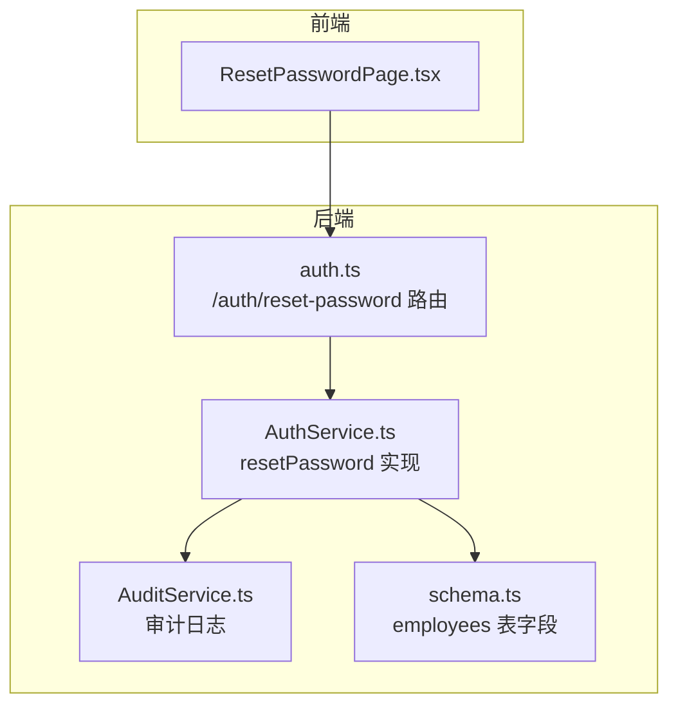
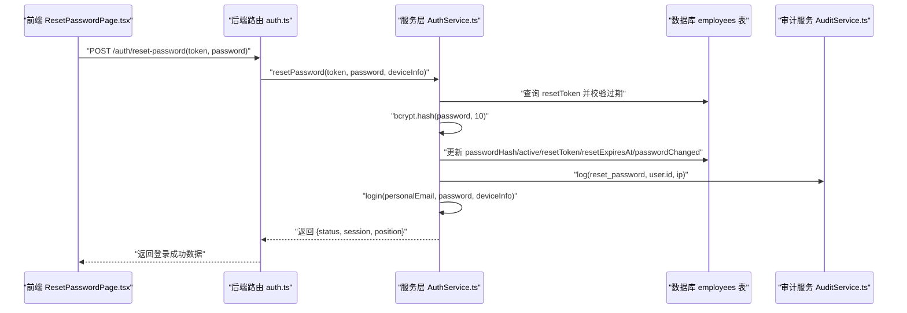
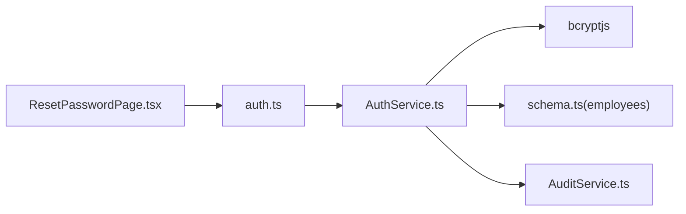

# 执行密码重置

<cite>
**本文引用的文件**
- [AuthService.ts](file://backend/src/services/AuthService.ts)
- [auth.ts](file://backend/src/routes/v2/auth.ts)
- [ResetPasswordPage.tsx](file://frontend/src/features/auth/pages/ResetPasswordPage.tsx)
- [password_reset.test.ts](file://backend/test/services/password_reset.test.ts)
- [AuditService.ts](file://backend/src/services/AuditService.ts)
- [schema.ts](file://backend/src/db/schema.ts)
- [generate-hash.ts](file://backend/scripts/generate-hash.ts)
</cite>

## 目录
1. [简介](#简介)
2. [项目结构](#项目结构)
3. [核心组件](#核心组件)
4. [架构总览](#架构总览)
5. [详细组件分析](#详细组件分析)
6. [依赖关系分析](#依赖关系分析)
7. [性能考量](#性能考量)
8. [故障排查指南](#故障排查指南)
9. [结论](#结论)

## 简介
本文件围绕“执行密码重置”这一主题，系统性解析 resetPassword 方法的完整流程。重点覆盖：
- 验证重置令牌有效性
- 使用 bcrypt 对新密码进行安全哈希
- 更新数据库中的用户记录（清除 resetToken/resetExpiresAt、激活账号 active=1、标记密码已修改 passwordChanged=1）
- 成功重置后的自动登录流程，实现无缝用户体验
- 完整的审计日志记录

## 项目结构
与“执行密码重置”直接相关的代码分布在后端服务层、路由层、前端页面以及测试用例中；数据库模式定义了重置令牌与状态字段。

图表来源
- [auth.ts](file://backend/src/routes/v2/auth.ts#L479-L528)
- [AuthService.ts](file://backend/src/services/AuthService.ts#L282-L327)
- [AuditService.ts](file://backend/src/services/AuditService.ts#L65-L89)
- [schema.ts](file://backend/src/db/schema.ts#L14-L48)
- [ResetPasswordPage.tsx](file://frontend/src/features/auth/pages/ResetPasswordPage.tsx#L1-L176)

章节来源
- [auth.ts](file://backend/src/routes/v2/auth.ts#L479-L528)
- [AuthService.ts](file://backend/src/services/AuthService.ts#L282-L327)
- [schema.ts](file://backend/src/db/schema.ts#L14-L48)

## 核心组件
- 路由层：提供 /auth/reset-password 接口，负责参数校验、限流、收集设备信息并调用服务层。
- 服务层：实现 resetPassword 核心逻辑，包括令牌校验、密码哈希、数据库更新、审计日志与自动登录。
- 前端页面：接收 token 参数，验证有效性后提交新密码，完成后自动跳转。
- 审计服务：统一记录登录、密码重置等关键动作。
- 数据库模式：定义 employees 表中的重置令牌与状态字段。

章节来源
- [auth.ts](file://backend/src/routes/v2/auth.ts#L479-L528)
- [AuthService.ts](file://backend/src/services/AuthService.ts#L282-L327)
- [ResetPasswordPage.tsx](file://frontend/src/features/auth/pages/ResetPasswordPage.tsx#L1-L176)
- [AuditService.ts](file://backend/src/services/AuditService.ts#L65-L89)
- [schema.ts](file://backend/src/db/schema.ts#L14-L48)

## 架构总览
下图展示从前端到后端、再到数据库与审计系统的整体调用链路。

图表来源
- [auth.ts](file://backend/src/routes/v2/auth.ts#L511-L527)
- [AuthService.ts](file://backend/src/services/AuthService.ts#L282-L327)
- [AuditService.ts](file://backend/src/services/AuditService.ts#L65-L89)
- [schema.ts](file://backend/src/db/schema.ts#L14-L48)

## 详细组件分析

### 后端路由：/auth/reset-password
- 负责参数校验（token、password），应用限流中间件，提取设备信息（IP、UA），调用服务层 resetPassword，并在成功时构建登录响应体。

章节来源
- [auth.ts](file://backend/src/routes/v2/auth.ts#L479-L528)

### 服务层：resetPassword 方法
- 令牌校验：根据 resetToken 查询用户，若不存在或已过期则抛出业务异常。
- 密码哈希：使用 bcrypt 对新密码进行安全哈希（成本因子 10）。
- 数据库更新：原子性更新以下字段：
  - passwordHash：写入新哈希值
  - active：激活账号
  - resetToken/resetExpiresAt：清除重置令牌及其过期时间
  - passwordChanged：标记密码已修改
  - mustChangePassword：确保不再强制要求修改密码
- 审计日志：记录 reset_password 动作，附带 IP。
- 自动登录：在满足条件的前提下，使用用户的个人邮箱与新密码发起登录流程，返回会话信息与职位信息，实现无缝体验。

章节来源
- [AuthService.ts](file://backend/src/services/AuthService.ts#L282-L327)

### 前端页面：重置密码页
- 从 URL 查询参数读取 token，调用后端 verifyResetToken 校验有效性。
- 用户输入新密码后，调用 /auth/reset-password 提交重置请求。
- 成功后提示并跳转到仪表盘，形成闭环体验。

章节来源
- [ResetPasswordPage.tsx](file://frontend/src/features/auth/pages/ResetPasswordPage.tsx#L1-L176)

### 审计日志：reset_password
- 服务层在重置完成后调用审计服务记录动作类型、实体、主体、时间戳及可选 IP 地址，便于合规与追踪。

章节来源
- [AuditService.ts](file://backend/src/services/AuditService.ts#L65-L89)
- [AuthService.ts](file://backend/src/services/AuthService.ts#L313-L320)

### 数据库模式：employees 表字段
- resetToken/resetExpiresAt：用于存储一次性重置令牌及其过期时间。
- passwordHash/passwordChanged/mustChangePassword：用于密码存储、修改状态与强制修改策略。
- active：控制账号启用状态。
- personalEmail：用于自动登录时的凭据来源。

章节来源
- [schema.ts](file://backend/src/db/schema.ts#L14-L48)

### 自动登录流程
- 在重置成功后，服务层使用用户的个人邮箱与新密码调用 login 流程，生成会话并返回给前端。
- 前端收到登录成功响应后，通常会刷新页面或跳转到受保护资源，完成无缝切换。

章节来源
- [AuthService.ts](file://backend/src/services/AuthService.ts#L322-L327)
- [auth.ts](file://backend/src/routes/v2/auth.ts#L520-L527)

### 密码哈希工具
- 提供脚本用于生成 bcrypt 哈希，便于开发调试或批量处理。

章节来源
- [generate-hash.ts](file://backend/scripts/generate-hash.ts#L1-L10)

## 依赖关系分析
- resetPassword 依赖 bcrypt 进行密码哈希。
- 依赖 employees 表的字段进行令牌校验与状态更新。
- 依赖审计服务记录关键动作。
- 前端依赖路由层提供的接口完成交互。

图表来源
- [auth.ts](file://backend/src/routes/v2/auth.ts#L511-L527)
- [AuthService.ts](file://backend/src/services/AuthService.ts#L282-L327)
- [schema.ts](file://backend/src/db/schema.ts#L14-L48)
- [AuditService.ts](file://backend/src/services/AuditService.ts#L65-L89)

## 性能考量
- bcrypt 哈希成本因子 10 在安全性与性能间取得平衡，建议保持稳定以避免频繁调整导致的性能波动。
- 数据库更新为单条写入，复杂度 O(1)，性能开销极低。
- 审计日志写入为单条插入，建议关注高并发下的写入吞吐与索引设计。
- 前端在重置成功后进行一次跳转，避免额外请求。

[本节为通用指导，无需特定文件来源]

## 故障排查指南
- 令牌无效或过期
  - 现象：前端提示链接无效或过期。
  - 排查：确认 resetToken 是否存在、resetExpiresAt 是否已过期。
  - 参考：服务层令牌校验逻辑与测试用例断言。
  
  章节来源
  - [AuthService.ts](file://backend/src/services/AuthService.ts#L265-L280)
  - [password_reset.test.ts](file://backend/test/services/password_reset.test.ts#L161-L182)

- 密码重置后无法登录
  - 现象：使用新密码登录失败。
  - 排查：确认 passwordHash 已更新、personalEmail 存在、mustChangePassword 已清零。
  - 参考：服务层重置更新字段与自动登录逻辑。
  
  章节来源
  - [AuthService.ts](file://backend/src/services/AuthService.ts#L282-L327)
  - [schema.ts](file://backend/src/db/schema.ts#L14-L48)

- 审计日志缺失
  - 现象：重置后无审计记录。
  - 排查：确认审计服务调用路径与数据库写入是否成功。
  
  章节来源
  - [AuthService.ts](file://backend/src/services/AuthService.ts#L313-L320)
  - [AuditService.ts](file://backend/src/services/AuditService.ts#L65-L89)

- 前端跳转异常
  - 现象：重置成功后未跳转。
  - 排查：确认路由层返回体结构与前端导航逻辑。
  
  章节来源
  - [auth.ts](file://backend/src/routes/v2/auth.ts#L520-L527)
  - [ResetPasswordPage.tsx](file://frontend/src/features/auth/pages/ResetPasswordPage.tsx#L51-L80)

## 结论
resetPassword 方法在验证令牌有效性的基础上，通过 bcrypt 安全地对新密码进行哈希，并原子性更新用户状态与重置令牌，随后自动登录，最终以审计日志完成全流程闭环。该流程兼顾安全性、可用性与可观测性，为用户提供顺畅的密码重置体验。