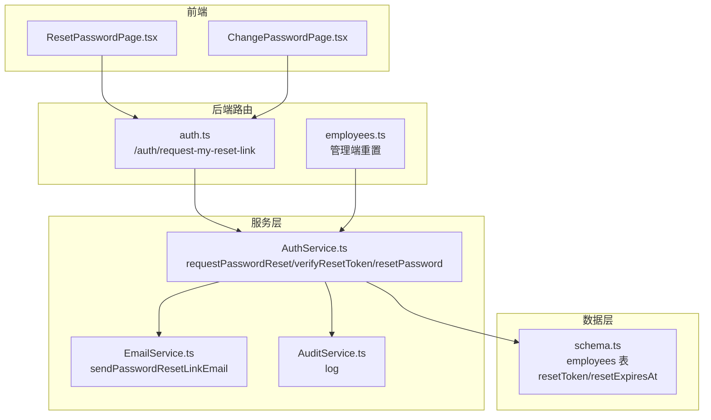
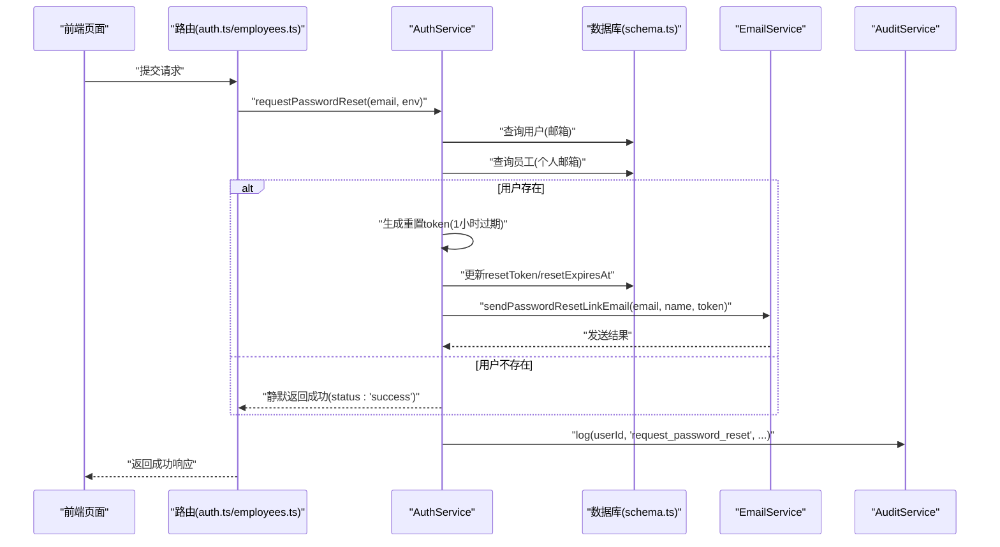
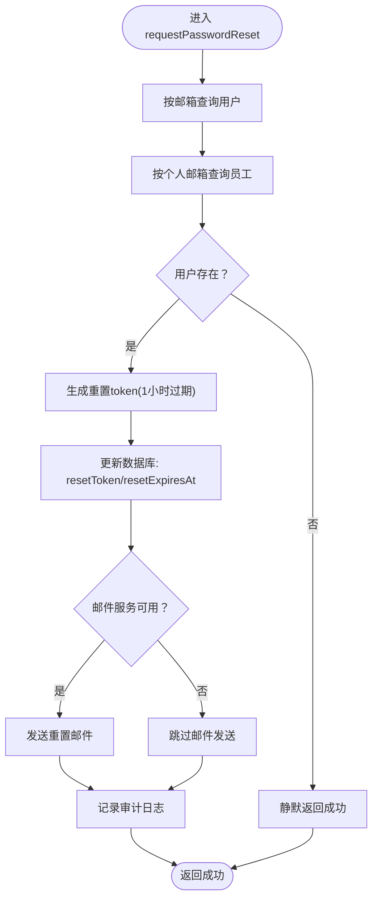
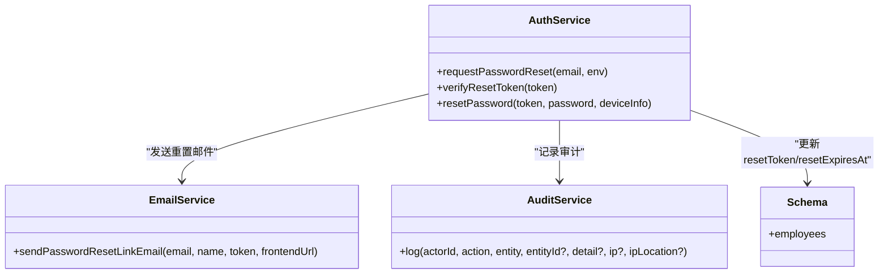

# 请求密码重置

<cite>
**本文引用的文件列表**
- [AuthService.ts](file://backend/src/services/AuthService.ts)
- [EmailService.ts](file://backend/src/services/EmailService.ts)
- [AuditService.ts](file://backend/src/services/AuditService.ts)
- [schema.ts](file://backend/src/db/schema.ts)
- [auth.ts](file://backend/src/routes/v2/auth.ts)
- [employees.ts](file://backend/src/routes/v2/employees.ts)
- [password_reset.test.ts](file://backend/test/services/password_reset.test.ts)
- [ResetPasswordPage.tsx](file://frontend/src/features/auth/pages/ResetPasswordPage.tsx)
- [ChangePasswordPage.tsx](file://frontend/src/features/auth/pages/ChangePasswordPage.tsx)
</cite>

## 目录
1. [简介](#简介)
2. [项目结构与入口](#项目结构与入口)
3. [核心组件](#核心组件)
4. [架构总览](#架构总览)
5. [组件详细分析](#组件详细分析)
6. [依赖关系分析](#依赖关系分析)
7. [性能与安全特性](#性能与安全特性)
8. [故障排查指南](#故障排查指南)
9. [结论](#结论)

## 简介
本文件聚焦“请求密码重置”阶段，围绕 requestPasswordReset 方法的实现进行深入解析。内容涵盖：
- 如何通过邮箱查找用户并校验存在性
- 生成带1小时有效期的唯一重置 token 并安全写入数据库
- 通过邮件服务发送包含重置链接的邮件
- 采用静默处理策略，无论邮箱是否存在均返回成功响应，防止枚举攻击
- 完整审计日志记录，确保操作可追溯

## 项目结构与入口
- 后端服务层：AuthService 提供 requestPasswordReset、verifyResetToken、resetPassword 等能力
- 数据层：Drizzle ORM schema 定义 employees 表，包含重置 token 与过期时间字段
- 邮件服务：EmailService 负责发送密码重置邮件
- 审计服务：AuditService 记录用户行为
- 前端页面：ResetPasswordPage 与 ChangePasswordPage 展示交互与反馈
- 路由层：auth.ts 与 employees.ts 提供对外接口，触发重置流程

图表来源
- [auth.ts](file://backend/src/routes/v2/auth.ts#L560-L571)
- [employees.ts](file://backend/src/routes/v2/employees.ts#L580-L602)
- [AuthService.ts](file://backend/src/services/AuthService.ts#L228-L262)
- [EmailService.ts](file://backend/src/services/EmailService.ts#L250-L293)
- [AuditService.ts](file://backend/src/services/AuditService.ts#L65-L89)
- [schema.ts](file://backend/src/db/schema.ts#L14-L48)

章节来源
- [auth.ts](file://backend/src/routes/v2/auth.ts#L560-L571)
- [employees.ts](file://backend/src/routes/v2/employees.ts#L580-L602)
- [AuthService.ts](file://backend/src/services/AuthService.ts#L228-L262)
- [EmailService.ts](file://backend/src/services/EmailService.ts#L250-L293)
- [AuditService.ts](file://backend/src/services/AuditService.ts#L65-L89)
- [schema.ts](file://backend/src/db/schema.ts#L14-L48)

## 核心组件
- AuthService.requestPasswordReset
  - 功能：根据邮箱查找用户并生成重置 token，写入数据库，发送邮件，记录审计日志
  - 关键点：静默处理，找不到用户也返回成功；token 1小时过期
- EmailService.sendPasswordResetLinkEmail
  - 功能：构造重置邮件正文与 HTML，调用底层发送方法
- AuditService.log
  - 功能：统一记录审计日志，包含操作类型、实体、详情、IP 等
- employees 表 schema 字段
  - resetToken、resetExpiresAt 用于存储 token 与过期时间

章节来源
- [AuthService.ts](file://backend/src/services/AuthService.ts#L228-L262)
- [EmailService.ts](file://backend/src/services/EmailService.ts#L250-L293)
- [AuditService.ts](file://backend/src/services/AuditService.ts#L65-L89)
- [schema.ts](file://backend/src/db/schema.ts#L14-L48)

## 架构总览
下图展示“请求密码重置”的端到端流程，从前端发起请求到后端执行、落库、发邮件、记录审计。

图表来源
- [auth.ts](file://backend/src/routes/v2/auth.ts#L560-L571)
- [employees.ts](file://backend/src/routes/v2/employees.ts#L580-L602)
- [AuthService.ts](file://backend/src/services/AuthService.ts#L228-L262)
- [EmailService.ts](file://backend/src/services/EmailService.ts#L250-L293)
- [AuditService.ts](file://backend/src/services/AuditService.ts#L65-L89)
- [schema.ts](file://backend/src/db/schema.ts#L14-L48)

## 组件详细分析

### requestPasswordReset 方法实现要点
- 输入：邮箱、环境变量（含邮件服务配置）
- 查找用户：
  - 先按邮箱查询用户
  - 再按个人邮箱查询员工记录，确保用户绑定个人邮箱
- 静默处理：
  - 若任一查询为空，直接返回成功，避免泄露邮箱是否存在
- 生成 token：
  - 使用 UUID 生成唯一 token，并设置 1 小时后过期
- 写入数据库：
  - 更新 employees 表的 resetToken 与 resetExpiresAt 字段
- 发送邮件：
  - 若配置了邮件服务，则调用 EmailService 发送重置邮件
- 审计日志：
  - 记录 request_password_reset 操作，便于后续审计与追踪

图表来源
- [AuthService.ts](file://backend/src/services/AuthService.ts#L228-L262)
- [EmailService.ts](file://backend/src/services/EmailService.ts#L250-L293)
- [AuditService.ts](file://backend/src/services/AuditService.ts#L65-L89)
- [schema.ts](file://backend/src/db/schema.ts#L14-L48)

章节来源
- [AuthService.ts](file://backend/src/services/AuthService.ts#L228-L262)

### 邮件发送细节
- 邮件主题与正文：
  - 主题包含“🔒 重置您的密码”
  - 正文包含重置按钮与明文链接，提示“1小时内有效”
- 链接格式：
  - 前端路径为 /auth/reset-password?token={resetToken}
- 文本版正文：
  - 包含与 HTML 版本一致的重置链接与有效期提示

章节来源
- [EmailService.ts](file://backend/src/services/EmailService.ts#L250-L293)

### 审计日志设计
- 日志字段：
  - actorId、action、entity、entityId、detail、at、ip、ipLocation
- 记录动作：
  - request_password_reset 对应用户请求重置
- 查询与统计：
  - AuditService 提供按 action/entity/actor 等条件查询与分页统计

章节来源
- [AuditService.ts](file://backend/src/services/AuditService.ts#L65-L89)
- [AuditService.ts](file://backend/src/services/AuditService.ts#L170-L242)

### 数据模型与字段
- employees 表关键字段：
  - resetToken：重置 token
  - resetExpiresAt：重置 token 过期时间戳
- 其他相关字段：
  - email、personalEmail、name 等用于用户识别与邮件模板

章节来源
- [schema.ts](file://backend/src/db/schema.ts#L14-L48)

### 前端交互与反馈
- ResetPasswordPage：
  - 从 URL 参数读取 token，调用后端验证接口
  - 验证通过后允许用户填写新密码并提交重置
- ChangePasswordPage：
  - 已登录用户主动请求发送重置链接
  - 成功后提示“请查收发送至您邮箱的邮件，点击链接完成密码重置。链接有效期为1小时”

章节来源
- [ResetPasswordPage.tsx](file://frontend/src/features/auth/pages/ResetPasswordPage.tsx#L1-L176)
- [ChangePasswordPage.tsx](file://frontend/src/features/auth/pages/ChangePasswordPage.tsx#L1-L64)

## 依赖关系分析
- AuthService 依赖：
  - EmployeeService（查询用户）
  - EmailService（发送邮件）
  - AuditService（记录审计）
  - Drizzle D1 Database（读写 employees 表）
- EmailService 依赖：
  - 邮件发送器（通过 env 中的 EMAIL_SERVICE）
- AuditService 依赖：
  - Drizzle D1 Database（写入审计日志表）

图表来源
- [AuthService.ts](file://backend/src/services/AuthService.ts#L228-L262)
- [EmailService.ts](file://backend/src/services/EmailService.ts#L250-L293)
- [AuditService.ts](file://backend/src/services/AuditService.ts#L65-L89)
- [schema.ts](file://backend/src/db/schema.ts#L14-L48)

章节来源
- [AuthService.ts](file://backend/src/services/AuthService.ts#L228-L262)
- [EmailService.ts](file://backend/src/services/EmailService.ts#L250-L293)
- [AuditService.ts](file://backend/src/services/AuditService.ts#L65-L89)
- [schema.ts](file://backend/src/db/schema.ts#L14-L48)

## 性能与安全特性
- 静默处理策略
  - 即使邮箱不存在也返回成功，避免枚举攻击
- token 生成与过期
  - 使用 UUID 生成唯一 token，1小时后过期，降低泄露风险
- 审计可追溯
  - 记录 request_password_reset 操作，便于审计与问题定位
- 前端一致性
  - 前端页面对“不存在邮箱”的场景保持一致的成功提示，进一步减少信息泄露

章节来源
- [AuthService.ts](file://backend/src/services/AuthService.ts#L228-L262)
- [password_reset.test.ts](file://backend/test/services/password_reset.test.ts#L110-L183)
- [ChangePasswordPage.tsx](file://frontend/src/features/auth/pages/ChangePasswordPage.tsx#L1-L64)

## 故障排查指南
- 现象：前端提示“链接无效或已过期”
  - 可能原因：token 不存在或已过期
  - 处理建议：引导用户重新发起“请求密码重置”，并检查邮件有效期
- 现象：邮件未收到
  - 可能原因：邮件服务未配置或发送失败
  - 处理建议：确认 env 中 EMAIL_SERVICE 配置；查看后端日志；重试发送
- 现象：审计日志缺失
  - 可能原因：审计服务异常或未正确记录
  - 处理建议：检查审计服务日志；核对数据库审计表写入情况
- 现象：静默返回成功但用户仍怀疑
  - 可能原因：用户担心邮箱不存在
  - 处理建议：前端提示“若未收到邮件，请检查垃圾箱”，并提供重新发送入口

章节来源
- [AuthService.ts](file://backend/src/services/AuthService.ts#L264-L280)
- [EmailService.ts](file://backend/src/services/EmailService.ts#L250-L293)
- [AuditService.ts](file://backend/src/services/AuditService.ts#L65-L89)

## 结论
requestPasswordReset 方法通过严格的静默处理、安全的 token 生成与过期控制、可靠的邮件发送与审计日志，构建了健壮的“请求密码重置”流程。无论邮箱是否存在，系统均返回一致的成功响应，有效防止枚举攻击；同时，1小时的有效期与完善的审计记录，确保用户体验与安全性兼顾。