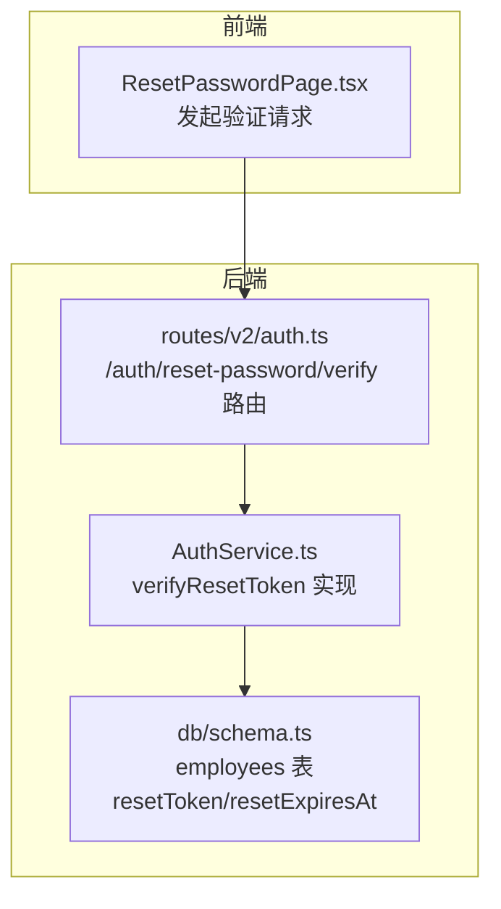
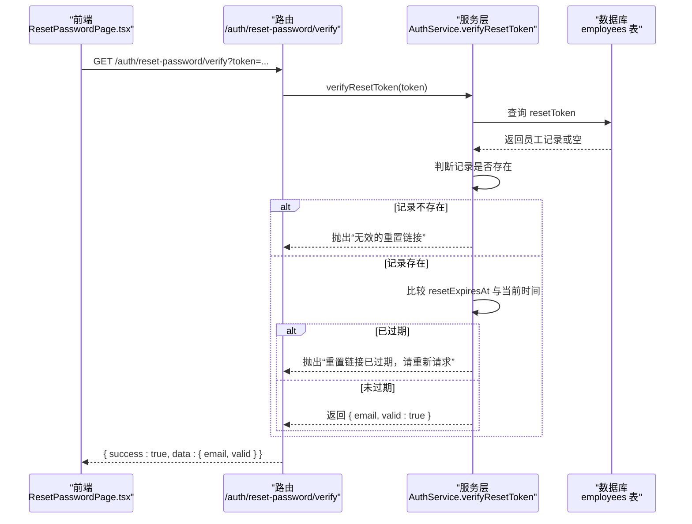
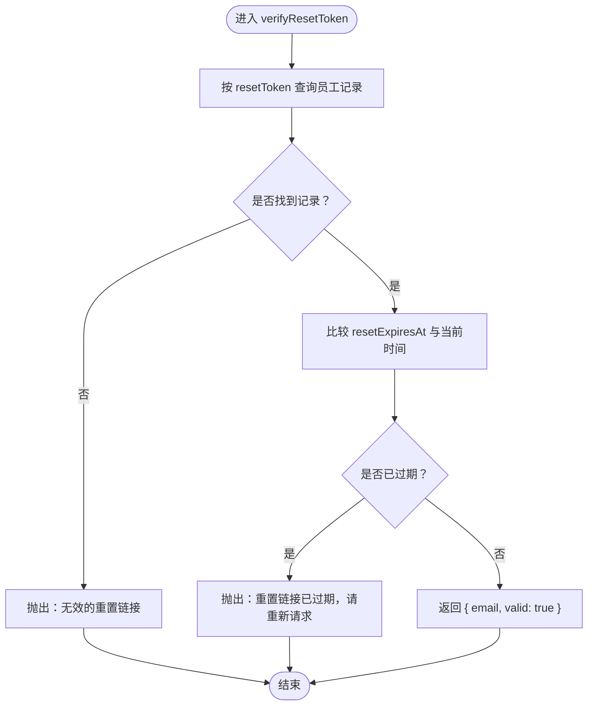
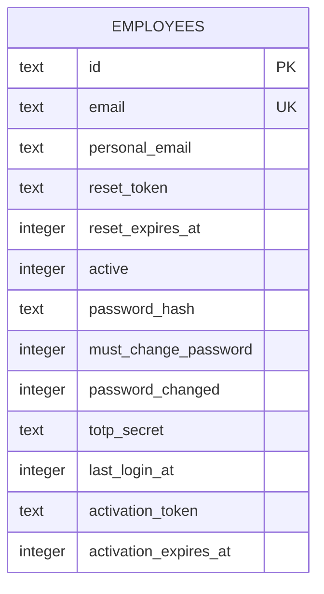
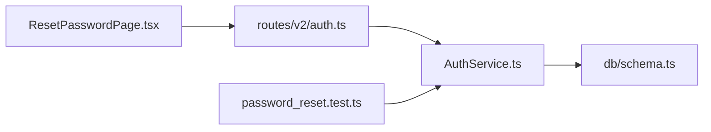

# 验证重置令牌

<cite>
**本文引用的文件列表**
- [backend/src/routes/v2/auth.ts](file://backend/src/routes/v2/auth.ts)
- [backend/src/services/AuthService.ts](file://backend/src/services/AuthService.ts)
- [backend/src/db/schema.ts](file://backend/src/db/schema.ts)
- [backend/test/services/password_reset.test.ts](file://backend/test/services/password_reset.test.ts)
- [frontend/src/features/auth/pages/ResetPasswordPage.tsx](file://frontend/src/features/auth/pages/ResetPasswordPage.tsx)
</cite>

## 目录
1. [简介](#简介)
2. [项目结构](#项目结构)
3. [核心组件](#核心组件)
4. [架构总览](#架构总览)
5. [详细组件分析](#详细组件分析)
6. [依赖关系分析](#依赖关系分析)
7. [性能考量](#性能考量)
8. [故障排查指南](#故障排查指南)
9. [结论](#结论)

## 简介
本章节聚焦于“验证重置令牌”阶段，系统通过调用 verifyResetToken 方法对用户提供的重置令牌进行严格校验。该方法会：
- 根据 token 查询数据库中的员工记录；
- 对比当前时间与 resetExpiresAt 过期时间戳，判断令牌是否仍在有效期内；
- 若令牌有效，返回用户邮箱信息（用于前端展示与后续重置密码流程）；
- 若令牌不存在或已过期，则抛出相应业务异常，提示用户重新申请。

该步骤在整个密码重置流程中起到“承上启下”的关键作用：它确保只有合法、未过期的令牌才能进入下一步重置密码环节，从而保障安全边界。

## 项目结构
与“验证重置令牌”直接相关的模块分布如下：
- 路由层：定义 /auth/reset-password/verify 接口，接收 token 参数并调用服务层；
- 服务层：实现 verifyResetToken 核心逻辑，执行数据库查询与过期时间校验；
- 数据模型：employees 表包含 resetToken 与 resetExpiresAt 字段；
- 测试层：覆盖了有效令牌、无效令牌、过期令牌等场景；
- 前端页面：ResetPasswordPage 在加载时调用验证接口并依据返回结果更新 UI。

图表来源
- [backend/src/routes/v2/auth.ts](file://backend/src/routes/v2/auth.ts#L445-L476)
- [backend/src/services/AuthService.ts](file://backend/src/services/AuthService.ts#L265-L280)
- [backend/src/db/schema.ts](file://backend/src/db/schema.ts#L14-L48)
- [frontend/src/features/auth/pages/ResetPasswordPage.tsx](file://frontend/src/features/auth/pages/ResetPasswordPage.tsx#L32-L49)

章节来源
- [backend/src/routes/v2/auth.ts](file://backend/src/routes/v2/auth.ts#L445-L476)
- [backend/src/services/AuthService.ts](file://backend/src/services/AuthService.ts#L265-L280)
- [backend/src/db/schema.ts](file://backend/src/db/schema.ts#L14-L48)
- [frontend/src/features/auth/pages/ResetPasswordPage.tsx](file://frontend/src/features/auth/pages/ResetPasswordPage.tsx#L32-L49)

## 核心组件
- 路由层（/auth/reset-password/verify）
  - 接收查询参数 token；
  - 调用 AuthService.verifyResetToken 执行校验；
  - 返回包含 email 与 valid 的结构化响应。
- 服务层（AuthService.verifyResetToken）
  - 通过 resetToken 查询 employees 记录；
  - 若记录不存在，抛出“无效的重置链接”；
  - 若 resetExpiresAt 小于当前时间，抛出“重置链接已过期，请重新请求”；
  - 否则返回 { email, valid: true }。
- 数据模型（employees）
  - resetToken：重置令牌值；
  - resetExpiresAt：重置令牌过期时间戳（毫秒）。

章节来源
- [backend/src/routes/v2/auth.ts](file://backend/src/routes/v2/auth.ts#L445-L476)
- [backend/src/services/AuthService.ts](file://backend/src/services/AuthService.ts#L265-L280)
- [backend/src/db/schema.ts](file://backend/src/db/schema.ts#L14-L48)

## 架构总览
下面的序列图展示了“验证重置令牌”的端到端流程，包括前端发起请求、后端路由处理、服务层校验与数据库交互，以及最终返回用户邮箱信息的过程。

图表来源
- [backend/src/routes/v2/auth.ts](file://backend/src/routes/v2/auth.ts#L445-L476)
- [backend/src/services/AuthService.ts](file://backend/src/services/AuthService.ts#L265-L280)
- [backend/src/db/schema.ts](file://backend/src/db/schema.ts#L14-L48)
- [frontend/src/features/auth/pages/ResetPasswordPage.tsx](file://frontend/src/features/auth/pages/ResetPasswordPage.tsx#L32-L49)

## 详细组件分析

### verifyResetToken 方法工作机制
- 输入：token（字符串）
- 处理流程：
  1) 使用 resetToken 作为条件查询 employees 表；
  2) 若无匹配记录，抛出“无效的重置链接”；
  3) 若存在记录，比较 resetExpiresAt 与当前时间戳：
     - 若 resetExpiresAt 小于当前时间，抛出“重置链接已过期，请重新请求”；
     - 否则返回 { email, valid: true }。
- 输出：成功时返回包含 email 与 valid 的对象；失败时抛出对应业务异常。

图表来源
- [backend/src/services/AuthService.ts](file://backend/src/services/AuthService.ts#L265-L280)

章节来源
- [backend/src/services/AuthService.ts](file://backend/src/services/AuthService.ts#L265-L280)

### 数据模型与字段说明
- employees 表的关键字段：
  - resetToken：重置令牌值；
  - resetExpiresAt：重置令牌过期时间戳（毫秒）。

图表来源
- [backend/src/db/schema.ts](file://backend/src/db/schema.ts#L14-L48)

章节来源
- [backend/src/db/schema.ts](file://backend/src/db/schema.ts#L14-L48)

### 前端集成与用户体验
- 前端在页面加载时携带 token 发起验证请求；
- 当验证成功时，将 valid 设为 true 并显示 email，允许用户继续提交新密码；
- 当验证失败时，根据错误消息提示用户重新申请链接或稍后再试。

章节来源
- [frontend/src/features/auth/pages/ResetPasswordPage.tsx](file://frontend/src/features/auth/pages/ResetPasswordPage.tsx#L32-L49)

### 测试覆盖与行为验证
- 有效令牌：verifyResetToken 返回 valid: true，并返回 email；
- 无效令牌：verifyResetToken 抛出“无效的重置链接”；
- 过期令牌：手动将 resetExpiresAt 设置为过去时间后，verifyResetToken 抛出“重置链接已过期”。

章节来源
- [backend/test/services/password_reset.test.ts](file://backend/test/services/password_reset.test.ts#L129-L182)

## 依赖关系分析
- 路由层依赖服务层：/auth/reset-password/verify 路由直接调用 AuthService.verifyResetToken；
- 服务层依赖数据库：通过 employees 表的 resetToken 与 resetExpiresAt 字段完成令牌校验；
- 前端依赖路由：ResetPasswordPage 通过查询参数 token 调用验证接口；
- 测试依赖服务层：password_reset.test.ts 验证 verifyResetToken 的三种典型场景。

图表来源
- [backend/src/routes/v2/auth.ts](file://backend/src/routes/v2/auth.ts#L445-L476)
- [backend/src/services/AuthService.ts](file://backend/src/services/AuthService.ts#L265-L280)
- [backend/src/db/schema.ts](file://backend/src/db/schema.ts#L14-L48)
- [backend/test/services/password_reset.test.ts](file://backend/test/services/password_reset.test.ts#L129-L182)
- [frontend/src/features/auth/pages/ResetPasswordPage.tsx](file://frontend/src/features/auth/pages/ResetPasswordPage.tsx#L32-L49)

章节来源
- [backend/src/routes/v2/auth.ts](file://backend/src/routes/v2/auth.ts#L445-L476)
- [backend/src/services/AuthService.ts](file://backend/src/services/AuthService.ts#L265-L280)
- [backend/src/db/schema.ts](file://backend/src/db/schema.ts#L14-L48)
- [backend/test/services/password_reset.test.ts](file://backend/test/services/password_reset.test.ts#L129-L182)
- [frontend/src/features/auth/pages/ResetPasswordPage.tsx](file://frontend/src/features/auth/pages/ResetPasswordPage.tsx#L32-L49)

## 性能考量
- 查询复杂度：verifyResetToken 仅基于 resetToken 做单条记录检索，employees 表对该字段具备唯一索引（见 schema），因此查询为 O(1)。
- 时间比较：仅进行一次毫秒级时间戳比较，开销极低。
- 建议：
  - 保持 resetToken 的长度与格式稳定，避免额外的字符串处理；
  - 令牌过期时间建议固定为 1 小时，便于用户在短时间内完成重置；
  - 前端应避免频繁重复验证同一令牌，可在页面内缓存验证结果。

## 故障排查指南
- 现象：返回“无效的重置链接”
  - 可能原因：token 与数据库中 resetToken 不匹配，或用户误用过期链接；
  - 排查要点：确认 token 来源是否来自官方邮件；核对 employees 表中是否存在对应记录。
- 现象：返回“重置链接已过期，请重新请求”
  - 可能原因：resetExpiresAt 小于当前时间；
  - 排查要点：检查请求密码重置时写入的 resetExpiresAt 是否正确；确认服务器时间同步。
- 现象：前端无法继续下一步
  - 可能原因：前端未正确解析返回数据或未设置 valid/email；
  - 排查要点：检查 ResetPasswordPage 的验证回调逻辑与错误提示分支。

章节来源
- [backend/src/services/AuthService.ts](file://backend/src/services/AuthService.ts#L265-L280)
- [backend/test/services/password_reset.test.ts](file://backend/test/services/password_reset.test.ts#L129-L182)
- [frontend/src/features/auth/pages/ResetPasswordPage.tsx](file://frontend/src/features/auth/pages/ResetPasswordPage.tsx#L32-L49)

## 结论
verifyResetToken 是密码重置流程的安全入口，其职责明确且实现简洁：
- 通过 resetToken 精准定位用户；
- 严格的时间窗口校验，杜绝过期令牌滥用；
- 成功时返回 email 供前端展示与后续重置流程使用。

该设计在保证安全性的同时，兼顾了易用性与可维护性，是整个密码重置链路中不可或缺的一环。