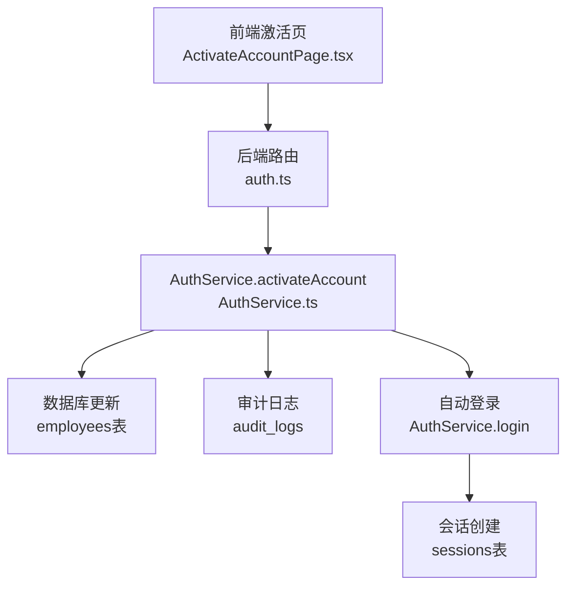
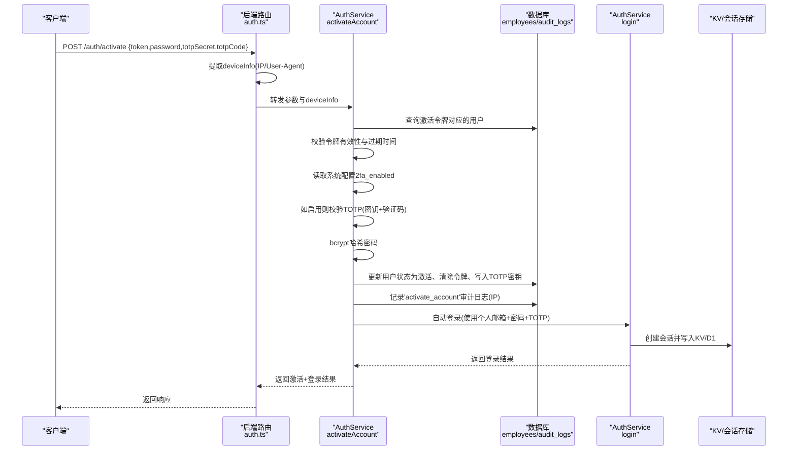
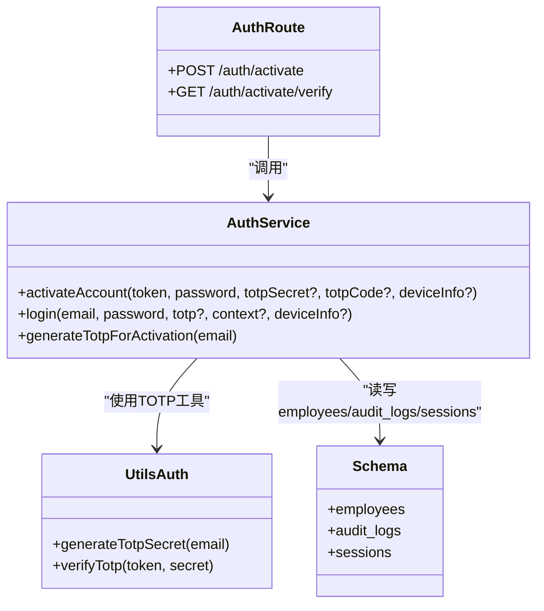

# 完成账户激活

<cite>
**本文引用的文件列表**
- [AuthService.ts](file://backend/src/services/AuthService.ts)
- [auth.ts（后端路由）](file://backend/src/routes/v2/auth.ts)
- [auth.ts（前端页面）](file://frontend/src/features/auth/pages/ActivateAccountPage.tsx)
- [auth.ts（工具函数）](file://backend/src/utils/auth.ts)
- [schema.ts（数据库模式）](file://backend/src/db/schema.ts)
- [activation.test.ts（测试）](file://backend/test/services/activation.test.ts)
</cite>

## 目录
1. [简介](#简介)
2. [项目结构与入口](#项目结构与入口)
3. [核心组件与职责](#核心组件与职责)
4. [架构总览](#架构总览)
5. [详细流程解析](#详细流程解析)
6. [依赖关系分析](#依赖关系分析)
7. [性能与安全考量](#性能与安全考量)
8. [故障排查指南](#故障排查指南)
9. [结论](#结论)

## 简介
本文件面向开发者与运维人员，系统性阐述“完成账户激活”流程，重点围绕后端 AuthService 的 activateAccount 方法展开，覆盖以下关键点：
- 验证激活令牌的有效性与过期控制
- 根据系统配置（2fa_enabled）决定是否强制进行TOTP验证
- 使用bcrypt对用户密码进行哈希加密
- 在数据库更新中将用户状态置为激活、清除激活令牌、绑定TOTP密钥
- 激活成功后自动调用登录流程，实现无缝登录
- 记录'activate_account'审计日志，并利用deviceInfo参数记录登录IP
- 前端激活页面的交互流程与接口对接

## 项目结构与入口
- 后端路由层提供 /auth/activate 接口，接收token、password、可选的totpSecret与totpCode，并注入deviceInfo（IP与User-Agent）。
- 路由层调用 AuthService.activateAccount 完成业务处理。
- 前端激活页面负责校验激活链接有效性、生成TOTP密钥与二维码、提交激活请求并自动跳转。

图表来源
- [auth.ts（后端路由）](file://backend/src/routes/v2/auth.ts#L420-L443)
- [AuthService.ts](file://backend/src/services/AuthService.ts#L374-L442)
- [schema.ts（数据库模式）](file://backend/src/db/schema.ts#L14-L48)

章节来源
- [auth.ts（后端路由）](file://backend/src/routes/v2/auth.ts#L387-L443)
- [auth.ts（前端页面）](file://frontend/src/features/auth/pages/ActivateAccountPage.tsx#L90-L130)

## 核心组件与职责
- AuthService.activateAccount：完成令牌校验、TOTP验证（如启用）、密码哈希、数据库更新、审计日志、自动登录。
- 路由层 auth.ts：定义 /auth/activate 接口，提取deviceInfo并转发给服务层。
- 工具层 auth.ts：提供TOTP密钥生成与验证能力。
- 数据库模式 schema.ts：定义employees与audit_logs等表结构，承载激活状态、令牌、TOTP密钥、审计日志等字段。
- 前端 ActivateAccountPage.tsx：负责激活流程的前端交互与接口调用。

章节来源
- [AuthService.ts](file://backend/src/services/AuthService.ts#L374-L442)
- [auth.ts（后端路由）](file://backend/src/routes/v2/auth.ts#L387-L443)
- [auth.ts（工具函数）](file://backend/src/utils/auth.ts#L1-L17)
- [schema.ts（数据库模式）](file://backend/src/db/schema.ts#L14-L48)
- [auth.ts（前端页面）](file://frontend/src/features/auth/pages/ActivateAccountPage.tsx#L90-L130)

## 架构总览
下图展示从客户端到服务端再到数据库与审计系统的整体调用链路。

图表来源
- [auth.ts（后端路由）](file://backend/src/routes/v2/auth.ts#L420-L443)
- [AuthService.ts](file://backend/src/services/AuthService.ts#L374-L442)
- [auth.ts（工具函数）](file://backend/src/utils/auth.ts#L1-L17)
- [schema.ts（数据库模式）](file://backend/src/db/schema.ts#L14-L48)

## 详细流程解析

### 1. 验证激活令牌
- 服务层通过激活令牌查询用户记录，若不存在或已过期则抛出相应错误。
- 过期判断基于activationExpiresAt字段，确保令牌一次性使用。

章节来源
- [AuthService.ts](file://backend/src/services/AuthService.ts#L381-L394)

### 2. 系统配置与TOTP强制策略
- 读取系统配置键'2fa_enabled'，默认值为true（即系统默认强制TOTP）。
- 若启用，则要求前端提供totpSecret与6位验证码；验证码通过TOTP验证算法校验。
- 若未启用，则跳过TOTP校验。

章节来源
- [AuthService.ts](file://backend/src/services/AuthService.ts#L396-L408)
- [auth.ts（工具函数）](file://backend/src/utils/auth.ts#L1-L17)

### 3. 密码处理与哈希
- 使用bcrypt对用户提交的新密码进行哈希，强度参数为10。
- 将哈希后的密码写入employees.password_hash字段。

章节来源
- [AuthService.ts](file://backend/src/services/AuthService.ts#L410-L410)

### 4. 数据库更新与状态变更
- 将用户状态active置为1，passwordChanged置为1，mustChangePassword置为0。
- 清除activation_token与activationExpiresAt，消耗掉该激活令牌。
- 若启用TOTP，则写入totpSecret；否则保持为空。
- 以上更新均针对匹配到的用户ID。

章节来源
- [AuthService.ts](file://backend/src/services/AuthService.ts#L413-L427)
- [schema.ts（数据库模式）](file://backend/src/db/schema.ts#L14-L48)

### 5. 审计日志记录
- 激活完成后，记录'activate_account'审计事件，携带actorId、entity、entityId以及deviceInfo中的IP地址。
- 审计日志表包含ip字段，便于后续追踪登录来源。

章节来源
- [AuthService.ts](file://backend/src/services/AuthService.ts#L429-L436)
- [schema.ts（数据库模式）](file://backend/src/db/schema.ts#L675-L692)

### 6. 自动登录与无缝体验
- 激活成功后，使用用户的个人邮箱（personalEmail）发起登录流程。
- 登录时若系统强制TOTP且用户已绑定TOTP密钥，则按登录流程进行设备指纹与信任设备判定；若为新设备则需要TOTP验证码。
- 登录成功后创建会话并写入KV与D1，返回会话与用户信息。

章节来源
- [AuthService.ts](file://backend/src/services/AuthService.ts#L441-L442)
- [AuthService.ts](file://backend/src/services/AuthService.ts#L33-L147)
- [schema.ts（数据库模式）](file://backend/src/db/schema.ts#L118-L137)

### 7. deviceInfo参数的作用
- 路由层从请求头中提取CF-Connecting-IP或X-Forwarded-For作为IP，User-Agent作为UA。
- deviceInfo随激活流程传入服务层，用于审计日志记录IP。
- 登录流程中deviceInfo用于生成设备指纹、信任设备判定与会话记录。

章节来源
- [auth.ts（后端路由）](file://backend/src/routes/v2/auth.ts#L424-L427)
- [AuthService.ts](file://backend/src/services/AuthService.ts#L429-L436)
- [AuthService.ts](file://backend/src/services/AuthService.ts#L90-L112)
- [AuthService.ts](file://backend/src/services/AuthService.ts#L149-L197)
- [schema.ts（数据库模式）](file://backend/src/db/schema.ts#L118-L137)

## 依赖关系分析

图表来源
- [AuthService.ts](file://backend/src/services/AuthService.ts#L374-L442)
- [auth.ts（后端路由）](file://backend/src/routes/v2/auth.ts#L387-L443)
- [auth.ts（工具函数）](file://backend/src/utils/auth.ts#L1-L17)
- [schema.ts（数据库模式）](file://backend/src/db/schema.ts#L14-L48)

章节来源
- [AuthService.ts](file://backend/src/services/AuthService.ts#L374-L442)
- [auth.ts（后端路由）](file://backend/src/routes/v2/auth.ts#L387-L443)
- [auth.ts（工具函数）](file://backend/src/utils/auth.ts#L1-L17)
- [schema.ts（数据库模式）](file://backend/src/db/schema.ts#L14-L48)

## 性能与安全考量
- bcrypt哈希强度参数为10，兼顾安全性与性能；建议在高并发场景评估异步哈希与批处理策略。
- TOTP验证采用otplib库，严格校验6位数字；建议对频繁失败的请求增加速率限制。
- 审计日志记录IP有助于溯源，但需注意隐私合规；建议仅保留必要字段并定期清理。
- 自动登录流程中，若启用TOTP且用户未绑定密钥，登录会被拒绝，避免弱安全风险。
- deviceInfo来源于反向代理头，建议在网关层统一标准化IP与UA，避免伪造。

[本节为通用指导，无需特定文件引用]

## 故障排查指南
- 激活令牌无效或已过期
  - 现象：服务端抛出“无效的激活链接”或“激活链接已过期”。
  - 排查：确认前端传入token正确、未被二次使用；检查employees表activationExpiresAt是否早于当前时间。
  - 参考
    - [AuthService.ts](file://backend/src/services/AuthService.ts#L387-L394)

- 未绑定个人邮箱导致无法自动登录
  - 现象：服务端抛出“用户未绑定个人邮箱”。
  - 排查：确认employees表personalEmail非空；激活前应确保员工信息完整。
  - 参考
    - [AuthService.ts](file://backend/src/services/AuthService.ts#L437-L440)

- 强制TOTP但未提供密钥或验证码
  - 现象：服务端抛出“请绑定Google验证码”或“验证码错误”。
  - 排查：确认系统配置2fa_enabled为true；前端已生成TOTP密钥与二维码；用户输入的验证码为6位数字。
  - 参考
    - [AuthService.ts](file://backend/src/services/AuthService.ts#L396-L408)
    - [auth.ts（工具函数）](file://backend/src/utils/auth.ts#L1-L17)

- 审计日志未记录IP
  - 现象：审计日志缺少IP字段。
  - 排查：确认路由层正确提取CF-Connecting-IP/X-Forwarded-For；服务层将deviceInfo.ip传入审计日志。
  - 参考
    - [auth.ts（后端路由）](file://backend/src/routes/v2/auth.ts#L424-L427)
    - [AuthService.ts](file://backend/src/services/AuthService.ts#L429-L436)

- 登录后未创建会话
  - 现象：激活成功但无会话数据。
  - 排查：检查AuthService.login流程是否正常；确认KV与D1写入逻辑；核对会话过期时间与用户状态。
  - 参考
    - [AuthService.ts](file://backend/src/services/AuthService.ts#L149-L197)
    - [schema.ts（数据库模式）](file://backend/src/db/schema.ts#L118-L137)

章节来源
- [AuthService.ts](file://backend/src/services/AuthService.ts#L387-L442)
- [auth.ts（后端路由）](file://backend/src/routes/v2/auth.ts#L424-L427)
- [auth.ts（工具函数）](file://backend/src/utils/auth.ts#L1-L17)
- [schema.ts（数据库模式）](file://backend/src/db/schema.ts#L118-L137)

## 结论
完成账户激活流程以“令牌校验—TOTP验证（可选）—密码哈希—数据库更新—审计日志—自动登录”为主线，实现了安全、可控且无缝的用户体验。系统通过2fa_enabled配置灵活控制TOTP强制策略，借助bcrypt保障密码安全，通过审计日志与deviceInfo增强可追溯性。前端激活页面与后端路由紧密配合，确保用户在最短时间内完成激活并进入系统。