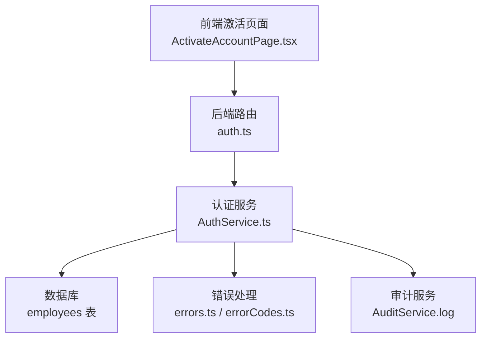
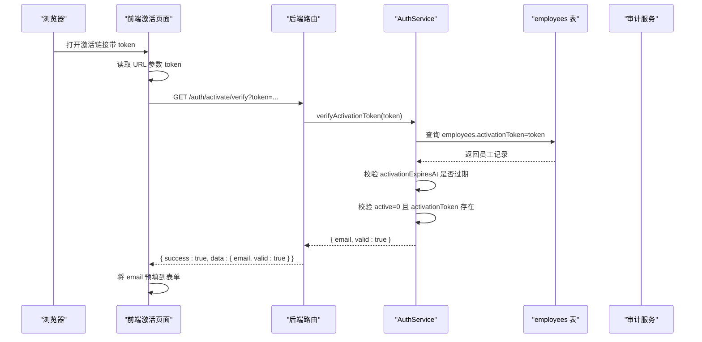
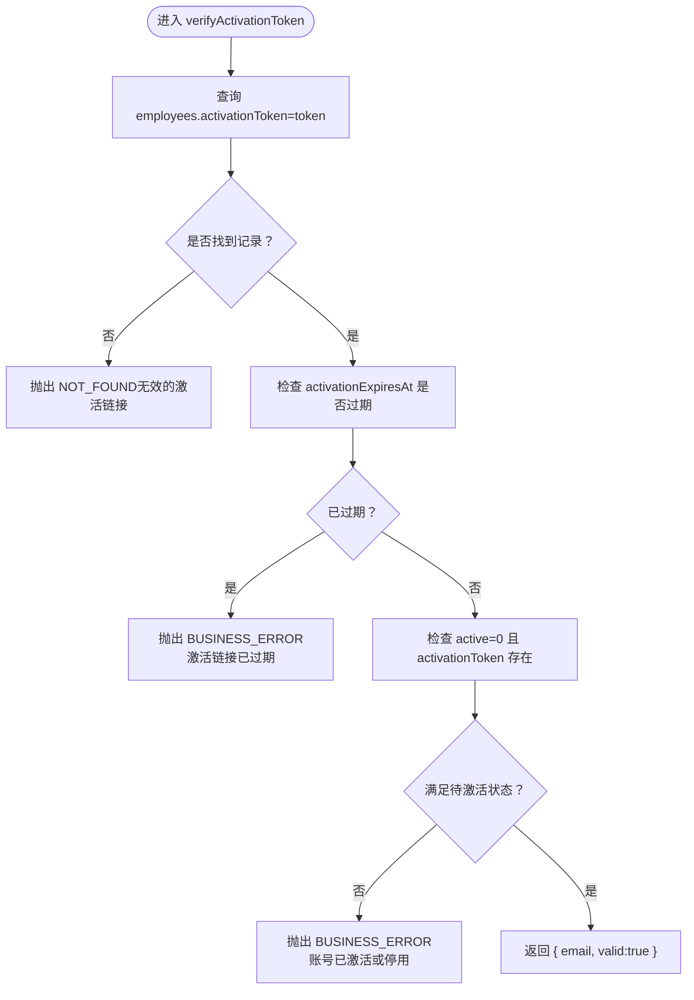
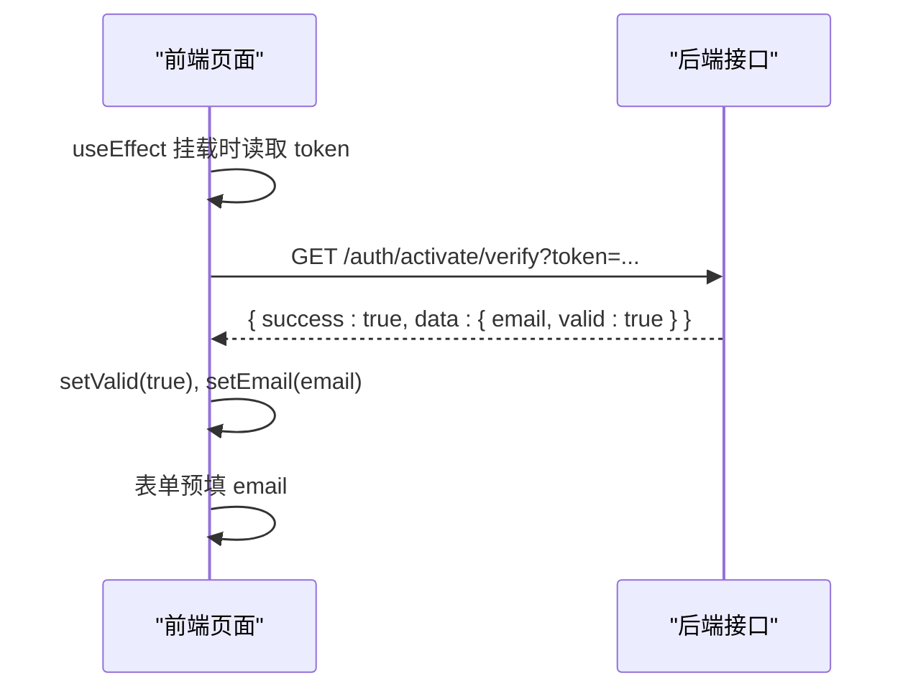
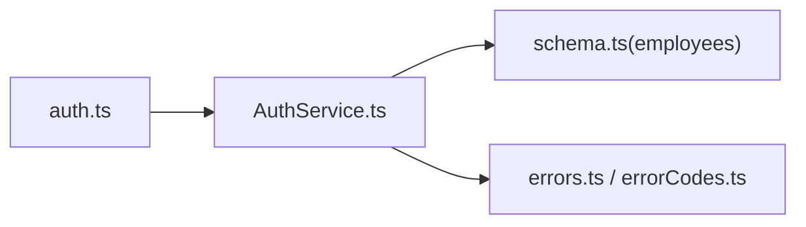

# 激活令牌验证

<cite>
**本文引用的文件**
- [AuthService.ts](file://backend/src/services/AuthService.ts)
- [auth.ts](file://backend/src/routes/v2/auth.ts)
- [schema.ts](file://backend/src/db/schema.ts)
- [errors.ts](file://backend/src/utils/errors.ts)
- [errorCodes.ts](file://backend/src/constants/errorCodes.ts)
- [ActivateAccountPage.tsx](file://frontend/src/features/auth/pages/ActivateAccountPage.tsx)
- [activation.test.ts](file://backend/test/services/activation.test.ts)
</cite>

## 目录
1. [简介](#简介)
2. [项目结构](#项目结构)
3. [核心组件](#核心组件)
4. [架构总览](#架构总览)
5. [详细组件分析](#详细组件分析)
6. [依赖关系分析](#依赖关系分析)
7. [性能考量](#性能考量)
8. [故障排查指南](#故障排查指南)
9. [结论](#结论)

## 简介
本文件围绕“激活令牌验证”能力进行深入文档化，重点解释 verifyActivationToken 方法的实现细节与调用流程，包括：
- 如何通过 activationToken 查询员工记录
- 链接有效性校验（activationExpiresAt 时间戳是否过期）
- 账号状态校验（active=0 且 activationToken 存在）
- 前端激活页面初始化时的调用时机与 email 预填逻辑
- 错误处理机制（NOT_FOUND 与 BUSINESS_ERROR 的抛出条件）
- 审计日志记录行为

## 项目结构
激活令牌验证涉及前后端协作的关键路径如下：
- 前端：激活页面在挂载时读取 URL 参数 token，调用后端接口验证令牌
- 后端：OpenAPI 路由接收 token，调用 AuthService.verifyActivationToken 进行校验
- 数据层：通过 employees 表的 activationToken、activationExpiresAt、active 字段完成校验
- 错误处理：统一错误封装与错误码映射
- 审计日志：激活成功后记录 activate_account 审计事件

图表来源
- [auth.ts](file://backend/src/routes/v2/auth.ts#L315-L347)
- [AuthService.ts](file://backend/src/services/AuthService.ts#L349-L373)
- [schema.ts](file://backend/src/db/schema.ts#L14-L48)
- [errors.ts](file://backend/src/utils/errors.ts#L35-L56)
- [errorCodes.ts](file://backend/src/constants/errorCodes.ts#L1-L31)

章节来源
- [auth.ts](file://backend/src/routes/v2/auth.ts#L315-L347)
- [AuthService.ts](file://backend/src/services/AuthService.ts#L349-L373)
- [schema.ts](file://backend/src/db/schema.ts#L14-L48)

## 核心组件
- 后端路由：提供 GET /auth/activate/verify 接口，接收 token 查询参数，返回 { success, data: { email, valid } }
- 认证服务：实现 verifyActivationToken(token)，执行数据库查询与状态校验
- 数据模型：employees 表包含 activationToken、activationExpiresAt、active 等字段
- 错误体系：Errors.NOT_FOUND 与 Errors.BUSINESS_ERROR 用于不同场景的异常抛出
- 前端页面：在组件挂载时读取 token 并调用后端接口，成功后将 email 预填到表单

章节来源
- [auth.ts](file://backend/src/routes/v2/auth.ts#L315-L347)
- [AuthService.ts](file://backend/src/services/AuthService.ts#L349-L373)
- [schema.ts](file://backend/src/db/schema.ts#L14-L48)
- [errors.ts](file://backend/src/utils/errors.ts#L35-L56)
- [errorCodes.ts](file://backend/src/constants/errorCodes.ts#L1-L31)
- [ActivateAccountPage.tsx](file://frontend/src/features/auth/pages/ActivateAccountPage.tsx#L34-L63)

## 架构总览
激活令牌验证的端到端流程如下：

图表来源
- [auth.ts](file://backend/src/routes/v2/auth.ts#L315-L347)
- [AuthService.ts](file://backend/src/services/AuthService.ts#L349-L373)
- [ActivateAccountPage.tsx](file://frontend/src/features/auth/pages/ActivateAccountPage.tsx#L34-L63)

## 详细组件分析

### verifyActivationToken 方法实现
- 输入：token（字符串）
- 查询逻辑：通过 employees.activationToken 精确匹配查询
- 校验链路：
  - 若未找到记录：抛出 NOT_FOUND（无效的激活链接）
  - 若 activationExpiresAt 存在且小于当前时间：抛出 BUSINESS_ERROR（激活链接已过期）
  - 若 active=0 且 activationToken 为空：抛出 BUSINESS_ERROR（账号已激活或停用）
  - 成功：返回 { email, valid:true }，其中 email 来自员工记录的公司邮箱字段

图表来源
- [AuthService.ts](file://backend/src/services/AuthService.ts#L349-L373)

章节来源
- [AuthService.ts](file://backend/src/services/AuthService.ts#L349-L373)

### 前端激活页面初始化与表单预填
- 初始化时机：组件挂载时读取 URL 中的 token 参数，立即发起验证请求
- 调用接口：GET /auth/activate/verify?token=...
- 成功响应：当 data.valid 为 true 时，将 data.email 预填到表单（用于提示用户）
- 失败处理：根据错误消息提示用户（如链接无效或已过期）

图表来源
- [ActivateAccountPage.tsx](file://frontend/src/features/auth/pages/ActivateAccountPage.tsx#L34-L63)
- [auth.ts](file://backend/src/routes/v2/auth.ts#L315-L347)

章节来源
- [ActivateAccountPage.tsx](file://frontend/src/features/auth/pages/ActivateAccountPage.tsx#L34-L63)
- [auth.ts](file://backend/src/routes/v2/auth.ts#L315-L347)

### 错误处理机制
- NOT_FOUND 抛出条件：
  - 数据库未查询到匹配的 activationToken
- BUSINESS_ERROR 抛出条件：
  - activationExpiresAt 存在且小于当前时间（链接过期）
  - active=0 且 activationToken 为空（账号已激活或停用）
- 错误码映射：
  - NOT_FOUND 对应业务错误码 BUS_NOT_FOUND
  - BUSINESS_ERROR 对应业务错误码 BUS_GENERAL

章节来源
- [AuthService.ts](file://backend/src/services/AuthService.ts#L349-L373)
- [errors.ts](file://backend/src/utils/errors.ts#L35-L56)
- [errorCodes.ts](file://backend/src/constants/errorCodes.ts#L1-L31)

### 审计日志记录
- verifyActivationToken 本身不记录审计日志；激活成功后（activateAccount）会记录 activate_account 审计事件
- 审计日志记录位置：AuthService.activateAccount 在更新员工状态后调用审计服务

章节来源
- [AuthService.ts](file://backend/src/services/AuthService.ts#L375-L443)

## 依赖关系分析
- 路由依赖：auth.ts 定义 /auth/activate/verify 路由，调用 c.var.services.auth.verifyActivationToken
- 服务依赖：AuthService 依赖 employees 表结构与错误封装
- 数据模型：employees 表包含激活相关字段（activation_token、activation_expires_at、active）
- 错误依赖：Errors 工具类提供 NOT_FOUND 与 BUSINESS_ERROR 封装

图表来源
- [auth.ts](file://backend/src/routes/v2/auth.ts#L315-L347)
- [AuthService.ts](file://backend/src/services/AuthService.ts#L349-L373)
- [schema.ts](file://backend/src/db/schema.ts#L14-L48)
- [errors.ts](file://backend/src/utils/errors.ts#L35-L56)
- [errorCodes.ts](file://backend/src/constants/errorCodes.ts#L1-L31)

章节来源
- [auth.ts](file://backend/src/routes/v2/auth.ts#L315-L347)
- [AuthService.ts](file://backend/src/services/AuthService.ts#L349-L373)
- [schema.ts](file://backend/src/db/schema.ts#L14-L48)
- [errors.ts](file://backend/src/utils/errors.ts#L35-L56)
- [errorCodes.ts](file://backend/src/constants/errorCodes.ts#L1-L31)

## 性能考量
- 查询复杂度：基于 activationToken 的精确匹配，employees 表建议对 activationToken 建立索引以提升查询效率
- 时间戳比较：仅一次毫秒级时间比较，开销极低
- 前端预填：仅在验证成功后进行 DOM 更新，避免不必要的渲染

[本节为通用性能讨论，不直接分析具体文件]

## 故障排查指南
- 链接无效或已过期
  - 现象：前端收到错误提示，verifyActivationToken 抛出 BUSINESS_ERROR
  - 排查：确认 activationExpiresAt 是否已过期；检查系统时间与时区
- 账号已激活或停用
  - 现象：verifyActivationToken 抛出 BUSINESS_ERROR
  - 排查：确认 active=0 且 activationToken 存在；若已激活则不应再使用激活链接
- 数据库未找到记录
  - 现象：verifyActivationToken 抛出 NOT_FOUND
  - 排查：确认 token 是否正确；检查 employees 表中是否存在对应记录
- 审计日志缺失
  - 说明：verifyActivationToken 不记录审计日志；激活成功后才会记录 activate_account

章节来源
- [AuthService.ts](file://backend/src/services/AuthService.ts#L349-L373)
- [activation.test.ts](file://backend/test/services/activation.test.ts#L148-L171)

## 结论
verifyActivationToken 方法通过三步校验确保激活链接的安全与有效：存在性校验、过期校验、状态校验。前端在初始化时即调用该接口，成功后将 email 预填到表单，改善用户体验。错误处理采用统一的错误封装与错误码映射，便于前端展示与定位问题。审计日志在激活成功后记录，保证关键操作可追溯。