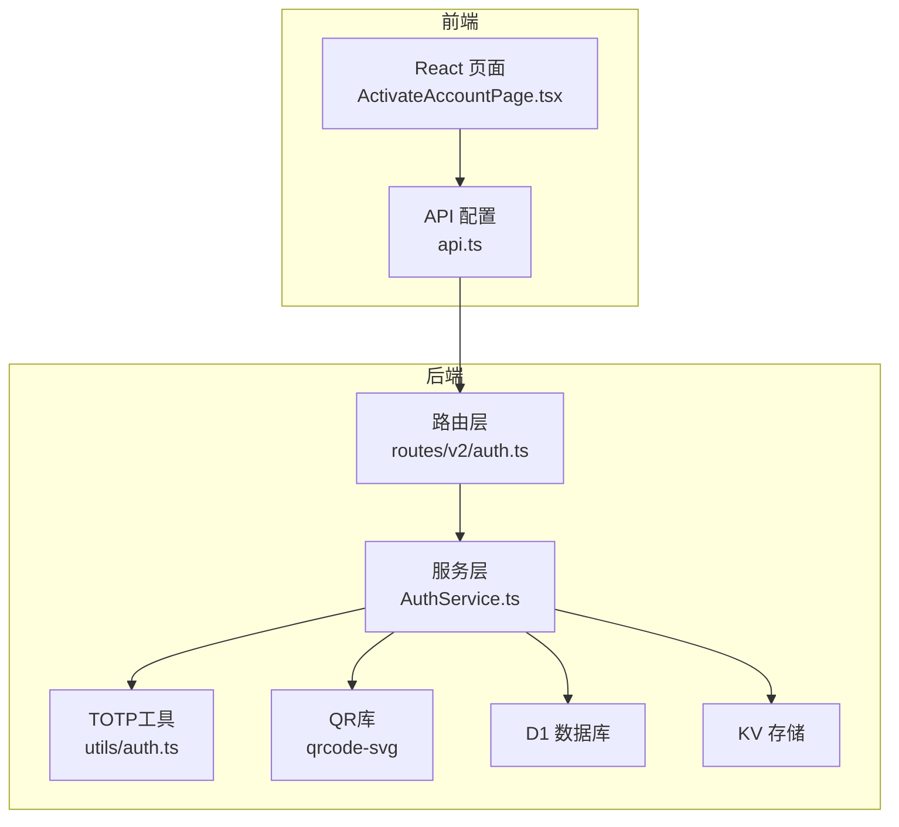
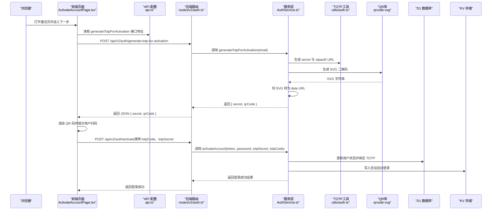
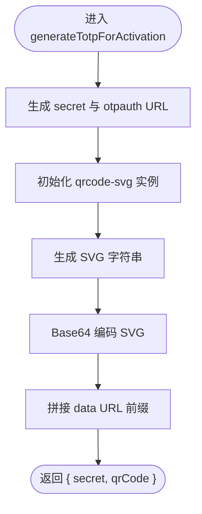
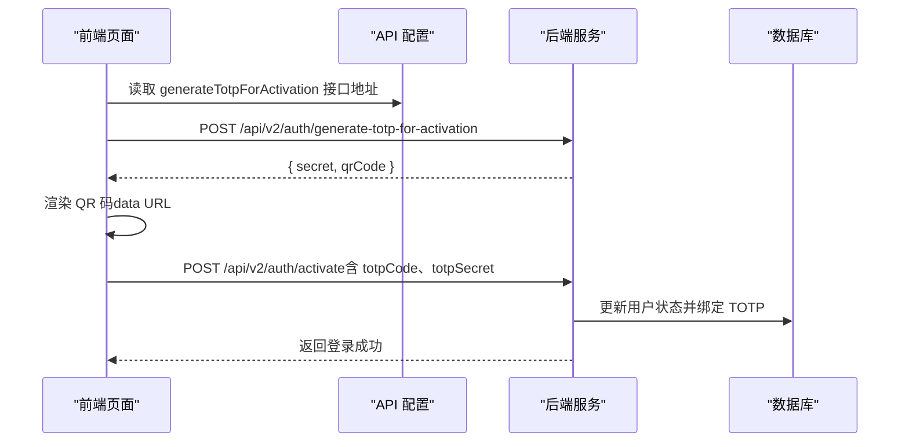
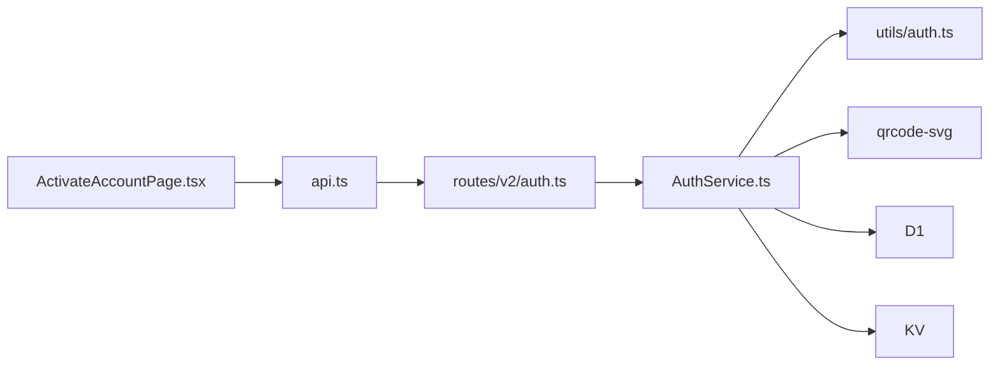

# 生成TOTP激活密钥

<cite>
**本文引用的文件**
- [AuthService.ts](file://backend/src/services/AuthService.ts)
- [auth.ts（后端路由）](file://backend/src/routes/v2/auth.ts)
- [auth.ts（TOTP工具）](file://backend/src/utils/auth.ts)
- [ActivateAccountPage.tsx（前端页面）](file://frontend/src/features/auth/pages/ActivateAccountPage.tsx)
- [api.ts（前端API配置）](file://frontend/src/config/api.ts)
- [package.json（后端依赖）](file://backend/package.json)
- [qrcode-svg.d.ts（类型声明）](file://backend/src/types/qrcode-svg.d.ts)
- [wrangler.toml（部署配置）](file://backend/wrangler.toml)
</cite>

## 目录
1. [简介](#简介)
2. [项目结构](#项目结构)
3. [核心组件](#核心组件)
4. [架构总览](#架构总览)
5. [详细组件分析](#详细组件分析)
6. [依赖关系分析](#依赖关系分析)
7. [性能与可扩展性](#性能与可扩展性)
8. [故障排查指南](#故障排查指南)
9. [结论](#结论)

## 简介
本文件聚焦于“生成TOTP激活密钥”的完整流程，围绕后端 AuthService 的 generateTotpForActivation 方法展开，详细说明：
- 如何为新用户生成唯一的TOTP密钥（secret）与对应的 otpauth URL；
- 如何使用 qrcode-svg 生成 SVG 格式的二维码，并将其编码为 data URL，以便在浏览器中直接显示；
- 前端如何调用该 API 并将返回的 QR 码展示给用户，完成双因素认证（2FA）绑定；
- 强调该流程不依赖用户密码，专为账户激活场景设计，且适配 Cloudflare Workers 的无头环境。

## 项目结构
- 后端采用 Hono + Cloudflare Workers 架构，使用 Drizzle ORM 访问 D1 数据库、KV 存储会话等。
- 前端为 React SPA，通过 fetch 调用后端 API，实现激活流程的两步走：设置密码、绑定TOTP。

图表来源
- [auth.ts（后端路由）](file://backend/src/routes/v2/auth.ts#L348-L386)
- [AuthService.ts](file://backend/src/services/AuthService.ts#L329-L347)
- [auth.ts（TOTP工具）](file://backend/src/utils/auth.ts#L1-L16)
- [qrcode-svg.d.ts](file://backend/src/types/qrcode-svg.d.ts#L1-L1)
- [wrangler.toml](file://backend/wrangler.toml#L1-L40)

章节来源
- [auth.ts（后端路由）](file://backend/src/routes/v2/auth.ts#L348-L386)
- [AuthService.ts](file://backend/src/services/AuthService.ts#L1-L40)
- [package.json（后端依赖）](file://backend/package.json#L59-L69)

## 核心组件
- 后端路由 generateTotpForActivationRoute：定义请求体（邮箱）、响应体（secret、qrCode），并转发到 AuthService。
- AuthService.generateTotpForActivation：生成 secret 与 otpauth URL；使用 qrcode-svg 生成 SVG；将 SVG 转换为 data URL；返回 { secret, qrCode }。
- utils/auth.ts：封装 otplib 的密钥生成与校验。
- 前端 ActivateAccountPage.tsx：调用 generateTotpForActivation API，接收返回的 QR 码并渲染；随后在激活阶段提交 totpCode 与 totpSecret。

章节来源
- [auth.ts（后端路由）](file://backend/src/routes/v2/auth.ts#L348-L386)
- [AuthService.ts](file://backend/src/services/AuthService.ts#L329-L347)
- [auth.ts（TOTP工具）](file://backend/src/utils/auth.ts#L1-L16)
- [ActivateAccountPage.tsx（前端页面）](file://frontend/src/features/auth/pages/ActivateAccountPage.tsx#L65-L94)
- [api.ts（前端API配置）](file://frontend/src/config/api.ts#L12-L28)

## 架构总览
下图展示了“生成TOTP激活密钥”的端到端流程，包括后端生成 QR、前端展示与后续激活绑定。

图表来源
- [auth.ts（后端路由）](file://backend/src/routes/v2/auth.ts#L348-L443)
- [AuthService.ts](file://backend/src/services/AuthService.ts#L329-L443)
- [auth.ts（TOTP工具）](file://backend/src/utils/auth.ts#L1-L16)
- [ActivateAccountPage.tsx（前端页面）](file://frontend/src/features/auth/pages/ActivateAccountPage.tsx#L65-L130)
- [api.ts（前端API配置）](file://frontend/src/config/api.ts#L12-L28)

## 详细组件分析

### 后端：generateTotpForActivation 方法
- 输入：邮箱（email）
- 输出：{ secret, qrCode }
- 关键步骤：
  1) 生成 TOTP 密钥与 otpauth URL（来自 utils/auth.ts）。
  2) 使用 qrcode-svg 生成 SVG 二维码，设置尺寸、边距、颜色与容错等级。
  3) 将 SVG 字符串进行 base64 编码，并拼接 data URL 前缀，形成可直接在 img 标签中使用的 data URL。
  4) 返回 { secret, qrCode } 给前端。

图表来源
- [AuthService.ts](file://backend/src/services/AuthService.ts#L329-L347)
- [auth.ts（TOTP工具）](file://backend/src/utils/auth.ts#L1-L16)
- [qrcode-svg.d.ts（类型声明）](file://backend/src/types/qrcode-svg.d.ts#L1-L1)

章节来源
- [AuthService.ts](file://backend/src/services/AuthService.ts#L329-L347)
- [auth.ts（TOTP工具）](file://backend/src/utils/auth.ts#L1-L16)
- [package.json（后端依赖）](file://backend/package.json#L63-L66)

### 前端：调用与展示流程
- 前端在“设置密码”步骤完成后，调用 generateTotpForActivation API，传入当前邮箱。
- 成功后，前端将返回的 qrCode（data URL）直接渲染到 img 标签中，供用户使用 Google Authenticator 扫描。
- 用户输入 6 位验证码后，前端调用 activate API，携带 totpCode 与 totpSecret，完成激活与自动登录。

图表来源
- [ActivateAccountPage.tsx（前端页面）](file://frontend/src/features/auth/pages/ActivateAccountPage.tsx#L65-L130)
- [api.ts（前端API配置）](file://frontend/src/config/api.ts#L12-L28)
- [auth.ts（后端路由）](file://backend/src/routes/v2/auth.ts#L388-L443)

章节来源
- [ActivateAccountPage.tsx（前端页面）](file://frontend/src/features/auth/pages/ActivateAccountPage.tsx#L65-L130)
- [api.ts（前端API配置）](file://frontend/src/config/api.ts#L12-L28)

### TOTP 工具与验证
- utils/auth.ts 提供：
  - generateTotpSecret：生成随机 secret，并构造 otpauth URL（包含 issuer、label 等）。
  - verifyTotp：基于 otplib 验证验证码与 secret 的匹配。
- AuthService 在激活阶段也会使用 verifyTotp 校验用户输入的验证码。

章节来源
- [auth.ts（TOTP工具）](file://backend/src/utils/auth.ts#L1-L16)
- [AuthService.ts](file://backend/src/services/AuthService.ts#L396-L409)

### Cloudflare Workers 适配要点
- 后端依赖 qrcode-svg，无需 Canvas，适合无头运行时（Edge Runtime）。
- wrangler.toml 中配置了 D1、KV、R2 等资源绑定，确保服务层在 Workers 环境正常工作。
- 前端在生产环境通过相对路径访问后端 Worker，避免跨域问题。

章节来源
- [package.json（后端依赖）](file://backend/package.json#L63-L66)
- [wrangler.toml（部署配置）](file://backend/wrangler.toml#L364-L389)
- [api.ts（前端API配置）](file://frontend/src/config/api.ts#L1-L11)

## 依赖关系分析
- 后端路由依赖服务层 AuthService；
- AuthService 依赖 utils/auth.ts 生成/校验 TOTP；
- AuthService 依赖 qrcode-svg 生成 SVG；
- 前端 ActivateAccountPage.tsx 依赖 api.ts 中的接口地址；
- 整体运行在 Cloudflare Workers 环境，资源通过 wrangler.toml 绑定。

图表来源
- [auth.ts（后端路由）](file://backend/src/routes/v2/auth.ts#L348-L443)
- [AuthService.ts](file://backend/src/services/AuthService.ts#L1-L40)
- [auth.ts（TOTP工具）](file://backend/src/utils/auth.ts#L1-L16)
- [qrcode-svg.d.ts（类型声明）](file://backend/src/types/qrcode-svg.d.ts#L1-L1)
- [ActivateAccountPage.tsx（前端页面）](file://frontend/src/features/auth/pages/ActivateAccountPage.tsx#L65-L130)
- [api.ts（前端API配置）](file://frontend/src/config/api.ts#L12-L28)

章节来源
- [auth.ts（后端路由）](file://backend/src/routes/v2/auth.ts#L348-L443)
- [AuthService.ts](file://backend/src/services/AuthService.ts#L1-L40)
- [auth.ts（TOTP工具）](file://backend/src/utils/auth.ts#L1-L16)
- [qrcode-svg.d.ts（类型声明）](file://backend/src/types/qrcode-svg.d.ts#L1-L1)
- [ActivateAccountPage.tsx（前端页面）](file://frontend/src/features/auth/pages/ActivateAccountPage.tsx#L65-L130)
- [api.ts（前端API配置）](file://frontend/src/config/api.ts#L12-L28)

## 性能与可扩展性
- QR 生成：qrcode-svg 为纯字符串处理，避免 Canvas 依赖，适合 Workers 无头环境；尺寸与容错等级可按需调整。
- 前端渲染：data URL 直接渲染，无需额外网络请求；建议在移动端保持 200x200 的尺寸以提升扫描成功率。
- 后端扩展：若并发较高，可在路由层增加速率限制；QR 生成成本较低，主要瓶颈在数据库写入与 KV 写入。

[本节为通用建议，不直接分析具体文件]

## 故障排查指南
- 无法生成 QR 码
  - 检查 qrcode-svg 是否安装与引入正确；确认 AuthService 中的 QRCode 初始化参数有效。
  - 确认 SVG 字符串非空，并成功进行 base64 编码与 data URL 拼接。
- 前端无法显示 QR 码
  - 确认返回的 qrCode 为 data URL（以 data:image/svg+xml;base64 开头）。
  - 检查前端 img 标签的 src 属性是否正确赋值。
- 激活阶段验证码错误
  - 确认前端提交的 totpCode 与 totpSecret 一致；后端 verifyTotp 会严格校验。
  - 若系统启用 2FA，激活时必须提供 totpCode 与 totpSecret。

章节来源
- [AuthService.ts](file://backend/src/services/AuthService.ts#L329-L347)
- [auth.ts（TOTP工具）](file://backend/src/utils/auth.ts#L1-L16)
- [ActivateAccountPage.tsx（前端页面）](file://frontend/src/features/auth/pages/ActivateAccountPage.tsx#L96-L130)

## 结论
- generateTotpForActivation 流程实现了“无需密码”的账户激活绑定 2FA 的完整闭环：后端生成 secret 与 otpauth URL，前端扫码绑定，最终完成激活与自动登录。
- 通过 qrcode-svg 生成 SVG 并转换为 data URL，完美适配 Cloudflare Workers 的无头环境，简化了前端渲染与网络开销。
- 建议在生产环境中结合速率限制与日志审计，确保安全性与可观测性。