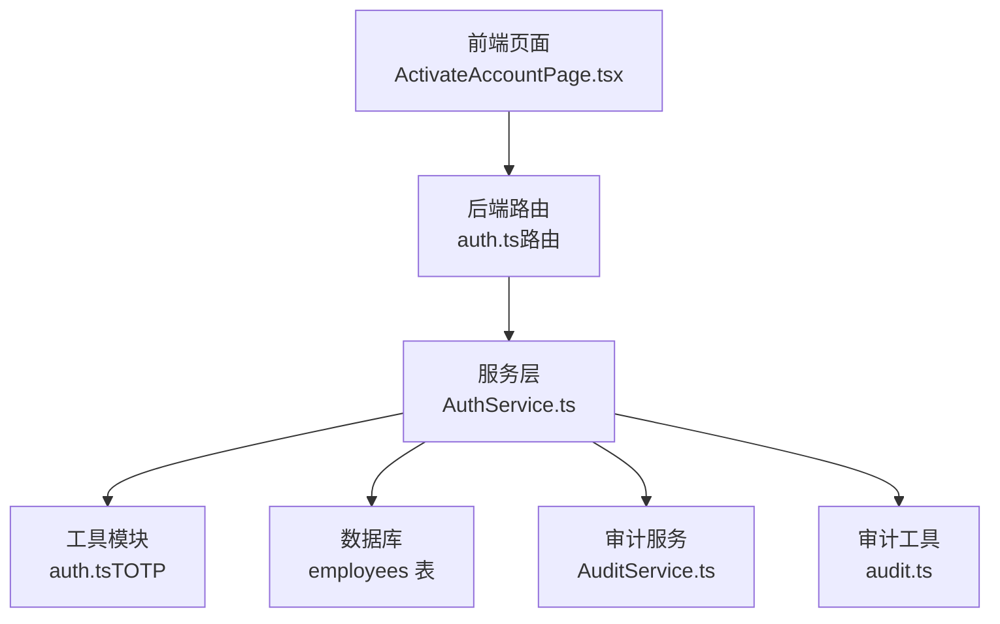
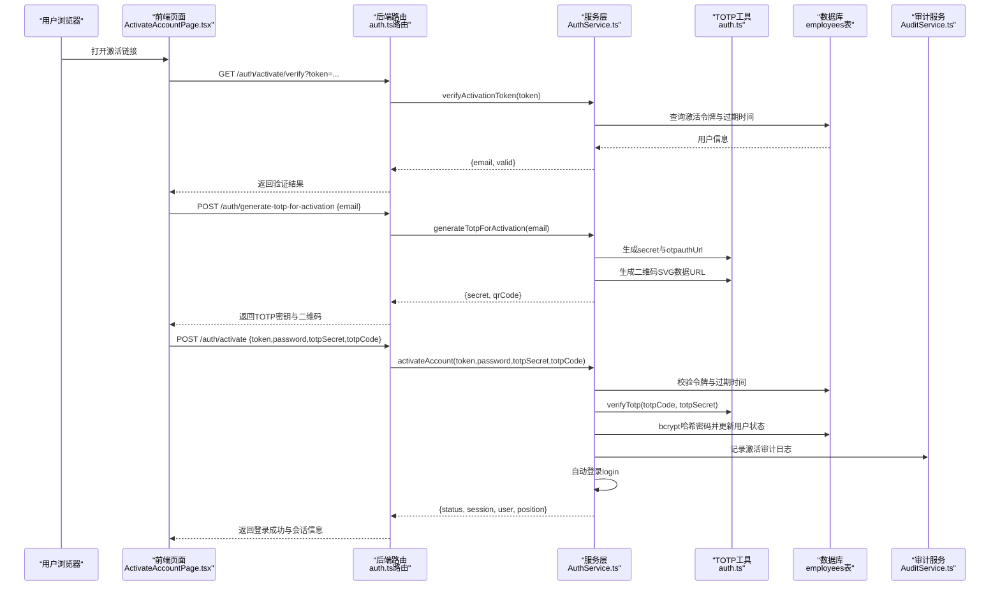
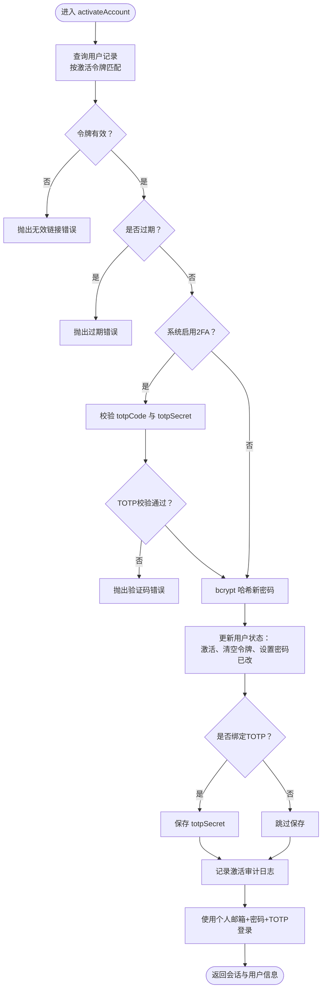
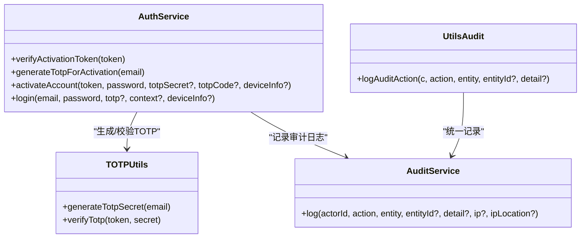

# 账户激活流程

<cite>
**本文引用的文件**
- [AuthService.ts](file://backend/src/services/AuthService.ts)
- [auth.ts](file://backend/src/utils/auth.ts)
- [auth.ts（路由）](file://backend/src/routes/v2/auth.ts)
- [ActivateAccountPage.tsx](file://frontend/src/features/auth/pages/ActivateAccountPage.tsx)
- [activation.test.ts](file://backend/test/services/activation.test.ts)
- [AuditService.ts](file://backend/src/services/AuditService.ts)
- [audit.ts](file://backend/src/utils/audit.ts)
</cite>

## 目录
1. [简介](#简介)
2. [项目结构与入口](#项目结构与入口)
3. [核心组件](#核心组件)
4. [架构总览](#架构总览)
5. [组件详解](#组件详解)
6. [依赖关系分析](#依赖关系分析)
7. [性能与安全考量](#性能与安全考量)
8. [故障排查指南](#故障排查指南)
9. [结论](#结论)

## 简介
本文件面向开发者与运维人员，系统性阐述“账户激活”流程的实现机制，重点解析以下内容：
- activateAccount 方法的完整执行路径：令牌验证、初始密码设置（bcrypt 哈希）、TOTP 双因素认证密钥绑定、成功后的自动登录。
- verifyActivationToken 的验证逻辑：链接有效性、过期检查、账号状态校验。
- generateTotpForActivation 的实现：生成 TOTP 密钥与二维码，供前端绑定。
- 审计日志记录与防信息泄露策略。

## 项目结构与入口
账户激活涉及前后端协作：
- 前端页面负责引导用户完成“设置密码—绑定TOTP—提交激活”的步骤，并调用后端接口。
- 后端路由定义了三个关键接口：验证激活令牌、生成激活用TOTP、执行激活并自动登录。
- 服务层 AuthService 实现业务逻辑，包含 bcrypt 哈希、TOTP 校验、数据库更新、审计日志等。

图表来源
- [auth.ts（路由）](file://backend/src/routes/v2/auth.ts#L315-L443)
- [AuthService.ts](file://backend/src/services/AuthService.ts#L329-L443)
- [auth.ts](file://backend/src/utils/auth.ts#L1-L17)
- [AuditService.ts](file://backend/src/services/AuditService.ts#L62-L125)
- [audit.ts](file://backend/src/utils/audit.ts#L1-L90)

章节来源
- [auth.ts（路由）](file://backend/src/routes/v2/auth.ts#L315-L443)
- [AuthService.ts](file://backend/src/services/AuthService.ts#L329-L443)

## 核心组件
- 前端页面 ActivateAccountPage.tsx：负责验证令牌、生成TOTP密钥与二维码、提交激活请求并处理结果。
- 后端路由 auth.ts（路由）：暴露 verifyActivationToken、generateTotpForActivation、activateAccount 三个接口。
- 服务层 AuthService.ts：实现 verifyActivationToken、generateTotpForActivation、activateAccount、自动登录等。
- 工具模块 auth.ts：提供 TOTP 密钥生成与校验。
- 审计服务 AuditService.ts 与审计工具 audit.ts：统一记录审计日志，包含IP与IP归属地信息。

章节来源
- [ActivateAccountPage.tsx](file://frontend/src/features/auth/pages/ActivateAccountPage.tsx#L1-L308)
- [auth.ts（路由）](file://backend/src/routes/v2/auth.ts#L315-L443)
- [AuthService.ts](file://backend/src/services/AuthService.ts#L329-L443)
- [auth.ts](file://backend/src/utils/auth.ts#L1-L17)
- [AuditService.ts](file://backend/src/services/AuditService.ts#L62-L125)
- [audit.ts](file://backend/src/utils/audit.ts#L1-L90)

## 架构总览
下图展示从前端到后端服务层的关键交互序列，涵盖令牌验证、TOTP生成、激活与自动登录。

图表来源
- [auth.ts（路由）](file://backend/src/routes/v2/auth.ts#L315-L443)
- [AuthService.ts](file://backend/src/services/AuthService.ts#L329-L443)
- [auth.ts](file://backend/src/utils/auth.ts#L1-L17)
- [AuditService.ts](file://backend/src/services/AuditService.ts#L62-L125)

## 组件详解

### verifyActivationToken 验证逻辑
- 功能：校验激活令牌的有效性，包含以下检查：
  - 令牌存在性：根据激活令牌查询用户记录。
  - 过期检查：若 activationExpiresAt 小于当前时间，判定为过期。
  - 账号状态：若用户已停用或未激活且令牌为空，视为异常状态。
- 返回值：成功时返回 { email, valid }；失败时抛出相应业务异常。
- 安全要点：对无效链接与过期链接均返回统一错误，避免信息泄露。

章节来源
- [AuthService.ts](file://backend/src/services/AuthService.ts#L349-L373)
- [activation.test.ts](file://backend/test/services/activation.test.ts#L148-L171)

### generateTotpForActivation 生成TOTP密钥与二维码
- 功能：为激活流程生成一次性 TOTP 密钥与二维码，供用户绑定至验证器应用。
- 实现要点：
  - 使用工具模块生成随机密钥与 otpauthUrl。
  - 使用 qrcode-svg 生成 SVG 字符串并通过 base64 编码为 data URL，便于前端直接渲染。
- 前端交互：前端页面在用户设置密码后调用该接口，获取 secret 与 qrCode 并引导用户扫码绑定。

章节来源
- [AuthService.ts](file://backend/src/services/AuthService.ts#L329-L347)
- [auth.ts](file://backend/src/utils/auth.ts#L1-L17)
- [ActivateAccountPage.tsx](file://frontend/src/features/auth/pages/ActivateAccountPage.tsx#L65-L94)

### activateAccount 激活流程与自动登录
- 输入参数：token、password、totpSecret（可选）、totpCode（可选）。
- 核心流程：
  1. 令牌与过期校验：与 verifyActivationToken 类似，确保令牌有效且未过期。
  2. 2FA 校验：若系统启用2FA，则要求提供 totpSecret 与 totpCode，并通过 verifyTotp 校验。
  3. 密码哈希：使用 bcrypt 对用户输入的新密码进行哈希存储。
  4. 更新用户状态：将用户标记为已激活，清空激活令牌与过期时间，设置密码已修改标志。
  5. 绑定TOTP：当2FA启用时，保存 totpSecret。
  6. 审计日志：记录 activate_account 操作，附带IP信息。
  7. 自动登录：使用用户的个人邮箱与密码及刚验证的 TOTP 码发起登录，返回会话与用户信息。
- 安全要点：
  - 严格区分“激活令牌”与“登录凭据”，激活阶段仅设置密码与绑定2FA，不暴露登录凭据。
  - 2FA 强制绑定时，前端必须先获取二维码并完成扫码绑定。
  - 审计日志记录激活与登录事件，便于追踪。

图表来源
- [AuthService.ts](file://backend/src/services/AuthService.ts#L375-L443)
- [auth.ts](file://backend/src/utils/auth.ts#L1-L17)

章节来源
- [AuthService.ts](file://backend/src/services/AuthService.ts#L375-L443)
- [activation.test.ts](file://backend/test/services/activation.test.ts#L148-L171)

### 自动登录与会话管理
- 自动登录：激活成功后，服务层调用 login 方法，使用用户的个人邮箱与新密码以及刚验证的 TOTP 码进行登录。
- 会话创建：登录成功后创建会话并写入数据库与KV缓存，同时记录登录审计日志。
- 前端接收：后端路由在激活成功时将登录结果封装返回给前端，前端据此设置用户信息与令牌并跳转首页。

章节来源
- [AuthService.ts](file://backend/src/services/AuthService.ts#L349-L443)
- [auth.ts（路由）](file://backend/src/routes/v2/auth.ts#L420-L443)
- [ActivateAccountPage.tsx](file://frontend/src/features/auth/pages/ActivateAccountPage.tsx#L96-L130)

### 审计日志与安全策略
- 审计记录：
  - activate_account：记录激活操作，包含 actorId、entity、entityId、at、detail、ip、ipLocation。
  - login：记录登录操作，包含 actorId、entity、entityId、at、detail、ip、ipLocation。
- IP与归属地：
  - 通过 Cloudflare 请求头获取客户端IP与城市/国家信息，并写入审计日志。
- 防信息泄露：
  - 验证令牌与重置令牌均对无效或过期链接返回统一错误消息，避免泄露具体原因。
  - 重置密码请求即使未找到用户也返回成功，防止邮箱枚举攻击。
- 异步记录：
  - 审计日志采用异步等待（waitUntil）方式记录，避免阻塞主流程。

章节来源
- [AuditService.ts](file://backend/src/services/AuditService.ts#L62-L125)
- [audit.ts](file://backend/src/utils/audit.ts#L1-L90)
- [AuthService.ts](file://backend/src/services/AuthService.ts#L349-L443)

## 依赖关系分析
- AuthService.ts 依赖：
  - bcrypt：用于密码哈希。
  - otplib：用于 TOTP 密钥生成与校验。
  - qrcode-svg：用于生成二维码。
  - SystemConfigService：读取2FA开关配置。
  - EmployeeService：查询用户信息。
  - AuditService：记录审计日志。
  - EmailService：发送邮件（与激活流程相关）。
- 前端 ActivateAccountPage.tsx 依赖：
  - 路由调用后端 verifyActivation、generateTotpForActivation、activate 接口。
  - Ant Design 组件库进行表单与提示。

图表来源
- [AuthService.ts](file://backend/src/services/AuthService.ts#L329-L443)
- [auth.ts](file://backend/src/utils/auth.ts#L1-L17)
- [AuditService.ts](file://backend/src/services/AuditService.ts#L62-L125)
- [audit.ts](file://backend/src/utils/audit.ts#L1-L90)

章节来源
- [AuthService.ts](file://backend/src/services/AuthService.ts#L1-L495)
- [auth.ts](file://backend/src/utils/auth.ts#L1-L17)
- [AuditService.ts](file://backend/src/services/AuditService.ts#L62-L125)
- [audit.ts](file://backend/src/utils/audit.ts#L1-L90)

## 性能与安全考量
- 性能
  - bcrypt 哈希成本固定，建议在生产环境保持默认成本以平衡安全性与性能。
  - 二维码生成在Edge Runtime中使用 qrcode-svg，避免Canvas依赖，保证兼容性。
  - 审计日志采用异步记录，避免阻塞主流程。
- 安全
  - 令牌验证与过期检查双重保障，防止重放与过期链接滥用。
  - 2FA 强制绑定策略，提升账户安全性。
  - 统一错误响应，避免信息泄露。
  - 登录时对新设备进行TOTP校验并可加入信任设备列表，降低风险。

[本节为通用指导，无需列出章节来源]

## 故障排查指南
- 常见问题与定位
  - 令牌无效或过期：verifyActivationToken 抛出相应错误，检查链接是否正确、是否过期。
  - 验证码错误：activateAccount 在2FA启用时要求提供正确的验证码，核对用户输入与TOTP应用生成的一致性。
  - 未绑定个人邮箱：激活成功后自动登录需使用个人邮箱，若未绑定将触发业务错误。
  - 2FA未启用但前端仍要求绑定：检查系统配置项 2fa_enabled 的值。
- 日志与审计
  - 查看审计日志中的 activate_account 与 login 记录，结合IP与时间定位问题。
  - 若审计记录缺失，检查 waitUntil 是否可用以及审计服务初始化是否正常。

章节来源
- [AuthService.ts](file://backend/src/services/AuthService.ts#L349-L443)
- [AuditService.ts](file://backend/src/services/AuditService.ts#L62-L125)
- [audit.ts](file://backend/src/utils/audit.ts#L1-L90)

## 结论
账户激活流程通过严格的令牌验证、密码哈希、TOTP绑定与自动登录，实现了安全、可控的用户激活体验。服务层在每个关键节点均记录审计日志，并采用统一错误响应策略防止信息泄露。前端页面清晰引导用户完成激活步骤，配合后端接口形成闭环。建议在生产环境中：
- 明确2FA开关策略并与前端提示保持一致。
- 关注审计日志导出与留存，定期审查异常登录与激活行为。
- 对密码复杂度与TOTP绑定流程进行用户教育，提升整体安全水平。