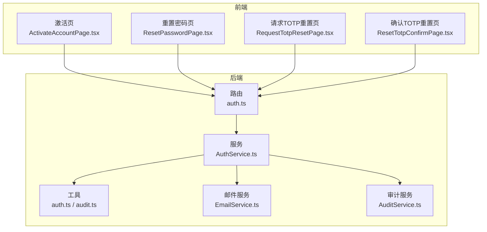
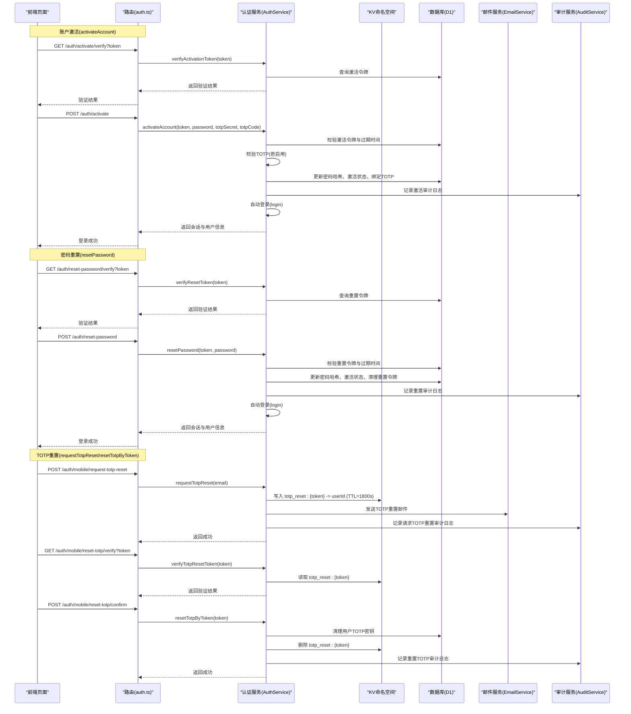
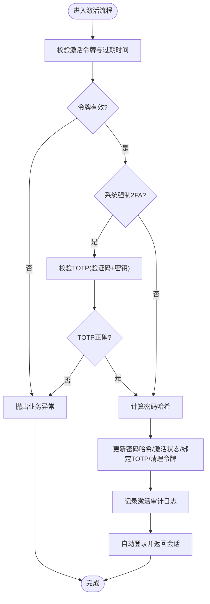
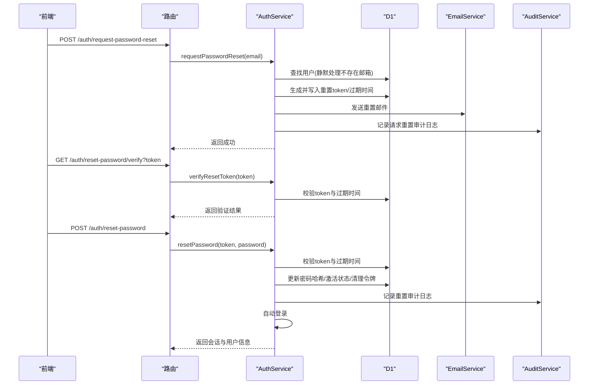
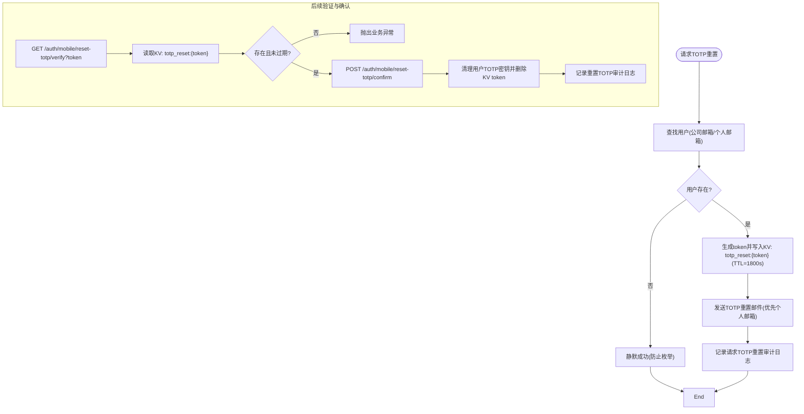
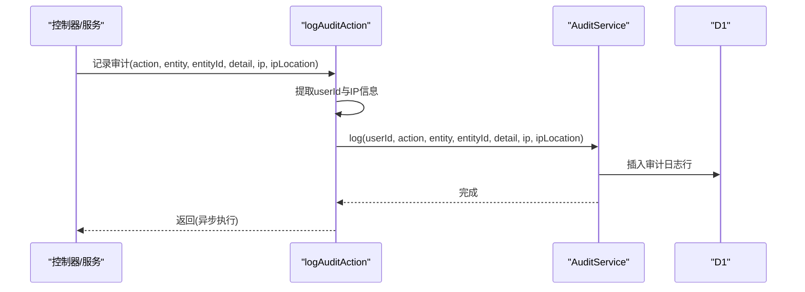
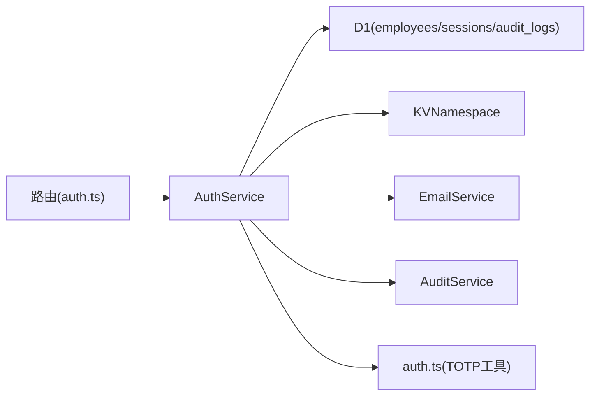

# 账户生命周期管理

<cite>
**本文引用的文件**
- [backend/src/services/AuthService.ts](file://backend/src/services/AuthService.ts)
- [backend/src/services/EmailService.ts](file://backend/src/services/EmailService.ts)
- [backend/src/routes/v2/auth.ts](file://backend/src/routes/v2/auth.ts)
- [backend/src/utils/auth.ts](file://backend/src/utils/auth.ts)
- [backend/src/utils/audit.ts](file://backend/src/utils/audit.ts)
- [backend/src/services/AuditService.ts](file://backend/src/services/AuditService.ts)
- [frontend/src/features/auth/pages/ActivateAccountPage.tsx](file://frontend/src/features/auth/pages/ActivateAccountPage.tsx)
- [frontend/src/features/auth/pages/ResetPasswordPage.tsx](file://frontend/src/features/auth/pages/ResetPasswordPage.tsx)
- [frontend/src/features/auth/pages/RequestTotpResetPage.tsx](file://frontend/src/features/auth/pages/RequestTotpResetPage.tsx)
- [frontend/src/features/auth/pages/ResetTotpConfirmPage.tsx](file://frontend/src/features/auth/pages/ResetTotpConfirmPage.tsx)
- [backend/test/services/password_reset.test.ts](file://backend/test/services/password_reset.test.ts)
</cite>

## 目录
1. [简介](#简介)
2. [项目结构](#项目结构)
3. [核心组件](#核心组件)
4. [架构总览](#架构总览)
5. [详细组件分析](#详细组件分析)
6. [依赖关系分析](#依赖关系分析)
7. [性能考量](#性能考量)
8. [故障排查指南](#故障排查指南)
9. [结论](#结论)
10. [附录](#附录)

## 简介
本专项文档聚焦账户生命周期管理，覆盖从账户激活到密码重置再到TOTP重置的完整流程。重点说明以下关键点：
- 账户激活(activateAccount)：通过activationToken验证身份、设置初始密码(passwordHash)、绑定TOTP密钥(totpSecret)并自动登录。
- 密码重置(resetPassword)：requestPasswordReset生成唯一token并静默处理邮箱枚举；verifyResetToken验证时效性；重置后自动登录。
- TOTP重置(requestTotpReset)：通过KV命名空间“totp_reset:{token}”存储临时请求并在resetTotpByToken成功后立即删除token。
- 审计日志：所有关键操作均记录审计日志(auditService.log)以确保可追溯性。
- 安全策略：防止邮箱枚举攻击的静默处理策略。

## 项目结构
后端采用分层架构，认证相关逻辑集中在AuthService，路由在auth.ts中定义，前端页面负责用户交互与调用API。

图表来源
- [backend/src/routes/v2/auth.ts](file://backend/src/routes/v2/auth.ts#L315-L687)
- [backend/src/services/AuthService.ts](file://backend/src/services/AuthService.ts#L1-L495)
- [backend/src/utils/auth.ts](file://backend/src/utils/auth.ts#L1-L17)
- [backend/src/utils/audit.ts](file://backend/src/utils/audit.ts#L1-L89)
- [backend/src/services/AuditService.ts](file://backend/src/services/AuditService.ts#L62-L228)
- [backend/src/services/EmailService.ts](file://backend/src/services/EmailService.ts#L330-L382)
- [frontend/src/features/auth/pages/ActivateAccountPage.tsx](file://frontend/src/features/auth/pages/ActivateAccountPage.tsx#L1-L130)
- [frontend/src/features/auth/pages/ResetPasswordPage.tsx](file://frontend/src/features/auth/pages/ResetPasswordPage.tsx#L32-L63)
- [frontend/src/features/auth/pages/RequestTotpResetPage.tsx](file://frontend/src/features/auth/pages/RequestTotpResetPage.tsx#L1-L91)
- [frontend/src/features/auth/pages/ResetTotpConfirmPage.tsx](file://frontend/src/features/auth/pages/ResetTotpConfirmPage.tsx#L1-L121)

章节来源
- [backend/src/routes/v2/auth.ts](file://backend/src/routes/v2/auth.ts#L315-L687)
- [backend/src/services/AuthService.ts](file://backend/src/services/AuthService.ts#L1-L495)

## 核心组件
- 认证服务(AuthService)：实现激活、密码重置、TOTP重置、会话管理、审计日志等核心逻辑。
- 路由(auth.ts)：定义激活、密码重置、TOTP重置相关接口及参数校验。
- 工具(auth.ts)：TOTP密钥生成与校验。
- 审计(utils/audit.ts + services/AuditService.ts)：统一记录审计日志。
- 邮件服务(EmailService.ts)：发送各类重置邮件。
- 前端页面：负责用户交互与API调用。

章节来源
- [backend/src/services/AuthService.ts](file://backend/src/services/AuthService.ts#L1-L495)
- [backend/src/routes/v2/auth.ts](file://backend/src/routes/v2/auth.ts#L315-L687)
- [backend/src/utils/auth.ts](file://backend/src/utils/auth.ts#L1-L17)
- [backend/src/utils/audit.ts](file://backend/src/utils/audit.ts#L1-L89)
- [backend/src/services/AuditService.ts](file://backend/src/services/AuditService.ts#L62-L228)
- [backend/src/services/EmailService.ts](file://backend/src/services/EmailService.ts#L330-L382)

## 架构总览
下图展示账户生命周期各阶段的端到端流程与组件交互。

图表来源
- [backend/src/routes/v2/auth.ts](file://backend/src/routes/v2/auth.ts#L315-L687)
- [backend/src/services/AuthService.ts](file://backend/src/services/AuthService.ts#L229-L494)
- [backend/src/services/EmailService.ts](file://backend/src/services/EmailService.ts#L338-L382)
- [backend/src/utils/audit.ts](file://backend/src/utils/audit.ts#L33-L89)
- [backend/src/services/AuditService.ts](file://backend/src/services/AuditService.ts#L62-L228)
- [frontend/src/features/auth/pages/ActivateAccountPage.tsx](file://frontend/src/features/auth/pages/ActivateAccountPage.tsx#L1-L130)
- [frontend/src/features/auth/pages/ResetPasswordPage.tsx](file://frontend/src/features/auth/pages/ResetPasswordPage.tsx#L32-L63)
- [frontend/src/features/auth/pages/RequestTotpResetPage.tsx](file://frontend/src/features/auth/pages/RequestTotpResetPage.tsx#L1-L91)
- [frontend/src/features/auth/pages/ResetTotpConfirmPage.tsx](file://frontend/src/features/auth/pages/ResetTotpConfirmPage.tsx#L1-L121)

## 详细组件分析

### 账户激活(activateAccount)流程
- 输入参数：activationToken、password、可选totpSecret、可选totpCode。
- 核心步骤：
  - 校验activationToken与过期时间。
  - 若系统强制2FA，则要求提供并验证totpCode与totpSecret。
  - 设置passwordHash，激活账户，绑定TOTP密钥，清理激活令牌。
  - 记录激活审计日志。
  - 自动登录，返回会话与用户信息。

图表来源
- [backend/src/services/AuthService.ts](file://backend/src/services/AuthService.ts#L349-L443)

章节来源
- [backend/src/services/AuthService.ts](file://backend/src/services/AuthService.ts#L349-L443)
- [backend/src/routes/v2/auth.ts](file://backend/src/routes/v2/auth.ts#L388-L443)
- [frontend/src/features/auth/pages/ActivateAccountPage.tsx](file://frontend/src/features/auth/pages/ActivateAccountPage.tsx#L1-L130)

### 密码重置(resetPassword)流程
- requestPasswordReset：
  - 通过个人邮箱查找用户，若不存在则静默返回成功，防止邮箱枚举攻击。
  - 生成唯一重置token与过期时间，写入数据库。
  - 异步发送重置邮件。
  - 记录请求重置审计日志。
- verifyResetToken：
  - 校验token是否存在与是否过期。
  - 返回验证结果。
- resetPassword：
  - 校验token与过期时间。
  - 计算新密码哈希，更新用户状态，清理重置令牌。
  - 记录重置审计日志。
  - 自动登录，返回会话与用户信息。

图表来源
- [backend/src/services/AuthService.ts](file://backend/src/services/AuthService.ts#L229-L327)
- [backend/src/routes/v2/auth.ts](file://backend/src/routes/v2/auth.ts#L445-L476)
- [backend/src/services/EmailService.ts](file://backend/src/services/EmailService.ts#L330-L345)
- [backend/test/services/password_reset.test.ts](file://backend/test/services/password_reset.test.ts#L161-L182)
- [frontend/src/features/auth/pages/ResetPasswordPage.tsx](file://frontend/src/features/auth/pages/ResetPasswordPage.tsx#L32-L63)

章节来源
- [backend/src/services/AuthService.ts](file://backend/src/services/AuthService.ts#L229-L327)
- [backend/src/routes/v2/auth.ts](file://backend/src/routes/v2/auth.ts#L445-L476)
- [backend/test/services/password_reset.test.ts](file://backend/test/services/password_reset.test.ts#L161-L182)
- [frontend/src/features/auth/pages/ResetPasswordPage.tsx](file://frontend/src/features/auth/pages/ResetPasswordPage.tsx#L32-L63)

### TOTP重置(requestTotpReset/resetTotpByToken)流程
- requestTotpReset：
  - 通过公司邮箱或个人邮箱查找用户，若不存在则静默返回成功，防止邮箱枚举攻击。
  - 生成token并写入KV命名空间“totp_reset:{token}”，设置TTL为1800秒。
  - 优先使用个人邮箱发送重置邮件，否则使用公司邮箱。
  - 记录请求TOTP重置审计日志。
- verifyTotpResetToken：
  - 从KV读取“totp_reset:{token}”，若不存在则抛出业务异常。
- resetTotpByToken：
  - 从KV读取userId，若不存在则抛出业务异常。
  - 清理用户TOTP密钥，删除KV中的token。
  - 记录重置TOTP审计日志。

图表来源
- [backend/src/services/AuthService.ts](file://backend/src/services/AuthService.ts#L444-L494)
- [backend/src/services/EmailService.ts](file://backend/src/services/EmailService.ts#L338-L382)
- [backend/src/routes/v2/auth.ts](file://backend/src/routes/v2/auth.ts#L573-L687)

章节来源
- [backend/src/services/AuthService.ts](file://backend/src/services/AuthService.ts#L444-L494)
- [backend/src/services/EmailService.ts](file://backend/src/services/EmailService.ts#L338-L382)
- [backend/src/routes/v2/auth.ts](file://backend/src/routes/v2/auth.ts#L573-L687)
- [frontend/src/features/auth/pages/RequestTotpResetPage.tsx](file://frontend/src/features/auth/pages/RequestTotpResetPage.tsx#L1-L91)
- [frontend/src/features/auth/pages/ResetTotpConfirmPage.tsx](file://frontend/src/features/auth/pages/ResetTotpConfirmPage.tsx#L1-L121)

### 审计日志与可追溯性
- 统一入口：logAuditAction根据请求上下文提取用户ID、IP与IP归属地，异步记录到AuditService。
- 审计内容：记录操作类型、实体、实体ID、详情、IP与IP归属地。
- 审计服务：提供通用日志记录与查询接口，支持导出CSV。

图表来源
- [backend/src/utils/audit.ts](file://backend/src/utils/audit.ts#L33-L89)
- [backend/src/services/AuditService.ts](file://backend/src/services/AuditService.ts#L62-L228)

章节来源
- [backend/src/utils/audit.ts](file://backend/src/utils/audit.ts#L1-L89)
- [backend/src/services/AuditService.ts](file://backend/src/services/AuditService.ts#L62-L228)

### 防止邮箱枚举攻击的静默处理策略
- requestPasswordReset：当用户不存在时，仍返回成功响应，避免泄露邮箱是否存在。
- requestTotpReset：当用户不存在时，同样返回成功响应，防止枚举。
- 前端页面：在请求TOTP重置时，即使收到“not_found”错误码也提示成功，避免暴露邮箱不存在。

章节来源
- [backend/src/services/AuthService.ts](file://backend/src/services/AuthService.ts#L229-L263)
- [backend/src/services/AuthService.ts](file://backend/src/services/AuthService.ts#L444-L470)
- [frontend/src/features/auth/pages/RequestTotpResetPage.tsx](file://frontend/src/features/auth/pages/RequestTotpResetPage.tsx#L1-L91)

## 依赖关系分析
- AuthService依赖：
  - 数据库(D1)：读写员工表、会话表、审计日志表。
  - KV命名空间：存储激活/重置令牌、会话缓存。
  - EmailService：发送重置邮件。
  - AuditService：统一审计日志。
  - 工具模块：TOTP密钥生成与校验。
- 路由层对AuthService进行编排，封装请求参数校验与响应格式。
- 前端页面通过API与后端交互，完成用户引导与错误提示。

图表来源
- [backend/src/services/AuthService.ts](file://backend/src/services/AuthService.ts#L1-L495)
- [backend/src/routes/v2/auth.ts](file://backend/src/routes/v2/auth.ts#L315-L687)

章节来源
- [backend/src/services/AuthService.ts](file://backend/src/services/AuthService.ts#L1-L495)
- [backend/src/routes/v2/auth.ts](file://backend/src/routes/v2/auth.ts#L315-L687)

## 性能考量
- KV与D1双写/双读：会话与审计日志同时写入KV与D1，KV用于高性能读取，D1用于持久化备份与审计。
- KV TTL：TOTP重置令牌设置TTL，减少长期KV占用。
- 异步审计：审计日志通过waitUntil异步提交，避免阻塞主流程。
- 速率限制：TOTP重置请求路由应用限流中间件，降低滥用风险。

章节来源
- [backend/src/services/AuthService.ts](file://backend/src/services/AuthService.ts#L150-L198)
- [backend/src/routes/v2/auth.ts](file://backend/src/routes/v2/auth.ts#L606-L613)
- [backend/src/utils/audit.ts](file://backend/src/utils/audit.ts#L71-L89)

## 故障排查指南
- 激活链接无效或过期：
  - 检查activationToken是否正确、是否过期。
  - 确认系统2FA配置与TOTP验证码是否匹配。
- 密码重置链接无效或过期：
  - 检查resetToken是否正确、是否过期。
  - 参考测试用例验证过期行为。
- TOTP重置：
  - 确认KV中“totp_reset:{token}”是否存在且未过期。
  - 确认重置后KV中的token已被删除。
- 审计日志：
  - 通过审计接口查询相关动作与实体，定位问题发生时间与IP。
- 邮件发送：
  - 检查邮件服务配置与目标邮箱是否可用。

章节来源
- [backend/src/services/AuthService.ts](file://backend/src/services/AuthService.ts#L265-L327)
- [backend/src/services/AuthService.ts](file://backend/src/services/AuthService.ts#L444-L494)
- [backend/test/services/password_reset.test.ts](file://backend/test/services/password_reset.test.ts#L161-L182)
- [backend/src/routes/v2/audit.ts](file://backend/src/routes/v2/audit.ts#L1-L223)

## 结论
本方案通过严格的令牌校验、静默处理策略与全面的审计日志，构建了安全、可追溯的账户生命周期管理体系。激活、密码重置与TOTP重置三大流程均实现了高安全性与用户体验的平衡，建议在生产环境中配合速率限制与监控告警进一步强化安全防护。

## 附录
- 关键接口与参数：
  - 激活验证：GET /auth/activate/verify?token
  - 激活：POST /auth/activate（body：token, password, totpSecret?, totpCode?）
  - 密码重置验证：GET /auth/reset-password/verify?token
  - 密码重置：POST /auth/reset-password（body：token, password）
  - 请求TOTP重置：POST /auth/mobile/request-totp-reset（body：email）
  - 验证TOTP重置令牌：GET /auth/mobile/reset-totp/verify?token
  - 确认TOTP重置：POST /auth/mobile/reset-totp/confirm（body：token）

章节来源
- [backend/src/routes/v2/auth.ts](file://backend/src/routes/v2/auth.ts#L315-L687)